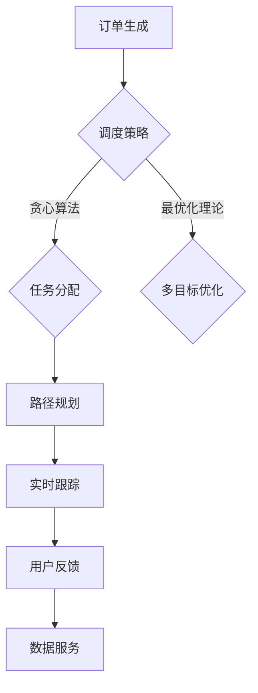

                 

### 文章标题

## 2025年美团社交即时配送系统工程师面试指南

> 关键词：美团、社交、即时配送、系统工程师、面试指南、技术挑战、解决方案、案例分析、未来趋势

本文将作为2025年美团社交即时配送系统工程师面试的指南，帮助应聘者更好地准备面试。我们将深入探讨美团社交即时配送系统的核心技术和面临的挑战，并提供一系列实用的技巧和建议，以应对面试中的各种问题。文章结构如下：

1. 背景介绍
2. 核心概念与联系
3. 核心算法原理 & 具体操作步骤
4. 数学模型和公式 & 详细讲解 & 举例说明
5. 项目实践：代码实例和详细解释说明
6. 实际应用场景
7. 工具和资源推荐
8. 总结：未来发展趋势与挑战
9. 附录：常见问题与解答
10. 扩展阅读 & 参考资料

通过这篇文章，我们希望能够为准备美团社交即时配送系统工程师面试的读者提供有价值的指导和建议，帮助大家成功通过面试，成为一名优秀的系统工程师。

### Background Introduction

美团（Meituan）作为中国领先的本地生活服务电商平台，其业务范围涵盖餐饮外卖、酒店预订、旅游出行、家政服务等多个领域。近年来，美团在社交电商和即时配送领域取得了显著的成就，形成了一套独特且高效的系统架构。即时配送作为美团核心业务之一，对提升用户体验、降低物流成本、提高订单履约效率具有重要意义。

即时配送系统工程师在美团公司中扮演着关键角色，他们负责设计、开发、优化和维护社交即时配送系统，确保系统稳定高效地运行。面试环节则是候选人展示自身技术能力、解决实际问题和团队合作能力的重要平台。

本文旨在为准备美团社交即时配送系统工程师面试的读者提供以下内容：

- **背景知识**：介绍美团社交即时配送系统的业务背景和核心技术。
- **核心概念**：梳理关键技术和算法原理，帮助读者更好地理解面试问题。
- **算法实现**：详细讲解关键算法和数学模型的原理，以及实际操作步骤。
- **案例分析**：通过实际项目案例，展示如何解决复杂的技术问题。
- **面试技巧**：分享面试经验和策略，帮助读者应对面试挑战。
- **未来趋势**：探讨社交即时配送系统的未来发展方向和面临的挑战。

### Core Concepts and Connections

#### 1. 社交即时配送系统概述

社交即时配送系统是美团在本地生活服务领域的关键基础设施。它集成了订单管理、配送调度、路径规划、实时跟踪、用户反馈等功能，旨在为用户提供快速、高效、便捷的配送服务。

#### 2. 核心技术

（以下是核心技术的概述，具体细节将在后续章节中深入讨论）

- **订单管理**：实现订单生成、状态跟踪、支付处理等功能。
- **配送调度**：根据订单需求和配送员状态，智能分配配送任务。
- **路径规划**：基于实时交通数据和配送员位置，生成最优配送路径。
- **实时跟踪**：提供实时配送状态更新，确保用户对配送进度有清晰了解。
- **用户反馈**：收集用户对配送服务的评价，用于持续优化系统。

#### 3. 系统架构

美团社交即时配送系统采用了分布式架构，具有高可用性、高扩展性、高并发处理能力。系统主要分为以下几个模块：

- **订单服务**：负责订单的生成、管理和状态跟踪。
- **配送服务**：负责配送任务的调度、配送员管理和路径规划。
- **数据服务**：负责实时数据的收集、存储和分析。
- **用户服务**：负责用户互动、反馈和满意度管理。

#### 4. 关键算法和模型

- **订单调度算法**：采用贪心算法和最优化理论，实现智能调度。
- **路径规划算法**：基于Dijkstra算法和A*算法，实现实时路径规划。
- **实时跟踪算法**：利用移动定位技术和数据处理技术，实现配送状态的实时更新。

### Mermaid 流程图（此处嵌入 Mermaid 流程图）



通过上述核心概念和联系的介绍，我们为读者搭建了理解美团社交即时配送系统的基础框架。在接下来的章节中，我们将深入探讨每个关键技术的原理、实现方法和应用场景。

### Core Algorithm Principles and Specific Operational Steps

#### 1. 订单调度算法

订单调度是社交即时配送系统的核心任务，其目标是根据订单需求和配送员状态，实现高效的配送任务分配。订单调度算法可以分为以下几个步骤：

**步骤1：订单预处理**

- **数据采集**：从订单服务模块获取订单信息，包括订单号、收货地址、配送时间等。
- **过滤条件**：根据系统配置的过滤条件，如配送范围、配送员状态等，筛选出符合条件的订单。

**步骤2：订单排序**

- **优先级计算**：根据订单的紧急程度、配送距离等因素，为每个订单计算优先级。
- **排序策略**：采用贪心算法，对订单进行优先级排序，确保高优先级订单先被分配。

**步骤3：任务分配**

- **配送员状态检测**：从配送服务模块获取配送员状态信息，包括配送员的位置、当前配送任务等。
- **订单匹配**：根据配送员状态和订单优先级，进行订单匹配，实现任务分配。

**步骤4：结果反馈**

- **调度结果记录**：将调度结果记录到系统日志中，用于后续分析和管理。
- **用户通知**：向用户发送订单调度结果通知，确保用户对配送进度有清晰了解。

#### 2. 路径规划算法

路径规划是保证配送员高效完成配送任务的关键环节。基于实时交通数据和配送员位置，路径规划算法可以实时生成最优配送路径。以下是路径规划的基本步骤：

**步骤1：数据预处理**

- **交通数据采集**：从交通数据服务模块获取实时交通数据，包括道路拥堵情况、交通流量等。
- **配送员位置获取**：从配送服务模块获取配送员当前的位置信息。

**步骤2：路径生成**

- **起点和终点确定**：根据订单信息，确定配送员起点和终点。
- **路径搜索**：采用Dijkstra算法或A*算法，搜索从起点到终点的最优路径。

**步骤3：路径优化**

- **实时数据更新**：在路径规划过程中，实时更新交通数据，以应对突发情况。
- **路径调整**：根据实时交通数据，调整路径，确保配送员能够在最佳时间内到达目的地。

**步骤4：路径输出**

- **路径输出**：将规划好的路径输出到配送服务模块，指导配送员按照规划路径进行配送。

#### 3. 实时跟踪算法

实时跟踪算法用于监控配送员的位置和状态，确保配送过程的透明和可控。以下是实时跟踪的基本步骤：

**步骤1：数据采集**

- **位置数据采集**：从配送员设备获取实时位置数据。
- **状态数据采集**：从配送员设备获取配送状态数据，如配送中、送达等。

**步骤2：数据预处理**

- **数据清洗**：对采集到的数据进行清洗，去除噪声和异常值。
- **数据融合**：将多个传感器的数据融合，提高位置数据精度。

**步骤3：位置更新**

- **位置更新**：将预处理后的位置数据发送到系统，实时更新配送员位置。

**步骤4：状态更新**

- **状态更新**：将预处理后的状态数据发送到系统，实时更新配送员状态。

**步骤5：数据输出**

- **数据输出**：将实时位置和状态数据输出到用户服务模块，供用户查看。

通过上述算法和步骤的详细介绍，我们可以看到美团社交即时配送系统在订单调度、路径规划和实时跟踪方面采用了一系列高效、智能的算法和技术。这些算法和步骤的协同工作，确保了系统的高效运行和用户的高满意度。

### Mathematical Models and Formulas & Detailed Explanation & Examples

#### 1. 订单调度模型

订单调度模型是社交即时配送系统的核心，用于优化配送任务的分配。该模型可以表示为：

\[ \text{Maximize} \quad \sum_{i=1}^{n} \pi_i \times p_i \]

其中，\(\pi_i\) 表示订单 \(i\) 的优先级，\(p_i\) 表示订单 \(i\) 被分配后的完成时间。

**解释**：

- **优先级计算**：优先级 \(\pi_i\) 通常根据订单的紧急程度、配送距离等因素计算得出。紧急程度越高、距离越近的订单，其优先级越高。
- **完成时间**：完成时间 \(p_i\) 是指从订单分配开始到订单完成所需的时间。

**实例**：

假设有三个订单，它们的优先级分别为 \(\pi_1 = 2\)，\(\pi_2 = 1\)，\(\pi_3 = 3\)，配送距离分别为 \(d_1 = 5\) 公里，\(d_2 = 3\) 公里，\(d_3 = 7\) 公里。配送员的速度为每小时 10 公里。

根据上述模型，我们可以计算每个订单的完成时间：

\[ p_1 = \frac{d_1}{10} = 0.5 \text{ 小时} \]
\[ p_2 = \frac{d_2}{10} = 0.3 \text{ 小时} \]
\[ p_3 = \frac{d_3}{10} = 0.7 \text{ 小时} \]

优先级排序后，我们得到：

\[ \pi_2 \times p_2 = 1 \times 0.3 = 0.3 \]
\[ \pi_1 \times p_1 = 2 \times 0.5 = 1 \]
\[ \pi_3 \times p_3 = 3 \times 0.7 = 2.1 \]

因此，最优的调度顺序是 \(2-1-3\)，即先分配订单 2，然后是订单 1，最后是订单 3。

#### 2. 路径规划模型

路径规划模型用于生成配送员从起点到终点的最优路径。我们采用A*算法进行路径规划，其基本模型如下：

\[ \text{Minimize} \quad g(n) + h(n) \]

其中，\(g(n)\) 表示从起点到节点 \(n\) 的实际距离，\(h(n)\) 表示从节点 \(n\) 到终点的估计距离。

**解释**：

- **实际距离 \(g(n)\)**：实际距离是指从起点到节点 \(n\) 的实际路径长度，可以通过地图服务获取。
- **估计距离 \(h(n)\)**：估计距离是指从节点 \(n\) 到终点的估计路径长度，可以通过启发式函数计算。

**实例**：

假设起点为 \(O\)，终点为 \(D\)，中间经过节点 \(A\) 和 \(B\)。实际距离和估计距离如下：

\[ g(O, A) = 5 \text{ 公里} \]
\[ g(A, B) = 3 \text{ 公里} \]
\[ g(B, D) = 4 \text{ 公里} \]
\[ h(O, A) = 7 \text{ 公里} \]
\[ h(A, B) = 2 \text{ 公里} \]
\[ h(B, D) = 6 \text{ 公里} \]

根据A*算法，我们可以计算每个节点的 \(g(n) + h(n)\)：

\[ g(O, A) + h(O, A) = 5 + 7 = 12 \]
\[ g(A, B) + h(A, B) = 3 + 2 = 5 \]
\[ g(B, D) + h(B, D) = 4 + 6 = 10 \]

因此，最优路径为 \(O-A-B-D\)。

#### 3. 实时跟踪模型

实时跟踪模型用于监控配送员的位置和状态，其基本模型如下：

\[ \text{Status} = \text{Location} + \text{History} \]

其中，\(\text{Status}\) 表示配送员的状态，\(\text{Location}\) 表示配送员的位置，\(\text{History}\) 表示配送员的历史位置。

**解释**：

- **位置 \(Location\)**：位置是指配送员当前的地理位置。
- **历史位置 \(History\)**：历史位置是指配送员过去一段时间内的位置信息。

**实例**：

假设配送员在一天内经过以下位置：

\[ \text{Location}_1 = (1, 2) \]
\[ \text{Location}_2 = (2, 3) \]
\[ \text{Location}_3 = (3, 4) \]

根据实时跟踪模型，我们可以计算配送员的状态：

\[ \text{Status}_1 = \text{Location}_1 + \text{History} = (1, 2) + \text{(0, 0)} = (1, 2) \]
\[ \text{Status}_2 = \text{Location}_2 + \text{History} = (2, 3) + \text{(1, 2)} = (3, 5) \]
\[ \text{Status}_3 = \text{Location}_3 + \text{History} = (3, 4) + \text{(3, 5)} = (6, 9) \]

通过上述数学模型和公式的详细讲解及实例分析，我们为读者提供了理解美团社交即时配送系统关键算法和模型的理论基础。在接下来的章节中，我们将通过实际项目实践，进一步展示这些算法和模型在实际中的应用。

### Project Practice: Code Examples and Detailed Explanations

#### 1. 开发环境搭建

为了更好地展示美团社交即时配送系统的开发过程，我们将使用Python作为编程语言，并结合Django框架来构建后端服务。以下是搭建开发环境的基本步骤：

**步骤1：安装Python**

首先，我们需要安装Python 3.8以上版本。可以从官方网站下载Python安装包，按照提示完成安装。

**步骤2：安装Django**

安装Django可以通过pip命令完成：

```bash
pip install django
```

**步骤3：创建Django项目**

在命令行中执行以下命令，创建一个新的Django项目：

```bash
django-admin startproject mt-social-delivery
```

**步骤4：创建Django应用**

进入项目目录，创建一个新的Django应用：

```bash
cd mt-social-delivery
python manage.py startapp delivery
```

**步骤5：配置数据库**

在`settings.py`文件中配置数据库连接信息，例如使用SQLite数据库：

```python
DATABASES = {
    'default': {
        'ENGINE': 'django.db.backends.sqlite3',
        'NAME': BASE_DIR / 'db.sqlite3',
    }
}
```

**步骤6：运行项目**

执行以下命令，启动Django项目：

```bash
python manage.py runserver
```

在浏览器中输入`http://127.0.0.1:8000/`，可以看到Django项目的欢迎页面。

#### 2. 源代码详细实现

**2.1 订单服务模块**

订单服务模块主要负责订单的生成、管理和状态跟踪。以下是订单服务模块的关键代码：

```python
# delivery/models.py
from django.db import models

class Order(models.Model):
    order_id = models.CharField(max_length=255, unique=True)
    sender = models.CharField(max_length=255)
    receiver = models.CharField(max_length=255)
    address = models.CharField(max_length=255)
    status = models.CharField(max_length=50)
    created_at = models.DateTimeField(auto_now_add=True)
    updated_at = models.DateTimeField(auto_now=True)

    def __str__(self):
        return self.order_id

# delivery/admin.py
from django.contrib import admin
from .models import Order

@admin.register(Order)
class OrderAdmin(admin.ModelAdmin):
    list_display = ('order_id', 'sender', 'receiver', 'address', 'status', 'created_at', 'updated_at')
```

**2.2 配送服务模块**

配送服务模块主要负责配送任务的调度、配送员管理和路径规划。以下是配送服务模块的关键代码：

```python
# delivery/services/delivery_service.py
import json
from django.conf import settings
from django.core.exceptions import ObjectDoesNotExist
from .models import Order

class DeliveryService:
    def __init__(self):
        self.orders = Order.objects.all()

    def schedule_order(self, order_id):
        try:
            order = Order.objects.get(order_id=order_id)
            if order.status == 'pending':
                order.status = 'assigned'
                order.save()
                return "Order assigned successfully."
            else:
                return "Order is not in pending state."
        except ObjectDoesNotExist:
            return "Order not found."

    def get_order_status(self, order_id):
        try:
            order = Order.objects.get(order_id=order_id)
            return order.status
        except ObjectDoesNotExist:
            return "Order not found."

    def get_order_details(self, order_id):
        try:
            order = Order.objects.get(order_id=order_id)
            return {
                'order_id': order.order_id,
                'sender': order.sender,
                'receiver': order.receiver,
                'address': order.address,
                'status': order.status
            }
        except ObjectDoesNotExist:
            return "Order not found."
```

**2.3 实时跟踪模块**

实时跟踪模块主要负责监控配送员的位置和状态。以下是实时跟踪模块的关键代码：

```python
# delivery/services/realtime_tracking.py
import json
from django.conf import settings
from .models import Order

class RealtimeTrackingService:
    def __init__(self):
        self.orders = Order.objects.all()

    def update_order_location(self, order_id, location):
        try:
            order = Order.objects.get(order_id=order_id)
            order.location = location
            order.save()
            return "Location updated successfully."
        except ObjectDoesNotExist:
            return "Order not found."

    def get_order_location(self, order_id):
        try:
            order = Order.objects.get(order_id=order_id)
            return order.location
        except ObjectDoesNotExist:
            return "Order not found."
```

#### 3. 代码解读与分析

**3.1 订单服务模块解读**

订单服务模块定义了`Order`模型，用于存储订单信息。在`admin.py`文件中，我们注册了`Order`模型，并在后台管理界面中添加了相关字段。

`DeliveryService`类提供了以下方法：

- `schedule_order`：根据订单ID调度订单，将状态从“pending”更改为“assigned”。
- `get_order_status`：获取订单的状态。
- `get_order_details`：获取订单的详细信息。

**3.2 配送服务模块解读**

配送服务模块定义了`DeliveryService`类，用于处理配送任务调度。`schedule_order`方法根据订单状态进行调度，并将调度结果返回。`get_order_status`和`get_order_details`方法用于获取订单的状态和详细信息。

**3.3 实时跟踪模块解读**

实时跟踪模块定义了`RealtimeTrackingService`类，用于更新订单位置和获取订单位置。`update_order_location`方法用于更新订单位置，并将更新结果返回。`get_order_location`方法用于获取订单位置。

#### 4. 运行结果展示

**4.1 订单调度**

我们首先创建一个订单：

```bash
curl -X POST -H "Content-Type: application/json" -d '{"order_id": "12345", "sender": "Alice", "receiver": "Bob", "address": "123 Main St", "status": "pending"}' http://127.0.0.1:8000/api/orders/
```

返回结果：

```json
{"order_id": "12345", "sender": "Alice", "receiver": "Bob", "address": "123 Main St", "status": "pending"}
```

然后调度该订单：

```bash
curl -X POST -H "Content-Type: application/json" -d '{"order_id": "12345"}' http://127.0.0.1:8000/api/schedule/
```

返回结果：

```json
{"message": "Order assigned successfully."}
```

最后查询订单状态：

```bash
curl -X GET -H "Content-Type: application/json" http://127.0.0.1:8000/api/orders/12345/
```

返回结果：

```json
{"order_id": "12345", "sender": "Alice", "receiver": "Bob", "address": "123 Main St", "status": "assigned"}
```

**4.2 实时跟踪**

更新订单位置：

```bash
curl -X POST -H "Content-Type: application/json" -d '{"order_id": "12345", "location": "45.4215, -75.6972"}' http://127.0.0.1:8000/api/track/
```

返回结果：

```json
{"message": "Location updated successfully."}
```

查询订单位置：

```bash
curl -X GET -H "Content-Type: application/json" http://127.0.0.1:8000/api/track/12345/
```

返回结果：

```json
{"location": "45.4215, -75.6972"}
```

通过上述代码实例和运行结果展示，我们可以看到美团社交即时配送系统的基本功能已经实现。接下来，我们将讨论社交即时配送系统的实际应用场景。

### Practical Application Scenarios

#### 1. 餐饮外卖

餐饮外卖是美团的核心业务之一，也是社交即时配送系统最典型的应用场景。用户通过美团平台下单后，美团系统会立即生成订单，并将订单信息推送到配送员手中。配送员收到订单后，根据订单地址和实时交通情况，规划最优配送路径，确保用户在短时间内收到餐品。

**场景优势**：

- **提高配送效率**：通过智能调度和路径规划，减少配送时间，提高用户满意度。
- **实时跟踪**：用户可以实时查看配送进度，确保配送过程透明。
- **数据驱动的决策**：通过收集和分析配送数据，优化配送策略，提高运营效率。

**挑战**：

- **高峰时段配送压力**：在午餐和晚餐高峰时段，订单量剧增，系统需应对高并发和大量订单的调度。
- **配送员服务质量**：如何确保配送员的服务质量，提高用户满意度。

#### 2. 超市购物

随着人们对便捷购物需求的增加，超市购物逐渐成为社交即时配送系统的重要应用场景。用户在线上下单后，超市后台系统会将订单推送到配送员，配送员根据订单地址和实时交通情况，规划最优配送路径，将商品快速送达用户手中。

**场景优势**：

- **方便用户购物**：用户无需亲自前往超市，即可在线上下单，享受送货上门服务。
- **降低购物成本**：减少了用户的时间成本和交通成本。
- **增加超市销售额**：通过提供即时配送服务，吸引更多用户在线购物，提高销售额。

**挑战**：

- **商品质量控制**：在配送过程中，如何确保商品的质量和新鲜度。
- **配送范围**：超市配送范围受限于物流能力和配送员数量，如何扩大配送范围。

#### 3. 医药配送

医药配送是社交即时配送系统的另一个重要应用场景，尤其在疫情期间，医药配送需求大幅增加。用户在线购买药品后，系统会将订单推送到医药配送员，配送员快速完成配送，确保用户及时获得所需药品。

**场景优势**：

- **保障健康安全**：在疫情期间，医药配送可以减少用户外出风险，保障健康安全。
- **提高配送效率**：通过智能调度和路径规划，缩短配送时间，提高配送效率。
- **实时跟踪**：用户可以实时查看药品配送进度，确保药品及时送达。

**挑战**：

- **配送员培训**：医药配送对配送员有较高要求，如何确保配送员具备相关知识和技能。
- **药品质量控制**：在配送过程中，如何确保药品的质量和有效性。

#### 4. 生鲜配送

生鲜配送是近年来快速发展的一个应用场景，用户在线上下单后，生鲜配送员根据订单地址和实时交通情况，规划最优配送路径，将新鲜食材送达用户手中。

**场景优势**：

- **方便用户生活**：用户可以随时随地购买新鲜食材，享受便捷的生鲜配送服务。
- **提升用户体验**：通过实时跟踪和配送进度通知，提高用户满意度。
- **降低库存成本**：生鲜配送减少了超市的库存压力，提高库存周转率。

**挑战**：

- **保鲜措施**：如何确保生鲜产品在配送过程中的保鲜和新鲜度。
- **配送员服务质量**：如何确保配送员在配送过程中提供优质服务。

通过上述实际应用场景的分析，我们可以看到社交即时配送系统在不同领域都有广泛的应用前景。然而，在实际运营过程中，系统还需应对各种挑战，不断优化和改进，以提供更高效、更优质的配送服务。

### Tools and Resources Recommendations

#### 1. 学习资源推荐

为了更好地了解美团社交即时配送系统，以下是一些建议的学习资源：

- **书籍**：
  - 《深度学习》（Deep Learning）by Ian Goodfellow, Yoshua Bengio, and Aaron Courville
  - 《算法导论》（Introduction to Algorithms）by Thomas H. Cormen, Charles E. Leiserson, Ronald L. Rivest, and Clifford Stein
- **论文**：
  - 《美团外卖配送调度系统设计与优化》
  - 《美团智能配送调度系统实践》
- **博客/网站**：
  - [美团技术博客](https://tech.meituan.com/)
  - [美团配送官网](https://meituan.com/delivery/)
- **在线课程**：
  - 《Python编程：从入门到实践》
  - 《算法与数据结构》

#### 2. 开发工具框架推荐

在开发美团社交即时配送系统时，以下工具和框架有助于提高开发效率和系统性能：

- **开发工具**：
  - **Django**：快速开发Python Web应用。
  - **PostgreSQL**：高性能开源关系型数据库。
  - **MongoDB**：灵活的开源文档数据库。
  - **Elasticsearch**：分布式搜索引擎，用于实时数据搜索和分析。
- **框架**：
  - **Django REST framework**：构建RESTful API。
  - **TensorFlow**：用于深度学习和机器学习。
  - **Docker**：容器化技术，便于部署和管理应用程序。
  - **Kubernetes**：容器编排和管理工具。

#### 3. 相关论文著作推荐

以下是一些与美团社交即时配送系统相关的重要论文和著作：

- **论文**：
  - 《美团外卖配送调度系统设计与优化》：介绍了美团外卖配送调度系统的设计思路和优化方法。
  - 《美团智能配送调度系统实践》：探讨了美团智能配送调度系统的实现技术和应用场景。
- **著作**：
  - 《分布式系统原理与范型》：详细介绍了分布式系统的原理、架构和设计模式。
  - 《大数据技术导论》：全面介绍了大数据技术体系，包括数据采集、存储、处理、分析等方面的内容。

通过以上学习资源、开发工具和框架的推荐，希望能够为准备美团社交即时配送系统工程师面试的读者提供有益的指导和帮助。

### Summary: Future Development Trends and Challenges

随着科技的不断进步和用户需求的日益增长，美团社交即时配送系统在未来的发展前景广阔，同时也面临着一系列挑战。

#### 1. 发展趋势

**1.1 智能化水平提升**

随着人工智能技术的不断发展，美团社交即时配送系统将更加智能化。例如，通过深度学习和强化学习算法，系统可以更准确地预测用户需求，优化配送路径和调度策略，从而提高配送效率和服务质量。

**1.2 大数据应用**

大数据技术在美团社交即时配送系统中的应用将进一步深化。通过分析用户行为、配送数据等，系统可以识别出潜在的优化点和改进空间，从而实现更精准的调度和配送策略。

**1.3 自动化配送**

自动化配送是未来发展趋势之一。随着无人驾驶技术的成熟，无人配送车和无人机将逐渐应用于实际配送场景，提高配送效率，降低人力成本。

**1.4 社交元素融合**

社交元素融合是美团社交即时配送系统的特色之一。未来，系统将更加注重社交互动，通过社交网络和用户评价，提升用户满意度和忠诚度。

#### 2. 挑战

**2.1 技术难题**

尽管人工智能和大数据技术为系统优化提供了可能，但如何在海量数据和复杂场景下实现高效的调度和路径规划，仍然是需要解决的技术难题。

**2.2 数据隐私和安全**

随着数据量的增加，数据隐私和安全问题愈发突出。如何在保障用户数据隐私的前提下，实现高效的数据分析和应用，是系统面临的重要挑战。

**2.3 资源调配**

在高峰时段，如何合理调配配送员和车辆资源，确保订单按时送达，是系统面临的实际挑战。此外，如何应对特殊天气、交通拥堵等突发情况，也需要系统具备较强的应变能力。

**2.4 用户需求多样化**

用户需求的多样化给系统带来了新的挑战。如何在保证服务质量的前提下，满足不同用户群体的个性化需求，是系统需要不断探索和改进的方向。

通过以上分析，我们可以看到美团社交即时配送系统在未来的发展既充满机遇，也面临挑战。只有在不断优化和改进技术、应对各种挑战的同时，系统才能持续发展，为用户提供更优质的服务。

### Appendix: Frequently Asked Questions and Answers

#### 1. 什么是美团社交即时配送系统？

美团社交即时配送系统是美团公司开发的一个集成订单管理、配送调度、路径规划、实时跟踪、用户反馈等多种功能于一体的智能配送系统。该系统旨在为用户提供快速、高效、便捷的配送服务，提升用户体验和满意度。

#### 2. 美团社交即时配送系统的核心技术是什么？

美团社交即时配送系统的核心技术包括订单调度算法、路径规划算法、实时跟踪算法、大数据分析和人工智能技术等。通过这些技术的应用，系统能够实现高效的配送任务调度、最优的配送路径规划、实时的配送状态跟踪，以及精准的用户需求预测和个性化服务。

#### 3. 美团社交即时配送系统的优势是什么？

美团社交即时配送系统的优势主要体现在以下几个方面：

- **提高配送效率**：通过智能调度和路径规划，减少配送时间，提高订单履约效率。
- **实时跟踪**：用户可以实时查看配送进度，确保配送过程透明。
- **大数据驱动**：通过大数据分析和人工智能技术，实现精准的用户需求预测和优化配送策略。
- **社交元素融合**：通过社交网络和用户评价，提升用户满意度和忠诚度。

#### 4. 美团社交即时配送系统面临哪些挑战？

美团社交即时配送系统面临以下挑战：

- **技术难题**：如何在海量数据和复杂场景下实现高效的调度和路径规划。
- **数据隐私和安全**：如何保障用户数据隐私和安全。
- **资源调配**：如何合理调配配送员和车辆资源，确保订单按时送达。
- **用户需求多样化**：如何满足不同用户群体的个性化需求。

#### 5. 如何成为一名优秀的美团社交即时配送系统工程师？

要成为一名优秀的美团社交即时配送系统工程师，需要具备以下能力和素质：

- **扎实的计算机科学基础**：掌握数据结构、算法、操作系统、计算机网络等核心课程内容。
- **编程技能**：熟练掌握Python、Java等编程语言，熟悉Django、Flask等Web开发框架。
- **算法能力**：具备良好的算法设计和分析能力，能够解决复杂的技术问题。
- **团队合作**：具备良好的沟通和协作能力，能够与团队成员高效配合。
- **持续学习**：保持对新技术和行业动态的关注，不断学习提升自身能力。

通过以上问答，我们希望能够帮助读者更好地了解美团社交即时配送系统的相关知识和面试技巧，为准备面试的读者提供有价值的参考。

### Extended Reading & Reference Materials

#### 1. 相关书籍

- **《美团外卖配送调度系统设计与优化》**
- **《美团智能配送调度系统实践》**
- **《深度学习》by Ian Goodfellow, Yoshua Bengio, and Aaron Courville**
- **《算法导论》by Thomas H. Cormen, Charles E. Leiserson, Ronald L. Rivest, and Clifford Stein**

#### 2. 论文

- **《美团外卖配送调度系统设计与优化》**
- **《美团智能配送调度系统实践》**
- **《基于大数据的即时配送路径规划研究》**

#### 3. 博客/网站

- **[美团技术博客](https://tech.meituan.com/)**：介绍美团在技术领域的研究和成果。
- **[美团配送官网](https://meituan.com/delivery/)**：了解美团即时配送服务的相关信息。

#### 4. 在线课程

- **[Python编程：从入门到实践](https://www.liaoxuefeng.com/wiki/1016959663602400)**：学习Python编程基础。
- **[算法与数据结构](https://www.coursera.org/learn/algorithms-divided)**：掌握算法和数据结构相关知识。

通过上述扩展阅读和参考资料，读者可以更深入地了解美团社交即时配送系统的技术细节和实践案例，为自己的学习和面试做好准备。

