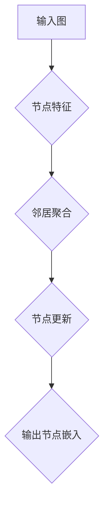

                 

## 图神经网络：复杂关系数据的深度学习

> 关键词：图神经网络、图数据、深度学习、节点嵌入、关系学习、应用场景

## 1. 背景介绍

随着数据量的爆炸式增长，传统机器学习方法在处理复杂关系数据时遇到了瓶颈。传统方法往往将数据简化为独立的特征向量，忽略了数据之间的潜在联系和结构信息。而图神经网络（Graph Neural Networks，GNN）作为一种新兴的深度学习方法，能够有效地学习图结构数据中的复杂关系，并取得了令人瞩目的成果。

图数据广泛存在于现实世界中，例如社交网络、知识图谱、分子结构、交通网络等。这些数据以节点和边表示，节点代表实体，边代表实体之间的关系。传统的机器学习方法难以有效地处理这种结构化数据，而图神经网络则能够利用图结构信息，学习节点之间的潜在关系，从而更好地理解和分析图数据。

## 2. 核心概念与联系

图神经网络的核心概念是**节点嵌入**和**关系学习**。

* **节点嵌入**是指将图中的每个节点映射到一个低维向量空间中，每个向量代表节点的特征和语义。通过学习节点嵌入，GNN 可以捕捉节点之间的相似性和关系。
* **关系学习**是指学习图中边的类型和方向，并将其编码为向量表示。通过学习关系嵌入，GNN 可以理解节点之间的关系类型和强度。

**图神经网络架构**



**图神经网络的优势:**

* **能够有效地学习图结构数据中的复杂关系。**
* **能够处理非结构化数据，例如文本和图像。**
* **能够进行节点分类、边预测、图分类等多种任务。**

## 3. 核心算法原理 & 具体操作步骤

### 3.1  算法原理概述

图神经网络的核心算法是**图卷积网络（Graph Convolutional Network，GCN）**。GCN 通过迭代地聚合邻居节点的信息，更新节点的特征表示，最终学习到节点的嵌入向量。

### 3.2  算法步骤详解

1. **初始化节点特征:** 将每个节点的特征向量初始化为一个随机向量。
2. **邻居聚合:** 对于每个节点，聚合其邻居节点的特征信息。常用的聚合方法包括求平均、求和、最大值等。
3. **节点更新:** 使用聚合后的邻居信息更新节点的特征向量。更新规则通常是一个线性变换，加上一个偏差项。
4. **迭代更新:** 重复步骤2和步骤3，直到节点特征收敛。

### 3.3  算法优缺点

**优点:**

* **能够有效地学习图结构数据中的复杂关系。**
* **参数量相对较少，易于训练。**
* **能够处理稀疏图数据。**

**缺点:**

* **对于深度图数据，GCN 的性能可能下降。**
* **难以处理动态图数据。**

### 3.4  算法应用领域

* **社交网络分析:** 预测用户关系、识别社区结构、推荐好友等。
* **知识图谱推理:** 链接实体、预测关系、进行知识问答等。
* **分子结构分析:** 预测分子性质、设计新分子等。
* **推荐系统:** 基于用户-商品交互图进行推荐。

## 4. 数学模型和公式 & 详细讲解 & 举例说明

### 4.1  数学模型构建

图神经网络的数学模型可以表示为一个图卷积层，其输入是图的节点特征矩阵，输出是节点的嵌入向量。

设图 $G = (V, E)$，其中 $V$ 是节点集合，$E$ 是边集合。每个节点 $v \in V$ 都有一个特征向量 $h_v \in \mathbb{R}^d$。图卷积层的输出节点嵌入向量 $h'_v$ 可以表示为：

$$h'_v = \sigma(\sum_{u \in N(v)} \frac{e_{uv}}{ \sqrt{d(v)}} W h_u + b)$$

其中：

* $N(v)$ 是节点 $v$ 的邻居节点集合。
* $e_{uv}$ 是节点 $u$ 和 $v$ 之间的边权重。
* $d(v)$ 是节点 $v$ 的度数。
* $W$ 是一个权重矩阵。
* $b$ 是一个偏差项。
* $\sigma$ 是一个激活函数，例如ReLU函数。

### 4.2  公式推导过程

图卷积层的公式推导过程可以分为以下几个步骤：

1. **邻居聚合:** 对于每个节点 $v$，聚合其邻居节点的特征信息。
2. **权重归一化:** 为了避免度数较高的节点对聚合结果产生过大的影响，对邻居节点的特征信息进行权重归一化。
3. **线性变换:** 使用权重矩阵 $W$ 对聚合后的邻居信息进行线性变换。
4. **激活函数:** 使用激活函数 $\sigma$ 对线性变换后的结果进行非线性映射。

### 4.3  案例分析与讲解

例如，在社交网络分析中，我们可以使用图卷积网络来预测用户之间的关系。

* 节点特征：用户的信息，例如年龄、性别、兴趣爱好等。
* 边特征：用户之间的交互关系，例如点赞、评论、转发等。

通过学习图卷积网络，我们可以得到用户之间的关系嵌入向量，并根据这些向量预测用户之间的关系类型，例如朋友关系、同事关系等。

## 5. 项目实践：代码实例和详细解释说明

### 5.1  开发环境搭建

* Python 3.6+
* TensorFlow/PyTorch

### 5.2  源代码详细实现

```python
import tensorflow as tf

# 定义图卷积层
class GCNLayer(tf.keras.layers.Layer):
    def __init__(self, units, activation=tf.nn.relu):
        super(GCNLayer, self).__init__()
        self.units = units
        self.activation = activation
        self.W = tf.Variable(tf.random.normal([units, units]))

    def call(self, inputs):
        # 邻居聚合
        neighbors = tf.gather_nd(inputs, indices)
        # 权重归一化
        normalized_neighbors = neighbors / tf.sqrt(tf.reduce_sum(tf.gather_nd(degrees, indices), axis=1, keepdims=True))
        # 线性变换
        transformed_neighbors = tf.matmul(normalized_neighbors, self.W)
        # 激活函数
        output = self.activation(tf.reduce_sum(transformed_neighbors, axis=1))
        return output

# 定义图神经网络模型
class GCNModel(tf.keras.Model):
    def __init__(self, units, num_layers):
        super(GCNModel, self).__init__()
        self.layers = [GCNLayer(units) for _ in range(num_layers)]

    def call(self, inputs):
        # 迭代图卷积层
        for layer in self.layers:
            inputs = layer(inputs)
        return inputs

# 实例化模型
model = GCNModel(units=64, num_layers=2)

# 训练模型
# ...

```

### 5.3  代码解读与分析

* `GCNLayer` 类定义了图卷积层，包含邻居聚合、权重归一化、线性变换和激活函数等步骤。
* `GCNModel` 类定义了图神经网络模型，包含多个图卷积层。
* 代码示例展示了如何实例化模型并进行训练。

### 5.4  运行结果展示

训练后的模型可以用于预测节点的类别、边类型等任务。

## 6. 实际应用场景

### 6.1  社交网络分析

* **用户关系预测:** 预测用户之间的朋友关系、同事关系等。
* **社区发现:** 识别社交网络中的社区结构。
* **推荐系统:** 基于用户-商品交互图进行商品推荐。

### 6.2  知识图谱推理

* **实体链接:** 将文本中的实体链接到知识图谱中的对应实体。
* **关系预测:** 预测知识图谱中实体之间的关系。
* **知识问答:** 基于知识图谱回答用户的问题。

### 6.3  分子结构分析

* **分子性质预测:** 预测分子的性质，例如毒性、生物活性等。
* **新分子设计:** 设计具有特定性质的新分子。
* **药物研发:** 发现新的药物候选物。

### 6.4  未来应用展望

* **动态图数据分析:** 处理时间变化的图数据，例如社交网络中的用户关系变化。
* **图生成:** 生成新的图数据，例如生成化学分子结构。
* **图数据可视化:** 将图数据可视化，帮助人们更好地理解图结构信息。

## 7. 工具和资源推荐

### 7.1  学习资源推荐

* **书籍:**
    * 《图神经网络：复杂关系数据的深度学习》
    * 《Deep Learning on Graphs: Concepts, Algorithms, and Applications》
* **课程:**
    * Coursera: Graph Neural Networks Specialization
    * Udacity: Deep Learning Nanodegree

### 7.2  开发工具推荐

* **TensorFlow:** https://www.tensorflow.org/
* **PyTorch:** https://pytorch.org/
* **DGL:** https://dgl.ai/

### 7.3  相关论文推荐

* 《Semi-Supervised Classification with Graph Convolutional Networks》
* 《Graph Attention Networks》
* 《Inductive Representation Learning on Large Graphs》

## 8. 总结：未来发展趋势与挑战

### 8.1  研究成果总结

图神经网络在处理复杂关系数据方面取得了显著的成果，并在多个领域得到了广泛应用。

### 8.2  未来发展趋势

* **理论研究:** 深入研究图神经网络的理论基础，例如图卷积的性质、节点嵌入的性质等。
* **算法创新:** 开发新的图神经网络算法，例如能够处理动态图数据、高维图数据等。
* **应用扩展:** 将图神经网络应用到更多领域，例如自然语言处理、计算机视觉等。

### 8.3  面临的挑战

* **数据稀疏性:** 图数据往往是稀疏的，这使得图神经网络的训练难度较大。
* **模型解释性:** 图神经网络的模型解释性较差，难以理解模型的决策过程。
* **计算效率:** 对于大型图数据，图神经网络的训练和推理效率较低。

### 8.4  研究展望

未来，图神经网络的研究将继续朝着理论深度、算法效率、应用广度等方面发展，并为解决现实世界中的复杂问题提供新的解决方案。

## 9. 附录：常见问题与解答

* **什么是图神经网络？**

图神经网络是一种能够学习图结构数据中复杂关系的深度学习方法。

* **图神经网络有哪些应用场景？**

图神经网络在社交网络分析、知识图谱推理、分子结构分析等领域都有广泛的应用。

* **如何选择合适的图神经网络算法？**

选择合适的图神经网络算法需要根据具体任务和数据特点进行选择。

* **如何训练图神经网络？**

图神经网络的训练方法与传统的深度学习方法类似，需要使用训练数据进行模型训练和参数优化。


作者：禅与计算机程序设计艺术 / Zen and the Art of Computer Programming 
<end_of_turn>

