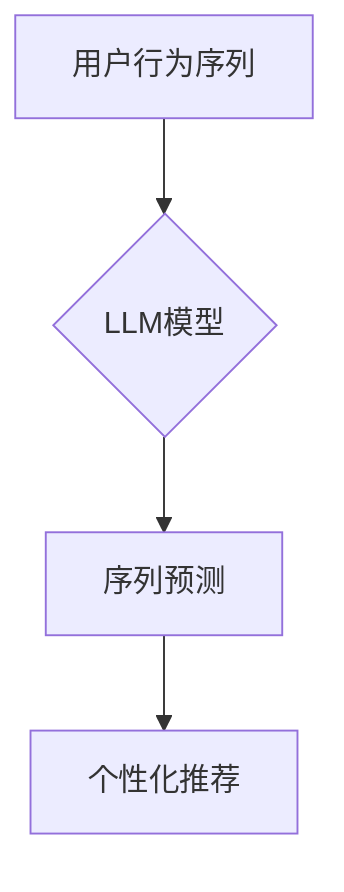

                 

## 基于LLM的推荐系统用户行为序列预测

> 关键词：LLM,推荐系统,用户行为序列预测,自然语言处理,深度学习,Transformer,序列模型

## 1. 背景介绍

推荐系统是互联网时代的重要组成部分，旨在根据用户的历史行为、偏好和上下文信息，预测用户可能感兴趣的内容并提供个性化推荐。传统的推荐系统主要依赖于协同过滤、内容过滤和基于知识的推荐算法，但这些方法在处理用户行为序列数据方面存在局限性。

近年来，大语言模型 (LLM) 在自然语言处理 (NLP) 领域取得了突破性进展，其强大的文本理解和生成能力为推荐系统带来了新的机遇。LLM 可以学习用户行为序列中的复杂模式和语义关系，从而更准确地预测用户的下一个行为。

基于LLM的推荐系统用户行为序列预测，是指利用LLM模型对用户的历史行为序列进行学习和分析，预测用户未来可能采取的行动，例如点击、购买、评论等。这种方法能够更好地捕捉用户行为的动态性和个性化特征，从而提供更精准、更个性化的推荐。

## 2. 核心概念与联系

### 2.1  用户行为序列

用户行为序列是指用户在特定时间段内进行的一系列交互行为，例如浏览商品、添加购物车、购买商品、阅读评论等。这些行为序列蕴含着用户的兴趣、偏好和购买意图等重要信息。

### 2.2  大语言模型 (LLM)

LLM 是指在海量文本数据上训练的深度学习模型，具有强大的文本理解和生成能力。常见的LLM模型包括GPT-3、BERT、LaMDA等。

### 2.3  序列模型

序列模型是一种专门用于处理序列数据的机器学习模型，例如自然语言、时间序列等。序列模型能够学习序列数据中的依赖关系和模式，并根据这些信息进行预测。

**核心概念与架构流程图**



## 3. 核心算法原理 & 具体操作步骤

### 3.1  算法原理概述

基于LLM的推荐系统用户行为序列预测主要利用Transformer架构的序列模型，例如GPT或BERT，来学习用户行为序列中的模式和关系。

Transformer模型的核心是注意力机制，它能够捕捉序列中不同元素之间的依赖关系，并赋予每个元素不同的权重。通过训练，模型能够学习到用户行为序列中哪些特征更能预测用户的下一个行为。

### 3.2  算法步骤详解

1. **数据预处理:** 将用户行为序列数据转换为模型可理解的格式，例如将行为类型编码为数字，并对序列进行padding或truncating等操作。
2. **模型训练:** 使用预处理后的数据训练Transformer模型，模型的目标是预测用户行为序列的下一个元素。
3. **模型评估:** 使用测试数据评估模型的性能，常用的指标包括准确率、召回率、F1-score等。
4. **模型部署:** 将训练好的模型部署到生产环境中，用于实时预测用户的下一个行为。

### 3.3  算法优缺点

**优点:**

* 能够捕捉用户行为序列中的复杂模式和语义关系。
* 性能优于传统的推荐算法。
* 可以处理各种类型的用户行为数据。

**缺点:**

* 需要大量的训练数据。
* 计算资源需求高。
* 模型解释性较差。

### 3.4  算法应用领域

* **电商推荐:** 预测用户可能购买的商品。
* **内容推荐:** 预测用户可能感兴趣的内容，例如新闻、视频、音乐等。
* **社交推荐:** 预测用户可能想要关注的用户或群组。
* **广告推荐:** 预测用户可能点击的广告。

## 4. 数学模型和公式 & 详细讲解 & 举例说明

### 4.1  数学模型构建

基于LLM的推荐系统用户行为序列预测通常使用Transformer模型，其核心是注意力机制。

**注意力机制**

注意力机制允许模型关注输入序列中与预测目标相关的部分，并赋予这些部分更高的权重。

**公式:**

$$
\text{Attention}(Q, K, V) = \text{softmax}\left(\frac{QK^T}{\sqrt{d_k}}\right)V
$$

其中:

* $Q$：查询矩阵
* $K$：键矩阵
* $V$：值矩阵
* $d_k$：键向量的维度
* $\text{softmax}$：softmax函数

**举例说明:**

假设用户行为序列为：[浏览商品A，添加购物车，浏览商品B，购买商品A]。

在预测用户下一个行为时，注意力机制会将查询向量与所有历史行为的键向量进行比较，并计算出每个行为的注意力权重。例如，对于“购买商品A”这个行为，注意力权重可能较高，因为它是用户最近的行为，并且与预测的下一个行为（可能再次购买商品A）相关。

### 4.2  公式推导过程

注意力机制的公式推导过程较为复杂，涉及到矩阵运算、线性变换和softmax函数等。

**推导过程:**

1. 将输入序列转换为查询向量、键向量和值向量。
2. 计算查询向量与所有键向量的点积。
3. 对点积结果进行归一化，得到注意力权重。
4. 将注意力权重与值向量进行加权求和，得到最终的输出。

### 4.3  案例分析与讲解

通过案例分析，可以更直观地理解注意力机制在用户行为序列预测中的应用。

**案例:**

假设一个用户浏览了以下商品序列：[手机，耳机，充电宝，笔记本电脑]。

使用基于LLM的推荐系统，模型可以学习到用户对电子产品的兴趣，并根据用户的浏览历史预测用户可能购买的下一个商品。

**分析:**

由于用户浏览了手机、耳机、充电宝等电子产品，模型会将这些商品的注意力权重设置较高，从而预测用户可能购买笔记本电脑。

## 5. 项目实践：代码实例和详细解释说明

### 5.1  开发环境搭建

* Python 3.7+
* PyTorch 或 TensorFlow
* CUDA 和 cuDNN (可选，用于GPU加速)

### 5.2  源代码详细实现

```python
import torch
import torch.nn as nn

class Transformer(nn.Module):
    def __init__(self, input_size, hidden_size, num_layers, num_heads):
        super(Transformer, self).__init__()
        self.embedding = nn.Embedding(input_size, hidden_size)
        self.transformer_encoder = nn.TransformerEncoder(
            nn.TransformerEncoderLayer(hidden_size, num_heads), num_layers
        )

    def forward(self, x):
        x = self.embedding(x)
        x = self.transformer_encoder(x)
        return x

# 实例化模型
model = Transformer(input_size=10000, hidden_size=512, num_layers=6, num_heads=8)

# 定义损失函数和优化器
criterion = nn.CrossEntropyLoss()
optimizer = torch.optim.Adam(model.parameters(), lr=0.001)

# 训练模型
for epoch in range(num_epochs):
    for batch in data_loader:
        inputs, targets = batch
        outputs = model(inputs)
        loss = criterion(outputs, targets)
        optimizer.zero_grad()
        loss.backward()
        optimizer.step()

```

### 5.3  代码解读与分析

* **模型结构:** 代码实现了基于Transformer的序列模型，包含嵌入层、Transformer编码器等部分。
* **数据处理:** 需要将用户行为序列数据转换为模型可理解的格式，例如将行为类型编码为数字。
* **训练过程:** 使用交叉熵损失函数和Adam优化器训练模型，并使用验证集评估模型性能。

### 5.4  运行结果展示

训练完成后，可以使用测试集评估模型的性能，并可视化预测结果。

## 6. 实际应用场景

### 6.1  电商推荐

基于LLM的推荐系统可以帮助电商平台更精准地推荐商品，提高用户转化率。例如，可以根据用户的浏览历史、购买记录和购物车内容，预测用户可能感兴趣的商品，并将其推荐给用户。

### 6.2  内容推荐

在内容推荐领域，LLM可以帮助平台推荐用户可能感兴趣的文章、视频、音乐等内容。例如，可以根据用户的阅读历史、点赞记录和评论内容，预测用户可能感兴趣的主题和类型，并推荐相关内容。

### 6.3  社交推荐

LLM可以帮助社交平台推荐用户可能想要关注的用户或群组。例如，可以根据用户的社交关系、兴趣爱好和行为模式，预测用户可能感兴趣的用户或群组，并将其推荐给用户。

### 6.4  未来应用展望

随着LLM技术的不断发展，其在推荐系统中的应用场景将更加广泛。例如，可以利用LLM生成个性化的推荐文案，提高用户点击率；可以利用LLM理解用户的隐性需求，提供更精准的推荐；可以利用LLM跨领域推荐，例如将用户的电商行为与社交行为进行关联，提供更全面的推荐。

## 7. 工具和资源推荐

### 7.1  学习资源推荐

* **书籍:**
    * 《深度学习》
    * 《自然语言处理》
    * 《Transformer模型详解》
* **在线课程:**
    * Coursera: 深度学习
    * Udacity: 自然语言处理
    * fast.ai: 深度学习

### 7.2  开发工具推荐

* **PyTorch:** 深度学习框架
* **TensorFlow:** 深度学习框架
* **HuggingFace Transformers:** 预训练Transformer模型库

### 7.3  相关论文推荐

* **Attention Is All You Need:** https://arxiv.org/abs/1706.03762
* **BERT: Pre-training of Deep Bidirectional Transformers for Language Understanding:** https://arxiv.org/abs/1810.04805
* **GPT-3: Language Models are Few-Shot Learners:** https://arxiv.org/abs/2005.14165

## 8. 总结：未来发展趋势与挑战

### 8.1  研究成果总结

基于LLM的推荐系统用户行为序列预测取得了显著进展，能够更准确地预测用户的下一个行为，并提供更个性化的推荐。

### 8.2  未来发展趋势

* **模型规模和性能提升:** 随着计算资源的不断发展，LLM模型的规模和性能将进一步提升，能够学习更复杂的模式和关系。
* **多模态推荐:** 将文本、图像、音频等多模态数据融合到推荐系统中，提供更丰富的用户体验。
* **可解释性增强:** 研究更可解释的LLM模型，帮助用户理解推荐结果背后的逻辑。

### 8.3  面临的挑战

* **数据隐私和安全:** LLM模型需要大量的训练数据，如何保护用户隐私和数据安全是一个重要挑战。
* **模型训练成本:** 训练大型LLM模型需要大量的计算资源和时间，成本较高。
* **模型部署和维护:** 将LLM模型部署到生产环境中，并进行持续维护和更新是一个技术挑战。

### 8.4  研究展望

未来，基于LLM的推荐系统将朝着更智能、更个性化、更安全的方向发展。研究者将继续探索新的模型架构、训练方法和应用场景，为用户提供更优质的推荐体验。

## 9. 附录：常见问题与解答

**Q1: 如何选择合适的LLM模型？**

**A1:** 选择合适的LLM模型取决于具体应用场景和数据特点。例如，对于文本生成任务，GPT模型效果较好；对于文本理解任务，BERT模型效果较好。

**Q2: 如何处理用户行为序列数据中的缺失值？**

**A2:** 可以使用多种方法处理缺失值，例如平均值填充、线性插值、模型预测等。

**Q3: 如何评估基于LLM的推荐系统的性能？**

**A3:** 可以使用多种指标评估推荐系统的性能，例如准确率、召回率、F1-score、点击率、转化率等。

**Q4: 如何部署基于LLM的推荐系统？**

**A4:** 可以使用云平台或本地服务器部署推荐系统。需要考虑模型的规模、并发量、数据存储等因素。


作者：禅与计算机程序设计艺术 / Zen and the Art of Computer Programming 
<end_of_turn>

