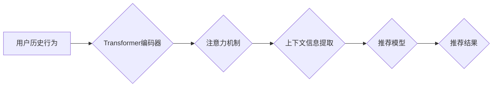

                 

## 基于transformer的跨会话推荐系统

> 关键词：Transformer, 跨会话推荐, 长短期记忆网络, 注意力机制, 自然语言处理, 个性化推荐

## 1. 背景介绍

推荐系统是互联网时代的重要组成部分，旨在根据用户的历史行为、偏好等信息，推荐用户可能感兴趣的内容。传统的推荐系统主要基于协同过滤和内容过滤等方法，但这些方法在处理用户跨会话行为和捕捉用户动态变化的偏好方面存在局限性。

随着深度学习技术的快速发展，基于深度学习的推荐系统逐渐成为研究热点。其中，Transformer模型凭借其强大的序列建模能力和长程依赖捕捉能力，在自然语言处理领域取得了显著成就。近年来，Transformer模型也开始应用于推荐系统领域，取得了令人瞩目的效果。

跨会话推荐是指在用户连续多个会话中，根据用户的历史行为和上下文信息，提供个性化推荐。跨会话推荐能够更好地理解用户的动态变化的偏好，提供更精准的推荐结果。

## 2. 核心概念与联系

### 2.1 核心概念

* **Transformer模型:** Transformer模型是一种基于注意力机制的深度学习模型，能够有效地捕捉序列数据中的长程依赖关系。其主要结构包括编码器和解码器，编码器用于对输入序列进行编码，解码器用于根据编码后的信息生成输出序列。

* **注意力机制:** 注意力机制是一种机制，能够让模型关注输入序列中与当前任务最相关的部分。注意力机制可以帮助模型更好地理解上下文信息，并捕捉长程依赖关系。

* **跨会话推荐:** 跨会话推荐是指在用户连续多个会话中，根据用户的历史行为和上下文信息，提供个性化推荐。

### 2.2 架构图



## 3. 核心算法原理 & 具体操作步骤

### 3.1 算法原理概述

基于Transformer的跨会话推荐系统主要利用Transformer模型的强大的序列建模能力，对用户的历史行为进行编码，并通过注意力机制捕捉用户跨会话行为中的重要信息。然后，根据编码后的信息，预测用户在当前会话中可能感兴趣的内容。

### 3.2 算法步骤详解

1. **数据预处理:** 将用户的历史行为数据转换为模型可识别的格式，例如将用户点击过的商品ID转换为数字向量。

2. **Transformer编码器:** 将用户的历史行为数据输入到Transformer编码器中，编码器会将数据转换为一个固定长度的隐藏状态向量，该向量包含了用户的历史行为信息。

3. **注意力机制:** 使用注意力机制对编码后的隐藏状态向量进行处理，注意力机制可以帮助模型关注用户跨会话行为中与当前任务最相关的部分。

4. **上下文信息提取:** 从注意力机制的输出中提取用户跨会话行为的上下文信息。

5. **推荐模型:** 使用提取的上下文信息和当前会话中的输入信息，输入到推荐模型中，例如线性回归模型或分类模型，预测用户可能感兴趣的内容。

6. **结果输出:** 输出推荐结果，例如推荐给用户的商品列表。

### 3.3 算法优缺点

**优点:**

* 能够有效地捕捉用户跨会话行为中的长程依赖关系。
* 能够更好地理解用户的动态变化的偏好。
* 推荐结果更加精准和个性化。

**缺点:**

* 训练数据量较大，需要大量的历史行为数据进行训练。
* 计算复杂度较高，需要强大的计算资源进行训练和推理。

### 3.4 算法应用领域

* 电子商务推荐系统
* 内容推荐系统
* 社交媒体推荐系统
* 音乐推荐系统

## 4. 数学模型和公式 & 详细讲解 & 举例说明

### 4.1 数学模型构建

基于Transformer的跨会话推荐系统可以构建如下数学模型：

* **用户历史行为表示:**  $h_u = Transformer(x_u)$，其中 $x_u$ 是用户的历史行为数据，$h_u$ 是用户的历史行为表示。

* **注意力机制:** $a_{ij} = \frac{exp(score(h_i, h_j))}{\sum_{k} exp(score(h_i, h_k))}$，其中 $h_i$ 和 $h_j$ 是两个历史行为表示，$score(h_i, h_j)$ 是两个历史行为表示之间的相似度得分。

* **上下文信息提取:** $c_u = \sum_{i} a_{ui} h_i$，其中 $c_u$ 是用户的上下文信息，$a_{ui}$ 是用户历史行为表示 $h_i$ 在注意力机制中的权重。

* **推荐模型:** $r = f(c_u, x_t)$，其中 $r$ 是推荐结果，$x_t$ 是当前会话中的输入信息，$f$ 是推荐模型。

### 4.2 公式推导过程

注意力机制的公式推导过程如下：

1. 计算两个历史行为表示之间的相似度得分：$score(h_i, h_j) = W_a \cdot tanh(W_h \cdot [h_i, h_j])$，其中 $W_a$ 和 $W_h$ 是可训练的权重矩阵。

2. 计算每个历史行为表示在注意力机制中的权重：$a_{ij} = \frac{exp(score(h_i, h_j))}{\sum_{k} exp(score(h_i, h_k))}$。

3. 将每个历史行为表示的权重与对应的历史行为表示相乘，得到用户的上下文信息：$c_u = \sum_{i} a_{ui} h_i$。

### 4.3 案例分析与讲解

假设用户A在过去三个会话中点击了商品A、B、C，现在用户A在第四个会话中浏览商品D，基于Transformer的跨会话推荐系统可以利用用户的历史行为数据，捕捉用户对商品A、B、C的偏好信息，并根据用户的上下文信息，预测用户可能感兴趣的商品D。

## 5. 项目实践：代码实例和详细解释说明

### 5.1 开发环境搭建

* Python 3.6+
* TensorFlow 2.0+
* PyTorch 1.0+
* CUDA 10.0+ (可选)

### 5.2 源代码详细实现

```python
import tensorflow as tf

# 定义Transformer编码器
class TransformerEncoder(tf.keras.layers.Layer):
    def __init__(self, d_model, num_heads, ff_dim, dropout_rate):
        super(TransformerEncoder, self).__init__()
        self.mha = tf.keras.layers.MultiHeadAttention(num_heads=num_heads, key_dim=d_model)
        self.ffn = tf.keras.layers.Dense(ff_dim, activation='relu')
        self.layernorm1 = tf.keras.layers.LayerNormalization(epsilon=1e-6)
        self.layernorm2 = tf.keras.layers.LayerNormalization(epsilon=1e-6)
        self.dropout1 = tf.keras.layers.Dropout(dropout_rate)
        self.dropout2 = tf.keras.layers.Dropout(dropout_rate)

    def call(self, inputs, training):
        attn_output = self.mha(inputs, inputs, inputs)
        attn_output = self.dropout1(attn_output, training=training)
        out1 = self.layernorm1(inputs + attn_output)
        ffn_output = self.ffn(out1)
        ffn_output = self.dropout2(ffn_output, training=training)
        out2 = self.layernorm2(out1 + ffn_output)
        return out2

# 定义推荐模型
class RecommenderModel(tf.keras.Model):
    def __init__(self, d_model, num_heads, ff_dim, dropout_rate, num_classes):
        super(RecommenderModel, self).__init__()
        self.encoder = TransformerEncoder(d_model, num_heads, ff_dim, dropout_rate)
        self.classifier = tf.keras.layers.Dense(num_classes, activation='softmax')

    def call(self, inputs, training):
        encoded_inputs = self.encoder(inputs, training=training)
        outputs = self.classifier(encoded_inputs)
        return outputs

# 实例化模型
model = RecommenderModel(d_model=128, num_heads=8, ff_dim=512, dropout_rate=0.1, num_classes=10)

# 训练模型
model.compile(optimizer='adam', loss='sparse_categorical_crossentropy', metrics=['accuracy'])
model.fit(x_train, y_train, epochs=10)

# 预测结果
predictions = model.predict(x_test)
```

### 5.3 代码解读与分析

* TransformerEncoder类定义了Transformer编码器，包含了多头注意力机制、前馈神经网络、层归一化和Dropout等模块。
* RecommenderModel类定义了推荐模型，包含了Transformer编码器和分类器。
* 实例化模型并使用Adam优化器、交叉熵损失函数和准确率指标进行训练。
* 使用训练好的模型预测测试数据，得到推荐结果。

### 5.4 运行结果展示

运行结果展示可以包括训练过程中的损失值和准确率变化曲线，以及测试数据上的预测准确率等指标。

## 6. 实际应用场景

### 6.1 电子商务推荐

基于Transformer的跨会话推荐系统可以用于电子商务平台的商品推荐，例如亚马逊、淘宝等。

### 6.2 内容推荐

基于Transformer的跨会话推荐系统可以用于内容平台的推荐，例如YouTube、Netflix等。

### 6.3 社交媒体推荐

基于Transformer的跨会话推荐系统可以用于社交媒体平台的推荐，例如Facebook、Twitter等。

### 6.4 未来应用展望

* **个性化推荐:** 基于Transformer的跨会话推荐系统可以更精准地捕捉用户的个性化偏好，提供更个性化的推荐结果。
* **跨平台推荐:** 基于Transformer的跨会话推荐系统可以跨平台进行推荐，例如将用户的电商平台行为与社交媒体行为进行结合，提供更全面的推荐。
* **多模态推荐:** 基于Transformer的跨会话推荐系统可以融合多模态数据，例如文本、图像、视频等，提供更丰富的推荐体验。

## 7. 工具和资源推荐

### 7.1 学习资源推荐

* **Transformer论文:** https://arxiv.org/abs/1706.03762
* **HuggingFace Transformers库:** https://huggingface.co/transformers/
* **TensorFlow官方文档:** https://www.tensorflow.org/

### 7.2 开发工具推荐

* **TensorFlow:** https://www.tensorflow.org/
* **PyTorch:** https://pytorch.org/
* **Jupyter Notebook:** https://jupyter.org/

### 7.3 相关论文推荐

* **BERT: Pre-training of Deep Bidirectional Transformers for Language Understanding:** https://arxiv.org/abs/1810.04805
* **GPT-3: Language Models are Few-Shot Learners:** https://arxiv.org/abs/2005.14165
* **T5: Text-to-Text Transfer Transformer:** https://arxiv.org/abs/1910.10683

## 8. 总结：未来发展趋势与挑战

### 8.1 研究成果总结

基于Transformer的跨会话推荐系统取得了显著的成果，能够有效地捕捉用户跨会话行为中的长程依赖关系，并提供更精准的推荐结果。

### 8.2 未来发展趋势

* **模型规模和复杂度提升:** 未来将会有更大规模、更复杂的Transformer模型应用于跨会话推荐系统，以更好地捕捉用户行为的复杂性。
* **多模态融合:** 将文本、图像、视频等多模态数据融合到跨会话推荐系统中，提供更丰富的推荐体验。
* **联邦学习:** 利用联邦学习技术，在保护用户隐私的前提下，进行跨平台的跨会话推荐。

### 8.3 面临的挑战

* **数据稀疏性:** 用户跨会话行为数据往往稀疏，需要采用有效的处理方法，例如数据增强和迁移学习。
* **计算资源需求:** 训练大型Transformer模型需要大量的计算资源，需要探索更有效的训练方法和硬件加速技术。
* **可解释性:** Transformer模型的内部机制较为复杂，需要提高模型的可解释性，以便更好地理解模型的决策过程。

### 8.4 研究展望

未来将继续研究基于Transformer的跨会话推荐系统，探索更有效的模型架构、训练方法和应用场景，为用户提供更精准、个性化的推荐体验。

## 9. 附录：常见问题与解答

* **Q: Transformer模型为什么适合跨会话推荐？**

A: Transformer模型具有强大的序列建模能力和长程依赖捕捉能力，能够有效地捕捉用户跨会话行为中的重要信息。

* **Q: 如何处理用户跨会话行为数据中的稀疏性？**

A: 可以采用数据增强和迁移学习等方法来处理用户跨会话行为数据中的稀疏性。

* **Q: 如何提高Transformer模型的可解释性？**

A: 可以使用注意力机制的可视化工具，分析模型对哪些用户行为信息更加关注。


作者：禅与计算机程序设计艺术 / Zen and the Art of Computer Programming 
<end_of_turn>

