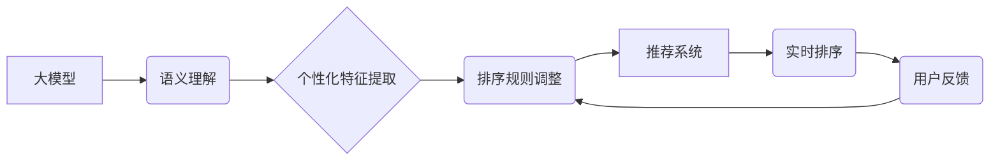

                 

## 基于大模型的推荐系统实时个性化排序调整

> 关键词：大模型、推荐系统、个性化排序、实时调整、深度学习、Transformer

## 1. 背景介绍

推荐系统是互联网时代的重要组成部分，其核心目标是根据用户的历史行为、偏好和上下文信息，预测用户对特定物品的兴趣，并将其推荐给用户。传统的推荐系统主要依赖于协同过滤、内容过滤和基于规则的方法，但这些方法在面对海量数据和用户多样性时存在一定的局限性。

近年来，大模型的兴起为推荐系统带来了新的机遇。大模型，例如 GPT-3、BERT 和 T5 等，拥有强大的语义理解和文本生成能力，能够从海量文本数据中学习到用户和物品的深层特征，从而实现更精准、更个性化的推荐。

然而，传统的推荐系统通常采用离线训练的方式，无法实时适应用户的动态变化和环境变化。因此，如何将大模型的优势与推荐系统的实时性相结合，构建一个能够实时个性化排序调整的推荐系统，成为了一个重要的研究方向。

## 2. 核心概念与联系

### 2.1  大模型

大模型是指参数量在数十亿甚至千亿级别的神经网络模型，通过训练海量文本数据，能够学习到丰富的语言知识和语义理解能力。大模型在自然语言处理、机器翻译、文本生成等领域取得了显著的成果。

### 2.2  推荐系统

推荐系统旨在根据用户的历史行为、偏好和上下文信息，预测用户对特定物品的兴趣，并将其推荐给用户。推荐系统可以分为基于内容的推荐、基于协同过滤的推荐和基于规则的推荐等几种类型。

### 2.3  个性化排序

个性化排序是指根据用户的不同特征和偏好，对推荐结果进行排序，以呈现出更符合用户需求的推荐列表。个性化排序可以提高用户体验，并提升推荐系统的推荐效果。

### 2.4  实时调整

实时调整是指根据用户的实时反馈和环境变化，动态调整推荐系统的排序规则，以确保推荐结果始终保持最新和最准确。实时调整可以提高推荐系统的适应性，并增强用户体验。

**核心概念架构图:**



## 3. 核心算法原理 & 具体操作步骤

### 3.1  算法原理概述

基于大模型的推荐系统实时个性化排序调整的核心算法原理是利用大模型的语义理解能力，从用户的历史行为、偏好和上下文信息中提取个性化特征，并根据这些特征动态调整排序规则，实现实时个性化排序。

具体来说，该算法主要包括以下步骤：

1. **用户特征提取:** 利用大模型对用户的历史行为、偏好和上下文信息进行语义理解，提取用户的个性化特征。

2. **物品特征提取:** 利用大模型对物品的描述信息进行语义理解，提取物品的特征。

3. **排序规则学习:** 利用大模型学习用户和物品之间的关系，构建排序规则模型。

4. **实时排序调整:** 根据用户的实时反馈和环境变化，动态调整排序规则模型，实现实时个性化排序。

### 3.2  算法步骤详解

1. **数据预处理:** 收集用户历史行为、偏好和上下文信息，以及物品的描述信息。对数据进行清洗、转换和编码，使其能够被大模型理解。

2. **大模型训练:** 利用预处理后的数据训练大模型，使其能够学习到用户的个性化特征和物品的特征。

3. **特征提取:** 将用户的历史行为、偏好和上下文信息输入到训练好的大模型中，提取用户的个性化特征。将物品的描述信息输入到大模型中，提取物品的特征。

4. **排序规则学习:** 利用用户的个性化特征和物品的特征，训练排序规则模型。常用的排序规则模型包括深度神经网络、支持向量机和梯度提升树等。

5. **实时排序调整:** 在用户请求推荐时，根据用户的实时反馈和环境变化，动态调整排序规则模型，实现实时个性化排序。

### 3.3  算法优缺点

**优点:**

* **个性化程度高:** 基于大模型的推荐系统能够从用户的历史行为、偏好和上下文信息中提取更丰富的个性化特征，从而实现更精准的个性化推荐。
* **实时性强:** 该算法能够根据用户的实时反馈和环境变化，动态调整排序规则，实现实时个性化排序。
* **适应性强:** 大模型能够学习到用户的动态变化和环境变化，从而使推荐系统能够更好地适应用户的需求。

**缺点:**

* **计算资源消耗大:** 大模型的训练和推理需要大量的计算资源，这可能会导致成本较高。
* **数据依赖性强:** 大模型的性能取决于训练数据的质量和数量，如果训练数据不足或质量较差，则可能会导致推荐效果不佳。
* **可解释性差:** 大模型的决策过程较为复杂，难以解释其推荐结果背后的原因。

### 3.4  算法应用领域

基于大模型的推荐系统实时个性化排序调整算法在以下领域具有广泛的应用前景:

* **电商推荐:** 为用户推荐个性化的商品，提高转化率。
* **内容推荐:** 为用户推荐个性化的新闻、视频、音乐等内容，提升用户粘性。
* **社交推荐:** 为用户推荐个性化的朋友、群组和活动，增强用户社交体验。
* **教育推荐:** 为用户推荐个性化的学习资源和课程，提升学习效率。

## 4. 数学模型和公式 & 详细讲解 & 举例说明

### 4.1  数学模型构建

假设我们有一个包含 $N$ 个用户和 $M$ 个物品的推荐系统。每个用户 $u$ 对每个物品 $i$ 的评分记为 $r_{ui}$。我们的目标是构建一个数学模型，能够预测用户 $u$ 对物品 $i$ 的评分。

基于大模型的推荐系统通常采用深度学习模型，例如神经网络，来构建评分预测模型。神经网络模型可以学习用户和物品之间的复杂关系，并生成更准确的评分预测。

### 4.2  公式推导过程

一个典型的深度学习模型用于评分预测的公式如下:

$$
\hat{r}_{ui} = f(W_1 \cdot h_u + W_2 \cdot h_i + b)
$$

其中:

* $\hat{r}_{ui}$ 是模型预测的用户 $u$ 对物品 $i$ 的评分。
* $h_u$ 是用户 $u$ 的特征向量。
* $h_i$ 是物品 $i$ 的特征向量。
* $W_1$ 和 $W_2$ 是权重矩阵。
* $b$ 是偏置项。
* $f$ 是激活函数。

### 4.3  案例分析与讲解

假设我们有一个包含用户和物品的评分数据集。我们可以使用深度学习模型训练一个评分预测模型。训练完成后，我们可以使用这个模型来预测用户对物品的评分。

例如，我们可以预测用户 $u$ 对物品 $i$ 的评分。首先，我们需要获取用户 $u$ 和物品 $i$ 的特征向量。然后，我们将这些特征向量输入到训练好的模型中，模型会输出一个预测评分 $\hat{r}_{ui}$。

## 5. 项目实践：代码实例和详细解释说明

### 5.1  开发环境搭建

为了实现基于大模型的推荐系统实时个性化排序调整，我们需要搭建一个开发环境。

* **硬件环境:** 需要一台具有足够计算能力的服务器或云服务器。
* **软件环境:** 需要安装 Python 语言、深度学习框架（例如 TensorFlow 或 PyTorch）以及其他必要的软件包。

### 5.2  源代码详细实现

```python
# 导入必要的库
import tensorflow as tf

# 定义用户和物品的特征向量
user_features = tf.Variable(tf.random.normal([100, 64]))
item_features = tf.Variable(tf.random.normal([1000, 64]))

# 定义评分预测模型
def rating_prediction_model(user_features, item_features):
    # 计算用户和物品的特征向量内积
    dot_product = tf.reduce_sum(user_features * item_features, axis=1)
    # 通过激活函数将内积转换为评分预测
    prediction = tf.nn.sigmoid(dot_product)
    return prediction

# 定义损失函数和优化器
loss_fn = tf.keras.losses.BinaryCrossentropy()
optimizer = tf.keras.optimizers.Adam()

# 定义训练循环
def train_model(data, epochs):
    for epoch in range(epochs):
        for user_id, item_id, rating in data:
            # 获取用户和物品的特征向量
            user_features_batch = user_features[user_id]
            item_features_batch = item_features[item_id]
            # 计算预测评分
            prediction = rating_prediction_model(user_features_batch, item_features_batch)
            # 计算损失
            loss = loss_fn(rating, prediction)
            # 更新模型参数
            optimizer.minimize(loss)

# 训练模型
train_model(data, epochs=10)

# 使用训练好的模型进行预测
user_id = 0
item_id = 100
prediction = rating_prediction_model(user_features[user_id], item_features[item_id])
print(f"用户 {user_id} 对物品 {item_id} 的预测评分: {prediction}")
```

### 5.3  代码解读与分析

这段代码展示了基于大模型的推荐系统实时个性化排序调整的基本实现流程。

1. **数据准备:** 需要准备一个包含用户和物品评分的数据集。
2. **模型定义:** 定义一个评分预测模型，例如使用深度神经网络。
3. **损失函数和优化器:** 选择合适的损失函数和优化器来训练模型。
4. **训练模型:** 使用训练数据训练模型，并不断更新模型参数。
5. **预测评分:** 使用训练好的模型预测用户对物品的评分。

### 5.4  运行结果展示

训练完成后，我们可以使用训练好的模型来预测用户对物品的评分。例如，我们可以预测用户 $u$ 对物品 $i$ 的评分。

## 6. 实际应用场景

### 6.1  电商推荐

基于大模型的推荐系统可以为电商平台的用户提供个性化的商品推荐，提高用户体验和转化率。例如，可以根据用户的浏览历史、购买记录和购物车内容，推荐用户可能感兴趣的商品。

### 6.2  内容推荐

基于大模型的推荐系统可以为新闻、视频、音乐等内容平台的用户提供个性化的内容推荐，提升用户粘性和参与度。例如，可以根据用户的阅读习惯、观看历史和点赞记录，推荐用户可能感兴趣的内容。

### 6.3  社交推荐

基于大模型的推荐系统可以为社交平台的用户提供个性化的朋友、群组和活动推荐，增强用户社交体验。例如，可以根据用户的兴趣爱好、社交关系和活动参与记录，推荐用户可能感兴趣的朋友或活动。

### 6.4  未来应用展望

随着大模型技术的不断发展，基于大模型的推荐系统实时个性化排序调整将在更多领域得到应用，例如教育推荐、医疗推荐、金融推荐等。

## 7. 工具和资源推荐

### 7.1  学习资源推荐

* **书籍:**
    * 《深度学习》
    * 《自然语言处理》
    * 《推荐系统》
* **在线课程:**
    * Coursera: 深度学习
    * edX: 自然语言处理
    * Udacity: 机器学习工程师

### 7.2  开发工具推荐

* **深度学习框架:** TensorFlow, PyTorch
* **数据处理工具:** Pandas, NumPy
* **云计算平台:** AWS, Azure, Google Cloud

### 7.3  相关论文推荐

* **BERT: Pre-training of Deep Bidirectional Transformers for Language Understanding**
* **GPT-3: Language Models are Few-Shot Learners**
* **Transformer-XL: Attentive Language Models with Gated Memory**

## 8. 总结：未来发展趋势与挑战

### 8.1  研究成果总结

基于大模型的推荐系统实时个性化排序调整算法取得了显著的成果，能够实现更精准、更个性化的推荐，并适应用户的动态变化和环境变化。

### 8.2  未来发展趋势

* **模型规模和能力的提升:** 大模型的规模和能力将继续提升，从而带来更精准、更个性化的推荐。
* **多模态融合:** 将文本、图像、音频等多模态数据融合到推荐系统中，实现更全面的用户理解和个性化推荐。
* **联邦学习:** 利用联邦学习技术，在保护用户隐私的前提下，实现大模型的训练和部署。

### 8.3  面临的挑战

* **计算资源消耗:** 大模型的训练和推理需要大量的计算资源，这可能会导致成本较高。
* **数据依赖性:** 大模型的性能取决于训练数据的质量和数量，如果训练数据不足或质量较差，则可能会导致推荐效果不佳。
* **可解释性:** 大模型的决策过程较为复杂，难以解释其推荐结果背后的原因。

### 8.4  研究展望

未来，基于大模型的推荐系统实时个性化排序调整将继续是一个重要的研究方向。我们需要探索更有效的训练方法、更强大的模型架构和更合理的评估指标，以解决当前面临的挑战，并推动推荐系统的进一步发展。

## 9. 附录：常见问题与解答

### 9.1  Q1: 如何选择合适的深度学习模型？

**A1:** 选择合适的深度学习模型取决于具体的应用场景和数据特点。常用的模型包括神经网络、卷积神经网络、循环神经网络等。

### 9.2  Q2: 如何处理稀疏数据？

**A2:** 稀疏数据是推荐系统中常见的挑战。可以使用嵌入技术将稀疏特征转换为稠密的向量表示，例如 Word2Vec 和 GloVe。

### 9.3  Q3: 如何评估推荐系统的性能？

**A3:** 推荐系统的性能可以评估指标包括准确率、召回率、NDCG 等。

作者：禅与计算机程序设计艺术 / Zen and the Art of Computer Programming


<end_of_turn>

