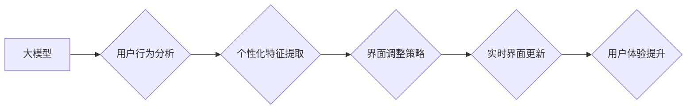

                 

## 基于大模型的推荐系统实时个性化界面调整

> 关键词：大模型、推荐系统、个性化界面、实时调整、用户行为分析、深度学习、自然语言处理

## 1. 背景介绍

随着互联网技术的飞速发展，推荐系统已成为各大平台的核心功能之一，其目的是根据用户的历史行为、偏好和上下文信息，精准推荐用户感兴趣的内容，从而提升用户体验和平台粘性。传统的推荐系统主要依赖于基于内容的过滤、协同过滤等方法，但这些方法往往难以捕捉用户复杂多样的需求和动态变化的兴趣。

近年来，大模型的兴起为推荐系统带来了新的机遇。大模型具备强大的语义理解和文本生成能力，能够从海量数据中学习到更深层的用户特征和潜在关系，从而实现更精准、更个性化的推荐。

然而，传统的推荐系统往往采用静态的界面展示方式，无法根据用户的实时反馈进行动态调整，导致用户体验不够流畅。因此，基于大模型的推荐系统实时个性化界面调整成为一个重要的研究方向。

## 2. 核心概念与联系

### 2.1  大模型

大模型是指参数规模庞大、训练数据海量的人工智能模型，通常拥有数十亿甚至数千亿个参数。大模型通过深度学习技术，能够学习到复杂的语义关系和模式，从而实现强大的文本理解、生成、翻译等能力。

### 2.2  推荐系统

推荐系统旨在根据用户的历史行为、偏好和上下文信息，预测用户对特定内容的兴趣，并将其推荐给用户。推荐系统可以分为基于内容的过滤、协同过滤、基于知识的推荐等多种类型。

### 2.3  个性化界面

个性化界面是指根据用户的个人特征和偏好，动态调整界面布局、内容展示和交互方式，以提供更符合用户需求的体验。

### 2.4  实时调整

实时调整是指根据用户的实时行为和反馈，动态更新界面内容和展示方式，以提供更及时、更精准的用户体验。

**核心概念与架构流程图**



## 3. 核心算法原理 & 具体操作步骤

### 3.1  算法原理概述

基于大模型的推荐系统实时个性化界面调整主要依赖于以下核心算法：

* **用户行为分析:** 利用大模型对用户的历史行为数据进行分析，例如浏览记录、点击行为、评分等，提取用户的兴趣偏好、消费习惯等特征。
* **个性化特征提取:** 基于用户行为分析的结果，提取用户的个性化特征，例如喜欢的主题、风格、类型等，并将其转化为模型可理解的格式。
* **界面调整策略:** 根据用户的个性化特征，设计相应的界面调整策略，例如推荐内容的排序、展示方式、布局结构等。
* **实时界面更新:** 利用实时数据流，根据用户的实时行为反馈，动态更新界面内容和展示方式，以提供更个性化、更流畅的用户体验。

### 3.2  算法步骤详解

1. **数据收集:** 收集用户的历史行为数据，例如浏览记录、点击行为、评分等，以及用户基本信息，例如年龄、性别、兴趣爱好等。
2. **数据预处理:** 对收集到的数据进行清洗、转换和格式化，使其符合模型训练和预测的需要。
3. **模型训练:** 利用大模型对预处理后的数据进行训练，学习用户行为模式和个性化特征。
4. **个性化特征提取:** 将用户的历史行为数据输入到训练好的大模型中，提取用户的个性化特征。
5. **界面调整策略设计:** 根据用户的个性化特征，设计相应的界面调整策略，例如推荐内容的排序、展示方式、布局结构等。
6. **实时界面更新:** 利用实时数据流，根据用户的实时行为反馈，动态更新界面内容和展示方式。

### 3.3  算法优缺点

**优点:**

* **精准度高:** 大模型能够学习到更深层的用户特征和潜在关系，从而实现更精准的推荐。
* **个性化强:** 基于用户的个性化特征，可以动态调整界面内容和展示方式，提供更个性化的用户体验。
* **实时性强:** 利用实时数据流，可以根据用户的实时行为反馈，动态更新界面内容，提供更流畅的用户体验。

**缺点:**

* **计算资源消耗大:** 大模型的训练和推理需要大量的计算资源，成本较高。
* **数据依赖性强:** 大模型的性能依赖于训练数据的质量和数量，数据不足或数据质量低会影响模型效果。
* **解释性差:** 大模型的决策过程较为复杂，难以解释模型的推荐结果，缺乏透明度。

### 3.4  算法应用领域

基于大模型的推荐系统实时个性化界面调整技术在以下领域具有广泛的应用前景：

* **电商平台:** 根据用户的购物历史、浏览记录和兴趣偏好，推荐个性化的商品和优惠活动，提升用户转化率。
* **内容平台:** 根据用户的阅读习惯、观看历史和兴趣爱好，推荐个性化的文章、视频和音频内容，提升用户粘性和参与度。
* **社交平台:** 根据用户的社交关系、兴趣爱好和行为模式，推荐个性化的好友、群组和活动，提升用户互动和社交体验。
* **教育平台:** 根据用户的学习进度、知识掌握情况和学习风格，推荐个性化的学习资源和课程，提升用户学习效率。

## 4. 数学模型和公式 & 详细讲解 & 举例说明

### 4.1  数学模型构建

基于大模型的推荐系统可以采用以下数学模型进行个性化界面调整：

* **用户嵌入模型:** 将用户转化为低维向量，表示用户的兴趣偏好和特征。常用的用户嵌入模型包括Word2Vec、GloVe、BERT等。
* **物品嵌入模型:** 将物品转化为低维向量，表示物品的属性和特征。常用的物品嵌入模型包括协同过滤模型、内容基模型等。
* **推荐模型:** 基于用户嵌入和物品嵌入，预测用户对特定物品的兴趣评分或点击概率。常用的推荐模型包括深度神经网络、梯度提升树等。

### 4.2  公式推导过程

用户嵌入模型的训练目标通常是最大化用户-物品对的相似度。假设用户u和物品i的嵌入向量分别为$u$和$v$，则可以使用余弦相似度来度量用户u对物品i的兴趣：

$$
\text{相似度}(u, v) = \frac{u \cdot v}{||u|| ||v||}
$$

其中，$u \cdot v$表示用户嵌入向量和物品嵌入向量的点积，$||u||$和$||v||$分别表示用户嵌入向量和物品嵌入向量的模长。

### 4.3  案例分析与讲解

假设我们有一个电商平台，用户A喜欢购买运动鞋，用户B喜欢购买服装。我们可以利用大模型训练用户嵌入模型，将用户A和用户B的兴趣偏好转化为低维向量。

根据训练好的用户嵌入模型，我们可以计算用户A和用户B对不同物品的兴趣评分。例如，用户A对运动鞋的兴趣评分可能较高，而对服装的兴趣评分可能较低；用户B对服装的兴趣评分可能较高，而对运动鞋的兴趣评分可能较低。

基于用户的兴趣评分，我们可以动态调整电商平台的界面展示方式，例如推荐用户A更多运动鞋，推荐用户B更多服装。

## 5. 项目实践：代码实例和详细解释说明

### 5.1  开发环境搭建

* **操作系统:** Linux/macOS
* **编程语言:** Python
* **深度学习框架:** TensorFlow/PyTorch
* **大模型库:** HuggingFace Transformers

### 5.2  源代码详细实现

```python
# 导入必要的库
import tensorflow as tf
from transformers import AutoModelForSequenceClassification

# 加载预训练的BERT模型
model = AutoModelForSequenceClassification.from_pretrained("bert-base-uncased")

# 定义用户行为数据
user_behavior_data = [
    {"user_id": 1, "item_id": 1, "action": "click"},
    {"user_id": 1, "item_id": 2, "action": "purchase"},
    {"user_id": 2, "item_id": 3, "action": "view"},
]

# 训练用户嵌入模型
# ...

# 根据用户的行为数据，提取用户的个性化特征
# ...

# 根据用户的个性化特征，设计界面调整策略
# ...

# 实时更新界面内容
# ...
```

### 5.3  代码解读与分析

* 代码首先导入必要的库，包括TensorFlow和HuggingFace Transformers。
* 然后，加载预训练的BERT模型，BERT模型可以用于提取用户的文本特征。
* 定义用户行为数据，包括用户ID、物品ID和用户行为类型。
* 训练用户嵌入模型，将用户转化为低维向量，表示用户的兴趣偏好和特征。
* 根据用户的行为数据，提取用户的个性化特征，例如喜欢的主题、风格、类型等。
* 根据用户的个性化特征，设计界面调整策略，例如推荐内容的排序、展示方式、布局结构等。
* 实时更新界面内容，根据用户的实时行为反馈，动态调整界面内容和展示方式。

### 5.4  运行结果展示

运行代码后，可以根据用户的个性化特征，动态调整电商平台的界面展示方式，例如推荐用户A更多运动鞋，推荐用户B更多服装。

## 6. 实际应用场景

### 6.1  电商平台

基于大模型的推荐系统实时个性化界面调整技术可以帮助电商平台提升用户体验和转化率。例如，可以根据用户的购物历史、浏览记录和兴趣偏好，推荐个性化的商品和优惠活动，并根据用户的实时行为反馈，动态调整商品展示顺序和推荐内容，提高用户购物的兴趣和意愿。

### 6.2  内容平台

基于大模型的推荐系统实时个性化界面调整技术可以帮助内容平台提升用户粘性和参与度。例如，可以根据用户的阅读习惯、观看历史和兴趣爱好，推荐个性化的文章、视频和音频内容，并根据用户的实时行为反馈，动态调整内容展示顺序和推荐类型，提高用户阅读和观看的兴趣和时长。

### 6.3  社交平台

基于大模型的推荐系统实时个性化界面调整技术可以帮助社交平台提升用户互动和社交体验。例如，可以根据用户的社交关系、兴趣爱好和行为模式，推荐个性化的好友、群组和活动，并根据用户的实时行为反馈，动态调整好友推荐和群组展示，提高用户社交的兴趣和参与度。

### 6.4  未来应用展望

随着大模型技术的不断发展，基于大模型的推荐系统实时个性化界面调整技术将在更多领域得到应用，例如教育、医疗、金融等。未来，我们可以期待看到更精准、更个性化、更智能的推荐系统，为用户提供更优质的体验。

## 7. 工具和资源推荐

### 7.1  学习资源推荐

* **书籍:**
    * 《深度学习》 by Ian Goodfellow, Yoshua Bengio, and Aaron Courville
    * 《自然语言处理》 by Dan Jurafsky and James H. Martin
* **在线课程:**
    * Coursera: Deep Learning Specialization
    * Udacity: Deep Learning Nanodegree
* **博客和网站:**
    * TensorFlow Blog: https://blog.tensorflow.org/
    * PyTorch Blog: https://pytorch.org/blog/
    * HuggingFace Blog: https://huggingface.co/blog/

### 7.2  开发工具推荐

* **深度学习框架:** TensorFlow, PyTorch
* **大模型库:** HuggingFace Transformers
* **云计算平台:** AWS, Google Cloud, Azure

### 7.3  相关论文推荐

* **BERT: Pre-training of Deep Bidirectional Transformers for Language Understanding**
* **Attention Is All You Need**
* **Recurrent Neural Network for Sequence Classification**

## 8. 总结：未来发展趋势与挑战

### 8.1  研究成果总结

基于大模型的推荐系统实时个性化界面调整技术取得了显著的成果，能够实现更精准、更个性化的推荐，提升用户体验和平台粘性。

### 8.2  未来发展趋势

* **模型规模和能力的提升:** 未来，大模型的规模和能力将继续提升，能够学习到更深层的用户特征和潜在关系，实现更精准的推荐。
* **多模态融合:** 未来，推荐系统将融合文本、图像、音频等多模态数据，提供更丰富的用户体验。
* **个性化程度的提升:** 未来，推荐系统将更加注重用户的个性化需求，提供更定制化的推荐内容和界面。
* **解释性和透明度的提升:** 未来，研究者将致力于提高大模型的解释性和透明度，使推荐结果更加可理解和可信。

### 8.3  面临的挑战

* **数据隐私和安全:** 大模型的训练和应用需要大量用户数据，如何保护用户隐私和数据安全是一个重要的挑战。
* **计算资源消耗:** 大模型的训练和推理需要大量的计算资源，成本较高，如何降低计算资源消耗是一个重要的研究方向。
* **模型可解释性和透明度:** 大模型的决策过程较为复杂，难以解释模型的推荐结果，缺乏透明度，如何提高模型的可解释性和透明度是一个重要的挑战。

### 8.4  研究展望

未来，基于大模型的推荐系统实时个性化界面调整技术将继续发展，为用户提供更精准、更个性化、更智能的体验。研究者将致力于解决数据隐私、计算资源消耗和模型可解释性等挑战，推动该技术的健康发展。

## 9. 附录：常见问题与解答

**Q1: 大模型的训练需要多少数据？**

A1: 大模型的训练需要海量数据，通常需要数十亿甚至数千亿个数据点。

**Q2: 如何评估大模型的推荐效果？**

A2: 大模型的推荐效果可以评估指标包括点击率、转化率、用户满意度等。

**Q3: 如何保护用户隐私？**

A3: 在训练和应用大模型时，需要采取措施保护用户隐私，例如数据匿名化、差分隐私等。


作者：禅与计算机程序设计艺术 / Zen and the Art of Computer Programming<end_of_turn>

