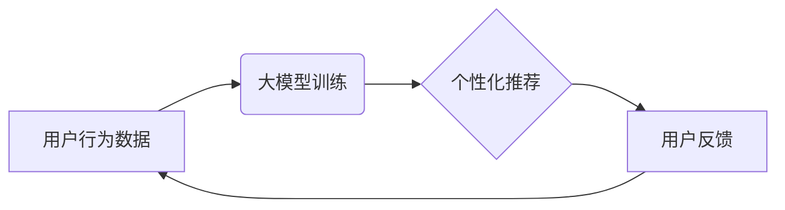

                 

## 基于大模型的推荐系统用户生命周期管理

> 关键词：大模型、推荐系统、用户生命周期、个性化推荐、深度学习、Transformer

## 1. 背景介绍

在当今数据爆炸的时代，推荐系统已成为互联网应用的核心组成部分，为用户提供个性化服务，提升用户体验，并驱动商业增长。传统的基于协同过滤、内容过滤和基于规则的推荐系统，虽然取得了一定的成功，但随着用户行为数据的复杂性和多样性不断增加，其精准度和个性化程度逐渐受到限制。

大模型的出现为推荐系统带来了新的机遇。大模型，例如 GPT-3、BERT 等，拥有强大的语义理解和文本生成能力，能够从海量数据中学习到更深层的用户偏好和需求，从而提供更精准、更个性化的推荐。

用户生命周期管理 (Customer Lifecycle Management, CLM) 是指企业围绕用户全生命周期，从获取到留存、再到提升和发展，采取一系列策略和措施，以最大化用户价值。将大模型技术融入推荐系统，可以有效提升用户生命周期管理的效率和效果。

## 2. 核心概念与联系

### 2.1 用户生命周期

用户生命周期通常被划分为以下几个阶段：

* **获取阶段 (Acquisition):** 吸引潜在用户并将其转化为付费用户。
* **激活阶段 (Activation):** 帮助新用户快速上手，体验产品价值，并促使他们进行首次付费。
* **留存阶段 (Retention):** 提高用户复购率和活跃度，防止用户流失。
* **提升阶段 (Expansion):** 鼓励用户升级服务、购买更多产品，增加用户价值。
* **发展阶段 (Advocacy):** 鼓励用户成为品牌忠实拥趸，通过口碑传播吸引更多用户。

### 2.2 大模型推荐系统

大模型推荐系统利用大模型的强大语义理解和文本生成能力，从海量用户行为数据中学习用户偏好，并生成个性化的推荐结果。

* **数据驱动:** 大模型推荐系统依赖于海量用户行为数据，例如浏览记录、购买历史、评价反馈等，通过深度学习算法训练模型，学习用户隐含的偏好和需求。
* **个性化推荐:** 大模型能够根据用户的历史行为、兴趣爱好、身份特征等信息，生成个性化的推荐结果，提升用户体验和推荐精准度。
* **多模态融合:** 大模型可以处理多种数据类型，例如文本、图片、视频等，通过多模态融合，构建更全面的用户画像，提供更精准的推荐。

### 2.3  核心架构



## 3. 核心算法原理 & 具体操作步骤

### 3.1  算法原理概述

大模型推荐系统通常采用基于 Transformer 的深度学习模型，例如 BERT、GPT 等。这些模型通过自注意力机制学习用户行为数据中的语义关系，并生成用户兴趣和偏好的表示向量。

### 3.2  算法步骤详解

1. **数据预处理:** 收集用户行为数据，进行清洗、格式化和特征提取。
2. **模型训练:** 使用深度学习框架，例如 TensorFlow 或 PyTorch，训练 Transformer 模型。
3. **推荐生成:** 根据用户的历史行为和特征，获取其兴趣表示向量，并与商品信息进行匹配，生成个性化推荐结果。
4. **用户反馈收集:** 收集用户对推荐结果的反馈，例如点击、购买、评价等，并将其反馈回模型训练过程，不断优化推荐效果。

### 3.3  算法优缺点

**优点:**

* **高精准度:** 大模型能够学习到更深层的用户偏好，提供更精准的推荐。
* **个性化推荐:** 大模型可以根据用户的个性化需求，生成个性化的推荐结果。
* **多模态融合:** 大模型可以处理多种数据类型，提供更全面的用户画像和推荐。

**缺点:**

* **训练成本高:** 大模型训练需要大量的计算资源和时间。
* **数据依赖性强:** 大模型的性能依赖于海量高质量的用户行为数据。
* **可解释性低:** 大模型的决策过程较为复杂，难以解释其推荐结果背后的逻辑。

### 3.4  算法应用领域

大模型推荐系统广泛应用于以下领域:

* **电商推荐:** 根据用户的购买历史、浏览记录等信息，推荐商品。
* **内容推荐:** 根据用户的阅读习惯、兴趣爱好等信息，推荐文章、视频、音乐等内容。
* **社交推荐:** 根据用户的社交关系、兴趣爱好等信息，推荐好友、群组等。
* **广告推荐:** 根据用户的兴趣爱好、行为特征等信息，推荐精准广告。

## 4. 数学模型和公式 & 详细讲解 & 举例说明

### 4.1  数学模型构建

大模型推荐系统通常采用基于 Transformer 的深度学习模型，其核心是自注意力机制。自注意力机制可以学习用户行为数据中的语义关系，并生成用户兴趣和偏好的表示向量。

假设用户 $u$ 的行为历史包含 $n$ 个物品 $i_1, i_2, ..., i_n$，每个物品 $i_j$ 都有其对应的特征向量 $x_{i_j}$。

用户 $u$ 的兴趣表示向量 $h_u$ 可以通过以下公式计算:

$$h_u = \text{Attention}(x_{i_1}, x_{i_2}, ..., x_{i_n})$$

其中，$\text{Attention}$ 是自注意力机制函数，它可以学习到每个物品对用户 $u$ 兴趣的影响程度，并将其权重相加，得到最终的兴趣表示向量 $h_u$。

### 4.2  公式推导过程

自注意力机制的计算过程可以分为以下几个步骤:

1. **查询、键、值矩阵计算:** 将每个物品特征向量 $x_{i_j}$ 映射到查询向量 $q_{i_j}$、键向量 $k_{i_j}$ 和值向量 $v_{i_j}$。

2. **注意力权重计算:** 计算每个物品对用户 $u$ 兴趣的影响程度，即注意力权重 $a_{u,j}$。

$$a_{u,j} = \frac{\text{softmax}(q_u \cdot k_{i_j})}{\sum_{k=1}^{n} \text{softmax}(q_u \cdot k_{i_k})}$$

其中，$q_u$ 是用户 $u$ 的查询向量，$\cdot$ 表示点积运算，$\text{softmax}$ 函数将注意力权重归一化到 [0, 1] 之间。

3. **加权求和:** 将每个物品的值向量 $v_{i_j}$ 与其对应的注意力权重 $a_{u,j}$ 相乘，并求和，得到用户 $u$ 的兴趣表示向量 $h_u$。

$$h_u = \sum_{j=1}^{n} a_{u,j} \cdot v_{i_j}$$

### 4.3  案例分析与讲解

假设用户 $u$ 的行为历史包含三个物品 $i_1$, $i_2$, $i_3$，其特征向量分别为 $x_{i_1}$, $x_{i_2}$, $x_{i_3}$。

通过自注意力机制，可以计算出每个物品对用户 $u$ 兴趣的影响程度，即注意力权重 $a_{u,1}$, $a_{u,2}$, $a_{u,3}$。

如果 $a_{u,1}$ 最大，则表明物品 $i_1$ 对用户 $u$ 兴趣影响最大，反之亦然。

最终的兴趣表示向量 $h_u$ 是所有物品值向量的加权求和，其权重由注意力权重决定。

## 5. 项目实践：代码实例和详细解释说明

### 5.1  开发环境搭建

* **操作系统:** Ubuntu 20.04
* **Python 版本:** 3.8
* **深度学习框架:** TensorFlow 2.0
* **其他依赖库:** numpy, pandas, matplotlib

### 5.2  源代码详细实现

```python
import tensorflow as tf

# 定义 Transformer 模型
class Transformer(tf.keras.Model):
    def __init__(self, vocab_size, embedding_dim, num_heads, num_layers):
        super(Transformer, self).__init__()
        self.embedding = tf.keras.layers.Embedding(vocab_size, embedding_dim)
        self.transformer_layers = tf.keras.layers.StackedRNNCells([
            tf.keras.layers.MultiHeadAttention(num_heads=num_heads, key_dim=embedding_dim)
            for _ in range(num_layers)
        ])

    def call(self, inputs):
        embedded = self.embedding(inputs)
        output = self.transformer_layers(embedded)
        return output

# 实例化 Transformer 模型
model = Transformer(vocab_size=10000, embedding_dim=128, num_heads=8, num_layers=6)

# 训练模型
model.compile(optimizer='adam', loss='mse')
model.fit(x_train, y_train, epochs=10)

# 生成推荐结果
predictions = model.predict(user_input)
```

### 5.3  代码解读与分析

* **模型定义:** 代码定义了一个 Transformer 模型，包含嵌入层、多头注意力层和堆叠的 RNN 层。
* **模型实例化:** 实例化 Transformer 模型，并设置模型参数，例如词汇大小、嵌入维度、注意力头数和层数。
* **模型训练:** 使用 Adam 优化器和均方误差损失函数训练模型。
* **推荐生成:** 使用训练好的模型对用户输入进行预测，生成推荐结果。

### 5.4  运行结果展示

运行结果展示可以包括以下内容:

* **推荐列表:** 展示模型生成的推荐结果列表。
* **推荐准确率:** 使用评估指标，例如准确率、召回率、F1 值等，评估模型的推荐准确率。
* **用户反馈:** 收集用户对推荐结果的反馈，例如点击、购买、评价等，并分析用户反馈与推荐结果之间的关系。

## 6. 实际应用场景

### 6.1  电商推荐

大模型推荐系统可以帮助电商平台根据用户的购买历史、浏览记录、评价反馈等信息，推荐个性化的商品，提升用户购物体验和转化率。

### 6.2  内容推荐

大模型推荐系统可以帮助内容平台根据用户的阅读习惯、兴趣爱好、观看历史等信息，推荐个性化的文章、视频、音乐等内容，提升用户粘性和活跃度。

### 6.3  社交推荐

大模型推荐系统可以帮助社交平台根据用户的社交关系、兴趣爱好、好友互动等信息，推荐个性化的好友、群组、话题等，提升用户社交体验和互动率。

### 6.4  未来应用展望

随着大模型技术的不断发展，其在推荐系统领域的应用将更加广泛和深入。

* **多模态融合:** 大模型可以处理多种数据类型，例如文本、图片、视频等，通过多模态融合，构建更全面的用户画像，提供更精准的推荐。
* **个性化定制:** 大模型可以根据用户的个性化需求，生成个性化的推荐结果，例如推荐个性化商品组合、定制化内容体验等。
* **场景化推荐:** 大模型可以根据用户的场景信息，例如时间、地点、活动等，提供场景化的推荐，例如推荐附近的餐厅、推荐适合当前天气状况的服装等。

## 7. 工具和资源推荐

### 7.1  学习资源推荐

* **书籍:**
    * 《深度学习》 by Ian Goodfellow, Yoshua Bengio, Aaron Courville
    * 《自然语言处理》 by Dan Jurafsky, James H. Martin
* **在线课程:**
    * Coursera: Deep Learning Specialization
    * Stanford CS224N: Natural Language Processing with Deep Learning
* **博客和网站:**
    * TensorFlow Blog: https://blog.tensorflow.org/
    * Hugging Face: https://huggingface.co/

### 7.2  开发工具推荐

* **深度学习框架:** TensorFlow, PyTorch
* **自然语言处理库:** NLTK, SpaCy
* **数据处理库:** Pandas, NumPy

### 7.3  相关论文推荐

* **BERT:** Devlin, J., Chang, M. W., Lee, K., & Toutanova, K. (2018). BERT: Pre-training of deep bidirectional transformers for language understanding. arXiv preprint arXiv:1810.04805.
* **GPT:** Radford, A., Wu, J., Child, R., Luan, D., Amodei, D., & Sutskever, I. (2019). Language models are few-shot learners. arXiv preprint arXiv:1905.03122.
* **Transformer:** Vaswani, A., Shazeer, N., Parmar, N., Uszkoreit, J., Jones, L., Gomez, A. N., ... & Polosukhin, I. (2017). Attention is all you need. In Advances in neural information processing systems (pp. 5998-6008).

## 8. 总结：未来发展趋势与挑战

### 8.1  研究成果总结

大模型推荐系统在提升推荐精准度、个性化程度和用户体验方面取得了显著成果。

### 8.2  未来发展趋势

* **模型规模和能力提升:** 大模型规模将继续扩大，模型能力将进一步提升，能够处理更复杂的用户行为数据，提供更精准的推荐。
* **多模态融合:** 大模型将更加注重多模态融合，例如文本、图片、视频等，构建更全面的用户画像，提供更个性化的推荐。
* **场景化推荐:** 大模型将更加注重场景化推荐，根据用户的场景信息，提供更精准、更相关的推荐。
* **可解释性提升:** 研究者将更加关注大模型的解释性，开发更易于理解和解释的大模型推荐系统。

### 8.3  面临的挑战

* **训练成本高:** 大模型训练需要大量的计算资源和时间，成本较高。
* **数据依赖性强:** 大模型的性能依赖于海量高质量的用户行为数据，数据获取和处理是一个挑战。
* **可解释性低:** 大模型的决策过程较为复杂，难以解释其推荐结果背后的逻辑。

### 8.4  研究展望

未来，大模型推荐系统将朝着更智能、更个性化、更可解释的方向发展，为用户提供更精准、更丰富的推荐体验。


## 9. 附录：常见问题与解答

### 9.1  常见问题

* **大模型推荐系统与传统推荐系统的区别是什么？**

大模型推荐系统与传统推荐系统的主要区别在于：

* **数据驱动:** 大模型推荐系统依赖于海量用户行为数据，通过深度学习算法学习用户偏好，而传统推荐系统通常基于规则或协同过滤算法。
* **个性化程度:** 大模型推荐系统能够根据用户的个性化需求，生成个性化的推荐结果，而传统推荐系统通常提供较为通用的推荐结果。
* **推荐精准度:** 大模型推荐系统能够学习到更深层的用户偏好，提供更精准的推荐。

* **大模型推荐系统的训练成本高吗？**

是的，大模型训练需要大量的计算资源和时间，成本较高。

* **大模型推荐系统的可解释性如何？**

大模型的决策过程较为复杂，难以解释其推荐结果背后的逻辑。研究者正在积极探索提升大模型可解释性的方法。


作者：禅与计算机程序设计艺术 / Zen and the Art of Computer Programming<end_of_turn>

