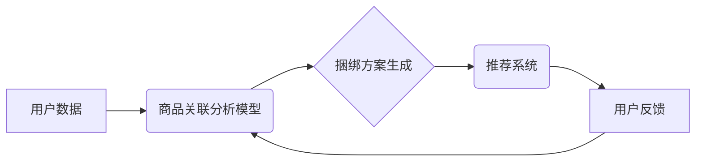

                 

## 大模型在商品捆绑销售策略中的应用

> 关键词：大模型、商品捆绑销售、推荐系统、深度学习、强化学习、策略优化

## 1. 背景介绍

商品捆绑销售是一种常见的商业策略，通过将多个商品组合销售，以优惠的价格吸引消费者购买。传统的捆绑销售策略通常依赖于人工经验和市场调研，缺乏数据驱动和个性化定制。随着大模型技术的快速发展，特别是生成式AI模型的突破，大模型为商品捆绑销售策略带来了新的机遇。

大模型具备强大的学习和推理能力，能够从海量商品数据中挖掘出潜在的关联性和价值，并根据用户的偏好和购买行为，生成个性化的捆绑销售方案。这使得商品捆绑销售策略更加精准、高效和智能化。

## 2. 核心概念与联系

### 2.1 商品捆绑销售策略

商品捆绑销售策略是指将多个商品组合销售，以优惠的价格吸引消费者购买。捆绑销售策略可以分为以下几种类型：

* **强制捆绑销售:** 消费者必须购买捆绑套餐中的所有商品才能获得优惠。
* **可选捆绑销售:** 消费者可以选择购买捆绑套餐中的部分商品，也可以选择单独购买。
* **推荐捆绑销售:** 系统根据用户的购买历史和偏好，推荐合适的商品捆绑套餐。

### 2.2 大模型

大模型是指参数量巨大、训练数据量庞大的深度学习模型。大模型通常具有以下特点：

* **强大的泛化能力:** 能够应用于多种不同的任务和领域。
* **优秀的学习能力:** 能够从海量数据中学习出复杂的模式和关系。
* **强大的推理能力:** 能够进行复杂的逻辑推理和决策。

### 2.3 核心架构

大模型在商品捆绑销售策略中的应用，通常采用以下核心架构：



**核心流程:**

1. 收集用户数据，包括用户的购买历史、浏览记录、评价信息等。
2. 利用商品关联分析模型，分析商品之间的关联性，挖掘出潜在的捆绑组合。
3. 基于用户数据和商品关联分析结果，生成个性化的捆绑方案。
4. 通过推荐系统，将生成的捆绑方案推荐给用户。
5. 收集用户反馈，并将其反馈到商品关联分析模型中，不断优化捆绑方案。

## 3. 核心算法原理 & 具体操作步骤

### 3.1 算法原理概述

大模型在商品捆绑销售策略中的应用，主要依赖于以下核心算法：

* **协同过滤:** 通过分析用户的购买行为，预测用户对特定商品的兴趣。
* **内容基元匹配:** 通过分析商品的属性和描述，找到具有相似特征的商品。
* **深度学习:** 利用深度神经网络，学习商品之间的复杂关系和用户偏好。
* **强化学习:** 通过试错学习，优化捆绑方案的生成策略。

### 3.2 算法步骤详解

**1. 数据预处理:**

* 收集商品数据，包括商品ID、名称、描述、属性等信息。
* 收集用户数据，包括用户ID、购买历史、浏览记录、评价信息等信息。
* 对数据进行清洗、转换和特征工程，以便于模型训练。

**2. 模型训练:**

* 选择合适的算法模型，例如协同过滤模型、内容基元匹配模型、深度学习模型等。
* 利用训练数据，训练模型参数。
* 使用交叉验证等方法，评估模型性能。

**3. 捆绑方案生成:**

* 根据用户的购买历史和偏好，利用训练好的模型，预测用户对特定商品的兴趣。
* 基于商品之间的关联性，生成符合用户需求的捆绑方案。
* 优化捆绑方案的组合和价格，以最大化收益。

**4. 推荐系统:**

* 将生成的捆绑方案推荐给用户，可以通过网页、APP、邮件等多种方式进行推荐。
* 根据用户的反馈，不断优化推荐策略。

### 3.3 算法优缺点

**优点:**

* 能够挖掘出潜在的商品关联性，生成更精准的捆绑方案。
* 能够根据用户的个性化需求，定制化的推荐捆绑方案。
* 能够提高商品销售额和利润。

**缺点:**

* 需要大量的训练数据，才能训练出准确的模型。
* 模型训练和部署成本较高。
* 算法的复杂性较高，需要专业的技术人员进行开发和维护。

### 3.4 算法应用领域

大模型在商品捆绑销售策略中的应用，不仅限于电商平台，还可以应用于以下领域:

* **零售行业:** 超市、便利店等零售商可以利用大模型，分析商品的购买频率和关联性，生成个性化的捆绑销售方案，提高销售额。
* **餐饮行业:** 餐馆可以利用大模型，分析用户的消费习惯，推荐搭配套餐，提高客单价。
* **旅游行业:** 旅行社可以利用大模型，分析用户的旅游偏好，推荐旅游套餐，提高旅游体验。

## 4. 数学模型和公式 & 详细讲解 & 举例说明

### 4.1 数学模型构建

**协同过滤模型:**

协同过滤模型的核心思想是，如果用户A喜欢商品X，那么用户B也可能喜欢商品X，因为用户A和用户B可能具有相似的口味。

协同过滤模型通常使用矩阵分解技术，将用户-商品交互矩阵分解成两个低维矩阵，分别表示用户特征和商品特征。

**公式:**

$$
R = U \cdot V^T
$$

其中:

* $R$ 是用户-商品交互矩阵。
* $U$ 是用户特征矩阵。
* $V^T$ 是商品特征矩阵的转置。

**举例说明:**

假设有三个用户和三个商品，用户-商品交互矩阵如下:

$$
R = \begin{bmatrix}
5 & 3 & 4 \\
4 & 5 & 2 \\
3 & 2 & 5
\end{bmatrix}
$$

其中，$R_{ij}$ 表示用户$i$对商品$j$的评分。

通过矩阵分解，可以得到用户特征矩阵$U$和商品特征矩阵$V^T$。

**内容基元匹配模型:**

内容基元匹配模型通过分析商品的属性和描述，找到具有相似特征的商品。

**公式:**

$$
Sim(i,j) = \frac{\sum_{k=1}^{n} w_k \cdot \text{TF-IDF}(i,k) \cdot \text{TF-IDF}(j,k)}{\sqrt{\sum_{k=1}^{n} w_k^2 \cdot \text{TF-IDF}(i,k)^2} \cdot \sqrt{\sum_{k=1}^{n} w_k^2 \cdot \text{TF-IDF}(j,k)^2}}
$$

其中:

* $Sim(i,j)$ 是商品$i$和商品$j$之间的相似度。
* $w_k$ 是商品属性$k$的权重。
* $\text{TF-IDF}(i,k)$ 是商品$i$中属性$k$的TF-IDF值。

**举例说明:**

假设有两个商品，商品A的属性包括颜色、尺寸、材质，商品B的属性包括颜色、尺寸、品牌。

通过计算TF-IDF值，可以得到商品A和商品B之间的相似度。

### 4.2 公式推导过程

**协同过滤模型:**

矩阵分解的目的是将用户-商品交互矩阵分解成两个低维矩阵，以便于计算用户和商品的特征。

常用的矩阵分解算法包括奇异值分解(SVD)和非负矩阵分解(NMF)。

**内容基元匹配模型:**

TF-IDF值是一种文本特征提取方法，用于衡量单词在文档中的重要性。

TF-IDF值计算公式如下:

$$
\text{TF-IDF}(i,k) = \text{TF}(i,k) \cdot \text{IDF}(k)
$$

其中:

* $\text{TF}(i,k)$ 是单词$k$在文档$i$中出现的频率。
* $\text{IDF}(k)$ 是单词$k$在整个语料库中出现的逆文档频率。

### 4.3 案例分析与讲解

**案例:**

假设一个电商平台想要利用大模型进行商品捆绑销售策略。

**分析:**

* 平台可以收集用户的购买历史、浏览记录、评价信息等数据。
* 利用协同过滤模型，分析用户的购买行为，预测用户对特定商品的兴趣。
* 利用内容基元匹配模型，分析商品的属性和描述，找到具有相似特征的商品。
* 基于用户的兴趣和商品的关联性，生成个性化的捆绑方案。
* 通过推荐系统，将生成的捆绑方案推荐给用户。

**讲解:**

通过大模型的应用，电商平台可以更加精准地推荐商品捆绑方案，提高用户的购买意愿和销售额。

## 5. 项目实践：代码实例和详细解释说明

### 5.1 开发环境搭建

* **操作系统:** Linux/macOS
* **编程语言:** Python
* **深度学习框架:** TensorFlow/PyTorch
* **其他工具:** Jupyter Notebook、Git

### 5.2 源代码详细实现

```python
# 导入必要的库
import numpy as np
from sklearn.metrics.pairwise import cosine_similarity

# 定义协同过滤模型
class CollaborativeFiltering:
    def __init__(self, user_item_matrix):
        self.user_item_matrix = user_item_matrix

    def fit(self):
        # 使用矩阵分解算法进行模型训练
        # ...

    def predict(self, user_id, item_id):
        # 根据训练好的模型，预测用户对商品的评分
        # ...

# 定义内容基元匹配模型
class ContentBasedFiltering:
    def __init__(self, item_features):
        self.item_features = item_features

    def fit(self):
        # 使用TF-IDF等方法进行特征提取
        # ...

    def predict(self, user_id, item_id):
        # 根据用户特征和商品特征，预测用户对商品的兴趣
        # ...

# 实例化模型
user_item_matrix = np.random.rand(100, 100)
collaborative_filtering = CollaborativeFiltering(user_item_matrix)
content_based_filtering = ContentBasedFiltering(item_features)

# 训练模型
collaborative_filtering.fit()
content_based_filtering.fit()

# 预测用户对商品的评分
user_id = 1
item_id = 5
predicted_rating = collaborative_filtering.predict(user_id, item_id)

# 预测用户对商品的兴趣
predicted_interest = content_based_filtering.predict(user_id, item_id)

# 生成捆绑方案
# ...

```

### 5.3 代码解读与分析

* 代码首先导入必要的库，包括NumPy、Scikit-learn等。
* 然后定义协同过滤模型和内容基元匹配模型，并实现模型的训练和预测方法。
* 实例化模型，并使用随机数据进行训练和预测。
* 最后，展示如何使用模型生成捆绑方案。

### 5.4 运行结果展示

运行结果将显示用户对特定商品的评分和兴趣预测值。

## 6. 实际应用场景

### 6.1 电商平台

电商平台可以利用大模型，分析用户的购买历史和偏好，推荐个性化的商品捆绑方案，提高用户的购买意愿和销售额。

### 6.2 餐饮行业

餐馆可以利用大模型，分析用户的消费习惯，推荐搭配套餐，提高客单价。

### 6.3 旅游行业

旅行社可以利用大模型，分析用户的旅游偏好，推荐旅游套餐，提高旅游体验。

### 6.4 未来应用展望

大模型在商品捆绑销售策略中的应用前景广阔，未来可能应用于以下领域:

* **个性化营销:** 根据用户的个性化需求，生成更加精准的捆绑方案。
* **跨平台推荐:** 将商品捆绑方案推荐到多个平台，例如电商平台、社交媒体平台等。
* **动态调整:** 根据用户的反馈和市场变化，动态调整捆绑方案的组合和价格。

## 7. 工具和资源推荐

### 7.1 学习资源推荐

* **书籍:**
    * Deep Learning by Ian Goodfellow
    * Hands-On Machine Learning with Scikit-Learn, Keras & TensorFlow by Aurélien Géron
* **在线课程:**
    * Coursera: Deep Learning Specialization
    * Udacity: Deep Learning Nanodegree
* **博客和网站:**
    * Towards Data Science
    * Machine Learning Mastery

### 7.2 开发工具推荐

* **深度学习框架:** TensorFlow, PyTorch
* **数据处理工具:** Pandas, NumPy
* **机器学习库:** Scikit-learn
* **云计算平台:** AWS, Azure, GCP

### 7.3 相关论文推荐

* **Collaborative Filtering for Implicit Feedback Datasets**
* **Content-Based Recommendation Systems**
* **Deep Learning for Recommender Systems**

## 8. 总结：未来发展趋势与挑战

### 8.1 研究成果总结

大模型在商品捆绑销售策略中的应用取得了显著的成果，能够提高商品销售额和利润，并为用户提供更加个性化的购物体验。

### 8.2 未来发展趋势

未来，大模型在商品捆绑销售策略中的应用将朝着以下方向发展:

* **更加个性化:** 利用更先进的算法和数据分析技术，生成更加个性化的捆绑方案。
* **更加智能化:** 利用强化学习等技术，让捆绑方案生成更加智能化和自适应。
* **更加跨平台:** 将商品捆绑方案推荐到多个平台，例如电商平台、社交媒体平台等。

### 8.3 面临的挑战

大模型在商品捆绑销售策略中的应用也面临着一些挑战:

* **数据隐私:** 如何保护用户的隐私数据，是需要认真考虑的问题。
* **算法解释性:** 大模型的决策过程通常是复杂的，难以解释，这可能会导致用户对推荐方案的信任度降低。
* **模型可解释性:** 如何提高模型的可解释性，让用户能够理解模型是如何生成捆绑方案的，也是一个重要的挑战。

### 8.4 研究展望

未来，我们需要继续研究大模型在商品捆绑销售策略中的应用，解决上述挑战，并探索新的应用场景。


## 9. 附录：常见问题与解答

**Q1: 大模型的训练成本很高吗?**

A1: 确实，大模型的训练成本较高，需要大量的计算资源和训练数据。

**Q2: 如何保证大模型的公平性和不歧视性?**

A2: 这是一个重要的伦理问题，需要在模型训练和部署过程中，采取措施避免模型产生偏见和歧视。

**Q3: 大模型的应用场景有哪些?**

A3: 大模型的应用场景非常广泛，除了商品捆绑销售策略，还可以应用于推荐系统、自然语言处理、图像识别等领域。


作者：禅与计算机程序设计艺术 / Zen and the Art of Computer Programming<end_of_turn>

