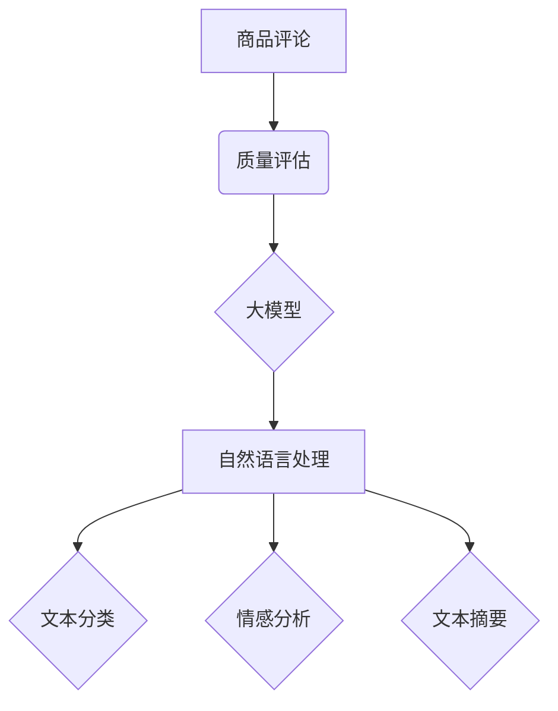

                 

## 大模型在商品评论质量评估中的多维度分析

> 关键词：大模型、商品评论、质量评估、自然语言处理、情感分析、文本分类、BERT、Transformer

## 1. 背景介绍

随着电商平台的蓬勃发展，商品评论已成为消费者决策的重要参考因素。高质量的商品评论能够帮助消费者更好地了解商品的优缺点，从而做出更明智的购买决策。反之，低质量的评论，例如虚假评论、广告性评论、无意义评论等，不仅会影响消费者决策，还会损害电商平台的信誉和用户体验。因此，如何有效地评估商品评论的质量，对于电商平台和消费者都至关重要。

传统商品评论质量评估方法主要依赖于规则匹配和人工标注，存在着效率低、难以捕捉复杂语义等问题。近年来，随着深度学习技术的快速发展，大模型在自然语言处理（NLP）领域的应用取得了突破性进展。大模型，例如BERT、GPT等，凭借其强大的语义理解能力和泛化能力，为商品评论质量评估提供了新的思路和方法。

## 2. 核心概念与联系

**2.1 商品评论质量评估**

商品评论质量评估是指对商品评论文本进行分析，判断其质量等级的过程。高质量的评论通常具有以下特征：

* **真实性:** 评论内容真实可靠，并非虚假或伪造。
* **客观性:** 评论内容客观公正，避免主观臆断和情感渲染。
* **有用性:** 评论内容对消费者决策有帮助，提供有价值的信息。
* **完整性:** 评论内容完整充分，涵盖了商品的主要特点和使用体验。
* **规范性:** 评论内容符合平台的规范要求，避免使用违规语言或信息。

**2.2 大模型**

大模型是指参数规模庞大、训练数据海量的人工智能模型。大模型通常基于Transformer架构，具有强大的语义理解和文本生成能力。

**2.3 自然语言处理（NLP）**

自然语言处理是指计算机理解、处理和生成人类语言的技术。NLP技术在商品评论质量评估中发挥着重要作用，例如文本分类、情感分析、文本摘要等。

**2.4  核心概念关系图**



## 3. 核心算法原理 & 具体操作步骤

**3.1 算法原理概述**

大模型在商品评论质量评估中的应用主要基于以下核心算法：

* **文本分类:** 将商品评论分类为不同质量等级，例如高质量、中质量、低质量。
* **情感分析:** 分析商品评论中表达的情感倾向，例如正面、负面、中性。
* **文本相似度计算:** 计算不同商品评论之间的相似度，用于识别重复评论或虚假评论。

这些算法通常基于深度学习模型，例如BERT、RoBERTa、XLNet等。这些模型通过训练大量的文本数据，学习到语言的语义和结构特征，从而能够对商品评论进行准确的分析和评估。

**3.2 算法步骤详解**

以文本分类为例，大模型在商品评论质量评估中的具体操作步骤如下：

1. **数据预处理:** 对商品评论文本进行清洗、分词、词向量化等预处理操作，以便模型能够理解和处理文本数据。
2. **模型训练:** 使用大模型训练数据，训练一个文本分类模型。训练过程中，模型会学习到不同质量等级的评论文本的特征。
3. **模型评估:** 使用测试数据评估模型的性能，例如准确率、召回率、F1-score等。
4. **模型部署:** 将训练好的模型部署到生产环境中，用于对新的商品评论进行质量评估。

**3.3 算法优缺点**

**优点:**

* **高准确率:** 大模型能够学习到复杂的语义特征，从而实现更高的文本分类准确率。
* **泛化能力强:** 大模型在训练过程中使用了大量的文本数据，具有较强的泛化能力，能够对不同类型的商品评论进行评估。
* **可扩展性强:** 大模型的架构灵活，可以根据实际需求进行扩展和改进。

**缺点:**

* **训练成本高:** 大模型的参数规模庞大，训练需要大量的计算资源和时间。
* **数据依赖性强:** 大模型的性能取决于训练数据的质量和数量。
* **解释性差:** 大模型的决策过程较为复杂，难以解释模型的决策依据。

**3.4 算法应用领域**

大模型在商品评论质量评估中的应用领域广泛，例如：

* **电商平台:** 用于识别虚假评论、广告性评论、恶意评论等，提高平台的信誉和用户体验。
* **搜索引擎:** 用于对商品评论进行质量排序，提升搜索结果的准确性和相关性。
* **市场调研:** 用于分析消费者对商品的评价和反馈，帮助企业改进产品和服务。

## 4. 数学模型和公式 & 详细讲解 & 举例说明

**4.1 数学模型构建**

商品评论质量评估可以看作是一个分类问题，可以使用逻辑回归模型或支持向量机模型进行建模。

**4.2 公式推导过程**

**逻辑回归模型:**

假设商品评论属于类别 $y$，其中 $y=0$ 表示低质量评论，$y=1$ 表示高质量评论。逻辑回归模型的输出为评论属于高质量类别的概率 $p(y=1|x)$，其中 $x$ 为评论文本的特征向量。

$$
p(y=1|x) = \frac{1}{1 + e^{-(w^T x + b)}}
$$

其中，$w$ 为模型参数，$b$ 为偏置项。

**4.3 案例分析与讲解**

假设我们训练了一个逻辑回归模型，用于判断商品评论是否为高质量评论。模型的参数 $w$ 和 $b$ 已训练完成。

对于一个新的评论文本 $x$，我们可以使用公式计算其属于高质量类别的概率 $p(y=1|x)$。如果 $p(y=1|x) > 0.5$，则认为该评论为高质量评论；否则，认为该评论为低质量评论。

## 5. 项目实践：代码实例和详细解释说明

**5.1 开发环境搭建**

* Python 3.6+
* TensorFlow 或 PyTorch
* NLTK 或 spaCy

**5.2 源代码详细实现**

```python
import tensorflow as tf
from tensorflow.keras.layers import Embedding, LSTM, Dense
from tensorflow.keras.models import Sequential

# 数据预处理
# ...

# 模型构建
model = Sequential()
model.add(Embedding(input_dim=vocab_size, output_dim=embedding_dim, input_length=max_length))
model.add(LSTM(units=128))
model.add(Dense(units=1, activation='sigmoid'))

# 模型编译
model.compile(optimizer='adam', loss='binary_crossentropy', metrics=['accuracy'])

# 模型训练
model.fit(x_train, y_train, epochs=10, batch_size=32)

# 模型评估
loss, accuracy = model.evaluate(x_test, y_test)
print('Loss:', loss)
print('Accuracy:', accuracy)

# 模型预测
predictions = model.predict(x_new)
```

**5.3 代码解读与分析**

* 代码首先定义了模型的结构，包括嵌入层、LSTM层和全连接层。
* 嵌入层将单词转换为稠密的向量表示。
* LSTM层用于捕捉文本序列中的长距离依赖关系。
* 全连接层用于将LSTM层的输出映射到输出类别。
* 代码然后编译了模型，指定了优化器、损失函数和评价指标。
* 模型训练使用训练数据进行训练，并使用测试数据进行评估。
* 最后，代码使用训练好的模型对新的评论文本进行预测。

**5.4 运行结果展示**

运行代码后，会输出模型的训练损失、准确率以及对新评论文本的预测结果。

## 6. 实际应用场景

大模型在商品评论质量评估中的实际应用场景广泛，例如：

* **电商平台:** 阿里巴巴、京东等电商平台利用大模型识别虚假评论、广告性评论，提高平台的信誉和用户体验。
* **社交媒体:** 微软、谷歌等公司利用大模型分析社交媒体上的商品评论，了解消费者对商品的评价和反馈。
* **市场调研:** 咨询公司利用大模型分析商品评论，帮助企业改进产品和服务。

**6.4 未来应用展望**

未来，大模型在商品评论质量评估中的应用将更加广泛和深入，例如：

* **多模态评论分析:** 将文本、图片、视频等多模态信息融合在一起，进行更全面的评论分析。
* **个性化评论推荐:** 根据用户的兴趣和偏好，推荐更相关的商品评论。
* **自动生成高质量评论:** 利用大模型生成高质量的商品评论，帮助消费者做出更明智的购买决策。

## 7. 工具和资源推荐

**7.1 学习资源推荐**

* **书籍:**
    * 《深度学习》
    * 《自然语言处理》
* **在线课程:**
    * Coursera: 自然语言处理
    * edX: 深度学习
* **博客:**
    * Jay Alammar's Blog
    * The Gradient

**7.2 开发工具推荐**

* **TensorFlow:** 开源深度学习框架
* **PyTorch:** 开源深度学习框架
* **NLTK:** 自然语言处理工具包
* **spaCy:** 自然语言处理工具包

**7.3 相关论文推荐**

* BERT: Pre-training of Deep Bidirectional Transformers for Language Understanding
* RoBERTa: A Robustly Optimized BERT Pretraining Approach
* XLNet: Generalized Autoregressive Pretraining for Language Understanding

## 8. 总结：未来发展趋势与挑战

**8.1 研究成果总结**

大模型在商品评论质量评估领域取得了显著的成果，例如提高了文本分类的准确率，能够识别虚假评论和广告性评论等。

**8.2 未来发展趋势**

未来，大模型在商品评论质量评估领域将朝着以下方向发展：

* **多模态评论分析:** 将文本、图片、视频等多模态信息融合在一起，进行更全面的评论分析。
* **个性化评论推荐:** 根据用户的兴趣和偏好，推荐更相关的商品评论。
* **自动生成高质量评论:** 利用大模型生成高质量的商品评论，帮助消费者做出更明智的购买决策。

**8.3 面临的挑战**

大模型在商品评论质量评估领域也面临着一些挑战：

* **数据标注成本高:** 大模型的训练需要大量的标注数据，数据标注成本较高。
* **模型解释性差:** 大模型的决策过程较为复杂，难以解释模型的决策依据。
* **模型公平性问题:** 大模型可能存在偏见，导致对不同类型的评论进行不公平的评估。

**8.4 研究展望**

未来研究将重点关注以下几个方面：

* **降低数据标注成本:** 研究新的数据标注方法，降低数据标注成本。
* **提高模型解释性:** 研究新的模型解释方法，提高模型的解释性。
* **解决模型公平性问题:** 研究新的模型训练方法，解决模型公平性问题。

## 9. 附录：常见问题与解答

**9.1 如何选择合适的模型？**

选择合适的模型取决于具体的应用场景和数据特点。

* **文本分类任务:** BERT、RoBERTa、XLNet等预训练模型效果较好。
* **情感分析任务:** LSTM、GRU等循环神经网络模型效果较好。

**9.2 如何处理文本数据？**

文本数据需要进行以下预处理操作：

* **清洗:** 去除停用词、标点符号等无用信息。
* **分词:** 将文本分割成单词或词语。
* **词向量化:** 将单词或词语转换为稠密的向量表示。

**9.3 如何评估模型性能？**

常用的模型性能评估指标包括：

* **准确率:** 正确分类的样本数占总样本数的比例。
* **召回率:** 真阳性样本数占所有阳性样本数的比例。
* **F1-score:** 准确率和召回率的 harmonic mean。


作者：禅与计算机程序设计艺术 / Zen and the Art of Computer Programming 
<end_of_turn>

