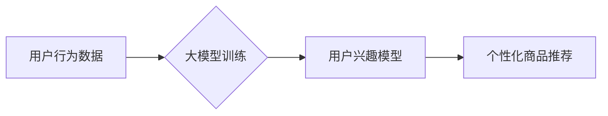

                 

## 大模型技术在电商平台用户兴趣建模中的创新

> 关键词：大模型、用户兴趣建模、电商平台、推荐系统、自然语言处理、深度学习、Transformer

## 1. 背景介绍

在当今数据爆炸的时代，电商平台面临着巨大的挑战，如何精准地理解用户的兴趣，并提供个性化的商品推荐，成为了提升用户体验和商业效益的关键。传统的用户兴趣建模方法主要依赖于用户行为数据，如浏览记录、购买历史等，但这些数据往往是离散的、不完整的，难以捕捉用户的复杂兴趣偏好。

近年来，大模型技术在自然语言处理领域取得了突破性进展，其强大的语义理解和文本生成能力为电商平台用户兴趣建模带来了新的机遇。大模型能够从海量文本数据中学习用户潜在的兴趣，并生成更精准、更个性化的推荐结果。

## 2. 核心概念与联系

### 2.1 大模型

大模型是指参数规模庞大、训练数据海量的人工智能模型。这些模型通常基于深度学习架构，例如 Transformer，能够学习复杂的语义关系和模式。

### 2.2 用户兴趣建模

用户兴趣建模是指通过分析用户的行为数据、偏好信息等，构建用户兴趣的数学模型，并预测用户对特定商品的兴趣程度。

### 2.3 关系

大模型技术可以用于电商平台用户兴趣建模，其核心在于利用大模型强大的语义理解能力，从用户产生的文本数据，如商品评论、搜索词、浏览记录等中，挖掘用户的潜在兴趣偏好。

**Mermaid 流程图**



## 3. 核心算法原理 & 具体操作步骤

### 3.1 算法原理概述

大模型在用户兴趣建模中的应用主要基于以下算法原理：

* **嵌入式表示:** 将用户和商品映射到低维向量空间，通过向量之间的相似度计算用户对商品的兴趣程度。
* **注意力机制:**  学习用户对不同商品特征的关注程度，提高模型对用户兴趣的捕捉能力。
* **序列建模:**  利用 Transformer 等序列建模模型，分析用户历史行为序列，预测用户未来的兴趣偏好。

### 3.2 算法步骤详解

1. **数据预处理:** 收集用户行为数据，如浏览记录、购买历史、商品评论等，并进行清洗、格式化、标注等预处理操作。
2. **特征提取:** 从用户行为数据中提取特征，例如用户 demographics 信息、商品类别、价格、品牌等。
3. **模型训练:** 使用大模型架构，例如 BERT、GPT-3 等，训练用户兴趣模型。训练过程中，模型会学习用户和商品的嵌入式表示，以及用户对不同商品特征的关注程度。
4. **模型评估:** 使用测试数据评估模型的性能，常用的指标包括准确率、召回率、AUC 等。
5. **个性化推荐:** 根据训练好的模型，对用户进行个性化商品推荐。

### 3.3 算法优缺点

**优点:**

* 能够从海量文本数据中学习用户潜在的兴趣偏好。
* 能够捕捉用户兴趣的复杂性和动态性。
* 能够提供更精准、更个性化的商品推荐。

**缺点:**

* 训练大模型需要大量的计算资源和时间。
* 模型的解释性较差，难以理解模型是如何做出推荐的。
* 需要大量的标注数据进行模型训练。

### 3.4 算法应用领域

大模型技术在用户兴趣建模领域具有广泛的应用前景，例如：

* **电商平台商品推荐:**  根据用户的浏览记录、购买历史等数据，推荐用户可能感兴趣的商品。
* **内容推荐:**  根据用户的阅读习惯、观看历史等数据，推荐用户可能感兴趣的内容。
* **广告推荐:**  根据用户的兴趣偏好，推荐用户可能感兴趣的广告。

## 4. 数学模型和公式 & 详细讲解 & 举例说明

### 4.1 数学模型构建

用户兴趣建模可以构建为一个用户-商品交互预测问题，可以使用矩阵分解模型来表示用户和商品之间的关系。

**用户-商品交互矩阵:**

$$
R \in R^{m \times n}
$$

其中，$m$ 表示用户数量，$n$ 表示商品数量，$R_{ui}$ 表示用户 $u$ 对商品 $i$ 的评分或交互行为。

**模型假设:**

* 用户对商品的评分可以表示为用户和商品的嵌入向量之间的点积。
* 用户和商品的嵌入向量可以由低维向量空间表示。

### 4.2 公式推导过程

**用户嵌入向量:**

$$
u \in R^d
$$

**商品嵌入向量:**

$$
v \in R^d
$$

**预测评分:**

$$
\hat{R}_{ui} = u \cdot v
$$

其中，$\cdot$ 表示向量点积。

### 4.3 案例分析与讲解

假设有一个电商平台，有 1000 个用户和 1000 个商品。用户-商品交互矩阵 $R$ 是一个 1000x1000 的矩阵，其中每个元素表示用户对商品的评分。

可以使用矩阵分解模型来学习用户和商品的嵌入向量。例如，可以使用 Singular Value Decomposition (SVD) 方法将用户-商品交互矩阵分解成三个矩阵，分别表示用户嵌入向量、商品嵌入向量和评分矩阵。

通过训练模型，可以得到用户和商品的嵌入向量，并根据公式 $\hat{R}_{ui} = u \cdot v$ 来预测用户对商品的评分。

## 5. 项目实践：代码实例和详细解释说明

### 5.1 开发环境搭建

* Python 3.7+
* TensorFlow 2.0+
* PyTorch 1.0+
* Jupyter Notebook

### 5.2 源代码详细实现

```python
import tensorflow as tf

# 定义用户-商品交互矩阵
R = tf.random.normal((1000, 1000))

# 定义用户嵌入向量维度
user_dim = 64

# 定义商品嵌入向量维度
item_dim = 64

# 定义用户嵌入矩阵
user_embeddings = tf.Variable(tf.random.normal((1000, user_dim)))

# 定义商品嵌入矩阵
item_embeddings = tf.Variable(tf.random.normal((1000, item_dim)))

# 定义预测评分函数
def predict_rating(user_id, item_id):
    user_embedding = user_embeddings[user_id]
    item_embedding = item_embeddings[item_id]
    return tf.reduce_sum(user_embedding * item_embedding)

# 训练模型
optimizer = tf.keras.optimizers.Adam(learning_rate=0.01)

for epoch in range(10):
    for user_id in range(1000):
        for item_id in range(1000):
            # 计算预测评分
            predicted_rating = predict_rating(user_id, item_id)
            # 计算损失函数
            loss = tf.reduce_mean(tf.square(predicted_rating - R[user_id, item_id]))
            # 反向传播
            gradients = optimizer.compute_gradients(loss)
            # 更新模型参数
            optimizer.apply_gradients(gradients)

# 保存模型参数
user_embeddings.save("user_embeddings.h5")
item_embeddings.save("item_embeddings.h5")
```

### 5.3 代码解读与分析

* 代码首先定义了用户-商品交互矩阵 $R$，以及用户和商品嵌入向量维度。
* 然后定义了用户和商品嵌入矩阵，并使用 TensorFlow 的 `Variable` 类来存储模型参数。
* `predict_rating` 函数计算用户对商品的预测评分，通过用户和商品嵌入向量的点积来实现。
* 训练模型的过程包括迭代地计算预测评分、损失函数和梯度，并使用 Adam 优化器更新模型参数。
* 最后，保存训练好的用户和商品嵌入向量。

### 5.4 运行结果展示

训练完成后，可以将用户和商品嵌入向量加载到模型中，并使用 `predict_rating` 函数预测用户对商品的评分。

## 6. 实际应用场景

### 6.1 商品推荐

大模型技术可以用于电商平台的商品推荐系统，根据用户的浏览记录、购买历史、商品评论等数据，推荐用户可能感兴趣的商品。

### 6.2 个性化营销

大模型可以分析用户的兴趣偏好，为用户提供个性化的营销内容，例如推荐相关的优惠券、促销活动等。

### 6.3 内容推荐

大模型可以用于推荐新闻、视频、文章等内容，根据用户的阅读习惯、观看历史等数据，推荐用户可能感兴趣的内容。

### 6.4 未来应用展望

大模型技术在电商平台用户兴趣建模领域还有很大的发展空间，未来可以应用于以下场景：

* **多模态用户兴趣建模:**  结合文本、图像、视频等多模态数据，更全面地理解用户的兴趣偏好。
* **动态用户兴趣建模:**  实时更新用户的兴趣偏好，提供更精准的个性化推荐。
* **跨平台用户兴趣建模:**  整合不同平台的用户数据，构建更全面的用户兴趣模型。

## 7. 工具和资源推荐

### 7.1 学习资源推荐

* **书籍:**
    * 《深度学习》 by Ian Goodfellow, Yoshua Bengio, Aaron Courville
    * 《自然语言处理》 by Dan Jurafsky, James H. Martin
* **在线课程:**
    * Coursera: Deep Learning Specialization
    * Stanford CS224N: Natural Language Processing with Deep Learning

### 7.2 开发工具推荐

* **TensorFlow:**  开源深度学习框架，支持多种模型架构和硬件平台。
* **PyTorch:**  开源深度学习框架，以其灵活性和易用性而闻名。
* **Hugging Face Transformers:**  提供预训练大模型和工具，方便用户使用和定制大模型。

### 7.3 相关论文推荐

* **BERT: Pre-training of Deep Bidirectional Transformers for Language Understanding**
* **GPT-3: Language Models are Few-Shot Learners**
* **Attention Is All You Need**

## 8. 总结：未来发展趋势与挑战

### 8.1 研究成果总结

大模型技术在电商平台用户兴趣建模领域取得了显著的成果，能够提供更精准、更个性化的商品推荐，提升用户体验和商业效益。

### 8.2 未来发展趋势

未来，大模型技术在电商平台用户兴趣建模领域将朝着以下方向发展：

* **模型规模和能力的提升:**  训练更大规模、更强大的大模型，提升模型的语义理解和文本生成能力。
* **多模态用户兴趣建模:**  结合文本、图像、视频等多模态数据，构建更全面的用户兴趣模型。
* **动态用户兴趣建模:**  实时更新用户的兴趣偏好，提供更精准的个性化推荐。
* **解释性模型的开发:**  开发更具解释性的大模型，帮助用户理解模型是如何做出推荐的。

### 8.3 面临的挑战

大模型技术在电商平台用户兴趣建模领域也面临着一些挑战：

* **数据隐私和安全:**  大模型训练需要大量的用户数据，如何保护用户隐私和数据安全是一个重要的挑战。
* **模型解释性和可信度:**  大模型的决策过程往往是复杂的，难以理解模型是如何做出推荐的，这可能会影响用户的信任度。
* **模型部署和维护成本:**  训练和部署大模型需要大量的计算资源和技术人员，成本较高。

### 8.4 研究展望

未来，需要进一步研究大模型技术在电商平台用户兴趣建模领域的应用，解决数据隐私、模型解释性和部署成本等挑战，推动大模型技术在电商领域的落地和应用。

## 9. 附录：常见问题与解答

**Q1: 大模型训练需要多少数据？**

A1: 大模型训练需要海量数据，通常需要百万甚至数十亿条数据才能达到良好的效果。

**Q2: 大模型训练需要多少计算资源？**

A2: 大模型训练需要大量的计算资源，通常需要使用高性能计算集群才能完成训练。

**Q3: 如何评估大模型的性能？**

A3: 大模型的性能可以评估指标包括准确率、召回率、AUC 等。

**作者：禅与计算机程序设计艺术 / Zen and the Art of Computer Programming** 


<end_of_turn>

