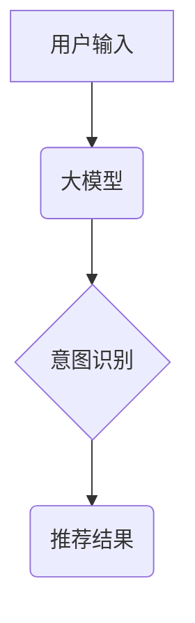

                 

## 大模型技术在电商平台用户意图理解中的创新

> 关键词：大模型、用户意图理解、电商平台、自然语言处理、深度学习、Transformer、BERT、电商推荐

## 1. 背景介绍

电子商务平台作为现代商业的重要组成部分，其核心在于精准地理解用户需求，并提供个性化推荐和服务。用户意图理解是电商平台实现精准推荐的关键技术之一。传统的用户意图理解方法主要依赖于规则匹配和特征工程，但随着用户表达方式的多样化和复杂化，这些方法逐渐难以满足需求。

近年来，大模型技术在自然语言处理领域取得了突破性进展，其强大的语义理解能力和泛化能力为电商平台用户意图理解带来了新的机遇。大模型能够学习海量文本数据，捕捉用户表达中的深层语义和隐含信息，从而实现更精准、更智能的用户意图理解。

## 2. 核心概念与联系

### 2.1 用户意图理解

用户意图理解是指从用户输入的文本中识别用户的真实意图，并将其转化为机器可理解的形式。例如，当用户输入“我要买一部iPhone手机”时，系统的意图理解模块需要识别出用户的意图是购买iPhone手机。

### 2.2 大模型

大模型是指参数量巨大、训练数据量庞大的深度学习模型。大模型通常具有强大的泛化能力和语义理解能力，能够处理复杂的任务，例如文本分类、机器翻译、问答系统等。

### 2.3 核心概念联系

大模型技术能够有效提升电商平台用户意图理解的准确性和效率。大模型通过学习海量文本数据，能够捕捉用户表达中的深层语义和隐含信息，从而更准确地识别用户的真实意图。



## 3. 核心算法原理 & 具体操作步骤

### 3.1 算法原理概述

大模型在用户意图理解中的应用主要基于Transformer架构和预训练语言模型。Transformer是一种新型的深度学习网络结构，其能够有效捕捉文本序列中的长距离依赖关系，从而提升语义理解能力。预训练语言模型是指在大量文本数据上预先训练的语言模型，例如BERT、RoBERTa等。这些预训练模型已经具备了强大的语义理解能力，可以作为用户意图理解任务的基础模型。

### 3.2 算法步骤详解

1. **数据预处理:** 将用户输入的文本进行清洗、分词、标记等预处理操作，使其能够被模型理解。
2. **模型加载:** 加载预训练的Transformer模型，例如BERT。
3. **特征提取:** 将预处理后的文本输入到Transformer模型中，模型会提取文本中的特征表示。
4. **意图分类:** 将提取到的特征表示输入到分类层，模型会根据特征预测用户的意图类别。
5. **结果输出:** 输出预测的意图类别，并根据意图类别提供相应的推荐结果。

### 3.3 算法优缺点

**优点:**

* **高准确率:** 大模型能够学习到更深层的语义信息，从而提升用户意图理解的准确率。
* **泛化能力强:** 预训练模型在大量文本数据上进行训练，具有较强的泛化能力，能够适应不同的用户表达方式。
* **可扩展性强:** 大模型的架构灵活，可以根据实际需求进行扩展和改进。

**缺点:**

* **计算资源消耗大:** 大模型的参数量巨大，训练和推理过程需要大量的计算资源。
* **训练数据依赖性强:** 大模型的性能取决于训练数据的质量和数量。
* **解释性差:** 大模型的决策过程较为复杂，难以解释其背后的推理逻辑。

### 3.4 算法应用领域

大模型技术在用户意图理解领域具有广泛的应用前景，例如：

* **电商平台推荐:** 根据用户的搜索词、浏览历史等信息，精准推荐商品。
* **客服机器人:** 理解用户的咨询需求，并提供相应的帮助。
* **搜索引擎:** 理解用户的搜索意图，并返回更相关的搜索结果。
* **问答系统:** 理解用户的提问，并提供准确的答案。

## 4. 数学模型和公式 & 详细讲解 & 举例说明

### 4.1 数学模型构建

大模型在用户意图理解中的应用通常基于Transformer架构，其核心是注意力机制。注意力机制能够学习到文本序列中不同词语之间的关系，从而捕捉更深层的语义信息。

### 4.2 公式推导过程

Transformer模型的注意力机制使用Scaled Dot-Product Attention计算词语之间的相关性。其公式如下：

$$
Attention(Q, K, V) = softmax(\frac{QK^T}{\sqrt{d_k}})V
$$

其中：

* $Q$：查询矩阵
* $K$：键矩阵
* $V$：值矩阵
* $d_k$：键向量的维度
* $softmax$：softmax函数

### 4.3 案例分析与讲解

假设我们有一个句子“我想要买一部iPhone手机”，其词语表示为：

* $Q$：["我", "想要", "买", "一部", "iPhone", "手机"]
* $K$：["我", "想要", "买", "一部", "iPhone", "手机"]
* $V$：["我", "想要", "买", "一部", "iPhone", "手机"]

通过计算$QK^T$，我们可以得到每个词语与其他词语之间的相关性得分。然后，使用softmax函数将得分归一化，得到每个词语的注意力权重。最后，将注意力权重与值矩阵$V$相乘，得到最终的注意力输出。

## 5. 项目实践：代码实例和详细解释说明

### 5.1 开发环境搭建

* Python 3.6+
* TensorFlow/PyTorch
* CUDA Toolkit

### 5.2 源代码详细实现

```python
import tensorflow as tf

# 定义Transformer模型
class Transformer(tf.keras.Model):
    def __init__(self, vocab_size, embedding_dim, num_heads, num_layers):
        super(Transformer, self).__init__()
        self.embedding = tf.keras.layers.Embedding(vocab_size, embedding_dim)
        self.transformer_layers = tf.keras.layers.StackedRNNCells([
            tf.keras.layers.MultiHeadAttention(num_heads=num_heads, key_dim=embedding_dim)
            for _ in range(num_layers)
        ])
        self.fc = tf.keras.layers.Dense(num_classes)

    def call(self, inputs):
        x = self.embedding(inputs)
        x = self.transformer_layers(x)
        x = tf.keras.layers.GlobalAveragePooling1D()(x)
        x = self.fc(x)
        return x

# 实例化模型
model = Transformer(vocab_size=10000, embedding_dim=128, num_heads=8, num_layers=6)

# 训练模型
model.compile(optimizer='adam', loss='sparse_categorical_crossentropy', metrics=['accuracy'])
model.fit(train_data, train_labels, epochs=10)

# 预测用户意图
predictions = model.predict(test_data)
```

### 5.3 代码解读与分析

* 代码首先定义了一个Transformer模型，包含嵌入层、多头注意力层和全连接层。
* 嵌入层将词语转换为向量表示。
* 多头注意力层能够捕捉文本序列中不同词语之间的关系。
* 全连接层将注意力输出映射到意图类别。
* 代码然后实例化模型，并使用Adam优化器和交叉熵损失函数进行训练。
* 最后，使用训练好的模型预测用户的意图。

### 5.4 运行结果展示

训练完成后，可以评估模型的性能，例如准确率、召回率等。

## 6. 实际应用场景

大模型技术在电商平台用户意图理解的实际应用场景非常广泛，例如：

### 6.1 商品搜索

当用户输入搜索词时，大模型可以理解用户的搜索意图，并返回更相关的商品结果。例如，用户输入“运动鞋”，大模型可以识别出用户的意图是搜索运动鞋，并返回各种品牌的运动鞋。

### 6.2 个性化推荐

大模型可以根据用户的浏览历史、购买记录等信息，学习用户的兴趣偏好，并推荐个性化的商品。例如，如果用户经常购买运动服饰，大模型可以推荐相关的运动鞋、运动背包等商品。

### 6.3 会话式客服

大模型可以用于构建对话式客服机器人，帮助用户解决问题。例如，用户可以向机器人询问商品信息、配送时间等问题，机器人可以根据用户的意图提供相应的答案。

### 6.4 内容生成

大模型可以用于生成电商平台的商品描述、促销文案等内容。例如，大模型可以根据商品的属性和特点，自动生成吸引用户的商品描述。

## 7. 工具和资源推荐

### 7.1 学习资源推荐

* **书籍:**
    * 《深度学习》
    * 《自然语言处理》
* **在线课程:**
    * Coursera: 自然语言处理
    * edX: 深度学习
* **博客:**
    * The Gradient
    * Towards Data Science

### 7.2 开发工具推荐

* **TensorFlow:** 开源深度学习框架
* **PyTorch:** 开源深度学习框架
* **Hugging Face Transformers:** 预训练语言模型库

### 7.3 相关论文推荐

* BERT: Pre-training of Deep Bidirectional Transformers for Language Understanding
* RoBERTa: A Robustly Optimized BERT Pretraining Approach

## 8. 总结：未来发展趋势与挑战

### 8.1 研究成果总结

大模型技术在电商平台用户意图理解领域取得了显著的进展，能够提升用户体验和商业效益。

### 8.2 未来发展趋势

* **模型规模进一步扩大:** 随着计算资源的提升，大模型的规模将进一步扩大，从而提升语义理解能力。
* **多模态用户意图理解:** 将文本、图像、语音等多模态信息融合，实现更全面的用户意图理解。
* **个性化用户意图理解:** 基于用户的历史行为和偏好，实现更精准的个性化意图理解。

### 8.3 面临的挑战

* **数据标注成本高:** 大模型的训练需要大量标注数据，数据标注成本较高。
* **模型解释性差:** 大模型的决策过程较为复杂，难以解释其背后的推理逻辑。
* **模型部署成本高:** 大模型的部署需要大量的计算资源，部署成本较高。

### 8.4 研究展望

未来，大模型技术在电商平台用户意图理解领域将继续发展，并带来更多创新应用。研究者需要关注模型的可解释性、效率和鲁棒性等问题，推动大模型技术在实际应用中的落地和推广。

## 9. 附录：常见问题与解答

### 9.1 如何选择合适的预训练模型？

选择预训练模型需要根据具体任务和数据特点进行选择。例如，对于电商平台商品搜索任务，可以选择BERT、RoBERTa等预训练语言模型。

### 9.2 如何进行模型调参？

模型调参需要根据模型的结构和任务特点进行调整。常用的调参方法包括学习率、批处理大小、训练轮数等参数的调整。

### 9.3 如何评估模型性能？

模型性能可以通过准确率、召回率、F1-score等指标进行评估。

作者：禅与计算机程序设计艺术 / Zen and the Art of Computer Programming 


<end_of_turn>

