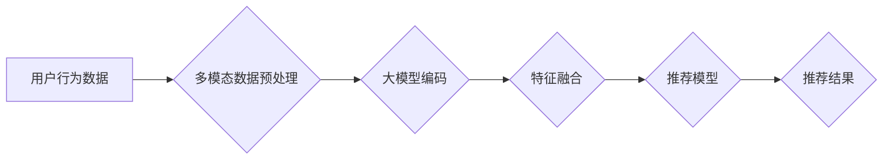

                 

## 大模型驱动的推荐系统多模态内容理解

> 关键词：大模型、推荐系统、多模态理解、内容理解、自然语言处理、计算机视觉、深度学习

## 1. 背景介绍

推荐系统是互联网时代的重要组成部分，它通过分析用户的行为和偏好，为用户推荐个性化的内容，例如商品、视频、音乐等。传统的推荐系统主要依赖于文本数据，如用户评分、商品描述等。然而，随着互联网内容的多样化，文本数据无法完全捕捉用户需求和内容特征。多模态内容，例如文本、图像、音频、视频等，蕴含着更丰富的语义信息，为推荐系统提供了新的发展方向。

大模型的出现为多模态内容理解提供了强大的工具。大模型，例如 GPT-3、BERT、DALL-E 等，拥有海量参数和强大的学习能力，能够从多模态数据中学习复杂的语义关系和模式。将大模型应用于推荐系统，可以有效提升推荐系统的准确性和个性化程度。

## 2. 核心概念与联系

**2.1 多模态内容理解**

多模态内容理解是指理解由多种模态数据组成的复合信息。例如，一张图片配上文字描述，可以更全面地表达信息。多模态内容理解需要跨模态融合技术，将不同模态的数据融合在一起，形成统一的语义表示。

**2.2 大模型驱动的推荐系统**

大模型驱动的推荐系统利用大模型的强大能力，从多模态数据中学习用户偏好和内容特征，从而实现更精准的推荐。

**2.3 架构图**



## 3. 核心算法原理 & 具体操作步骤

**3.1 算法原理概述**

大模型驱动的推荐系统通常采用以下核心算法：

* **多模态数据预处理:** 将不同模态的数据转换为统一的格式，例如将图像转换为特征向量，将文本转换为词嵌入。
* **大模型编码:** 利用大模型对多模态数据进行编码，生成每个模态的语义表示。
* **特征融合:** 将不同模态的语义表示融合在一起，形成统一的特征向量。
* **推荐模型:** 利用融合后的特征向量，训练推荐模型，预测用户对特定内容的兴趣。

**3.2 算法步骤详解**

1. **数据收集:** 收集用户行为数据、多模态内容数据等。
2. **数据预处理:** 对数据进行清洗、格式转换、特征提取等操作。
3. **大模型训练:** 利用大模型训练模型，对多模态数据进行编码。
4. **特征融合:** 将不同模态的语义表示融合在一起，形成统一的特征向量。
5. **推荐模型训练:** 利用融合后的特征向量，训练推荐模型，例如协同过滤、深度学习等。
6. **推荐结果输出:** 根据用户的特征和内容特征，预测用户对特定内容的兴趣，输出推荐结果。

**3.3 算法优缺点**

**优点:**

* 能够捕捉多模态数据的丰富语义信息。
* 推荐结果更精准、个性化。
* 能够处理更复杂的推荐场景。

**缺点:**

* 数据预处理和特征融合较为复杂。
* 大模型训练需要大量的计算资源和时间。

**3.4 算法应用领域**

* **电商推荐:** 推荐商品、优惠券等。
* **视频推荐:** 推荐视频、直播等。
* **音乐推荐:** 推荐歌曲、专辑等。
* **新闻推荐:** 推荐新闻、文章等。
* **社交媒体推荐:** 推荐好友、话题等。

## 4. 数学模型和公式 & 详细讲解 & 举例说明

**4.1 数学模型构建**

假设我们有用户 $u$ 和内容 $i$，分别用 $u$ 和 $i$ 表示。用户 $u$ 对内容 $i$ 的评分用 $r_{ui}$ 表示。我们希望构建一个模型，能够预测用户 $u$ 对内容 $i$ 的评分。

**4.2 公式推导过程**

我们可以使用矩阵分解模型来预测用户对内容的评分。矩阵分解模型将用户和内容映射到低维空间，并通过内积计算预测评分。

$$
r_{ui} = \mathbf{u}^T \mathbf{i} + \epsilon
$$

其中：

* $\mathbf{u}$ 是用户 $u$ 的特征向量。
* $\mathbf{i}$ 是内容 $i$ 的特征向量。
* $\epsilon$ 是误差项。

**4.3 案例分析与讲解**

假设我们有一个包含用户和内容的评分矩阵 $R$，其中 $R_{ui}$ 表示用户 $u$ 对内容 $i$ 的评分。我们可以使用矩阵分解模型来学习用户和内容的特征向量，并预测用户对未评分内容的评分。

例如，我们可以使用协同过滤算法来学习用户和内容的特征向量。协同过滤算法基于用户的评分历史，学习用户和内容之间的相似性。

## 5. 项目实践：代码实例和详细解释说明

**5.1 开发环境搭建**

* Python 3.7+
* TensorFlow 2.0+
* PyTorch 1.0+
* CUDA 10.0+

**5.2 源代码详细实现**

```python
import tensorflow as tf

# 定义用户和内容的特征向量维度
user_dim = 64
item_dim = 64

# 定义用户和内容的特征向量
user_embeddings = tf.Variable(tf.random.normal([num_users, user_dim]))
item_embeddings = tf.Variable(tf.random.normal([num_items, item_dim]))

# 定义预测评分的函数
def predict_rating(user_id, item_id):
    user_embedding = user_embeddings[user_id]
    item_embedding = item_embeddings[item_id]
    return tf.reduce_sum(user_embedding * item_embedding)

# 定义损失函数
def loss_function(predictions, ratings):
    return tf.reduce_mean(tf.square(predictions - ratings))

# 定义优化器
optimizer = tf.keras.optimizers.Adam()

# 训练模型
for epoch in range(num_epochs):
    for user_id, item_id, rating in train_data:
        prediction = predict_rating(user_id, item_id)
        loss = loss_function(prediction, rating)
        optimizer.minimize(loss)

# 保存模型
user_embeddings.save("user_embeddings.h5")
item_embeddings.save("item_embeddings.h5")
```

**5.3 代码解读与分析**

* 代码首先定义了用户和内容的特征向量维度。
* 然后定义了用户和内容的特征向量，并使用随机值初始化。
* 定义了预测评分的函数，使用用户和内容的特征向量进行内积计算。
* 定义了损失函数，使用均方误差作为损失函数。
* 定义了优化器，使用Adam优化器进行模型训练。
* 训练模型时，循环遍历训练数据，计算预测评分和损失，并使用优化器更新模型参数。
* 最后，保存训练好的模型参数。

**5.4 运行结果展示**

训练完成后，可以使用保存的模型参数预测用户对未评分内容的评分。

## 6. 实际应用场景

**6.1 电商推荐**

大模型驱动的推荐系统可以根据用户的浏览历史、购买记录、评价等多模态数据，推荐个性化的商品。例如，可以根据用户的图片搜索历史，推荐与图片内容相关的商品。

**6.2 视频推荐**

大模型可以分析视频内容、用户观看历史、评论等多模态数据，推荐个性化的视频。例如，可以根据用户的观看历史和兴趣标签，推荐与用户偏好的视频类型相关的视频。

**6.3 音乐推荐**

大模型可以分析音乐旋律、歌词、用户听歌历史等多模态数据，推荐个性化的音乐。例如，可以根据用户的听歌历史和音乐风格偏好，推荐与用户喜欢的音乐风格相似的音乐。

**6.4 未来应用展望**

随着大模型技术的不断发展，大模型驱动的推荐系统将有更广泛的应用场景。例如，可以用于推荐个性化的教育资源、医疗服务、旅游路线等。

## 7. 工具和资源推荐

**7.1 学习资源推荐**

* **书籍:**
    * Deep Learning by Ian Goodfellow, Yoshua Bengio, and Aaron Courville
    * Natural Language Processing with Python by Steven Bird, Ewan Klein, and Edward Loper
* **课程:**
    * Stanford CS224N: Natural Language Processing with Deep Learning
    * Deep Learning Specialization by Andrew Ng

**7.2 开发工具推荐**

* **TensorFlow:** https://www.tensorflow.org/
* **PyTorch:** https://pytorch.org/
* **Hugging Face Transformers:** https://huggingface.co/transformers/

**7.3 相关论文推荐**

* **BERT: Pre-training of Deep Bidirectional Transformers for Language Understanding**
* **GPT-3: Language Models are Few-Shot Learners**
* **DALL-E: Creating Images from Text**

## 8. 总结：未来发展趋势与挑战

**8.1 研究成果总结**

大模型驱动的推荐系统取得了显著的成果，能够有效提升推荐系统的准确性和个性化程度。

**8.2 未来发展趋势**

* **模型规模和能力的提升:** 大模型的规模和能力将继续提升，能够处理更复杂的多模态数据，并学习更丰富的语义关系。
* **多模态融合技术的创新:** 将不同模态的数据融合在一起，形成统一的语义表示，将是未来研究的重点方向。
* **个性化推荐的增强:** 大模型可以根据用户的个性化需求，提供更精准、更个性化的推荐。
* **解释性和可解释性的提升:** 大模型的决策过程往往是黑盒式的，如何提升大模型的解释性和可解释性，是未来研究的重要挑战。

**8.3 面临的挑战**

* **数据获取和预处理:** 大模型的训练需要海量的数据，获取和预处理高质量的多模态数据是一个挑战。
* **模型训练和部署:** 大模型的训练需要大量的计算资源和时间，部署大模型也需要强大的计算能力。
* **公平性和隐私性:** 大模型的训练和应用需要考虑公平性和隐私性问题，避免模型产生偏见或侵犯用户隐私。

**8.4 研究展望**

未来，大模型驱动的推荐系统将朝着更智能、更个性化、更安全的方向发展。


## 9. 附录：常见问题与解答

**9.1 如何选择合适的推荐算法？**

选择合适的推荐算法需要根据具体场景和数据特点进行选择。例如，对于用户行为数据较多的场景，可以使用协同过滤算法；对于多模态数据较多的场景，可以使用大模型驱动的推荐算法。

**9.2 如何评估推荐系统的性能？**

常用的推荐系统性能指标包括准确率、召回率、NDCG等。

**9.3 如何解决数据稀疏性问题？**

数据稀疏性是推荐系统面临的一个常见问题。可以使用矩阵分解、协同过滤等算法来解决数据稀疏性问题。


作者：禅与计算机程序设计艺术 / Zen and the Art of Computer Programming 
<end_of_turn>

