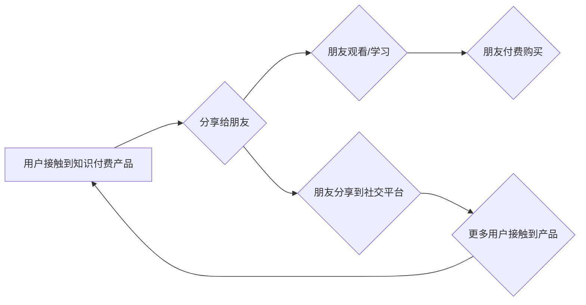

                 

## 如何利用 Virus Marketing Promote Knowledge Pay Product

> 关键词：病毒式营销、知识付费、产品推广、网络传播、用户增长

## 1. 背景介绍

在当今数字时代，知识已成为最宝贵的资源之一。知识付费模式的兴起，为知识产权的保护和传播提供了新的途径。然而，知识付费产品面临着用户获取和转化率低下的挑战。如何有效地推广知识付费产品，吸引用户付费，成为众多知识创作者和平台运营商亟需解决的问题。

病毒式营销（Viral Marketing）是一种利用网络传播效应，快速扩大产品或服务的知名度和影响力的营销策略。其核心在于创造具有传播性的内容，引发用户分享和传播，从而实现低成本、高效率的推广效果。

结合知识付费产品的特点，病毒式营销可以有效地提升产品曝光度，吸引目标用户，促进用户转化。本文将探讨如何利用病毒式营销策略，有效地推广知识付费产品。

## 2. 核心概念与联系

### 2.1 病毒式营销原理

病毒式营销的核心在于模仿病毒传播的机制，通过创造具有感染力的内容，引发用户分享和传播，从而实现快速扩散。其传播路径通常包括：

* **社交平台分享:** 用户在社交媒体平台上分享内容，吸引朋友和粉丝关注。
* **邮件转发:** 用户将内容转发给朋友和同事，扩大传播范围。
* **网站嵌入:** 用户将内容嵌入到个人网站或博客中，吸引更多访问者。

### 2.2 知识付费与病毒式营销的结合

知识付费产品与病毒式营销的结合，可以实现以下优势：

* **提升产品曝光度:** 通过病毒式传播，快速扩大知识付费产品的知名度，吸引更多潜在用户。
* **降低推广成本:** 相比传统广告，病毒式营销成本更低，更具性价比。
* **增强用户信任度:** 用户通过朋友或社交平台的分享，更容易建立对知识付费产品的信任感。
* **提升用户转化率:** 病毒式传播可以激发用户的好奇心和参与感，从而提高用户付费意愿。

**Mermaid 流程图**



## 3. 核心算法原理 & 具体操作步骤

### 3.1 算法原理概述

病毒式营销的核心算法原理在于分析用户行为，预测传播路径，并优化内容传播策略。

* **用户行为分析:** 通过收集用户数据，分析用户兴趣、偏好、传播行为等，构建用户画像。
* **传播路径预测:** 基于用户行为分析，预测内容传播的路径和范围，确定目标用户群体。
* **内容优化:** 根据目标用户群体，优化内容形式、内容主题、传播渠道等，提高内容的传播性和感染力。

### 3.2 算法步骤详解

1. **数据收集:** 收集用户行为数据，包括用户浏览记录、分享记录、评论记录等。
2. **用户画像构建:** 基于用户行为数据，构建用户画像，分析用户兴趣、偏好、传播行为等。
3. **传播路径分析:** 利用网络分析算法，分析内容传播路径，预测传播范围和影响力。
4. **内容优化:** 根据目标用户群体和传播路径分析结果，优化内容形式、内容主题、传播渠道等。
5. **传播效果评估:** 跟踪内容传播效果，分析用户参与度、转化率等指标，不断优化传播策略。

### 3.3 算法优缺点

**优点:**

* **精准传播:** 基于用户行为分析，精准定位目标用户群体，提高传播效率。
* **成本效益高:** 相比传统广告，病毒式营销成本更低，更具性价比。
* **可持续传播:** 通过内容的持续传播，实现长期的品牌影响力。

**缺点:**

* **难以控制:** 病毒式传播难以完全控制，可能出现负面影响。
* **依赖用户参与:** 病毒式传播需要用户主动分享，难以保证传播效果。
* **算法复杂度高:** 病毒式营销算法的构建和优化需要专业技术支持。

### 3.4 算法应用领域

病毒式营销算法广泛应用于以下领域：

* **电商推广:** 利用病毒式传播，推广商品和服务，提高销售额。
* **品牌营销:** 通过病毒式传播，提升品牌知名度和影响力。
* **内容营销:** 利用病毒式传播，推广优质内容，吸引用户关注。
* **公益宣传:** 通过病毒式传播，提高公益项目的知名度和参与度。

## 4. 数学模型和公式 & 详细讲解 & 举例说明

### 4.1 数学模型构建

病毒式营销的传播模型可以抽象为一个动态系统，其中用户扮演着传播主体，内容作为传播媒介。

**模型假设:**

* 用户之间存在着连接关系，代表着信息传播的可能性。
* 用户对内容的传播行为服从一定的概率分布。
* 内容的传播效果会随着时间推移而衰减。

**模型变量:**

* $N$: 用户总数
* $I(t)$: 在时间 $t$ 时刻被感染的用户数
* $P$: 用户传播内容的概率
* $\alpha$: 内容传播衰减系数

**模型方程:**

$$
\frac{dI(t)}{dt} = P \cdot \frac{I(t)}{N} \cdot (N-I(t)) - \alpha \cdot I(t)
$$

### 4.2 公式推导过程

该模型方程的推导过程如下：

* **第一项:** $P \cdot \frac{I(t)}{N} \cdot (N-I(t))$ 代表着在时间 $t$ 时刻，被感染的用户传播内容给未被感染用户的速率。
* **第二项:** $-\alpha \cdot I(t)$ 代表着在时间 $t$ 时刻，被感染用户因时间推移而失去感染力的速率。

### 4.3 案例分析与讲解

假设一个知识付费产品的病毒式营销活动，初始感染用户数为 100 人，用户总数为 10000 人，传播概率为 0.1，内容传播衰减系数为 0.05。

利用上述模型方程，可以模拟病毒式传播过程，预测感染用户数随时间的变化趋势。

通过分析模型结果，可以得出以下结论：

* 在初期，感染用户数会快速增长，达到峰值后逐渐衰减。
* 传播概率和内容传播衰减系数是影响传播效果的关键因素。
* 为了延长传播周期，可以采取措施提高内容的传播概率和降低传播衰减系数。

## 5. 项目实践：代码实例和详细解释说明

### 5.1 开发环境搭建

* 操作系统: Windows/macOS/Linux
* 编程语言: Python
* 开发工具: Jupyter Notebook/VS Code
* 依赖库: NetworkX, matplotlib

### 5.2 源代码详细实现

```python
import networkx as nx
import matplotlib.pyplot as plt

# 建立用户网络
G = nx.karate_club_graph()

# 设置用户传播概率
P = 0.1

# 设置内容传播衰减系数
alpha = 0.05

# 模拟病毒式传播
I = [1]  # 初始感染用户数
for t in range(1, 100):
    dI = P * (I[-1] / G.number_of_nodes()) * (G.number_of_nodes() - I[-1]) - alpha * I[-1]
    I.append(I[-1] + dI)

# 绘制传播曲线
plt.plot(I)
plt.xlabel("时间")
plt.ylabel("感染用户数")
plt.title("病毒式传播曲线")
plt.show()
```

### 5.3 代码解读与分析

* 代码首先建立一个用户网络，可以使用不同的网络生成算法构建不同的网络结构。
* 然后设置用户传播概率和内容传播衰减系数。
* 利用数值模拟方法，计算感染用户数随时间的变化趋势。
* 最后绘制传播曲线，直观地展示病毒式传播过程。

### 5.4 运行结果展示

运行代码后，会生成一个展示病毒式传播曲线的图形。

## 6. 实际应用场景

### 6.1 知识付费产品推广

* **内容裂变:** 将知识付费产品的内容进行拆解，制作成短视频、图文、音频等多种形式，方便用户分享和传播。
* **社群运营:** 建立知识付费产品的社群，鼓励用户互动交流，分享学习心得，形成病毒式传播效应。
* **KOL 合作:** 与行业KOL合作，推广知识付费产品，利用KOL的影响力扩大产品曝光度。

### 6.2 其他应用场景

* **在线教育平台:** 利用病毒式营销推广在线课程，吸引更多学生报名学习。
* **软件产品推广:** 利用病毒式营销推广软件产品，提高用户下载量和使用率。
* **游戏推广:** 利用病毒式营销推广游戏，吸引更多玩家参与游戏。

### 6.4 未来应用展望

随着人工智能技术的不断发展，病毒式营销将更加智能化、个性化。

* **AI 驱动的内容创作:** 利用人工智能技术，自动生成具有传播性的内容，提高传播效率。
* **个性化传播策略:** 基于用户画像，制定个性化的传播策略，精准触达目标用户。
* **跨平台传播:** 利用多平台协同传播，扩大传播范围和影响力。

## 7. 工具和资源推荐

### 7.1 学习资源推荐

* **书籍:**
    * 《病毒式营销》
    * 《网络传播学》
* **在线课程:**
    * Coursera: Marketing Analytics
    * Udemy: Digital Marketing

### 7.2 开发工具推荐

* **社交媒体管理工具:** Hootsuite, Buffer
* **内容创作工具:** Canva, Adobe Spark
* **数据分析工具:** Google Analytics, Tableau

### 7.3 相关论文推荐

* **The Dynamics of Viral Marketing**
* **Modeling the Spread of Information in Social Networks**

## 8. 总结：未来发展趋势与挑战

### 8.1 研究成果总结

本文探讨了病毒式营销在知识付费产品推广中的应用，分析了其核心算法原理、传播模型和实际应用场景。

### 8.2 未来发展趋势

未来，病毒式营销将更加智能化、个性化、跨平台化，并与人工智能、大数据等技术深度融合。

### 8.3 面临的挑战

病毒式营销面临着以下挑战：

* **负面影响控制:** 病毒式传播难以完全控制，可能出现负面影响。
* **用户隐私保护:** 病毒式营销需要收集用户数据，需要注重用户隐私保护。
* **算法伦理:** 病毒式营销算法的应用需要考虑伦理问题，避免造成信息茧房等问题。

### 8.4 研究展望

未来研究方向包括：

* **开发更精准、更安全的病毒式营销算法。**
* **探索病毒式营销与人工智能、大数据等技术的融合应用。**
* **研究病毒式营销的伦理问题，制定相应的规范和标准。**

## 9. 附录：常见问题与解答

**Q1: 病毒式营销的传播效果如何评估？**

**A1:** 病毒式营销的传播效果可以通过以下指标评估：

* **传播量:** 内容被分享、转发、评论的次数。
* **曝光量:** 内容被展示的次数。
* **用户参与度:** 用户点赞、评论、转发等互动行为。
* **转化率:** 用户通过分享内容而购买产品的比例。

**Q2: 如何避免病毒式营销的负面影响？**

**A2:** 避免病毒式营销的负面影响，可以采取以下措施：

* **内容审核:** 严格审核内容质量，避免传播虚假信息、低俗内容等。
* **用户反馈机制:** 建立用户反馈机制，及时处理用户投诉和建议。
* **负面舆情监控:** 监控网络舆情，及时应对负面舆情。

**Q3: 病毒式营销与传统广告相比，有哪些优势和劣势？**

**A3:**

* **优势:** 成本效益高、传播速度快、可持续传播。
* **劣势:** 难以控制、依赖用户参与、可能出现负面影响。


作者：禅与计算机程序设计艺术 / Zen and the Art of Computer Programming 
<end_of_turn>

