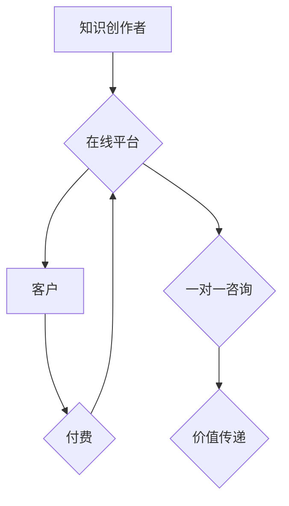

                 

## 如何打造知识付费的一对一咨询服务

> 关键词：知识付费、一对一咨询、在线平台、客户关系管理、价值构建、营销策略、技术架构、安全保障

### 1. 背景介绍

知识经济时代，知识成为最宝贵的资源。越来越多的人开始意识到知识的价值，并寻求通过付费的方式获取专业知识和指导。知识付费模式的兴起，为知识创作者和学习者提供了新的合作模式。其中，一对一咨询服务作为一种高价值、个性化的知识付费形式，逐渐受到关注。

一对一咨询服务是指知识创作者与单个客户进行一对一的深度交流，提供定制化的指导和建议。这种模式能够更精准地满足客户需求，建立更紧密的信任关系，从而提升客户满意度和付费意愿。

然而，打造成功的知识付费一对一咨询服务并非易事。需要考虑多个方面，包括价值构建、平台搭建、客户关系管理、营销推广等。

### 2. 核心概念与联系

#### 2.1 知识付费

知识付费是指通过付费的方式获取知识、技能、经验等信息。它是一种基于知识价值的商业模式，将知识作为商品进行交易。

#### 2.2 一对一咨询

一对一咨询是指知识创作者与单个客户进行一对一的深度交流，提供定制化的指导和建议。这种模式能够更精准地满足客户需求，建立更紧密的信任关系。

#### 2.3 在线平台

在线平台是知识付费一对一咨询服务的核心载体。它提供了一个线上环境，让知识创作者和客户能够进行高效便捷的沟通和互动。

**核心概念与联系流程图**



### 3. 核心算法原理 & 具体操作步骤

#### 3.1 算法原理概述

知识付费一对一咨询服务的核心算法原理在于高效匹配知识创作者和客户，并提供个性化的咨询服务。

* **匹配算法:** 基于客户需求和知识创作者专业领域进行匹配，提高咨询服务的精准度和效率。
* **个性化推荐算法:** 根据客户的历史咨询记录、偏好设置等信息，推荐合适的知识创作者和咨询主题。
* **智能客服系统:** 利用自然语言处理技术，提供自动化的咨询服务，例如解答常见问题、预约咨询时间等。

#### 3.2 算法步骤详解

1. **客户需求采集:** 通过问卷调查、用户画像分析等方式，收集客户的咨询需求、专业领域、预算等信息。
2. **知识创作者信息获取:** 收集知识创作者的专业领域、服务内容、经验背景、评价等信息。
3. **匹配算法执行:** 利用机器学习算法，根据客户需求和知识创作者信息进行匹配，推荐合适的咨询对象。
4. **个性化推荐:** 基于客户的历史咨询记录、偏好设置等信息，推荐更精准的咨询主题和知识创作者。
5. **智能客服交互:** 利用自然语言处理技术，提供自动化的咨询服务，例如解答常见问题、预约咨询时间等。

#### 3.3 算法优缺点

**优点:**

* **精准匹配:** 提高了咨询服务的精准度和效率。
* **个性化推荐:** 满足客户多样化的需求，提升客户体验。
* **自动化服务:** 降低了人工成本，提高了服务效率。

**缺点:**

* **算法复杂度:** 需要复杂的机器学习算法和数据处理技术。
* **数据依赖:** 算法效果依赖于海量数据和准确的数据标注。
* **隐私安全:** 需要妥善处理客户隐私信息，保障数据安全。

#### 3.4 算法应用领域

* **教育培训:** 在线一对一辅导、专业技能培训等。
* **职业咨询:** 职业规划、求职指导、创业咨询等。
* **医疗健康:** 在线问诊、健康管理、疾病预防等。
* **法律金融:** 法律咨询、理财规划、投资指导等。

### 4. 数学模型和公式 & 详细讲解 & 举例说明

#### 4.1 数学模型构建

知识付费一对一咨询服务的匹配算法可以构建为一个基于用户需求和知识创作者特质的评分模型。

**评分模型公式:**

$$Score = \sum_{i=1}^{n} w_i * f_i(u, c)$$

其中:

* $Score$: 匹配评分
* $u$: 用户需求向量
* $c$: 知识创作者特质向量
* $w_i$: 各个特质权重
* $f_i(u, c)$: 特质匹配函数

#### 4.2 公式推导过程

* **用户需求向量:** 将用户的咨询需求、专业领域、预算等信息转化为数值向量，例如:

$$u = [需求1, 需求2, 专业领域, 预算]$$

* **知识创作者特质向量:** 将知识创作者的专业领域、服务内容、经验背景、评价等信息转化为数值向量，例如:

$$c = [专业领域1, 专业领域2, 经验年限, 评价分数]$$

* **特质匹配函数:** 根据不同特质的匹配程度，计算匹配评分。例如，专业领域匹配可以使用余弦相似度计算:

$$f_i(u, c) = cos(u_i, c_i)$$

* **权重设置:** 根据不同特质的重要性，设置相应的权重。例如，专业领域匹配的权重可能比预算匹配的权重更高。

#### 4.3 案例分析与讲解

假设有一个用户需要学习Python编程，预算为1000元。平台上有以下两个知识创作者:

* 知识创作者A: 专业领域为Python编程，经验年限为5年，评价分数为4.8分。
* 知识创作者B: 专业领域为数据分析，经验年限为3年，评价分数为4.5分。

根据用户需求和知识创作者特质，可以计算出两个知识创作者的匹配评分。

* 知识创作者A的匹配评分: $Score_A = w_1 * cos(u_1, c_1) + w_2 * cos(u_2, c_2) + w_3 * cos(u_3, c_3) + w_4 * cos(u_4, c_4)$
* 知识创作者B的匹配评分: $Score_B = w_1 * cos(u_1, c_1) + w_2 * cos(u_2, c_2) + w_3 * cos(u_3, c_3) + w_4 * cos(u_4, c_4)$

根据计算结果，平台可以推荐更符合用户需求的知识创作者。

### 5. 项目实践：代码实例和详细解释说明

#### 5.1 开发环境搭建

* **操作系统:** Linux/macOS/Windows
* **编程语言:** Python
* **框架:** Flask/Django
* **数据库:** MySQL/PostgreSQL
* **工具:** Git、Docker

#### 5.2 源代码详细实现

```python
# Flask示例代码

from flask import Flask, render_template, request

app = Flask(__name__)

# 模拟用户需求和知识创作者特质数据
user_demands = {
    "需求1": 0.8,
    "需求2": 0.5,
    "专业领域": "Python编程",
    "预算": 1000
}

knowledge_creators = [
    {"专业领域": "Python编程", "经验年限": 5, "评价分数": 4.8},
    {"专业领域": "数据分析", "经验年限": 3, "评价分数": 4.5}
]

@app.route('/')
def index():
    return render_template('index.html', user_demands=user_demands)

@app.route('/match', methods=['POST'])
def match():
    # 获取用户需求数据
    user_demands = request.form.to_dict()
    # 计算匹配评分
    # ...
    # 返回匹配结果
    return render_template('match.html', match_results=match_results)

if __name__ == '__main__':
    app.run(debug=True)
```

#### 5.3 代码解读与分析

* **Flask框架:** 使用Flask框架构建简单的Web应用。
* **用户需求数据:** 模拟用户需求数据，包括需求、专业领域、预算等信息。
* **知识创作者数据:** 模拟知识创作者数据，包括专业领域、经验年限、评价分数等信息。
* **匹配算法:** 代码中省略了具体的匹配算法实现，需要根据实际需求进行开发。
* **模板渲染:** 使用Jinja2模板引擎渲染页面，将数据传递给前端。

#### 5.4 运行结果展示

运行代码后，用户可以通过Web页面输入自己的需求信息，平台会根据算法计算匹配结果，并推荐合适的知识创作者。

### 6. 实际应用场景

#### 6.1 教育培训

* **一对一辅导:** 学生可以根据自己的学习进度和需求，选择合适的老师进行一对一辅导。
* **专业技能培训:** 职场人士可以学习新的技能，提升职业竞争力。

#### 6.2 职业咨询

* **职业规划:** 帮助求职者明确职业目标，制定职业发展规划。
* **求职指导:** 提供简历修改、面试技巧等指导，帮助求职者成功找到工作。
* **创业咨询:** 为创业者提供商业模式、市场分析、融资等方面的指导。

#### 6.3 医疗健康

* **在线问诊:** 用户可以与医生进行在线问诊，获得专业的医疗建议。
* **健康管理:** 提供个性化的健康管理方案，帮助用户预防疾病、保持健康。

#### 6.4 未来应用展望

随着人工智能技术的不断发展，知识付费一对一咨询服务将更加智能化、个性化。

* **智能化咨询:** 利用人工智能技术，提供更精准、更智能的咨询服务。
* **虚拟助手:** 开发虚拟助手，帮助用户预约咨询时间、管理咨询记录等。
* **跨语言支持:** 支持多种语言，拓展服务范围。

### 7. 工具和资源推荐

#### 7.1 学习资源推荐

* **在线课程:** Coursera、Udacity、edX等平台提供人工智能、机器学习等相关课程。
* **书籍:** 《深度学习》、《机器学习实战》等书籍。
* **开源项目:** TensorFlow、PyTorch等开源项目。

#### 7.2 开发工具推荐

* **编程语言:** Python
* **框架:** Flask、Django
* **数据库:** MySQL、PostgreSQL
* **云平台:** AWS、Azure、GCP

#### 7.3 相关论文推荐

* **推荐系统:** "Collaborative Filtering for Implicit Feedback Datasets"
* **自然语言处理:** "BERT: Pre-training of Deep Bidirectional Transformers for Language Understanding"

### 8. 总结：未来发展趋势与挑战

#### 8.1 研究成果总结

知识付费一对一咨询服务是一个新兴的商业模式，具有巨大的发展潜力。通过算法匹配、个性化推荐、智能客服等技术手段，可以提升服务效率、满足客户需求，打造更优质的知识付费体验。

#### 8.2 未来发展趋势

* **智能化:** 利用人工智能技术，实现更智能、更精准的咨询服务。
* **个性化:** 根据客户需求和偏好，提供更个性化的咨询内容和服务。
* **多元化:** 拓展服务领域，满足更多客户的需求。

#### 8.3 面临的挑战

* **数据安全:** 需要妥善处理客户隐私信息，保障数据安全。
* **算法准确性:** 算法需要不断优化，提高匹配准确率和个性化推荐效果。
* **商业模式创新:** 需要探索新的商业模式，提高服务盈利能力。

#### 8.4 研究展望

未来，知识付费一对一咨询服务将朝着更智能化、个性化、多元化的方向发展。研究者需要不断探索新的技术手段，解决面临的挑战，推动该领域的发展。

### 9. 附录：常见问题与解答

* **如何选择合适的知识创作者？**

平台会根据用户的需求和知识创作者的专业领域进行匹配，推荐合适的咨询对象。用户也可以查看知识创作者的评价和经验背景，选择更符合自己需求的咨询者。

* **如何保障数据安全？**

平台会采取严格的安全措施，保护用户的隐私信息。用户的数据不会被泄露或用于其他用途。

* **如何支付咨询费用？**

平台支持多种支付方式，例如支付宝、微信支付等。用户可以根据自己的喜好选择支付方式。


作者：禅与计算机程序设计艺术 / Zen and the Art of Computer Programming 
<end_of_turn>

