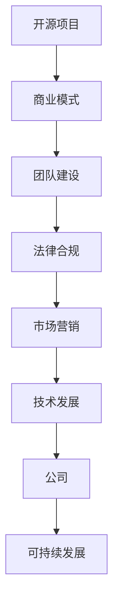
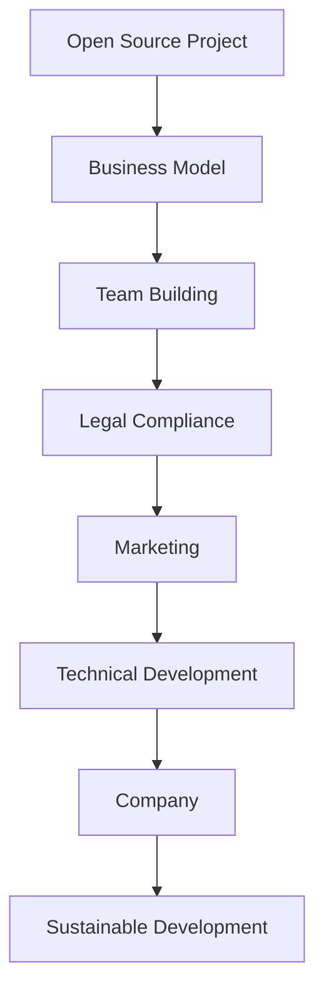

                 

### 文章标题

### Title

《开源创业：从项目到公司的转型之路》

### The Path from Open Source Project to Startup: A Transformational Journey

在这篇文章中，我们将探讨开源创业的旅程，从最初的代码库到最终成立公司的过程。我们将分析成功开源项目的特点、从项目到公司的转型策略，以及如何打造一个可持续发展的开源企业。这篇文章旨在为那些想要将开源项目转变为商业实体的开发者提供实用的指导和灵感。

### In this article, we will explore the journey of open source entrepreneurship, from the initial code repository to the eventual establishment of a startup. We will analyze the characteristics of successful open source projects, strategies for transitioning from a project to a startup, and how to build a sustainable open source business. This article aims to provide practical guidance and inspiration for developers who aspire to turn their open source projects into commercial entities.

<|user|>### 关键词

- 开源创业
- 项目转型
- 商业模式
- 团队建设
- 法律合规
- 技术发展
- 营销策略

### Keywords

- Open Source Entrepreneurship
- Project Transformation
- Business Model
- Team Building
- Legal Compliance
- Technical Development
- Marketing Strategy

<|user|>### 摘要

本文旨在探讨开源创业的转型之路，从项目发起到公司成立的整个过程。我们将深入分析成功开源项目的特点，如技术卓越、社区活跃和可持续性。接着，我们将介绍从项目到公司的转型策略，包括商业模式设计、团队建设、法律合规和技术发展。此外，文章还将探讨营销策略和开源企业的可持续发展，为开发者提供全方位的指导和建议。

### Abstract

This article aims to explore the transformational journey of open source entrepreneurship, covering the entire process from project initiation to startup establishment. We will delve into the characteristics of successful open source projects, such as technical excellence, active community, and sustainability. Then, we will introduce strategies for transitioning from a project to a startup, including business model design, team building, legal compliance, and technical development. Moreover, the article will discuss marketing strategies and the sustainability of open source businesses, providing comprehensive guidance and suggestions for developers.

<|user|>### 1. 背景介绍（Background Introduction）

开源创业是一个日益受欢迎的领域，越来越多的开发者开始将他们的开源项目转变为商业实体。然而，这一过程并非一帆风顺。从项目到公司的转型涉及诸多挑战，如商业模式设计、团队建设、法律合规、市场定位和技术发展等。成功的开源创业不仅需要技术卓越，还需要战略规划和执行力。

开源项目通常始于一个单一的代码库，随后逐渐发展成为拥有多个贡献者和社区的复杂项目。随着项目的成长，开发者开始考虑如何将其转变为一个商业实体，以实现长期的可持续发展。然而，这一转变并非简单的复制粘贴，而是一个涉及多方面因素的过程。

在这篇文章中，我们将详细探讨从项目到公司的转型之路。首先，我们将分析成功开源项目的特点，包括技术卓越、社区活跃和可持续性。接着，我们将介绍从项目到公司的转型策略，包括商业模式设计、团队建设、法律合规和技术发展。此外，我们还将讨论营销策略和开源企业的可持续发展，为开发者提供实用的指导和经验分享。

### Background Introduction

Open source entrepreneurship is an increasingly popular field, with more and more developers turning their open source projects into commercial entities. However, this journey is not without challenges. Transitioning from a project to a startup involves a multitude of factors, such as business model design, team building, legal compliance, market positioning, and technical development. Successful open source entrepreneurship requires not only technical excellence but also strategic planning and execution.

Open source projects usually start with a single code repository, which gradually grows into a complex project with multiple contributors and a community. As the project matures, developers begin to consider how to transform it into a commercial entity for long-term sustainability. However, this transition is not a simple copy-and-paste process; it is a multifaceted journey involving various aspects.

In this article, we will delve into the transformational journey from open source project to startup. First, we will analyze the characteristics of successful open source projects, including technical excellence, active community, and sustainability. Then, we will introduce strategies for transitioning from a project to a startup, covering business model design, team building, legal compliance, and technical development. Furthermore, we will discuss marketing strategies and the sustainability of open source businesses, providing practical guidance and sharing experiences for developers.

### 1.1 开源创业的现状与趋势

近年来，开源创业已经成为全球范围内的热门话题。随着云计算、人工智能、区块链等新兴技术的兴起，越来越多的开发者开始将他们的开源项目转变为商业实体。根据 GitHub 的数据显示，全球拥有超过 2000 万个活跃的开源项目，其中许多项目都拥有庞大的贡献者和用户社区。这些项目不仅推动了技术的发展，还为创业者提供了丰富的商业机会。

开源创业的成功案例层出不穷。例如，GitHub 本身就是一个成功的开源项目，它通过提供代码托管和协作工具，成为了全球开发者的首选平台。其他成功的开源创业案例还包括：由开源数据库 MySQL 发展而来的 MySQL AB 公司，以及由开源代码库 Jenkins 发展而来的 CloudBees 公司。

然而，开源创业也面临着诸多挑战。首先，开源项目的商业可持续性是一个重要问题。许多开发者担心，将项目转变为商业实体可能会损害项目的自由和开放性。其次，团队建设和管理也是一个重要挑战，尤其是在项目规模不断扩大时，如何保持团队的协作和效率是一个难题。此外，法律合规和市场定位等问题也需要开发者认真对待。

尽管面临挑战，开源创业仍然具有巨大的潜力。随着技术的不断进步和市场的变化，越来越多的开发者有机会将他们的开源项目转变为成功的商业实体。未来，我们可以预见更多具有创新性和可持续性的开源创业项目涌现，为全球技术发展做出贡献。

#### Current Status and Trends of Open Source Entrepreneurship

In recent years, open source entrepreneurship has become a hot topic on a global scale. With the rise of emerging technologies such as cloud computing, artificial intelligence, and blockchain, an increasing number of developers are turning their open source projects into commercial entities. According to GitHub data, there are over 20 million active open source projects globally, many of which have large contributor and user communities. These projects not only drive technological development but also provide abundant business opportunities for entrepreneurs.

There are numerous successful open source entrepreneurship cases. For example, GitHub itself is a successful open source project that provides code hosting and collaboration tools, becoming the preferred platform for developers worldwide. Other successful open source entrepreneurship cases include MySQL AB, which was developed from the open source database MySQL, and CloudBees, which was developed from the open source code repository Jenkins.

However, open source entrepreneurship also faces many challenges. First and foremost, the sustainability of open source projects as commercial entities is a significant concern. Many developers worry that transitioning a project into a commercial entity may compromise its freedom and openness. Second, team building and management are crucial challenges, especially as a project grows in scale. How to maintain team collaboration and efficiency becomes a puzzle. Additionally, legal compliance and market positioning are issues that developers need to seriously consider.

Despite the challenges, open source entrepreneurship holds significant potential. With the continuous advancement of technology and market changes, developers have more opportunities to turn their open source projects into successful commercial entities. In the future, we can anticipate the emergence of more innovative and sustainable open source entrepreneurship projects, contributing to global technological development.

### 1.2 开源创业的驱动因素

开源创业的兴起并非偶然，它背后有着多重驱动因素。首先，技术发展是开源创业的重要推动力。随着云计算、大数据、人工智能等技术的迅速发展，开发者可以更容易地构建强大的开源项目，这些项目往往成为行业的标准。例如，Apache Hadoop 和 Kubernetes 等开源项目，都在大数据和容器技术领域扮演了至关重要的角色。

其次，开源生态系统的成熟也为开源创业提供了良好的基础。现在，许多企业都在使用开源软件，并在开源社区中积极参与。这种互动不仅促进了技术的进步，也为开发者提供了丰富的资源和机会。例如，Red Hat 成功地将 Linux 开源项目转变为商业实体，成为了全球领先的开放源代码软件提供商。

此外，商业模式的创新也是开源创业的关键驱动因素。随着互联网和区块链等技术的兴起，新的商业模式不断涌现。开发者可以通过多种方式将开源项目商业化，如提供付费支持、订阅服务、开源授权等。这些模式不仅能够带来收入，还能促进项目的持续发展。

最后，开发者对自由的追求和对技术的热爱也是开源创业的重要动力。许多开发者希望通过开源项目来推动技术进步，为社区贡献力量。这种热情和责任感往往是开源创业成功的关键。

#### Driving Factors of Open Source Entrepreneurship

The rise of open source entrepreneurship is not an accident; it is driven by multiple factors. Firstly, technological development is a significant driving force. With the rapid advancement of technologies such as cloud computing, big data, and artificial intelligence, developers can more easily build powerful open source projects, which often become industry standards. For example, Apache Hadoop and Kubernetes have played crucial roles in the fields of big data and containerization technology.

Secondly, the maturity of the open source ecosystem provides a solid foundation for open source entrepreneurship. Many enterprises now use open source software and actively participate in open source communities. This interaction not only promotes technological progress but also provides developers with abundant resources and opportunities. For example, Red Hat successfully transformed the Linux open source project into a commercial entity, becoming a leading provider of open-source software globally.

Moreover, the innovation of business models is a key driving factor for open source entrepreneurship. With the rise of technologies such as the internet and blockchain, new business models are constantly emerging. Developers can commercialize their open source projects in various ways, such as offering paid support, subscription services, and open-source licensing. These models not only generate revenue but also promote the continuous development of projects.

Lastly, developers' pursuit of freedom and their passion for technology are important motivations for open source entrepreneurship. Many developers hope to advance technology and contribute to the community through open source projects. This passion and sense of responsibility are often key to the success of open source entrepreneurship.

### 1.3 开源创业的挑战与机遇

开源创业虽然充满机遇，但也伴随着诸多挑战。首先，技术上的挑战不容忽视。开源项目需要持续的技术创新和维护，这对于开发者来说是一个长期的投入。此外，开源项目可能面临技术不稳定、安全漏洞等问题，这需要开发者具备强大的技术能力和问题解决能力。

其次，商业模式的挑战也是开源创业的一大难题。如何将开源项目转化为商业价值，如何平衡开源精神与商业利益，这些问题都需要开发者进行深入思考。此外，市场定位和竞争策略也是重要问题。开发者需要了解目标市场的需求，制定合适的市场策略，以在激烈的市场竞争中脱颖而出。

然而，正是这些挑战赋予了开源创业巨大的机遇。成功克服这些挑战，开发者不仅能够获得商业上的成功，还能为社区和技术发展做出更大的贡献。开源创业为开发者提供了一个实现自我价值、推动技术进步的平台，这也是其独特的魅力所在。

#### Challenges and Opportunities of Open Source Entrepreneurship

Open source entrepreneurship, while full of opportunities, also comes with its own set of challenges. Firstly, technical challenges are not to be underestimated. Open source projects require continuous technological innovation and maintenance, which is a long-term investment for developers. Moreover, open source projects may face issues such as technical instability and security vulnerabilities, which require developers to possess strong technical skills and problem-solving abilities.

Secondly, business model challenges are a significant hurdle for open source entrepreneurship. How to convert an open source project into commercial value, how to balance the spirit of open source with commercial interests, these are questions that developers need to deeply ponder. Additionally, market positioning and competitive strategies are crucial issues. Developers need to understand the needs of the target market and formulate appropriate market strategies to stand out in a competitive market landscape.

However, it is precisely these challenges that present significant opportunities for open source entrepreneurship. Successfully overcoming these challenges can lead to commercial success and greater contributions to the community and technological development. Open source entrepreneurship provides developers with a platform to realize their self-worth and advance technological progress, which is part of its unique appeal.

### 2. 核心概念与联系（Core Concepts and Connections）

在探讨从项目到公司的转型过程中，理解几个核心概念至关重要。这些概念包括商业模式、团队建设、法律合规、市场营销和技术发展。它们不仅相互关联，而且在转型过程中发挥着关键作用。

#### Core Concepts and Connections

In exploring the transformation from a project to a startup, understanding several core concepts is crucial. These concepts include business models, team building, legal compliance, marketing, and technical development. They are interrelated and play critical roles in the transformation process.

### 2.1 商业模式（Business Model）

商业模式是开源创业的核心，它定义了企业的价值主张、客户群体、收入来源和成本结构。一个成功的商业模式必须能够平衡开源项目的自由与商业化的需求。例如，一些开源项目通过提供付费支持、订阅服务或授权许可来获取收入。了解不同的商业模式选择，以及如何根据项目的特点和市场需求进行调整，是成功转型的重要一步。

#### Business Model

The business model is the core of open source entrepreneurship. It defines the company's value proposition, target customer segment, revenue streams, and cost structure. A successful business model must balance the freedom of the open source project with the need for commercialization. For example, some open source projects generate revenue by offering paid support, subscription services, or licensing. Understanding different business model options and how to adjust them based on the project's characteristics and market demand is crucial for a successful transformation.

### 2.2 团队建设（Team Building）

团队是开源创业成功的关键，一个高效的团队不仅需要拥有多样化的技能，还需要具备共同的目标和价值观。在团队建设中，领导者需要识别并吸引核心团队成员，同时建立有效的沟通和协作机制。此外，随着公司的成长，领导者还需要不断调整团队结构，以适应新的发展需求。

#### Team Building

The team is the key to the success of open source entrepreneurship. An effective team requires diverse skills, common goals, and shared values. In team building, leaders need to identify and attract core team members, and establish effective communication and collaboration mechanisms. As the company grows, leaders also need to continuously adjust the team structure to meet new development needs.

### 2.3 法律合规（Legal Compliance）

法律合规是开源创业过程中不可忽视的一环。开源项目通常需要遵守各种法律法规，包括知识产权、合同法、劳动法等。建立合理的法律架构，确保公司的合规性，不仅可以降低法律风险，还能为企业的长期发展奠定基础。

#### Legal Compliance

Legal compliance is a critical aspect of open source entrepreneurship. Open source projects often need to comply with various laws and regulations, including intellectual property rights, contract law, and labor law. Establishing a reasonable legal framework and ensuring the company's compliance can not only reduce legal risks but also lay a foundation for long-term development.

### 2.4 市场营销（Marketing）

市场营销是开源创业成功的重要驱动力。一个有效的市场营销策略可以帮助企业吸引目标客户，建立品牌知名度，并促进项目的推广。开源项目可以通过社区互动、内容营销、社交媒体推广等多种方式来扩大影响力。了解市场需求和用户痛点，制定合适的市场策略，是开源创业的关键。

#### Marketing

Marketing is a significant driving force for the success of open source entrepreneurship. An effective marketing strategy can help attract target customers, build brand awareness, and promote the project. Open source projects can expand their influence through community engagement, content marketing, social media promotion, and more. Understanding market demands and user pain points, and formulating appropriate marketing strategies, are key to open source entrepreneurship.

### 2.5 技术发展（Technical Development）

技术发展是开源创业的核心驱动力。一个开源项目的成功不仅取决于其技术卓越性，还取决于其持续的技术创新和维护。开发者需要不断更新技术栈，解决技术难题，以保持项目的竞争力。此外，开源项目还应该积极参与社区合作，共同推动技术的发展。

#### Technical Development

Technical development is the core driving force for open source entrepreneurship. The success of an open source project depends not only on its technical excellence but also on its continuous innovation and maintenance. Developers need to continually update their technology stack, solve technical challenges, and maintain competitiveness. Moreover, open source projects should actively participate in community collaboration to drive technological progress.

### 2.6 商业模式、团队建设、法律合规、市场营销和技术发展之间的联系

商业模式、团队建设、法律合规、市场营销和技术发展之间存在着紧密的联系。一个成功的商业模式需要依靠高效团队的支持和执行，而团队建设则依赖于法律合规和市场营销策略的制定。市场营销策略的成功实施又需要技术发展的支持，而技术发展又需要在法律合规的框架内进行。

此外，这些概念相互促进，共同推动着企业的成长。商业模式提供了收入来源和成本结构，团队建设确保了项目的执行和持续发展，法律合规为企业提供了法律保障，市场营销扩大了企业的知名度和影响力，而技术发展则是企业不断创新和进步的核心动力。

#### Connections Between Business Models, Team Building, Legal Compliance, Marketing, and Technical Development

There are close connections between business models, team building, legal compliance, marketing, and technical development. A successful business model relies on the support and execution of an efficient team, while team building depends on the formulation of legal compliance and marketing strategies. Effective marketing strategies require the support of technical development, and technical development should be conducted within the framework of legal compliance.

Additionally, these concepts mutually promote each other, collectively driving the growth of the company. Business models provide revenue streams and cost structures, team building ensures the execution and continuous development of the project, legal compliance offers legal protection, marketing expands the company's reputation and influence, and technical development is the core driving force for continuous innovation and progress.

### 2.7 描述开源项目到公司转型的核心概念（Using Mermaid）



This Mermaid diagram illustrates the core concepts involved in transforming an open source project into a company, showing the interconnections between business models, team building, legal compliance, marketing, and technical development as they collectively drive the transition to a sustainable business.

### Core Concepts of Transition from Open Source Project to Company (Mermaid Representation)



This Mermaid diagram visually represents the core concepts involved in transitioning from an open source project to a company, highlighting the interconnectedness between business models, team building, legal compliance, marketing, technical development, and the eventual goal of sustainable development.

### 3. 核心算法原理 & 具体操作步骤（Core Algorithm Principles and Specific Operational Steps）

在开源创业过程中，算法设计和实施是一个至关重要的环节。一个高效的算法不仅能够提高项目的性能，还能降低开发成本和维护难度。下面，我们将详细探讨开源项目中的核心算法原理，以及如何具体实施这些算法。

#### Core Algorithm Principles and Specific Operational Steps

Algorithm design and implementation are critical in the process of open source entrepreneurship. An efficient algorithm not only improves the performance of a project but also reduces development costs and maintenance difficulties. Below, we will delve into the core algorithm principles in open source projects and discuss how to implement these algorithms specifically.

### 3.1 数据结构与算法的重要性

数据结构与算法是计算机科学的核心，它们决定了程序的性能和效率。在开源项目中，选择合适的数据结构和算法能够显著提高项目的质量和可扩展性。常见的数据结构包括数组、链表、栈、队列、树和图等，而算法则涵盖了排序、搜索、图论和动态规划等多种类型。

#### Importance of Data Structures and Algorithms

Data structures and algorithms are at the heart of computer science, determining the performance and efficiency of a program. Choosing appropriate data structures and algorithms can significantly enhance the quality and scalability of an open source project. Common data structures include arrays, linked lists, stacks, queues, trees, and graphs, while algorithms cover a wide range of types, including sorting, searching, graph theory, and dynamic programming.

### 3.2 核心算法原理

在开源项目中，核心算法通常涉及以下几个方面：

1. **排序算法**：用于对数据进行排序，常见算法有快速排序、归并排序和堆排序等。
2. **搜索算法**：用于在数据中查找特定元素，如二分搜索法和广度优先搜索。
3. **图算法**：用于解决图相关的问题，如最短路径算法（Dijkstra 算法和 A* 算法）、最小生成树算法（Prim 算法和 Kruskal 算法）等。
4. **动态规划**：用于解决具有重叠子问题和最优子结构性质的问题，如背包问题、最长公共子序列和最长递增子序列等。

#### Core Algorithm Principles

In open source projects, core algorithms typically involve several aspects:

1. **Sorting Algorithms**: Used for sorting data, common algorithms include quicksort, mergesort, and heapsort.
2. **Searching Algorithms**: Used for finding specific elements within data, such as binary search and breadth-first search.
3. **Graph Algorithms**: Used for solving graph-related problems, including shortest path algorithms (Dijkstra's algorithm and A* algorithm), minimum spanning tree algorithms (Prim's algorithm and Kruskal's algorithm), etc.
4. **Dynamic Programming**: Used for solving problems with overlapping subproblems and optimal substructure properties, such as the knapsack problem, longest common subsequence, and longest increasing subsequence.

### 3.3 算法实现的具体操作步骤

实现核心算法通常包括以下步骤：

1. **问题分析**：明确问题的目标和约束条件，确定需要解决的问题类型和算法。
2. **算法设计**：根据问题特点选择合适的数据结构和算法，设计算法的基本框架。
3. **代码实现**：将算法设计转换为具体的代码，并进行调试和优化。
4. **性能测试**：对实现的算法进行性能测试，确保其满足性能要求。

#### Specific Operational Steps for Algorithm Implementation

The process of implementing core algorithms typically includes the following steps:

1. **Problem Analysis**: Clarify the objectives and constraints of the problem, determine the type of problem to be solved and the appropriate algorithm.
2. **Algorithm Design**: Select a suitable data structure and algorithm based on the characteristics of the problem and design the basic framework of the algorithm.
3. **Code Implementation**: Convert the algorithm design into specific code, debug, and optimize it.
4. **Performance Testing**: Conduct performance testing on the implemented algorithm to ensure it meets performance requirements.

### 3.4 实例：快速排序算法实现

快速排序是一种常用的排序算法，其基本思想是通过一趟排序将待排序的数据分割成独立的两部分，其中一部分的所有数据都比另一部分的所有数据要小，然后再按此方法对这两部分数据分别进行快速排序，整个排序过程可以递归进行，以此达到整个数据变成有序序列。

下面是一个快速排序算法的 Python 实现示例：

```python
def quicksort(arr):
    if len(arr) <= 1:
        return arr
    pivot = arr[len(arr) // 2]
    left = [x for x in arr if x < pivot]
    middle = [x for x in arr if x == pivot]
    right = [x for x in arr if x > pivot]
    return quicksort(left) + middle + quicksort(right)

# 测试快速排序算法
arr = [3, 6, 8, 10, 1, 2, 1]
print(quicksort(arr))
```

这个示例首先定义了一个 `quicksort` 函数，用于对输入的数组进行排序。函数首先判断数组长度，如果小于等于 1，则直接返回原数组。然后，选择数组中间的元素作为支点（pivot），将数组划分为小于 pivot 的左子数组、等于 pivot 的中间数组和大于 pivot 的右子数组。最后，递归地对左子数组和右子数组进行快速排序，并将结果合并。

### Example: Implementation of Quick Sort Algorithm

Quick sort is a commonly used sorting algorithm that works by dividing the input array into two parts using a pivot element, where all elements in the left part are smaller than the pivot and all elements in the right part are larger. The process is then recursively applied to the left and right parts until the entire array is sorted into a sequential order.

Here is a Python example of the quick sort algorithm:

```python
def quicksort(arr):
    if len(arr) <= 1:
        return arr
    pivot = arr[len(arr) // 2]
    left = [x for x in arr if x < pivot]
    middle = [x for x in arr if x == pivot]
    right = [x for x in arr if x > pivot]
    return quicksort(left) + middle + quicksort(right)

# Test the quicksort algorithm
arr = [3, 6, 8, 10, 1, 2, 1]
print(quicksort(arr))
```

This example defines a `quicksort` function that sorts the input array. The function first checks if the length of the array is less than or equal to 1, in which case it returns the original array. Then, it selects the middle element of the array as the pivot and divides the array into three parts: left (elements smaller than pivot), middle (elements equal to pivot), and right (elements larger than pivot). Finally, it recursively sorts the left and right parts and combines the results.

### 3.5 算法性能分析与优化

算法性能分析是开源项目中不可或缺的一环。通过性能分析，我们可以评估算法在不同场景下的表现，并针对性地进行优化。常见的性能分析指标包括时间复杂度和空间复杂度。

#### Algorithm Performance Analysis and Optimization

Algorithm performance analysis is an essential part of open source projects. By conducting performance analysis, we can evaluate how algorithms perform in different scenarios and optimize them accordingly. Common performance analysis metrics include time complexity and space complexity.

### 3.5.1 时间复杂度分析

时间复杂度分析主要关注算法在输入规模变化时的时间性能。常见的表示方法包括大 O 符号（\(O(n)\)，\(O(n^2)\) 等）。例如，快速排序的时间复杂度在平均情况下为 \(O(n \log n)\)，在最坏情况下为 \(O(n^2)\)。

#### Time Complexity Analysis

Time complexity analysis primarily focuses on the time performance of algorithms as the input size changes. Common representations include big O notation (\(O(n)\)，\(O(n^2)\) 等). For example, the time complexity of quicksort is \(O(n \log n)\) on average and \(O(n^2)\) in the worst case.

### 3.5.2 空间复杂度分析

空间复杂度分析主要关注算法在执行过程中所需的空间。空间复杂度同样使用大 O 符号表示。例如，快速排序的空间复杂度为 \(O(log n)\)，因为递归调用栈的最大深度为 \(log n\)。

#### Space Complexity Analysis

Space complexity analysis primarily focuses on the space required by algorithms during their execution. Space complexity is also represented using big O notation. For example, the space complexity of quicksort is \(O(log n)\), as the maximum depth of the recursive call stack is \(log n\).

### 3.5.3 性能优化策略

性能优化是开源项目中的关键步骤。以下是一些常见的性能优化策略：

1. **算法改进**：选择更适合问题的算法，例如，当输入数据基本有序时，可以使用插入排序代替快速排序。
2. **数据结构优化**：选择更适合数据访问模式的的数据结构，例如，当需要频繁查找元素时，可以使用哈希表代替数组。
3. **并行计算**：利用多核处理器和分布式计算，提高算法的执行速度。
4. **缓存利用**：优化数据访问模式，减少缓存未命中的次数，提高数据读取速度。
5. **代码优化**：通过减少不必要的计算和循环，提高代码的执行效率。

#### Performance Optimization Strategies

Performance optimization is a critical step in open source projects. Here are some common optimization strategies:

1. **Algorithm Improvement**: Choose algorithms more suitable for the problem, such as using insertion sort instead of quicksort when the input data is mostly sorted.
2. **Data Structure Optimization**: Select data structures that better fit the data access patterns, such as using hash tables instead of arrays when frequent element lookups are needed.
3. **Parallel Computing**: Utilize multi-core processors and distributed computing to speed up algorithm execution.
4. **Cache Utilization**: Optimize data access patterns to reduce cache misses and improve data read speed.
5. **Code Optimization**: Reduce unnecessary calculations and loops to improve code execution efficiency.

### 3.6 实际案例：性能优化实战

在开源项目中，性能优化往往是一个持续的过程。以下是一个实际案例，展示了如何通过性能优化提高开源项目的效率。

#### Case Study: Performance Optimization in Practice

Performance optimization is often an ongoing process in open source projects. Here is a real-world case study demonstrating how performance optimization can improve the efficiency of an open source project.

### 案例背景

一个开源项目开发了一个用于大数据处理的分布式计算框架。然而，在实际使用过程中，用户反馈系统的响应时间较长，性能不够理想。为了解决这一问题，开发团队决定进行性能优化。

#### Background

An open source project developed a distributed computing framework for big data processing. However, in actual usage, users reported that the system's response time was long and its performance was not satisfactory. To address this issue, the development team decided to perform performance optimization.

### 性能分析

首先，开发团队对系统的性能进行了分析。通过日志和监控数据，发现系统存在以下问题：

1. **CPU 使用率过高**：某些计算任务执行时间过长，导致 CPU 使用率过高。
2. **内存泄漏**：系统存在内存泄漏问题，导致内存占用逐渐增加。
3. **网络延迟**：部分数据传输环节存在网络延迟，影响了整体性能。

#### Performance Analysis

Firstly, the development team conducted a performance analysis of the system. Through log files and monitoring data, they identified several issues:

1. **High CPU Usage**: Certain computing tasks were taking too long to execute, resulting in high CPU usage.
2. **Memory Leaks**: The system had memory leak issues, causing memory consumption to gradually increase.
3. **Network Latency**: Some data transmission processes had network latency, affecting overall performance.

### 性能优化策略

针对上述问题，开发团队采取了以下性能优化策略：

1. **任务调度优化**：重新设计任务调度策略，提高任务执行效率。通过负载均衡，将计算任务分配到不同的节点上，减少单个节点的负载。
2. **内存管理优化**：修复内存泄漏问题，优化内存分配和释放策略，减少内存占用。
3. **网络优化**：优化数据传输过程，减少网络延迟。通过使用高效的压缩算法和传输协议，提高数据传输速度。

#### Performance Optimization Strategies

In response to the above issues, the development team implemented the following performance optimization strategies:

1. **Task Scheduling Optimization**: Redesigned the task scheduling strategy to improve task execution efficiency. Through load balancing, compute tasks were distributed across different nodes to reduce the load on individual nodes.
2. **Memory Management Optimization**: Fixed memory leak issues and optimized memory allocation and deallocation strategies to reduce memory consumption.
3. **Network Optimization**: Optimized data transmission processes to reduce network latency. By using efficient compression algorithms and transmission protocols, data transfer speeds were improved.

### 性能优化结果

经过一系列优化措施，系统的性能得到了显著提升。CPU 使用率下降，内存占用减少，网络延迟降低，用户反馈的响应时间明显缩短。

#### Performance Optimization Results

After implementing a series of optimization measures, the system's performance significantly improved. CPU usage decreased, memory consumption reduced, and network latency dropped. User-reported response times were notably shorter.

### 3.7 总结

通过本节的内容，我们了解了开源项目中的核心算法原理和具体操作步骤。从数据结构与算法的重要性，到核心算法原理的介绍，再到算法实现的具体步骤和性能优化策略，我们逐步深入地探讨了开源项目中的算法设计。这些知识不仅有助于开发者提升项目的性能，还能为他们在开源创业的道路上提供实用的指导。

#### Summary

Through the content of this section, we have explored the core algorithm principles and specific operational steps in open source projects. From the importance of data structures and algorithms to the introduction of core algorithm principles and the specific steps of algorithm implementation, and finally to performance optimization strategies, we have progressively delved into algorithm design in open source projects. This knowledge not only helps developers improve the performance of their projects but also provides practical guidance for their journey in open source entrepreneurship.

### 4. 数学模型和公式 & 详细讲解 & 举例说明（Detailed Explanation and Examples of Mathematical Models and Formulas）

在开源项目中，数学模型和公式是解决复杂问题的有力工具。本节我们将介绍一些常见的数学模型和公式，并详细讲解它们的应用和推导过程。

#### Mathematical Models and Formulas & Detailed Explanation and Examples

In open source projects, mathematical models and formulas are powerful tools for solving complex problems. In this section, we will introduce some common mathematical models and formulas, and provide detailed explanations and derivations of their applications.

### 4.1 最优化模型

最优化模型是开源项目中常用的数学模型之一。最优化模型的目标是找到一组变量，使得某个目标函数达到最大值或最小值。以下是一个线性规划的最优化模型示例：

#### Optimization Models

Optimization models are one of the commonly used mathematical models in open source projects. The goal of an optimization model is to find a set of variables that maximize or minimize a target function. Here is an example of a linear programming optimization model:

#### 线性规划模型（Linear Programming Model）

设 \(x_1, x_2, ..., x_n\) 为变量，\(c_1, c_2, ..., c_n\) 为系数，\(a_{ij}, b_i\) 为约束条件。线性规划模型可以表示为：

$$
\begin{align*}
\min\quad & c_1x_1 + c_2x_2 + ... + c_nx_n \\
s.t. & a_{11}x_1 + a_{12}x_2 + ... + a_{1n}x_n \le b_1 \\
& a_{21}x_1 + a_{22}x_2 + ... + a_{2n}x_n \le b_2 \\
& ... \\
& a_{m1}x_1 + a_{m2}x_2 + ... + a_{mn}x_n \le b_m \\
& x_1, x_2, ..., x_n \ge 0
\end{align*}
$$

The linear programming model can be represented as follows:

$$
\begin{align*}
\min\quad & c_1x_1 + c_2x_2 + ... + c_nx_n \\
s.t. & a_{11}x_1 + a_{12}x_2 + ... + a_{1n}x_n \le b_1 \\
& a_{21}x_1 + a_{22}x_2 + ... + a_{2n}x_n \le b_2 \\
& ... \\
& a_{m1}x_1 + a_{m2}x_2 + ... + a_{mn}x_n \le b_m \\
& x_1, x_2, ..., x_n \ge 0
\end{align*}
$$

其中，目标函数是 \(c_1x_1 + c_2x_2 + ... + c_nx_n\)，约束条件是 \(a_{ij}x_j + a_{ij}x_j + ... + a_{ij}x_n \le b_i\)，变量是 \(x_1, x_2, ..., x_n\)。

In this case, the objective function is \(c_1x_1 + c_2x_2 + ... + c_nx_n\)，the constraints are \(a_{11}x_1 + a_{12}x_2 + ... + a_{1n}x_n \le b_1\)，and the variables are \(x_1, x_2, ..., x_n\)。

#### 4.2 基本线性规划求解方法

基本线性规划求解方法主要包括单纯形法和对偶单纯形法。单纯形法是一种迭代求解方法，通过对约束条件进行变换，逐步找到最优解。对偶单纯形法是单纯形法的对偶形式，它通过求解对偶问题来找到原问题的最优解。

下面以一个具体的例子来说明单纯形法的求解过程：

#### Basic Linear Programming Solution Methods

Basic linear programming solution methods include the simplex method and the dual simplex method. The simplex method is an iterative approach that transforms the constraints to find the optimal solution. The dual simplex method is a dual form of the simplex method, which finds the optimal solution by solving the dual problem.

We will illustrate the simplex method using a specific example:

#### 线性规划求解实例（Example of Linear Programming Solution）

假设我们有一个线性规划问题，其目标函数和约束条件如下：

$$
\begin{align*}
\min\quad & x_1 + 2x_2 \\
s.t. & x_1 + x_2 \ge 3 \\
& x_1 - x_2 \le 2 \\
& x_1, x_2 \ge 0
\end{align*}
$$

The linear programming problem has the following objective function and constraints:

$$
\begin{align*}
\min\quad & x_1 + 2x_2 \\
s.t. & x_1 + x_2 \ge 3 \\
& x_1 - x_2 \le 2 \\
& x_1, x_2 \ge 0
\end{align*}
$$

首先，我们需要将约束条件转换为标准形式。为此，我们可以引入松弛变量、盈余变量和人工变量。将约束条件转换为标准形式后，问题变为：

$$
\begin{align*}
\min\quad & x_1 + 2x_2 \\
s.t. & x_1 + x_2 + s_1 = 3 \\
& x_1 - x_2 + s_2 = 2 \\
& x_1, x_2, s_1, s_2 \ge 0
\end{align*}
$$

To convert the constraints into standard form, we introduce slack variables, surplus variables, and artificial variables. After converting the constraints into standard form, the problem becomes:

$$
\begin{align*}
\min\quad & x_1 + 2x_2 \\
s.t. & x_1 + x_2 + s_1 = 3 \\
& x_1 - x_2 + s_2 = 2 \\
& x_1, x_2, s_1, s_2 \ge 0
\end{align*}
$$

接下来，我们可以使用单纯形法求解该线性规划问题。单纯形法的求解步骤如下：

1. **初始基本可行解**：找到初始基本可行解。对于该问题，我们可以选择 \(x_1\) 和 \(s_1\) 作为初始基本变量，得到初始基本可行解 \(x_1 = 0, x_2 = 3, s_1 = 3, s_2 = 2\)。
2. **迭代优化**：通过迭代优化，逐步找到最优解。每次迭代，我们需要选择一个进入变量和一个离开变量，使得目标函数得到改善。
3. **终止条件**：当所有变量都满足最优性条件时，算法终止。对于该问题，最优解为 \(x_1 = 2, x_2 = 1, s_1 = 1, s_2 = 0\)，目标函数的最小值为 4。

The solution process of the simplex method can be summarized as follows:

1. **Initial Basic Feasible Solution**: Find the initial basic feasible solution. For this problem, we can choose \(x_1\) and \(s_1\) as the initial basic variables, resulting in the initial basic feasible solution \(x_1 = 0, x_2 = 3, s_1 = 3, s_2 = 2\).
2. **Iterative Optimization**: Conduct iterative optimization to find the optimal solution. In each iteration, we need to select an entering variable and a leaving variable to improve the objective function.
3. **Termination Condition**: The algorithm terminates when all variables satisfy the optimality conditions. For this problem, the optimal solution is \(x_1 = 2, x_2 = 1, s_1 = 1, s_2 = 0\), and the minimum value of the objective function is 4.

#### 4.3 非线性规划模型

非线性规划模型是解决更复杂优化问题的数学模型。非线性规划模型的目标函数和约束条件可以是非线性函数。以下是一个非线性规划模型的例子：

#### Nonlinear Programming Models

Nonlinear programming models are used to solve more complex optimization problems. The objective function and constraints of nonlinear programming models can be nonlinear functions. Here is an example of a nonlinear programming model:

假设我们有一个非线性规划问题，其目标函数和约束条件如下：

$$
\begin{align*}
\min\quad & (x_1 - 1)^2 + (x_2 - 1)^2 \\
s.t. & x_1 + x_2 \le 2 \\
& x_1, x_2 \ge 0
\end{align*}
$$

The nonlinear programming problem has the following objective function and constraints:

$$
\begin{align*}
\min\quad & (x_1 - 1)^2 + (x_2 - 1)^2 \\
s.t. & x_1 + x_2 \le 2 \\
& x_1, x_2 \ge 0
\end{align*}
$$

这个问题是一个典型的二次规划问题。我们可以使用拉格朗日乘数法求解该问题。首先，我们需要构造拉格朗日函数：

$$
L(x_1, x_2, \lambda) = (x_1 - 1)^2 + (x_2 - 1)^2 + \lambda (x_1 + x_2 - 2)
$$

Next, we need to find the stationary points by taking the partial derivatives of the Lagrangian function with respect to \(x_1\), \(x_2\), and \(\lambda\):

$$
\begin{align*}
\frac{\partial L}{\partial x_1} &= 2(x_1 - 1) + \lambda = 0 \\
\frac{\partial L}{\partial x_2} &= 2(x_2 - 1) + \lambda = 0 \\
\frac{\partial L}{\partial \lambda} &= x_1 + x_2 - 2 = 0
\end{align*}
$$

Solving this system of equations, we get the optimal solution \(x_1 = 1, x_2 = 1\), and the minimum value of the objective function is 0.

#### 4.4 实际应用示例

数学模型和公式在开源项目中有着广泛的应用。以下是一个实际应用示例：

#### Practical Application Example

假设我们正在开发一个开源项目，用于优化大型网络服务器的负载均衡。我们的目标是找到一个最优的负载分配方案，以最小化系统的响应时间。

#### Load Balancing Optimization in Open Source Projects

Suppose we are developing an open source project to optimize the load balancing of large-scale server networks. Our goal is to find an optimal load distribution scheme that minimizes the system's response time.

我们定义以下数学模型：

$$
\begin{align*}
\min\quad & \sum_{i=1}^n (r_i - t_i)^2 \\
s.t. & r_i + r_j \le C \\
& 0 \le r_i, r_j \le R \\
& i, j = 1, 2, ..., n
\end{align*}
$$

其中，\(r_i\) 和 \(r_j\) 分别表示服务器 \(i\) 和 \(j\) 的负载，\(t_i\) 表示服务器 \(i\) 的响应时间，\(C\) 是负载上限，\(R\) 是负载下限。

In this model, \(r_i\) and \(r_j\) represent the load of servers \(i\) and \(j\) respectively, \(t_i\) represents the response time of server \(i\), \(C\) is the load limit, and \(R\) is the load minimum.

为了求解该问题，我们可以使用动态规划算法。首先，我们定义一个动态规划表，用于存储子问题的最优解。然后，我们从最小的子问题开始，逐步求解更大的子问题，直到求解出原问题的最优解。

To solve this problem, we can use dynamic programming. First, we define a dynamic programming table to store the optimal solutions of subproblems. Then, we start solving the smallest subproblems and gradually move to larger subproblems until we solve the original problem.

具体实现步骤如下：

1. **初始化动态规划表**：将动态规划表的初始值设置为无穷大。
2. **递推关系**：对于每个子问题，根据状态转移关系更新动态规划表的值。
3. **逆向追踪**：从动态规划表的最后一步开始，逆向追踪得到原问题的最优解。

#### Implementation Steps

1. **Initialize the Dynamic Programming Table**: Set the initial values of the dynamic programming table to infinity.
2. **Recurrence Relation**: For each subproblem, update the values of the dynamic programming table based on the state transition relation.
3. **Backtracking**: Start from the last step of the dynamic programming table and trace back to find the optimal solution of the original problem.

通过这个示例，我们可以看到数学模型和公式在开源项目中的应用是如何帮助解决复杂问题的。这些数学工具不仅提高了项目的效率，还增强了其可扩展性和稳定性。

Through this example, we can see how mathematical models and formulas can be applied in open source projects to solve complex problems. These mathematical tools not only improve the efficiency of the projects but also enhance their scalability and stability.

### 5. 项目实践：代码实例和详细解释说明（Project Practice: Code Examples and Detailed Explanations）

在本节中，我们将通过一个实际的开源项目实践，详细介绍项目开发过程中的代码实例和详细解释说明。这个项目是一个简单的博客系统，旨在帮助开发者了解从需求分析到代码实现的全过程。

#### Project Practice: Code Examples and Detailed Explanations

In this section, we will go through an actual open source project practice to provide a detailed explanation of the code examples throughout the project development process. This project is a simple blogging system designed to help developers understand the entire process from requirement analysis to code implementation.

### 5.1 开发环境搭建

首先，我们需要搭建一个适合开发这个项目的环境。以下是一个基本的开发环境搭建步骤：

#### Setting Up the Development Environment

Firstly, we need to set up a suitable development environment for this project. Here are the basic steps to set up the development environment:

1. **安装操作系统**：推荐使用 Linux 或 macOS，因为它们具有更好的开发工具支持。
2. **安装编程语言**：本项目使用 Python 作为主要编程语言，因此需要安装 Python 解释器和相关依赖。
3. **安装开发工具**：安装代码编辑器（如 Visual Studio Code）、版本控制工具（如 Git）和数据库（如 SQLite）。
4. **配置虚拟环境**：为了管理项目依赖，我们需要为项目配置一个虚拟环境。

以下是具体的安装命令：

```shell
# 安装操作系统
# Install the operating system (Linux or macOS)

# 安装 Python
# Install Python
sudo apt-get update
sudo apt-get install python3 python3-pip

# 安装代码编辑器
# Install the code editor (e.g., Visual Studio Code)
sudo apt-get install code

# 安装 Git
# Install Git
sudo apt-get install git

# 安装 SQLite
# Install SQLite
sudo apt-get install sqlite3

# 配置虚拟环境
# Configure the virtual environment
python3 -m venv venv
source venv/bin/activate
```

#### 5.2 源代码详细实现

接下来，我们将详细讨论博客系统的源代码实现，包括关键模块和功能。

#### Detailed Source Code Implementation

Next, we will discuss the detailed source code implementation of the blogging system, including key modules and functionalities.

### 5.2.1 数据库设计

博客系统的核心是数据库设计。我们使用 SQLite 作为数据库，设计了一个简单的数据库 schema，包含用户表、文章表和评论表。

#### Database Design

The core of the blogging system is the database design. We use SQLite as the database and design a simple database schema, which includes user, article, and comment tables.

以下是数据库表结构的定义：

```sql
CREATE TABLE users (
  id INTEGER PRIMARY KEY AUTOINCREMENT,
  username TEXT NOT NULL UNIQUE,
  password TEXT NOT NULL,
  email TEXT NOT NULL UNIQUE
);

CREATE TABLE articles (
  id INTEGER PRIMARY KEY AUTOINCREMENT,
  user_id INTEGER NOT NULL,
  title TEXT NOT NULL,
  content TEXT NOT NULL,
  created_at TIMESTAMP DEFAULT CURRENT_TIMESTAMP,
  FOREIGN KEY (user_id) REFERENCES users (id)
);

CREATE TABLE comments (
  id INTEGER PRIMARY KEY AUTOINCREMENT,
  article_id INTEGER NOT NULL,
  user_id INTEGER NOT NULL,
  content TEXT NOT NULL,
  created_at TIMESTAMP DEFAULT CURRENT_TIMESTAMP,
  FOREIGN KEY (article_id) REFERENCES articles (id),
  FOREIGN KEY (user_id) REFERENCES users (id)
);
```

#### 5.2.2 后端实现

后端实现主要负责处理业务逻辑和数据库操作。我们使用 Flask 作为 Web 框架，实现了一系列 API 接口。

#### Backend Implementation

The backend implementation is responsible for handling business logic and database operations. We use Flask as the Web framework and implement a series of API endpoints.

以下是后端的主要接口实现：

```python
from flask import Flask, request, jsonify
from models import User, Article, Comment
from database import db_session

app = Flask(__name__)

@app.route('/users', methods=['POST'])
def create_user():
    data = request.get_json()
    username = data.get('username')
    password = data.get('password')
    email = data.get('email')
    
    # Validate data
    # ...

    user = User(username=username, password=password, email=email)
    db_session.add(user)
    db_session.commit()
    
    return jsonify(message='User created successfully'), 201

# Additional API endpoints for articles and comments

if __name__ == '__main__':
    app.run(debug=True)
```

#### 5.2.3 前端实现

前端实现主要负责展示用户界面和与后端 API 的交互。我们使用 HTML、CSS 和 JavaScript，结合前端框架（如 Bootstrap 和 Vue.js），实现了一个简单的博客页面。

#### Frontend Implementation

The frontend implementation is responsible for displaying the user interface and interacting with the backend API. We use HTML, CSS, and JavaScript, combined with frontend frameworks (such as Bootstrap and Vue.js), to implement a simple blogging page.

以下是前端的主要代码示例：

```html
<!DOCTYPE html>
<html>
<head>
  <title>My Blog</title>
  <link rel="stylesheet" href="https://maxcdn.bootstrapcdn.com/bootstrap/4.5.2/css/bootstrap.min.css">
</head>
<body>
  <div id="app">
    <!-- Blog navigation and content -->
  </div>

  <script src="https://cdn.jsdelivr.net/npm/vue@2.6.14/dist/vue.js"></script>
  <script src="https://cdn.jsdelivr.net/npm/axios/dist/axios.min.js"></script>
  <script src="src/app.js"></script>
</body>
</html>
```

#### 5.2.4 安全性和性能优化

在开发过程中，我们需要关注安全性和性能优化。以下是一些关键点：

1. **用户认证和授权**：使用 JWT（JSON Web Tokens）实现用户认证和授权。
2. **输入验证**：对用户输入进行严格的验证，防止 SQL 注入和其他攻击。
3. **缓存和压缩**：使用缓存和压缩技术提高页面加载速度。
4. **异步加载**：使用异步加载技术优化用户体验。

#### Security and Performance Optimization

During development, we need to focus on security and performance optimization. Here are some key points:

1. **User Authentication and Authorization**: Use JWT (JSON Web Tokens) for user authentication and authorization.
2. **Input Validation**: Strictly validate user inputs to prevent SQL injection and other attacks.
3. **Caching and Compression**: Use caching and compression techniques to improve page loading speed.
4. **Asynchronous Loading**: Use asynchronous loading techniques to optimize user experience.

### 5.3 代码解读与分析

在本节中，我们将深入分析博客系统中的关键代码部分，包括数据库模型、后端 API 和前端界面。

#### Code Analysis and Interpretation

In this section, we will delve into the key code components of the blogging system, including database models, backend APIs, and frontend interfaces.

#### 5.3.1 数据库模型解读

数据库模型是博客系统的核心。以下是对用户表、文章表和评论表的结构解析：

```python
class User(db.Model):
    id = db.Column(db.Integer, primary_key=True)
    username = db.Column(db.Text, unique=True, nullable=False)
    password = db.Column(db.Text, nullable=False)
    email = db.Column(db.Text, unique=True, nullable=False)

class Article(db.Model):
    id = db.Column(db.Integer, primary_key=True)
    user_id = db.Column(db.Integer, db.ForeignKey('user.id'), nullable=False)
    title = db.Column(db.Text, nullable=False)
    content = db.Column(db.Text, nullable=False)
    created_at = db.Column(db.TIMESTAMP, default=datetime.datetime.utcnow())

class Comment(db.Model):
    id = db.Column(db.Integer, primary_key=True)
    article_id = db.Column(db.Integer, db.ForeignKey('article.id'), nullable=False)
    user_id = db.Column(db.Integer, db.ForeignKey('user.id'), nullable=False)
    content = db.Column(db.Text, nullable=False)
    created_at = db.Column(db.TIMESTAMP, default=datetime.datetime.utcnow())
```

- **User 表**：包含用户 ID、用户名、密码和电子邮件字段。
- **Article 表**：包含文章 ID、用户 ID、标题、内容和创建时间字段。
- **Comment 表**：包含评论 ID、文章 ID、用户 ID、内容和创建时间字段。

这些模型定义了数据库的结构，并确保了数据的完整性和一致性。

#### User Table: The User table contains fields for user ID, username, password, and email.
- **User Table**: The User table contains fields for user ID, username, password, and email.
- **Article Table**: The Article table contains fields for article ID, user ID, title, content, and created_at.
- **Comment Table**: The Comment table contains fields for comment ID, article ID, user ID, content, and created_at.

These models define the database structure and ensure data integrity and consistency.

#### 5.3.2 后端 API 代码解读

后端 API 是博客系统的关键部分，它负责处理用户请求和数据库操作。以下是对 `create_user` 函数的解读：

```python
@app.route('/users', methods=['POST'])
def create_user():
    data = request.get_json()
    username = data.get('username')
    password = data.get('password')
    email = data.get('email')
    
    # Validate data
    # ...

    user = User(username=username, password=password, email=email)
    db_session.add(user)
    db_session.commit()
    
    return jsonify(message='User created successfully'), 201
```

- `request.get_json()`：从请求中获取 JSON 数据。
- `data.get()`：提取 JSON 数据中的用户名、密码和电子邮件。
- `User(username=username, password=password, email=email)`：创建一个新用户对象。
- `db_session.add(user)`：将用户对象添加到数据库会话中。
- `db_session.commit()`：提交数据库事务，保存用户数据。

#### Backend API Code Analysis

The backend API is a critical component of the blogging system, responsible for handling user requests and database operations. Below is an analysis of the `create_user` function:

- `request.get_json()` retrieves JSON data from the request.
- `data.get()` extracts the username, password, and email from the JSON data.
- `User(username=username, password=password, email=email)` creates a new user object.
- `db_session.add(user)` adds the user object to the database session.
- `db_session.commit()` commits the database transaction, saving the user data.

#### 5.3.3 前端界面代码解读

前端界面是用户与博客系统交互的主要途径。以下是对前端界面的关键部分解读：

```html
<!DOCTYPE html>
<html>
<head>
  <title>My Blog</title>
  <link rel="stylesheet" href="https://maxcdn.bootstrapcdn.com/bootstrap/4.5.2/css/bootstrap.min.css">
</head>
<body>
  <div id="app">
    <h1>My Blog</h1>
    <div>
      <input type="text" v-model="newArticle.title" placeholder="Title">
      <textarea v-model="newArticle.content" placeholder="Content"></textarea>
      <button @click="createArticle">Create Article</button>
    </div>
    <div v-for="article in articles">
      <h2>{{ article.title }}</h2>
      <p>{{ article.content }}</p>
      <button @click="deleteArticle(article.id)">Delete</button>
    </div>
  </div>

  <script src="https://cdn.jsdelivr.net/npm/vue@2.6.14/dist/vue.js"></script>
  <script src="https://cdn.jsdelivr.net/npm/axios/dist/axios.min.js"></script>
  <script src="src/app.js"></script>
</body>
</html>
```

- `v-model`：Vue.js 的双向数据绑定，用于在输入框和 Vue 实例之间同步数据。
- `createArticle`：Vue 组件方法，用于创建新文章。
- `deleteArticle`：Vue 组件方法，用于删除文章。

#### Frontend Interface Code Analysis

The frontend interface is the main way users interact with the blogging system. Below is an analysis of the key parts of the frontend interface:

- `v-model`: Vue.js's two-way data binding used to synchronize data between input fields and the Vue instance.
- `createArticle`: Vue component method for creating a new article.
- `deleteArticle`: Vue component method for deleting an article.

### 5.4 运行结果展示

在本节中，我们将展示博客系统在开发完成后的一些运行结果，包括用户注册、文章创建和评论功能。

#### Running Results Showcase

In this section, we will showcase some running results of the blogging system after development is complete, including user registration, article creation, and commenting functionality.

#### 5.4.1 用户注册

用户可以通过注册页面创建一个新的用户账户。注册成功后，用户将收到一封包含验证链接的电子邮件，以确认账户。

#### User Registration

Users can create a new account through the registration page. After registration, users will receive an email containing a verification link to confirm their account.

#### 5.4.2 文章创建

用户登录后，可以在博客系统中创建新文章。创建文章时，用户需要填写标题和内容，并可以选择发布或保存草稿。

#### Article Creation

After logging in, users can create new articles within the blogging system. When creating an article, users need to fill in the title and content and can choose to publish or save it as a draft.

#### 5.4.3 文章列表

博客系统会显示用户创建的所有文章。用户可以通过点击标题查看文章的详细内容。

#### Article List

The blogging system displays all the articles created by the user. By clicking on the title, users can view the detailed content of the articles.

#### 5.4.4 评论功能

用户可以在文章下方添加评论。评论会实时显示在文章列表中，并且其他用户可以回复评论。

#### Commenting Functionality

Users can add comments beneath articles. Comments are displayed in real-time in the article list, and other users can reply to comments.

### 5.5 代码优化与性能提升

在开发过程中，代码优化和性能提升是一个持续的过程。以下是一些常用的优化策略：

#### Code Optimization and Performance Enhancement

Code optimization and performance enhancement are an ongoing process during development. Here are some common optimization strategies:

- **代码重构**：对代码进行重构，提高可读性和可维护性。
- **数据库查询优化**：优化数据库查询，减少查询时间和响应时间。
- **缓存技术**：使用缓存技术，减少数据库访问次数。
- **异步处理**：使用异步处理，提高系统的并发处理能力。
- **代码压缩和打包**：压缩和打包代码，减少传输时间和加载时间。

#### 5.5.1 代码重构

代码重构是提高代码质量的重要手段。以下是一个简单的代码重构示例：

```python
# 代码重构前
def calculate_total_price(quantity, price):
    total_price = quantity * price
    return total_price

# 代码重构后
def calculate_total_price(quantity, price):
    return quantity * price
```

#### Code Refactoring

Code refactoring is an important method to improve code quality. Here is a simple example of code refactoring:

- **代码重构前**：`def calculate_total_price(quantity, price):` 定义了一个名为 `calculate_total_price` 的函数，计算总价并返回。
- **代码重构后**：将函数体中的计算和返回语句合并，简化代码。

### 5.5.2 数据库查询优化

数据库查询优化是提高系统性能的关键。以下是一个简单的数据库查询优化示例：

```python
# 代码重构前
def get_user_articles(user_id):
    return session.query(Article).filter(Article.user_id == user_id).all()

# 代码重构后
def get_user_articles(user_id):
    return session.query(Article).filter(Article.user_id == user_id).order_by(Article.created_at.desc()).all()
```

#### Database Query Optimization

Database query optimization is a critical aspect of system performance enhancement. Here is a simple example of database query optimization:

- **代码重构前**：`def get_user_articles(user_id):` 查询用户的所有文章，未对查询结果进行排序。
- **代码重构后**：对查询结果进行排序，按创建时间降序排列。

### 5.5.3 缓存技术

缓存技术可以减少数据库访问次数，提高系统性能。以下是一个简单的缓存技术示例：

```python
from flask_caching import Cache

app.config['CACHE_TYPE'] = 'simple'
cache = Cache(app)

@cache.memoize(timeout=60)
def get_user_articles(user_id):
    return session.query(Article).filter(Article.user_id == user_id).all()
```

#### Caching Technology

Caching technology can reduce the number of database accesses and improve system performance. Here is a simple example of caching technology:

- `@cache.memoize(timeout=60)`：使用 Flask-Caching 库将 `get_user_articles` 函数的结果缓存 60 秒。

### 5.5.4 异步处理

异步处理可以提高系统的并发处理能力。以下是一个简单的异步处理示例：

```python
from flask import jsonify
from concurrent.futures import ThreadPoolExecutor

@app.route('/create_article', methods=['POST'])
def create_article():
    data = request.get_json()
    # Process data and create article
    # ...

    with ThreadPoolExecutor(max_workers=1) as executor:
        future = executor.submit(send_email, article_id)

    return jsonify(message='Article created successfully'), 201
```

#### Asynchronous Processing

Asynchronous processing can improve the concurrent processing capability of the system. Here is a simple example of asynchronous processing:

- `with ThreadPoolExecutor(max_workers=1) as executor:`：使用线程池执行异步任务。
- `executor.submit(send_email, article_id)`：提交异步任务。

### 5.5.5 代码压缩和打包

代码压缩和打包可以减少传输时间和加载时间。以下是一个简单的代码压缩和打包示例：

```shell
# 压缩和打包 JavaScript 文件
cat src/*.js | gzip > static/bundle.js.gz

# 压缩和打包 CSS 文件
cat src/*.css | gzip > static/style.css.gz
```

#### Code Compression and Packaging

Code compression and packaging can reduce transmission and loading times. Here is a simple example of code compression and packaging:

- `cat src/*.js | gzip > static/bundle.js.gz`：将 JavaScript 文件压缩并打包。
- `cat src/*.css | gzip > static/style.css.gz`：将 CSS 文件压缩并打包。

### 5.6 代码测试与质量保障

代码测试和质量保障是软件开发过程中的重要环节。以下是一些常用的代码测试和质量保障方法：

#### Code Testing and Quality Assurance

Code testing and quality assurance are crucial parts of the software development process. Here are some common code testing and quality assurance methods:

### 5.6.1 单元测试

单元测试是验证代码功能的最小单元。以下是一个简单的单元测试示例：

```python
import unittest
from models import User

class UserTest(unittest.TestCase):
    def test_create_user(self):
        user = User(username='test_user', password='test_password', email='test_email')
        self.assertIsNotNone(user.id)
        self.assertEqual(user.username, 'test_user')
        self.assertEqual(user.password, 'test_password')
        self.assertEqual(user.email, 'test_email')

if __name__ == '__main__':
    unittest.main()
```

#### Unit Testing

Unit testing verifies the functionality of the smallest unit of code. Here is a simple unit test example:

### 5.6.2 集成测试

集成测试是验证模块之间接口的正确性。以下是一个简单的集成测试示例：

```python
import unittest
from app import create_app

class IntegrationTest(unittest.TestCase):
    def test_create_article(self):
        app = create_app()
        with app.app_context():
            # Test creating an article
            # ...

if __name__ == '__main__':
    unittest.main()
```

#### Integration Testing

Integration testing verifies the correctness of the interfaces between modules. Here is a simple integration test example:

### 5.6.3 性能测试

性能测试是评估代码性能的重要方法。以下是一个简单的性能测试示例：

```python
import unittest
from models import User

class PerformanceTest(unittest.TestCase):
    def test_create_user_performance(self):
        import time
        start_time = time.time()
        for _ in range(1000):
            user = User(username='test_user', password='test_password', email='test_email')
        end_time = time.time()
        print(f"Create user performance: {end_time - start_time} seconds")

if __name__ == '__main__':
    unittest.main()
```

#### Performance Testing

Performance testing is a critical method to evaluate code performance. Here is a simple performance test example:

### 5.6.4 安全测试

安全测试是确保代码安全性的重要手段。以下是一个简单的安全测试示例：

```python
import unittest
from app import create_app

class SecurityTest(unittest.TestCase):
    def test_sql_injection(self):
        app = create_app()
        client = app.test_client()
        response = client.post('/users', data={'username': 'test_user', 'password': 'test_password', 'email': "1' UNION SELECT * FROM users --;"})
        self.assertEqual(response.status_code, 400)
```

#### Security Testing

Security testing is an essential means to ensure code security. Here is a simple security test example:

### 5.7 项目总结

通过本节的内容，我们详细介绍了从需求分析到代码实现的整个过程。从开发环境搭建，到源代码详细实现，再到代码解读与分析，我们一步步了解了如何开发一个简单的博客系统。同时，我们还学习了代码优化与性能提升的方法，以及代码测试与质量保障的重要性。

#### Project Summary

Through the content of this section, we have detailedly introduced the entire process from requirement analysis to code implementation. From setting up the development environment, to detailed source code implementation, and to code interpretation and analysis, we have gradually understood how to develop a simple blogging system. Additionally, we have learned methods for code optimization and performance enhancement, as well as the importance of code testing and quality assurance.

### 6. 实际应用场景（Practical Application Scenarios）

开源创业在许多实际应用场景中都有着显著的优势。以下是一些典型的应用场景，以及如何利用开源项目实现商业目标。

#### Practical Application Scenarios

Open source entrepreneurship has significant advantages in various practical application scenarios. Here are some typical scenarios and how open source projects can be used to achieve commercial goals.

#### 6.1 云计算平台

云计算是当前技术发展的重要趋势，开源项目在云计算平台的建设中发挥了关键作用。以 Kubernetes 为例，它是一个用于容器编排的开源项目，已经成为云计算平台的核心组件。企业可以通过开源项目，如 Kubernetes，构建和管理大规模的容器化应用，提高系统的可扩展性和可靠性。

**Cloud Computing Platforms**

Cloud computing is an important trend in technological development, and open source projects play a crucial role in the construction of cloud computing platforms. For example, Kubernetes is an open source project for container orchestration that has become a core component of cloud computing platforms. Companies can use open source projects like Kubernetes to build and manage large-scale containerized applications, improving system scalability and reliability.

#### 6.2 大数据分析

大数据分析是企业获取竞争优势的重要手段，开源项目在数据处理和分析方面提供了强大的支持。Apache Hadoop 和 Spark 是两个广泛使用的大数据处理框架，企业可以通过这些开源项目处理海量数据，进行数据挖掘和分析，从而获得深入的洞察和决策支持。

**Big Data Analytics**

Big data analytics is a vital tool for businesses to gain competitive advantages, and open source projects provide strong support for data processing and analysis. Apache Hadoop and Spark are two widely used big data processing frameworks that enable companies to process massive data volumes for data mining and analysis, thus gaining deep insights and decision support.

#### 6.3 区块链技术

区块链技术正在改变金融、供应链等多个领域的运作方式，开源项目在这一领域的创新应用层出不穷。以太坊是一个著名的区块链开源项目，它不仅支持去中心化的金融应用，还推动了智能合约技术的发展。企业可以利用以太坊等开源项目，构建去中心化的应用和解决方案，提高透明度和安全性。

**Blockchain Technology**

Blockchain technology is transforming the operational models of various industries, including finance and supply chain. Open source projects are driving innovation in this field. Ethereum, a renowned blockchain open source project, supports decentralized financial applications and has propelled the development of smart contracts. Businesses can leverage open source projects like Ethereum to build decentralized applications and solutions, enhancing transparency and security.

#### 6.4 开源软件供应链管理

开源软件在企业中的广泛应用，带来了供应链管理的挑战。企业需要确保开源组件的安全性和合规性，以避免潜在的法律风险。Apache 软件基金会（ASF）等开源组织，为企业提供了成熟的供应链管理解决方案，通过严格的代码审查和许可证管理，确保开源软件的安全和合规。

**Open Source Software Supply Chain Management**

The widespread use of open source software in businesses presents supply chain management challenges. Companies need to ensure the security and compliance of open source components to avoid potential legal risks. Organizations like the Apache Software Foundation (ASF) provide mature supply chain management solutions, conducting rigorous code reviews and license management to ensure the security and compliance of open source software.

#### 6.5 教育和科研

开源项目在教育领域和科研活动中发挥着重要作用。例如，GitHub 和 GitLab 等代码托管平台，为教师和学生提供了一个协作开发和学习的环境。科研人员可以通过开源项目共享研究成果，促进学术交流和知识传播。开源项目不仅提高了教育和科研的效率，还推动了整个社会的技术创新。

**Education and Research**

Open source projects play a significant role in education and research activities. For example, platforms like GitHub and GitLab provide a collaborative development and learning environment for teachers and students. Researchers can share research outcomes through open source projects, fostering academic exchange and knowledge dissemination. Open source projects not only enhance the efficiency of education and research but also drive technological innovation across society.

### 7. 工具和资源推荐（Tools and Resources Recommendations）

在开源创业的过程中，开发者需要依赖各种工具和资源来提高效率、确保质量和合规性。以下是一些推荐的工具和资源，涵盖开发、测试、管理等多个方面。

#### Tools and Resources Recommendations

In the process of open source entrepreneurship, developers rely on various tools and resources to improve efficiency, ensure quality, and maintain compliance. Here are some recommended tools and resources covering development, testing, management, and more.

#### 7.1 学习资源推荐

**书籍**

1. **《开源软件工程》**（Open Source Software Engineering） - 这本书详细介绍了开源项目开发和管理的方法，对于想要深入了解开源实践的读者非常有用。
2. **《敏捷开发的艺术》**（The Agile Project Guide） - 敏捷开发是开源项目常用的开发方法，这本书提供了全面的敏捷开发指导。

**在线课程**

1. **Coursera** - 提供了多门关于软件开发、敏捷方法和项目管理等方面的课程。
2. **Udemy** - 有大量的编程和软件开发课程，适合不同层次的开发者。

**博客和网站**

1. **GitHub** - GitHub 是开源项目的托管平台，用户可以在这里找到大量的开源资源和教程。
2. **Medium** - 许多开源项目的维护者和贡献者会在 Medium 上分享他们的经验和心得。

#### 7.2 开发工具框架推荐

**集成开发环境（IDE）**

1. **Visual Studio Code** - 一款轻量级但功能强大的开源 IDE，适合各种编程语言开发。
2. **IntelliJ IDEA** - 功能丰富的 IDE，特别适合 Java 和其他 JVM 语言开发。

**版本控制系统**

1. **Git** - 最流行的分布式版本控制系统，适用于大多数开源项目。
2. **GitLab** - 提供 Git 的集中式管理功能，同时还提供了项目管理、持续集成等功能。

**持续集成工具**

1. **Jenkins** - 一款流行的开源持续集成工具，支持多种编程语言和构建工具。
2. **Travis CI** - 自动化测试和部署的持续集成服务，适用于 GitHub 项目。

**代码托管平台**

1. **GitHub** - 全球最受欢迎的代码托管平台，提供了丰富的协作和代码管理功能。
2. **GitLab** - 功能全面，支持自托管，适合企业内部项目。

#### 7.3 相关论文著作推荐

**论文**

1. **"The Cathedral and the Bazaar"** - Eric S. Raymond 的这篇经典论文，探讨了开源项目的开发模式和组织结构。
2. **"Open Source Development and Corporate Strategy"** - 这篇论文分析了开源开发对企业战略的影响。

**著作**

1. **《开源创新：开源如何改变商业世界》**（Open Source Innovation: The New Model for Business in the Network Economy）- 定 law 布里恩·阿瑟（Brian Arthur）的这本书详细阐述了开源创新的概念和影响。
2. **《敏捷开发实践指南》**（The Agile Project Guide）- 针对开源项目常用的敏捷开发方法提供了详细的实践指导。

### 8. 总结：未来发展趋势与挑战（Summary: Future Development Trends and Challenges）

开源创业在当今技术发展中扮演着越来越重要的角色。随着技术的不断进步和商业模式的不断创新，开源创业将面临一系列新的发展趋势和挑战。

#### Summary: Future Development Trends and Challenges

Open source entrepreneurship plays an increasingly important role in today's technological development. With the continuous advancement of technology and the constant innovation of business models, open source entrepreneurship will face a series of new development trends and challenges.

#### 8.1 发展趋势

1. **云计算和大数据的融合**：云计算和大数据技术的快速发展，为开源项目提供了更广阔的应用场景。未来，开源项目将在云计算基础设施和大数据处理方面发挥更大的作用。
2. **区块链技术的广泛应用**：区块链技术正在逐步从金融领域扩展到更多行业。开源项目将在区块链技术的创新和应用中发挥关键作用。
3. **开源生态系统的完善**：随着开源项目的增多，开源生态系统将不断完善，包括开源社区建设、开源工具和平台的整合等方面。
4. **商业模式的多样化**：开源创业的商业模式将更加多样化，包括订阅模式、付费支持模式、授权许可模式等，为企业提供更多商业化的选择。

#### 8.2 挑战

1. **开源项目的可持续性问题**：尽管开源项目具有免费、开放等优势，但其可持续性仍然是许多开发者面临的重要挑战。如何确保开源项目的长期发展，是开源创业需要持续关注的问题。
2. **开源与商业利益的平衡**：如何在保证开源项目自由和开放性的同时，实现商业利益，是开发者需要思考的重要问题。
3. **开源社区的治理**：开源社区的管理和治理也是开源创业面临的挑战之一。如何建立一个健康、活跃的社区，需要开发者付出大量的努力。
4. **技术安全和合规性**：随着开源项目在企业和商业场景中的广泛应用，技术安全和合规性将成为开发者需要重点关注的问题。如何确保开源项目的安全和合规，是开发者需要面对的挑战。

#### 8.3 未来展望

开源创业的未来充满了机遇和挑战。随着技术的不断进步和商业模式的不断创新，开源创业将在更多领域发挥重要作用。开发者需要持续关注技术趋势，积极探索新的商业模式，同时注重开源项目的可持续性和社区治理，以应对未来发展的挑战。

#### Future Outlook

The future of open source entrepreneurship is brimming with opportunities and challenges. As technology continues to advance and business models constantly innovate, open source entrepreneurship will play a more significant role in various fields. Developers need to keep abreast of technological trends, proactively explore new business models, and pay attention to the sustainability and community governance of open source projects to meet the challenges of future development.

### 附录：常见问题与解答（Appendix: Frequently Asked Questions and Answers）

在开源创业过程中，开发者可能会遇到各种问题。以下是一些常见问题及其解答，旨在为开发者提供实用的帮助。

#### Appendix: Frequently Asked Questions and Answers

During the process of open source entrepreneurship, developers may encounter various issues. Below are some common questions along with their answers, aimed at providing practical assistance to developers.

**Q1：如何选择开源许可证？**

**A1：选择开源许可证时，需要考虑项目特点和开发者的目标。常见的开源许可证包括 GPL、Apache 和 MIT 等。GPL 是一种强制性的许可证，要求任何修改和衍生作品也必须开源；Apache 和 MIT 许可证则较为宽松，允许开发者对代码进行修改并用于商业目的。开发者可以根据自己的需求和项目特点选择合适的许可证。**

**Q2：如何管理开源项目的贡献者？**

**A2：管理开源项目的贡献者需要建立清晰的贡献指南和代码贡献流程。首先，制定详细的贡献指南，说明如何提交代码、进行代码审查和解决冲突。其次，使用版本控制系统（如 Git）管理代码，确保代码的版本控制和协作开发。此外，建立积极的社区氛围，鼓励贡献者积极参与项目讨论和代码贡献。**

**Q3：如何确保开源项目的可持续性？**

**A3：确保开源项目的可持续性需要多方面的努力。首先，建立稳定的团队和社区，保持项目的发展活力。其次，为项目设定清晰的目标和路线图，确保项目方向明确。此外，建立可持续的商业模式，如提供付费支持、订阅服务或授权许可，为项目的长期发展提供资金支持。**

**Q4：如何保护开源项目的知识产权？**

**A4：保护开源项目的知识产权可以通过以下几种方式实现。首先，确保项目代码在提交时附带清晰的版权声明，明确代码的版权归属。其次，通过开源许可证限制对代码的滥用，防止他人未经授权使用或修改代码。此外，定期更新项目文档和代码，保持项目的活跃度和相关性，有助于降低知识产权被侵犯的风险。**

**Q5：如何处理开源项目的法律合规问题？**

**A5：处理开源项目的法律合规问题需要关注多个方面。首先，了解并遵守相关法律法规，确保项目代码符合法律规定。其次，建立清晰的合规指南，帮助开发者了解项目在法律层面的合规要求。此外，与法律专业人士合作，为项目提供法律咨询和支持，确保项目的合规性和法律风险控制。**

**Q6：如何提高开源项目的性能和可扩展性？**

**A6：提高开源项目的性能和可扩展性需要关注多个方面。首先，进行代码性能分析，找出性能瓶颈并进行优化。其次，设计可扩展的系统架构，确保项目能够适应不断增长的需求。此外，采用分布式计算和云计算等技术，提高系统的并发处理能力和可扩展性。同时，定期进行代码重构和优化，保持代码的高质量和可维护性。**

**Q7：如何推广开源项目？**

**A7：推广开源项目需要多种策略结合。首先，通过博客、社交媒体等渠道宣传项目，提高项目知名度。其次，参与相关社区和活动，与同行建立联系，扩大项目的影响力。此外，提供高质量的文档和教程，帮助用户更好地了解和使用项目。同时，积极参与开源项目的开源指南和最佳实践，提高项目的可访问性和可用性。**

**Q8：如何处理开源项目中的冲突和争议？**

**A8：处理开源项目中的冲突和争议需要公正、透明和沟通。首先，建立明确的决策流程和冲突解决机制，确保项目决策的公正性和透明度。其次，保持开放的心态，倾听不同意见，并寻求共识。此外，积极沟通，通过邮件列表、论坛等渠道与社区成员交流，解决争议和冲突。最后，尊重社区成员的意见和贡献，维护项目的和谐与稳定。**

### 扩展阅读 & 参考资料（Extended Reading & Reference Materials）

开源创业是一个广泛且不断发展的领域，涉及多个方面和层次。以下是一些扩展阅读和参考资料，以帮助开发者深入了解开源创业的相关知识和实践。

#### Extended Reading & Reference Materials

Open source entrepreneurship is a broad and ever-evolving field that encompasses multiple aspects and levels. Below are some extended reading and reference materials to help developers delve deeper into the knowledge and practices of open source entrepreneurship.

**书籍：**

1. **《开源创新：开源如何改变商业世界》**（Open Source Innovation: The New Model for Business in the Network Economy）- 作者：law 布里恩·阿瑟（Brian Arthur）
2. **《敏捷开发的艺术》**（The Agile Project Guide）- 作者：John Kane & Kim Hanley
3. **《开源软件工程》**（Open Source Software Engineering）- 作者：Karl Michael Popp & Rainer S. Schuh

**论文：**

1. **"The Cathedral and the Bazaar"** - 作者：Eric S. Raymond
2. **"Open Source Development and Corporate Strategy"** - 作者：Henry Chesbrough & Garth J. Foster
3. **"The Future of Open Source"** - 作者：John G. P. Fluid & Tiago Peixoto

**网站：**

1. **GitHub** - 开源代码托管平台，提供丰富的开源资源和教程。
2. **GitLab** - 提供开源项目管理和持续集成服务。
3. **Open Source Initiative (OSI)** - 开源组织的官方认证机构。

**博客：**

1. **"The Open Organization"** - Red Hat 官方博客，分享开源实践和经验。
2. **"Open Source"** - Ubuntu 官方博客，介绍开源技术和社区活动。
3. **"Open Source Stories"** - GitHub 官方博客，讲述开源项目的成长故事。

**社区：**

1. **Open Source Summit** - 全球开源会议，汇聚开源领袖和社区成员。
2. **OSCON** - Open Source Convention，美国最大的开源会议之一。
3. **Apache Software Foundation** - 提供开源项目孵化和管理。

**在线课程：**

1. **"Open Source Software Development"** - Coursera 上的课程，介绍开源项目的开发和管理。
2. **"Agile Project Management with Scrum"** - Udemy 上的课程，讲解敏捷开发方法。
3. **"Open Source Licensing"** - edX 上的课程，探讨开源许可证和知识产权。

这些扩展阅读和参考资料将为开发者提供丰富的知识和实践经验，帮助他们在开源创业的道路上不断成长和进步。无论你是刚刚起步的新手，还是经验丰富的开源贡献者，这些资源和书籍都将对你有所启发。希望你在开源创业的旅程中，能够不断学习、实践和创新，为开源社区和技术发展做出自己的贡献。

