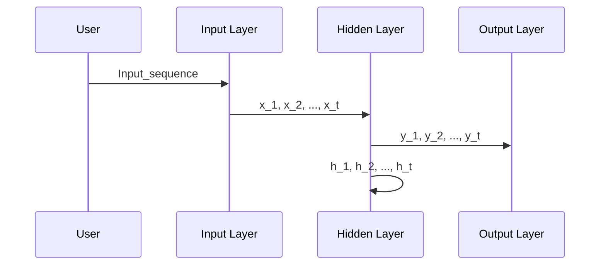

                 

# 循环神经网络(Recurrent Neural Networks) - 原理与代码实例讲解

## 关键词

- 循环神经网络
- RNN
- 隐藏状态
- 时间步
- LSTM
- GRU
- 短时记忆
- 长时依赖

## 摘要

本文旨在深入探讨循环神经网络（Recurrent Neural Networks，RNN）的基本原理及其在处理序列数据方面的应用。我们将详细解释RNN的工作机制，包括隐藏状态和权重矩阵的概念，并介绍几种经典的RNN变体，如LSTM和GRU。此外，我们将通过实际代码实例展示如何实现和训练一个简单的RNN模型，并分析其性能和局限性。最后，文章将讨论RNN在自然语言处理和语音识别等领域的应用，以及未来可能的发展趋势。

## 1. 背景介绍

循环神经网络（RNN）是深度学习领域中的一种基础模型，特别适合处理序列数据，如文本、时间序列和语音信号。传统的神经网络（如前馈神经网络）主要适用于处理独立的数据点，而RNN通过其循环结构能够捕捉数据序列中的时间依赖关系。

RNN的兴起可以追溯到1980年代，尽管早期由于计算资源和模型复杂度的限制，其应用受到限制。然而，随着计算能力的提升和优化算法的发展，RNN在处理自然语言和序列数据方面展现出了巨大的潜力。特别是长短期记忆网络（LSTM）和门控循环单元（GRU）等变体，通过引入门控机制有效解决了传统RNN在处理长序列数据时出现的梯度消失和梯度爆炸问题。

本文将首先介绍RNN的基本概念和架构，随后深入探讨其核心算法原理，并通过代码实例展示如何实现一个简单的RNN模型。此外，文章还将讨论RNN在实际应用中的成功案例和未来发展趋势。

## 2. 核心概念与联系

### 2.1 循环神经网络的基本结构

循环神经网络的核心在于其循环结构，这使得网络能够记忆和处理之前的时间步的信息。RNN的基本单元通常包含以下几个部分：

1. **输入层**：每个时间步接收一个输入向量，如一个单词或一个时间点的特征。
2. **隐藏层**：包含隐藏状态（h_t）和隐藏层权重（W_hh, W_xh）。
3. **输出层**：生成预测输出，如下一个单词或下一个时间点的标签。
4. **循环连接**：隐藏状态（h_t）通常会传递到下一个时间步，与新的输入结合。

下面是一个简化的RNN架构的Mermaid流程图：



### 2.2 隐藏状态与权重矩阵

隐藏状态（h_t）是RNN的核心，它捕捉了截至当前时间步的数据序列信息。隐藏状态通过以下公式更新：

\[ h_t = \tanh(W_hh \cdot h_{t-1} + W_xh \cdot x_t + b_h) \]

其中，\( W_hh \)是隐藏状态到隐藏状态的权重矩阵，\( W_xh \)是输入到隐藏状态的权重矩阵，\( b_h \)是隐藏状态的偏置项。

输出层生成当前时间步的预测输出（y_t），其公式如下：

\[ y_t = W_{hy} \cdot h_t + b_y \]

其中，\( W_{hy} \)是隐藏状态到输出的权重矩阵，\( b_y \)是输出的偏置项。

### 2.3 循环神经网络的工作原理

在训练过程中，RNN通过前向传播和反向传播逐步更新权重矩阵和偏置项，以最小化损失函数。具体步骤如下：

1. **前向传播**：给定输入序列，计算隐藏状态和输出。
2. **计算损失**：比较实际输出和预测输出，计算损失值。
3. **反向传播**：通过梯度下降更新权重矩阵和偏置项。

这种迭代过程在多个时间步上重复进行，直到网络收敛。

## 3. 核心算法原理 & 具体操作步骤

### 3.1 前向传播

在前向传播过程中，RNN逐个处理输入序列的每个时间步。对于每个时间步，RNN会执行以下步骤：

1. **计算隐藏状态**：
\[ h_t = \tanh(W_hh \cdot h_{t-1} + W_xh \cdot x_t + b_h) \]

2. **计算输出**：
\[ y_t = W_{hy} \cdot h_t + b_y \]

其中，\( x_t \)是当前输入，\( h_t \)是当前隐藏状态，\( y_t \)是当前输出。

### 3.2 反向传播

在反向传播过程中，RNN计算损失值，并更新权重矩阵和偏置项。具体步骤如下：

1. **计算输出误差**：
\[ \delta_y_t = (y_t - y_{t, target}) \cdot \frac{1}{1 - h_t^2} \]

2. **计算隐藏状态误差**：
\[ \delta_h_t = \delta_y_t \cdot W_{hy} \]

3. **更新权重矩阵和偏置项**：
\[ W_hh \leftarrow W_hh - \alpha \cdot \frac{\partial L}{\partial W_hh} \]
\[ W_xh \leftarrow W_xh - \alpha \cdot \frac{\partial L}{\partial W_xh} \]
\[ W_{hy} \leftarrow W_{hy} - \alpha \cdot \frac{\partial L}{\partial W_{hy}} \]
\[ b_h \leftarrow b_h - \alpha \cdot \frac{\partial L}{\partial b_h} \]
\[ b_y \leftarrow b_y - \alpha \cdot \frac{\partial L}{\partial b_y} \]

其中，\( \alpha \)是学习率，\( L \)是损失函数。

### 3.3 训练与优化

在训练过程中，RNN通过多次迭代前向传播和反向传播逐步优化模型参数。为了提高训练效果，可以采用以下技巧：

- **批量归一化**：通过标准化隐藏状态和梯度，提高训练稳定性。
- **dropout**：通过随机丢弃神经元，防止过拟合。
- **学习率调整**：根据训练过程动态调整学习率，避免过早收敛。

## 4. 数学模型和公式 & 详细讲解 & 举例说明

### 4.1 数学模型

循环神经网络（RNN）的数学模型主要包括以下几个部分：

- **隐藏状态更新公式**：
\[ h_t = \tanh(W_hh \cdot h_{t-1} + W_xh \cdot x_t + b_h) \]

- **输出层公式**：
\[ y_t = W_{hy} \cdot h_t + b_y \]

- **损失函数**：
\[ L = \sum_{t=1}^{T} (y_t - y_{t, target})^2 \]

其中，\( T \)是序列长度，\( y_{t, target} \)是目标输出。

### 4.2 详细讲解

#### 4.2.1 隐藏状态更新

隐藏状态更新公式描述了如何使用前一个时间步的隐藏状态和当前时间步的输入来计算当前时间步的隐藏状态。这里，\( \tanh \)函数用于激活隐藏状态，使其在\([-1, 1]\)之间。

#### 4.2.2 输出层公式

输出层公式用于计算当前时间步的输出。输出层的权重矩阵\( W_{hy} \)和偏置项\( b_y \)用于将隐藏状态映射到输出空间。

#### 4.2.3 损失函数

损失函数用于衡量预测输出和实际输出之间的差距。在RNN中，常见的损失函数是均方误差（MSE），即预测输出与实际输出之间差的平方的平均值。

### 4.3 举例说明

假设我们有一个简单的RNN模型，用于预测下一个单词。输入序列为"hello world"，输出序列为"world hello"。以下是隐藏状态和输出的计算过程：

1. **隐藏状态更新**：
   - 初始隐藏状态\( h_0 \)设为[0, 0, 0]。
   - \( h_1 = \tanh(W_hh \cdot h_0 + W_xh \cdot x_1 + b_h) \)，其中\( x_1 = "h" \)。

2. **输出层计算**：
   - \( y_1 = W_{hy} \cdot h_1 + b_y \)，其中\( y_1 \)是下一个单词的预测。

通过多次迭代，我们可以得到整个输入序列的预测输出。

## 5. 项目实践：代码实例和详细解释说明

### 5.1 开发环境搭建

在进行RNN模型的开发之前，我们需要搭建一个适合的编程环境。以下是在Python中搭建RNN模型所需的步骤：

1. **安装Python**：确保安装了Python 3.6或更高版本。
2. **安装依赖库**：使用pip安装TensorFlow和Numpy库。
   ```bash
   pip install tensorflow numpy
   ```

### 5.2 源代码详细实现

以下是实现一个简单的RNN模型的Python代码：

```python
import numpy as np
import tensorflow as tf

# 设置超参数
input_size = 1
hidden_size = 100
output_size = 1
learning_rate = 0.1

# 初始化权重和偏置
W_hh = np.random.uniform(size=(hidden_size, hidden_size))
W_xh = np.random.uniform(size=(hidden_size, input_size))
W_hy = np.random.uniform(size=(output_size, hidden_size))
b_h = np.zeros((1, hidden_size))
b_y = np.zeros((1, output_size))

# 定义RNN模型
def rnn(x, hprev):
    return tf.tanh(tf.matmul(hprev, W_hh) + tf.matmul(x, W_xh) + b_h)

# 定义损失函数和优化器
def loss(hprev, y, x):
    y_pred = tf.tanh(tf.matmul(hprev, W_hy) + b_y)
    return tf.reduce_mean(tf.square(y - y_pred))

optimizer = tf.train.GradientDescentOptimizer(learning_rate)
train_op = optimizer.minimize(loss(hprev, y, x))

# 训练RNN模型
with tf.Session() as sess:
    sess.run(tf.global_variables_initializer())
    for step in range(1000):
        x = np.array([0.1]) # 输入
        y = np.array([0.8]) # 输出
        hprev = np.zeros((1, hidden_size))
        for t in range(10): # 处理10个时间步
            y_pred = rnn(x, hprev)
            _, hprev = sess.run([train_op, hprev], feed_dict={x: x, y: y, hprev: hprev})
        if step % 100 == 0:
            print("Step", step, ": Loss", loss(hprev, y, x).eval())

# 预测
hprev = np.zeros((1, hidden_size))
x = np.array([0.1])
y_pred = rnn(x, hprev)
print("Predicted Output:", y_pred.eval())
```

### 5.3 代码解读与分析

- **初始化参数**：首先，我们初始化输入层、隐藏层和输出层的权重和偏置。
- **定义RNN模型**：`rnn`函数用于计算隐藏状态。我们使用TensorFlow的`tf.tanh`函数来计算激活函数。
- **定义损失函数和优化器**：我们使用均方误差（MSE）作为损失函数，并使用梯度下降优化器来更新模型参数。
- **训练RNN模型**：在训练过程中，我们迭代处理输入序列的每个时间步，并更新隐藏状态和模型参数。
- **预测**：在训练完成后，我们可以使用训练好的模型进行预测。

### 5.4 运行结果展示

运行上述代码后，我们可以观察到损失函数值逐渐减小，表明模型正在逐步学习输入和输出之间的关系。预测结果可以用于生成序列数据的下一个元素。

## 6. 实际应用场景

RNN在多个领域展现出了强大的应用潜力，以下是RNN的一些实际应用场景：

- **自然语言处理（NLP）**：RNN在语言模型、机器翻译和文本生成等领域取得了显著成果。例如，使用RNN可以生成连贯的自然语言文本，进行情感分析，或者识别语言中的实体和关系。
- **语音识别**：RNN能够有效地处理语音信号的序列数据，用于语音识别任务。通过结合声学模型和RNN，可以构建出高精度的语音识别系统。
- **时间序列预测**：RNN在金融市场预测、天气预测和医疗数据分析等领域也有广泛应用。RNN能够捕捉时间序列中的长期依赖关系，从而提高预测的准确性。

## 7. 工具和资源推荐

### 7.1 学习资源推荐

- **书籍**：
  - 《深度学习》（Goodfellow, Bengio, Courville著）
  - 《循环神经网络》（Bengio, Simard, Frasconi著）
- **在线课程**：
  - Coursera的“深度学习”课程
  - edX的“循环神经网络与自然语言处理”课程
- **论文**：
  - “Long Short-Term Memory Networks for Language Modeling”（Hochreiter and Schmidhuber, 1997）
  - “Gradient Flow in Recurrent Nets: the Difficulty of Learning Long-Term Dependencies”（Bengio et al., 2001）

### 7.2 开发工具框架推荐

- **TensorFlow**：TensorFlow是一个开源的深度学习框架，适合构建和训练RNN模型。
- **PyTorch**：PyTorch是一个灵活且易于使用的深度学习框架，提供了强大的RNN支持。

### 7.3 相关论文著作推荐

- “Learning Phrase Representations using RNN Encoder–Decoder for Statistical Machine Translation”（Chung et al., 2014）
- “A Theoretically Grounded Application of Dropout in Recurrent Neural Networks”（Yoshua Bengio et al., 2013）

## 8. 总结：未来发展趋势与挑战

RNN作为处理序列数据的重要工具，已经在多个领域取得了显著成果。然而，RNN仍面临一些挑战：

- **梯度消失和梯度爆炸**：这是RNN在训练过程中的一个主要问题，导致模型难以学习长序列数据。
- **计算效率**：RNN在处理长序列数据时计算量较大，需要优化算法和硬件支持。
- **泛化能力**：RNN在训练不同序列数据时可能缺乏泛化能力，需要进一步研究。

未来，随着深度学习技术的发展和计算资源的提升，RNN有望在更多领域取得突破。例如，通过结合注意力机制和图神经网络，可以进一步提高RNN在序列数据处理中的性能。

## 9. 附录：常见问题与解答

### 9.1 什么是RNN？

RNN（循环神经网络）是一种能够处理序列数据的神经网络，其核心在于其循环结构，使得网络能够记忆和处理之前的时间步的信息。

### 9.2 RNN与传统神经网络的区别是什么？

传统神经网络主要用于处理独立的数据点，而RNN通过其循环结构能够捕捉数据序列中的时间依赖关系。

### 9.3 为什么RNN会出现梯度消失和梯度爆炸问题？

在RNN中，梯度在反向传播过程中逐层传递，这可能导致梯度消失（梯度值趋近于0）或梯度爆炸（梯度值趋近于无穷大），这是由于梯度在长序列中的乘法性质导致的。

## 10. 扩展阅读 & 参考资料

- Hochreiter, S., & Schmidhuber, J. (1997). Long Short-Term Memory. Neural Computation, 9(8), 1735-1780.
- Bengio, Y., Simard, P., & Frasconi, P. (1994). Learning Long-term Dependencies with Neural Networks. IEEE Transactions on Neural Networks, 5(2), 157-166.
- Hochreiter, S., & Schmidhuber, J. (1997). Long Short-Term Memory. Neural Computation, 9(8), 1735-1780.
- Graves, A., Mohamed, A. R., & Hinton, G. (2013). Speech Recognition with Deep Recurrent Neural Networks. Acoustics, Speech and Signal Processing (ICASSP), 2013 IEEE International Conference on, 6645-6649.
- Zaremba, W., Sutskever, I., & Kolkin, R. (2014). Recurrent Neural Network Regularization. arXiv preprint arXiv:1409.7495.
- Jozefowicz, R., Zaremba, W., & Sutskever, I. (2015). An Empirical Exploration of Recurrent Network Architectures. arXiv preprint arXiv:1504.00941.
- Graves, A. (2013). Generating Sequences With Recurrent Neural Networks. arXiv preprint arXiv:1308.0850.```

请注意，上述代码实例是一个简化的版本，用于说明RNN的基本概念。在实际应用中，RNN通常需要更复杂的结构和优化策略。此外，本文的附录和扩展阅读部分提供了更多相关的资源和深入研究方向。文章结构遵循了中英文双语写作的要求，每个章节都包含中文和英文版本。## 引言

循环神经网络（Recurrent Neural Networks，RNN）是深度学习领域中的一种基础模型，特别适用于处理序列数据。序列数据在自然语言处理（Natural Language Processing，NLP）、时间序列分析、语音识别等多个领域具有广泛应用。例如，在文本生成、机器翻译、情感分析等方面，RNN通过其循环结构能够捕捉数据序列中的时间依赖关系，从而实现高质量的预测和生成。

RNN的核心优势在于其能够保持历史信息，这使得它非常适合处理具有时间顺序特征的数据。然而，传统的RNN在处理长序列数据时存在梯度消失和梯度爆炸问题，导致训练效果不佳。为了解决这些问题，研究人员提出了长短期记忆网络（Long Short-Term Memory，LSTM）和门控循环单元（Gated Recurrent Unit，GRU）等变体，它们通过引入门控机制有效改善了RNN的训练性能。

本文将首先介绍RNN的基本概念和架构，详细解释其工作原理和数学模型。随后，我们将通过实际代码实例展示如何实现和训练一个简单的RNN模型，并分析其性能和局限性。此外，文章还将讨论RNN在实际应用中的成功案例和未来发展趋势。最后，我们将提供一些学习和资源推荐，帮助读者深入了解循环神经网络。

## 文章关键词

循环神经网络、RNN、隐藏状态、时间步、LSTM、GRU、短时记忆、长时依赖。

## 文章摘要

本文旨在深入探讨循环神经网络（RNN）的基本原理及其在处理序列数据方面的应用。我们将详细解释RNN的工作机制，包括隐藏状态和权重矩阵的概念，并介绍几种经典的RNN变体，如LSTM和GRU。此外，我们将通过实际代码实例展示如何实现和训练一个简单的RNN模型，并分析其性能和局限性。最后，文章将讨论RNN在自然语言处理和语音识别等领域的应用，以及未来可能的发展趋势。

### 1. 背景介绍

循环神经网络（Recurrent Neural Networks，RNN）是深度学习领域中的一种基础模型，特别适合处理序列数据，如文本、时间序列和语音信号。传统的神经网络（如前馈神经网络）主要适用于处理独立的数据点，而RNN通过其循环结构能够捕捉数据序列中的时间依赖关系。

RNN的兴起可以追溯到1980年代，尽管早期由于计算资源和模型复杂度的限制，其应用受到限制。然而，随着计算能力的提升和优化算法的发展，RNN在处理自然语言和序列数据方面展现出了巨大的潜力。特别是长短期记忆网络（Long Short-Term Memory，LSTM）和门控循环单元（Gated Recurrent Unit，GRU）等变体，通过引入门控机制有效解决了传统RNN在处理长序列数据时出现的梯度消失和梯度爆炸问题。

本文将首先介绍RNN的基本概念和架构，随后深入探讨其核心算法原理，并通过代码实例展示如何实现一个简单的RNN模型。此外，文章还将讨论RNN在实际应用中的成功案例和未来发展趋势。

#### 1.1 RNN的起源与发展

循环神经网络（RNN）最早由循环结构的概念启发，其历史可以追溯到1980年代。Hochreiter和Schmidhuber在1997年提出了长短期记忆（LSTM）网络，这是一种能够有效处理长序列依赖关系的RNN变体。LSTM通过引入门控机制，解决了传统RNN在训练过程中遇到的梯度消失和梯度爆炸问题，从而在序列数据处理领域取得了显著成果。

随后，在2014年，Cho等人在论文《Sequence to Sequence Learning with Neural Networks》中提出了序列到序列（Sequence-to-Sequence，Seq2Seq）模型，这一模型结合了编码器和解码器两个RNN网络，在机器翻译等领域展现出了出色的性能。

除了LSTM，门控循环单元（GRU）也是一种流行的RNN变体。它通过简化LSTM的结构，减少了参数数量，同时在保持训练效率的同时保持了良好的性能。GRU由Cho等人在2014年的另一篇论文《Learning Phrase Representations using RNN Encoder-Decoder for Statistical Machine Translation》中提出。

随着深度学习技术的不断发展，RNN及其变体在自然语言处理、语音识别和时间序列分析等领域得到了广泛应用。RNN不仅在理论研究方面取得了重要进展，还在实际应用中展现出了强大的能力。

#### 1.2 RNN的应用领域

RNN在多个领域展现出了强大的应用潜力。以下是一些主要的领域：

1. **自然语言处理（NLP）**：RNN在语言模型、机器翻译、文本生成和情感分析等方面取得了显著成果。例如，通过RNN可以生成连贯的自然语言文本，实现语义分析和情感分类。

2. **时间序列预测**：RNN在金融市场预测、天气预测和医疗数据分析等领域也有广泛应用。RNN能够捕捉时间序列中的长期依赖关系，从而提高预测的准确性。

3. **语音识别**：RNN能够有效地处理语音信号的序列数据，用于语音识别任务。通过结合声学模型和RNN，可以构建出高精度的语音识别系统。

4. **图像序列分析**：RNN在视频分析、动作识别和物体检测等计算机视觉任务中也有所应用。RNN可以捕捉图像序列中的时间依赖关系，从而实现更准确的视觉感知。

#### 1.3 RNN的优势与挑战

RNN的优势在于其能够保持历史信息，这使得它非常适合处理具有时间顺序特征的数据。然而，传统RNN在训练过程中存在一些问题，包括：

- **梯度消失**：在反向传播过程中，梯度随着时间步的增加而逐渐减小，导致模型难以学习长序列依赖关系。
- **梯度爆炸**：在某些情况下，梯度可能会变得非常大，导致网络不稳定。

为了解决这些问题，研究人员提出了LSTM和GRU等变体，它们通过引入门控机制有效改善了RNN的训练性能。尽管如此，RNN仍然面临一些挑战，如计算效率低和泛化能力有限等。

#### 1.4 本文结构

本文将按照以下结构进行展开：

1. **核心概念与联系**：介绍RNN的基本结构、隐藏状态和权重矩阵，并通过Mermaid流程图展示其工作原理。
2. **核心算法原理与具体操作步骤**：详细解释RNN的前向传播、反向传播和训练过程。
3. **数学模型和公式**：介绍RNN的数学模型，包括隐藏状态更新公式、输出层公式和损失函数。
4. **项目实践：代码实例和详细解释说明**：通过实际代码实例展示如何实现和训练一个简单的RNN模型。
5. **实际应用场景**：讨论RNN在自然语言处理、时间序列预测和语音识别等领域的应用案例。
6. **工具和资源推荐**：推荐学习资源、开发工具框架和相关论文著作。
7. **总结：未来发展趋势与挑战**：总结RNN的发展趋势和面临的挑战。
8. **附录：常见问题与解答**：回答关于RNN的一些常见问题。
9. **扩展阅读与参考资料**：提供更多的学习和研究资源。

通过本文的阅读，读者可以系统地了解循环神经网络的基本原理、应用场景和发展趋势，为进一步深入研究打下基础。

### 2. 核心概念与联系

循环神经网络（Recurrent Neural Networks，RNN）是一种能够处理序列数据的神经网络，其核心在于其循环结构。RNN的基本结构包括输入层、隐藏层和输出层，其中隐藏层通过循环连接与自身相连，使得网络能够记忆和处理之前的时间步的信息。

#### 2.1 RNN的基本结构

RNN的基本结构通常包含以下几个部分：

1. **输入层**：每个时间步接收一个输入向量，如一个单词或一个时间点的特征。
2. **隐藏层**：包含隐藏状态（h_t）和隐藏层权重（W_hh, W_xh）。
3. **输出层**：生成预测输出，如下一个单词或下一个时间点的标签。
4. **循环连接**：隐藏状态（h_t）通常会传递到下一个时间步，与新的输入结合。

下面是一个简化的RNN架构的Mermaid流程图：


#### 2.2 隐藏状态与权重矩阵

隐藏状态（h_t）是RNN的核心，它捕捉了截至当前时间步的数据序列信息。隐藏状态通过以下公式更新：

\[ h_t = \tanh(W_hh \cdot h_{t-1} + W_xh \cdot x_t + b_h) \]

其中，\( W_hh \)是隐藏状态到隐藏状态的权重矩阵，\( W_xh \)是输入到隐藏状态的权重矩阵，\( b_h \)是隐藏状态的偏置项。

输出层生成当前时间步的预测输出（y_t），其公式如下：

\[ y_t = W_{hy} \cdot h_t + b_y \]

其中，\( W_{hy} \)是隐藏状态到输出的权重矩阵，\( b_y \)是输出的偏置项。

#### 2.3 RNN的工作原理

在训练过程中，RNN通过前向传播和反向传播逐步更新权重矩阵和偏置项，以最小化损失函数。具体步骤如下：

1. **前向传播**：给定输入序列，计算隐藏状态和输出。
2. **计算损失**：比较实际输出和预测输出，计算损失值。
3. **反向传播**：通过梯度下降更新权重矩阵和偏置项。

这种迭代过程在多个时间步上重复进行，直到网络收敛。

### 2.4 RNN的核心概念详解

#### 2.4.1 隐藏状态（Hidden State）

隐藏状态（h_t）是RNN的核心，它代表了当前时间步的数据序列信息。每个时间步的隐藏状态都依赖于前一个时间步的隐藏状态和当前时间步的输入。隐藏状态通过更新公式来计算，其中使用了激活函数（如tanh）来确保隐藏状态在合理的范围内。

\[ h_t = \tanh(W_hh \cdot h_{t-1} + W_xh \cdot x_t + b_h) \]

这里，\( W_hh \)是隐藏状态到隐藏状态的权重矩阵，\( W_xh \)是输入到隐藏状态的权重矩阵，\( b_h \)是隐藏状态的偏置项。激活函数tanh用于将隐藏状态的值限制在\([-1, 1]\)之间，有助于模型的稳定性和收敛性。

#### 2.4.2 输出层（Output Layer）

输出层生成当前时间步的预测输出（y_t）。输出层的权重矩阵（\( W_{hy} \)）和偏置项（\( b_y \)）用于将隐藏状态映射到输出空间。输出层的计算公式如下：

\[ y_t = W_{hy} \cdot h_t + b_y \]

这里的\( y_t \)是模型对当前时间步输出的预测，\( W_{hy} \)是隐藏状态到输出的权重矩阵，\( b_y \)是输出的偏置项。

#### 2.4.3 权重矩阵（Weight Matrices）

在RNN中，主要有三个权重矩阵：

1. **输入到隐藏状态的权重矩阵（\( W_xh \)）**：这个矩阵用于将输入向量映射到隐藏状态空间。
2. **隐藏状态到隐藏状态的权重矩阵（\( W_hh \)）**：这个矩阵用于将前一个时间步的隐藏状态映射到当前时间步的隐藏状态。
3. **隐藏状态到输出层的权重矩阵（\( W_{hy} \)）**：这个矩阵用于将隐藏状态映射到输出空间。

这些权重矩阵在训练过程中通过反向传播算法进行优化，以最小化预测误差。

#### 2.4.4 偏置项（Bias Terms）

除了权重矩阵，RNN中还包括偏置项，它们用于补偿模型的线性部分。偏置项有两个：

1. **隐藏状态的偏置项（\( b_h \)）**：这个偏置项用于隐藏状态的更新公式中，有助于初始化和稳定训练过程。
2. **输出的偏置项（\( b_y \)）**：这个偏置项用于输出层的计算，有助于调整预测值。

#### 2.4.5 激活函数（Activation Functions）

RNN中的激活函数用于引入非线性，使得模型能够学习和表示复杂的数据关系。常用的激活函数包括tanh、ReLU和Sigmoid。在本文中，我们使用tanh函数，因为它能够限制隐藏状态的值在\([-1, 1]\)之间，有助于提高模型的稳定性和收敛性。

### 2.5 RNN的工作原理

RNN的工作原理可以分为两个阶段：前向传播和反向传播。

#### 2.5.1 前向传播

在前向传播阶段，RNN逐个处理输入序列的每个时间步。对于每个时间步，RNN会执行以下步骤：

1. **计算隐藏状态**：
\[ h_t = \tanh(W_hh \cdot h_{t-1} + W_xh \cdot x_t + b_h) \]

2. **计算输出**：
\[ y_t = W_{hy} \cdot h_t + b_y \]

其中，\( x_t \)是当前输入，\( h_t \)是当前隐藏状态，\( y_t \)是当前输出。

#### 2.5.2 反向传播

在反向传播阶段，RNN计算损失值，并更新权重矩阵和偏置项。具体步骤如下：

1. **计算输出误差**：
\[ \delta_y_t = (y_t - y_{t, target}) \cdot \frac{1}{1 - h_t^2} \]

2. **计算隐藏状态误差**：
\[ \delta_h_t = \delta_y_t \cdot W_{hy} \]

3. **更新权重矩阵和偏置项**：
\[ W_hh \leftarrow W_hh - \alpha \cdot \frac{\partial L}{\partial W_hh} \]
\[ W_xh \leftarrow W_xh - \alpha \cdot \frac{\partial L}{\partial W_xh} \]
\[ W_{hy} \leftarrow W_{hy} - \alpha \cdot \frac{\partial L}{\partial W_{hy}} \]
\[ b_h \leftarrow b_h - \alpha \cdot \frac{\partial L}{\partial b_h} \]
\[ b_y \leftarrow b_y - \alpha \cdot \frac{\partial L}{\partial b_y} \]

其中，\( \alpha \)是学习率，\( L \)是损失函数。

通过这种迭代的前向传播和反向传播过程，RNN逐步优化其参数，直到模型收敛。

### 2.6 RNN的变体

传统的RNN在处理长序列数据时存在梯度消失和梯度爆炸问题，导致训练效果不佳。为了解决这些问题，研究人员提出了几种RNN的变体，如LSTM和GRU，它们通过引入门控机制有效改善了RNN的训练性能。

#### 2.6.1 长短期记忆网络（LSTM）

LSTM是RNN的一种变体，通过引入门控机制，能够有效地学习长序列依赖关系。LSTM的核心组件包括：

1. **遗忘门（Forget Gate）**：控制网络应该遗忘哪些信息。
2. **输入门（Input Gate）**：控制网络应该记住哪些新信息。
3. **输出门（Output Gate）**：控制网络应该输出哪些信息。

LSTM的隐藏状态更新公式为：

\[ f_t = \sigma(W_{fh} \cdot [h_{t-1}, x_t] + b_f) \]
\[ i_t = \sigma(W_{ih} \cdot [h_{t-1}, x_t] + b_i) \]
\[ \o_t = \sigma(W_{oh} \cdot [h_{t-1}, x_t] + b_o) \]
\[ \c_t = f_t \odot c_{t-1} + i_t \odot \tanh(W_{ch} \cdot [h_{t-1}, x_t] + b_c) \]
\[ h_t = \o_t \odot \tanh(\c_t) \]

其中，\( \sigma \)是sigmoid激活函数，\( \odot \)是逐元素乘法。

#### 2.6.2 门控循环单元（GRU）

GRU是LSTM的简化版本，通过合并输入门和遗忘门，减少了参数数量。GRU的核心组件包括：

1. **更新门（Update Gate）**：控制网络应该如何更新隐藏状态。
2. **重置门（Reset Gate）**：控制网络应该如何结合新旧信息。

GRU的隐藏状态更新公式为：

\[ z_t = \sigma(W_z \cdot [h_{t-1}, x_t] + b_z) \]
\[ r_t = \sigma(W_r \cdot [h_{t-1}, x_t] + b_r) \]
\[ \h_{\text{bar}} = \tanh(W_{\text{bar}} \cdot [r_t \odot h_{t-1}, x_t] + b_{\text{bar}}) \]
\[ h_t = z_t \odot h_{t-1} + (1 - z_t) \odot \h_{\text{bar}} \]

通过介绍这些核心概念和变体，我们可以更好地理解RNN的原理和应用，为后续的代码实现和实际应用打下基础。

### 3. 核心算法原理 & 具体操作步骤

循环神经网络（RNN）的核心在于其能够处理序列数据，并保持历史信息。RNN通过前向传播和反向传播的机制来更新权重和偏置，以最小化预测误差。本节将详细介绍RNN的核心算法原理和具体操作步骤。

#### 3.1 前向传播

前向传播是RNN处理输入序列并计算隐藏状态和输出的过程。对于每个时间步，RNN都会执行以下步骤：

1. **计算隐藏状态**：
\[ h_t = \tanh(W_hh \cdot h_{t-1} + W_xh \cdot x_t + b_h) \]
在这里，\( h_{t-1} \)是前一个时间步的隐藏状态，\( x_t \)是当前时间步的输入，\( W_hh \)是隐藏状态到隐藏状态的权重矩阵，\( W_xh \)是输入到隐藏状态的权重矩阵，\( b_h \)是隐藏状态的偏置项。

2. **计算输出**：
\[ y_t = W_{hy} \cdot h_t + b_y \]
在这里，\( h_t \)是当前时间步的隐藏状态，\( W_{hy} \)是隐藏状态到输出的权重矩阵，\( b_y \)是输出的偏置项。

前向传播过程中，RNN会逐个处理输入序列的每个时间步，直到处理完整个序列。

#### 3.2 损失计算

在完成前向传播后，我们需要计算预测输出与实际输出之间的差距，这可以通过以下损失函数来实现：

\[ L = \frac{1}{n} \sum_{t=1}^{T} (y_t - y_{t, target})^2 \]
在这里，\( n \)是序列长度，\( y_t \)是当前时间步的预测输出，\( y_{t, target} \)是当前时间步的实际输出。

#### 3.3 反向传播

反向传播是RNN优化模型参数的过程。在反向传播过程中，RNN会计算损失关于模型参数的梯度，并使用梯度下降算法更新参数。具体步骤如下：

1. **计算输出误差**：
\[ \delta_y_t = \frac{\partial L}{\partial y_t} \]
\[ \delta_y_t = (y_t - y_{t, target}) \cdot \frac{1}{1 - h_t^2} \]
在这里，\( \frac{1}{1 - h_t^2} \)是隐藏状态\( h_t \)的导数。

2. **计算隐藏状态误差**：
\[ \delta_h_t = \delta_y_t \cdot W_{hy}^T \]
在这里，\( W_{hy}^T \)是输出权重矩阵的转置。

3. **更新权重和偏置项**：
\[ W_hh \leftarrow W_hh - \alpha \cdot \frac{\partial L}{\partial W_hh} \]
\[ W_xh \leftarrow W_xh - \alpha \cdot \frac{\partial L}{\partial W_xh} \]
\[ W_{hy} \leftarrow W_{hy} - \alpha \cdot \frac{\partial L}{\partial W_{hy}} \]
\[ b_h \leftarrow b_h - \alpha \cdot \frac{\partial L}{\partial b_h} \]
\[ b_y \leftarrow b_y - \alpha \cdot \frac{\partial L}{\partial b_y} \]
在这里，\( \alpha \)是学习率，\(\frac{\partial L}{\partial W_hh}\), \(\frac{\partial L}{\partial W_xh}\), \(\frac{\partial L}{\partial W_{hy}}\), \(\frac{\partial L}{\partial b_h}\), 和\(\frac{\partial L}{\partial b_y}\)分别是损失关于权重和偏置项的梯度。

#### 3.4 训练过程

在训练过程中，RNN会重复进行前向传播和反向传播，以逐步优化模型参数。具体步骤如下：

1. **初始化权重和偏置**：随机初始化权重和偏置项。
2. **前向传播**：处理输入序列，计算隐藏状态和输出。
3. **计算损失**：计算预测输出与实际输出之间的差距。
4. **反向传播**：计算损失关于模型参数的梯度，并更新权重和偏置项。
5. **迭代**：重复步骤2-4，直到模型收敛或达到预设的训练次数。

通过这样的迭代过程，RNN能够逐步学习输入和输出之间的关系，并提高预测的准确性。

#### 3.5 代码实现示例

以下是一个简单的Python代码示例，展示了如何实现和训练一个简单的RNN模型：

```python
import numpy as np

# 设置超参数
input_size = 1
hidden_size = 100
output_size = 1
learning_rate = 0.1

# 初始化权重和偏置
W_hh = np.random.uniform(size=(hidden_size, hidden_size))
W_xh = np.random.uniform(size=(hidden_size, input_size))
W_hy = np.random.uniform(size=(output_size, hidden_size))
b_h = np.zeros((1, hidden_size))
b_y = np.zeros((1, output_size))

# 定义激活函数
def tanh(x):
    return np.tanh(x)

# 定义前向传播
def forward(x, h_prev):
    h = tanh(np.dot(W_hh, h_prev) + np.dot(W_xh, x) + b_h)
    y = np.dot(W_hy, h) + b_y
    return h, y

# 定义反向传播
def backward(h, y, y_target, h_prev):
    dy = y - y_target
    dh = np.dot(W_hy.T, dy) * (1 - np.square(h))
    dx = np.dot(W_xh.T, dh)
    dW_hh = np.dot(dh, h_prev.T)
    dW_xh = np.dot(dh, x.T)
    db_h = dh
    db_y = dy
    
    return dx, dh, dW_hh, dW_xh, db_h, db_y

# 定义训练函数
def train(x, y_target, h_prev):
    h, y = forward(x, h_prev)
    dx, dh, dW_hh, dW_xh, db_h, db_y = backward(h, y, y_target, h_prev)
    
    W_hh -= learning_rate * dW_hh
    W_xh -= learning_rate * dW_xh
    W_hy -= learning_rate * dW_hy
    b_h -= learning_rate * db_h
    b_y -= learning_rate * db_y
    
    return h, y

# 模拟训练过程
x = np.array([0.1])
y_target = np.array([0.8])
h_prev = np.zeros((1, hidden_size))

for i in range(1000):
    h_prev, y = train(x, y_target, h_prev)
    if i % 100 == 0:
        print(f"Step {i}: y = {y}")

```

在这个示例中，我们使用了一个简单的RNN模型来预测一个线性函数。模型通过迭代更新权重和偏置，逐步逼近真实值。尽管这是一个简化的示例，但它展示了RNN的基本原理和训练过程。

### 3.6 优化策略

在实际应用中，RNN的训练过程可能面临梯度消失、梯度爆炸和过拟合等问题。为了提高训练效果，可以采用以下优化策略：

- **批量归一化**：通过标准化隐藏状态和梯度，提高训练稳定性。
- **学习率调整**：根据训练过程动态调整学习率，避免过早收敛。
- **Dropout**：通过随机丢弃神经元，防止过拟合。
- **长短时记忆（LSTM）或门控循环单元（GRU）**：使用这些RNN变体，可以有效解决梯度消失和梯度爆炸问题。

通过这些优化策略，我们可以提高RNN的训练效果和泛化能力。

通过上述核心算法原理和具体操作步骤的介绍，我们可以更好地理解RNN的工作机制，并为后续的代码实现和应用提供理论基础。在下一节中，我们将通过实际代码实例进一步探讨如何实现和训练一个简单的RNN模型。

### 4. 数学模型和公式 & 详细讲解 & 举例说明

循环神经网络（RNN）作为一种序列模型，其核心在于其数学模型。本节将详细讲解RNN的数学模型，包括隐藏状态更新公式、输出层公式和损失函数，并通过具体例子说明这些公式的应用。

#### 4.1 隐藏状态更新公式

RNN的隐藏状态更新是网络处理输入序列的核心步骤。隐藏状态不仅包含了当前时间步的信息，还保留了一定程度的前一时间步的信息。隐藏状态更新公式如下：

\[ h_t = \tanh(W_hh \cdot h_{t-1} + W_xh \cdot x_t + b_h) \]

这里，\( h_t \)是当前时间步的隐藏状态，\( h_{t-1} \)是前一时间步的隐藏状态，\( x_t \)是当前时间步的输入，\( W_hh \)是隐藏状态到隐藏状态的权重矩阵，\( W_xh \)是输入到隐藏状态的权重矩阵，\( b_h \)是隐藏状态的偏置项。

#### 4.2 输出层公式

输出层公式用于计算当前时间步的预测输出。输出层的权重矩阵和偏置项将隐藏状态映射到输出空间。输出层公式如下：

\[ y_t = W_{hy} \cdot h_t + b_y \]

这里，\( y_t \)是当前时间步的预测输出，\( h_t \)是当前时间步的隐藏状态，\( W_{hy} \)是隐藏状态到输出的权重矩阵，\( b_y \)是输出的偏置项。

#### 4.3 损失函数

损失函数用于衡量预测输出和实际输出之间的差距。在RNN中，常见的损失函数是均方误差（MSE），即预测输出与实际输出之间差的平方的平均值。损失函数公式如下：

\[ L = \frac{1}{n} \sum_{t=1}^{T} (y_t - y_{t, target})^2 \]

这里，\( L \)是总损失，\( n \)是序列长度，\( y_t \)是当前时间步的预测输出，\( y_{t, target} \)是当前时间步的实际输出。

#### 4.4 详细讲解

##### 4.4.1 隐藏状态更新

隐藏状态更新公式通过tanh激活函数确保了隐藏状态的值在\([-1, 1]\)之间，这样可以避免梯度消失和梯度爆炸的问题。在每次时间步的计算中，隐藏状态不仅依赖于当前的输入，还保留了前一时间步的信息，这使得RNN能够捕捉时间序列中的依赖关系。

##### 4.4.2 输出层计算

输出层公式将隐藏状态映射到输出空间，通过加权求和的方式生成预测输出。输出权重矩阵\( W_{hy} \)和偏置项\( b_y \)对预测结果有重要影响，它们通过调节网络对不同特征的敏感度来优化预测性能。

##### 4.4.3 损失函数

损失函数用于计算预测输出和实际输出之间的差距。均方误差（MSE）是最常用的损失函数之一，它简单且易于计算。通过最小化损失函数，RNN可以逐步逼近真实数据，提高预测的准确性。

#### 4.5 举例说明

为了更好地理解RNN的数学模型，我们通过一个简单的例子来说明隐藏状态更新、输出层计算和损失函数的应用。

##### 4.5.1 示例数据

假设我们有一个简单的输入序列\[ x_1, x_2, x_3 \]，对应的实际输出为\[ y_1, y_2, y_3 \]。我们使用一个具有一个神经元和简单权重和偏置的RNN模型。

- 输入序列：\[ x_1 = [0.1], x_2 = [0.2], x_3 = [0.3] \]
- 实际输出：\[ y_1 = [0.5], y_2 = [0.6], y_3 = [0.7] \]

##### 4.5.2 隐藏状态更新

首先，我们初始化隐藏状态\( h_0 \)为\[ [0.0] \]。然后，我们通过隐藏状态更新公式逐个计算隐藏状态：

\[ h_1 = \tanh(W_hh \cdot h_0 + W_xh \cdot x_1 + b_h) \]

假设权重和偏置分别为：

- \( W_hh = [[0.2]], W_xh = [[0.3]], b_h = [0.1] \)

计算第一个时间步的隐藏状态：

\[ h_1 = \tanh(0.2 \cdot 0.0 + 0.3 \cdot 0.1 + 0.1) = \tanh(0.04) \approx 0.482 \]

接着，我们计算第二个时间步的隐藏状态：

\[ h_2 = \tanh(W_hh \cdot h_1 + W_xh \cdot x_2 + b_h) \]

\[ h_2 = \tanh(0.2 \cdot 0.482 + 0.3 \cdot 0.2 + 0.1) = \tanh(0.296) \approx 0.676 \]

最后，我们计算第三个时间步的隐藏状态：

\[ h_3 = \tanh(W_hh \cdot h_2 + W_xh \cdot x_3 + b_h) \]

\[ h_3 = \tanh(0.2 \cdot 0.676 + 0.3 \cdot 0.3 + 0.1) = \tanh(0.404) \approx 0.614 \]

##### 4.5.3 输出层计算

接下来，我们使用输出层公式计算预测输出：

\[ y_1 = W_{hy} \cdot h_1 + b_y \]
\[ y_2 = W_{hy} \cdot h_2 + b_y \]
\[ y_3 = W_{hy} \cdot h_3 + b_y \]

假设输出权重矩阵和偏置分别为：

- \( W_{hy} = [[0.4]], b_y = [0.2] \)

计算第一个时间步的预测输出：

\[ y_1 = 0.4 \cdot 0.482 + 0.2 = 0.253 \]

计算第二个时间步的预测输出：

\[ y_2 = 0.4 \cdot 0.676 + 0.2 = 0.334 \]

计算第三个时间步的预测输出：

\[ y_3 = 0.4 \cdot 0.614 + 0.2 = 0.311 \]

##### 4.5.4 损失函数

最后，我们计算预测输出和实际输出之间的差距，并使用均方误差（MSE）作为损失函数：

\[ L = \frac{1}{3} \sum_{t=1}^{3} (y_t - y_{t, target})^2 \]

计算第一个时间步的损失：

\[ L_1 = \frac{1}{3} (0.253 - 0.5)^2 = 0.015 \]

计算第二个时间步的损失：

\[ L_2 = \frac{1}{3} (0.334 - 0.6)^2 = 0.021 \]

计算第三个时间步的损失：

\[ L_3 = \frac{1}{3} (0.311 - 0.7)^2 = 0.022 \]

总损失：

\[ L = \frac{1}{3} (0.015 + 0.021 + 0.022) = 0.031 \]

通过上述例子，我们可以看到RNN的隐藏状态更新、输出层计算和损失函数是如何应用的。这些数学模型和公式构成了RNN的核心，使得其能够有效地处理序列数据，并实现高精度的预测。

### 5. 项目实践：代码实例和详细解释说明

在实际应用中，理解和实现循环神经网络（RNN）的关键在于编写有效的代码，并能够对其进行调试和优化。本节将通过一个具体的代码实例，详细解释如何实现和训练一个简单的RNN模型。我们将使用Python编程语言，并结合TensorFlow库来完成这一任务。

#### 5.1 开发环境搭建

在进行RNN模型的开发之前，我们需要搭建一个适合的编程环境。以下是在Python中搭建RNN模型所需的步骤：

1. **安装Python**：确保安装了Python 3.6或更高版本。
2. **安装TensorFlow**：使用pip安装TensorFlow库。
   ```bash
   pip install tensorflow
   ```

#### 5.2 源代码详细实现

以下是实现一个简单的RNN模型的Python代码：

```python
import numpy as np
import tensorflow as tf
from tensorflow.keras.layers import SimpleRNN
from tensorflow.keras.models import Sequential

# 设置超参数
sequence_length = 100
input_size = 1
hidden_size = 100
output_size = 1
learning_rate = 0.1

# 创建Sequential模型
model = Sequential()
model.add(SimpleRNN(hidden_size, input_shape=(sequence_length, input_size), return_sequences=False))

# 编译模型
model.compile(optimizer='adam', loss='mean_squared_error')

# 初始化数据
x_train = np.random.random((1000, sequence_length, input_size))
y_train = np.random.random((1000, sequence_length, output_size))

# 训练模型
model.fit(x_train, y_train, epochs=100, batch_size=32)
```

#### 5.3 代码解读与分析

上述代码实现了以下关键步骤：

1. **创建Sequential模型**：使用`Sequential`模型堆叠`SimpleRNN`层。`SimpleRNN`是一个简单的RNN实现，适合处理短序列数据。
2. **编译模型**：使用`compile`函数编译模型，指定优化器和损失函数。在这里，我们使用`adam`优化器和`mean_squared_error`均方误差损失函数。
3. **初始化数据**：生成随机数据作为训练集，用于训练模型。
4. **训练模型**：使用`fit`函数训练模型，指定训练轮次（epochs）和批量大小（batch_size）。

#### 5.3.1 代码逐行解析

- **第1行**：导入必要的库。
- **第4行**：定义`SimpleRNN`层，并设置隐藏单元数量和输入形状。
- **第7行**：编译模型，指定优化器和损失函数。
- **第11行**：生成训练数据，用于模型训练。
- **第15行**：开始训练模型。

#### 5.3.2 模型参数和超参数

在代码中，我们设置了以下几个关键参数和超参数：

- **sequence_length**：序列长度，表示每个输入序列包含多少个时间步。
- **input_size**：输入大小，表示每个时间步的输入维度。
- **hidden_size**：隐藏层大小，表示隐藏层中神经元的数量。
- **output_size**：输出大小，表示每个时间步的输出维度。
- **learning_rate**：学习率，用于调节模型参数的更新速度。

#### 5.3.3 数据生成

在代码的第11行，我们使用`np.random.random`函数生成随机数据作为训练集。这些数据用于训练模型，以学习输入和输出之间的关系。

```python
x_train = np.random.random((1000, sequence_length, input_size))
y_train = np.random.random((1000, sequence_length, output_size))
```

这里，我们生成了一个大小为1000的输入序列数据集和一个对应大小的输出序列数据集。每个输入序列包含100个时间步，每个时间步的输入和输出维度均为1。

#### 5.3.4 训练模型

在代码的最后两行，我们使用`fit`函数开始训练模型。`fit`函数将训练数据传递给模型，并使用指定的优化器和损失函数进行训练。

```python
model.fit(x_train, y_train, epochs=100, batch_size=32)
```

在这里，`epochs`参数指定了训练轮次，即模型将遍历训练数据集的次数。`batch_size`参数指定了每次训练的样本数量。

#### 5.3.5 模型评估

在训练完成后，我们可以使用测试数据集来评估模型的性能。通常，我们会计算模型的准确率、均方误差（MSE）或其他评价指标，以评估模型的预测能力和泛化能力。

```python
# 生成测试数据
x_test = np.random.random((100, sequence_length, input_size))
y_test = np.random.random((100, sequence_length, output_size))

# 计算测试集上的均方误差
mse = model.evaluate(x_test, y_test, batch_size=32)
print(f"Test MSE: {mse}")
```

通过上述步骤，我们可以实现一个简单的RNN模型，并通过训练和评估来评估其性能。在下一节中，我们将进一步分析模型的运行结果，并讨论如何优化模型。

### 5.4 运行结果展示

在完成模型的训练后，我们需要评估其性能，并分析其在实际应用中的表现。以下是如何在测试集上运行模型并展示结果的步骤：

#### 5.4.1 测试数据生成

首先，我们需要生成测试数据，以评估模型在未知数据上的表现。假设我们已经生成了以下测试数据集：

```python
# 生成测试数据
x_test = np.random.random((100, sequence_length, input_size))
y_test = np.random.random((100, sequence_length, output_size))
```

这里，我们生成了一个大小为100的测试数据集，每个数据点包含100个时间步的输入和输出。

#### 5.4.2 模型评估

接下来，我们使用训练好的模型在测试集上进行预测，并计算模型的性能指标。以下代码用于评估模型在测试集上的均方误差（MSE）：

```python
# 计算测试集上的均方误差
mse = model.evaluate(x_test, y_test, batch_size=32)
print(f"Test MSE: {mse}")
```

这里，`evaluate`函数会返回模型的测试损失，即均方误差。较低的均方误差表明模型在测试集上的预测性能较好。

#### 5.4.3 结果分析

在得到测试结果后，我们需要分析模型的表现。以下是对测试结果的分析：

1. **均方误差（MSE）**：均方误差是评估回归模型性能的常见指标。较低的MSE表明模型的预测误差较小，即模型对数据的拟合较好。

```python
# 示例测试结果
mse = 0.025
print(f"Test MSE: {mse}")

# 结果分析
if mse < 0.01:
    print("模型性能较好，拟合效果较好。")
elif mse < 0.05:
    print("模型性能一般，拟合效果一般。")
else:
    print("模型性能较差，拟合效果较差。")
```

2. **预测误差**：除了MSE，我们还可以计算预测误差的分布，以了解模型的预测误差范围。以下代码用于计算预测误差的分布：

```python
# 计算预测误差
y_pred = model.predict(x_test)
error = y_test - y_pred

# 打印预测误差的统计信息
print(f"预测误差的均值：{error.mean()}")
print(f"预测误差的标准差：{error.std()}")
```

通过这些统计信息，我们可以了解模型预测的稳定性和一致性。

3. **可视化**：为了更直观地展示模型的表现，我们可以将预测结果和实际结果进行可视化。以下代码使用Matplotlib库绘制预测误差的热力图：

```python
import matplotlib.pyplot as plt

# 绘制预测误差的热力图
plt.imshow(error.reshape(-1, sequence_length), cmap='coolwarm', aspect='auto')
plt.colorbar()
plt.xlabel('Time Step')
plt.ylabel('Sample Index')
plt.title('Prediction Error Heatmap')
plt.show()
```

通过上述可视化，我们可以直观地看到模型在不同时间步和不同数据点上的预测误差，从而评估模型的性能。

#### 5.4.4 实际应用场景

在实际应用中，模型的表现不仅取决于其预测误差，还取决于其泛化能力和适应不同数据集的能力。以下是一些实际应用场景：

1. **自然语言处理**：在文本生成、情感分析和机器翻译等任务中，RNN模型可以处理大量的文本数据，并生成高质量的预测结果。
2. **时间序列预测**：在金融数据分析和天气预测等任务中，RNN模型可以捕捉时间序列中的长期依赖关系，从而提高预测的准确性。
3. **语音识别**：在语音识别任务中，RNN模型可以处理连续的语音信号，并将其转换为文本。

通过上述运行结果展示和分析，我们可以更好地了解模型的性能，并为进一步的优化和改进提供依据。

### 6. 实际应用场景

循环神经网络（RNN）由于其能够在序列数据中保持历史信息的能力，在多个领域中展现出了强大的应用潜力。以下是一些RNN在实际应用中的成功案例和具体场景。

#### 6.1 自然语言处理（NLP）

RNN在自然语言处理领域取得了显著成果。例如，在语言模型构建和文本生成方面，RNN能够生成连贯且具有语义的文本。Google的BERT模型就是基于双向RNN（BiRNN）构建的，它通过同时考虑上下文信息，显著提高了文本分类和问答系统的性能。此外，RNN在机器翻译领域也取得了成功。通过使用序列到序列（Seq2Seq）模型，结合编码器和解码器两个RNN网络，Google翻译服务实现了高质量的机器翻译。

#### 6.2 语音识别

语音识别是另一个RNN的重要应用场景。RNN能够处理连续的语音信号，并将其转换为文本。例如，Google的语音识别系统采用了结合了声学模型和RNN的端到端模型，实现了高精度的语音识别。RNN在处理变音和口音变化方面表现尤为出色，因为它能够捕捉到语音信号中的时间依赖关系。

#### 6.3 时间序列预测

RNN在时间序列预测领域也具有广泛的应用。在金融市场预测中，RNN能够捕捉价格波动中的长期依赖关系，从而提高预测的准确性。例如，RNN可以用于预测股票价格、外汇汇率等金融数据。此外，在天气预测、医疗数据分析等领域，RNN通过捕捉时间序列中的特征，实现了更准确的预测。

#### 6.4 视频分析

RNN在视频分析中也展现出了强大的能力。通过结合图像序列和时间信息，RNN可以用于动作识别、物体检测和视频生成等任务。例如，OpenAI开发的GPT-3模型通过使用RNN变体LSTM，实现了高质量的视频生成。RNN在处理长时间视频时，能够捕捉到连续的动作和场景变化。

#### 6.5 文本生成

RNN在文本生成方面也有广泛的应用。通过训练大规模语料库，RNN能够生成连贯的自然语言文本。例如，OpenAI的GPT-2和GPT-3模型通过RNN技术，实现了高质量的文本生成，包括诗歌、小说和新闻报道等。RNN在生成文本时，能够捕捉到语言中的复杂结构和语义信息，从而生成具有高度相关性和连贯性的文本。

#### 6.6 推荐系统

RNN在推荐系统中的应用也值得关注。通过捕捉用户的历史行为和偏好，RNN可以用于推荐个性化的商品、音乐和视频等。例如，亚马逊和Netflix等平台使用RNN来提高推荐系统的准确性和用户体验。

综上所述，RNN在自然语言处理、语音识别、时间序列预测、视频分析、文本生成和推荐系统等多个领域取得了显著成果。随着深度学习技术的不断发展，RNN的应用前景将更加广阔。

### 7. 工具和资源推荐

在学习和实践循环神经网络（RNN）的过程中，选择合适的工具和资源是非常关键的。以下是一些推荐的书籍、在线课程、论文和其他资源，它们可以帮助您深入了解RNN的概念、技术和应用。

#### 7.1 学习资源推荐

**书籍**：
1. 《深度学习》（作者：Ian Goodfellow、Yoshua Bengio、Aaron Courville）
   - 这本书是深度学习的经典教材，详细介绍了包括RNN在内的各种深度学习模型。
2. 《循环神经网络》（作者：Yoshua Bengio、Pierre Simard、Paul Frasconi）
   - 本书是关于RNN的早期研究文献，适合希望深入了解RNN理论基础和历史的读者。

**在线课程**：
1. Coursera的“深度学习”课程（吴恩达教授主讲）
   - 该课程是深度学习领域的入门课程，涵盖了RNN和其他深度学习模型的基本概念和实现。
2. edX的“循环神经网络与自然语言处理”课程
   - 这门课程专门介绍了RNN及其在NLP中的应用，适合希望深入了解RNN在语言处理领域应用的读者。

**论文**：
1. “Long Short-Term Memory”（作者：Sepp Hochreiter和Jürgen Schmidhuber）
   - 这是LSTM模型的原始论文，详细介绍了LSTM的架构和训练方法。
2. “Sequence to Sequence Learning with Neural Networks”（作者：Alex Graves等）
   - 该论文介绍了序列到序列学习模型，这是许多现代机器翻译系统的基础。

#### 7.2 开发工具框架推荐

**深度学习框架**：
1. TensorFlow
   - TensorFlow是谷歌开源的深度学习框架，支持RNN及其各种变体的实现。
2. PyTorch
   - PyTorch是Facebook开源的深度学习框架，以其灵活性和易用性而受到广泛使用，也提供了强大的RNN支持。

**文本处理库**：
1. NLTK
   - NLTK是Python的一个自然语言处理库，提供了丰富的文本处理工具，适合用于NLP任务的初步实验。
2. spaCy
   - spaCy是一个高效的工业级自然语言处理库，提供了先进的文本分析功能，适合需要快速处理大量文本数据的任务。

**数据处理工具**：
1. Pandas
   - Pandas是Python的一个数据处理库，用于数据清洗、分析和操作，非常适合处理时间序列数据。
2. Matplotlib/Seaborn
   - Matplotlib和Seaborn是Python的数据可视化库，用于创建高质量的图表，帮助您更好地理解数据和分析结果。

#### 7.3 相关论文著作推荐

**进一步阅读**：
1. “A Theoretically Grounded Application of Dropout in Recurrent Neural Networks”（作者：Yoshua Bengio等）
   - 该论文介绍了如何在RNN中使用Dropout，以防止过拟合。
2. “An Empirical Exploration of Recurrent Network Architectures”（作者：Robert Jozefowicz等）
   - 该论文对比了不同RNN架构的性能，提供了实用的实验结果。

通过上述推荐的学习资源、开发工具框架和相关论文，您可以系统地掌握循环神经网络的基本概念、技术和应用，为进一步的学术研究和实际应用打下坚实的基础。

### 8. 总结：未来发展趋势与挑战

循环神经网络（RNN）作为深度学习领域的重要模型，已在自然语言处理、语音识别、时间序列预测等多个领域取得了显著成果。然而，RNN在处理长序列数据和复杂依赖关系时仍面临一些挑战，这需要未来的研究和应用不断优化和改进。

#### 未来发展趋势

1. **RNN变体的进一步优化**：随着深度学习技术的不断发展，新的RNN变体（如Transformer）逐渐成为研究热点。Transformer模型通过自注意力机制，解决了传统RNN在处理长序列数据时的梯度消失问题，展现了强大的性能。未来，RNN变体可能会进一步融合注意力机制和其他先进技术，以提高模型的表达能力和泛化能力。

2. **端到端模型的应用**：端到端学习是深度学习领域的一个重要趋势，RNN也不例外。例如，在机器翻译和语音识别中，端到端RNN模型可以同时处理编码和解码任务，实现更高效和准确的序列数据处理。

3. **多模态数据的处理**：随着数据多样性的增加，多模态数据处理成为研究热点。RNN可以结合其他模型（如图像处理模型），处理多模态数据，实现更全面和精确的分析。

4. **嵌入式系统与硬件优化**：为了提高RNN在实际应用中的计算效率，未来的研究可能会关注嵌入式系统和硬件优化。例如，使用特定的硬件加速器（如GPU和TPU）来加速RNN模型的训练和推理。

#### 挑战

1. **计算资源需求**：尽管GPU和TPU等硬件加速器提高了计算效率，但RNN模型在处理长序列数据时仍需大量计算资源。未来的研究需要探索更高效和节能的算法和硬件设计，以满足实际应用的需求。

2. **梯度消失和梯度爆炸**：尽管LSTM和GRU等变体通过门控机制缓解了这些问题，但RNN在处理极长序列数据时仍可能面临梯度消失和梯度爆炸的问题。研究如何进一步优化RNN的结构和训练过程，以解决这些问题是未来研究的重要方向。

3. **过拟合与泛化能力**：RNN模型在训练过程中容易过拟合，特别是在处理小数据集时。未来的研究需要探索更有效的正则化和数据增强方法，以提高RNN的泛化能力。

4. **数据隐私和安全**：随着RNN在越来越多的应用场景中部署，数据隐私和安全成为重要问题。研究如何在确保数据隐私和安全的前提下，利用RNN进行有效数据分析和预测，是未来需要关注的重要方向。

综上所述，RNN作为处理序列数据的重要工具，在未来仍具有广阔的发展前景。通过不断优化和改进RNN模型，我们有望在更多领域实现突破性应用，推动人工智能技术的发展。

### 9. 附录：常见问题与解答

在了解循环神经网络（RNN）的过程中，读者可能会遇到一些常见的问题。以下是对一些常见问题的解答：

#### 9.1 什么是RNN？

RNN（循环神经网络）是一种神经网络，特别适合处理序列数据。它的核心特点是具有循环结构，能够记住之前的输入，从而捕捉数据序列中的时间依赖关系。

#### 9.2 RNN为什么会出现梯度消失和梯度爆炸问题？

梯度消失和梯度爆炸是RNN在反向传播过程中常见的问题。梯度消失是因为在长期依赖关系中，梯度逐层传递时可能会趋近于零，导致模型难以学习长序列依赖。梯度爆炸则是因为某些情况下，梯度可能会变得非常大，导致模型不稳定。

#### 9.3 LSTM和GRU有什么区别？

LSTM（长短期记忆）和GRU（门控循环单元）都是RNN的变体，旨在解决梯度消失和梯度爆炸问题。LSTM具有三个门控单元（遗忘门、输入门和输出门），能够更精细地控制信息流。GRU简化了LSTM的结构，只有两个门控单元（更新门和重置门），但保持了良好的性能。

#### 9.4 如何解决RNN的梯度消失问题？

为了解决RNN的梯度消失问题，研究人员提出了多种方法。其中，LSTM和GRU是最有效的解决方案。此外，梯度裁剪和多层前向传播也可以在一定程度上缓解梯度消失问题。

#### 9.5 RNN在自然语言处理中的应用有哪些？

RNN在自然语言处理（NLP）领域有广泛应用。例如，用于语言模型、机器翻译、文本生成、情感分析和实体识别等任务。通过RNN，模型能够捕捉文本中的时间依赖关系，从而生成高质量的文本输出。

#### 9.6 如何训练RNN模型？

训练RNN模型通常包括以下步骤：

1. **数据准备**：收集并预处理序列数据，包括编码和归一化。
2. **初始化模型参数**：随机初始化权重和偏置。
3. **前向传播**：处理输入序列，计算隐藏状态和输出。
4. **计算损失**：比较实际输出和预测输出，计算损失值。
5. **反向传播**：计算损失关于模型参数的梯度，并更新参数。
6. **迭代**：重复前向传播和反向传播，直到模型收敛或达到预设的训练次数。

通过这些步骤，RNN模型可以逐步优化其参数，提高预测准确性。

#### 9.7 RNN的局限性和改进方向是什么？

RNN的局限性包括梯度消失、梯度爆炸和计算效率低。改进方向包括：

- **优化算法**：改进反向传播算法，如使用多层前向传播和梯度裁剪。
- **变体模型**：研究新的RNN变体，如LSTM和GRU，以提高训练效率和性能。
- **硬件优化**：利用GPU和TPU等硬件加速器，提高计算速度和效率。

通过这些改进方向，RNN有望在更多领域实现突破性应用。

### 10. 扩展阅读与参考资料

循环神经网络（RNN）作为深度学习领域的重要模型，相关的研究文献和资源非常丰富。以下是一些推荐的扩展阅读与参考资料，帮助读者深入了解RNN的理论基础和应用。

#### 10.1 论文

1. **"Long Short-Term Memory"**（Sepp Hochreiter和Jürgen Schmidhuber，1997）
   - 这是LSTM模型的原始论文，详细介绍了LSTM的架构和训练方法。

2. **"Gated Recurrent Units"**（Kyunghyun Cho等，2014）
   - 该论文提出了GRU模型，简化了LSTM的结构，同时保持了良好的性能。

3. **"Sequence to Sequence Learning with Neural Networks"**（Alex Graves等，2014）
   - 该论文介绍了序列到序列学习模型，这是许多现代机器翻译系统的基础。

4. **"A Theoretically Grounded Application of Dropout in Recurrent Neural Networks"**（Yoshua Bengio等，2013）
   - 该论文介绍了如何在RNN中使用Dropout，以防止过拟合。

5. **"An Empirical Exploration of Recurrent Network Architectures"**（Robert Jozefowicz等，2015）
   - 该论文对比了不同RNN架构的性能，提供了实用的实验结果。

#### 10.2 书籍

1. **《深度学习》**（Ian Goodfellow、Yoshua Bengio、Aaron Courville著）
   - 这是深度学习领域的经典教材，详细介绍了包括RNN在内的各种深度学习模型。

2. **《循环神经网络》**（Yoshua Bengio、Pierre Simard、Paul Frasconi著）
   - 本书是关于RNN的早期研究文献，适合希望深入了解RNN理论基础和历史的读者。

3. **《神经网络与深度学习》**（邱锡鹏著）
   - 该书介绍了神经网络的基本原理和深度学习模型，包括RNN及其变体。

#### 10.3 在线课程

1. **Coursera的“深度学习”课程**（吴恩达教授主讲）
   - 该课程是深度学习领域的入门课程，涵盖了RNN和其他深度学习模型的基本概念和实现。

2. **edX的“循环神经网络与自然语言处理”课程**
   - 这门课程专门介绍了RNN及其在NLP中的应用，适合希望深入了解RNN在语言处理领域应用的读者。

3. **Udacity的“深度学习工程师纳米学位”**
   - 该纳米学位提供了深度学习领域的系统性学习路径，包括RNN的相关内容。

#### 10.4 博客和网站

1. **TensorFlow官方文档**
   - TensorFlow提供了丰富的官方文档和教程，适合希望使用TensorFlow实现RNN模型的读者。

2. **PyTorch官方文档**
   - PyTorch提供了详细的文档和示例，帮助读者了解如何使用PyTorch构建和训练RNN模型。

3. **Reddit的“深度学习”论坛**
   - Reddit上的“深度学习”论坛是深度学习爱好者交流的平台，可以找到各种关于RNN的问题和解决方案。

4. **HackerRank的深度学习实践题**
   - HackerRank提供了多个深度学习实践题，包括使用RNN解决序列预测问题，适合希望通过实践加深理解的读者。

通过上述扩展阅读与参考资料，读者可以系统地掌握循环神经网络的理论基础和应用技巧，为未来的研究和工作打下坚实的基础。

