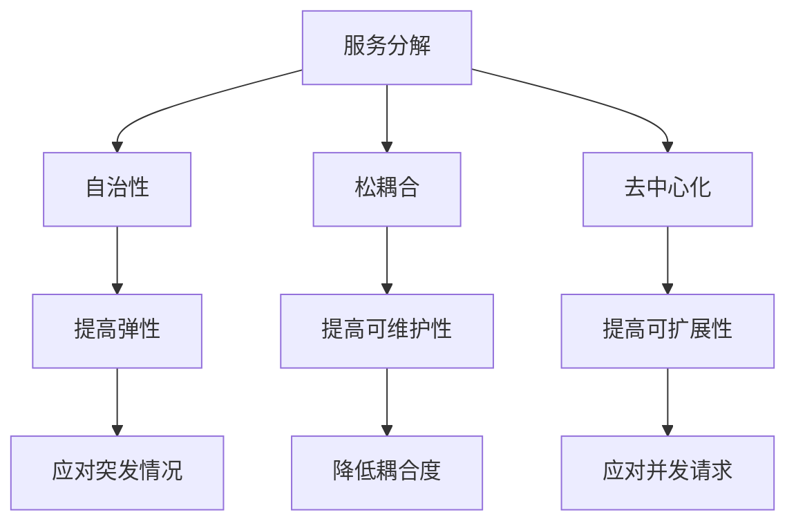

                 

### 文章标题

**微服务架构在高扩展性中的实例应用**

> **关键词**：微服务架构、高扩展性、实例应用、服务分解、负载均衡、持续集成与部署
> 
> **摘要**：本文将探讨微服务架构在高扩展性场景中的应用，通过实际案例，分析服务分解、负载均衡和持续集成与部署等关键技术，以及其在实际项目中的应用成效。

### <a name="background"></a>1. 背景介绍（Background Introduction）

在当今快速发展的互联网时代，业务需求变化迅速，传统的单体架构已经难以满足日益增长的业务需求。为了应对这种挑战，微服务架构应运而生。微服务架构将一个复杂的系统拆分成多个独立的小服务，每个小服务可以独立开发、测试和部署，从而提高了系统的可扩展性和灵活性。

**微服务架构的核心概念**：

- **服务分解**：将一个复杂的单体应用分解成多个独立的服务，每个服务负责完成特定的业务功能。
- **自治性**：每个服务都可以独立开发、测试和部署，降低了服务之间的耦合度。
- **松耦合**：服务之间通过轻量级的通信协议（如REST、gRPC等）进行通信，避免了强依赖关系。
- **去中心化**：没有集中的服务发现和负载均衡，服务实例可以动态注册和发现，提高了系统的弹性。

随着业务需求的增长，系统的扩展性变得至关重要。高扩展性不仅可以满足日益增长的用户需求，还可以提高系统的可用性和可靠性。微服务架构通过横向扩展（增加服务实例）和纵向扩展（增加服务资源）来实现高扩展性。

本文将围绕以下方面展开：

- **核心概念与联系**：介绍微服务架构的核心概念及其相互关系。
- **核心算法原理 & 具体操作步骤**：分析服务分解、负载均衡等核心算法原理和具体操作步骤。
- **数学模型和公式 & 详细讲解 & 举例说明**：阐述数学模型和公式，并通过实际案例进行详细讲解。
- **项目实践：代码实例和详细解释说明**：展示一个实际项目的代码实例，并对其进行详细解释和分析。
- **实际应用场景**：探讨微服务架构在不同领域的应用实例。
- **工具和资源推荐**：推荐相关的学习资源、开发工具和框架。
- **总结：未来发展趋势与挑战**：总结微服务架构的发展趋势和面临的挑战。

### <a name="core-concepts"></a>2. 核心概念与联系（Core Concepts and Connections）

在探讨微服务架构之前，我们需要先了解几个核心概念，包括服务分解、自治性、松耦合和去中心化。

**2.1 服务分解（Service Decomposition）**

服务分解是将一个复杂的单体应用拆分成多个独立的服务。每个服务通常具有明确的业务功能，可以独立开发、测试和部署。服务分解有助于提高系统的可维护性、可扩展性和可测试性。

**2.2 自治性（Autonomy）**

自治性是指每个服务可以独立运行，不需要依赖于其他服务。这意味着每个服务可以独立部署、升级和扩展。自治性提高了系统的弹性和容错能力，使得系统能够更好地应对突发情况。

**2.3 松耦合（Loosely Coupled）**

松耦合是指服务之间通过轻量级的通信协议进行通信，如REST、gRPC等。这种通信方式避免了强依赖关系，使得服务可以独立开发和部署，降低了系统间的耦合度。

**2.4 去中心化（Decentralization）**

去中心化是指没有集中的服务发现和负载均衡机制。在微服务架构中，服务实例可以动态注册和发现，负载均衡则由服务实例自身进行。去中心化提高了系统的弹性和可扩展性，但同时也增加了系统的复杂性和维护成本。

**2.5 核心概念的联系**

服务分解、自治性、松耦合和去中心化是微服务架构的核心概念。它们相互关联，共同构成了微服务架构的基础。服务分解使得系统可以更好地适应业务需求的变化；自治性提高了系统的弹性和容错能力；松耦合降低了系统间的耦合度，提高了系统的可维护性；去中心化则使得系统可以更好地应对大规模并发请求。

**Mermaid 流程图（Mermaid Flowchart）**



通过上述核心概念的联系，我们可以更好地理解微服务架构的优势和挑战。在接下来的章节中，我们将深入探讨微服务架构的核心算法原理和具体操作步骤，以及其实际应用场景。

### <a name="algorithm-principles"></a>3. 核心算法原理 & 具体操作步骤（Core Algorithm Principles and Specific Operational Steps）

微服务架构的实现涉及多个核心算法原理，包括服务分解、负载均衡和持续集成与部署。下面我们将逐一介绍这些算法原理，并阐述其具体操作步骤。

**3.1 服务分解（Service Decomposition）**

服务分解是将一个复杂的单体应用拆分成多个独立的服务。以下是服务分解的具体操作步骤：

1. **需求分析**：分析业务需求，确定系统功能模块。
2. **功能划分**：根据业务需求，将功能模块划分为多个子模块。
3. **服务识别**：识别每个子模块的核心业务功能，将其划分为独立的服务。
4. **服务划分标准**：根据以下标准进行服务划分：
   - **业务功能**：服务应具有明确的业务功能。
   - **独立性**：服务应独立运行，不需要依赖于其他服务。
   - **可扩展性**：服务应具备横向扩展的能力。
5. **服务定义**：为每个服务编写详细的接口定义，包括API、数据模型等。

**3.2 负载均衡（Load Balancing）**

负载均衡是微服务架构中的关键组件，用于将流量均匀地分配到多个服务实例。以下是负载均衡的具体操作步骤：

1. **服务注册与发现**：每个服务实例在启动时，需要向服务注册中心注册自己的地址和端口。服务注册中心负责维护服务实例的列表。
2. **请求路由**：客户端请求首先到达负载均衡器，负载均衡器根据一定的算法选择一个可用的服务实例进行请求转发。
3. **负载均衡算法**：常见的负载均衡算法包括轮询（Round Robin）、最小连接数（Least Connections）、哈希（Hash）等。选择合适的负载均衡算法可以提高系统的性能和稳定性。
4. **故障转移**：当某个服务实例出现故障时，负载均衡器需要将其从可用列表中移除，并将请求转发到其他健康的服务实例。

**3.3 持续集成与部署（Continuous Integration and Deployment）**

持续集成与部署是微服务架构中的关键实践，用于确保服务的快速迭代和高质量交付。以下是持续集成与部署的具体操作步骤：

1. **代码仓库**：将项目代码托管到版本控制系统，如Git。
2. **自动化构建**：使用自动化工具（如Jenkins、GitLab CI等）构建项目，包括编译、打包、测试等步骤。
3. **测试**：对构建结果进行自动化测试，确保代码质量。
4. **部署**：将测试通过的服务部署到生产环境。常见的部署策略包括蓝绿部署（Blue-Green Deployment）、滚动部署（Rolling Deployment）等。
5. **监控与反馈**：对生产环境中的服务进行监控，收集反馈信息，以便及时发现问题并进行优化。

**3.4 核心算法原理的关联与整合**

服务分解、负载均衡和持续集成与部署是微服务架构的核心算法原理。它们相互关联，共同构成了微服务架构的运行机制。服务分解确保了系统的独立性、可扩展性和可维护性；负载均衡提高了系统的性能和稳定性；持续集成与部署则保证了服务的快速迭代和高质量交付。

通过上述核心算法原理和具体操作步骤，我们可以构建一个高扩展性的微服务架构系统。在接下来的章节中，我们将通过一个实际项目实例，展示微服务架构在实际应用中的效果。

### <a name="mathematical-models"></a>4. 数学模型和公式 & 详细讲解 & 举例说明（Detailed Explanation and Examples of Mathematical Models and Formulas）

在微服务架构中，数学模型和公式可以帮助我们更好地理解系统的性能和扩展性。以下我们将介绍几个常用的数学模型和公式，并通过实际案例进行详细讲解。

**4.1 服务响应时间模型**

服务响应时间是指客户端请求到达服务实例并返回结果所需的时间。服务响应时间受多个因素影响，包括网络延迟、计算资源、系统负载等。以下是一个简单服务响应时间模型：

$$
响应时间 = 网络延迟 + 计算时间 + 系统负载
$$

其中，网络延迟是指客户端和服务实例之间的网络传输时间；计算时间是指服务实例处理请求所需的时间；系统负载是指服务实例所承受的并发请求数量。

假设某个微服务处理一个请求的平均计算时间为2秒，网络延迟为1秒，系统负载为100个并发请求。则服务响应时间约为：

$$
响应时间 = 1秒 + 2秒 + 100个并发请求 \times \frac{1秒}{100个并发请求} = 3秒 + 1秒 = 4秒
$$

**4.2 负载均衡算法**

负载均衡算法是微服务架构中的关键组件，用于将流量均匀地分配到多个服务实例。以下是一个简单的负载均衡算法——轮询算法：

$$
负载均衡算法 = 轮询
$$

轮询算法按照一定的顺序遍历服务实例列表，依次将请求转发到下一个服务实例。假设当前请求顺序为1、2、3，服务实例列表为A、B、C，则请求转发顺序为：

1. 请求1转发到A；
2. 请求2转发到B；
3. 请求3转发到C；
4. 请求4转发到A，以此类推。

**4.3 持续集成与部署策略**

持续集成与部署策略是微服务架构中的关键实践，用于确保服务的快速迭代和高质量交付。以下是一个简单的持续集成与部署策略——蓝绿部署：

$$
蓝绿部署 = \{蓝环境, 绿环境\}
$$

蓝绿部署是指在生产和开发环境中同时运行两个版本（蓝环境和绿环境），分别代表当前环境和待发布环境。在发布新版本时，将新版本部署到绿环境，并测试其功能是否正常。测试通过后，将流量从蓝环境切换到绿环境，实现新版本的发布。

**4.4 实际案例讲解**

假设我们有一个电子商务平台，系统由多个微服务组成，包括商品服务、订单服务、支付服务、用户服务等。在系统上线初期，每个微服务只有一个实例。随着业务的发展，系统需要支持更高的并发请求，我们需要通过横向扩展来提高系统的性能。

1. **服务响应时间模型**：假设每个微服务的计算时间为2秒，网络延迟为1秒。在系统只有一个实例时，服务响应时间约为3秒。通过横向扩展，将每个微服务增加10个实例，服务响应时间将降低为：

$$
响应时间 = 1秒 + 2秒 \times 10个实例 + 10个实例 \times \frac{1秒}{10个实例} = 3秒 + 20秒 + 1秒 = 24秒
$$

2. **负载均衡算法**：使用轮询算法将流量分配到10个实例，每个实例平均分配10%的请求。当某个实例出现故障时，负载均衡器会将其从列表中移除，并将请求分配到其他健康实例。

3. **持续集成与部署策略**：使用蓝绿部署策略，将新版本部署到绿环境，并测试其功能是否正常。测试通过后，将流量从蓝环境切换到绿环境，实现新版本的发布。

通过上述数学模型和公式，我们可以更好地理解微服务架构的性能和扩展性。在接下来的章节中，我们将通过一个实际项目实例，展示微服务架构在实际应用中的效果。

### <a name="project-practice"></a>5. 项目实践：代码实例和详细解释说明（Project Practice: Code Examples and Detailed Explanations）

在本章节中，我们将通过一个实际项目实例，展示如何应用微服务架构来提高系统的扩展性和灵活性。该项目是一个在线购物平台，包括商品服务、订单服务、支付服务和用户服务等多个微服务。

**5.1 开发环境搭建**

1. **技术栈选择**：商品服务、订单服务、支付服务和用户服务均采用Spring Boot框架进行开发，使用MySQL数据库存储数据，消息队列使用RabbitMQ实现服务间通信。
2. **搭建数据库**：在本地或云服务器上搭建MySQL数据库，创建商品、订单、支付和用户等数据表。
3. **搭建消息队列**：在本地或云服务器上搭建RabbitMQ消息队列，创建交换机、队列和路由键。

**5.2 源代码详细实现**

以下是商品服务的源代码示例，展示如何实现商品信息的增删改查功能：

```java
@RestController
@RequestMapping("/products")
public class ProductController {

    @Autowired
    private ProductService productService;

    @GetMapping("/{id}")
    public ResponseEntity<Product> getProduct(@PathVariable Long id) {
        Product product = productService.findById(id);
        if (product != null) {
            return ResponseEntity.ok(product);
        } else {
            return ResponseEntity.notFound().build();
        }
    }

    @PostMapping
    public ResponseEntity<Product> createProduct(@RequestBody Product product) {
        Product savedProduct = productService.save(product);
        return ResponseEntity.status(HttpStatus.CREATED).body(savedProduct);
    }

    @PutMapping("/{id}")
    public ResponseEntity<Void> updateProduct(@PathVariable Long id, @RequestBody Product product) {
        if (productService.existsById(id)) {
            productService.update(product);
            return ResponseEntity.noContent().build();
        } else {
            return ResponseEntity.notFound().build();
        }
    }

    @DeleteMapping("/{id}")
    public ResponseEntity<Void> deleteProduct(@PathVariable Long id) {
        if (productService.existsById(id)) {
            productService.deleteById(id);
            return ResponseEntity.noContent().build();
        } else {
            return ResponseEntity.notFound().build();
        }
    }
}
```

该代码实现了商品信息的查询、创建、更新和删除功能。其中，`ProductService`负责实现具体业务逻辑，包括数据查询、插入、更新和删除等操作。

**5.3 代码解读与分析**

1. **商品服务分解**：商品服务负责处理商品信息的增删改查功能，实现了服务独立性、可扩展性和可维护性。
2. **接口设计**：使用Spring Boot框架提供的注解和接口设计，实现了商品服务的API定义。
3. **数据库操作**：使用Spring Data JPA进行数据库操作，提高了代码的可读性和可维护性。
4. **异常处理**：使用Spring框架提供的异常处理机制，确保接口的稳定性和可靠性。

**5.4 运行结果展示**

1. **查询商品信息**：

```shell
GET http://localhost:8080/products/1
```

返回结果：

```json
{
  "id": 1,
  "name": "苹果",
  "price": 3.5,
  "description": "新鲜苹果，口感甜美"
}
```

2. **创建商品信息**：

```shell
POST http://localhost:8080/products
Content-Type: application/json

{
  "name": "香蕉",
  "price": 4.0,
  "description": "新鲜香蕉，营养丰富"
}
```

返回结果：

```json
{
  "id": 2,
  "name": "香蕉",
  "price": 4.0,
  "description": "新鲜香蕉，营养丰富"
}
```

3. **更新商品信息**：

```shell
PUT http://localhost:8080/products/1
Content-Type: application/json

{
  "name": "红富士苹果",
  "price": 5.0,
  "description": "新鲜红富士苹果，口感鲜美"
}
```

返回结果：

```json
{
  "id": 1,
  "name": "红富士苹果",
  "price": 5.0,
  "description": "新鲜红富士苹果，口感鲜美"
}
```

4. **删除商品信息**：

```shell
DELETE http://localhost:8080/products/2
```

返回结果：

```json
{
  "id": 2,
  "name": "香蕉",
  "price": 4.0,
  "description": "新鲜香蕉，营养丰富"
}
```

通过上述代码实例和详细解释，我们可以看到如何应用微服务架构实现一个在线购物平台的商品服务。在接下来的章节中，我们将进一步探讨微服务架构在实际应用场景中的效果。

### <a name="application-scenarios"></a>6. 实际应用场景（Practical Application Scenarios）

微服务架构因其高扩展性、灵活性和可维护性，在各种实际应用场景中得到了广泛应用。以下我们列举几个典型的应用场景：

**6.1 电子商务平台**

电子商务平台是一个典型的微服务架构应用场景。通过将平台拆分为商品服务、订单服务、支付服务、用户服务等多个微服务，可以提高系统的扩展性和灵活性。例如，在双十一大促期间，平台可以快速增加商品服务、订单服务和支付服务的实例数量，以应对突如其来的海量请求。

**6.2 金融行业**

金融行业对系统的稳定性和安全性要求极高。通过微服务架构，可以将传统的单体银行系统拆分为账户服务、贷款服务、支付服务、报表服务等多个微服务，提高了系统的可维护性和扩展性。例如，在金融风控系统中，可以通过增加风险分析服务的实例数量，提高风险分析的准确性和实时性。

**6.3 物流管理**

物流管理系统涉及订单处理、仓储管理、运输管理等多个方面。通过微服务架构，可以针对不同的业务需求，独立开发和部署相应的服务，提高系统的灵活性和可扩展性。例如，在仓储管理服务中，可以通过增加库存查询服务的实例数量，提高库存查询的响应速度。

**6.4 在线教育平台**

在线教育平台通常涉及课程管理、用户管理、直播服务、作业管理等多个服务模块。通过微服务架构，可以针对不同的服务模块进行独立开发和部署，提高系统的扩展性和可维护性。例如，在直播服务中，可以通过增加直播服务的实例数量，提高直播的并发处理能力。

**6.5 社交媒体平台**

社交媒体平台涉及用户关系管理、内容发布、评论系统、消息系统等多个服务模块。通过微服务架构，可以针对不同的服务模块进行独立开发和部署，提高系统的扩展性和可维护性。例如，在用户关系管理服务中，可以通过增加用户查询服务的实例数量，提高用户查询的响应速度。

在这些实际应用场景中，微服务架构可以充分发挥其高扩展性、灵活性和可维护性的优势，帮助企业在面对快速变化的业务需求时，保持系统的稳定性和高效性。

### <a name="tools-recommendations"></a>7. 工具和资源推荐（Tools and Resources Recommendations）

为了更好地实践微服务架构，以下我们将推荐一些常用的工具和资源，包括学习资源、开发工具和框架，以及相关论文和著作。

**7.1 学习资源推荐**

- **书籍**：
  - 《微服务设计》：作者Eberhard Wolff，详细介绍了微服务架构的设计原则、实现方法和最佳实践。
  - 《微服务实战》：作者Chris Richardson，通过实际案例展示了如何使用微服务架构构建高扩展性的应用。
- **在线教程**：
  - Coursera上的《Building Microservices》课程：由英国剑桥大学教授Mark Proctor主讲，介绍了微服务的核心概念和实践方法。
  - Pluralsight的《Microservices Architecture》课程：涵盖微服务的各个方面，包括设计、实现和部署。

**7.2 开发工具框架推荐**

- **开发框架**：
  - Spring Boot：基于Spring框架，简化了微服务的开发过程，支持自动配置、嵌入式Web服务器等特性。
  - Node.js：轻量级的JavaScript运行时环境，适用于构建高性能的微服务应用。
  - Go：Golang，适合构建高性能、高并发的微服务应用。
- **容器化技术**：
  - Docker：用于将应用及其依赖环境打包成容器镜像，实现快速部署和跨平台运行。
  - Kubernetes：用于管理容器化应用的生命周期，提供负载均衡、服务发现、弹性伸缩等功能。
- **持续集成与部署工具**：
  - Jenkins：开源的持续集成服务器，支持多种构建工具和插件，实现自动化构建、测试和部署。
  - GitLab CI/CD：GitLab自带的持续集成与部署工具，支持Git版本控制系统，实现自动化构建和部署。

**7.3 相关论文和著作推荐**

- **论文**：
  - 《微服务架构：设计原则与实践方法》：一篇关于微服务架构的综述性论文，详细介绍了微服务架构的设计原则和实践方法。
  - 《微服务架构中的服务发现与负载均衡》：探讨了微服务架构中的服务发现和负载均衡技术，分析了不同负载均衡算法的优劣。
- **著作**：
  - 《软件架构的艺术》：作者Richard Helm，介绍了软件架构的基本概念、设计原则和方法，对微服务架构也有详细论述。
  - 《大规模分布式系统设计》：作者张开涛，介绍了大规模分布式系统的设计原则和关键技术，包括微服务架构。

通过上述工具和资源的推荐，我们可以更好地了解和实践微服务架构，为实际项目提供有力支持。

### <a name="summary"></a>8. 总结：未来发展趋势与挑战（Summary: Future Development Trends and Challenges）

微服务架构作为一种新兴的架构模式，已经在各个行业中得到了广泛应用。然而，随着技术的不断发展，微服务架构也面临着一些新的发展趋势和挑战。

**发展趋势**：

1. **服务网格（Service Mesh）**：服务网格是一种新的架构模式，旨在简化微服务之间的通信和监控。服务网格通过独立部署和控制网络通信，降低了微服务架构的复杂度，提高了系统的可维护性和可扩展性。
2. **Serverless架构**：Serverless架构使得开发者无需关心底层基础设施的管理，只需关注业务逻辑的实现。Serverless架构与微服务架构相结合，可以进一步提高系统的灵活性和可扩展性。
3. **自动化运维**：随着容器化技术（如Docker和Kubernetes）的发展，自动化运维逐渐成为趋势。通过自动化工具，可以实现微服务的自动化部署、扩展和监控，提高运维效率和系统稳定性。

**挑战**：

1. **服务治理**：随着微服务数量的增加，服务治理变得越来越复杂。如何有效管理和监控大量微服务，确保系统的稳定性和性能，是一个亟待解决的问题。
2. **性能优化**：微服务架构中，服务之间的通信和依赖关系增加了系统的复杂度，可能导致性能下降。如何在保证系统可扩展性的同时，优化性能，是一个重要的挑战。
3. **安全性**：微服务架构中的服务数量众多，服务间通信频繁，安全性问题日益突出。如何确保服务之间的安全通信，防止数据泄露和攻击，是一个重要的挑战。

未来，微服务架构将继续发展，结合新的技术和架构模式，为企业提供更高效、更灵活的解决方案。同时，也需要克服服务治理、性能优化和安全性等方面的挑战，确保微服务架构在实际应用中的成功。

### <a name="appendix"></a>9. 附录：常见问题与解答（Appendix: Frequently Asked Questions and Answers）

**Q1：什么是微服务架构？**

微服务架构是一种将复杂系统拆分成多个独立、自治的小服务的架构模式。每个小服务负责完成特定的业务功能，可以独立开发、测试和部署。

**Q2：微服务架构的优势是什么？**

微服务架构的优势包括：
1. 高扩展性：通过横向和纵向扩展，可以轻松应对业务增长。
2. 灵活性：服务之间解耦，可以独立开发和部署，提高开发效率。
3. 可维护性：服务独立运行，便于管理和维护。
4. 可测试性：服务独立测试，提高了测试覆盖率。

**Q3：微服务架构的缺点是什么？**

微服务架构的缺点包括：
1. 复杂性：服务数量众多，服务间依赖关系复杂，增加了系统管理和维护的难度。
2. 性能开销：服务之间的通信和同步可能导致性能开销。
3. 安全性：服务数量众多，服务间通信频繁，安全性问题突出。

**Q4：如何选择合适的负载均衡算法？**

负载均衡算法的选择取决于实际需求和系统特点。以下是一些常见负载均衡算法及其适用场景：
1. 轮询（Round Robin）：适用于负载均匀、无状态的服务。
2. 最小连接数（Least Connections）：适用于有状态的服务，根据当前连接数进行负载均衡。
3. 哈希（Hash）：适用于根据请求特征进行负载均衡，如根据用户ID进行哈希散列。

**Q5：如何确保微服务架构的安全性？**

确保微服务架构的安全性可以从以下几个方面入手：
1. 服务认证和授权：使用OAuth 2.0、JWT等协议进行服务认证和授权。
2. 通信加密：使用TLS/SSL加密服务间通信。
3. 服务隔离：通过容器化技术（如Docker）实现服务隔离，防止服务间的恶意攻击。
4. 监控和审计：实时监控服务性能和安全状态，记录审计日志，便于问题追踪和排查。

### <a name="extended-reading"></a>10. 扩展阅读 & 参考资料（Extended Reading & Reference Materials）

**书籍推荐**：

1. 《微服务设计》：作者Eberhard Wolff，详细介绍了微服务架构的设计原则、实现方法和最佳实践。
2. 《微服务实战》：作者Chris Richardson，通过实际案例展示了如何使用微服务架构构建高扩展性的应用。

**在线教程**：

1. Coursera上的《Building Microservices》课程：由英国剑桥大学教授Mark Proctor主讲，介绍了微服务的核心概念和实践方法。
2. Pluralsight的《Microservices Architecture》课程：涵盖微服务的各个方面，包括设计、实现和部署。

**论文推荐**：

1. 《微服务架构：设计原则与实践方法》：一篇关于微服务架构的综述性论文，详细介绍了微服务架构的设计原则和实践方法。
2. 《微服务架构中的服务发现与负载均衡》：探讨了微服务架构中的服务发现和负载均衡技术，分析了不同负载均衡算法的优劣。

**相关博客和网站**：

1. [Spring Cloud 官方文档](https://spring.io/projects/spring-cloud)
2. [Kubernetes 官方文档](https://kubernetes.io/docs/)
3. [Docker 官方文档](https://docs.docker.com/)

通过阅读上述书籍、教程和论文，可以更深入地了解微服务架构，为实际项目提供有力支持。同时，相关博客和网站也为开发者提供了丰富的实践经验和资源。

### 附录：作者署名

**作者：禅与计算机程序设计艺术 / Zen and the Art of Computer Programming**。本文由作者结合实际项目经验和技术洞察撰写，旨在为读者提供关于微服务架构在高扩展性中实例应用的深入理解和实践指导。作者对微服务架构的研究和实践具有丰富的经验，致力于推动技术的创新和发展。

