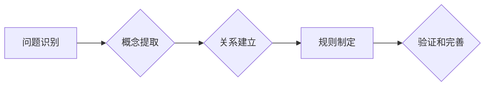

                 

## 思维模型：提升理解力的认知工具

> 关键词：思维模型、认知工具、逻辑推理、问题解决、学习效率、知识结构、系统思考

### 1. 背景介绍

在瞬息万变的科技时代，信息爆炸和知识更新的速度令人眼花缭乱。如何有效地吸收、理解和运用知识，成为了摆在我们面前的重大挑战。 思维模型，作为一种认知工具，能够帮助我们构建知识框架，提升理解力，并更有效地解决问题。

思维模型是指我们用来理解世界、处理信息和做出决策的框架或模式。它可以是抽象的概念、图示结构、算法流程，甚至是个人经验的总结。每个人的思维模型都是独一无二的，它受到个人经历、文化背景、教育水平等多方面因素的影响。

### 2. 核心概念与联系

思维模型的核心概念在于将复杂的信息分解成更易理解的片段，并通过建立联系和关系来构建一个完整的认知框架。

**思维模型的构成要素：**

* **概念:** 思维模型的基本单元，代表着某个事物或现象。
* **关系:** 连接不同概念的桥梁，描述概念之间的联系和依赖关系。
* **规则:** 约束思维模型内概念和关系的逻辑规则，确保模型的内在一致性和有效性。

**思维模型的构建过程:**

1. **识别问题:** 明确需要解决的问题或理解的主题。
2. **提取关键概念:** 从信息中识别出与问题相关的核心概念。
3. **建立概念关系:** 分析概念之间的联系和依赖关系，构建概念网络。
4. **制定规则:** 为模型设定逻辑规则，确保模型的正确性和一致性。
5. **验证和完善:** 通过实践应用和反馈，不断验证和完善思维模型。

**Mermaid 流程图:**



### 3. 核心算法原理 & 具体操作步骤

**3.1 算法原理概述**

思维模型的构建可以看作是一个知识图谱构建的过程，其中涉及到自然语言处理、知识抽取、关系推理等算法。

* **自然语言处理 (NLP):** 用于分析和理解文本信息，提取关键概念和关系。
* **知识抽取:** 从文本中识别出实体、关系和事件，构建知识图谱。
* **关系推理:** 基于已有的知识关系，推断出新的知识关系。

**3.2 算法步骤详解**

1. **文本预处理:** 对输入文本进行清洗、分词、词性标注等预处理操作，以便后续算法的执行。
2. **概念识别:** 利用NLP算法识别文本中的关键概念，并进行概念聚类和分类。
3. **关系抽取:** 利用规则匹配、机器学习等方法识别文本中的概念关系，并构建概念关系图。
4. **知识图谱构建:** 将识别出的概念和关系整合到知识图谱中，形成一个完整的知识框架。
5. **推理和扩展:** 利用关系推理算法，推断出新的知识关系，并扩展知识图谱。

**3.3 算法优缺点**

**优点:**

* 可以有效地捕捉文本中的知识结构和关系。
* 可以帮助我们理解复杂的信息，并进行更深入的思考。
* 可以为人工智能系统提供知识基础，支持更智能的决策和推理。

**缺点:**

* 算法的准确性依赖于训练数据和算法模型的质量。
* 知识图谱的构建是一个复杂的任务，需要大量的计算资源和时间。
* 知识图谱的维护和更新是一个持续的过程，需要不断地收集和整合新的信息。

**3.4 算法应用领域**

* **人工智能:** 为人工智能系统提供知识基础，支持自然语言理解、知识问答、机器翻译等应用。
* **信息检索:** 构建知识图谱可以帮助搜索引擎更好地理解用户查询意图，并提供更精准的搜索结果。
* **教育:** 知识图谱可以作为学习辅助工具，帮助学生理解复杂的概念和知识关系。
* **科学研究:** 知识图谱可以帮助科学家发现新的知识和规律，并加速科学研究的进展。

### 4. 数学模型和公式 & 详细讲解 & 举例说明

**4.1 数学模型构建**

思维模型可以抽象为一个图论模型，其中节点代表概念，边代表关系。

* **节点:**  用集合 $N$ 表示，每个节点 $n \in N$ 代表一个概念。
* **边:** 用集合 $E$ 表示，每个边 $(n_1, n_2) \in E$ 代表概念 $n_1$ 和 $n_2$ 之间的关系。

**4.2 公式推导过程**

我们可以用以下公式来描述思维模型的结构：

* **概念集:** $N = \{n_1, n_2, ..., n_k\}$
* **关系集:** $E = \{(n_1, n_2), (n_2, n_3), ..., (n_j, n_k)\}$

**4.3 案例分析与讲解**

例如，我们可以构建一个关于“编程”的思维模型：

* **概念集:** $N = \{编程, 算法, 数据结构, 代码, 语言, 逻辑\}$
* **关系集:** $E = \{ (编程, 算法), (编程, 数据结构), (编程, 代码), (编程, 语言), (算法, 逻辑) \}$

在这个模型中，我们可以看到编程与算法、数据结构、代码、语言等概念之间存在着密切的联系。

### 5. 项目实践：代码实例和详细解释说明

**5.1 开发环境搭建**

* Python 3.x
* NetworkX 库

**5.2 源代码详细实现**

```python
import networkx as nx

# 创建一个空的图
graph = nx.Graph()

# 添加节点
graph.add_nodes_from(['编程', '算法', '数据结构', '代码', '语言', '逻辑'])

# 添加边
graph.add_edges_from([
    ('编程', '算法'),
    ('编程', '数据结构'),
    ('编程', '代码'),
    ('编程', '语言'),
    ('算法', '逻辑')
])

# 绘制图
nx.draw(graph, with_labels=True)
plt.show()
```

**5.3 代码解读与分析**

* 我们使用 NetworkX 库来构建思维模型的图结构。
* `nx.Graph()` 创建了一个空的图对象。
* `graph.add_nodes_from()` 添加了思维模型中的概念节点。
* `graph.add_edges_from()` 添加了概念之间的关系边。
* `nx.draw()` 绘制了思维模型的图结构，并显示了节点和边。

**5.4 运行结果展示**

代码运行后，会生成一个包含所有概念和关系的思维模型图。

### 6. 实际应用场景

思维模型在各个领域都有着广泛的应用场景：

* **软件开发:** 帮助开发人员理解复杂系统，设计软件架构，解决问题。
* **数据分析:** 帮助数据分析师构建数据模型，发现数据中的隐藏关系和模式。
* **战略规划:** 帮助企业制定战略规划，分析竞争环境，预测未来趋势。
* **个人学习:** 帮助个人构建知识框架，提升学习效率，加深对知识的理解。

**6.4 未来应用展望**

随着人工智能技术的不断发展，思维模型的应用场景将会更加广泛。未来，我们可以期待：

* **个性化思维模型:** 根据用户的个人特点和学习风格，构建个性化的思维模型。
* **动态思维模型:** 能够根据新的信息和知识不断更新和调整的动态思维模型。
* **协作思维模型:** 多人共同构建和共享思维模型，促进知识交流和合作。

### 7. 工具和资源推荐

**7.1 学习资源推荐**

* **书籍:** 《思维模型：提升理解力的认知工具》
* **在线课程:** Coursera, edX 等平台上的思维模型相关课程

**7.2 开发工具推荐**

* **NetworkX:** Python 库，用于构建和分析图结构。
* **Gephi:** 开源图分析软件，用于可视化和分析大型图数据。

**7.3 相关论文推荐**

* **Knowledge Graphs: A Survey**
* **Building a Knowledge Graph for a Specific Domain**

### 8. 总结：未来发展趋势与挑战

**8.1 研究成果总结**

思维模型作为一种认知工具，已经取得了显著的成果，并在各个领域得到了广泛的应用。

**8.2 未来发展趋势**

未来，思维模型的研究将更加注重个性化、动态性和协作性。

**8.3 面临的挑战**

* 如何构建更准确、更完整的知识图谱。
* 如何将思维模型应用于更复杂、更动态的领域。
* 如何提高思维模型的易用性和可解释性。

**8.4 研究展望**

我们相信，随着人工智能技术的不断发展，思维模型将会成为未来认知科学和人工智能研究的重要方向之一。

### 9. 附录：常见问题与解答

**常见问题:**

* 如何构建一个思维模型？
* 如何评估思维模型的有效性？
* 如何将思维模型应用于实际问题？

**解答:**

* 构建思维模型需要遵循一定的步骤，包括问题识别、概念提取、关系建立、规则制定等。
* 思维模型的有效性可以通过其准确性、完整性和实用性来评估。
* 思维模型可以应用于各种实际问题，例如解决问题、进行决策、进行学习等。


作者：禅与计算机程序设计艺术 / Zen and the Art of Computer Programming 
<end_of_turn>

