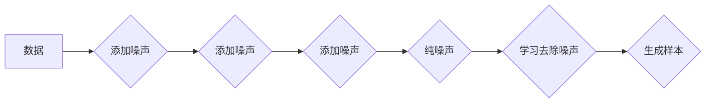

                 

## 扩散模型：生成式人工智能的前沿

> 关键词：扩散模型、生成式人工智能、文本生成、图像生成、语音合成、变分自编码器、马尔可夫链、概率分布

### 1. 背景介绍

近年来，生成式人工智能（Generative AI）领域取得了令人瞩目的进展，其中扩散模型（Diffusion Models）作为一种新兴的生成模型，凭借其强大的生成能力和灵活的应用场景，迅速成为研究热点。 

传统的生成模型，例如生成对抗网络（GANs）和变分自编码器（VAEs），在生成高质量样本方面存在一些局限性，例如训练不稳定、模式坍缩等问题。扩散模型则通过一种渐进式噪声添加和去除的过程，学习了数据分布的潜在结构，从而能够生成更逼真的和多样化的样本。

### 2. 核心概念与联系

扩散模型的核心思想是将一个干净的样本逐渐添加噪声，最终变成纯噪声，然后反过来学习去除噪声的过程，从而生成新的样本。 

**2.1 扩散模型的流程图**



**2.2 核心概念**

* **前向过程（Diffusion Process）：** 将原始数据逐渐添加噪声，最终变成纯噪声。
* **反向过程（Reverse Diffusion Process）：** 学习去除噪声的过程，从纯噪声逐步恢复到原始数据。
* **马尔可夫链（Markov Chain）：** 扩散模型通常使用马尔可夫链来描述数据在添加噪声过程中的状态转移。
* **概率分布（Probability Distribution）：** 扩散模型学习数据分布的概率分布，以便在反向过程中生成新的样本。

### 3. 核心算法原理 & 具体操作步骤

**3.1 算法原理概述**

扩散模型的核心是学习一个概率模型，该模型能够将纯噪声逐步转换为原始数据。 

具体来说，扩散模型通过以下步骤实现：

1. **前向过程：** 将原始数据逐步添加噪声，直到变成纯噪声。
2. **反向过程：** 学习一个神经网络，该网络能够从纯噪声中逐步去除噪声，最终生成新的样本。

**3.2 算法步骤详解**

1. **数据预处理：** 将原始数据进行预处理，例如归一化、标准化等。
2. **前向扩散：** 
    * 将原始数据随机添加少量噪声，得到新的数据样本。
    * 重复上述步骤，每次添加噪声量逐渐增加，直到数据变成纯噪声。
    * 整个过程可以看作是一个马尔可夫链，每个状态代表数据在添加噪声过程中的一个阶段。
3. **反向扩散：**
    * 训练一个神经网络，该网络能够预测在给定噪声条件下，下一个时间步的噪声分布。
    * 从纯噪声开始，逐步去除噪声，每次根据神经网络的预测，去除一部分噪声。
    * 重复上述步骤，直到生成一个新的样本。

**3.3 算法优缺点**

**优点：**

* 生成高质量样本：扩散模型能够生成高质量、逼真的样本，在图像、文本、语音等领域表现出色。
* 训练稳定性好：相比于GANs，扩散模型的训练过程更加稳定，更容易收敛。
* 可解释性强：扩散模型的训练过程可以被理解为一个马尔可夫链，其概率模型也相对容易解释。

**缺点：**

* 计算成本高：扩散模型的训练过程需要大量的计算资源，尤其是在处理高分辨率图像时。
* 生成速度慢：扩散模型的生成速度相对较慢，需要逐步去除噪声，因此生成一个样本需要较长时间。

**3.4 算法应用领域**

扩散模型在以下领域具有广泛的应用前景：

* **图像生成：** 生成高质量的图像，例如人物肖像、风景画、艺术作品等。
* **文本生成：** 生成高质量的文本，例如小说、诗歌、新闻报道等。
* **语音合成：** 生成逼真的语音，例如语音助手、语音翻译等。
* **视频生成：** 生成高质量的视频，例如动画、特效等。
* **药物研发：** 生成新的药物分子，加速药物研发过程。

### 4. 数学模型和公式 & 详细讲解 & 举例说明

**4.1 数学模型构建**

扩散模型的核心是学习一个概率模型，该模型能够描述数据在添加噪声过程中的状态转移。 

假设原始数据为 $x_0$，经过 $T$ 步的噪声添加后，得到纯噪声 $x_T$。 扩散模型学习以下概率分布：

$$p(x_t | x_{t-1})$$

其中，$x_t$ 表示在第 $t$ 步的噪声数据，$x_{t-1}$ 表示在第 $t-1$ 步的噪声数据。

**4.2 公式推导过程**

扩散模型的训练目标是学习上述概率分布，以便能够从纯噪声 $x_T$ 中逐步恢复到原始数据 $x_0$。 

具体来说，训练过程可以看作是一个反向过程，从 $x_T$ 开始，逐步去除噪声，直到生成 $x_0$。 

在反向过程中，使用神经网络来预测 $x_{t-1}$ 的概率分布，给定 $x_t$。

**4.3 案例分析与讲解**

例如，在图像生成任务中，扩散模型可以学习图像像素在添加噪声过程中的概率分布。 

训练过程中，模型会学习到图像像素之间的相关性，以及噪声添加对图像的影响。 

在生成新图像时，模型会从纯噪声开始，逐步去除噪声，并根据学习到的概率分布，生成逼真的图像。

### 5. 项目实践：代码实例和详细解释说明

**5.1 开发环境搭建**

* Python 3.7+
* PyTorch 或 TensorFlow
* CUDA (可选，用于GPU加速)

**5.2 源代码详细实现**

```python
import torch
import torch.nn as nn

class DiffusionModel(nn.Module):
    def __init__(self):
        super(DiffusionModel, self).__init__()
        # 定义神经网络结构
        self.encoder = nn.Sequential(
            # ...
        )
        self.decoder = nn.Sequential(
            # ...
        )

    def forward(self, x, t):
        # 前向过程
        noise = self.encoder(x, t)
        # 反向过程
        x_predicted = self.decoder(noise, t)
        return x_predicted

# 实例化模型
model = DiffusionModel()

# 定义损失函数
loss_fn = nn.MSELoss()

# 定义优化器
optimizer = torch.optim.Adam(model.parameters(), lr=0.001)

# 训练模型
for epoch in range(num_epochs):
    for batch in dataloader:
        # 前向传播
        x_predicted = model(x, t)
        # 计算损失
        loss = loss_fn(x_predicted, x)
        # 反向传播
        optimizer.zero_grad()
        loss.backward()
        # 更新参数
        optimizer.step()

# 保存模型
torch.save(model.state_dict(), 'diffusion_model.pth')
```

**5.3 代码解读与分析**

* `DiffusionModel` 类定义了扩散模型的结构，包括编码器和解码器。
* `forward()` 方法实现了前向和反向过程。
* `encoder()` 函数将输入数据 $x$ 和时间步 $t$ 编码成噪声向量。
* `decoder()` 函数将噪声向量解码成预测数据 $x_predicted$。
* 训练过程使用最小二乘损失函数，并使用Adam优化器更新模型参数。

**5.4 运行结果展示**

训练完成后，可以使用模型生成新的样本。 

例如，可以从纯噪声开始，逐步去除噪声，最终生成一张新的图像。

### 6. 实际应用场景

**6.1 图像生成**

扩散模型在图像生成领域取得了显著的成果，例如：

* **DALL-E 2:** 由OpenAI开发的图像生成模型，能够根据文本描述生成逼真的图像。
* **Stable Diffusion:** 由Stability AI开发的开源图像生成模型，能够生成高质量的图像，并支持多种文本提示。

**6.2 文本生成**

扩散模型也应用于文本生成领域，例如：

* **GPT-3:** 由OpenAI开发的文本生成模型，能够生成流畅、连贯的文本，并支持多种任务，例如写作、翻译、对话等。

**6.3 语音合成**

扩散模型在语音合成领域也有应用，例如：

* **WaveNet:** 由DeepMind开发的语音合成模型，能够生成逼真的语音，并支持多种语言。

**6.4 未来应用展望**

扩散模型在未来将有更广泛的应用前景，例如：

* **视频生成:** 生成高质量的视频，例如动画、特效等。
* **药物研发:** 生成新的药物分子，加速药物研发过程。
* **科学发现:** 帮助科学家探索新的科学规律，例如预测蛋白质结构、模拟分子运动等。

### 7. 工具和资源推荐

**7.1 学习资源推荐**

* **论文:**
    * Denoising Diffusion Probabilistic Models (Ho et al., 2020)
    * Imagen: Text-to-Image Diffusion Models Refine the Prompt via Iterative Refinement (Ramesh et al., 2022)
    * High-Resolution Image Synthesis with Latent Diffusion Models (Rombach et al., 2022)
* **博客文章:**
    * https://lilianweng.github.io/posts/2021-07-11-diffusion-models/
    * https://towardsdatascience.com/understanding-diffusion-models-for-text-to-image-generation-d8971858961c

**7.2 开发工具推荐**

* **PyTorch:** https://pytorch.org/
* **TensorFlow:** https://www.tensorflow.org/

**7.3 相关论文推荐**

* **Generative Modeling by Estimating Gradients of the Data Distribution (Kingma & Welling, 2013)**
* **Generative Adversarial Networks (Goodfellow et al., 2014)**
* **Variational Autoencoders (Kingma & Welling, 2013)**

### 8. 总结：未来发展趋势与挑战

**8.1 研究成果总结**

扩散模型在生成式人工智能领域取得了显著的进展，其强大的生成能力和灵活的应用场景使其成为研究热点。 

**8.2 未来发展趋势**

* **更高效的训练方法:** 探索更有效、更快速的训练方法，降低扩散模型的计算成本。
* **更强大的生成能力:** 研究更复杂的扩散模型架构，提高生成样本的质量和多样性。
* **更广泛的应用场景:** 将扩散模型应用于更多领域，例如视频生成、药物研发、科学发现等。

**8.3 面临的挑战**

* **计算成本高:** 扩散模型的训练过程需要大量的计算资源，尤其是在处理高分辨率图像时。
* **生成速度慢:** 扩散模型的生成速度相对较慢，需要逐步去除噪声，因此生成一个样本需要较长时间。
* **数据依赖性强:** 扩散模型的性能依赖于训练数据的质量和数量。

**8.4 研究展望**

未来，扩散模型的研究将继续朝着更高效、更强大、更广泛的方向发展。 

随着计算资源的不断提升和算法的不断改进，扩散模型有望在生成式人工智能领域发挥更大的作用。

### 9. 附录：常见问题与解答

**9.1 如何选择合适的扩散模型架构？**

选择合适的扩散模型架构取决于具体的应用场景和数据特点。 

例如，对于图像生成任务，可以考虑使用DDPM、Imagen、Stable Diffusion等架构。

**9.2 如何训练扩散模型？**

训练扩散模型需要使用大量的计算资源和训练数据。 

可以使用PyTorch或TensorFlow等深度学习框架进行训练。

**9.3 如何评估扩散模型的性能？**

评估扩散模型的性能可以使用各种指标，例如FID、IS、LPIPS等。

**9.4 扩散模型有哪些应用场景？**

扩散模型在图像生成、文本生成、语音合成等领域都有广泛的应用场景。


作者：禅与计算机程序设计艺术 / Zen and the Art of Computer Programming 
<end_of_turn>

