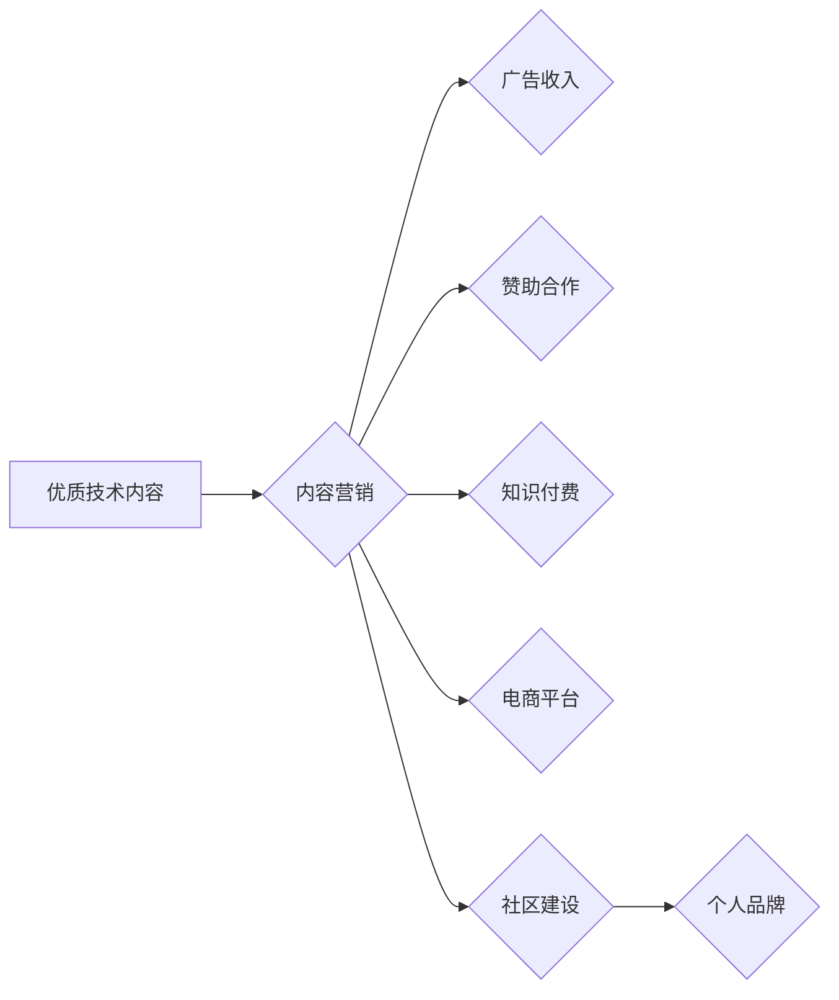

                 

## 技术博客变现：策略与方法

> 关键词：技术博客、变现策略、内容营销、广告收入、赞助合作、知识付费、电商平台、社区建设、个人品牌

## 1. 背景介绍

在当今数字时代，技术博客已成为技术爱好者、开发者和专家分享知识、交流经验、展示技能的重要平台。随着互联网的普及和技术发展日新月异，技术博客的受众群体不断扩大，也为博主提供了更多变现的机会。然而，仅仅拥有优质的技术内容并不能保证博客的盈利，需要制定合理的变现策略，才能将博客的价值最大化。

## 2. 核心概念与联系

技术博客变现的核心概念在于将博客内容转化为商业价值。这需要结合内容营销、广告收入、赞助合作、知识付费等多种策略，并根据自身情况选择合适的变现模式。

**Mermaid 流程图：技术博客变现策略**



## 3. 核心算法原理 & 具体操作步骤

### 3.1  算法原理概述

技术博客变现并非一个简单的算法，而是一个综合性的策略体系。其核心原理在于：

* **价值创造:**  提供有价值的技术内容，解决读者问题，满足读者需求。
* **流量积累:**  通过搜索引擎优化、社交媒体推广等方式，吸引更多读者访问博客。
* **用户粘性:**  打造优质的阅读体验，鼓励读者持续关注博客，提高用户粘性。
* **变现转化:**  将博客流量转化为商业价值，实现盈利目标。

### 3.2  算法步骤详解

技术博客变现的具体操作步骤可以概括为以下几个阶段：

1. **内容规划:**  确定博客的主题方向，规划内容类型和发布频率，确保内容质量和原创性。
2. **平台搭建:**  选择合适的博客平台，进行网站设计和功能配置，打造用户友好的阅读体验。
3. **内容创作:**  撰写高质量的技术文章，结合案例分析、代码示例等方式，提高内容的可读性和实用性。
4. **推广引流:**  利用搜索引擎优化、社交媒体推广、邮件营销等方式，吸引更多读者访问博客。
5. **用户互动:**  积极回复读者评论，举办线上线下活动，建立与读者的互动关系，提高用户粘性。
6. **变现模式选择:**  根据博客内容、受众群体和自身情况，选择合适的变现模式，例如广告收入、赞助合作、知识付费等。
7. **数据分析与优化:**  定期分析博客数据，了解读者阅读习惯和偏好，不断优化内容和推广策略，提高变现效果。

### 3.3  算法优缺点

**优点:**

* **灵活多样:**  技术博客变现模式灵活多样，可以根据自身情况选择合适的策略。
* **低成本投入:**  相对于传统商业模式，技术博客变现成本相对较低。
* **个人品牌建设:**  通过技术博客，可以建立个人品牌，提升行业影响力。

**缺点:**

* **变现周期长:**  技术博客变现需要时间积累，短期内难以获得高收益。
* **竞争激烈:**  技术博客领域竞争激烈，需要不断更新内容，保持竞争力。
* **流量获取难度:**  吸引高质量流量需要付出持续的努力。

### 3.4  算法应用领域

技术博客变现的应用领域广泛，包括：

* **软件开发:**  分享开发经验、技术技巧、代码示例等。
* **数据科学:**  介绍数据分析方法、机器学习算法、数据可视化等。
* **人工智能:**  探讨人工智能技术发展趋势、应用案例、研究成果等。
* **网络安全:**  分享安全知识、漏洞分析、安全工具等。
* **云计算:**  介绍云计算平台、服务、架构等。

## 4. 数学模型和公式 & 详细讲解 & 举例说明

### 4.1  数学模型构建

技术博客变现可以抽象为一个数学模型，其中：

* **流量 (T):** 博客的访问量，可以用PV（页面浏览量）或UV（独立用户数）来衡量。
* **转化率 (C):** 流量转化为商业价值的比例，例如广告点击率、购买转化率等。
* **收益 (R):** 博客的实际收入，可以是广告收入、赞助收入、知识付费收入等。

**数学模型:**

$$R = T * C$$

### 4.2  公式推导过程

该公式表明，博客的收益等于流量乘以转化率。

* **流量 (T)**:  可以通过搜索引擎优化、社交媒体推广、邮件营销等方式增加。
* **转化率 (C)**:  可以通过优化内容质量、提升用户体验、设计有效的变现策略等方式提高。

### 4.3  案例分析与讲解

假设一个技术博客每月有10000个PV，转化率为1%，那么其理论收益为：

$$R = 10000 * 0.01 = 100$$

如果通过优化内容和推广策略，将转化率提高到2%，那么其收益将增加到：

$$R = 10000 * 0.02 = 200$$

可见，提高转化率对博客变现至关重要。

## 5. 项目实践：代码实例和详细解释说明

### 5.1  开发环境搭建

技术博客的开发环境搭建需要根据博客平台和技术栈进行选择。常见的博客平台包括WordPress、Ghost、Medium等，技术栈包括PHP、Python、Node.js等。

### 5.2  源代码详细实现

由于技术博客的代码实现涉及多个方面，例如前端页面设计、后端逻辑处理、数据库管理等，这里只提供一个简单的代码示例，展示如何使用Python和Flask框架构建一个简单的博客页面：

```python
from flask import Flask, render_template

app = Flask(__name__)

@app.route('/')
def index():
    return render_template('index.html')

if __name__ == '__main__':
    app.run(debug=True)
```

**index.html:**

```html
<!DOCTYPE html>
<html>
<head>
    <title>技术博客</title>
</head>
<body>
    <h1>欢迎来到我的技术博客</h1>
</body>
</html>
```

### 5.3  代码解读与分析

* **Flask框架:**  Flask是一个轻量级的Python Web框架，易于学习和使用。
* **路由:**  `@app.route('/')` 定义了根路径的路由规则，当访问博客首页时，会执行`index()`函数。
* **模板引擎:**  `render_template('index.html')` 使用模板引擎渲染`index.html`文件，生成最终的网页内容。

### 5.4  运行结果展示

运行上述代码，访问`http://127.0.0.1:5000/`，即可看到一个简单的技术博客首页。

## 6. 实际应用场景

技术博客变现的实际应用场景非常广泛，以下是一些例子：

### 6.1  广告收入

通过在博客上嵌入广告代码，例如Google AdSense，可以获得广告收入。

### 6.2  赞助合作

与相关企业或组织合作，撰写赞助文章或推广产品服务，获得赞助费用。

### 6.3  知识付费

创作高质量的技术课程、电子书、在线教程等，通过付费订阅或购买的方式，获得知识付费收入。

### 6.4  电商平台

在博客上开设电商店铺，销售技术相关的书籍、工具、软件等，获得商品销售收入。

### 6.5  社区建设

建立技术社区，吸引技术爱好者和开发者交流互动，通过会员订阅、赞助等方式获得收入。

## 7. 工具和资源推荐

### 7.1  学习资源推荐

* **书籍:**  《博客写作指南》、《内容营销实战》、《技术写作技巧》等。
* **在线课程:**  Udemy、Coursera、Skillshare等平台提供技术博客写作、内容营销、SEO等方面的在线课程。
* **博客平台:**  WordPress、Ghost、Medium等平台提供丰富的博客功能和资源。

### 7.2  开发工具推荐

* **代码编辑器:**  VS Code、Sublime Text、Atom等。
* **版本控制系统:**  Git、GitHub等。
* **网站测试工具:**  Chrome DevTools、Firefox Developer Tools等。

### 7.3  相关论文推荐

* **内容营销:**  “Content Marketing: A Review and Research Agenda”
* **技术博客变现:**  “Monetizing Technical Blogs: A Case Study”

## 8. 总结：未来发展趋势与挑战

### 8.1  研究成果总结

技术博客变现是一个不断发展和完善的领域，研究成果表明：

* **内容质量至关重要:**  高质量、原创、有价值的内容是吸引读者和实现变现的关键。
* **用户体验至上:**  良好的用户体验可以提高用户粘性，促进变现转化。
* **多元化变现模式:**  博客变现模式日益多元化，需要根据自身情况选择合适的策略。

### 8.2  未来发展趋势

* **人工智能技术应用:**  人工智能技术可以帮助博客自动生成内容、推荐相关文章、分析用户行为等，提高变现效率。
* **个性化内容推荐:**  基于用户兴趣和行为，提供个性化内容推荐，提升用户体验和互动率。
* **跨平台整合:**  将博客内容整合到社交媒体、电商平台等其他平台，扩大影响力和变现渠道。

### 8.3  面临的挑战

* **流量获取难度:**  随着互联网竞争加剧，吸引高质量流量越来越困难。
* **内容原创性:**  原创内容越来越稀缺，如何保证内容的独特性和价值成为挑战。
* **变现模式创新:**  传统的变现模式面临挑战，需要不断探索新的变现模式。

### 8.4  研究展望

未来研究方向包括：

* **人工智能技术在技术博客变现中的应用研究**
* **个性化内容推荐算法的优化和改进**
* **跨平台整合技术和策略研究**
* **技术博客变现模式的创新和发展**


## 9. 附录：常见问题与解答

**Q1: 如何吸引高质量流量到我的技术博客？**

**A1:**  可以通过搜索引擎优化（SEO）、社交媒体推广、邮件营销、参与技术社区等方式吸引高质量流量。

**Q2: 如何选择合适的技术博客变现模式？**

**A2:**  需要根据博客内容、受众群体和自身情况选择合适的变现模式，例如广告收入、赞助合作、知识付费等。

**Q3: 如何提高技术博客的转化率？**

**A3:**  可以通过优化内容质量、提升用户体验、设计有效的变现策略等方式提高转化率。


作者：禅与计算机程序设计艺术 / Zen and the Art of Computer Programming 
<end_of_turn>

