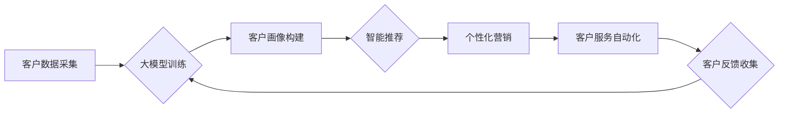

                 

## 探索基于大模型的电商智能客户生命周期管理系统

> 关键词：大模型、电商、客户生命周期管理、智能推荐、个性化服务、自然语言处理、机器学习

## 1. 背景介绍

在当今数据爆炸的时代，电商行业面临着日益激烈的竞争。如何精准地了解客户需求，提供个性化的服务，并有效地引导客户进行购买和复购，成为电商企业提升竞争力的关键。传统的客户生命周期管理 (Customer Lifecycle Management, CLM) 系统主要依赖于规则引擎和人工干预，难以应对海量数据和复杂客户行为的挑战。

近年来，大模型技术 (Large Language Model, LLM) 的快速发展为电商智能 CLM 系统的构建提供了强大的技术支撑。大模型拥有强大的语义理解、文本生成和预测能力，能够从海量数据中挖掘客户行为模式，精准预测客户需求，并提供个性化的服务建议。

## 2. 核心概念与联系

### 2.1  客户生命周期管理 (CLM)

CLM 是指企业围绕客户进行全生命周期的管理，从客户获取到客户流失，每个阶段都进行相应的营销和服务策略，以提升客户价值和忠诚度。

### 2.2  大模型 (LLM)

大模型是指参数量巨大、训练数据海量的人工智能模型，能够通过深度学习技术学习复杂的语言模式和知识。

### 2.3  电商智能 CLM 系统

电商智能 CLM 系统利用大模型技术，对客户数据进行分析和预测，实现以下功能：

* **客户画像构建:**  基于客户行为、偏好、购买历史等数据，构建精准的客户画像。
* **智能推荐:**  根据客户画像和实时行为，推荐个性化的商品和服务。
* **个性化营销:**  根据客户需求和行为，制定个性化的营销策略，提高营销转化率。
* **客户服务自动化:**  利用自然语言处理技术，实现智能客服，自动解答客户问题，提升服务效率。

**核心架构流程图:**



## 3. 核心算法原理 & 具体操作步骤

### 3.1  算法原理概述

电商智能 CLM 系统的核心算法主要包括：

* **自然语言处理 (NLP):** 用于理解和处理客户文本数据，例如评论、聊天记录等。
* **机器学习 (ML):** 用于从客户数据中学习模式，预测客户行为，例如购买意向、退货率等。
* **深度学习 (DL):** 用于构建更复杂的模型，例如大语言模型，提高预测精度和个性化程度。

### 3.2  算法步骤详解

1. **数据采集:** 收集客户行为数据，例如浏览记录、购买历史、评论反馈等。
2. **数据预处理:** 清洗、转换和格式化数据，使其适合模型训练。
3. **模型训练:** 利用 NLP、ML 和 DL 算法，训练大模型，使其能够理解客户需求和行为模式。
4. **模型评估:** 使用测试数据评估模型性能，例如准确率、召回率等。
5. **模型部署:** 将训练好的模型部署到生产环境，用于实时处理客户数据。
6. **结果分析:** 分析模型预测结果，优化营销策略和服务方案。

### 3.3  算法优缺点

**优点:**

* **精准度高:** 大模型能够从海量数据中学习复杂的模式，提高预测精度。
* **个性化强:**  能够根据客户画像和行为，提供个性化的服务和推荐。
* **自动化程度高:**  能够自动完成许多重复性任务，例如智能客服、商品推荐等。

**缺点:**

* **训练成本高:**  大模型训练需要大量的计算资源和时间。
* **数据依赖性强:**  模型性能取决于训练数据的质量和数量。
* **解释性弱:**  大模型的决策过程难以解释，难以获得用户信任。

### 3.4  算法应用领域

* **电商推荐:**  推荐个性化的商品和服务。
* **客户分群:**  将客户分为不同的群体，针对不同群体的需求进行营销。
* **营销自动化:**  自动执行营销任务，例如发送个性化邮件、推送广告等。
* **客户服务:**  提供智能客服，自动解答客户问题。

## 4. 数学模型和公式 & 详细讲解 & 举例说明

### 4.1  数学模型构建

电商智能 CLM 系统的数学模型通常基于概率论和统计学，例如：

* **贝叶斯网络:** 用于建模客户行为之间的依赖关系。
* **隐马尔可夫模型 (HMM):** 用于预测客户在不同生命周期阶段的概率。
* **深度神经网络 (DNN):** 用于学习更复杂的客户行为模式。

### 4.2  公式推导过程

例如，使用贝叶斯网络预测客户购买商品的概率，可以根据以下公式推导：

$$P(购买|特征) = \frac{P(特征|购买) * P(购买)}{P(特征)}$$

其中：

* $P(购买|特征)$ 是客户在给定特征条件下购买商品的概率。
* $P(特征|购买)$ 是客户购买商品的条件下，特征出现的概率。
* $P(购买)$ 是客户购买商品的总概率。
* $P(特征)$ 是特征出现的总概率。

### 4.3  案例分析与讲解

假设电商平台要预测客户是否购买某个商品，可以根据客户的浏览记录、购买历史、年龄、性别等特征构建贝叶斯网络模型。

通过训练模型，可以得到每个特征对购买概率的影响，例如：

* 浏览该商品的概率对购买概率影响较大。
* 购买过相同类别的商品的概率对购买概率影响中等。
* 年龄和性别对购买概率影响较小。

根据模型预测结果，电商平台可以针对不同客户群体的特征，制定个性化的营销策略，例如：

* 对浏览过该商品的客户，推送优惠信息。
* 对购买过相同类别的商品的客户，推荐相关商品。

## 5. 项目实践：代码实例和详细解释说明

### 5.1  开发环境搭建

* **操作系统:** Ubuntu 20.04
* **编程语言:** Python 3.8
* **深度学习框架:** TensorFlow 2.0
* **自然语言处理库:** Transformers

### 5.2  源代码详细实现

```python
# 导入必要的库
import tensorflow as tf
from transformers import AutoModelForSequenceClassification, AutoTokenizer

# 加载预训练模型和词典
model_name = "bert-base-uncased"
tokenizer = AutoTokenizer.from_pretrained(model_name)
model = AutoModelForSequenceClassification.from_pretrained(model_name, num_labels=2)

# 定义训练数据
train_data = [
    ("这是一个购买商品的评论", 1),
    ("这个商品质量很差", 0),
    # ...
]

# 定义训练函数
def train_step(inputs, labels):
    with tf.GradientTape() as tape:
        outputs = model(inputs)
        loss = tf.keras.losses.BinaryCrossentropy()(labels, outputs)
    gradients = tape.gradient(loss, model.trainable_variables)
    optimizer.apply_gradients(zip(gradients, model.trainable_variables))

# 训练模型
optimizer = tf.keras.optimizers.Adam(learning_rate=1e-5)
for epoch in range(10):
    for inputs, labels in train_data:
        train_step(inputs, labels)

# 保存模型
model.save_pretrained("my_model")

```

### 5.3  代码解读与分析

* 代码首先导入必要的库，并加载预训练的 BERT 模型和词典。
* 然后定义训练数据，每个数据包含文本评论和对应的标签 (1 表示购买，0 表示不购买)。
* 定义训练函数，使用 Adam 优化器训练模型，并计算损失函数。
* 最后训练模型，并保存训练好的模型。

### 5.4  运行结果展示

训练完成后，可以使用保存的模型对新的文本评论进行预测，例如：

```python
# 加载保存的模型
model = AutoModelForSequenceClassification.from_pretrained("my_model")

# 对新的文本评论进行预测
text = "这个商品很不错，我要买它！"
inputs = tokenizer(text, return_tensors="tf")
outputs = model(inputs)
predicted_label = tf.argmax(outputs.logits, axis=1).numpy()[0]

# 输出预测结果
if predicted_label == 1:
    print("预测结果：客户将购买商品")
else:
    print("预测结果：客户不会购买商品")
```

## 6. 实际应用场景

### 6.1  电商推荐系统

基于大模型的电商推荐系统能够根据客户的浏览历史、购买记录、兴趣偏好等数据，推荐更精准、更个性化的商品，提高用户体验和转化率。

### 6.2  客户分群

大模型可以分析客户的各种行为数据，将客户分为不同的群体，例如高价值客户、忠诚客户、潜在客户等，针对不同群体的需求制定不同的营销策略。

### 6.3  个性化营销

根据客户画像和行为数据，大模型可以生成个性化的营销文案、推送个性化的广告，提高营销效果。

### 6.4  未来应用展望

随着大模型技术的不断发展，电商智能 CLM 系统将更加智能化、个性化和自动化。未来，大模型将能够：

* 更精准地预测客户行为，例如购买意向、退货率等。
* 更个性化地提供服务，例如定制化商品推荐、个性化客服等。
* 更智能地自动化营销任务，例如自动生成营销文案、自动推送广告等。

## 7. 工具和资源推荐

### 7.1  学习资源推荐

* **书籍:**
    * 《深度学习》 by Ian Goodfellow, Yoshua Bengio, Aaron Courville
    * 《自然语言处理》 by Dan Jurafsky, James H. Martin
* **在线课程:**
    * Coursera: Deep Learning Specialization
    * Udacity: Natural Language Processing Nanodegree
* **博客和论坛:**
    * TensorFlow Blog
    * Hugging Face Blog
    * Stack Overflow

### 7.2  开发工具推荐

* **深度学习框架:** TensorFlow, PyTorch
* **自然语言处理库:** Transformers, spaCy, NLTK
* **云平台:** AWS, Google Cloud, Azure

### 7.3  相关论文推荐

* **BERT: Pre-training of Deep Bidirectional Transformers for Language Understanding**
* **GPT-3: Language Models are Few-Shot Learners**
* **XLNet: Generalized Autoregressive Pretraining for Language Understanding**

## 8. 总结：未来发展趋势与挑战

### 8.1  研究成果总结

基于大模型的电商智能 CLM 系统取得了显著的成果，能够提高客户体验、提升营销效果、降低运营成本。

### 8.2  未来发展趋势

* **模型规模和能力提升:**  未来大模型将更加庞大，拥有更强的语义理解和生成能力。
* **多模态融合:**  大模型将融合文本、图像、音频等多模态数据，提供更全面的客户服务。
* **可解释性增强:**  研究人员将致力于提高大模型的解释性，使其决策过程更加透明。

### 8.3  面临的挑战

* **数据隐私和安全:**  大模型训练需要大量客户数据，如何保护数据隐私和安全是一个重要挑战。
* **模型偏见和公平性:**  大模型可能存在偏见，导致不公平的决策，需要进行公平性评估和修正。
* **模型部署和维护成本:**  部署和维护大型模型需要大量的计算资源和专业人才，成本较高。

### 8.4  研究展望

未来，研究人员将继续探索大模型在电商智能 CLM 系统中的应用，开发更智能、更安全、更公平的系统，为电商企业提供更强大的竞争优势。

## 9. 附录：常见问题与解答

**Q1: 大模型训练需要多少数据？**

A1: 大模型训练需要海量数据，通常需要数十亿甚至数百亿个样本。

**Q2: 如何评估大模型的性能？**

A2: 大模型的性能可以通过多种指标评估，例如准确率、召回率、F1-score等。

**Q3: 如何解决大模型的偏见问题？**

A3: 可以通过数据预处理、模型训练和评估等环节，采取措施减少大模型的偏见。

**作者：禅与计算机程序设计艺术 / Zen and the Art of Computer Programming**<end_of_turn>

