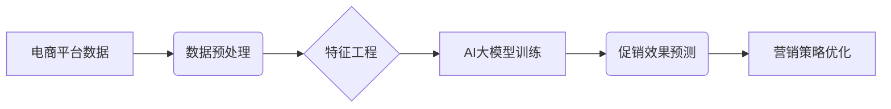

                 

## 探讨AI大模型在电商平台促销效果预测中的作用

> 关键词：电商平台、促销效果预测、AI大模型、深度学习、自然语言处理、推荐系统、数据分析、机器学习

## 1. 背景介绍

在当今数据爆炸的时代，电商平台面临着日益激烈的竞争压力。如何精准地预测促销活动的效果，并制定最优的营销策略，成为电商平台能否持续发展的关键。传统的促销效果预测方法往往依赖于经验和历史数据分析，缺乏精准性和可解释性。近年来，随着人工智能技术的快速发展，特别是深度学习和自然语言处理技术的突破，AI大模型在电商平台促销效果预测领域展现出巨大的潜力。

AI大模型能够通过学习海量数据，识别复杂的模式和关系，从而更准确地预测促销活动的成功率、转化率、销售额等关键指标。此外，AI大模型还能够提供更个性化的促销方案，针对不同用户群体的需求进行精准营销，提升营销效率。

## 2. 核心概念与联系

### 2.1  电商平台促销效果预测

电商平台促销效果预测是指利用数据分析和机器学习技术，预测电商平台促销活动的效果，包括但不限于：

* **转化率预测**: 预估促销活动中用户点击商品后购买的比例。
* **销售额预测**: 预估促销活动期间商品的销售总额。
* **用户参与度预测**: 预估促销活动中用户参与的程度，例如浏览商品、加入购物车等行为。

### 2.2  AI大模型

AI大模型是指训练规模庞大、参数数量众多的人工智能模型，能够学习和处理复杂的数据模式。常见的AI大模型类型包括：

* **Transformer模型**: 擅长处理文本数据，例如BERT、GPT-3等。
* **卷积神经网络(CNN)**: 擅长处理图像数据，例如ResNet、VGG等。
* **循环神经网络(RNN)**: 擅长处理序列数据，例如LSTM、GRU等。

### 2.3  核心概念架构



## 3. 核心算法原理 & 具体操作步骤

### 3.1  算法原理概述

AI大模型在电商平台促销效果预测中的应用主要基于以下算法原理：

* **监督学习**: 利用历史促销数据，训练模型预测未来促销效果。
* **深度学习**: 利用多层神经网络，学习数据中的复杂特征和模式。
* **自然语言处理**: 处理用户评论、产品描述等文本数据，提取有价值的信息。

### 3.2  算法步骤详解

1. **数据收集**: 收集电商平台的历史促销数据，包括商品信息、用户行为、促销活动信息等。
2. **数据预处理**: 对收集到的数据进行清洗、转换、编码等处理，使其适合模型训练。
3. **特征工程**: 从原始数据中提取有价值的特征，例如商品属性、用户画像、促销活动类型等。
4. **模型选择**: 根据预测任务和数据特点，选择合适的AI大模型，例如回归模型、分类模型等。
5. **模型训练**: 利用训练数据，训练选择的AI大模型，并进行模型评估和调参。
6. **模型部署**: 将训练好的模型部署到线上环境，用于预测未来促销效果。
7. **结果分析**: 对预测结果进行分析，并根据分析结果优化营销策略。

### 3.3  算法优缺点

**优点**:

* **预测精度高**: AI大模型能够学习数据中的复杂模式，提高预测精度。
* **可解释性强**: 一些AI大模型能够提供预测结果的解释，帮助理解预测结果背后的原因。
* **自动化程度高**: AI大模型可以自动化预测促销效果，减少人工干预。

**缺点**:

* **数据依赖性强**: AI大模型的性能依赖于训练数据的质量和数量。
* **计算资源需求高**: 训练大型AI模型需要大量的计算资源。
* **模型维护成本高**: 需要定期更新模型，以适应不断变化的数据环境。

### 3.4  算法应用领域

AI大模型在电商平台促销效果预测领域的应用场景广泛，包括：

* **商品推荐**: 根据用户的历史购买行为和兴趣偏好，推荐相关的促销商品。
* **促销活动策划**: 根据预测结果，制定最优的促销活动方案，例如折扣力度、活动时间等。
* **用户画像**: 建立用户画像，精准地定位目标用户群体，进行个性化营销。
* **风险控制**: 预测促销活动中的潜在风险，例如欺诈行为、恶意刷单等。

## 4. 数学模型和公式 & 详细讲解 & 举例说明

### 4.1  数学模型构建

在电商平台促销效果预测中，常用的数学模型包括线性回归模型、逻辑回归模型、支持向量机模型、决策树模型等。

**线性回归模型**: 用于预测连续型变量，例如销售额。模型假设目标变量与输入特征之间存在线性关系。

**公式**:

$$
y = \beta_0 + \beta_1x_1 + \beta_2x_2 + ... + \beta_nx_n + \epsilon
$$

其中：

* $y$ 是目标变量
* $x_1, x_2, ..., x_n$ 是输入特征
* $\beta_0, \beta_1, ..., \beta_n$ 是模型参数
* $\epsilon$ 是误差项

**逻辑回归模型**: 用于预测分类型变量，例如用户是否购买商品。模型将输入特征映射到0到1之间的概率值，表示用户购买商品的可能性。

**公式**:

$$
P(y=1|x) = \frac{1}{1 + e^{-( \beta_0 + \beta_1x_1 + \beta_2x_2 + ... + \beta_nx_n )}}
$$

其中：

* $P(y=1|x)$ 是用户购买商品的概率
* $x_1, x_2, ..., x_n$ 是输入特征
* $\beta_0, \beta_1, ..., \beta_n$ 是模型参数

### 4.2  公式推导过程

模型参数的学习过程通常使用梯度下降算法。梯度下降算法通过不断调整模型参数，使得模型预测结果与实际结果之间的误差最小化。

### 4.3  案例分析与讲解

假设我们想要预测电商平台促销活动中的转化率。我们可以使用逻辑回归模型，将用户的历史购买行为、商品属性、促销活动信息等作为输入特征，预测用户是否会购买商品。

通过训练模型，我们可以得到模型参数，并使用这些参数预测未来促销活动的转化率。

## 5. 项目实践：代码实例和详细解释说明

### 5.1  开发环境搭建

为了实现电商平台促销效果预测项目，我们需要搭建以下开发环境：

* **操作系统**: Linux或Windows
* **编程语言**: Python
* **深度学习框架**: TensorFlow或PyTorch
* **数据处理工具**: Pandas
* **机器学习库**: scikit-learn

### 5.2  源代码详细实现

```python
import pandas as pd
from sklearn.model_selection import train_test_split
from sklearn.linear_model import LogisticRegression
from sklearn.metrics import accuracy_score

# 加载数据
data = pd.read_csv('promotion_data.csv')

# 数据预处理
# ...

# 特征工程
# ...

# 将数据分为训练集和测试集
X_train, X_test, y_train, y_test = train_test_split(X, y, test_size=0.2)

# 创建逻辑回归模型
model = LogisticRegression()

# 训练模型
model.fit(X_train, y_train)

# 预测测试集结果
y_pred = model.predict(X_test)

# 计算模型精度
accuracy = accuracy_score(y_test, y_pred)
print('模型精度:', accuracy)
```

### 5.3  代码解读与分析

* **数据加载**: 使用Pandas库加载促销数据。
* **数据预处理**: 对数据进行清洗、转换、编码等处理。
* **特征工程**: 从原始数据中提取有价值的特征。
* **数据分割**: 将数据分为训练集和测试集，用于模型训练和评估。
* **模型创建**: 使用Scikit-learn库创建逻辑回归模型。
* **模型训练**: 使用训练集训练模型。
* **模型预测**: 使用测试集预测结果。
* **模型评估**: 计算模型精度，评估模型性能。

### 5.4  运行结果展示

运行代码后，会输出模型的精度值。精度值越高，模型的预测效果越好。

## 6. 实际应用场景

AI大模型在电商平台促销效果预测领域的应用场景广泛，例如：

* **个性化推荐**: 根据用户的历史购买行为和兴趣偏好，推荐相关的促销商品。
* **促销活动策划**: 根据预测结果，制定最优的促销活动方案，例如折扣力度、活动时间等。
* **用户画像**: 建立用户画像，精准地定位目标用户群体，进行个性化营销。
* **风险控制**: 预测促销活动中的潜在风险，例如欺诈行为、恶意刷单等。

### 6.4  未来应用展望

随着人工智能技术的不断发展，AI大模型在电商平台促销效果预测领域的应用将更加广泛和深入。

* **更精准的预测**: 利用更先进的AI算法和更丰富的训练数据，提高预测精度。
* **更个性化的营销**: 利用用户画像和行为分析，进行更精准的个性化营销。
* **更智能的决策**: 利用AI模型的分析结果，帮助电商平台制定更智能的营销决策。

## 7. 工具和资源推荐

### 7.1  学习资源推荐

* **书籍**:
    * 深度学习
    * 人工智能：一种现代方法
* **在线课程**:
    * Coursera深度学习课程
    * Udacity人工智能课程

### 7.2  开发工具推荐

* **深度学习框架**: TensorFlow, PyTorch
* **数据处理工具**: Pandas
* **机器学习库**: Scikit-learn

### 7.3  相关论文推荐

* **Attention Is All You Need**: https://arxiv.org/abs/1706.03762
* **BERT: Pre-training of Deep Bidirectional Transformers for Language Understanding**: https://arxiv.org/abs/1810.04805

## 8. 总结：未来发展趋势与挑战

### 8.1  研究成果总结

AI大模型在电商平台促销效果预测领域取得了显著的成果，能够提高预测精度，帮助电商平台制定更优的营销策略。

### 8.2  未来发展趋势

* **模型更加复杂**: 随着计算资源的不断提升，AI大模型将更加复杂，能够学习更丰富的特征和模式。
* **数据更加丰富**: 随着数据收集和分析技术的进步，AI大模型将拥有更丰富的训练数据，从而提高预测精度。
* **应用更加广泛**: AI大模型将应用于电商平台的更多领域，例如商品推荐、用户画像、风险控制等。

### 8.3  面临的挑战

* **数据质量**: AI大模型的性能依赖于训练数据的质量，如何获取高质量的数据仍然是一个挑战。
* **模型 interpretability**: 一些AI大模型的决策过程难以解释，如何提高模型的 interpretability 是一个重要的研究方向。
* **计算资源**: 训练大型AI模型需要大量的计算资源，如何降低训练成本是一个需要解决的问题。

### 8.4  研究展望

未来，AI大模型在电商平台促销效果预测领域将继续发展，并带来更多创新应用。

## 9. 附录：常见问题与解答

* **Q1**: 如何选择合适的AI大模型？

* **A1**: 选择合适的AI大模型需要根据具体的预测任务和数据特点进行选择。例如，对于连续型变量的预测，可以使用线性回归模型；对于分类型变量的预测，可以使用逻辑回归模型。

* **Q2**: 如何评估AI大模型的性能？

* **A2**: 可以使用多种指标来评估AI大模型的性能，例如精度、召回率、F1-score等。

* **Q3**: 如何提高AI大模型的预测精度？

* **A3**: 可以通过以下方法提高AI大模型的预测精度：
    * 提高训练数据的质量
    * 使用更复杂的AI模型
    * 调整模型参数
    * 使用数据增强技术

作者：禅与计算机程序设计艺术 / Zen and the Art of Computer Programming


<end_of_turn>

