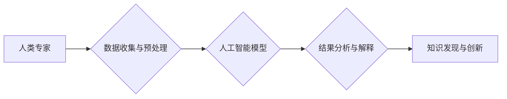

                 

## 推动知识发现与创新：人类计算的智力贡献

> 关键词：人类计算、知识发现、创新、人工智能、协同智能、数据分析、认知科学、计算模型

## 1. 背景介绍

在信息爆炸的时代，海量数据无处不在，但蕴藏在其中的知识却难以被有效挖掘。传统的数据分析方法往往局限于结构化数据，而人类的智慧和经验则能够帮助我们从海量、复杂、非结构化的数据中发现隐藏的模式和规律。人类计算，作为一种将人类智能与计算能力相结合的新兴范式，正逐渐成为推动知识发现与创新的重要力量。

人类计算的核心思想是利用人类的认知能力和创造力，辅助和增强计算机的计算能力，共同完成复杂的任务。它打破了传统的人机分离的模式，强调人机协同，将人类的智慧融入到计算过程中。

## 2. 核心概念与联系

**2.1 人类计算的本质**

人类计算是一种将人类的智慧和计算能力相结合的全新范式。它不仅仅是简单的“人做计算”，而是将人类的认知能力、创造力、判断力和经验融入到计算过程中，以实现更高效、更智能的知识发现和创新。

**2.2 人类计算的优势**

* **洞察力强:** 人类拥有强大的认知能力和抽象思维能力，能够从海量数据中发现隐藏的模式和规律，并进行深入的理解和解释。
* **创造力丰富:** 人类能够进行创新性思维，提出新的解决方案和创意，推动知识的突破和发展。
* **适应性强:** 人类能够根据不同的情境和需求灵活调整策略，解决复杂、多变的问题。

**2.3 人类计算的应用场景**

人类计算在各个领域都有广泛的应用，例如：

* **科学研究:** 利用人类的专业知识和经验，辅助科学家分析实验数据、发现新规律、推动科学发现。
* **医疗诊断:** 人类医生结合人工智能辅助诊断系统，提高诊断准确率，为患者提供更精准的治疗方案。
* **金融风险管理:** 人类分析师结合机器学习模型，识别金融风险，降低投资损失。
* **创意设计:** 人类设计师与人工智能协同设计，创造出更具创新性和美感的作品。

**2.4 人类计算的架构**



## 3. 核心算法原理 & 具体操作步骤

### 3.1 算法原理概述

人类计算的核心算法原理是将人类的认知能力和计算能力相结合，通过以下步骤实现知识发现和创新：

1. **数据收集与预处理:** 收集相关数据，并进行清洗、转换、格式化等预处理操作，以便于后续分析。
2. **人工智能模型构建:** 利用机器学习、深度学习等人工智能技术，构建能够识别模式、发现规律的模型。
3. **人类专家参与:** 人类专家根据模型的输出结果，进行分析、解释、验证和修正，并提供自己的专业知识和经验。
4. **知识发现与创新:** 基于人类专家和人工智能模型的协同工作，发现新的知识、模式和规律，并将其转化为创新成果。

### 3.2 算法步骤详解

1. **数据收集与预处理:**

* 确定需要收集的数据类型和来源。
* 使用爬虫、API等工具收集数据。
* 对收集到的数据进行清洗，去除重复、错误或无效数据。
* 对数据进行转换，将数据转换为适合模型输入的格式。
* 对数据进行格式化，例如归一化、标准化等。

2. **人工智能模型构建:**

* 选择合适的机器学习算法，例如分类、回归、聚类等。
* 根据数据特点和任务需求，选择合适的深度学习模型，例如卷积神经网络、循环神经网络等。
* 使用训练数据训练模型，并进行模型评估和调优。

3. **人类专家参与:**

* 人类专家对模型的输出结果进行分析和解释，识别潜在的模式和规律。
* 人类专家根据自己的专业知识和经验，对模型的输出结果进行验证和修正。
* 人类专家提出新的问题和假设，引导模型进行更深入的探索。

4. **知识发现与创新:**

* 基于人类专家和人工智能模型的协同工作，发现新的知识、模式和规律。
* 将发现的知识转化为创新成果，例如新产品、新服务、新技术等。

### 3.3 算法优缺点

**优点:**

* 能够发现传统方法难以发现的隐藏模式和规律。
* 能够结合人类的智慧和经验，提高知识发现的准确性和有效性。
* 能够促进人类和人工智能的协同创新，推动科技进步。

**缺点:**

* 需要大量的训练数据和计算资源。
* 人类专家参与的成本较高。
* 模型的解释性和可解释性仍然是一个挑战。

### 3.4 算法应用领域

人类计算的应用领域非常广泛，包括：

* **科学研究:** 天文学、生物学、物理学等领域的研究人员利用人类计算来分析实验数据、发现新规律、推动科学发现。
* **医疗诊断:** 人类医生结合人工智能辅助诊断系统，提高诊断准确率，为患者提供更精准的治疗方案。
* **金融风险管理:** 人类分析师结合机器学习模型，识别金融风险，降低投资损失。
* **创意设计:** 人类设计师与人工智能协同设计，创造出更具创新性和美感的作品。

## 4. 数学模型和公式 & 详细讲解 & 举例说明

### 4.1 数学模型构建

人类计算的数学模型通常基于概率论、统计学和机器学习等领域。

**4.1.1 贝叶斯网络:** 贝叶斯网络是一种概率图模型，用于表示随机变量之间的依赖关系。它可以用于知识发现、预测和决策分析。

**4.1.2 决策树:** 决策树是一种树形结构的模型，用于分类和回归问题。它通过一系列的决策规则，将数据分类或预测目标值。

**4.1.3 支持向量机:** 支持向量机是一种监督学习算法，用于分类和回归问题。它通过寻找数据样本之间的最大间隔，构建一个分类超平面。

### 4.2 公式推导过程

**4.2.1 贝叶斯定理:**

$$P(A|B) = \frac{P(B|A)P(A)}{P(B)}$$

其中：

* $P(A|B)$ 是在已知事件 B 发生的情况下，事件 A 发生的概率。
* $P(B|A)$ 是在已知事件 A 发生的情况下，事件 B 发生的概率。
* $P(A)$ 是事件 A 发生的概率。
* $P(B)$ 是事件 B 发生的概率。

**4.2.2 决策树信息增益:**

$$Gain(S,A) = H(S) - \sum_{v \in V} \frac{|S_v|}{|S|} H(S_v)$$

其中：

* $S$ 是数据集。
* $A$ 是特征。
* $V$ 是特征 A 的取值集合。
* $S_v$ 是特征 A 取值为 $v$ 的子集。
* $H(S)$ 是数据集 S 的熵。
* $H(S_v)$ 是子集 $S_v$ 的熵。

### 4.3 案例分析与讲解

**4.3.1 医疗诊断:**

假设我们有一个医疗诊断系统，需要根据患者的症状和病史预测疾病类型。我们可以使用贝叶斯网络来建模患者的症状和疾病之间的关系。

例如，如果患者出现咳嗽、发烧和胸痛的症状，我们可以根据贝叶斯网络计算出患者患肺炎的概率。

**4.3.2 产品推荐:**

假设我们有一个电商平台，需要根据用户的购买历史推荐产品。我们可以使用决策树来建模用户的购买行为和产品特征之间的关系。

例如，如果用户购买过运动鞋、服装和背包，我们可以根据决策树预测用户可能感兴趣的户外运动装备。

## 5. 项目实践：代码实例和详细解释说明

### 5.1 开发环境搭建

* **操作系统:** Ubuntu 20.04 LTS
* **编程语言:** Python 3.8
* **深度学习框架:** TensorFlow 2.0
* **数据处理库:** Pandas, NumPy
* **可视化库:** Matplotlib, Seaborn

### 5.2 源代码详细实现

```python
import tensorflow as tf
from tensorflow.keras.models import Sequential
from tensorflow.keras.layers import Dense

# 构建一个简单的多层感知机模型
model = Sequential()
model.add(Dense(64, activation='relu', input_shape=(10,)))
model.add(Dense(32, activation='relu'))
model.add(Dense(10, activation='softmax'))

# 编译模型
model.compile(optimizer='adam',
              loss='sparse_categorical_crossentropy',
              metrics=['accuracy'])

# 训练模型
model.fit(x_train, y_train, epochs=10, batch_size=32)

# 评估模型
loss, accuracy = model.evaluate(x_test, y_test)
print('Loss:', loss)
print('Accuracy:', accuracy)
```

### 5.3 代码解读与分析

* **模型构建:** 我们使用 TensorFlow 的 Sequential API 构建了一个简单的多层感知机模型。模型包含三个全连接层，第一层输入维度为 10，最后一层输出维度为 10，对应于 10 个类别。
* **模型编译:** 我们使用 Adam 优化器、交叉熵损失函数和准确率指标来编译模型。
* **模型训练:** 我们使用训练数据训练模型 10 个 epochs，每次训练 32 个样本。
* **模型评估:** 我们使用测试数据评估模型的性能，并打印出损失值和准确率。

### 5.4 运行结果展示

运行上述代码后，会输出模型的训练过程和评估结果。

## 6. 实际应用场景

### 6.1 科学研究

* **蛋白质结构预测:** 人类计算可以结合蛋白质序列和结构信息，利用人工智能模型预测蛋白质的三维结构，为药物研发和疾病研究提供重要线索。
* **药物发现:** 人类计算可以分析药物分子结构和生物活性数据，识别潜在的药物候选物，加速药物研发过程。
* **气候模型:** 人类计算可以结合气候数据和物理模型，模拟气候变化趋势，为应对气候变化提供科学依据。

### 6.2 医疗保健

* **疾病诊断:** 人类计算可以结合患者的症状、病史、影像学检查等数据，辅助医生进行疾病诊断，提高诊断准确率。
* **个性化治疗:** 人类计算可以分析患者的基因信息、生活方式等数据，为患者提供个性化的治疗方案。
* **远程医疗:** 人类计算可以支持远程医疗平台，帮助医生远程诊断和治疗患者。

### 6.3 其他领域

* **金融风险管理:** 人类计算可以分析金融市场数据，识别潜在的风险，帮助金融机构降低投资损失。
* **欺诈检测:** 人类计算可以分析交易数据，识别异常行为，帮助金融机构防范欺诈。
* **创意设计:** 人类计算可以辅助设计师进行创意设计，例如生成新的图案、设计新的产品等。

### 6.4 未来应用展望

随着人工智能技术的不断发展，人类计算将在更多领域得到应用，例如：

* **自动驾驶:** 人类计算可以帮助自动驾驶系统更好地理解道路环境，提高驾驶安全性。
* **机器人技术:** 人类计算可以赋予机器人更强的感知能力和决策能力，使其能够更好地完成复杂的任务。
* **教育领域:** 人类计算可以个性化学习方案，提高学习效率。

## 7. 工具和资源推荐

### 7.1 学习资源推荐

* **书籍:**
    * 《人类计算：人工智能与人类智慧的协同》
    * 《深度学习》
    * 《机器学习》
* **在线课程:**
    * Coursera: 人工智能课程
    * edX: 深度学习课程
    * Udacity: 机器学习工程师课程

### 7.2 开发工具推荐

* **编程语言:** Python
* **深度学习框架:** TensorFlow, PyTorch
* **数据处理库:** Pandas, NumPy
* **可视化库:** Matplotlib, Seaborn

### 7.3 相关论文推荐

* **人类计算的定义和分类:**
    * "Human Computation: A Survey"
* **人类计算的应用案例:**
    * "Human Computation for Scientific Discovery"
    * "Crowdsourcing for Healthcare: A Review"
* **人类计算的未来发展趋势:**
    * "The Future of Human Computation"

## 8. 总结：未来发展趋势与挑战

### 8.1 研究成果总结

人类计算作为一种新兴的计算范式，在推动知识发现和创新的过程中取得了显著成果。它将人类的智慧和经验与人工智能技术的优势相结合，能够解决传统方法难以解决的问题，并为人类社会带来新的价值。

### 8.2 未来发展趋势

未来，人类计算将朝着以下几个方向发展：

* **更智能的人机交互:** 人类计算将更加注重人机交互的自然性和智能化，例如使用自然语言交互、语音交互等方式。
* **更强大的计算能力:** 人工智能技术的不断发展将为人类计算提供更强大的计算能力，使其能够处理更复杂的数据和问题。
* **更广泛的应用场景:** 人类计算将应用于更多领域，例如自动驾驶、机器人技术、教育领域等。

### 8.3 面临的挑战

人类计算也面临着一些挑战：

* **模型的可解释性:** 人工智能模型的决策过程往往难以理解，这对于人类计算的信任和应用存在挑战。
* **数据隐私和安全:** 人类计算需要处理大量的数据，如何保护数据隐私和安全是一个重要的课题。
* **伦理问题:** 人类计算的应用可能会带来一些伦理问题，例如算法偏见、工作岗位替代等，需要引起重视和讨论。

### 8.4 研究展望

未来，我们需要继续深入研究人类计算的理论基础、技术方法和应用场景，并积极应对其面临的挑战，推动人类计算朝着更加智能、高效、可持续的方向发展。

## 9. 附录：常见问题与解答

**9.1 什么是人类计算？**

人类计算是一种将人类的智慧和经验与计算能力相结合的新兴范式，通过人机协同，共同完成复杂的任务。

**9.2 人类计算有哪些优势？**

人类计算能够发现传统方法难以发现的隐藏模式和规律，并结合人类的智慧和经验，提高知识发现的准确性和有效性。

**9.3 人类计算有哪些应用场景？**

人类计算应用于科学研究、医疗保健、金融风险管理、创意设计等多个领域。

**9.4 人类计算面临哪些挑战？**

人类计算面临模型的可解释性、数据隐私和安全、伦理问题等挑战。


作者：禅与计算机程序设计艺术 / Zen and the Art of Computer Programming<end_of_turn>

