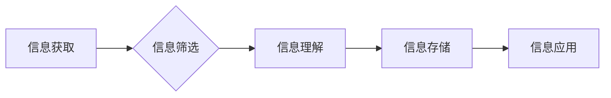

                 

## 提升知识吸收率的有效策略

> 关键词：知识吸收、学习策略、深度学习、信息检索、记忆技巧、认知科学、高效学习

### 1. 背景介绍

在当今信息爆炸的时代，知识的获取变得前所未有地容易，但与此同时，如何有效地吸收和利用这些知识却成为一个至关重要的挑战。 传统的学习方法往往难以应对海量信息和复杂知识结构，导致学习效率低下，知识难以真正内化。因此，探索提升知识吸收率的有效策略，对于个人成长和社会进步都具有重要意义。

### 2. 核心概念与联系

**2.1 知识吸收的本质**

知识吸收是一个复杂的心理过程，涉及到信息接收、理解、加工、存储和应用等多个环节。它不仅依赖于个体的认知能力，也受到学习环境、学习策略和个人动机等因素的影响。

**2.2 知识吸收的模型**

我们可以将知识吸收过程抽象为一个信息处理模型，包括以下几个关键环节：

* **信息获取:** 从各种渠道获取知识信息，例如阅读、听课、观看视频等。
* **信息筛选:** 对获取的信息进行筛选和过滤，识别出与自身目标和需求相关的关键信息。
* **信息理解:** 对筛选后的信息进行理解和解释，构建知识结构和概念网络。
* **信息存储:** 将理解后的知识信息存储在记忆中，形成长期的知识库。
* **信息应用:** 将存储的知识信息应用于实际问题解决和创造性活动中。

**2.3 提升知识吸收率的策略**

提升知识吸收率的关键在于优化每个环节的效率，并建立有效的知识连接和记忆机制。

**Mermaid 流程图**



### 3. 核心算法原理 & 具体操作步骤

**3.1 算法原理概述**

为了提升知识吸收率，我们可以借鉴一些认知科学和人工智能领域的算法原理，例如：

* **间隔重复:**  根据遗忘曲线，将知识信息以间隔的方式重复学习，可以有效地巩固记忆。
* **主动回忆:**  主动回忆知识信息，而不是被动地复习，可以促进深度理解和记忆。
* **联想记忆:**  将新知识与已有的知识进行关联，构建知识网络，可以提高知识的易懂性和记忆性。
* **空间记忆:**  利用空间位置和视觉化思维来记忆知识，可以增强记忆的持久性和准确性。

**3.2 算法步骤详解**

**3.2.1 间隔重复**

1. 学习新知识时，先进行一次完整的学习。
2. 在一段时间后（例如1天、3天、1周）重复学习，并重点回顾遗忘的部分。
3. 随着时间的推移，逐渐延长重复学习的时间间隔，直到知识点能够长期记忆。

**3.2.2 主动回忆**

1. 学习完知识点后，尝试用自己的语言描述和解释。
2. 做一些与知识点相关的练习题，例如填空题、问答题、案例分析等。
3. 与他人讨论和交流，互相提问和解答。

**3.2.3 联想记忆**

1. 学习新知识时，尝试将其与已有的知识进行关联，例如寻找相似之处、找出差异、构建对比关系等。
2. 利用思维导图、概念图等工具来构建知识网络，清晰地展示知识之间的关系。
3. 将新知识应用于实际问题解决中，加深理解和记忆。

**3.2.4 空间记忆**

1. 利用房间、地图等空间环境来记忆知识点，例如将知识点对应到特定的位置。
2. 使用视觉化思维来记忆知识点，例如绘制图像、制作动画等。
3. 通过行走、探索等方式来增强空间记忆的体验。

**3.3 算法优缺点**

* **间隔重复:** 优点：有效提高记忆持久性；缺点：需要较长时间和耐心。
* **主动回忆:** 优点：促进深度理解和记忆；缺点：需要较高的学习主动性和思考能力。
* **联想记忆:** 优点：增强知识的易懂性和记忆性；缺点：需要较强的联想能力和知识积累。
* **空间记忆:** 优点：利用视觉化思维，增强记忆的体验；缺点：需要一定的空间环境和想象力。

**3.4 算法应用领域**

这些算法原理可以应用于各种学习领域，例如：

* **语言学习:**  利用间隔重复和主动回忆来学习单词和语法。
* **编程学习:**  利用联想记忆和空间记忆来理解代码结构和逻辑。
* **科学学习:**  利用主动回忆和联想记忆来理解科学概念和原理。
* **历史学习:**  利用空间记忆和联想记忆来记忆历史事件和人物。

### 4. 数学模型和公式 & 详细讲解 & 举例说明

**4.1 数学模型构建**

我们可以用一个简单的数学模型来描述知识吸收过程中的遗忘曲线：

$$
F(t) = 1 - e^{-kt}
$$

其中：

* $F(t)$ 表示在时间 $t$ 时遗忘的知识量。
* $k$ 是遗忘率常数，代表知识遗忘的速度。
* $e$ 是自然对数的底数。

**4.2 公式推导过程**

这个公式的推导基于指数衰减模型，假设知识遗忘遵循指数规律。

**4.3 案例分析与讲解**

假设一个学生学习了100个单词，初始遗忘率为0.1，则在1天后遗忘的单词数量为：

$$
F(1) = 1 - e^{-0.1 * 1} \approx 0.095
$$

这意味着学生在1天后遗忘大约9.5个单词。

**4.4 举例说明**

根据遗忘曲线，我们可以看到，在学习初期，知识遗忘速度较快，但随着时间的推移，遗忘速度逐渐减慢。因此，间隔重复学习可以有效地减缓知识遗忘，提高知识的长期记忆。

### 5. 项目实践：代码实例和详细解释说明

**5.1 开发环境搭建**

为了实现上述算法原理，我们可以使用Python语言和一些相关的库，例如：

* **NumPy:** 用于数值计算和数组操作。
* **Pandas:** 用于数据分析和处理。
* **Scikit-learn:** 用于机器学习算法的实现。

**5.2 源代码详细实现**

```python
import numpy as np
import pandas as pd

# 定义遗忘率函数
def forget_rate(t, k):
  return 1 - np.exp(-k * t)

# 定义间隔重复学习函数
def spaced_repetition(knowledge, k, intervals):
  df = pd.DataFrame({'knowledge': knowledge, 'interval': intervals})
  df['forget_rate'] = df['interval'].apply(lambda x: forget_rate(x, k))
  return df

# 示例代码
knowledge = ['单词1', '单词2', '单词3']
k = 0.1
intervals = [1, 3, 7]
spaced_df = spaced_repetition(knowledge, k, intervals)
print(spaced_df)
```

**5.3 代码解读与分析**

这段代码实现了间隔重复学习的算法原理。

* `forget_rate` 函数计算知识遗忘率。
* `spaced_repetition` 函数根据给定的知识列表、遗忘率常数和间隔时间，生成一个包含知识、间隔时间和遗忘率的DataFrame。

**5.4 运行结果展示**

运行这段代码后，会输出一个DataFrame，其中包含每个知识点的间隔时间、遗忘率等信息。

### 6. 实际应用场景

**6.1 语言学习**

可以使用间隔重复学习算法来学习新的单词和语法规则。例如，可以使用Anki或Memrise等软件来创建间隔重复学习卡片，并根据自己的学习进度进行调整。

**6.2 编程学习**

可以使用主动回忆和联想记忆算法来学习编程语言和数据结构。例如，可以尝试用自己的语言解释代码逻辑，并将其与已有的编程知识进行关联。

**6.3 科学学习**

可以使用主动回忆和联想记忆算法来学习科学概念和原理。例如，可以尝试用自己的语言解释科学实验结果，并将其与已有的科学知识进行关联。

**6.4 未来应用展望**

随着人工智能技术的不断发展，未来将会有更多更智能的知识吸收工具和平台出现，例如：

* **个性化学习助手:** 根据用户的学习风格和目标，提供个性化的学习计划和学习资源。
* **知识图谱引擎:** 建立一个庞大的知识图谱，并利用人工智能算法帮助用户理解和导航知识网络。
* **沉浸式学习环境:** 利用虚拟现实和增强现实技术，创造一个沉浸式的学习环境，提高学习的趣味性和效率。

### 7. 工具和资源推荐

**7.1 学习资源推荐**

* **书籍:** 《高效能人士的七个习惯》、《刻意练习》、《思维导图》
* **网站:** Coursera、edX、Khan Academy
* **应用程序:** Anki、Memrise、Duolingo

**7.2 开发工具推荐**

* **编程语言:** Python、Java、C++
* **机器学习库:** Scikit-learn、TensorFlow、PyTorch
* **数据分析工具:** Pandas、NumPy、Matplotlib

**7.3 相关论文推荐**

* **遗忘曲线:** Ebbinghaus, H. (1885). Gedächtnis: Eine experimentelle Untersuchung.
* **间隔重复学习:** Cepeda, N. J., Pashler, H., Vul, E., Wixted, J. T., & Rohrer, D. (2006). Distributed practice in verbal recall tasks: A review and quantitative synthesis. Psychological Bulletin, 132(3), 354-380.
* **主动回忆:** Roediger, H. L., & Karpicke, J. D. (2006). The power of testing memory: Research and implications for educational practice. Perspectives on Psychological Science, 1(3), 171-187.

### 8. 总结：未来发展趋势与挑战

**8.1 研究成果总结**

通过对知识吸收过程的深入研究，我们已经掌握了一些有效的学习策略和算法原理，例如间隔重复、主动回忆、联想记忆等。这些策略和原理可以帮助我们提高学习效率，更好地理解和记忆知识。

**8.2 未来发展趋势**

未来，知识吸收领域的研究将更加注重个性化学习、人工智能辅助学习和沉浸式学习环境等方面。

* **个性化学习:**  根据用户的学习风格、目标和能力，提供个性化的学习计划和学习资源。
* **人工智能辅助学习:** 利用人工智能算法，自动生成学习内容、评估学习进度和提供个性化反馈。
* **沉浸式学习环境:** 利用虚拟现实和增强现实技术，创造一个沉浸式的学习环境，提高学习的趣味性和效率。

**8.3 面临的挑战**

* **数据获取和处理:**  构建个性化学习系统需要大量的用户数据，如何获取、处理和保护这些数据是一个重要的挑战。
* **算法模型的复杂性:**  人工智能辅助学习算法模型的复杂性不断提高，需要更强大的计算能力和更深入的算法研究。
* **伦理问题:**  人工智能辅助学习可能会带来一些伦理问题，例如算法偏见、数据隐私等，需要认真思考和解决。

**8.4 研究展望**

未来，我们将继续探索新的知识吸收策略和算法原理，并利用人工智能技术，构建更加智能、高效和个性化的学习系统，帮助人们更好地学习和成长。

### 9. 附录：常见问题与解答

**9.1 如何提高主动回忆的效率？**

* **制定明确的目标:**  在学习之前，明确自己想要学习的内容和目标。
* **分散注意力:**  学习时，尽量避免分心，集中注意力在学习内容上。
* **主动提问:**  在学习过程中，不断地给自己提问，并尝试用自己的语言解释知识点。
* **进行练习:**  学习完知识点后，进行一些练习题，巩固记忆。

**9.2 如何选择合适的间隔重复学习时间间隔？**

* **根据遗忘曲线:**  遗忘曲线表明，知识遗忘的速度在学习初期较快，随着时间的推移，遗忘速度逐渐减慢。因此，初始间隔时间应较短，随着时间的推移，间隔时间应逐渐延长。
* **根据个人学习情况:**  每个人的学习能力和记忆力不同，间隔时间应根据个人的实际情况进行调整。

**9.3 如何利用联想记忆来学习知识？**

* **寻找关联:**  尝试将新知识与已有的知识进行关联，例如寻找相似之处、找出差异、构建对比关系等。
* **使用思维导图:**  利用思维导图、概念图等工具来构建知识网络，清晰地展示知识之间的关系。
* **进行案例分析:**  将新知识应用于实际问题解决中，加深理解和记忆。


作者：禅与计算机程序设计艺术 / Zen and the Art of Computer Programming<end_of_turn>

