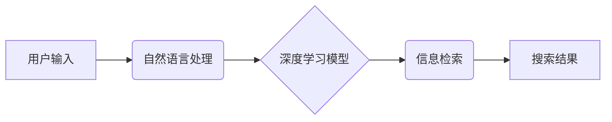

                 

## 搜索引擎的深度学习算法优化

> 关键词：深度学习、搜索引擎、自然语言处理、BERT、Transformer、信息检索、推荐系统

## 1. 背景介绍

搜索引擎是互联网时代最重要的信息获取工具之一，其核心功能是根据用户输入的查询关键词，从海量网页数据中检索出最相关、最权威的信息。传统的搜索引擎主要依赖于关键词匹配、网页链接分析等规则引擎，但随着互联网信息的爆炸式增长和用户搜索行为的复杂化，这些传统方法逐渐难以满足用户的需求。

深度学习技术的兴起为搜索引擎的算法优化带来了新的机遇。深度学习模型能够自动学习用户搜索意图、网页内容语义等复杂特征，从而提高搜索结果的准确性和相关性。近年来，深度学习在搜索引擎领域取得了显著的进展，例如 Google 的 BERT、Transformer 等模型，显著提升了搜索引擎的性能。

## 2. 核心概念与联系

**2.1 核心概念**

* **信息检索 (Information Retrieval):**  信息检索是计算机科学的一个分支，旨在帮助用户从海量信息中快速高效地找到所需的信息。
* **自然语言处理 (Natural Language Processing):** 自然语言处理是人工智能的一个分支，旨在使计算机能够理解、处理和生成人类语言。
* **深度学习 (Deep Learning):** 深度学习是一种机器学习的子领域，利用多层神经网络来学习数据中的复杂模式。

**2.2 架构关系**



**2.3 联系解释**

用户输入的查询关键词首先经过自然语言处理，将文本转换为机器可理解的格式。然后，深度学习模型对处理后的文本进行分析，学习用户搜索意图和网页内容语义。最后，信息检索算法根据深度学习模型的输出，从海量网页数据中检索出最相关的信息，并将其呈现给用户。

## 3. 核心算法原理 & 具体操作步骤

**3.1 算法原理概述**

深度学习在搜索引擎优化中主要应用于以下几个方面：

* **查询理解:**  深度学习模型可以学习用户搜索意图，识别关键词之间的关系，理解用户的潜在需求。
* **文档表示:** 深度学习模型可以学习网页内容的语义表示，捕捉网页中重要的信息和主题。
* **排序优化:** 深度学习模型可以学习用户点击行为和反馈信息，对搜索结果进行排序，提升用户体验。

**3.2 算法步骤详解**

1. **数据预处理:** 收集海量网页数据和用户搜索日志，对数据进行清洗、格式化和分词等预处理操作。
2. **模型训练:** 使用深度学习模型，例如 BERT、Transformer 等，对预处理后的数据进行训练，学习用户搜索意图、网页内容语义等特征。
3. **模型评估:** 使用测试数据对训练好的模型进行评估，评估模型的准确性和性能。
4. **模型部署:** 将训练好的模型部署到搜索引擎系统中，用于查询理解、文档表示和排序优化等任务。

**3.3 算法优缺点**

**优点:**

* 能够学习用户搜索意图和网页内容语义的复杂特征。
* 能够提升搜索结果的准确性和相关性。
* 能够适应用户搜索行为的不断变化。

**缺点:**

* 需要大量的训练数据和计算资源。
* 模型训练过程复杂，需要专业的技术人员。
* 模型解释性较差，难以理解模型的决策过程。

**3.4 算法应用领域**

* 搜索引擎结果排序
* 查询理解和意图识别
* 文档分类和主题提取
* 信息推荐和个性化服务

## 4. 数学模型和公式 & 详细讲解 & 举例说明

**4.1 数学模型构建**

深度学习模型通常采用多层神经网络结构，例如 Transformer 模型。Transformer 模型的核心是注意力机制，能够学习文本中词语之间的关系，捕捉长距离依赖关系。

**4.2 公式推导过程**

注意力机制的计算公式如下：

$$
Attention(Q, K, V) = softmax(\frac{QK^T}{\sqrt{d_k}})V
$$

其中：

* $Q$：查询矩阵
* $K$：键矩阵
* $V$：值矩阵
* $d_k$：键向量的维度
* $softmax$：softmax 函数

**4.3 案例分析与讲解**

假设我们有一个句子 "我爱吃苹果"，我们需要计算每个词语对句子的整体语义贡献。

* $Q$：查询矩阵包含每个词语的嵌入向量。
* $K$：键矩阵包含每个词语的嵌入向量。
* $V$：值矩阵包含每个词语的嵌入向量。

通过计算 $QK^T$，我们可以得到每个词语对其他词语的相似度。然后，使用 softmax 函数将相似度转换为概率分布，表示每个词语对句子的整体语义贡献。最后，将概率分布与值矩阵相乘，得到每个词语对句子的最终语义表示。

## 5. 项目实践：代码实例和详细解释说明

**5.1 开发环境搭建**

* Python 3.6+
* TensorFlow 或 PyTorch 深度学习框架
* NLTK 自然语言处理库
* 其他必要的库，例如 scikit-learn、pandas 等

**5.2 源代码详细实现**

```python
import tensorflow as tf

# 定义 Transformer 模型
class Transformer(tf.keras.Model):
    def __init__(self, vocab_size, embedding_dim, num_heads, num_layers):
        super(Transformer, self).__init__()
        self.embedding = tf.keras.layers.Embedding(vocab_size, embedding_dim)
        self.transformer_layers = tf.keras.layers.StackedRNNCells([
            tf.keras.layers.MultiHeadAttention(num_heads=num_heads, key_dim=embedding_dim)
            for _ in range(num_layers)
        ])

    def call(self, inputs):
        embedded = self.embedding(inputs)
        output = self.transformer_layers(embedded)
        return output

# 训练模型
model = Transformer(vocab_size=10000, embedding_dim=128, num_heads=8, num_layers=6)
model.compile(optimizer='adam', loss='mse')
model.fit(train_data, train_labels, epochs=10)

# 使用模型进行预测
predictions = model.predict(test_data)
```

**5.3 代码解读与分析**

* 代码定义了一个 Transformer 模型，包含嵌入层、多头注意力层和堆叠的 RNN 层。
* 模型使用 Adam 优化器和均方误差损失函数进行训练。
* 训练完成后，可以使用模型对新的数据进行预测。

**5.4 运行结果展示**

运行结果展示需要根据具体的项目和数据进行分析，例如评估模型的准确率、召回率等指标。

## 6. 实际应用场景

深度学习在搜索引擎优化中的应用场景非常广泛，例如：

* **个性化搜索:** 根据用户的搜索历史、浏览记录等信息，为用户提供个性化的搜索结果。
* **语音搜索:** 将用户语音输入转换为文本，并进行搜索。
* **图像搜索:** 根据用户上传的图像进行搜索，找到与图像内容相关的网页。
* **知识图谱搜索:** 利用知识图谱信息，为用户提供更准确、更全面的搜索结果。

**6.4 未来应用展望**

未来，深度学习在搜索引擎优化领域将继续发挥重要作用，例如：

* **多模态搜索:** 将文本、图像、语音等多种模态信息融合，提供更丰富的搜索体验。
* **实时搜索:** 利用实时数据流，提供更及时、更准确的搜索结果。
* **跨语言搜索:** 实现跨语言的搜索功能，打破语言障碍。

## 7. 工具和资源推荐

**7.1 学习资源推荐**

* **书籍:**
    * Deep Learning by Ian Goodfellow, Yoshua Bengio, and Aaron Courville
    * Natural Language Processing with Python by Steven Bird, Ewan Klein, and Edward Loper
* **在线课程:**
    * Stanford CS224N: Natural Language Processing with Deep Learning
    * DeepLearning.AI TensorFlow Specialization

**7.2 开发工具推荐**

* **TensorFlow:** https://www.tensorflow.org/
* **PyTorch:** https://pytorch.org/
* **Hugging Face Transformers:** https://huggingface.co/transformers/

**7.3 相关论文推荐**

* BERT: Pre-training of Deep Bidirectional Transformers for Language Understanding
* Attention Is All You Need
* XLNet: Generalized Autoregressive Pretraining for Language Understanding

## 8. 总结：未来发展趋势与挑战

**8.1 研究成果总结**

深度学习在搜索引擎优化领域取得了显著的进展，例如 BERT、Transformer 等模型显著提升了搜索引擎的性能。

**8.2 未来发展趋势**

未来，深度学习在搜索引擎优化领域将继续发展，例如多模态搜索、实时搜索、跨语言搜索等。

**8.3 面临的挑战**

* 数据规模和质量
* 模型训练成本
* 模型解释性和可解释性
* 伦理和公平性问题

**8.4 研究展望**

未来研究方向包括：

* 开发更强大的深度学习模型
* 探索新的深度学习算法
* 提高模型的效率和可解释性
* 解决深度学习在搜索引擎优化中的伦理和公平性问题


## 9. 附录：常见问题与解答

**9.1 如何选择合适的深度学习模型？**

选择合适的深度学习模型取决于具体的应用场景和数据特点。例如，对于文本分类任务，BERT 模型效果较好；对于机器翻译任务，Transformer 模型效果较好。

**9.2 如何评估深度学习模型的性能？**

常用的评估指标包括准确率、召回率、F1-score 等。

**9.3 如何解决深度学习模型的过拟合问题？**

常用的方法包括正则化、数据增强、Dropout 等。


作者：禅与计算机程序设计艺术 / Zen and the Art of Computer Programming 
<end_of_turn>

