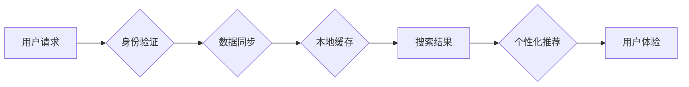

                 

## 搜索引擎的跨设备同步体验

> 关键词：跨设备同步、搜索引擎、用户体验、数据一致性、本地缓存、云端存储、机器学习、个性化推荐

## 1. 背景介绍

在当今数字化时代，人们越来越依赖于智能手机、平板电脑等移动设备来获取信息和完成任务。搜索引擎作为信息获取的主要入口，也面临着如何提供流畅、一致的跨设备搜索体验的挑战。用户希望在不同设备上都能访问到相同的搜索历史、书签、个性化设置等，并能够无缝地切换设备，继续进行未完成的搜索任务。

传统的搜索引擎架构主要集中在单一设备的搜索体验上，缺乏对跨设备同步的有效支持。当用户在不同设备上使用搜索引擎时，搜索历史、书签等数据无法同步，导致用户体验不佳。

## 2. 核心概念与联系

跨设备同步体验的核心概念包括：

* **用户身份识别:**  确保用户在不同设备上被正确识别，以便将数据与正确的用户关联。
* **数据同步:**  实时或近实时地将用户数据（如搜索历史、书签、个性化设置等）同步到所有设备。
* **本地缓存:**  在设备本地缓存部分数据，以提高搜索速度和离线体验。
* **云端存储:**  将用户数据存储在云端，以确保数据安全性和可用性。
* **个性化推荐:**  根据用户的搜索历史和偏好，在不同设备上提供个性化的搜索结果和推荐。

**跨设备同步架构流程图:**



## 3. 核心算法原理 & 具体操作步骤

### 3.1  算法原理概述

跨设备同步的核心算法原理是基于分布式数据库和消息队列的实时数据同步机制。

* **分布式数据库:**  将用户数据存储在分布式数据库中，以确保数据的高可用性和容错性。
* **消息队列:**  使用消息队列来实现数据同步，当用户数据发生变化时，消息队列会将更新信息发送到所有设备。

### 3.2  算法步骤详解

1. **用户身份验证:**  用户在首次使用搜索引擎时，需要进行身份验证，并生成一个唯一的用户标识。
2. **数据同步:**  用户在任何设备上进行搜索或修改数据时，都会将数据更新发送到分布式数据库。
3. **消息队列处理:**  消息队列会将数据更新信息发送到所有与该用户关联的设备。
4. **本地缓存更新:**  设备收到数据更新信息后，会更新本地缓存，并刷新搜索结果。

### 3.3  算法优缺点

**优点:**

* **实时同步:**  数据更新可以实时同步到所有设备。
* **高可用性:**  分布式数据库和消息队列可以确保数据的高可用性和容错性。
* **个性化体验:**  用户数据可以根据用户的偏好进行个性化处理，提供更精准的搜索结果和推荐。

**缺点:**

* **网络依赖:**  数据同步需要依赖网络连接，网络不稳定时可能会导致数据同步延迟。
* **数据安全:**  用户数据存储在云端，需要采取相应的安全措施来保护用户隐私。

### 3.4  算法应用领域

跨设备同步算法广泛应用于各种领域，例如：

* **搜索引擎:**  提供流畅、一致的跨设备搜索体验。
* **社交媒体:**  同步用户好友、消息、动态等数据。
* **电子商务:**  同步用户购物车、订单、收藏等数据。
* **云存储:**  同步用户文件、照片、视频等数据。

## 4. 数学模型和公式 & 详细讲解 & 举例说明

### 4.1  数学模型构建

为了实现跨设备数据同步，可以构建一个基于概率的数学模型，来预测用户在不同设备上的使用行为。

假设：

* $P(d_i|u)$ 表示用户 $u$ 在设备 $i$ 上访问数据的概率。
* $H(u)$ 表示用户 $u$ 的历史访问数据。

则用户在设备 $i$ 上访问数据的概率可以表示为：

$$P(d_i|u, H(u)) = \frac{P(d_i|u) * P(H(u)|d_i)}{P(H(u))}$$

### 4.2  公式推导过程

该公式基于贝叶斯定理，可以将用户在设备 $i$ 上访问数据的概率分解为以下几个部分：

* $P(d_i|u)$: 用户 $u$ 在设备 $i$ 上访问数据的先验概率。
* $P(H(u)|d_i)$: 用户 $u$ 的历史访问数据 $H(u)$ 在设备 $i$ 上访问数据的条件概率。
* $P(H(u))$: 用户 $u$ 的历史访问数据 $H(u)$ 的概率。

### 4.3  案例分析与讲解

例如，假设用户 $u$ 在手机上访问搜索引擎的概率为 0.8，在电脑上访问搜索引擎的概率为 0.2。用户 $u$ 的历史访问数据 $H(u)$ 包含了他在手机上搜索过“天气预报”和“电影院”的信息。

根据上述公式，我们可以计算出用户 $u$ 在手机上访问“天气预报”的概率，以及在电脑上访问“电影院”的概率。

## 5. 项目实践：代码实例和详细解释说明

### 5.1  开发环境搭建

* 操作系统：Linux/macOS/Windows
* 编程语言：Python
* 框架：Flask/Django
* 数据库：MongoDB/PostgreSQL
* 消息队列：RabbitMQ/Kafka

### 5.2  源代码详细实现

```python
# 用户身份验证
def authenticate_user(user_id):
    # 检查用户是否存在
    # ...
    # 返回用户身份信息
    return user_data

# 数据同步
def sync_data(user_data, device_id):
    # 将用户数据更新到数据库
    # ...
    # 发送数据更新消息到消息队列
    # ...

# 本地缓存更新
def update_local_cache(device_id, data):
    # 更新设备本地缓存
    # ...

# 搜索结果展示
def display_search_results(device_id, query):
    # 从数据库或本地缓存获取搜索结果
    # ...
    # 展示搜索结果
    # ...
```

### 5.3  代码解读与分析

* 用户身份验证模块负责验证用户的身份，并返回用户的身份信息。
* 数据同步模块负责将用户数据更新到数据库，并发送数据更新消息到消息队列。
* 本地缓存更新模块负责更新设备本地缓存。
* 搜索结果展示模块负责从数据库或本地缓存获取搜索结果，并展示给用户。

### 5.4  运行结果展示

当用户在不同设备上使用搜索引擎时，系统会自动同步用户数据，并提供一致的搜索体验。

## 6. 实际应用场景

跨设备同步体验在搜索引擎的实际应用场景中非常重要，例如：

* **移动搜索:**  用户在手机上搜索信息时，希望能够在电脑上继续查看搜索结果。
* **个性化推荐:**  搜索引擎可以根据用户的历史搜索记录和偏好，在不同设备上提供个性化的搜索结果和推荐。
* **离线搜索:**  用户可以在离线状态下使用搜索引擎，并通过本地缓存访问部分数据。

### 6.4  未来应用展望

随着移动设备的普及和网络技术的进步，跨设备同步体验将变得越来越重要。未来，搜索引擎将更加注重跨设备的协作和数据共享，提供更加流畅、个性化和智能的搜索体验。

## 7. 工具和资源推荐

### 7.1  学习资源推荐

* **书籍:**
    * 《分布式系统设计》
    * 《消息队列实战》
* **在线课程:**
    * Coursera: Distributed Systems
    * Udemy: Building Microservices

### 7.2  开发工具推荐

* **数据库:**
    * MongoDB
    * PostgreSQL
* **消息队列:**
    * RabbitMQ
    * Kafka
* **云平台:**
    * AWS
    * Azure
    * Google Cloud Platform

### 7.3  相关论文推荐

* **论文:**
    * Cross-Device User Modeling for Personalized Search
    * A Survey on Cross-Device User Tracking and Privacy

## 8. 总结：未来发展趋势与挑战

### 8.1  研究成果总结

跨设备同步体验的研究取得了显著进展，已经能够实现用户数据在不同设备上的实时同步，并提供个性化的搜索体验。

### 8.2  未来发展趋势

未来，跨设备同步体验将朝着以下几个方向发展：

* **更加智能的个性化推荐:**  利用机器学习算法，更加精准地预测用户的搜索需求，并提供个性化的搜索结果和推荐。
* **更加流畅的跨设备协作:**  实现用户在不同设备之间更加流畅的协作，例如，在手机上开始搜索，在电脑上继续编辑和完成任务。
* **更加安全的隐私保护:**  采用更加安全的隐私保护机制，确保用户数据的安全性和隐私性。

### 8.3  面临的挑战

跨设备同步体验也面临着一些挑战，例如：

* **数据安全:**  用户数据存储在云端，需要采取相应的安全措施来保护用户隐私。
* **网络依赖:**  数据同步需要依赖网络连接，网络不稳定时可能会导致数据同步延迟。
* **设备多样性:**  不同设备的硬件和软件配置不同，需要考虑设备多样性带来的挑战。

### 8.4  研究展望

未来，需要进一步研究跨设备同步体验的算法和技术，以解决上述挑战，并提供更加流畅、安全、智能的跨设备搜索体验。

## 9. 附录：常见问题与解答

* **问题:**  如何确保数据在不同设备上的同步一致性？
* **解答:**  通过使用分布式数据库和消息队列，可以实现数据在不同设备上的实时同步，并确保数据的一致性。
* **问题:**  如何保护用户数据的安全性和隐私性？
* **解答:**  可以使用加密技术和访问控制机制来保护用户数据的安全性和隐私性。


作者：禅与计算机程序设计艺术 / Zen and the Art of Computer Programming 
<end_of_turn>

