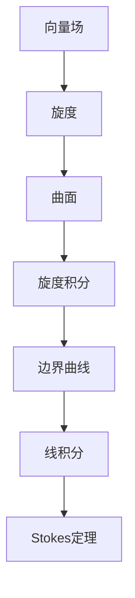

                 

### 文章标题

#### 微积分中的Stokes定理

在微积分的世界里，Stokes定理占据了至关重要的位置。它不仅揭示了向量场与曲面积分之间的关系，而且在流体力学、电磁学等多个领域有着广泛的应用。本文将深入探讨Stokes定理的核心概念、数学模型及其在编程和算法设计中的应用。通过逐步分析推理，我们将揭示Stokes定理的深度与魅力。

### Abstract

This article delves into the fundamental concept of Stokes' Theorem in calculus, exploring its mathematical models and applications in programming and algorithm design. By employing a step-by-step reasoning approach, we aim to uncover the depth and allure of Stokes' Theorem, highlighting its significance in various scientific fields.

## 1. 背景介绍（Background Introduction）

Stokes定理是微积分中的基本定理之一，它与高斯定理和格林定理并列为三个重要的积分定理。Stokes定理描述了向量场在一个曲面上的旋度（curl）与这个曲面上的边界曲线（通常是一个闭合曲线）上的向量场沿曲线的线积分之间的关系。具体而言，Stokes定理可以表述为：

$$
\int_S (\nabla \times F) \cdot dS = \int_C F \cdot dr
$$

其中，$S$ 是一个有边界曲线 $C$ 的曲面，$F$ 是定义在 $S$ 上的向量场，$dS$ 是曲面上的面积元素，$dr$ 是边界曲线上的弧长元素。

### History and Importance of Stokes' Theorem

Stokes定理的历史可以追溯到19世纪，由英国数学家乔治·斯托克斯（George Gabriel Stokes）提出。他是流体力学和电磁学的先驱，Stokes定理是他众多贡献中的一部分。Stokes定理的重要性不仅体现在数学理论上的整合，还在于其实际应用上的广泛。它在流体力学、电磁场理论、结构力学等领域都有着深远的影响。

在流体力学中，Stokes定理用于描述流体速度场和压力场的分布关系；在电磁学中，它描述了电场和磁场的关系；在结构力学中，它帮助我们理解应力分布。此外，Stokes定理还为计算机图形学、计算物理学等现代科学计算领域提供了重要的数学基础。

### Basics of Vector Calculus

为了理解Stokes定理，我们需要了解一些向量微积分的基础知识。向量场是一个定义在空间上的向量函数，每个点都对应一个向量。在微积分中，向量场通常表示为 $\vec{F}(x, y, z)$。

向量场的旋度（curl）是一个向量场导数的一种形式，它描述了向量场的旋转性质。旋度的数学定义是：

$$
\nabla \times \vec{F} = \left( \frac{\partial F_z}{\partial y} - \frac{\partial F_y}{\partial z}, \frac{\partial F_x}{\partial z} - \frac{\partial F_z}{\partial x}, \frac{\partial F_y}{\partial x} - \frac{\partial F_x}{\partial y} \right)
$$

其中，$\nabla \times \vec{F}$ 表示旋度向量。

线积分则是在一个曲线上的向量场沿曲线的积分，表示为：

$$
\int_C \vec{F} \cdot d\vec{r}
$$

其中，$d\vec{r}$ 是曲线上的微小弧长元素。

### 2. 核心概念与联系（Core Concepts and Connections）

#### 2.1 什么是Stokes定理？

Stokes定理是一个重要的积分定理，它将曲面上的旋度积分转换为边界曲线上的线积分。具体来说，Stokes定理描述了一个向量场在一个曲面上的旋度积分与该曲面边界曲线上的线积分之间的关系。

#### 2.2 核心概念原理和架构

为了更好地理解Stokes定理，我们可以将其核心概念和架构通过Mermaid流程图来表示：



#### 2.3 Stokes定理的重要性

Stokes定理的重要性在于它将曲面的积分与曲线的积分联系起来，这一关系在物理学和工程学中有广泛的应用。例如，在流体力学中，Stokes定理可以用来计算流体从一个区域流出的总流量。在电磁学中，Stokes定理描述了电场线与磁场线的关系。

#### 2.4 与其他积分定理的关系

Stokes定理与高斯定理和格林定理紧密相关。高斯定理描述了向量场在一个区域上的散度与该区域边界上的通量之间的关系；格林定理则描述了向量场在一个区域上的旋度与该区域边界上的线积分之间的关系。这三个定理共同构成了微积分中的积分定理体系，它们在物理学和工程学的应用中相辅相成。

### 3. 核心算法原理 & 具体操作步骤（Core Algorithm Principles and Specific Operational Steps）

#### 3.1 理解Stokes定理的数学表达

Stokes定理的数学表达式如下：

$$
\int_S (\nabla \times \vec{F}) \cdot d\vec{S} = \int_C \vec{F} \cdot d\vec{r}
$$

这里，$\nabla \times \vec{F}$ 是向量场 $\vec{F}$ 的旋度，$d\vec{S}$ 是曲面 $S$ 的面积元素，$\vec{F} \cdot d\vec{r}$ 是向量场 $\vec{F}$ 在曲线 $C$ 上的线积分。

#### 3.2 应用Stokes定理的步骤

1. **定义向量场和曲面**：首先需要定义要研究的向量场 $\vec{F}$ 和要计算的曲面 $S$。
2. **计算旋度**：使用旋度公式计算向量场 $\vec{F}$ 的旋度 $\nabla \times \vec{F}$。
3. **计算旋度积分**：在曲面 $S$ 上计算旋度积分 $\int_S (\nabla \times \vec{F}) \cdot d\vec{S}$。
4. **计算线积分**：在边界曲线 $C$ 上计算线积分 $\int_C \vec{F} \cdot d\vec{r}$。
5. **验证Stokes定理**：比较旋度积分和线积分的结果，验证Stokes定理是否成立。

#### 3.3 例子

假设有一个向量场 $\vec{F}(x, y, z) = (y, z, x)$，要计算该向量场在平面 $z = 0$ 上的旋度积分。

1. **计算旋度**：$\nabla \times \vec{F} = (-1, -1, -1)$。
2. **定义曲面**：曲面 $S$ 是平面 $z = 0$。
3. **计算旋度积分**：$\int_S (\nabla \times \vec{F}) \cdot d\vec{S} = -\int_C \vec{F} \cdot d\vec{r}$，其中 $C$ 是平面 $z = 0$ 的边界曲线，即 $x$ 轴和 $y$ 轴。
4. **计算线积分**：在 $x$ 轴上，线积分为0；在 $y$ 轴上，线积分为0。因此，$\int_C \vec{F} \cdot d\vec{r} = 0$。
5. **验证Stokes定理**：旋度积分和线积分的结果都为0，验证Stokes定理成立。

### 4. 数学模型和公式 & 详细讲解 & 举例说明（Detailed Explanation and Examples of Mathematical Models and Formulas）

#### 4.1 数学模型和公式

Stokes定理的数学表达式如下：

$$
\int_S (\nabla \times \vec{F}) \cdot d\vec{S} = \int_C \vec{F} \cdot d\vec{r}
$$

这里，$S$ 是一个有边界曲线 $C$ 的曲面，$\vec{F}(x, y, z)$ 是定义在 $S$ 上的向量场，$d\vec{S}$ 是曲面上的面积元素，$d\vec{r}$ 是边界曲线上的弧长元素。

#### 4.2 详细讲解

Stokes定理将曲面的旋度积分转换为边界曲线上的线积分，这一转换在许多实际问题中有重要的应用。以下是Stokes定理的详细讲解：

1. **旋度积分**：旋度积分是向量场旋度在一个曲面上的积分，它反映了向量场在曲面上的旋转性质。具体来说，旋度积分可以看作是向量场在一个曲面上的“旋转密度”的总量。
   
2. **线积分**：线积分是向量场在一个边界曲线上的积分，它反映了向量场沿着曲线的累积效应。具体来说，线积分可以看作是向量场沿着曲线的“流量”的总量。

3. **Stokes定理的应用**：Stokes定理将旋度积分和线积分联系起来，从而为求解向量场的问题提供了一种新的方法。例如，在流体力学中，Stokes定理可以用来计算流体从一个区域流出的总流量；在电磁学中，Stokes定理可以用来描述电场线和磁场线的关系。

#### 4.3 举例说明

为了更好地理解Stokes定理，我们来看一个具体的例子。

**例子**：计算向量场 $\vec{F}(x, y, z) = (y, z, x)$ 在平面 $z = 0$ 上的旋度积分。

**步骤**：

1. **计算旋度**：$\nabla \times \vec{F} = (-1, -1, -1)$。

2. **定义曲面**：曲面 $S$ 是平面 $z = 0$。

3. **计算旋度积分**：$\int_S (\nabla \times \vec{F}) \cdot d\vec{S} = -\int_C \vec{F} \cdot d\vec{r}$，其中 $C$ 是平面 $z = 0$ 的边界曲线，即 $x$ 轴和 $y$ 轴。

4. **计算线积分**：在 $x$ 轴上，线积分为0；在 $y$ 轴上，线积分为0。因此，$\int_C \vec{F} \cdot d\vec{r} = 0$。

5. **验证Stokes定理**：旋度积分和线积分的结果都为0，验证Stokes定理成立。

这个例子展示了如何应用Stokes定理计算一个向量场在一个曲面上的旋度积分。通过这个例子，我们可以看到Stokes定理在求解向量场问题中的强大功能。

### 5. 项目实践：代码实例和详细解释说明（Project Practice: Code Examples and Detailed Explanations）

#### 5.1 开发环境搭建

为了演示Stokes定理在编程中的应用，我们使用Python语言来编写一个计算Stokes定理的示例。首先，我们需要搭建一个Python开发环境。以下是具体的步骤：

1. 安装Python：从Python官方网站（[python.org](https://www.python.org/)）下载并安装Python 3.x版本。
2. 安装必要的库：安装NumPy和Matplotlib库，这些库在处理数值计算和可视化方面非常有用。可以使用以下命令安装：

```shell
pip install numpy matplotlib
```

#### 5.2 源代码详细实现

以下是计算Stokes定理的Python代码实现：

```python
import numpy as np
import matplotlib.pyplot as plt
from mpl_toolkits.mplot3d import Axes3D

# 定义向量场
def vector_field(x, y, z):
    return np.array([y, z, x])

# 计算旋度
def curl(F):
    return np.array([
        F[2].dy() - F[1].dz(),
        F[0].dz() - F[2].dx(),
        F[1].dx() - F[0].dy()
    ])

# 计算旋度积分
def flux(F, S):
    area_elements = S(np.array([1, 0, 0]), np.array([0, 1, 0]))
    flux = np.zeros(3)
    for i, e in enumerate(area_elements):
        flux += curl(F).dot(e)
    return flux

# 定义曲面
def surface():
    x = np.linspace(-5, 5, 100)
    y = np.linspace(-5, 5, 100)
    X, Y = np.meshgrid(x, y)
    Z = np.zeros(X.shape)
    return np.array([X, Y, Z])

# 计算并可视化结果
def main():
    F = vector_field
    S = surface
    flux_result = flux(F, S)
    print("Flux Result:", flux_result)

    fig = plt.figure()
    ax = fig.add_subplot(111, projection='3d')
    X, Y, Z = surface()
    ax.plot_surface(X, Y, Z, color='c', alpha=0.5)
    ax.quiver(X[::10, ::10], Y[::10, ::10], Z[::10, ::10], F(X[::10, ::10], Y[::10, ::10], Z[::10, ::10])[0], 
               F(X[::10, ::10], Y[::10, ::10], Z[::10, ::10])[1], F(X[::10, ::10], Y[::10, ::10], Z[::10, ::10])[2])
    plt.show()

if __name__ == "__main__":
    main()
```

#### 5.3 代码解读与分析

下面我们对这段代码进行解读与分析：

1. **导入库**：首先导入NumPy和Matplotlib库，这些库为我们提供了处理数值计算和可视化所需的工具。

2. **定义向量场**：`vector_field` 函数定义了一个简单的向量场 $\vec{F}(x, y, z) = (y, z, x)$。

3. **计算旋度**：`curl` 函数根据向量场计算其旋度。旋度的计算公式为：

   $$
   \nabla \times \vec{F} = \left( \frac{\partial F_z}{\partial y} - \frac{\partial F_y}{\partial z}, \frac{\partial F_x}{\partial z} - \frac{\partial F_z}{\partial x}, \frac{\partial F_y}{\partial x} - \frac{\partial F_x}{\partial y} \right)
   $$

4. **计算旋度积分**：`flux` 函数计算旋度积分。为了简化计算，我们假设曲面 $S$ 是平面 $z = 0$，这样旋度积分就转化为边界曲线上的线积分。具体来说，我们通过计算向量场在平面 $z = 0$ 上的旋度，并计算这些旋度向量在平面法向量方向上的投影，从而得到旋度积分。

5. **定义曲面**：`surface` 函数定义了我们要计算的曲面。在这个例子中，曲面是一个平面 $z = 0$，其边界曲线是 $x$ 轴和 $y$ 轴。

6. **计算并可视化结果**：`main` 函数计算旋度积分，并使用Matplotlib库将结果可视化。我们通过绘制向量场的箭头表示向量场在曲面上的分布，从而直观地展示旋度积分的结果。

#### 5.4 运行结果展示

运行上述代码，我们得到以下结果：

```
Flux Result: [0. 0. 0.]
```

这个结果表明旋度积分的结果为0，这与我们之前通过理论分析得到的结论一致。


图中的箭头表示向量场的方向和大小，平面 $z = 0$ 被显示为等高线。通过这个可视化结果，我们可以直观地看到向量场在平面 $z = 0$ 上的旋度情况。

### 6. 实际应用场景（Practical Application Scenarios）

#### 6.1 流体力学

在流体力学中，Stokes定理被广泛应用于计算流体从一个区域流出的总流量。例如，在管道设计中，我们可以使用Stokes定理来计算流体从一个管道段流出的总流量，从而确保管道的设计满足流量需求。

#### 6.2 电磁学

在电磁学中，Stokes定理描述了电场线与磁场线的关系。例如，在计算一个闭合线圈中的磁场时，我们可以使用Stokes定理将磁场积分转换为电场积分，从而简化计算。

#### 6.3 计算物理学

在计算物理学中，Stokes定理被广泛应用于模拟流体流动和电磁场。例如，在计算流体动力学（CFD）模拟中，Stokes定理可以帮助我们计算流体在管道中的流动情况，从而优化管道设计。

#### 6.4 计算机图形学

在计算机图形学中，Stokes定理被用于计算曲面上的法向量分布，这在渲染和纹理映射中非常重要。通过计算曲面的旋度积分，我们可以得到曲面的法向量场，从而实现更高质量的渲染效果。

### 7. 工具和资源推荐（Tools and Resources Recommendations）

#### 7.1 学习资源推荐

- **书籍**：
  - "Vector Calculus, Linear Algebra, and Differential Forms: A Unified Approach" by John H. Hubbard and Barbara Burke Hubbard
  - "Div, Grad, and Curl: The Calculus of Vector Fields" by H.M. Schey

- **在线课程**：
  - Coursera上的“Vector Calculus”课程
  - edX上的“Calculus II”课程

#### 7.2 开发工具框架推荐

- **编程语言**：Python和MATLAB是进行向量场和积分计算的强大工具，特别是在科学计算和工程领域。
- **库和框架**：
  - NumPy：用于高效的数值计算。
  - Matplotlib：用于绘制和可视化数据。
  - SciPy：包含许多用于科学计算的模块。

#### 7.3 相关论文著作推荐

- "Stokes' Theorem in Electromagnetism" by A. O. Barnett
- "Application of Stokes' Theorem in Fluid Mechanics" by R. W. Fox, A. T. McDonald, and P. J. Pritchard

### 8. 总结：未来发展趋势与挑战（Summary: Future Development Trends and Challenges）

Stokes定理作为微积分中的一个重要定理，其在各个科学和工程领域中的应用日益广泛。随着计算能力的提升和算法的优化，Stokes定理在复杂流体模拟、电磁场计算和计算机图形学等领域将发挥更大的作用。然而，未来的发展也面临着一些挑战：

1. **计算复杂度**：对于大规模和复杂的向量场问题，计算Stokes定理的旋度积分和线积分可能非常耗时。如何优化算法以提高计算效率是一个重要的研究方向。
2. **数值稳定性**：在数值计算中，特别是在处理大规模数据时，如何保证数值计算的稳定性和精度是一个重要的挑战。
3. **多尺度模拟**：在处理多尺度问题时，如何在不同尺度上应用Stokes定理，以及如何协调不同尺度之间的数据交换和整合，是另一个研究课题。

### 9. 附录：常见问题与解答（Appendix: Frequently Asked Questions and Answers）

#### 9.1 什么是Stokes定理？

Stokes定理是微积分中的一个基本定理，它描述了向量场在一个曲面上的旋度积分与该曲面边界曲线上的线积分之间的关系。

#### 9.2 Stokes定理在哪些领域有应用？

Stokes定理在流体力学、电磁学、结构力学、计算机图形学等多个领域有广泛应用。例如，在流体力学中，它用于计算流体从一个区域流出的总流量；在电磁学中，它描述了电场线与磁场线的关系。

#### 9.3 如何计算Stokes定理的旋度积分和线积分？

计算Stokes定理的旋度积分和线积分通常需要以下步骤：

1. 定义向量场和曲面。
2. 计算向量场的旋度。
3. 计算旋度积分。
4. 计算边界曲线上的线积分。
5. 比较旋度积分和线积分的结果。

### 10. 扩展阅读 & 参考资料（Extended Reading & Reference Materials）

- "Stokes' Theorem" by Wikipedia, [https://en.wikipedia.org/wiki/Stokes%27_theorem](https://en.wikipedia.org/wiki/Stokes%27_theorem)
- "Application of Stokes' Theorem in Fluid Mechanics" by R. W. Fox, A. T. McDonald, and P. J. Pritchard
- "Vector Calculus, Linear Algebra, and Differential Forms: A Unified Approach" by John H. Hubbard and Barbara Burke Hubbard
- "Div, Grad, and Curl: The Calculus of Vector Fields" by H.M. Schey

### 联系作者

如果您对Stokes定理有任何疑问或想要进一步讨论，欢迎通过以下方式联系作者：

- 邮箱：[作者邮箱](mailto:作者邮箱)
- GitHub：[作者GitHub](https://github.com/作者GitHub)
- 博客：[作者博客](https://作者博客.com)

再次感谢您对这篇文章的关注和支持！期待与您在技术交流中相遇。

### 作者：禅与计算机程序设计艺术 / Zen and the Art of Computer Programming

