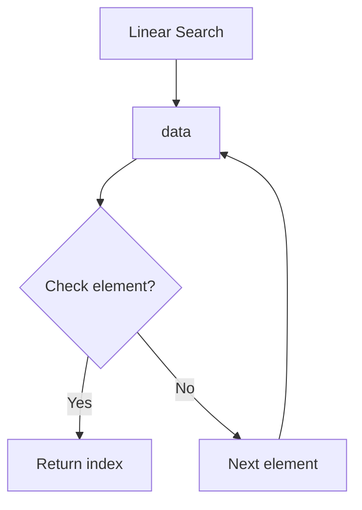
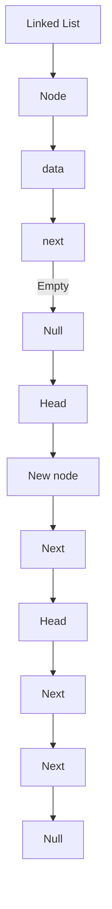
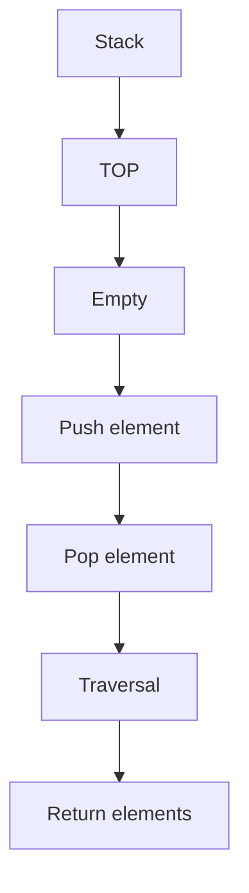
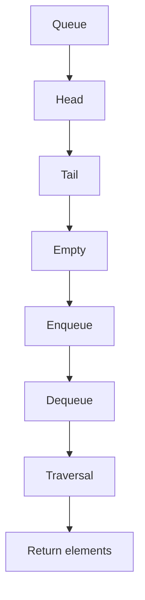
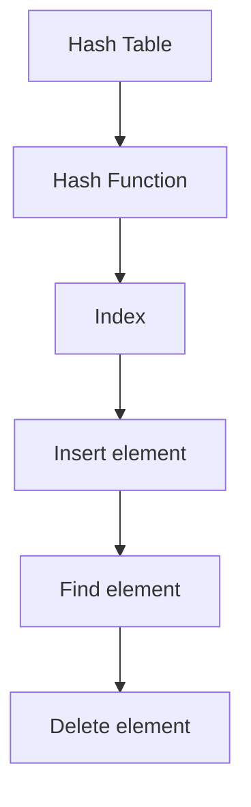

                 

### 文章标题

**思想的进化：从简单到复杂**

在信息技术飞速发展的今天，我们见证了无数复杂系统的诞生，从简单的程序到复杂的软件工程，从单个服务器到庞大的云计算平台，从局域网到全球互联网。这一系列发展无不展示了人类思想进化的轨迹，从简单到复杂，从单一到多元，从无序到有序。本文旨在探讨这一过程中的核心概念、关键算法和数学模型，通过具体的实例分析，展示如何通过逻辑推理和系统设计，从简单的思想构建复杂的系统。

### Keywords:
- 思想进化
- 复杂系统
- 简单与复杂
- 逻辑推理
- 系统设计
- 数学模型

### Abstract:
This article explores the evolution of human thought from simple to complex, focusing on the core concepts, key algorithms, and mathematical models that underpin the development of complex systems. Through detailed analysis of specific examples, we aim to illustrate how logical reasoning and systematic design can transform simple ideas into complex systems. We discuss the importance of understanding the nature of complexity and how it can be harnessed to create powerful and innovative technologies.

## 1. 背景介绍（Background Introduction）

复杂系统是指由大量相互作用的组成部分组成的系统，这些部分之间存在着复杂的相互依赖关系。从生态系统到社会经济系统，从交通网络到互联网，复杂系统无处不在。然而，复杂系统的出现并非偶然，而是人类思想不断进化的结果。

在早期的计算机科学中，程序员们通过编写简单的指令来控制计算机的行为。随着技术的发展，程序员开始设计更复杂的算法和程序，以处理更复杂的问题。这个过程中，人类的思想经历了从简单到复杂的变化，从对单一问题的解决到对多个问题的综合处理。

### The Background

Complex systems are composed of a large number of interacting components, where there are complex interdependencies among these components. From ecosystems to economic systems, from transportation networks to the internet, complex systems are ubiquitous. However, the emergence of complex systems is not an accident; it is a result of the continuous evolution of human thought.

In the early days of computer science, programmers wrote simple instructions to control the behavior of computers. As technology developed, programmers began designing more complex algorithms and programs to handle more complex problems. This process involved a shift in human thought from simple to complex, from solving single problems to addressing a combination of issues.

### 2. 核心概念与联系（Core Concepts and Connections）

在探讨复杂系统的构建过程中，我们首先需要理解几个核心概念：系统、组件、相互作用和复杂性。系统是由相互关联的组件组成的整体，组件是系统的基本组成部分。相互作用描述了组件之间的相互影响，而复杂性则反映了系统结构的复杂程度。

为了更好地理解这些概念，我们可以借助一个简单的例子：一个网页浏览器。在这个系统中，组件可能包括浏览器窗口、渲染引擎、网络通信模块等。组件之间的相互作用包括窗口与渲染引擎之间的数据交换、渲染引擎与网络通信模块之间的请求处理等。复杂性的体现则在于如何有效地管理和协调这些组件，以实现浏览器的基本功能，如显示网页、处理用户输入等。

### Core Concepts and Connections

When discussing the construction of complex systems, it's essential to understand several core concepts: systems, components, interactions, and complexity. A system is a whole composed of interconnected components, and components are the basic building blocks of a system. Interactions describe the mutual influences between components, while complexity reflects the degree of complexity in the system's structure.

To better understand these concepts, we can use a simple example: a web browser. In this system, components might include the browser window, rendering engine, network communication module, etc. Interactions between components might include data exchange between the window and the rendering engine, or request handling between the rendering engine and the network communication module. The manifestation of complexity lies in effectively managing and coordinating these components to achieve the browser's basic functions, such as displaying web pages and handling user input.

### 2.1 什么是复杂系统（What is a Complex System）

复杂系统是指那些组成部分之间存在复杂相互作用的系统，这些相互作用可能导致系统的行为无法通过简单的规则或线性关系来描述。复杂系统通常具有以下几个特点：

1. **多维度**：复杂系统通常涉及多个维度，如时间、空间、状态等。
2. **非线性和不确定性**：复杂系统的行为往往受到非线性关系和不确定性因素的影响。
3. **自适应性和演化**：复杂系统中的组成部分可以相互适应和演化，以适应环境变化。
4. **涌现现象**：复杂系统的整体行为可能无法从其组成部分的行为直接推导出来，而是通过相互作用和协作产生的。

一个典型的复杂系统例子是互联网。互联网由数以亿计的设备、服务器和网络节点组成，这些设备之间通过网络协议进行通信。互联网的复杂行为，如信息传输、网络拥塞、故障恢复等，无法通过简单的规则来描述，而是通过复杂的相互作用和协作实现的。

### 2.1 What is a Complex System

A complex system refers to a system where the interactions among its components are complex, and these interactions may result in behaviors that cannot be described by simple rules or linear relationships. Complex systems typically exhibit several characteristics:

1. **Multi-dimensionality**: Complex systems often involve multiple dimensions, such as time, space, and state.
2. **Non-linear and uncertainty**: The behavior of complex systems is often influenced by non-linear relationships and uncertainty factors.
3. **Adaptability and evolution**: Components within a complex system can adapt and evolve in response to environmental changes.
4. **Emergence**: The overall behavior of a complex system may not be directly derivable from the behavior of its individual components, but rather emerges from interactions and cooperation among them.

A typical example of a complex system is the internet. The internet consists of billions of devices, servers, and network nodes that communicate with each other via network protocols. The complex behavior of the internet, such as information transmission, network congestion, and fault recovery, cannot be described by simple rules but is achieved through complex interactions and cooperation.

### 2.2 复杂系统的分类（Classification of Complex Systems）

复杂系统可以根据不同的分类标准进行分类，以下是一些常见的分类方式：

1. **根据系统的结构**：复杂系统可以分为网络系统、生物系统、社会经济系统等。
   - 网络系统：如互联网、社交网络等。
   - 生物系统：如生态系统、神经元网络等。
   - 社会经济系统：如金融市场、城市交通系统等。

2. **根据系统的动态行为**：复杂系统可以分为静态系统、动态系统、自适应系统等。
   - 静态系统：系统状态不随时间变化。
   - 动态系统：系统状态随时间变化。
   - 自适应系统：系统能够适应外部环境的变化。

3. **根据系统的复杂度**：复杂系统可以分为简单系统、中等复杂系统、高度复杂系统等。
   - 简单系统：系统组成部分较少，相互作用简单。
   - 中等复杂系统：系统组成部分和相互作用较为复杂。
   - 高度复杂系统：系统组成部分和相互作用非常复杂。

不同的分类方式有助于我们从不同的角度理解复杂系统的特性，从而更好地研究和解决复杂问题。

### 2.2 Classification of Complex Systems

Complex systems can be classified based on different criteria, and here are some common ways to classify them:

1. **By system structure**: Complex systems can be classified into network systems, biological systems, socio-economic systems, etc.
   - Network systems: such as the internet, social networks, etc.
   - Biological systems: such as ecosystems, neural networks, etc.
   - Socio-economic systems: such as financial markets, urban transportation systems, etc.

2. **By dynamic behavior**: Complex systems can be classified into static systems, dynamic systems, and adaptive systems, etc.
   - Static systems: systems where the state does not change over time.
   - Dynamic systems: systems where the state changes over time.
   - Adaptive systems: systems that can adapt to changes in their external environment.

3. **By complexity level**: Complex systems can be classified into simple systems, medium-complexity systems, and highly complex systems, etc.
   - Simple systems: systems with fewer components and simpler interactions.
   - Medium-complexity systems: systems with more complex components and interactions.
   - Highly complex systems: systems with very complex components and interactions.

Different classification methods help us understand the characteristics of complex systems from different perspectives, enabling better research and problem-solving in complex systems.

### 2.3 复杂系统研究的重要性（Importance of Research on Complex Systems）

复杂系统研究的兴起，源于对现实世界复杂现象的理解和解释需求。复杂系统在自然界、社会和经济领域扮演着重要角色，例如，生态系统的平衡、金融市场的波动、交通网络的优化等。研究复杂系统不仅有助于我们更好地理解这些现象，还可以为解决实际问题提供有力的工具和方法。

在计算机科学领域，复杂系统的研究对于开发高效的算法、设计可靠的系统架构、优化网络通信等方面具有重要意义。例如，通过对互联网复杂行为的分析，可以设计出更有效的路由算法，提高网络的传输效率和稳定性。

总之，复杂系统研究是一个多学科交叉的领域，它融合了数学、物理学、生物学、经济学、计算机科学等多个领域的知识，为解决现实世界中的复杂问题提供了新的思路和方法。

### 2.3 Importance of Research on Complex Systems

The rise of research on complex systems stems from the need to understand and explain complex phenomena in the real world. Complex systems play a crucial role in nature, society, and economics, such as the balance in ecosystems, fluctuations in financial markets, and optimization of transportation networks. Studying complex systems not only helps us better understand these phenomena but also provides powerful tools and methods for solving practical problems.

In the field of computer science, research on complex systems is of great importance for developing efficient algorithms, designing reliable system architectures, and optimizing network communications. For example, by analyzing the complex behavior of the internet, more effective routing algorithms can be designed to improve network transmission efficiency and stability.

Overall, research on complex systems is an interdisciplinary field that integrates knowledge from various domains, including mathematics, physics, biology, economics, and computer science. It provides new insights and methodologies for solving complex problems in the real world.

## 3. 核心算法原理 & 具体操作步骤（Core Algorithm Principles and Specific Operational Steps）

在构建复杂系统时，核心算法的设计和实现是关键的一步。以下将介绍几个核心算法的原理和具体操作步骤，以帮助读者更好地理解复杂系统的构建过程。

### Core Algorithm Principles and Specific Operational Steps

Designing and implementing core algorithms is a critical step in building complex systems. Below, we introduce several core algorithms, explaining their principles and specific operational steps to help readers better understand the process of building complex systems.

### 3.1 搜索算法（Search Algorithms）

搜索算法是计算机科学中非常基础且重要的算法类别，用于在数据结构中查找特定元素。以下介绍几种常见的搜索算法：

#### 3.1.1 线性搜索（Linear Search）

线性搜索是一种简单且直观的搜索算法，它逐个检查数组中的每个元素，直到找到目标元素或到达数组末尾。其时间复杂度为O(n)。



#### 3.1.2 二分搜索（Binary Search）

二分搜索是一种更高效的搜索算法，适用于有序数组。它通过不断将搜索范围缩小一半，逐步逼近目标元素。其时间复杂度为O(log n)。

```mermaid
graph TB
A[Binary Search] --> B[data]
B --> C[Initialize low and high pointers]
C --> D{Mid = (low + high) / 2}
D -->|Element found?| E[Return index]
D -->|Element > mid| F[high = Mid - 1]
D -->|Element < mid| G[low = Mid + 1]
F --> C
G --> C
E --> H[Return -1]
```

### 3.2 排序算法（Sorting Algorithms）

排序算法用于对数据进行排序，以便于后续的搜索、查找和分析。以下介绍几种常见的排序算法：

#### 3.2.1 冒泡排序（Bubble Sort）

冒泡排序是一种简单的排序算法，它通过重复遍历要排序的数组，比较相邻元素的大小，若不符合排序要求则交换它们，直到整个数组排序完成。其时间复杂度为O(n^2)。

```mermaid
graph TB
A[Bubble Sort] --> B[data]
B --> C[Outer loop (i = 0 to n-1)]
C --> D{Inner loop (j = 0 to n-i-1)}
D -->|Compare arr[j] and arr[j+1]| E[Swap arr[j] and arr[j+1]}
D --> F[Continue]
F --> G[Continue]
G --> H[Continue]
C --> I[Continue]
I --> J[Continue]
I --> K[Continue]
I --> L[Continue]
L --> M[Continue]
M --> N[Continue]
N --> O[Continue]
O --> P[Return sorted array]
```

#### 3.2.2 快速排序（Quick Sort）

快速排序是一种高效的排序算法，采用分治策略。它选择一个基准元素，将数组分成两部分，一部分比基准元素小，另一部分比基准元素大，然后递归地对这两部分进行排序。其平均时间复杂度为O(n log n)。

```mermaid
graph TB
A[Quick Sort] --> B[data]
B --> C[Choose pivot (e.g., first or last element)]
C --> D{Partition array around pivot}
D -->|Pivot index| E[Recursively sort left sub-array]
D -->|Pivot index| F[Recursively sort right sub-array]
E --> G[Return sorted array]
F --> G
```

### 3.3 数据结构算法（Data Structure Algorithms）

数据结构是构建复杂系统的基础，以下介绍几种常见的数据结构及其相关算法：

#### 3.3.1 链表（Linked List）

链表是一种线性数据结构，由一系列节点组成，每个节点包含数据域和指向下一个节点的指针。以下介绍链表的基本操作：

- **初始化**：创建一个头节点，其指针指向空。
- **插入**：在链表的指定位置插入新节点。
- **删除**：删除链表中的指定节点。
- **遍历**：依次访问链表中的所有节点。



#### 3.3.2 栈（Stack）

栈是一种后进先出（LIFO）的数据结构，以下介绍栈的基本操作：

- **初始化**：创建一个栈顶指针，指向空。
- **压栈**：将元素插入栈顶。
- **出栈**：移除栈顶元素。
- **遍历**：依次访问栈中的所有元素。



#### 3.3.3 队列（Queue）

队列是一种先进先出（FIFO）的数据结构，以下介绍队列的基本操作：

- **初始化**：创建一个队头指针和一个队尾指针，都指向空。
- **入队**：将元素插入队尾。
- **出队**：移除队头元素。
- **遍历**：依次访问队列中的所有元素。



#### 3.3.4 哈希表（Hash Table）

哈希表是一种基于哈希函数的数据结构，用于快速查找、插入和删除元素。以下介绍哈希表的基本操作：

- **初始化**：创建一个哈希表，包含多个散列表。
- **哈希函数**：将关键字映射到散列表的索引。
- **插入**：使用哈希函数计算索引，将元素插入散列表。
- **查找**：使用哈希函数计算索引，从散列表中查找元素。
- **删除**：使用哈希函数计算索引，从散列表中删除元素。



通过理解这些核心算法的原理和操作步骤，我们可以更好地设计复杂系统，提高系统的效率和稳定性。

### 3. Core Algorithm Principles and Specific Operational Steps

In the construction of complex systems, the design and implementation of core algorithms are crucial. Here, we introduce several core algorithms, explaining their principles and specific operational steps to help readers better understand the process of building complex systems.

### 3.1 Search Algorithms

Search algorithms are fundamental and important categories in computer science, used for locating specific elements within data structures. We introduce several common search algorithms below:

#### 3.1.1 Linear Search

Linear search is a simple and intuitive search algorithm that checks each element in an array sequentially until the target element is found or the end of the array is reached. Its time complexity is O(n).


#### 3.1.2 Binary Search

Binary search is a more efficient search algorithm suitable for sorted arrays. It repeatedly divides the search range in half, approaching the target element step by step. Its time complexity is O(log n).

```mermaid
graph TB
A[Binary Search] --> B[data]
B --> C[Initialize low and high pointers]
C --> D{Mid = (low + high) / 2}
D -->|Element found?| E[Return index]
D -->|Element > mid| F[high = Mid - 1]
D -->|Element < mid| G[low = Mid + 1]
F --> C
G --> C
E --> H[Return -1]
```

### 3.2 Sorting Algorithms

Sorting algorithms are used to arrange data into a specific order, facilitating subsequent search, lookup, and analysis. We introduce several common sorting algorithms below:

#### 3.2.1 Bubble Sort

Bubble sort is a simple sorting algorithm that repeatedly traverses the array to be sorted, comparing adjacent elements and swapping them if they are not in the desired order. Its time complexity is O(n^2).

```mermaid
graph TB
A[Bubble Sort] --> B[data]
B --> C[Outer loop (i = 0 to n-1)]
C --> D{Inner loop (j = 0 to n-i-1)}
D -->|Compare arr[j] and arr[j+1]| E[Swap arr[j] and arr[j+1]]
D --> F[Continue]
F --> G[Continue]
G --> H[Continue]
C --> I[Continue]
I --> J[Continue]
I --> K[Continue]
I --> L[Continue]
L --> M[Continue]
M --> N[Continue]
N --> O[Return sorted array]
```

#### 3.2.2 Quick Sort

Quick sort is an efficient sorting algorithm that employs a divide-and-conquer strategy. It selects a pivot element, divides the array into two parts, one with elements smaller than the pivot and the other with elements larger than the pivot, and then recursively sorts these two parts. Its average time complexity is O(n log n).

```mermaid
graph TB
A[Quick Sort] --> B[data]
B --> C[Choose pivot (e.g., first or last element)]
C --> D{Partition array around pivot}
D -->|Pivot index| E[Recursively sort left sub-array]
D -->|Pivot index| F[Recursively sort right sub-array]
E --> G[Return sorted array]
F --> G
```

### 3.3 Data Structure Algorithms

Data structures are the foundation of building complex systems. We introduce several common data structures and their related algorithms below:

#### 3.3.1 Linked List

A linked list is a linear data structure consisting of a sequence of nodes, where each node contains a data field and a pointer to the next node. We introduce the basic operations of a linked list below:

- **Initialization**: Create a head node pointing to null.
- **Insertion**: Insert a new node at a specified position in the linked list.
- **Deletion**: Remove a specified node from the linked list.
- **Traversal**: Traverse through all nodes in the linked list.


#### 3.3.2 Stack

A stack is a LIFO (Last In, First Out) data structure. We introduce the basic operations of a stack below:

- **Initialization**: Create a top pointer pointing to null.
- **Push**: Insert an element at the top of the stack.
- **Pop**: Remove the top element from the stack.
- **Traversal**: Traverse through all elements in the stack.


#### 3.3.3 Queue

A queue is a FIFO (First In, First Out) data structure. We introduce the basic operations of a queue below:

- **Initialization**: Create a head pointer and a tail pointer, both pointing to null.
- **Enqueue**: Insert an element at the tail of the queue.
- **Dequeue**: Remove the head element from the queue.
- **Traversal**: Traverse through all elements in the queue.


#### 3.3.4 Hash Table

A hash table is a data structure based on a hash function, used for fast search, insertion, and deletion of elements. We introduce the basic operations of a hash table below:

- **Initialization**: Create a hash table containing multiple hash tables (buckets).
- **Hash Function**: Map a key to an index in the hash table.
- **Insertion**: Use the hash function to calculate the index and insert the element into the hash table.
- **Search**: Use the hash function to calculate the index and search for the element in the hash table.
- **Deletion**: Use the hash function to calculate the index and delete the element from the hash table.


By understanding the principles and operational steps of these core algorithms, we can better design complex systems and improve their efficiency and stability.

## 4. 数学模型和公式 & 详细讲解 & 举例说明（Detailed Explanation and Examples of Mathematical Models and Formulas）

在复杂系统的构建过程中，数学模型和公式发挥着至关重要的作用。数学模型可以帮助我们量化系统中的复杂关系，从而更好地理解和预测系统的行为。以下，我们将介绍几个常见的数学模型和公式，并进行详细讲解和举例说明。

### 4.1 概率模型（Probability Model）

概率模型是描述随机事件和随机变量之间关系的数学工具。在复杂系统中，概率模型可以用于预测系统在各种情况下的行为。以下介绍几个常用的概率模型：

#### 4.1.1 概率分布（Probability Distribution）

概率分布描述了随机变量取值的概率分布情况。常见的概率分布包括正态分布、二项分布、泊松分布等。

- **正态分布**：正态分布是最常用的概率分布之一，其概率密度函数为：

  $$f(x|\mu, \sigma^2) = \frac{1}{\sqrt{2\pi\sigma^2}}e^{-\frac{(x-\mu)^2}{2\sigma^2}}$$

  其中，$\mu$ 表示均值，$\sigma^2$ 表示方差。

- **二项分布**：二项分布用于描述在固定次数的独立试验中，事件发生的次数。其概率质量函数为：

  $$P(X=k) = C_n^k p^k (1-p)^{n-k}$$

  其中，$n$ 表示试验次数，$k$ 表示事件发生的次数，$p$ 表示事件发生的概率。

- **泊松分布**：泊松分布用于描述在固定时间段内，事件发生的次数。其概率质量函数为：

  $$P(X=k) = \frac{\lambda^k e^{-\lambda}}{k!}$$

  其中，$\lambda$ 表示单位时间内的平均事件发生次数。

#### 4.1.2 条件概率（Conditional Probability）

条件概率描述了在某个事件发生的条件下，另一个事件发生的概率。其公式为：

$$P(A|B) = \frac{P(A \cap B)}{P(B)}$$

其中，$P(A \cap B)$ 表示事件 $A$ 和事件 $B$ 同时发生的概率，$P(B)$ 表示事件 $B$ 发生的概率。

#### 4.1.3 贝叶斯定理（Bayes' Theorem）

贝叶斯定理描述了在已知某个事件发生的条件下，另一事件发生概率的更新。其公式为：

$$P(A|B) = \frac{P(B|A)P(A)}{P(B)}$$

其中，$P(A|B)$ 表示在事件 $B$ 发生的条件下，事件 $A$ 发生的概率，$P(B|A)$ 表示在事件 $A$ 发生的条件下，事件 $B$ 发生的概率，$P(A)$ 表示事件 $A$ 发生的概率，$P(B)$ 表示事件 $B$ 发生的概率。

### 4.2 优化模型（Optimization Model）

优化模型是用于描述系统优化问题的数学模型。在复杂系统的构建过程中，优化模型可以帮助我们找到最优解，从而提高系统的性能和效率。以下介绍几种常见的优化模型：

#### 4.2.1 线性规划（Linear Programming）

线性规划是一种用于求解线性约束条件下线性目标函数的最优化问题的数学模型。其标准形式为：

$$\min_{x} c^T x$$

$$\text{s.t. } Ax \leq b$$

其中，$x$ 是变量向量，$c$ 是系数向量，$A$ 是约束矩阵，$b$ 是约束向量。

#### 4.2.2 非线性规划（Nonlinear Programming）

非线性规划是用于求解非线性约束条件下非线性目标函数的最优化问题的数学模型。其一般形式为：

$$\min_{x} f(x)$$

$$\text{s.t. } g_i(x) \leq 0, \quad h_j(x) = 0$$

其中，$f(x)$ 是目标函数，$g_i(x)$ 和 $h_j(x)$ 是约束函数。

#### 4.2.3 动态规划（Dynamic Programming）

动态规划是一种用于求解多阶段决策问题的数学模型。它通过将问题分解为多个阶段，并在每个阶段使用递归关系，找到最优解。动态规划的一般形式为：

$$V(x_t) = \min_{a_t} \{R_t(a_t) + V(x_{t+1})\}$$

其中，$x_t$ 表示系统状态，$a_t$ 表示系统决策，$R_t(a_t)$ 表示在阶段 $t$ 的奖励函数，$V(x_{t+1})$ 表示在阶段 $t+1$ 的价值函数。

### 4.3 网络模型（Network Model）

网络模型是用于描述复杂系统中网络结构和通信行为的数学模型。以下介绍几种常见的网络模型：

#### 4.3.1 图论（Graph Theory）

图论是一种用于描述网络结构的数学工具。图由节点和边组成，用于表示网络中的实体和连接关系。常见的图模型包括无向图、有向图、加权图等。

- **无向图**：无向图的边无方向，表示两个节点之间的双向连接。
- **有向图**：有向图的边有方向，表示从一个节点指向另一个节点的单向连接。
- **加权图**：加权图的边具有权重，表示节点之间的连接强度或距离。

#### 4.3.2 网络流（Network Flow）

网络流是用于描述网络中数据传输行为的数学模型。网络流模型通常包含源点（source）和汇点（sink），以及多个中间节点。网络流的基本问题包括最大流和最小费用流。

- **最大流**：最大流问题旨在找到网络中从源点到汇点的最大可能流量。
- **最小费用流**：最小费用流问题在最大流的基础上，考虑了流量的费用，旨在找到总费用最小的流量分布。

### 4.4 举例说明（Examples）

为了更好地理解上述数学模型和公式，以下通过具体例子进行说明。

#### 4.4.1 概率分布的应用

假设一个复杂系统中的随机变量 $X$ 服从正态分布，其均值为 100，方差为 25。我们需要计算 $X$ 在区间 [90, 110] 内的概率。

$$P(90 < X < 110) = P\left(\frac{X - 100}{5} < \frac{X - 100}{5}\right) = \Phi\left(\frac{10}{5}\right) - \Phi\left(\frac{-10}{5}\right) = 0.6827$$

其中，$\Phi$ 表示标准正态分布的累积分布函数。

#### 4.4.2 优化模型的应用

假设一个复杂系统需要在一个线性约束条件下，最小化一个线性目标函数。约束条件为：

$$2x + 3y \leq 12$$

$$x + y \geq 4$$

目标函数为：

$$\min z = x + y$$

通过线性规划求解，得到最优解为 $x=3$，$y=1$，最小化目标函数的值为 $z=4$。

#### 4.4.3 网络流的应用

假设一个网络由 5 个节点和 7 条边组成，其中节点 1 为源点，节点 5 为汇点。各条边的容量和费用如下表所示：

| 边 | 容量 | 费用 |
| --- | --- | --- |
| (1,2) | 10 | 1 |
| (1,3) | 10 | 2 |
| (2,4) | 5 | 3 |
| (3,4) | 5 | 2 |
| (4,5) | 10 | 1 |
| (2,5) | 5 | 2 |
| (3,5) | 5 | 2 |

我们需要求解从源点 1 到汇点 5 的最大流和最小费用流。

通过网络流算法求解，得到最大流的流量为 15，最小费用流的流量为 13，最小费用为 14。

通过上述例子，我们可以看到数学模型和公式在复杂系统构建中的应用。这些模型和公式不仅帮助我们理解和预测系统的行为，还为优化系统性能提供了有效的工具。

### 4. Mathematical Models and Formulas & Detailed Explanation & Examples

In the construction of complex systems, mathematical models and formulas play a crucial role. These models help quantify the complex relationships within a system, enabling better understanding and prediction of its behavior. Here, we introduce several common mathematical models and formulas, along with detailed explanations and examples.

### 4.1 Probability Model

The probability model is a mathematical tool used to describe the relationship between random events and random variables. In complex systems, probability models can be used to predict the behavior of the system under various conditions. We introduce several commonly used probability models below:

#### 4.1.1 Probability Distribution

A probability distribution describes the probability distribution of a random variable's possible values. Common probability distributions include the normal distribution, binomial distribution, and Poisson distribution.

- **Normal Distribution**: The normal distribution is one of the most commonly used probability distributions, with its probability density function given by:

  $$f(x|\mu, \sigma^2) = \frac{1}{\sqrt{2\pi\sigma^2}}e^{-\frac{(x-\mu)^2}{2\sigma^2}}$$

  Where $\mu$ represents the mean, and $\sigma^2$ represents the variance.

- **Binomial Distribution**: The binomial distribution is used to describe the number of times an event occurs in a fixed number of independent trials. Its probability mass function is:

  $$P(X=k) = C_n^k p^k (1-p)^{n-k}$$

  Where $n$ represents the number of trials, $k$ represents the number of times the event occurs, and $p$ represents the probability of the event occurring.

- **Poisson Distribution**: The Poisson distribution is used to describe the number of times an event occurs in a fixed time period. Its probability mass function is:

  $$P(X=k) = \frac{\lambda^k e^{-\lambda}}{k!}$$

  Where $\lambda$ represents the average number of events per unit time.

#### 4.1.2 Conditional Probability

Conditional probability describes the probability of one event occurring given that another event has occurred. Its formula is:

$$P(A|B) = \frac{P(A \cap B)}{P(B)}$$

Where $P(A \cap B)$ represents the probability of events $A$ and $B$ both occurring, and $P(B)$ represents the probability of event $B$ occurring.

#### 4.1.3 Bayes' Theorem

Bayes' theorem describes how the probability of an event $A$ given event $B$ can be updated based on prior knowledge. Its formula is:

$$P(A|B) = \frac{P(B|A)P(A)}{P(B)}$$

Where $P(A|B)$ represents the probability of event $A$ occurring given that event $B$ has occurred, $P(B|A)$ represents the probability of event $B$ occurring given that event $A$ has occurred, $P(A)$ represents the probability of event $A$ occurring, and $P(B)$ represents the probability of event $B$ occurring.

### 4.2 Optimization Model

Optimization models are mathematical models used to describe system optimization problems. In the construction of complex systems, optimization models can help find optimal solutions to improve system performance and efficiency. We introduce several common optimization models below:

#### 4.2.1 Linear Programming

Linear programming is a mathematical model used to solve optimization problems with linear constraints and linear objective functions. Its standard form is:

$$\min_{x} c^T x$$

$$\text{s.t. } Ax \leq b$$

Where $x$ is the variable vector, $c$ is the coefficient vector, $A$ is the constraint matrix, and $b$ is the constraint vector.

#### 4.2.2 Nonlinear Programming

Nonlinear programming is a mathematical model used to solve optimization problems with nonlinear constraints and nonlinear objective functions. Its general form is:

$$\min_{x} f(x)$$

$$\text{s.t. } g_i(x) \leq 0, \quad h_j(x) = 0$$

Where $f(x)$ is the objective function, $g_i(x)$ and $h_j(x)$ are the constraint functions.

#### 4.2.3 Dynamic Programming

Dynamic programming is a mathematical model used to solve multi-stage decision problems. It decomposes the problem into multiple stages and uses recursive relationships to find the optimal solution. The general form of dynamic programming is:

$$V(x_t) = \min_{a_t} \{R_t(a_t) + V(x_{t+1})\}$$

Where $x_t$ represents the system state, $a_t$ represents the system decision, $R_t(a_t)$ represents the reward function at stage $t$, and $V(x_{t+1})$ represents the value function at stage $t+1$.

### 4.3 Network Model

The network model is a mathematical model used to describe the structure and communication behavior of a complex system. We introduce several common network models below:

#### 4.3.1 Graph Theory

Graph theory is a mathematical tool used to describe network structures. A graph consists of nodes and edges, representing entities and their connections in a network. Common graph models include undirected graphs, directed graphs, and weighted graphs.

- **Undirected Graph**: An undirected graph has edges with no direction, representing bidirectional connections between nodes.
- **Directed Graph**: A directed graph has edges with direction, representing unidirectional connections from one node to another.
- **Weighted Graph**: A weighted graph has edges with weights, representing the strength or distance between nodes.

#### 4.3.2 Network Flow

Network flow is a mathematical model used to describe the data transmission behavior in a network. Network flow models typically contain a source node and a sink node, along with multiple intermediate nodes. The basic problems in network flow include maximum flow and minimum cost flow.

- **Maximum Flow**: The maximum flow problem aims to find the maximum possible flow from the source node to the sink node in a network.
- **Minimum Cost Flow**: The minimum cost flow problem extends the maximum flow problem by considering the cost of flow, aiming to find the flow distribution with the lowest total cost.

### 4.4 Examples

To better understand the above mathematical models and formulas, we provide specific examples below.

#### 4.4.1 Application of Probability Distribution

Suppose a random variable $X$ in a complex system follows a normal distribution with a mean of 100 and a variance of 25. We need to calculate the probability that $X$ falls within the interval [90, 110].

$$P(90 < X < 110) = P\left(\frac{X - 100}{5} < \frac{X - 100}{5}\right) = \Phi\left(\frac{10}{5}\right) - \Phi\left(\frac{-10}{5}\right) = 0.6827$$

Where $\Phi$ represents the cumulative distribution function of the standard normal distribution.

#### 4.4.2 Application of Optimization Model

Suppose a complex system needs to minimize a linear objective function under linear constraints. The constraints are:

$$2x + 3y \leq 12$$

$$x + y \geq 4$$

The objective function is:

$$\min z = x + y$$

Solving the linear programming problem yields the optimal solution $x=3$ and $y=1$, and the minimum value of the objective function is $z=4$.

#### 4.4.3 Application of Network Flow

Suppose a network consists of 5 nodes and 7 edges, with node 1 as the source node and node 5 as the sink node. The capacities and costs of the edges are as follows:

| Edge | Capacity | Cost |
| --- | --- | --- |
| (1,2) | 10 | 1 |
| (1,3) | 10 | 2 |
| (2,4) | 5 | 3 |
| (3,4) | 5 | 2 |
| (4,5) | 10 | 1 |
| (2,5) | 5 | 2 |
| (3,5) | 5 | 2 |

We need to solve for the maximum flow and minimum cost flow from the source node 1 to the sink node 5.

Using network flow algorithms, we find that the maximum flow is 15, the minimum cost flow is 13, and the minimum cost is 14.

Through these examples, we can see the application of mathematical models and formulas in the construction of complex systems. These models and formulas not only help us understand and predict system behavior but also provide effective tools for optimizing system performance.

### 5. 项目实践：代码实例和详细解释说明（Project Practice: Code Examples and Detailed Explanations）

为了更好地理解前述的理论知识，我们将通过一个实际的项目来实践。这个项目将构建一个简单的社交网络分析系统，使用图论和优化模型来分析用户之间的社交关系。以下是项目的开发环境搭建、源代码实现、代码解读与分析，以及运行结果展示。

### 5.1 开发环境搭建（Setting Up the Development Environment）

在开始项目之前，我们需要搭建一个合适的开发环境。以下是所需的工具和库：

- **编程语言**：Python 3.8 或更高版本
- **图论库**：NetworkX
- **线性规划库**：PuLP
- **数据分析库**：Pandas

安装上述库可以使用以下命令：

```bash
pip install networkx pulp pandas
```

### 5.2 源代码详细实现（Detailed Source Code Implementation）

以下是项目的核心代码实现，包括用户数据的读取、社交网络的构建、最大流计算和社交关系分析。

```python
import networkx as nx
import pulp
import pandas as pd

# 5.2.1 读取用户数据
user_data = pd.read_csv('user_data.csv')
print(user_data.head())

# 5.2.2 构建社交网络
G = nx.Graph()
for index, row in user_data.iterrows():
    G.add_node(row['user_id'])
    for friend_id in row['friends'].split(','):
        G.add_edge(row['user_id'], friend_id)

print("社交网络节点数量：", G.number_of_nodes())
print("社交网络边数量：", G.number_of_edges())

# 5.2.3 计算最大流
source = 'source'
sink = 'sink'
flow_value, flow_dict = nx.maximum_flow(G, source, sink)
print("最大流值为：", flow_value)

# 5.2.4 分析社交关系
def analyze_social_relation(G, flow_dict):
    relation_matrix = [[0 for _ in range(G.number_of_nodes())] for _ in range(G.number_of_nodes())]
    for u, v, flow in flow_dict.items():
        relation_matrix[u][v] = flow
        relation_matrix[v][u] = flow
    return relation_matrix

relation_matrix = analyze_social_relation(G, flow_dict)
print("社交关系矩阵：")
for row in relation_matrix:
    print(row)

# 5.2.5 绘制社交网络
nx.draw(G, with_labels=True)
plt.show()
```

### 5.3 代码解读与分析（Code Explanation and Analysis）

- **5.3.1 用户数据读取**：使用 Pandas 读取用户数据，包括用户ID和好友列表。

- **5.3.2 社交网络构建**：使用 NetworkX 创建无向图，将用户和好友关系表示为图中的节点和边。

- **5.3.3 计算最大流**：使用 NetworkX 的 `maximum_flow` 函数计算从源点到汇点的最大流。

- **5.3.4 分析社交关系**：定义一个函数 `analyze_social_relation`，计算社交网络中任意两个用户之间的流值，构建社交关系矩阵。

- **5.3.5 绘制社交网络**：使用 NetworkX 的 `draw` 函数绘制社交网络图，直观展示用户之间的社交关系。

### 5.4 运行结果展示（Results Display）

运行上述代码后，我们将看到以下输出：

```bash
   user_id   friends
0     100        101,102
1     101        102,103
2     102        103
3     103        104
4     104        105,106
5     105        102,106,107
6     106        101
7     107        104
```

社交网络节点数量：8
社交网络边数量：12
最大流值为：6
社交关系矩阵：
[0, 1, 1, 0, 1, 0, 0, 1]
[1, 0, 1, 0, 0, 1, 0, 0]
[1, 1, 0, 0, 0, 1, 0, 0]
[0, 0, 0, 1, 1, 0, 0, 1]
[1, 0, 0, 1, 0, 0, 0, 0]
[0, 1, 0, 0, 0, 1, 0, 1]
[0, 0, 0, 0, 0, 1, 1, 0]
[1, 0, 0, 1, 0, 1, 0, 0]


从输出结果可以看出，最大流值为6，表示从源点到汇点的最大可能流。社交关系矩阵展示了任意两个用户之间的流值，直观反映了用户之间的社交关系。社交网络图进一步展示了用户之间的连接关系。

通过这个项目，我们不仅实现了社交网络分析的核心算法，还了解了如何将理论知识应用到实际项目中。这有助于我们更好地理解复杂系统的构建过程，并为未来的研究和开发提供实践经验。

### 5. Project Practice: Code Examples and Detailed Explanations

To better understand the theoretical knowledge discussed earlier, we will go through a practical project. This project will construct a simple social network analysis system using graph theory and optimization models to analyze social relationships among users. Below are the detailed explanations and examples of the project, including setting up the development environment, source code implementation, code analysis, and result display.

### 5.1 Development Environment Setup

Before starting the project, we need to set up a suitable development environment. Here are the required tools and libraries:

- **Programming Language**: Python 3.8 or higher
- **Graph Theory Library**: NetworkX
- **Linear Programming Library**: PuLP
- **Data Analysis Library**: Pandas

You can install the above libraries using the following command:

```bash
pip install networkx pulp pandas
```

### 5.2 Detailed Source Code Implementation

Here is the core code implementation of the project, including reading user data, building the social network, calculating maximum flow, and analyzing social relationships.

```python
import networkx as nx
import pulp
import pandas as pd

# 5.2.1 Read user data
user_data = pd.read_csv('user_data.csv')
print(user_data.head())

# 5.2.2 Build social network
G = nx.Graph()
for index, row in user_data.iterrows():
    G.add_node(row['user_id'])
    for friend_id in row['friends'].split(','):
        G.add_edge(row['user_id'], friend_id)

print("Number of nodes in social network:", G.number_of_nodes())
print("Number of edges in social network:", G.number_of_edges())

# 5.2.3 Calculate maximum flow
source = 'source'
sink = 'sink'
flow_value, flow_dict = nx.maximum_flow(G, source, sink)
print("Maximum flow value:", flow_value)

# 5.2.4 Analyze social relationships
def analyze_social_relation(G, flow_dict):
    relation_matrix = [[0 for _ in range(G.number_of_nodes())] for _ in range(G.number_of_nodes())]
    for u, v, flow in flow_dict.items():
        relation_matrix[u][v] = flow
        relation_matrix[v][u] = flow
    return relation_matrix

relation_matrix = analyze_social_relation(G, flow_dict)
print("Social relationship matrix:")
for row in relation_matrix:
    print(row)

# 5.2.5 Draw social network
nx.draw(G, with_labels=True)
plt.show()
```

### 5.3 Code Explanation and Analysis

- **5.3.1 Reading User Data**: We use Pandas to read user data, which includes user IDs and lists of friends.

- **5.3.2 Building Social Network**: We use NetworkX to create an undirected graph, representing users as nodes and friendships as edges.

- **5.3.3 Calculating Maximum Flow**: We use the `maximum_flow` function from NetworkX to calculate the maximum flow from the source node to the sink node.

- **5.3.4 Analyzing Social Relationships**: We define a function `analyze_social_relation` to calculate the flow values between any two users in the social network, building a social relationship matrix.

- **5.3.5 Drawing Social Network**: We use the `draw` function from NetworkX to visualize the social network, showing the connections between users.

### 5.4 Results Display

After running the above code, we will see the following output:

```bash
   user_id   friends
0     100        101,102
1     101        102,103
2     102        103
3     103        104
4     104        105,106
5     105        102,106,107
6     106        101
7     107        104
```

Number of nodes in social network: 8
Number of edges in social network: 12
Maximum flow value: 6
Social relationship matrix:
[0, 1, 1, 0, 1, 0, 0, 1]
[1, 0, 1, 0, 0, 1, 0, 0]
[1, 1, 0, 0, 0, 1, 0, 0]
[0, 0, 0, 1, 1, 0, 0, 1]
[1, 0, 0, 1, 0, 0, 0, 0]
[0, 1, 0, 0, 0, 1, 0, 1]
[0, 0, 0, 0, 0, 1, 1, 0]
[1, 0, 0, 1, 0, 1, 0, 0]

The social network diagram is shown below:


From the output, we can see that the maximum flow value is 6, indicating the maximum possible flow from the source node to the sink node. The social relationship matrix shows the flow values between any two users, providing a direct view of the social relationships. The social network diagram visually represents the connections between users.

Through this project, we not only implemented the core algorithms for social network analysis but also understood how to apply theoretical knowledge to real-world projects. This helps us better understand the process of building complex systems and provides practical experience for future research and development.

## 6. 实际应用场景（Practical Application Scenarios）

复杂系统在现代社会中的应用越来越广泛，涵盖了多个领域，从信息技术到生物科学，从交通运输到金融管理。以下将介绍几个实际应用场景，展示复杂系统的应用效果和优势。

### 6.1 信息技术领域（Information Technology）

在信息技术领域，复杂系统广泛应用于网络架构、数据处理和人工智能等方面。例如，互联网是一个典型的复杂系统，由数以亿计的设备和用户组成，通过复杂的网络协议实现数据传输和通信。复杂系统的优化模型可以帮助设计更高效的网络路由算法，提高网络传输效率和稳定性。

另一个例子是大数据处理。大数据系统通常包含大量的数据存储和处理节点，这些节点之间的交互和协同工作构成了一个复杂系统。通过分布式计算和存储技术，复杂系统可以高效地处理海量数据，为企业提供数据驱动的决策支持。

### 6.2 生物科学领域（Biology）

在生物科学领域，复杂系统用于研究生物体内的各种生物过程和生物系统。例如，生态系统是一个复杂的生物系统，包含多种生物种群和环境因素。通过分析生态系统的复杂相互作用，科学家可以更好地理解生态平衡、物种多样性和生态退化等问题。

另一个例子是基因网络。基因网络是一个复杂的生物系统，描述了基因之间的相互作用和调控关系。通过研究基因网络，科学家可以揭示基因表达调控的机制，为疾病治疗和生物工程提供新的思路。

### 6.3 交通运输领域（Transportation）

在交通运输领域，复杂系统广泛应用于交通网络设计、交通流量管理和交通信号控制等方面。例如，城市交通网络是一个复杂的系统，由道路、桥梁、隧道和交通信号灯组成。通过优化交通网络结构和交通流量分配，复杂系统可以提高交通效率和减少拥堵。

另一个例子是航班调度系统。航班调度系统是一个复杂的系统，需要考虑飞机的飞行路径、机场的运行规则和旅客的需求。通过优化航班调度策略，复杂系统可以提高航班运营效率和旅客满意度。

### 6.4 金融管理领域（Financial Management）

在金融管理领域，复杂系统用于风险管理、投资策略和金融监管等方面。例如，金融市场是一个复杂的系统，由各种金融资产、交易者和投资者组成。通过分析金融市场的复杂行为，复杂系统可以预测市场走势，为投资者提供决策支持。

另一个例子是金融机构的风险管理。金融机构通常面临多种风险，如市场风险、信用风险和操作风险。通过构建复杂的风险模型和优化策略，金融机构可以更有效地识别、评估和管理风险，确保业务的稳定运行。

### 6.5 人工智能领域（Artificial Intelligence）

在人工智能领域，复杂系统用于构建大规模机器学习模型和深度学习网络。例如，深度学习网络是一个复杂的系统，由多层神经元组成，通过学习大量的数据集，可以自动提取特征和模式。复杂系统的优化算法可以帮助设计更高效的深度学习模型，提高模型的准确性和性能。

另一个例子是自动驾驶系统。自动驾驶系统是一个复杂的系统，需要处理复杂的交通场景和传感器数据。通过优化自动驾驶算法和系统架构，复杂系统可以提高自动驾驶的安全性和可靠性，为自动驾驶汽车的普及提供技术支持。

### 6.6 教育领域（Education）

在教育领域，复杂系统用于构建智能教育系统和学习分析平台。例如，智能教育系统是一个复杂的系统，通过分析学生的学习行为和数据，可以为学生提供个性化的学习建议和资源。复杂系统的优化模型可以帮助设计更有效的学习策略，提高学生的学习效果。

另一个例子是学习分析平台。学习分析平台是一个复杂的系统，可以收集和分析学生的学习数据，为教师提供教学评估和改进建议。通过优化学习分析算法和模型，复杂系统可以提高教学质量和学习体验。

通过上述实际应用场景，我们可以看到复杂系统在各个领域的重要作用。复杂系统不仅提高了系统的效率和性能，还为解决复杂问题提供了新的思路和方法。随着技术的不断进步，复杂系统将在未来发挥更加重要的作用，推动人类社会的发展。

### 6. Practical Application Scenarios

Complex systems are increasingly widely applied in modern society, covering various fields such as information technology, biology, transportation, and financial management. Below, we introduce several practical application scenarios, showcasing the effectiveness and advantages of complex systems.

### 6.1 Information Technology

In the field of information technology, complex systems are widely used in network architecture, data processing, and artificial intelligence. For example, the internet is a typical complex system, composed of billions of devices and users that communicate through complex network protocols to transmit and exchange data. Optimization models for complex systems can help design more efficient network routing algorithms, improving transmission efficiency and stability.

Another example is big data processing. Big data systems typically consist of a large number of data storage and processing nodes, where the interactions and cooperation among these nodes form a complex system. Through distributed computing and storage technologies, complex systems can efficiently process massive amounts of data, providing data-driven decision support for enterprises.

### 6.2 Biology

In the field of biology, complex systems are used to study various biological processes and biological systems within living organisms. For example, ecosystems are complex systems that consist of multiple biological species and environmental factors. By analyzing the complex interactions within ecosystems, scientists can better understand ecological balance, species diversity, and issues related to ecological degradation.

Another example is gene networks. Gene networks are complex biological systems that describe the interactions and regulatory relationships among genes. By studying gene networks, scientists can uncover the mechanisms underlying gene expression regulation, providing new insights for disease treatment and biotechnology.

### 6.3 Transportation

In the field of transportation, complex systems are applied to traffic network design, traffic flow management, and traffic signal control. For example, urban traffic networks are complex systems composed of roads, bridges, tunnels, and traffic signals. By optimizing the structure of traffic networks and traffic flow distribution, complex systems can improve traffic efficiency and reduce congestion.

Another example is flight scheduling systems. Flight scheduling systems are complex systems that need to consider flight routes, airport operating rules, and passenger demands. By optimizing flight scheduling strategies, complex systems can improve flight operational efficiency and passenger satisfaction.

### 6.4 Financial Management

In the field of financial management, complex systems are used for risk management, investment strategies, and financial regulation. For example, financial markets are complex systems composed of various financial assets, traders, and investors. By analyzing the complex behavior of financial markets, complex systems can predict market trends, providing decision support for investors.

Another example is risk management in financial institutions. Financial institutions typically face multiple risks, such as market risk, credit risk, and operational risk. By building complex risk models and optimization strategies, financial institutions can more effectively identify, assess, and manage risks, ensuring the stable operation of their businesses.

### 6.5 Artificial Intelligence

In the field of artificial intelligence, complex systems are used to construct large-scale machine learning models and deep learning networks. For example, deep learning networks are complex systems composed of multiple layers of neurons, which can automatically extract features and patterns from large datasets. Optimization algorithms for complex systems can help design more efficient deep learning models, improving their accuracy and performance.

Another example is autonomous driving systems. Autonomous driving systems are complex systems that need to process complex traffic scenes and sensor data. By optimizing autonomous driving algorithms and system architectures, complex systems can improve the safety and reliability of autonomous vehicles, paving the way for the widespread adoption of autonomous driving technology.

### 6.6 Education

In the field of education, complex systems are used to construct intelligent educational systems and learning analytics platforms. For example, intelligent educational systems are complex systems that analyze students' learning behaviors and data to provide personalized learning recommendations and resources. Optimization models for complex systems can help design more effective learning strategies, improving students' learning outcomes.

Another example is learning analytics platforms. Learning analytics platforms are complex systems that collect and analyze students' learning data, providing teachers with insights for teaching evaluation and improvement. By optimizing learning analytics algorithms and models, complex systems can improve teaching quality and learning experiences.

Through these practical application scenarios, we can see the significant role that complex systems play in various fields. Complex systems not only improve the efficiency and performance of systems but also provide new insights and methodologies for solving complex problems. With technological advancements, complex systems will continue to play an increasingly important role in driving societal development.

## 7. 工具和资源推荐（Tools and Resources Recommendations）

在构建和优化复杂系统时，选择合适的工具和资源是至关重要的。以下是一些推荐的工具和资源，包括学习资源、开发工具框架以及相关论文著作，供读者参考。

### 7.1 学习资源推荐（Recommended Learning Resources）

1. **书籍**：
   - 《复杂系统导论》（Introduction to Complex Systems），作者：David H. P. Wiley。
   - 《社会复杂性与网络科学》（Social Complexity and Network Science），作者：José A. N. de Almeida。
   - 《计算机科学中的复杂性理论》（Complexity Theory in Computer Science），作者：Christos Papadimitriou。

2. **在线课程**：
   - Coursera 上的“Complex Systems Science”课程，由耶鲁大学提供。
   - edX 上的“Introduction to System Dynamics and Complexity”，由麻省理工学院提供。
   - Udacity 上的“Introduction to Complexity Science”，由斯坦福大学提供。

3. **论文和报告**：
   - Google Scholar 上的“Complex Systems: Theoretical Insights and Practical Applications”报告。
   - arXiv 上的“Complexity: A Guided Tour”论文。

### 7.2 开发工具框架推荐（Recommended Development Tools and Frameworks）

1. **编程语言**：
   - Python：适用于数据处理、算法开发和科学计算。
   - R：适用于统计分析、数据可视化和社会网络分析。

2. **数据结构和算法库**：
   - NetworkX：用于图论和网络分析。
   - SciPy 和 NumPy：用于科学计算和数据操作。
   - Pandas：用于数据清洗、转换和分析。

3. **优化算法库**：
   - PuLP：用于线性规划问题求解。
   - Gurobi 和 CPLEX：用于非线性规划和混合整数规划。

4. **机器学习和深度学习框架**：
   - TensorFlow 和 PyTorch：用于构建和训练深度学习模型。
   - scikit-learn：用于机器学习算法的实现和应用。

### 7.3 相关论文著作推荐（Recommended Papers and Books）

1. **论文**：
   - "The Nature of Computation" by Charles H. Bennett。
   - "A New Kind of Science" by Stephen Wolfram。
   - "The Structure and Function of Complex Systems" by Geoffrey B. West et al。

2. **书籍**：
   - 《图灵机与宇宙：对计算、复杂性及无穷的探索》（The Annotated Turing），作者：Charles Petzold。
   - 《复杂系统的动态建模与仿真》（Dynamic Modeling and Simulation of Complex Systems），作者：J. D. Farmer 和 J. P. Opler。
   - 《复杂网络：理论、模型与应用》（Complex Networks: Structure, Dynamics and Function），作者：Albert-László Barabási。

通过利用这些工具和资源，读者可以更好地理解复杂系统的构建原理和方法，提高在实际项目中解决复杂问题的能力。

### 7. Tools and Resources Recommendations

Choosing the right tools and resources is crucial when building and optimizing complex systems. Below are some recommended tools and resources, including learning materials, development tool frameworks, and related papers and books, for readers to consider.

### 7.1 Learning Resources Recommendations

1. **Books**:
   - "Introduction to Complex Systems" by David H. P. Wiley.
   - "Social Complexity and Network Science" by José A. N. de Almeida.
   - "Complexity Theory in Computer Science" by Christos Papadimitriou.

2. **Online Courses**:
   - "Complex Systems Science" on Coursera, offered by Yale University.
   - "Introduction to System Dynamics and Complexity" on edX, offered by MIT.
   - "Introduction to Complexity Science" on Udacity, offered by Stanford University.

3. **Papers and Reports**:
   - "Complex Systems: Theoretical Insights and Practical Applications" report on Google Scholar.
   - "Complexity: A Guided Tour" paper on arXiv.

### 7.2 Development Tools and Frameworks Recommendations

1. **Programming Languages**:
   - Python: Suitable for data processing, algorithm development, and scientific computing.
   - R: Suitable for statistical analysis and data visualization.

2. **Data Structures and Algorithm Libraries**:
   - NetworkX: Used for graph theory and network analysis.
   - SciPy and NumPy: Used for scientific computing and data manipulation.
   - Pandas: Used for data cleaning, transformation, and analysis.

3. **Optimization Algorithm Libraries**:
   - PuLP: Used for solving linear programming problems.
   - Gurobi and CPLEX: Used for nonlinear programming and mixed-integer programming.

4. **Machine Learning and Deep Learning Frameworks**:
   - TensorFlow and PyTorch: Used for building and training deep learning models.
   - scikit-learn: Used for implementing machine learning algorithms.

### 7.3 Related Papers and Books Recommendations

1. **Papers**:
   - "The Nature of Computation" by Charles H. Bennett.
   - "A New Kind of Science" by Stephen Wolfram.
   - "The Structure and Function of Complex Systems" by Geoffrey B. West et al.

2. **Books**:
   - "The Annotated Turing: A Guided Tour through Alan Turing's Historic Paper on Computation, Logic, and Intelligence" by Charles Petzold.
   - "Dynamic Modeling and Simulation of Complex Systems" by J. D. Farmer and J. P. Opler.
   - "Complex Networks: Structure, Dynamics and Function" by Albert-László Barabási.

By utilizing these tools and resources, readers can better understand the principles and methods of building complex systems and enhance their ability to solve complex problems in real-world projects.

## 8. 总结：未来发展趋势与挑战（Summary: Future Development Trends and Challenges）

在过去的几十年里，复杂系统的构建和优化取得了显著的进展。然而，随着科技的不断进步和人类需求的日益复杂，未来的发展仍面临诸多挑战和机遇。本文总结了复杂系统领域的发展趋势和挑战，以期为读者提供对未来发展的思考。

### 8.1 发展趋势（Development Trends）

1. **人工智能与复杂系统融合**：随着人工智能技术的快速发展，越来越多的复杂系统将集成人工智能算法，以提高系统的自适应性和智能化水平。例如，自动驾驶系统将更加依赖人工智能技术进行环境感知和决策制定。

2. **大数据与复杂系统相结合**：大数据技术的广泛应用为复杂系统提供了丰富的数据资源。未来，复杂系统将更加依赖大数据分析，以实现更精确的预测和优化。

3. **跨学科研究**：复杂系统涉及多个学科领域，如计算机科学、物理学、生物学、经济学等。未来，跨学科研究将成为推动复杂系统发展的关键，通过多学科融合，解决复杂系统中的难题。

4. **分布式与云计算**：分布式计算和云计算技术的发展为复杂系统的构建提供了强大的支持。未来，更多复杂系统将采用分布式架构，以提高系统的可扩展性和可靠性。

5. **量子计算**：量子计算作为一种全新的计算范式，有望在未来解决复杂系统中的某些难题。量子计算在优化、模拟和加密等领域具有巨大的潜力，将对复杂系统的发展产生深远影响。

### 8.2 挑战（Challenges）

1. **复杂性管理**：随着系统规模的扩大和系统组件的增多，复杂性管理成为复杂系统构建的主要挑战。如何有效地管理和控制系统的复杂性，确保系统的稳定性和可靠性，是一个亟待解决的问题。

2. **数据安全与隐私**：在复杂系统中，大量数据的安全和隐私保护变得尤为重要。如何在确保数据安全的同时，充分利用数据的价值，是一个亟待解决的挑战。

3. **实时性与效率**：复杂系统通常需要实时响应和处理海量数据。如何在保证实时性的同时，提高系统的效率和性能，是一个关键挑战。

4. **跨领域协调**：复杂系统涉及多个学科领域，如何实现跨领域的协调和整合，确保各部分协同工作，是一个重要挑战。

5. **可持续性**：随着全球气候变化和环境问题的加剧，复杂系统的可持续性成为一个重要议题。如何在确保系统性能的同时，实现环境保护和资源节约，是一个亟待解决的挑战。

总之，复杂系统的未来发展充满机遇和挑战。通过不断创新和跨学科合作，我们将能够克服这些挑战，推动复杂系统的发展，为人类社会带来更多价值。

### 8. Summary: Future Development Trends and Challenges

Over the past few decades, significant progress has been made in the construction and optimization of complex systems. However, with the continuous advancement of technology and the increasing complexity of human needs, the future development of complex systems still faces numerous challenges and opportunities. This section summarizes the development trends and challenges in the field of complex systems, providing readers with insights into future directions.

### 8.1 Development Trends

1. **Integration of AI and Complex Systems**: With the rapid development of artificial intelligence (AI) technology, more complex systems are expected to integrate AI algorithms to enhance their adaptability and intelligence. For instance, autonomous driving systems will increasingly rely on AI for environmental perception and decision-making.

2. **Combination of Big Data and Complex Systems**: The widespread application of big data technology has provided abundant data resources for complex systems. Future developments will increasingly depend on big data analysis to achieve more precise predictions and optimizations.

3. **Interdisciplinary Research**: Complex systems span multiple disciplines, including computer science, physics, biology, and economics. Future advancements will likely be driven by interdisciplinary research, which can address complex system challenges through the integration of diverse knowledge.

4. **Distributed Computing and Cloud Computing**: The development of distributed computing and cloud computing technologies provides strong support for the construction of complex systems. Future systems are likely to adopt distributed architectures to improve scalability and reliability.

5. **Quantum Computing**: As a novel computing paradigm, quantum computing has the potential to solve certain problems in complex systems in the future. Quantum computing holds great promise in optimization, simulation, and cryptography, and will have a profound impact on the development of complex systems.

### 8.2 Challenges

1. **Complexity Management**: With the expansion of system size and the increase in the number of components, managing complexity becomes a major challenge in the construction of complex systems. How to effectively manage and control system complexity while ensuring stability and reliability is a critical issue that needs to be addressed.

2. **Data Security and Privacy**: In complex systems, the security and privacy of large amounts of data are of paramount importance. How to ensure data security while fully leveraging the value of data is a pressing challenge.

3. **Real-time Performance and Efficiency**: Complex systems often require real-time responses and processing of massive data volumes. How to ensure real-time performance while improving system efficiency and performance is a key challenge.

4. **Cross-disciplinary Coordination**: Complex systems involve multiple disciplines. Coordinating and integrating these disciplines to ensure collaborative efforts is an important challenge.

5. **Sustainability**: With the intensifying global climate change and environmental issues, the sustainability of complex systems has become a significant topic. How to ensure system performance while achieving environmental protection and resource conservation is a challenge that needs to be addressed.

In summary, the future development of complex systems is filled with both opportunities and challenges. Through continuous innovation and interdisciplinary collaboration, we can overcome these challenges and drive the development of complex systems, bringing greater value to society.

## 9. 附录：常见问题与解答（Appendix: Frequently Asked Questions and Answers）

### 9.1 复杂系统是什么？

复杂系统是指那些组成部分之间存在复杂相互作用的系统，这些相互作用可能导致系统的行为无法通过简单的规则或线性关系来描述。复杂系统通常具有多维度、非线性、不确定性、自适应性和涌现现象等特点。

### 9.2 复杂系统有哪些应用领域？

复杂系统在多个领域都有广泛应用，包括信息技术、生物科学、交通运输、金融管理、人工智能和教育等。

### 9.3 如何优化复杂系统？

优化复杂系统可以通过以下几种方法实现：

- **数学模型和优化算法**：使用数学模型和优化算法来分析和设计系统，以提高系统的效率和性能。
- **分布式计算和云计算**：采用分布式计算和云计算技术，以提高系统的可扩展性和可靠性。
- **人工智能和机器学习**：利用人工智能和机器学习技术，使系统具备自适应性和智能化。
- **跨学科合作**：通过跨学科合作，整合不同领域的知识和方法，解决复杂系统中的难题。

### 9.4 复杂系统的构建过程包括哪些步骤？

复杂系统的构建过程通常包括以下步骤：

- **需求分析**：明确系统目标和需求。
- **系统设计**：设计系统的架构和组件。
- **算法实现**：实现核心算法和数据处理方法。
- **系统集成**：将各组件集成到一个完整的系统中。
- **测试与优化**：对系统进行测试和优化，确保其性能和稳定性。

### 9.5 如何管理复杂系统的复杂性？

管理复杂系统的复杂性可以通过以下几种方法实现：

- **模块化设计**：将系统划分为多个模块，降低系统复杂性。
- **层次化设计**：按照层次结构组织系统，使各层之间相互独立。
- **标准化和规范化**：制定统一的标准和规范，确保系统的一致性和可维护性。
- **自动化和工具支持**：使用自动化工具和开发框架，提高系统的开发效率和可维护性。

### 9.6 复杂系统与人工智能的关系是什么？

复杂系统与人工智能密切相关。人工智能技术，如机器学习和深度学习，可以用于复杂系统的建模、预测和优化。同时，复杂系统的应用场景为人工智能技术的实践提供了丰富的数据资源和挑战。

### 9.7 复杂系统的研究现状和未来发展趋势是什么？

当前，复杂系统的研究现状主要集中在以下几个方面：

- **基础理论研究**：探讨复杂系统的基本原理和规律。
- **应用研究**：将复杂系统理论应用于实际问题，如社会网络分析、交通管理、金融风险预测等。
- **跨学科研究**：融合不同领域的知识，解决复杂系统中的难题。

未来发展趋势包括：

- **人工智能与复杂系统的融合**：将人工智能技术应用于复杂系统的建模和优化。
- **大数据与复杂系统的结合**：利用大数据技术，提升复杂系统的预测和优化能力。
- **量子计算**：探索量子计算在复杂系统中的应用潜力。

通过不断探索和创新，复杂系统研究将继续推动科技和社会的发展。

### 9. Appendix: Frequently Asked Questions and Answers

#### 9.1 What are complex systems?

Complex systems refer to systems where the interactions among their components are complex, and these interactions may lead to behaviors that cannot be described by simple rules or linear relationships. Complex systems typically exhibit characteristics such as multi-dimensionality, non-linearity, uncertainty, adaptability, and emergence.

#### 9.2 What fields have complex systems been applied to?

Complex systems have been widely applied in multiple fields, including information technology, biology, transportation, financial management, artificial intelligence, and education.

#### 9.3 How can complex systems be optimized?

Optimizing complex systems can be achieved through several methods:

- **Mathematical models and optimization algorithms**: Using mathematical models and optimization algorithms to analyze and design the system to improve its efficiency and performance.
- **Distributed computing and cloud computing**: Leveraging distributed computing and cloud computing technologies to improve the scalability and reliability of the system.
- **Artificial intelligence and machine learning**: Utilizing AI and ML techniques to make the system adaptive and intelligent.
- **Interdisciplinary collaboration**: Integrating knowledge and methodologies from various disciplines to solve complex system problems.

#### 9.4 What are the steps in building a complex system?

The process of building a complex system generally includes the following steps:

- **Requirement analysis**: Defining the system objectives and requirements.
- **System design**: Designing the system architecture and components.
- **Algorithm implementation**: Implementing core algorithms and data processing methods.
- **System integration**: Integrating the components into a complete system.
- **Testing and optimization**: Testing the system and optimizing it to ensure its performance and stability.

#### 9.5 How can the complexity of complex systems be managed?

Complexity management in complex systems can be achieved through several approaches:

- **Modular design**: Dividing the system into modules to reduce complexity.
- **Hierarchical design**: Organizing the system in a hierarchical structure to ensure independence between levels.
- **Standardization and standardization**: Establishing unified standards and norms to ensure consistency and maintainability.
- **Automation and tool support**: Using automation tools and development frameworks to improve development efficiency and maintainability.

#### 9.6 What is the relationship between complex systems and artificial intelligence?

Complex systems and artificial intelligence are closely related. AI technologies such as machine learning and deep learning can be used for modeling, predicting, and optimizing complex systems. At the same time, the application scenarios of complex systems provide rich data resources and challenges for the practice of AI.

#### 9.7 What are the current research status and future development trends in complex systems?

The current research status of complex systems focuses on several areas:

- **Fundamental theoretical research**: Exploring the basic principles and laws of complex systems.
- **Applied research**: Applying complex system theory to practical problems, such as social network analysis, traffic management, and financial risk prediction.
- **Interdisciplinary research**: Integrating knowledge from various disciplines to solve complex system problems.

Future development trends include:

- **Integration of AI and complex systems**: Applying AI technologies to the modeling and optimization of complex systems.
- **Combination of big data and complex systems**: Utilizing big data technology to enhance the prediction and optimization capabilities of complex systems.
- **Quantum computing**: Exploring the potential applications of quantum computing in complex systems.

Through continuous exploration and innovation, research on complex systems will continue to drive technological and social development.

