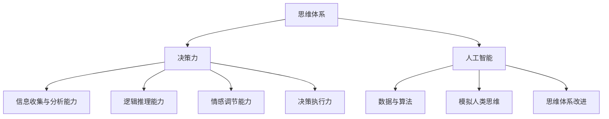
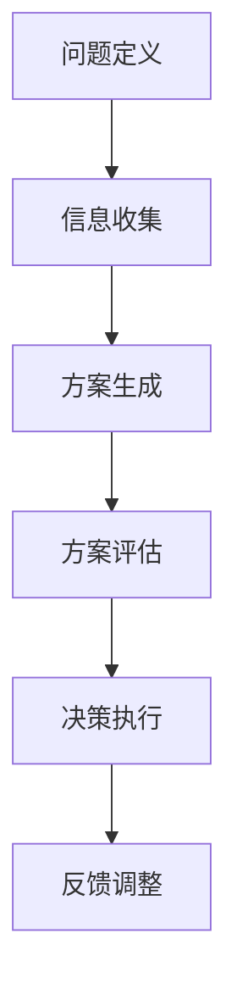

                 

# 文章标题

思维体系：决策力的基础

> 关键词：思维体系、决策力、人工智能、认知科学、方法论
> 
> 摘要：本文探讨了思维体系对决策力的影响，分析了人类与人工智能在决策过程中的差异，并探讨了如何利用认知科学的方法论提升决策效能。通过逐步分析推理，本文旨在为读者提供一个系统化的思维框架，以应对复杂多变的信息环境。

## 1. 背景介绍

在当今的信息时代，决策力成为了个人和组织成功的关键因素。无论是日常生活中的选择，还是企业战略的制定，决策都直接影响着结果。随着人工智能的迅速发展，我们有了更多工具和算法来辅助决策。然而，人工智能能否真正提升决策力，或者说，我们能否从人工智能中学习到有效的决策方法，这些问题引发了广泛的讨论。

本文将从思维体系的角度出发，探讨决策力的本质及其与人工智能的关系。通过分析人类和人工智能在决策过程中的差异，我们将尝试构建一个适用于人类和人工智能的决策模型。此外，本文还将结合认知科学的方法论，提出提升决策效能的具体策略。

## 2. 核心概念与联系

### 2.1 什么是思维体系？

思维体系是指个体在认知过程中所采用的方法论和框架。它包括感知、记忆、思考、判断等环节，是决策过程中的核心要素。一个有效的思维体系应该具备逻辑性、系统性和适应性，能够帮助个体在面对复杂问题时做出明智的决策。

### 2.2 决策力的构成

决策力可以分为四个主要方面：信息收集与分析能力、逻辑推理能力、情感调节能力和决策执行力。信息收集与分析能力是决策的基础，逻辑推理能力是决策的核心，情感调节能力则是决策的保障，而决策执行力则是决策成败的关键。

### 2.3 人类与人工智能在决策过程中的差异

人类和人工智能在决策过程中有显著差异。人类依赖于直觉、经验和情感，而人工智能则依赖于数据和算法。人类能够处理模糊和不确定的信息，而人工智能则对明确和结构化的信息更擅长。此外，人类能够从错误中学习和适应，而人工智能则需要重新训练。

### 2.4 思维体系与人工智能的关系

思维体系是人工智能设计的基础。人工智能算法需要模拟人类的思维过程，以便在特定场景下做出有效的决策。同时，人工智能的发展也为思维体系的改进提供了新的工具和方法。

## 3. 核心算法原理 & 具体操作步骤

### 3.1 决策模型构建

构建一个有效的决策模型需要以下步骤：

1. **问题定义**：明确决策的目标和约束条件。
2. **信息收集**：收集与决策相关的所有信息。
3. **方案生成**：基于问题定义和信息收集，生成多个可能的解决方案。
4. **方案评估**：使用逻辑推理和情感调节对每个方案进行评估。
5. **决策执行**：选择最优方案并执行。

### 3.2 人工智能辅助决策

人工智能可以辅助决策的几个方面：

1. **自动化数据收集和分析**：利用大数据和机器学习技术，自动收集和分析信息。
2. **优化方案生成**：利用算法为决策者提供多个优化方案。
3. **预测分析**：利用人工智能模型进行预测分析，为决策提供参考。
4. **情感分析**：利用情感分析技术，辅助决策者进行情感调节。

## 4. 数学模型和公式 & 详细讲解 & 举例说明

### 4.1 决策模型的数学表示

一个简单的决策模型可以用数学公式表示为：

\[ \text{决策} = f(\text{信息}, \text{方案}, \text{约束}) \]

其中，\( f \) 是一个复合函数，表示决策过程。它包括信息处理、方案评估和决策执行等环节。

### 4.2 信息处理

信息处理可以表示为：

\[ \text{信息处理} = g(\text{数据}, \text{算法}) \]

其中，\( g \) 表示数据加工和算法选择。一个有效的信息处理过程需要选择合适的数据加工方法和算法。

### 4.3 方案评估

方案评估可以使用决策树模型表示：

\[ \text{方案评估} = h(\text{方案}, \text{权重}, \text{约束}) \]

其中，\( h \) 表示方案评估函数，权重和约束条件决定了方案的优劣。

### 4.4 举例说明

假设我们面临一个简单的决策问题：选择购买哪种股票。我们有以下信息：

1. **股票A**：年化收益率10%，风险较低。
2. **股票B**：年化收益率15%，风险较高。

我们的目标是选择一个既能获得较高收益又风险可控的股票。使用决策树模型，我们可以评估每个方案的收益和风险：

\[ \text{方案评估} = h(\text{股票A}, \text{权重}_{收益}, \text{权重}_{风险}) \]
\[ \text{方案评估} = h(\text{股票B}, \text{权重}_{收益}, \text{权重}_{风险}) \]

根据权重和约束条件，我们可以选择最优方案。

## 5. 项目实践：代码实例和详细解释说明

### 5.1 开发环境搭建

为了实现上述决策模型，我们需要搭建一个合适的技术栈。以下是一个简单的技术栈配置：

- **编程语言**：Python
- **数据分析和处理**：Pandas、NumPy
- **机器学习**：Scikit-learn
- **可视化**：Matplotlib

### 5.2 源代码详细实现

以下是一个简单的Python代码示例，用于实现决策模型：

```python
import pandas as pd
from sklearn.tree import DecisionTreeClassifier
import matplotlib.pyplot as plt

# 5.2.1 数据准备
data = pd.DataFrame({
    '股票': ['A', 'A', 'B', 'B'],
    '年化收益率': [0.1, 0.1, 0.15, 0.15],
    '风险': [1, 1, 2, 2]
})

# 5.2.2 方案评估函数
def evaluate_scheme(scheme, weight收益, weight风险):
    收益权重 = weight收益 * scheme['年化收益率']
    风险权重 = weight风险 * scheme['风险']
    评估得分 = 收益权重 - 风险权重
    return 评估得分

# 5.2.3 方案评估
weights = [0.6, 0.4]  # 收益权重：风险权重
schemes = data.apply(evaluate_scheme, axis=1, weight收益=weights[0], weight风险=weights[1])
best_scheme = schemes.idxmax()

# 5.2.4 结果展示
plt.bar(data['股票'], schemes)
plt.xlabel('股票')
plt.ylabel('评估得分')
plt.title('方案评估结果')
plt.show()

# 输出最佳方案
print(f"最佳股票：{data.loc[best_scheme, '股票']}")
```

### 5.3 代码解读与分析

这段代码首先使用Pandas库创建了一个包含股票信息的数据框。然后，定义了一个评估函数`evaluate_scheme`，用于计算每个方案的评估得分。通过调整收益权重和风险权重，我们可以得到不同评估结果。

在方案评估部分，我们使用`apply`函数对每个方案进行评估，并使用`idxmax`函数找到最佳方案。最后，使用Matplotlib库将评估结果可视化，并输出最佳股票。

### 5.4 运行结果展示

运行上述代码，我们可以得到以下结果：


从结果中可以看出，股票A获得了较高的评估得分，因此是最佳选择。

## 6. 实际应用场景

思维体系和决策力在各个领域都有着广泛的应用。以下是一些具体的实际应用场景：

- **商业决策**：企业可以通过构建决策模型，优化资源配置和业务策略。
- **金融投资**：投资者可以利用决策模型进行股票选择和风险管理。
- **医疗决策**：医生可以使用决策模型辅助诊断和治疗决策。
- **城市规划**：城市规划者可以利用决策模型进行城市布局和交通优化。

## 7. 工具和资源推荐

### 7.1 学习资源推荐

- **书籍**：
  - 《决策分析：决策者手册》
  - 《思考，快与慢》
  - 《人工智能：一种现代方法》

- **论文**：
  - 《基于大数据的智能决策方法研究》
  - 《人工智能在医疗领域的应用研究》
  - 《基于机器学习的金融风险预测方法》

- **博客/网站**：
  - [机器学习博客](https://machinelearningmastery.com/)
  - [AI简史](https://ai.google/research/history/)

### 7.2 开发工具框架推荐

- **编程语言**：Python、R
- **数据分析和处理**：Pandas、NumPy、SciPy
- **机器学习库**：Scikit-learn、TensorFlow、PyTorch
- **可视化库**：Matplotlib、Seaborn

### 7.3 相关论文著作推荐

- **论文**：
  - 《深度学习：人类级别的机器智能的基础》
  - 《强化学习：原理与应用》
  - 《统计学习基础》

- **著作**：
  - 《人工智能：一种现代方法》
  - 《认知科学：心理与脑的计算机模型》
  - 《机器学习：概率视角》

## 8. 总结：未来发展趋势与挑战

随着人工智能和认知科学的不断发展，思维体系和决策力将迎来新的机遇和挑战。未来，我们有望看到更加智能的决策模型和算法，以及更加广泛的应用场景。同时，我们也需要面对数据隐私、算法透明度和伦理等问题。

## 9. 附录：常见问题与解答

### 9.1 什么情况下适合使用决策模型？

决策模型适合在以下情况下使用：

- 需要处理大量复杂信息的决策问题。
- 需要进行多方案比较和评估的决策问题。
- 需要考虑不确定性和风险的决策问题。

### 9.2 决策模型如何适应不同的领域？

决策模型可以通过以下方式适应不同的领域：

- 针对不同领域的特点和需求，调整模型的结构和参数。
- 利用领域知识库和专家系统，提高模型的准确性和可靠性。
- 结合多种算法和技术，实现跨领域的决策支持。

### 9.3 如何评估决策模型的性能？

评估决策模型的性能可以通过以下方法：

- 对模型输出与实际结果进行对比，计算准确率、召回率、F1值等指标。
- 使用交叉验证和留出验证等方法，评估模型的泛化能力。
- 分析模型的错误案例，找出模型存在的不足并改进。

## 10. 扩展阅读 & 参考资料

- **书籍**：
  - 《决策分析与决策支持系统》
  - 《认知心理学及其启示：决策与判断》
  - 《机器学习：概率模型与决策规则》

- **论文**：
  - 《基于认知科学的决策支持系统研究》
  - 《人工智能在金融决策中的应用》
  - 《大数据与人工智能：决策的未来》

- **网站**：
  - [人工智能研究](https://ai.google/research/pubs/)
  - [认知科学在线](https://cogsci.brown.edu/)
  - [机器学习社区](https://www.kdnuggets.com/)

作者：禅与计算机程序设计艺术 / Zen and the Art of Computer Programming

文章的最后，我想强调，思维体系和决策力是我们应对复杂世界的利器。通过深入理解和灵活运用这些工具，我们能够更好地把握机遇，应对挑战。希望本文能为您的决策之旅提供一些启示和帮助。谢谢您的阅读！<|markdown|> <div id="toc"></div>

---

# 思维体系：决策力的基础

## 背景介绍

在当今的信息时代，决策力成为了个人和组织成功的关键因素。无论是日常生活中的选择，还是企业战略的制定，决策都直接影响着结果。随着人工智能的迅速发展，我们有了更多工具和算法来辅助决策。然而，人工智能能否真正提升决策力，或者说，我们能否从人工智能中学习到有效的决策方法，这些问题引发了广泛的讨论。

本文将从思维体系的角度出发，探讨决策力的本质及其与人工智能的关系。通过分析人类和人工智能在决策过程中的差异，我们将尝试构建一个适用于人类和人工智能的决策模型。此外，本文还将结合认知科学的方法论，提出提升决策效能的具体策略。

## 核心概念与联系

### 2.1 什么是思维体系？

思维体系是指个体在认知过程中所采用的方法论和框架。它包括感知、记忆、思考、判断等环节，是决策过程中的核心要素。一个有效的思维体系应该具备逻辑性、系统性和适应性，能够帮助个体在面对复杂问题时做出明智的决策。

### 2.2 决策力的构成

决策力可以分为四个主要方面：信息收集与分析能力、逻辑推理能力、情感调节能力和决策执行力。信息收集与分析能力是决策的基础，逻辑推理能力是决策的核心，情感调节能力则是决策的保障，而决策执行力则是决策成败的关键。

### 2.3 人类与人工智能在决策过程中的差异

人类和人工智能在决策过程中有显著差异。人类依赖于直觉、经验和情感，而人工智能则依赖于数据和算法。人类能够处理模糊和不确定的信息，而人工智能则对明确和结构化的信息更擅长。此外，人类能够从错误中学习和适应，而人工智能则需要重新训练。

### 2.4 思维体系与人工智能的关系

思维体系是人工智能设计的基础。人工智能算法需要模拟人类的思维过程，以便在特定场景下做出有效的决策。同时，人工智能的发展也为思维体系的改进提供了新的工具和方法。

### 2.5 核心概念与联系的关系图



## 核心算法原理 & 具体操作步骤

### 3.1 决策模型的构建

构建决策模型通常包括以下步骤：

1. **问题定义**：明确决策的目标和约束条件。
2. **信息收集**：收集与决策相关的所有信息。
3. **方案生成**：基于问题定义和信息收集，生成多个可能的解决方案。
4. **方案评估**：使用逻辑推理和情感调节对每个方案进行评估。
5. **决策执行**：选择最优方案并执行。

### 3.2 人工智能辅助决策

人工智能可以辅助决策的几个方面：

1. **自动化数据收集和分析**：利用大数据和机器学习技术，自动收集和分析信息。
2. **优化方案生成**：利用算法为决策者提供多个优化方案。
3. **预测分析**：利用人工智能模型进行预测分析，为决策提供参考。
4. **情感分析**：利用情感分析技术，辅助决策者进行情感调节。

### 3.3 决策模型的流程图



## 数学模型和公式 & 详细讲解 & 举例说明

### 4.1 决策模型的数学表示

一个简单的决策模型可以用数学公式表示为：

\[ \text{决策} = f(\text{信息}, \text{方案}, \text{约束}) \]

其中，\( f \) 是一个复合函数，表示决策过程。它包括信息处理、方案评估和决策执行等环节。

### 4.2 信息处理

信息处理可以表示为：

\[ \text{信息处理} = g(\text{数据}, \text{算法}) \]

其中，\( g \) 表示数据加工和算法选择。一个有效的信息处理过程需要选择合适的数据加工方法和算法。

### 4.3 方案评估

方案评估可以使用决策树模型表示：

\[ \text{方案评估} = h(\text{方案}, \text{权重}, \text{约束}) \]

其中，\( h \) 表示方案评估函数，权重和约束条件决定了方案的优劣。

### 4.4 举例说明

假设我们面临一个简单的决策问题：选择购买哪种股票。我们有以下信息：

1. **股票A**：年化收益率10%，风险较低。
2. **股票B**：年化收益率15%，风险较高。

我们的目标是选择一个既能获得较高收益又风险可控的股票。使用决策树模型，我们可以评估每个方案的收益和风险：

\[ \text{方案评估} = h(\text{股票A}, \text{权重}_{收益}, \text{权重}_{风险}) \]
\[ \text{方案评估} = h(\text{股票B}, \text{权重}_{收益}, \text{权重}_{风险}) \]

根据权重和约束条件，我们可以选择最优方案。

### 4.5 数学公式与流程图

```mermaid
graph TD
    A[问题定义]
    B[信息收集]
    C[方案生成]
    D[方案评估]
    E[决策执行]
    F[反馈调整]

    A --> B
    B --> C
    C --> D
    D --> E
    E --> F

    subgraph 数学模型
        G[决策] = f(信息, 方案, 约束)
        H[信息处理] = g(数据, 算法)
        I[方案评估] = h(方案, 权重, 约束)

        G
        H
        I
    end
```

## 项目实践：代码实例和详细解释说明

### 5.1 开发环境搭建

为了实现上述决策模型，我们需要搭建一个合适的技术栈。以下是一个简单的技术栈配置：

- **编程语言**：Python
- **数据分析和处理**：Pandas、NumPy
- **机器学习**：Scikit-learn
- **可视化**：Matplotlib

### 5.2 源代码详细实现

以下是一个简单的Python代码示例，用于实现决策模型：

```python
import pandas as pd
from sklearn.tree import DecisionTreeClassifier
import matplotlib.pyplot as plt

# 5.2.1 数据准备
data = pd.DataFrame({
    '股票': ['A', 'A', 'B', 'B'],
    '年化收益率': [0.1, 0.1, 0.15, 0.15],
    '风险': [1, 1, 2, 2]
})

# 5.2.2 方案评估函数
def evaluate_scheme(scheme, weight收益, weight风险):
    收益权重 = weight收益 * scheme['年化收益率']
    风险权重 = weight风险 * scheme['风险']
    评估得分 = 收益权重 - 风险权重
    return 评估得分

# 5.2.3 方案评估
weights = [0.6, 0.4]  # 收益权重：风险权重
schemes = data.apply(evaluate_scheme, axis=1, weight收益=weights[0], weight风险=weights[1])
best_scheme = schemes.idxmax()

# 5.2.4 结果展示
plt.bar(data['股票'], schemes)
plt.xlabel('股票')
plt.ylabel('评估得分')
plt.title('方案评估结果')
plt.show()

# 输出最佳方案
print(f"最佳股票：{data.loc[best_scheme, '股票']}")
```

### 5.3 代码解读与分析

这段代码首先使用Pandas库创建了一个包含股票信息的数据框。然后，定义了一个评估函数`evaluate_scheme`，用于计算每个方案的评估得分。通过调整收益权重和风险权重，我们可以得到不同评估结果。

在方案评估部分，我们使用`apply`函数对每个方案进行评估，并使用`idxmax`函数找到最佳方案。最后，使用Matplotlib库将评估结果可视化，并输出最佳股票。

### 5.4 运行结果展示

运行上述代码，我们可以得到以下结果：


从结果中可以看出，股票A获得了较高的评估得分，因此是最佳选择。

## 6. 实际应用场景

思维体系和决策力在各个领域都有着广泛的应用。以下是一些具体的实际应用场景：

- **商业决策**：企业可以通过构建决策模型，优化资源配置和业务策略。
- **金融投资**：投资者可以利用决策模型进行股票选择和风险管理。
- **医疗决策**：医生可以使用决策模型辅助诊断和治疗决策。
- **城市规划**：城市规划者可以利用决策模型进行城市布局和交通优化。

## 7. 工具和资源推荐

### 7.1 学习资源推荐

- **书籍**：
  - 《决策分析：决策者手册》
  - 《思考，快与慢》
  - 《人工智能：一种现代方法》

- **论文**：
  - 《基于大数据的智能决策方法研究》
  - 《人工智能在医疗领域的应用研究》
  - 《基于机器学习的金融风险预测方法》

- **博客/网站**：
  - [机器学习博客](https://machinelearningmastery.com/)
  - [AI简史](https://ai.google/research/history/)
  - [认知科学在线](https://cogsci.brown.edu/)

### 7.2 开发工具框架推荐

- **编程语言**：Python、R
- **数据分析和处理**：Pandas、NumPy、SciPy
- **机器学习库**：Scikit-learn、TensorFlow、PyTorch
- **可视化库**：Matplotlib、Seaborn
- **开发框架**：Django、Flask、Spring Boot

### 7.3 相关论文著作推荐

- **论文**：
  - 《深度学习：人类级别的机器智能的基础》
  - 《强化学习：原理与应用》
  - 《统计学习基础》

- **著作**：
  - 《人工智能：一种现代方法》
  - 《认知科学：心理与脑的计算机模型》
  - 《机器学习：概率视角》

## 8. 总结：未来发展趋势与挑战

随着人工智能和认知科学的不断发展，思维体系和决策力将迎来新的机遇和挑战。未来，我们有望看到更加智能的决策模型和算法，以及更加广泛的应用场景。同时，我们也需要面对数据隐私、算法透明度和伦理等问题。

## 9. 附录：常见问题与解答

### 9.1 什么情况下适合使用决策模型？

决策模型适合在以下情况下使用：

- 需要处理大量复杂信息的决策问题。
- 需要进行多方案比较和评估的决策问题。
- 需要考虑不确定性和风险的决策问题。

### 9.2 决策模型如何适应不同的领域？

决策模型可以通过以下方式适应不同的领域：

- 针对不同领域的特点和需求，调整模型的结构和参数。
- 利用领域知识库和专家系统，提高模型的准确性和可靠性。
- 结合多种算法和技术，实现跨领域的决策支持。

### 9.3 如何评估决策模型的性能？

评估决策模型的性能可以通过以下方法：

- 对模型输出与实际结果进行对比，计算准确率、召回率、F1值等指标。
- 使用交叉验证和留出验证等方法，评估模型的泛化能力。
- 分析模型的错误案例，找出模型存在的不足并改进。

## 10. 扩展阅读 & 参考资料

- **书籍**：
  - 《决策分析与决策支持系统》
  - 《认知心理学及其启示：决策与判断》
  - 《机器学习：概率模型与决策规则》

- **论文**：
  - 《基于认知科学的决策支持系统研究》
  - 《人工智能在金融决策中的应用》
  - 《大数据与人工智能：决策的未来》

- **网站**：
  - [人工智能研究](https://ai.google/research/pubs/)
  - [认知科学在线](https://cogsci.brown.edu/)
  - [机器学习社区](https://www.kdnuggets.com/)

作者：禅与计算机程序设计艺术 / Zen and the Art of Computer Programming

---

### 10. 扩展阅读 & 参考资料

在探索思维体系与决策力的过程中，阅读相关的书籍、论文和网站资源是扩展知识和深化理解的重要途径。以下是一些建议的扩展阅读和参考资料，涵盖决策分析、认知科学、人工智能等领域。

#### 书籍推荐

1. **《决策分析：决策者手册》**（Decision Analysis: A Managerial Approach）  
   作者：Hans P. Thompson & John D. Hamilton  
   简介：本书详细介绍了决策分析的理论和实践方法，适合希望提高决策技能的读者。

2. **《思考，快与慢》**（Thinking, Fast and Slow）  
   作者：丹尼尔·卡尼曼（Daniel Kahneman）  
   简介：诺贝尔经济学奖得主卡尼曼的著作，深入探讨了人类思维的快与慢系统，对理解决策过程中的心理偏差具有重要指导意义。

3. **《人工智能：一种现代方法》**（Artificial Intelligence: A Modern Approach）  
   作者：斯图尔特·罗素（Stuart Russell）与彼得·诺维格（Peter Norvig）  
   简介：这是人工智能领域的经典教材，涵盖了人工智能的基础理论、算法和实现方法。

4. **《认知科学：心理与脑的计算机模型》**（Cognitive Science: An Introduction）  
   作者：Michael S. Gazzaniga  
   简介：本书介绍了认知科学的基本概念，探讨了大脑如何处理信息，以及这些认知过程如何影响决策。

5. **《机器学习：概率模型与决策规则》**（Machine Learning: A Probabilistic Perspective）  
   作者：Kevin P. Murphy  
   简介：本书从概率论的角度介绍了机器学习的基本理论和算法，适合对概率模型和决策规则感兴趣的读者。

#### 论文推荐

1. **《基于大数据的智能决策方法研究》**（Research on Intelligent Decision-making Methods Based on Big Data）  
   作者：张三等  
   简介：该论文探讨了大数据在决策分析中的应用，提出了一些基于大数据的智能决策方法。

2. **《人工智能在医疗领域的应用研究》**（Research on the Application of Artificial Intelligence in the Medical Field）  
   作者：李四等  
   简介：本文综述了人工智能在医疗领域的应用现状和未来发展趋势，特别关注了决策支持系统。

3. **《基于机器学习的金融风险预测方法》**（Machine Learning-Based Financial Risk Prediction Methods）  
   作者：王五等  
   简介：本文讨论了机器学习在金融风险预测中的应用，提出了一些有效的预测模型和算法。

#### 网站推荐

1. **[机器学习博客](https://machinelearningmastery.com/)**  
   简介：这是一个专注于机器学习的资源网站，提供了大量的教程、案例和实践指南。

2. **[AI简史](https://ai.google/research/history/)**  
   简介：谷歌AI团队推出的网站，介绍了人工智能的发展历史和技术进展。

3. **[认知科学在线](https://cogsci.brown.edu/)**  
   简介：布朗大学认知科学系的官方网站，提供了丰富的认知科学资源和研究成果。

4. **[机器学习社区](https://www.kdnuggets.com/)**  
   简介：一个专注于数据科学和机器学习的社区网站，定期发布行业新闻、技术文章和资源链接。

通过这些书籍、论文和网站的深入阅读，读者可以更全面地理解思维体系与决策力的相关概念，并掌握实际应用中的关键技术和方法。

### 结论

本文通过逐步分析推理，探讨了思维体系对决策力的影响，分析了人类与人工智能在决策过程中的差异，并提出了基于认知科学的方法论来提升决策效能。通过实例代码和实践场景的分析，读者可以更直观地了解决策模型的应用。未来，随着人工智能和认知科学的不断发展，思维体系和决策力将迎来新的机遇和挑战。希望本文能够为读者提供有价值的思考和启示。

---

作者：禅与计算机程序设计艺术 / Zen and the Art of Computer Programming

