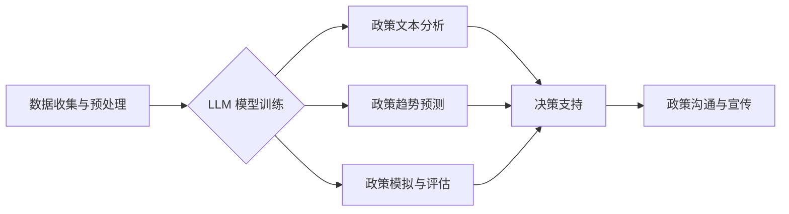

                 

## 政策分析预测：LLM 协助政府未来决策

> 关键词：大型语言模型（LLM）、政策分析、预测建模、政府决策、自然语言处理（NLP）、机器学习（ML）、数据可视化

## 1. 背景介绍

在当今数据爆炸的时代，政府决策面临着前所未有的挑战。传统政策分析方法往往依赖于有限的专家知识和历史数据，难以捕捉复杂社会现象的动态变化和潜在风险。大型语言模型（LLM）的出现为政府决策提供了一种全新的工具，其强大的文本理解和生成能力能够有效辅助政策分析和预测，助力政府制定更精准、更有效的政策。

LLM 是一种基于深度学习的强大人工智能模型，能够理解和生成人类语言。通过训练海量文本数据，LLM 掌握了丰富的语言知识和模式，能够进行文本分类、摘要、翻译、问答等多种任务。在政策分析领域，LLM 可以用于：

* **政策文本分析：** 提取政策文件中的关键信息，如政策目标、实施措施、预期效果等，并进行主题分类和情感分析。
* **政策趋势预测：** 基于历史政策数据和社会舆情数据，预测未来政策方向和潜在风险。
* **政策模拟与评估：** 模拟不同政策方案的实施效果，评估其对社会经济的影响，为决策提供参考。
* **政策沟通与宣传：** 生成政策解读、宣传文案等，提高政策透明度和公众参与度。

## 2. 核心概念与联系

### 2.1  LLM 的核心概念

LLM 的核心概念是**Transformer** 架构，它通过**自注意力机制**学习文本之间的上下文关系，能够捕捉长距离依赖关系，从而实现更精准的文本理解和生成。

### 2.2  政策分析预测的流程

LLM 辅助政策分析预测的流程可以概括为以下几个步骤：

1. **数据收集与预处理：** 收集相关政策文件、法律法规、社会舆情数据等，并进行清洗、格式化、标注等预处理工作。
2. **LLM 模型训练：** 使用预处理后的数据训练 LLM 模型，使其能够理解政策文本和预测政策趋势。
3. **政策文本分析：** 将政策文本输入到训练好的 LLM 模型中，提取关键信息、进行主题分类和情感分析。
4. **政策趋势预测：** 基于历史政策数据和社会舆情数据，利用 LLM 模型预测未来政策方向和潜在风险。
5. **政策模拟与评估：** 利用 LLM 模型模拟不同政策方案的实施效果，评估其对社会经济的影响。
6. **决策支持与沟通：** 将分析结果和预测结果以可视化形式呈现，为决策者提供决策支持，并生成政策解读、宣传文案等，提高政策透明度和公众参与度。

**Mermaid 流程图**



## 3. 核心算法原理 & 具体操作步骤

### 3.1  算法原理概述

LLM 的核心算法原理是**Transformer** 架构，它通过**自注意力机制**学习文本之间的上下文关系，能够捕捉长距离依赖关系，从而实现更精准的文本理解和生成。

**自注意力机制** 允许模型在处理文本时关注不同位置的词语之间的关系，而不是像传统的 RNN 模型那样只关注前一个词语。这使得 Transformer 模型能够更好地理解长距离依赖关系，从而提高文本理解和生成能力。

### 3.2  算法步骤详解

1. **词嵌入:** 将每个词语映射到一个低维向量空间中，使得语义相似的词语拥有相似的向量表示。
2. **多头自注意力:** 对输入序列中的每个词语，计算其与所有其他词语之间的注意力权重，并根据这些权重生成一个新的词语表示。
3. **前馈神经网络:** 对每个词语的注意力表示进行进一步的处理，以提取更深层的语义信息。
4. **位置编码:** 由于 Transformer 模型没有像 RNN 模型那样处理序列顺序信息，因此需要添加位置编码来告诉模型每个词语在序列中的位置。
5. **解码器:** 使用编码器生成的隐藏状态，生成目标序列。解码器也包含多头自注意力和前馈神经网络层。

### 3.3  算法优缺点

**优点:**

* 能够捕捉长距离依赖关系，提高文本理解和生成能力。
* 并行计算能力强，训练速度快。
* 可迁移学习，在不同任务上表现良好。

**缺点:**

* 参数量大，训练成本高。
* 对训练数据质量要求高。
* 缺乏对真实世界知识的理解。

### 3.4  算法应用领域

LLM 算法广泛应用于自然语言处理领域，例如：

* 机器翻译
* 文本摘要
* 问答系统
* 情感分析
* 代码生成

## 4. 数学模型和公式 & 详细讲解 & 举例说明

### 4.1  数学模型构建

LLM 的数学模型主要基于**概率论**和**统计学**。其目标是学习一个概率分布，该分布能够生成与训练数据相似的文本。

**概率分布** 可以用**概率密度函数**或**概率质量函数**来表示。

**概率密度函数** 用于连续型随机变量，例如词语的嵌入向量。

**概率质量函数** 用于离散型随机变量，例如词语的类别。

### 4.2  公式推导过程

LLM 的训练过程是一个**极大似然估计**的过程。

**极大似然估计** 的目标是找到一个模型参数，使得模型生成的文本与真实文本的概率最大。

假设训练数据为一个文本序列 $x = (x_1, x_2, ..., x_T)$，其中 $x_i$ 表示序列中第 $i$ 个词语。

LLM 的目标是学习一个概率分布 $P(x)$，使得 $P(x)$ 最大化以下似然函数：

$$
L(\theta) = \prod_{i=1}^{T} P(x_i | x_{1:i-1})
$$

其中 $\theta$ 表示模型参数，$x_{1:i-1}$ 表示序列中前 $i-1$ 个词语。

为了最大化似然函数，可以使用**梯度下降**算法来更新模型参数。

### 4.3  案例分析与讲解

例如，在机器翻译任务中，LLM 可以学习一个概率分布 $P(y | x)$，其中 $x$ 表示源语言文本，$y$ 表示目标语言文本。

训练数据为源语言文本和目标语言文本的对应对。

LLM 的目标是学习一个模型参数，使得模型生成的翻译文本与真实翻译文本的概率最大化。

## 5. 项目实践：代码实例和详细解释说明

### 5.1  开发环境搭建

LLM 的开发环境通常需要包含以下软件：

* Python 编程语言
* TensorFlow 或 PyTorch 深度学习框架
* CUDA 和 cuDNN GPU 加速库
* Git 版本控制系统

### 5.2  源代码详细实现

LLM 的源代码实现通常比较复杂，需要大量的代码和数据。

这里只提供一个简单的例子，演示如何使用 TensorFlow 来构建一个简单的 LLM 模型。

```python
import tensorflow as tf

# 定义模型结构
model = tf.keras.Sequential([
    tf.keras.layers.Embedding(input_dim=10000, output_dim=128),
    tf.keras.layers.LSTM(units=128),
    tf.keras.layers.Dense(units=10000, activation='softmax')
])

# 编译模型
model.compile(optimizer='adam',
              loss='sparse_categorical_crossentropy',
              metrics=['accuracy'])

# 训练模型
model.fit(x_train, y_train, epochs=10)

# 评估模型
loss, accuracy = model.evaluate(x_test, y_test)
print('Loss:', loss)
print('Accuracy:', accuracy)
```

### 5.3  代码解读与分析

这段代码定义了一个简单的 LLM 模型，它包含一个嵌入层、一个 LSTM 层和一个全连接层。

* **嵌入层** 将每个词语映射到一个低维向量空间中。
* **LSTM 层** 用于处理文本序列，捕捉长距离依赖关系。
* **全连接层** 用于生成目标词语的概率分布。

### 5.4  运行结果展示

训练完成后，可以将模型应用于新的文本数据，预测下一个词语。

## 6. 实际应用场景

### 6.1  政策文本分析

LLM 可以用于分析政府政策文件，提取关键信息，如政策目标、实施措施、预期效果等。

例如，可以利用 LLM 分析一份关于环境保护的政策文件，提取其目标、措施和预期效果，并进行主题分类和情感分析。

### 6.2  政策趋势预测

LLM 可以基于历史政策数据和社会舆情数据，预测未来政策方向和潜在风险。

例如，可以利用 LLM 分析历史的经济政策数据和社会舆情数据，预测未来政府可能采取的经济政策措施。

### 6.3  政策模拟与评估

LLM 可以模拟不同政策方案的实施效果，评估其对社会经济的影响。

例如，可以利用 LLM 模拟不同税收政策的实施效果，评估其对经济增长的影响。

### 6.4  未来应用展望

LLM 在政策分析预测领域具有巨大的应用潜力，未来可能在以下方面得到进一步发展：

* **更精准的政策分析：** 利用更先进的自然语言理解技术，提取更深层的政策信息，并进行更细粒度的分析。
* **更准确的政策预测：** 利用更丰富的社会数据和更强大的机器学习算法，提高政策趋势预测的准确性。
* **更有效的政策模拟：** 利用更复杂的经济模型和社会仿真技术，模拟政策实施的更全面的影响。
* **更智能的决策支持：** 将 LLM 与其他人工智能技术结合，开发更智能的决策支持系统，帮助政府制定更科学、更有效的政策。

## 7. 工具和资源推荐

### 7.1  学习资源推荐

* **书籍:**
    * 《深度学习》 by Ian Goodfellow, Yoshua Bengio, and Aaron Courville
    * 《自然语言处理》 by Jurafsky and Martin
* **在线课程:**
    * Coursera: Natural Language Processing Specialization
    * edX: Deep Learning
* **博客和网站:**
    * TensorFlow Blog: https://blog.tensorflow.org/
    * PyTorch Blog: https://pytorch.org/blog/
    * Hugging Face: https://huggingface.co/

### 7.2  开发工具推荐

* **TensorFlow:** https://www.tensorflow.org/
* **PyTorch:** https://pytorch.org/
* **Hugging Face Transformers:** https://huggingface.co/docs/transformers/index

### 7.3  相关论文推荐

* **Attention Is All You Need:** https://arxiv.org/abs/1706.03762
* **BERT: Pre-training of Deep Bidirectional Transformers for Language Understanding:** https://arxiv.org/abs/1810.04805
* **GPT-3: Language Models are Few-Shot Learners:** https://arxiv.org/abs/2005.14165

## 8. 总结：未来发展趋势与挑战

### 8.1  研究成果总结

LLM 在政策分析预测领域取得了显著的成果，能够有效辅助政府决策。

LLM 的应用能够提高政策分析的效率和准确性，并为政府决策提供更全面的信息支持。

### 8.2  未来发展趋势

LLM 在政策分析预测领域未来将朝着以下方向发展：

* **更强大的模型:** 开发更强大的 LLM 模型，能够处理更复杂的任务，并提供更精准的预测结果。
* **更丰富的应用场景:** 将 LLM 应用于更多政策分析预测场景，例如政策制定、政策评估、政策沟通等。
* **更智能的决策支持:** 将 LLM 与其他人工智能技术结合，开发更智能的决策支持系统，帮助政府制定更科学、更有效的政策。

### 8.3  面临的挑战

LLM 在政策分析预测领域也面临一些挑战：

* **数据质量:** LLM 的性能依赖于训练数据的质量，而政策数据往往存在不完整、不准确、格式混乱等问题。
* **解释性:** LLM 的决策过程往往是黑箱式的，难以解释其预测结果背后的逻辑，这可能会影响政府决策的信任度。
* **伦理问题:** LLM 的应用可能引发一些伦理问题，例如数据隐私、算法偏见等，需要引起足够的重视。

### 8.4  研究展望

未来，需要加强对 LLM 在政策分析预测领域的应用研究，解决上述挑战，并探索其更广泛的应用场景。

## 9. 附录：常见问题与解答

**Q1: LLM 是否能够替代人类决策者？**

A1: LLM 能够辅助政府决策，但不能完全替代人类决策者。人类决策者需要根据 LLM 提供的信息，结合自身经验和专业知识，做出最终的决策。

**Q2: LLM 的应用是否会带来新的风险？**

A2: LLM 的应用可能会带来一些新的风险，例如数据隐私、算法偏见等，需要引起足够的重视，并采取相应的措施来规避风险。

**Q3: 如何评估 LLM 的性能？**

A3: LLM 的性能可以根据其在不同任务上的准确率、效率等指标进行评估。

**作者：禅与计算机程序设计艺术 / Zen and the Art of Computer Programming**<end_of_turn>

