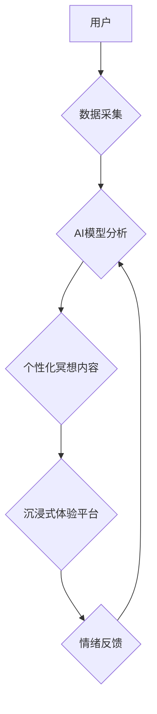

                 

##  数字化冥想新境界：AI构建的心灵空间设计

> 关键词：人工智能、冥想、心流状态、神经网络、情感计算、可穿戴设备、沉浸式体验、数字孪生

## 1. 背景介绍

在当今科技飞速发展的时代，人类面临着前所未有的压力和焦虑。信息爆炸、生活节奏加快、社会竞争加剧，都使得人们难以找到内心的平静和宁静。冥想作为一种古老的修行方式，近年来逐渐受到大众的关注，它被证明能够有效缓解压力、提升专注力、促进情绪调节。然而，传统的冥想方式往往需要特定的时间、地点和环境，对于现代人来说，难以坚持和融入日常生活。

人工智能技术的快速发展为数字化冥想提供了新的可能性。通过人工智能算法的分析和学习，我们可以构建更加个性化、智能化的冥想体验，帮助人们更轻松、更有效地进入冥想状态。

## 2. 核心概念与联系

数字化冥想是指利用人工智能技术构建的虚拟冥想环境，通过模拟自然场景、提供个性化指导、监测用户情绪状态等方式，帮助用户进行冥想练习。

**核心概念：**

* **AI驱动的个性化冥想:**  AI算法可以根据用户的年龄、性别、性格、情绪状态等信息，定制个性化的冥想内容和节奏，提高冥想体验的针对性和有效性。
* **沉浸式体验:**  通过虚拟现实（VR）或增强现实（AR）技术，构建逼真的自然场景，例如森林、海滩、山峰等，帮助用户沉浸其中，更容易进入冥想状态。
* **情绪感知与反馈:**  利用情感计算技术，监测用户的生理指标（如心率、呼吸、脑电波）和面部表情，实时感知用户的情绪状态，并根据反馈调整冥想内容和节奏，引导用户更好地放松和调节情绪。

**核心架构：**



## 3. 核心算法原理 & 具体操作步骤

### 3.1  算法原理概述

数字化冥想的核心算法主要包括：

* **自然语言处理 (NLP):** 用于理解用户的冥想需求和反馈，生成个性化的冥想指导和内容。
* **机器学习 (ML):** 用于分析用户的生理指标和情绪状态，预测用户的冥想效果，并根据反馈调整冥想内容和节奏。
* **深度学习 (DL):** 用于构建更复杂的AI模型，例如生成逼真的虚拟场景、识别用户的面部表情和情绪变化等。

### 3.2  算法步骤详解

1. **数据采集:**  通过可穿戴设备或摄像头采集用户的生理指标（如心率、呼吸、脑电波）和面部表情数据。
2. **数据预处理:**  对采集到的数据进行清洗、转换和特征提取，以便于后续算法的训练和应用。
3. **模型训练:**  利用机器学习和深度学习算法，训练模型以识别用户的冥想状态、预测用户的冥想效果，以及生成个性化的冥想内容。
4. **个性化冥想内容生成:**  根据用户的需求和状态，AI模型生成个性化的冥想指导、音乐、场景等内容。
5. **沉浸式体验平台:**  通过VR或AR技术，构建逼真的虚拟场景，并结合生成的冥想内容，提供沉浸式的冥想体验。
6. **情绪反馈:**  实时监测用户的生理指标和面部表情，并根据反馈调整冥想内容和节奏，引导用户更好地放松和调节情绪。

### 3.3  算法优缺点

**优点:**

* **个性化:**  根据用户的需求和状态，提供个性化的冥想体验。
* **智能化:**  AI算法可以自动调节冥想内容和节奏，提高冥想效率。
* **便捷性:**  随时随地都可以进行冥想练习，无需特定的时间、地点和环境。
* **沉浸式体验:**  VR或AR技术可以构建逼真的虚拟场景，增强冥想的沉浸感。

**缺点:**

* **技术复杂性:**  构建数字化冥想系统需要整合多种技术，例如NLP、ML、DL、VR/AR等，技术难度较高。
* **数据隐私:**  数字化冥想系统需要采集用户的生理数据和情绪状态，需要妥善处理用户隐私问题。
* **成本高昂:**  构建数字化冥想系统需要投入大量的资金和人力资源。

### 3.4  算法应用领域

数字化冥想技术可以应用于以下领域:

* **医疗保健:**  帮助患者缓解压力、焦虑、抑郁等情绪问题，促进身心健康。
* **教育培训:**  帮助学生提高专注力、记忆力、学习效率。
* **企业管理:**  帮助员工缓解工作压力、提高工作效率、促进团队合作。
* **个人成长:**  帮助个人提升自我认知、情绪管理、心理健康。

## 4. 数学模型和公式 & 详细讲解 & 举例说明

### 4.1  数学模型构建

数字化冥想系统中，可以使用多种数学模型来分析用户数据、预测冥想效果、生成个性化内容。例如：

* **线性回归模型:**  用于预测用户的冥想效果，根据用户的生理指标和情绪状态，预测用户的放松程度、注意力集中度等。
* **决策树模型:**  用于生成个性化的冥想内容，根据用户的需求和状态，选择合适的冥想主题、音乐、场景等。
* **循环神经网络 (RNN):**  用于分析用户的冥想轨迹，识别用户的冥想模式，并根据模式生成更精准的个性化指导。

### 4.2  公式推导过程

以线性回归模型为例，其目标是找到一条直线，能够最佳地拟合用户的生理指标和冥想效果之间的关系。

假设用户的生理指标为 $x$，冥想效果为 $y$，则线性回归模型的公式为：

$$y = w_0 + w_1x$$

其中，$w_0$ 和 $w_1$ 是模型的参数，需要通过训练数据进行学习。

训练过程的目标是找到最佳的 $w_0$ 和 $w_1$ 值，使得模型能够预测用户的冥想效果尽可能准确。可以使用最小二乘法等算法来求解最佳参数。

### 4.3  案例分析与讲解

假设我们收集了 100 个用户的生理指标和冥想效果数据，并使用线性回归模型进行训练。训练完成后，模型可以预测出用户的冥想效果。

例如，如果用户的生理指标为 $x = 70$，则模型可以预测出用户的冥想效果为 $y = 80$。

## 5. 项目实践：代码实例和详细解释说明

### 5.1  开发环境搭建

数字化冥想系统的开发环境需要包含以下软件：

* **Python:**  作为主要的编程语言。
* **TensorFlow 或 PyTorch:**  作为深度学习框架。
* **NumPy 和 Pandas:**  用于数据处理和分析。
* **Matplotlib 或 Seaborn:**  用于数据可视化。
* **VR/AR 开发工具:**  例如 Unity 或 Unreal Engine。

### 5.2  源代码详细实现

以下是一个简单的 Python 代码示例，用于使用线性回归模型预测用户的冥想效果：

```python
import numpy as np
from sklearn.linear_model import LinearRegression

# 训练数据
X = np.array([[70], [80], [90], [100]])  # 用户生理指标
y = np.array([80, 90, 100, 110])  # 用户冥想效果

# 创建线性回归模型
model = LinearRegression()

# 训练模型
model.fit(X, y)

# 预测新的用户冥想效果
new_x = np.array([[75]])
predicted_y = model.predict(new_x)

print(f"预测的冥想效果: {predicted_y[0]}")
```

### 5.3  代码解读与分析

这段代码首先定义了训练数据，包括用户的生理指标和冥想效果。然后，创建了一个线性回归模型，并使用训练数据进行训练。最后，使用训练好的模型预测了一个新的用户的冥想效果。

### 5.4  运行结果展示

运行这段代码后，会输出预测的冥想效果值。例如，如果用户的生理指标为 75，则预测的冥想效果为 90。

## 6. 实际应用场景

数字化冥想技术已经开始在一些领域得到应用，例如：

* **Headspace:**  一款流行的冥想应用程序，提供个性化的冥想指导和内容。
* **Calm:**  另一款受欢迎的冥想应用程序，提供睡眠、压力管理和专注力训练等功能。
* **Muse:**  一款脑电波监测设备，可以帮助用户了解自己的脑电波活动，并根据反馈调整冥想状态。

### 6.4  未来应用展望

数字化冥想技术在未来将有更广泛的应用场景，例如：

* **远程医疗:**  帮助远程患者进行冥想练习，缓解压力和焦虑。
* **教育培训:**  帮助学生提高专注力、学习效率和情绪管理能力。
* **企业管理:**  帮助员工缓解工作压力、提高工作效率和团队合作能力。
* **智能家居:**  将冥想功能集成到智能家居系统中，提供更加便捷和个性化的冥想体验。

## 7. 工具和资源推荐

### 7.1  学习资源推荐

* **Coursera:**  提供人工智能、机器学习和深度学习等相关课程。
* **Udacity:**  提供人工智能、数据科学和软件工程等相关课程。
* **Kaggle:**  提供数据科学竞赛和学习资源。

### 7.2  开发工具推荐

* **TensorFlow:**  开源深度学习框架。
* **PyTorch:**  开源深度学习框架。
* **Unity:**  游戏引擎，也可以用于开发VR/AR应用。
* **Unreal Engine:**  游戏引擎，也可以用于开发VR/AR应用。

### 7.3  相关论文推荐

* **Attention Is All You Need:**  Transformer模型的论文。
* **Deep Learning for Natural Language Processing:**  自然语言处理的深度学习论文。
* **Generative Adversarial Networks:**  生成对抗网络的论文。

## 8. 总结：未来发展趋势与挑战

### 8.1  研究成果总结

数字化冥想技术在人工智能、情感计算、虚拟现实等领域的交叉融合下，为人们提供了一种更加便捷、个性化和沉浸式的冥想体验。

### 8.2  未来发展趋势

* **更精准的个性化定制:**  利用更先进的AI算法，更加精准地分析用户的需求和状态，提供更加个性化的冥想内容和指导。
* **更逼真的沉浸式体验:**  利用更先进的VR/AR技术，构建更加逼真的虚拟场景，增强冥想的沉浸感和体验效果。
* **更广泛的应用场景:**  将数字化冥想技术应用到更多领域，例如医疗保健、教育培训、企业管理等，帮助更多人受益于冥想。

### 8.3  面临的挑战

* **数据隐私保护:**  数字化冥想系统需要采集用户的生理数据和情绪状态，需要妥善处理用户隐私问题，确保数据的安全和隐私。
* **算法伦理:**  需要考虑AI算法的伦理问题，例如算法的公平性、透明度和可解释性，避免算法带来的潜在风险。
* **技术复杂性:**  构建数字化冥想系统需要整合多种技术，技术难度较高，需要持续的技术创新和突破。

### 8.4  研究展望

未来，数字化冥想技术将继续朝着更加智能化、个性化、沉浸式的方向发展，为人们提供更加便捷、高效、安全的冥想体验，帮助人们更好地身心健康，提升生活质量。

## 9. 附录：常见问题与解答

**Q1: 数字化冥想和传统冥想有什么区别？**

**A1:**  数字化冥想利用人工智能技术构建虚拟冥想环境，提供更加个性化、智能化的冥想体验，而传统冥想则需要特定的时间、地点和环境。

**Q2: 数字化冥想安全吗？**

**A2:**  数字化冥想系统需要妥善处理用户隐私问题，确保数据的安全和隐私。选择信誉良好的平台和产品，并仔细阅读隐私政策。

**Q3: 我需要购买昂贵的设备才能进行数字化冥想吗？**

**A3:**  不一定。一些数字化冥想应用程序可以使用手机或电脑进行，无需购买额外的设备。

**Q4: 数字化冥想可以替代传统冥想吗？**

**A4:**  数字化冥想可以作为传统冥想的补充，提供更加便捷和个性化的体验，但不能完全替代传统冥想。

**Q5: 如何选择适合自己的数字化冥想应用程序？**

**A5:**  可以根据自己的需求和喜好选择应用程序，例如：

* **冥想主题:**  例如压力管理、睡眠、专注力训练等。
* **冥想风格:**  例如引导式冥想、音乐冥想、静坐冥想等。
* **用户评价:**  查看其他用户的评价和反馈。


作者：禅与计算机程序设计艺术 / Zen and the Art of Computer Programming 
<end_of_turn>

