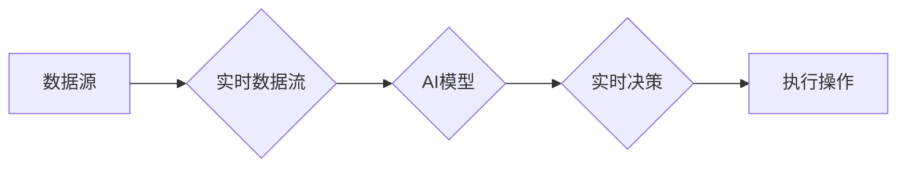

                 

## 时效性信息处理：AI的实时性

> 关键词：人工智能、实时性、时效性信息处理、低延迟、数据流、事件驱动、流式处理、微服务架构、云计算

## 1. 背景介绍

在当今数据爆炸的时代，信息处理的速度和效率已成为至关重要的竞争优势。传统的信息处理模式往往面临着处理延迟、数据积压等问题，难以满足快速变化的业务需求。随着人工智能（AI）技术的飞速发展，实时性信息处理成为AI应用的关键挑战和机遇。

实时性信息处理是指能够在信息产生后立即或近乎立即进行处理和反馈的系统。它要求系统能够快速接收、分析和响应数据流，并及时提供决策支持或执行操作。在许多领域，实时性信息处理至关重要，例如：

* **金融交易：**实时监控市场数据，快速执行交易指令，降低风险。
* **物联网（IoT）：**实时处理传感器数据，实现设备远程控制和故障诊断。
* **智能交通：**实时分析交通流量，优化交通信号灯控制，缓解拥堵。
* **医疗保健：**实时监测患者数据，及时发现异常情况，提供精准医疗。

传统的批处理模式难以满足这些对实时性的需求。因此，开发高效、低延迟的实时性信息处理系统成为AI应用的重要方向。

## 2. 核心概念与联系

### 2.1 时效性信息处理

时效性信息处理是指在信息产生后，在尽可能短的时间内完成信息的接收、处理和反馈的过程。它强调信息的及时性、准确性和可靠性。

### 2.2 AI的实时性

AI的实时性是指AI系统能够在信息产生后立即或近乎立即进行处理和反馈的能力。它要求AI系统能够快速学习、推理和决策，并及时提供结果。

### 2.3 核心概念联系

时效性信息处理是AI实时性的基础。AI系统需要实时处理来自各种数据源的信息，才能实现其实时性。

**Mermaid 流程图**



## 3. 核心算法原理 & 具体操作步骤

### 3.1 算法原理概述

实时性信息处理算法的核心是高效地处理数据流，并快速进行推理和决策。常用的算法包括：

* **流式处理算法：**将数据流划分为小批次，并对每个批次进行处理，实现实时数据分析和处理。
* **事件驱动算法：**根据事件触发进行数据处理，实现对特定事件的实时响应。
* **微服务架构：**将系统分解为多个独立的服务，每个服务负责处理特定的业务逻辑，实现高并发和低延迟。

### 3.2 算法步骤详解

**流式处理算法步骤：**

1. **数据采集：**从各种数据源采集实时数据流。
2. **数据预处理：**对采集到的数据进行清洗、转换和格式化。
3. **数据分批：**将数据流划分为小批次，每个批次包含一定数量的数据。
4. **数据处理：**对每个数据批次进行处理，例如计算统计指标、识别模式或执行决策。
5. **结果输出：**将处理结果输出到目标系统，例如数据库、消息队列或用户界面。

**事件驱动算法步骤：**

1. **事件订阅：**订阅特定事件的发生。
2. **事件接收：**接收事件通知。
3. **事件处理：**根据事件类型执行相应的处理逻辑。
4. **结果反馈：**将处理结果反馈到事件源或其他系统。

### 3.3 算法优缺点

**流式处理算法：**

* **优点：**能够处理海量数据流，实时分析和处理数据，支持在线更新和调整。
* **缺点：**需要处理数据流的复杂性，对系统资源要求较高，可能存在数据丢失或延迟问题。

**事件驱动算法：**

* **优点：**能够快速响应特定事件，实现对事件的实时处理，降低系统复杂度。
* **缺点：**难以处理复杂的数据依赖关系，可能存在事件处理的顺序问题。

### 3.4 算法应用领域

* **流式处理算法：**金融交易、物联网、社交媒体分析、实时监控等。
* **事件驱动算法：**用户行为分析、异常检测、自动化任务执行等。

## 4. 数学模型和公式 & 详细讲解 & 举例说明

### 4.1 数学模型构建

实时性信息处理系统可以抽象为一个数据流处理模型，其中数据流可以表示为一个时间序列，每个时间点对应一个数据样本。

**数据流模型：**

$$
D(t) = \{d_1(t), d_2(t), ..., d_n(t)\}
$$

其中：

* $D(t)$ 表示在时间点 $t$ 的数据流。
* $d_i(t)$ 表示时间点 $t$ 的第 $i$ 个数据样本。

### 4.2 公式推导过程

实时性信息处理的目标是将数据流 $D(t)$ 处理成有意义的结果 $R(t)$，并以尽可能短的时间内输出。

**实时性指标：**

$$
Latency(t) = t_{process} - t_{arrival}
$$

其中：

* $Latency(t)$ 表示在时间点 $t$ 的处理延迟。
* $t_{process}$ 表示数据样本 $d_i(t)$ 被处理完成的时间。
* $t_{arrival}$ 表示数据样本 $d_i(t)$ 进入系统的时间。

### 4.3 案例分析与讲解

假设一个实时股票交易系统，需要在收到股票价格变化信息后，立即更新用户账户余额。

* 数据流：股票价格变化信息。
* 处理逻辑：根据股票价格变化信息，计算用户账户余额的变化。
* 实时性指标：用户账户余额更新延迟。

为了降低延迟，系统可以采用流式处理算法，将股票价格变化信息实时处理，并更新用户账户余额。

## 5. 项目实践：代码实例和详细解释说明

### 5.1 开发环境搭建

* 操作系统：Linux
* 编程语言：Python
* 工具：Apache Kafka、Apache Spark、Docker

### 5.2 源代码详细实现

```python
# 使用Apache Kafka进行数据流处理

from kafka import KafkaConsumer, KafkaProducer

# 创建Kafka消费者
consumer = KafkaConsumer(
    'stock_price_changes',
    bootstrap_servers=['localhost:9092'],
    value_deserializer=lambda x: x.decode('utf-8')
)

# 创建Kafka生产者
producer = KafkaProducer(
    bootstrap_servers=['localhost:9092'],
    value_serializer=lambda x: x.encode('utf-8')
)

# 处理数据流
for message in consumer:
    # 解析股票价格变化信息
    stock_price_change = message.value

    # 计算用户账户余额变化
    balance_change = calculate_balance_change(stock_price_change)

    # 发送账户余额变化信息到Kafka主题
    producer.send('user_balance_changes', value=balance_change)
```

### 5.3 代码解读与分析

* 代码使用Apache Kafka进行数据流处理，消费者订阅股票价格变化信息主题，生产者发送账户余额变化信息到另一个主题。
* `calculate_balance_change()` 函数根据股票价格变化信息计算用户账户余额变化。

### 5.4 运行结果展示

* 运行代码后，当收到股票价格变化信息时，系统会实时计算用户账户余额变化，并发送到账户余额变化信息主题。
* 订阅账户余额变化信息主题的应用程序可以实时获取用户账户余额变化信息。

## 6. 实际应用场景

### 6.1 金融交易

实时性信息处理在金融交易中至关重要，例如：

* **股票交易：**实时监控股票价格变化，快速执行交易指令，降低交易成本。
* **期货交易：**实时分析市场趋势，及时调整仓位，降低风险。
* **风险管理：**实时监控交易数据，及时发现异常交易，降低风险。

### 6.2 物联网

实时性信息处理在物联网中用于实时监控和控制设备，例如：

* **智能家居：**实时监控设备状态，远程控制设备，实现智能家居功能。
* **智能交通：**实时监控交通流量，优化交通信号灯控制，缓解拥堵。
* **工业自动化：**实时监控设备运行状态，及时发现故障，提高生产效率。

### 6.3 其他应用场景

* **医疗保健：**实时监控患者数据，及时发现异常情况，提供精准医疗。
* **社交媒体：**实时分析用户行为，推荐个性化内容，提高用户粘性。
* **游戏开发：**实时处理游戏数据，实现流畅的游戏体验。

### 6.4 未来应用展望

随着人工智能技术的不断发展，实时性信息处理将应用于更多领域，例如：

* **自动驾驶：**实时处理传感器数据，实现车辆的自动驾驶功能。
* **机器人技术：**实时处理传感器数据，使机器人能够感知环境并做出决策。
* **虚拟现实（VR）和增强现实（AR）：**实时处理用户数据，提供沉浸式的虚拟现实和增强现实体验。

## 7. 工具和资源推荐

### 7.1 学习资源推荐

* **书籍：**
    * 《流式处理：构建实时数据处理系统》
    * 《Apache Kafka实战》
    * 《Apache Spark权威指南》
* **在线课程：**
    * Coursera：数据流处理
    * Udemy：Apache Kafka入门
    * edX：Apache Spark编程

### 7.2 开发工具推荐

* **Apache Kafka：**开源分布式流式处理平台。
* **Apache Spark：**开源通用计算框架，支持流式处理。
* **Docker：**容器化平台，用于部署和管理应用程序。
* **Kubernetes：**容器编排平台，用于管理和调度容器化应用程序。

### 7.3 相关论文推荐

* **Real-Time Machine Learning for Streaming Data**
* **Stream Processing for Big Data Analytics**
* **Kafka: A Distributed Streaming Platform**

## 8. 总结：未来发展趋势与挑战

### 8.1 研究成果总结

实时性信息处理技术取得了显著进展，例如：

* 流式处理算法和框架的不断发展，提高了数据流处理的效率和可靠性。
* 事件驱动架构的应用，使系统能够更加灵活地响应事件。
* 微服务架构的兴起，降低了系统复杂度，提高了系统的可扩展性和容错性。

### 8.2 未来发展趋势

* **更低延迟的处理：**研究更先进的算法和架构，实现更低的处理延迟。
* **更强大的推理能力：**将深度学习等人工智能技术应用于实时性信息处理，提高系统的推理能力。
* **更智能的决策支持：**利用实时性信息处理系统，提供更智能的决策支持，帮助用户做出更明智的决策。

### 8.3 面临的挑战

* **数据处理的复杂性：**实时性信息处理需要处理海量、高速度的数据流，这给系统带来了巨大的挑战。
* **系统可靠性和稳定性：**实时性信息处理系统需要保证高可靠性和稳定性，以避免数据丢失或系统崩溃。
* **资源消耗：**实时性信息处理系统对资源消耗较高，需要优化系统架构和算法，降低资源消耗。

### 8.4 研究展望

未来，实时性信息处理将成为人工智能应用的重要方向，需要进一步研究和探索，以解决上述挑战，并推动人工智能技术的进步。

## 9. 附录：常见问题与解答

* **什么是实时性信息处理？**

实时性信息处理是指在信息产生后，在尽可能短的时间内完成信息的接收、处理和反馈的过程。

* **实时性信息处理有哪些应用场景？**

实时性信息处理应用于金融交易、物联网、医疗保健、社交媒体、游戏开发等多个领域。

* **如何实现实时性信息处理？**

常用的方法包括流式处理算法、事件驱动算法和微服务架构。

* **实时性信息处理有哪些挑战？**

挑战包括数据处理的复杂性、系统可靠性和稳定性以及资源消耗。


作者：禅与计算机程序设计艺术 / Zen and the Art of Computer Programming 
<end_of_turn>

