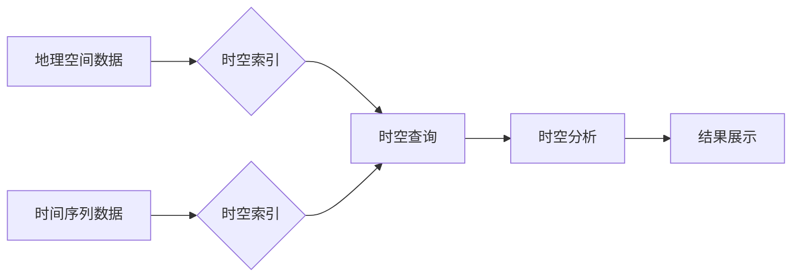

                 

## 时空数据库：管理地理位置和时间数据

> 关键词：时空数据库、地理空间数据、时间序列数据、空间查询、时间查询、时空索引、时空分析、GIS、数据库

## 1. 背景介绍

随着物联网、大数据、人工智能等技术的快速发展，海量地理位置和时间数据正在以指数级增长。这些数据蕴藏着丰富的价值，例如交通流量预测、环境监测、犯罪热点分析、精准营销等。然而，传统的数据库系统难以有效地存储、查询和分析这种时空关联的数据。

时空数据库应运而生，旨在专门处理地理位置和时间数据。它提供了一种高效、灵活的机制，可以存储、查询、分析和可视化时空数据，并支持各种时空查询和分析操作。

## 2. 核心概念与联系

时空数据库的核心概念包括：

* **地理空间数据：** 描述空间位置和形状的数据，例如点、线、面等几何图形。
* **时间序列数据：** 描述随时间变化的数据，例如温度、流量、股票价格等。
* **时空关联：** 指地理空间数据和时间序列数据之间的联系，例如某个地点在特定时间段内的温度变化。

时空数据库将地理空间数据和时间序列数据融合在一起，构建一个统一的时空模型，并通过时空索引和查询机制，实现高效的时空查询和分析。

**时空数据库架构**



## 3. 核心算法原理 & 具体操作步骤

### 3.1  算法原理概述

时空数据库的核心算法主要包括：

* **时空索引算法：** 用于快速定位时空数据，例如R-tree、Quadtree、Gridfile等。
* **时空查询算法：** 用于根据时空条件检索相关数据，例如空间交叠查询、时间范围查询、时空路径查询等。
* **时空分析算法：** 用于对时空数据进行分析，例如空间聚类分析、时空趋势分析、热点分析等。

### 3.2  算法步骤详解

**时空索引算法举例：R-tree**

1. 将地理空间数据划分为多个矩形区域（节点）。
2. 将每个节点存储在树结构中，每个节点包含其包含的地理空间数据和节点的边界矩形。
3. 根节点包含整个空间范围，子节点包含父节点的子区域。
4. 当需要查询某个区域内的地理空间数据时，从根节点开始，依次向下查找子节点，直到找到包含目标区域的节点。
5. 从包含目标区域的节点中检索相关数据。

**时空查询算法举例：空间交叠查询**

1. 将查询区域转换为几何图形。
2. 使用时空索引算法定位包含查询区域的节点。
3. 从包含查询区域的节点中检索所有与查询区域有交叠的地理空间数据。

### 3.3  算法优缺点

**R-tree算法**

* **优点：** 能够高效地处理大规模地理空间数据，支持多种空间查询操作。
* **缺点：** 对于复杂形状的地理空间数据，节点边界矩形可能存在覆盖不准确的情况，导致查询效率降低。

**时空查询算法**

* **优点：** 可以根据特定的时空条件快速检索相关数据。
* **缺点：** 对于复杂时空查询，算法复杂度可能较高，查询效率可能降低。

### 3.4  算法应用领域

时空数据库和算法广泛应用于以下领域：

* **地理信息系统 (GIS)：** 用于存储、查询和分析地理空间数据，例如地图绘制、空间分析、导航系统等。
* **交通运输：** 用于分析交通流量、预测交通拥堵、规划交通路线等。
* **环境监测：** 用于监测空气质量、水质、土壤污染等环境数据，并进行空间和时间分析。
* **城市规划：** 用于分析城市人口分布、土地利用、公共设施布局等，并进行城市规划和管理。
* **安全监控：** 用于分析视频监控数据，识别异常行为，进行犯罪预测和预防等。

## 4. 数学模型和公式 & 详细讲解 & 举例说明

### 4.1  数学模型构建

时空数据库通常使用以下数学模型来表示地理空间数据和时间序列数据：

* **地理空间模型：** 使用几何图形（点、线、面）和坐标系来表示地理空间位置和形状。
* **时间模型：** 使用时间戳、时间间隔、时间序列等来表示时间信息。

### 4.2  公式推导过程

**空间距离计算公式：**

假设有两个地理空间点，A(x1, y1) 和 B(x2, y2)，可以使用欧几里得距离公式计算它们之间的距离：

$$d(A, B) = \sqrt{(x2 - x1)^2 + (y2 - y1)^2}$$

**时间距离计算公式：**

假设有两个时间戳，t1 和 t2，可以使用时间间隔公式计算它们之间的距离：

$$d(t1, t2) = |t2 - t1|$$

### 4.3  案例分析与讲解

**案例：分析两个地点在特定时间段内的温度变化**

假设有两个地点，A 和 B，以及它们的温度时间序列数据。可以使用时空数据库查询A和B在特定时间段内的温度数据，并进行比较分析。

例如，可以查询A和B在2023年1月1日至2023年1月31日之间的平均温度，并绘制温度变化曲线进行可视化分析。

## 5. 项目实践：代码实例和详细解释说明

### 5.1  开发环境搭建

* 操作系统：Linux/Windows/macOS
* 编程语言：Python
* 数据库系统：PostGIS (支持地理空间数据)

### 5.2  源代码详细实现

```python
# 连接到PostGIS数据库
import psycopg2

conn = psycopg2.connect(
    host="localhost",
    database="my_spatial_db",
    user="myuser",
    password="mypassword"
)

# 创建游标
cur = conn.cursor()

# 查询特定时间段内A和B地点的温度数据
query = """
SELECT
    date,
    temperature
FROM
    weather_data
WHERE
    location = 'A' AND date BETWEEN '2023-01-01' AND '2023-01-31'
UNION ALL
SELECT
    date,
    temperature
FROM
    weather_data
WHERE
    location = 'B' AND date BETWEEN '2023-01-01' AND '2023-01-31'
ORDER BY
    date;
"""

cur.execute(query)

# 获取查询结果
results = cur.fetchall()

# 关闭游标和数据库连接
cur.close()
conn.close()

# 处理查询结果并进行分析
# ...
```

### 5.3  代码解读与分析

* 代码首先连接到PostGIS数据库，并创建游标。
* 然后，使用SQL查询语句查询特定时间段内A和B地点的温度数据。
* 查询结果使用`fetchall()`方法获取，并进行处理和分析。

### 5.4  运行结果展示

运行代码后，将得到A和B地点在2023年1月1日至2023年1月31日之间的温度数据，可以将其绘制成曲线图进行可视化分析。

## 6. 实际应用场景

### 6.1  交通运输

* **交通流量预测：** 使用时空数据库分析历史交通流量数据，预测未来交通流量，帮助优化交通管理和规划。
* **交通拥堵缓解：** 根据实时交通数据，引导车辆避开拥堵路段，缓解交通拥堵。
* **公共交通优化：** 分析乘客出行轨迹，优化公交线路和班次，提高公共交通效率。

### 6.2  环境监测

* **空气质量监测：** 监测空气质量数据，分析污染物分布和变化趋势，帮助制定环境保护措施。
* **水质监测：** 监测水质数据，分析污染源和污染扩散路径，保护水资源安全。
* **土壤污染监测：** 监测土壤污染数据，分析污染范围和污染程度，指导土壤修复工作。

### 6.3  城市规划

* **人口分布分析：** 分析人口分布数据，了解城市人口结构和流动趋势，为城市规划提供依据。
* **土地利用规划：** 分析土地利用数据，规划城市建设和土地开发，促进城市可持续发展。
* **公共设施布局：** 分析公共设施需求和分布，优化公共设施布局，提高城市服务水平。

### 6.4  未来应用展望

随着物联网、大数据、人工智能等技术的不断发展，时空数据库将在更多领域得到应用，例如：

* **智慧医疗：** 分析患者医疗数据，预测疾病风险，提供个性化医疗服务。
* **智慧农业：** 分析土壤、气象、作物等数据，提高农业生产效率和产品质量。
* **智慧制造：** 分析生产数据，优化生产流程，提高生产效率和产品质量。

## 7. 工具和资源推荐

### 7.1  学习资源推荐

* **书籍：**
    * 《时空数据库》
    * 《地理空间数据库》
* **在线课程：**
    * Coursera: Spatial Data Analysis
    * edX: Introduction to Geographic Information Systems (GIS)

### 7.2  开发工具推荐

* **PostGIS:** 开源的地理空间数据库扩展，支持PostgreSQL数据库。
* **GeoServer:** 开源的地理空间服务器，提供WFS、WMS等服务。
* **QGIS:** 开源的地理信息系统软件，支持多种地理空间数据格式和分析工具。

### 7.3  相关论文推荐

* **Spatial Databases: Principles and Applications**
* **Time Series Analysis and Forecasting**
* **Spatial-Temporal Data Mining: Trends and Challenges**

## 8. 总结：未来发展趋势与挑战

### 8.1  研究成果总结

时空数据库技术已经取得了显著的进展，能够有效地存储、查询和分析地理空间数据和时间序列数据。

### 8.2  未来发展趋势

* **更强大的时空索引算法：** 提高时空查询效率，支持更复杂的空间和时间查询。
* **更智能的时空分析算法：** 自动发现时空模式和趋势，提供更深入的分析结果。
* **更完善的时空数据模型：** 支持更丰富的时空数据类型和关系，例如轨迹数据、事件数据等。
* **更强大的云计算支持：** 利用云计算平台的强大计算能力和存储能力，构建更大型、更复杂的时空数据库。

### 8.3  面临的挑战

* **数据质量问题：** 时空数据往往存在不完整、不准确、不一致等问题，需要进行数据清洗和预处理。
* **数据隐私问题：** 时空数据可能包含敏感信息，需要采取措施保护数据隐私。
* **算法复杂度问题：** 一些时空查询和分析算法复杂度较高，需要进行优化和改进。

### 8.4  研究展望

未来，时空数据库技术将继续发展，在更多领域发挥重要作用。

## 9. 附录：常见问题与解答

* **什么是时空数据库？**

时空数据库是一种专门用于存储、查询和分析地理空间数据和时间序列数据的数据库系统。

* **时空数据库有哪些应用场景？**

时空数据库广泛应用于交通运输、环境监测、城市规划、智慧医疗、智慧农业等领域。

* **如何选择合适的时空数据库系统？**

选择时空数据库系统时，需要考虑数据规模、查询需求、分析需求、预算等因素。

* **如何进行时空数据分析？**

时空数据分析可以使用多种算法和工具，例如空间聚类分析、时空趋势分析、热点分析等。

* **时空数据库的未来发展趋势是什么？**

时空数据库的未来发展趋势包括更强大的时空索引算法、更智能的时空分析算法、更完善的时空数据模型、更强大的云计算支持等。


作者：禅与计算机程序设计艺术 / Zen and the Art of Computer Programming 
<end_of_turn>

