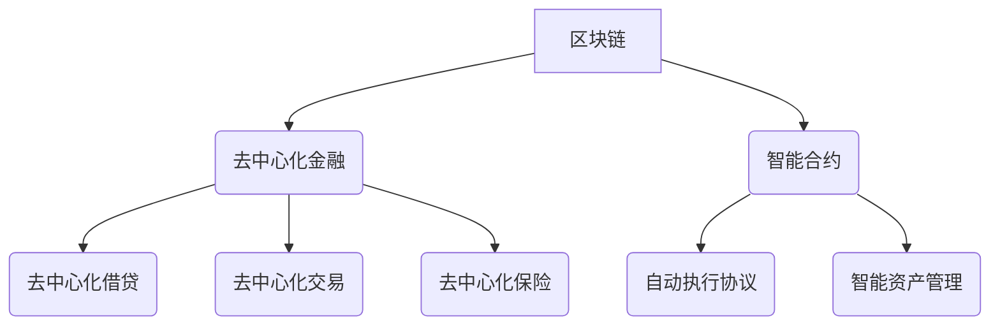

                 

## 未来的区块链：2050年的去中心化金融与智能合约

> 关键词：区块链、去中心化金融 (DeFi)、智能合约、隐私计算、量子计算、Web3、元宇宙、数字身份

### 1. 背景介绍

2023年，区块链技术已经从最初的比特币概念发展成为一个庞大而复杂的生态系统。去中心化金融 (DeFi) 和智能合约作为区块链技术的核心应用，正在深刻地改变着金融服务和商业模式。然而，我们所处的今天只是区块链技术发展史的序章。

展望未来，区块链技术将经历一场革命性的变革，其影响力将远远超出我们目前的想象。2050年，区块链将不再仅仅是金融领域的工具，而是构建未来数字世界的基石。

### 2. 核心概念与联系

**2.1 去中心化金融 (DeFi)**

DeFi 旨在通过区块链技术构建一个去中心化的金融系统，消除传统金融机构的中间环节，让用户能够直接参与金融服务。

**2.2 智能合约**

智能合约是一种自动执行的协议，由代码和逻辑规则定义。当合约条件满足时，智能合约会自动执行预先定义的操作，无需人工干预。

**2.3  区块链架构**

区块链是一个分布式、透明、不可篡改的账本系统。它由多个节点组成，每个节点都拥有完整的区块链数据副本。

**2.4  核心概念关系图**



### 3. 核心算法原理 & 具体操作步骤

**3.1 算法原理概述**

区块链技术的核心算法包括：

* **工作量证明 (Proof of Work, PoW)**：通过计算复杂哈希值来验证交易并生成新的区块。
* **权益证明 (Proof of Stake, PoS)**：通过持有代币数量来验证交易和生成新的区块。
* **密码学算法**: 用于加密和解密数据，保证交易安全性和隐私性。

**3.2 算法步骤详解**

以工作量证明算法为例，其具体操作步骤如下：

1. **交易广播**: 用户发起交易，将交易信息广播到网络中。
2. **区块打包**: 节点将多个交易打包成一个区块。
3. **哈希计算**: 节点计算区块的哈希值，并将其与前一个区块的哈希值进行比较。
4. **工作量证明**: 节点需要进行大量的计算，找到一个满足特定条件的哈希值。
5. **区块验证**: 其他节点验证该哈希值是否合法，并添加到区块链中。

**3.3 算法优缺点**

**工作量证明算法**

* **优点**: 具有较高的安全性，难以被攻击。
* **缺点**: 耗能高，效率低。

**权益证明算法**

* **优点**: 耗能低，效率高。
* **缺点**: 存在“富裕者越来越富”的问题。

**3.4 算法应用领域**

区块链算法广泛应用于：

* **数字货币**: 比特币、以太坊等。
* **去中心化金融**: DeFi 协议。
* **供应链管理**: 追踪商品的来源和流通路径。
* **身份验证**: 创建安全的数字身份。

### 4. 数学模型和公式 & 详细讲解 & 举例说明

**4.1 数学模型构建**

区块链的安全性基于密码学原理，其中哈希函数是核心算法之一。哈希函数将任意长度的数据映射到固定长度的哈希值，具有以下特性：

* **单向性**: 从哈希值无法推导出原始数据。
* **抗碰撞性**: 很难找到两个不同的输入数据产生相同的哈希值。

**4.2 公式推导过程**

哈希函数的数学模型可以表示为：

$$H(x) = y$$

其中：

* $H$ 代表哈希函数。
* $x$ 代表输入数据。
* $y$ 代表哈希值。

**4.3 案例分析与讲解**

假设我们使用 SHA-256 哈希函数对字符串 "Hello, world!" 进行哈希运算，得到哈希值：

$$H("Hello, world!") = 
b'e3b0c44298fc1c149afbf4c8996fb92427ae41e4649b934ca495991b7852b855'$$

可以看到，即使改变字符串中的单个字符，哈希值也会发生完全不同的变化。

### 5. 项目实践：代码实例和详细解释说明

**5.1 开发环境搭建**

使用以下工具搭建开发环境：

* **编程语言**: Solidity (以太坊智能合约语言)
* **IDE**: Remix IDE (在线智能合约开发环境)
* **区块链网络**: 以太坊测试网络 (Ropsten, Goerli)

**5.2 源代码详细实现**

以下是一个简单的智能合约代码示例，用于实现一个简单的去中心化投票系统：

```solidity
pragma solidity ^0.8.0;

contract Voting {
    mapping(address => bool) public voters;
    address[] public candidates;
    uint public voteCount;

    constructor(address[] memory _candidates) {
        candidates = _candidates;
    }

    function vote(address _candidate) public {
        require(!voters[msg.sender], "You have already voted.");
        require(_candidate != address(0), "Invalid candidate address.");
        voters[msg.sender] = true;
        voteCount++;
    }

    function getVoteCount(address _candidate) public view returns (uint) {
        // ...
    }
}
```

**5.3 代码解读与分析**

* `mapping(address => bool) public voters;`: 定义一个映射，用于记录已投票的用户地址。
* `address[] public candidates;`: 定义一个数组，用于存储候选人地址。
* `uint public voteCount;`: 定义一个变量，用于记录总投票数。
* `constructor(address[] memory _candidates)`: 构造函数，用于初始化候选人地址。
* `function vote(address _candidate)`: 投票函数，用于记录用户投票给特定候选人的信息。
* `function getVoteCount(address _candidate)`: 获取特定候选人投票数的函数。

**5.4 运行结果展示**

通过部署智能合约到以太坊测试网络，并使用 Remix IDE 进行交互，可以模拟投票过程，并查看投票结果。

### 6. 实际应用场景

**6.1 去中心化金融 (DeFi)**

* **去中心化借贷**: 用户可以借贷加密货币，无需依赖传统金融机构。
* **去中心化交易**: 用户可以直接进行加密货币交易，无需第三方平台。
* **去中心化保险**: 用户可以购买去中心化的保险产品，保障资产安全。

**6.2 数字身份**

* **身份验证**: 使用区块链技术创建安全的数字身份，用于身份验证和授权。
* **数据隐私**: 用户可以控制自己的数据，并选择与哪些服务提供商共享数据。

**6.3 元宇宙**

* **虚拟资产**: 使用区块链技术创建虚拟资产，例如虚拟土地、虚拟物品等。
* **游戏经济**: 使用区块链技术构建去中心化的游戏经济，让玩家拥有游戏资产的所有权。

**6.4 未来应用展望**

* **供应链管理**: 使用区块链技术追踪商品的来源和流通路径，提高供应链透明度和效率。
* **医疗保健**: 使用区块链技术存储和管理医疗数据，提高数据安全性和隐私性。
* **教育**: 使用区块链技术颁发数字证书，验证学历和技能。

### 7. 工具和资源推荐

**7.1 学习资源推荐**

* **书籍**:
    * 《Mastering Ethereum》
    * 《Blockchain Basics》
* **在线课程**:
    * Coursera: Blockchain Specialization
    * Udemy: Blockchain Development

**7.2 开发工具推荐**

* **Remix IDE**: 在线智能合约开发环境
* **Truffle Suite**: 智能合约开发工具
* **Ganache**: 以太坊测试网络

**7.3 相关论文推荐**

* **Bitcoin: A Peer-to-Peer Electronic Cash System**
* **Ethereum: A Secure Decentralised General-Purpose Platform**

### 8. 总结：未来发展趋势与挑战

**8.1 研究成果总结**

区块链技术已经取得了显著的进展，其应用场景不断拓展。去中心化金融和智能合约成为区块链技术的重要应用领域，并正在改变着金融服务和商业模式。

**8.2 未来发展趋势**

* **隐私计算**: 加强区块链技术的隐私保护能力，满足用户对数据安全和隐私的需求。
* **量子计算**: 利用量子计算技术提高区块链技术的安全性、效率和可扩展性。
* **Web3**: 基于区块链技术的下一代互联网，赋予用户更多控制权和自主权。
* **元宇宙**: 将区块链技术应用于元宇宙，构建更沉浸式和交互式的虚拟世界。

**8.3 面临的挑战**

* **可扩展性**: 区块链技术的可扩展性仍然是一个挑战，需要找到更有效的解决方案。
* **监管**: 区块链技术的监管框架尚不完善，需要政府和行业共同努力制定合理的监管政策。
* **用户体验**: 区块链技术的用户体验仍然需要提升，需要开发更易于使用的应用程序和工具。

**8.4 研究展望**

未来，区块链技术将继续发展和演进，并对我们的生活产生更深远的影响。我们需要加强对区块链技术的研究和探索，为构建更安全、更透明、更公平的数字世界贡献力量。

### 9. 附录：常见问题与解答

**9.1 什么是区块链？**

区块链是一种分布式、透明、不可篡改的账本系统，它记录着所有交易信息，并通过加密技术保证数据的安全性和完整性。

**9.2 区块链有什么优势？**

区块链技术的优势包括：

* **去中心化**: 数据分散存储，不存在单点故障。
* **透明度**: 所有交易信息公开可查。
* **安全性**: 加密技术保证数据安全和不可篡改。
* **效率**: 去中心化架构提高了交易效率。

**9.3 区块链有哪些应用场景？**

区块链技术的应用场景非常广泛，包括：

* **数字货币**: 比特币、以太坊等。
* **去中心化金融**: DeFi 协议。
* **供应链管理**: 追踪商品的来源和流通路径。
* **身份验证**: 创建安全的数字身份。


作者：禅与计算机程序设计艺术 / Zen and the Art of Computer Programming 
<end_of_turn>

