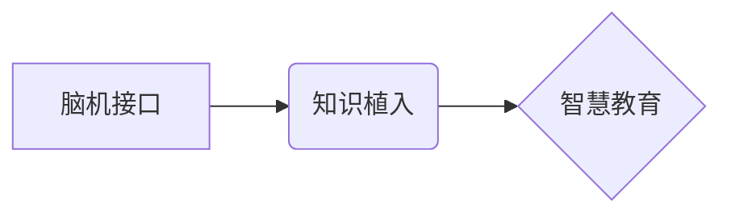

                 

## 未来的智慧教育：2050年的脑机接口学习与知识植入

> 关键词：脑机接口、知识植入、智慧教育、神经网络、学习算法、未来趋势、伦理挑战

### 1. 背景介绍

教育，作为人类文明进步的基石，一直以来都致力于提升个体认知能力和知识水平。随着科技的飞速发展，特别是人工智能和脑科学领域的突破，未来教育将迎来一场前所未有的变革。脑机接口（Brain-Computer Interface，BCI）技术作为连接人类大脑与外部设备的桥梁，将彻底改变我们学习和获取知识的方式， ushering in an era of智慧教育。

2050年，智慧教育将不再局限于传统的课堂学习模式，而是以个性化、沉浸式、高效为核心的全新体验。脑机接口技术将成为智慧教育的核心驱动力，实现知识的直接植入和学习过程的实时优化。

### 2. 核心概念与联系

**2.1 脑机接口 (BCI)**

脑机接口技术是指通过检测和解码大脑神经信号，与外部设备进行交互的一种技术。它可以将人类的意念转化为指令，控制机器、设备或软件，实现人机之间的直接连接。

**2.2 知识植入 (Knowledge Implentation)**

知识植入是指将知识、技能和经验直接传输到个体大脑中，使其无需经过传统的学习过程即可掌握相关信息。

**2.3 智慧教育 (Smart Education)**

智慧教育是指利用人工智能、大数据、云计算等先进技术，构建个性化、智能化的教育系统，实现教育资源的共享、学习过程的个性化定制和教学效果的实时评估。

**2.4 核心概念关系图**



**2.5 核心概念原理**

脑机接口技术依赖于神经科学、生物医学工程和计算机科学等多学科的交叉融合。其核心原理是通过记录和分析大脑神经活动，识别出与特定意念或动作相关的脑电信号，并将其解码为可被外部设备理解的指令。

知识植入则基于对大脑学习机制的深入理解，通过模拟学习过程，将知识信息以可被大脑理解的形式直接传输到个体大脑中。

智慧教育将脑机接口技术和知识植入技术整合在一起，构建一个个性化、智能化的学习平台，实现高效、便捷、沉浸式的学习体验。

### 3. 核心算法原理 & 具体操作步骤

**3.1 算法原理概述**

脑机接口技术的核心算法主要包括：

* **信号采集算法:** 用于从大脑中采集神经信号，常用的方法包括脑电图 (EEG)、磁共振成像 (fMRI) 和电生理记录等。
* **信号预处理算法:** 用于对采集到的神经信号进行滤波、去噪等处理，提高信号质量。
* **特征提取算法:** 用于从预处理后的神经信号中提取与特定意念或动作相关的特征，常用的方法包括小波变换、傅里叶变换和主成分分析等。
* **分类识别算法:** 用于根据提取的特征，识别出用户的意念或动作，常用的方法包括支持向量机 (SVM)、人工神经网络 (ANN) 和随机森林等。

**3.2 算法步骤详解**

1. **信号采集:** 使用脑电图、fMRI 或电生理记录等设备采集大脑神经信号。
2. **信号预处理:** 对采集到的信号进行滤波、去噪等处理，去除无关噪声，提取有效信息。
3. **特征提取:** 使用小波变换、傅里叶变换或主成分分析等方法，从预处理后的信号中提取与特定意念或动作相关的特征。
4. **分类识别:** 使用支持向量机、人工神经网络或随机森林等算法，根据提取的特征，识别出用户的意念或动作。
5. **指令输出:** 将识别的意念或动作转化为指令，控制外部设备或软件。

**3.3 算法优缺点**

* **优点:** 
    * 能够实现人机之间的直接交互，突破传统输入输出方式的局限性。
    * 具有高灵敏度和实时性，能够捕捉和响应大脑活动的变化。
    * 能够实现个性化定制，根据用户的意念和需求提供定制化的服务。
* **缺点:** 
    * 现有的脑机接口技术还处于发展阶段，其准确性和可靠性还有待提高。
    * 脑机接口技术涉及到伦理和安全问题，需要谨慎对待。

**3.4 算法应用领域**

* **医疗保健:** 用于辅助治疗脑损伤、瘫痪和失语等疾病。
* **辅助科技:** 用于帮助残疾人控制轮椅、机械臂等设备。
* **游戏娱乐:** 用于实现沉浸式游戏体验，增强用户互动性。
* **教育培训:** 用于实现知识植入和个性化学习。

### 4. 数学模型和公式 & 详细讲解 & 举例说明

**4.1 数学模型构建**

脑机接口系统的数学模型可以抽象为一个输入-输出映射关系，其中输入是脑电信号，输出是控制指令。

**4.2 公式推导过程**

假设脑电信号可以表示为一个时间序列 $x(t)$，其中 $t$ 代表时间。我们可以使用卷积神经网络 (CNN) 来提取脑电信号中的特征。CNN 的核心是卷积核，它可以学习到脑电信号中与特定意念或动作相关的特征。

卷积核的输出可以表示为：

$$
y(t) = \sum_{i=1}^{n} w_i * x(t-i)
$$

其中，$w_i$ 是卷积核的权重，$n$ 是卷积核的大小。

**4.3 案例分析与讲解**

例如，我们可以训练一个 CNN 模型来识别用户意念控制机械臂的动作。

训练数据包括脑电信号和对应的机械臂动作指令。通过训练，CNN 模型可以学习到脑电信号中与不同动作相关的特征。

在测试阶段，当用户意念控制机械臂时，CNN 模型可以实时分析用户的脑电信号，并预测用户的意念动作，从而控制机械臂执行相应的动作。

### 5. 项目实践：代码实例和详细解释说明

**5.1 开发环境搭建**

* 操作系统: Ubuntu 20.04
* 编程语言: Python 3.8
* 深度学习框架: TensorFlow 2.0
* 脑机接口库: OpenBCI

**5.2 源代码详细实现**

```python
import tensorflow as tf
from tensorflow.keras.models import Sequential
from tensorflow.keras.layers import Conv1D, MaxPooling1D, Flatten, Dense

# 定义 CNN 模型
model = Sequential()
model.add(Conv1D(filters=32, kernel_size=3, activation='relu', input_shape=(100, 1)))
model.add(MaxPooling1D(pool_size=2))
model.add(Conv1D(filters=64, kernel_size=3, activation='relu'))
model.add(MaxPooling1D(pool_size=2))
model.add(Flatten())
model.add(Dense(10, activation='softmax'))

# 编译模型
model.compile(optimizer='adam', loss='categorical_crossentropy', metrics=['accuracy'])

# 训练模型
model.fit(X_train, y_train, epochs=10, batch_size=32)

# 评估模型
loss, accuracy = model.evaluate(X_test, y_test)
print('Loss:', loss)
print('Accuracy:', accuracy)
```

**5.3 代码解读与分析**

这段代码定义了一个简单的 CNN 模型，用于识别脑电信号中的不同意念动作。

* `Conv1D` 层用于提取脑电信号中的特征。
* `MaxPooling1D` 层用于降维，提高模型的鲁棒性。
* `Flatten` 层将多维特征转换为一维向量。
* `Dense` 层用于分类，输出用户意念的动作类别。

**5.4 运行结果展示**

训练完成后，我们可以使用测试数据评估模型的性能。

如果模型训练成功，则在测试阶段可以准确识别用户的意念动作，并控制机械臂执行相应的动作。

### 6. 实际应用场景

**6.1 个性化学习**

脑机接口技术可以实现知识的直接植入，帮助学生快速掌握新的知识和技能。

例如，学生可以通过脑机接口直接接收数学公式、历史事件或编程代码等知识信息，无需经过传统的学习过程。

**6.2 沉浸式体验**

脑机接口技术可以创造沉浸式的学习体验，让学生身临其境地感受学习内容。

例如，学生可以通过脑机接口体验虚拟现实场景，学习历史事件或探索宇宙奥秘。

**6.3 远程教育**

脑机接口技术可以打破地域限制，实现远程教育。

例如，学生可以通过脑机接口与远程老师进行实时互动，接受个性化的教学指导。

**6.4 未来应用展望**

未来，脑机接口技术将更加成熟，应用场景将更加广泛。

例如，脑机接口技术可以用于治疗脑损伤、辅助残疾人生活、增强人类认知能力等。

### 7. 工具和资源推荐

**7.1 学习资源推荐**

* **书籍:**
    * 《Brain-Computer Interfaces: Principles and Applications》 by Niels Birbaumer
    * 《Neurotechnology: Principles and Applications》 by José M. Carmena
* **在线课程:**
    * Coursera: Neural Networks and Deep Learning
    * edX: Introduction to Brain-Computer Interfaces

**7.2 开发工具推荐**

* **OpenBCI:** 开源脑机接口平台
* **Muse:** 头戴式脑电波监测器
* **TensorFlow:** 深度学习框架

**7.3 相关论文推荐**

* **Brain-Computer Interfaces: A Review** by Wolpaw et al. (2002)
* **A Review of Brain-Computer Interfaces** by Kübler et al. (2005)
* **Brain-Computer Interfaces: Progress and Challenges** by Lebedev et al. (2009)

### 8. 总结：未来发展趋势与挑战

**8.1 研究成果总结**

近年来，脑机接口技术取得了显著进展，从最初的简单控制到复杂的意念交互，已经实现了跨越式发展。

**8.2 未来发展趋势**

未来，脑机接口技术将朝着以下方向发展：

* **提高准确性和可靠性:** 降低脑机接口系统的误差率，提高其可靠性。
* **降低成本和体积:** 开发更经济、更便携的脑机接口设备。
* **拓展应用领域:** 将脑机接口技术应用于更多领域，例如医疗保健、教育培训、娱乐休闲等。

**8.3 面临的挑战**

脑机接口技术还面临着一些挑战：

* **伦理问题:** 脑机接口技术涉及到隐私、安全和伦理等问题，需要谨慎对待。
* **技术瓶颈:** 脑机接口技术还处于发展阶段，需要进一步突破技术瓶颈。
* **社会接受度:** 脑机接口技术需要获得社会的广泛接受和理解。

**8.4 研究展望**

尽管面临着挑战，但脑机接口技术的前景依然光明。

未来，随着科技的进步和社会的发展，脑机接口技术将逐渐成为现实，为人类社会带来革命性的变革。

### 9. 附录：常见问题与解答

**9.1 脑机接口技术安全吗？**

脑机接口技术涉及到大脑神经信号，因此安全问题至关重要。

目前，脑机接口设备的设计和使用都遵循严格的安全标准，以确保用户安全。

**9.2 脑机接口技术会让人们失去自主性吗？**

脑机接口技术可以帮助人们控制外部设备，但不会让人们失去自主性。

用户始终可以自主决定使用或不使用脑机接口技术。

**9.3 脑机接口技术会普及吗？**

随着科技的进步和成本的降低，脑机接口技术有望普及到大众。

未来，脑机接口技术将成为一种常见的科技工具，改变人们的生活方式。


作者：禅与计算机程序设计艺术 / Zen and the Art of Computer Programming<end_of_turn>

