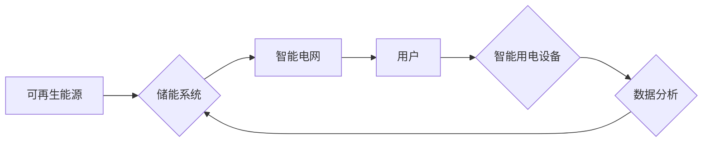

                 

## 未来的智慧能源：2050年的储能技术与智能用电

> 关键词：储能技术、智能用电、可再生能源、人工智能、机器学习、分布式能源、微电网、能源管理系统

### 1. 背景介绍

随着全球对清洁能源的日益重视，可再生能源发电正迅速发展。然而，可再生能源的间歇性特性带来了巨大的挑战，如何有效地存储和利用这些可再生能源成为实现可持续能源发展的重要课题。同时，随着智能家居、电动汽车等技术的普及，电力需求呈现出多样化、个性化和动态化的趋势。如何优化电力供应和需求，提高能源利用效率，也成为亟待解决的问题。

2050年，智慧能源将成为能源行业发展的主流方向。未来，储能技术将扮演着至关重要的角色，它将与智能用电系统深度融合，共同构建一个高效、可靠、可持续的能源系统。

### 2. 核心概念与联系

**2.1 储能技术**

储能技术是指将电能、热能、化学能等形式的能量存储起来，并在需要时释放出来，以满足电力需求的系统。

**2.2 智能用电**

智能用电是指利用智能传感器、通信技术和数据分析等手段，实现对电力负荷的实时监测、控制和优化，以提高能源利用效率和用户体验。

**2.3 核心概念联系**

储能技术和智能用电系统相互补充，共同构成了智慧能源的核心。储能技术为智能用电提供能量保障，而智能用电系统则通过优化电力需求，提高储能技术的利用效率。

**2.4  Mermaid 流程图**



### 3. 核心算法原理 & 具体操作步骤

**3.1 算法原理概述**

智能用电系统通常采用机器学习算法来预测电力需求，并根据预测结果优化电力调度和控制。常见的算法包括：

* **ARIMA模型:** 自回归移动平均模型，用于预测时间序列数据，如电力负荷。
* **神经网络:** 能够学习复杂数据模式，用于预测电力需求和优化能源管理策略。
* **强化学习:** 通过试错学习，优化电力调度和控制策略，以最大化能源利用效率。

**3.2 算法步骤详解**

以ARIMA模型为例，其具体操作步骤如下：

1. **数据收集:** 收集历史电力负荷数据，并进行清洗和预处理。
2. **模型识别:** 使用统计方法识别ARIMA模型的参数，如p、d、q。
3. **模型训练:** 使用训练数据训练ARIMA模型，并评估模型的预测精度。
4. **模型预测:** 使用训练好的模型预测未来电力负荷。
5. **策略优化:** 根据预测结果，优化电力调度和控制策略，例如调整发电计划、控制储能系统充放电，并控制用户用电设备的运行时间。

**3.3 算法优缺点**

* **优点:** ARIMA模型相对简单易于理解和实现，并且在预测短期电力负荷方面表现良好。
* **缺点:** ARIMA模型对数据分布和时间序列特征有较高的要求，难以处理复杂非线性数据。

**3.4 算法应用领域**

ARIMA模型和神经网络等算法广泛应用于电力负荷预测、储能系统优化、智能电网调度等领域。

### 4. 数学模型和公式 & 详细讲解 & 举例说明

**4.1 数学模型构建**

ARIMA模型的数学表达式如下：

$$
\phi(B) (1-B)^d y_t = \theta(B) \epsilon_t
$$

其中：

* $y_t$ 表示时间t的电力负荷值。
* $B$ 是后向差分算子，即 $B^k y_t = y_{t-k}$。
* $\phi(B)$ 和 $\theta(B)$ 分别是自回归和移动平均的系数多项式。
* $d$ 是差分阶数。
* $\epsilon_t$ 是白噪声误差项。

**4.2 公式推导过程**

ARIMA模型的推导过程较为复杂，涉及时间序列分析、统计建模等知识。

**4.3 案例分析与讲解**

假设我们收集了某地区过去10年的每月电力负荷数据，并使用ARIMA模型进行预测。通过模型识别和训练，我们得到以下ARIMA模型参数：

* $p = 1$
* $d = 1$
* $q = 2$

使用这些参数，我们可以预测未来12个月的电力负荷值。

### 5. 项目实践：代码实例和详细解释说明

**5.1 开发环境搭建**

* 操作系统: Ubuntu 20.04
* Python 版本: 3.8
* 必要的库: pandas, statsmodels, matplotlib

**5.2 源代码详细实现**

```python
import pandas as pd
from statsmodels.tsa.arima.model import ARIMA
import matplotlib.pyplot as plt

# 数据加载
data = pd.read_csv('electricity_load.csv', index_col='Date', parse_dates=True)

# 数据预处理
data = data['Load'].dropna()

# 模型训练
model = ARIMA(data, order=(1, 1, 2))
model_fit = model.fit()

# 模型预测
forecast = model_fit.predict(start=len(data), end=len(data)+11)

# 结果展示
plt.plot(data, label='实际数据')
plt.plot(forecast, label='预测数据')
plt.legend()
plt.show()
```

**5.3 代码解读与分析**

* 代码首先加载电力负荷数据，并进行预处理，例如删除缺失值。
* 然后，使用ARIMA模型进行模型训练，并使用训练好的模型预测未来12个月的电力负荷值。
* 最后，将实际数据和预测数据绘制成图表，以便直观地观察预测结果。

**5.4 运行结果展示**

运行代码后，将生成一个图表，展示实际电力负荷数据和模型预测数据。

### 6. 实际应用场景

**6.1 电力系统优化**

智能用电系统可以根据预测的电力负荷，优化电力调度和控制策略，提高电力系统运行效率，减少电力浪费。

**6.2 储能系统管理**

智能用电系统可以根据预测的电力负荷和可再生能源发电情况，优化储能系统的充放电策略，提高储能系统的利用效率。

**6.3 用户个性化服务**

智能用电系统可以根据用户的用电习惯和需求，提供个性化的用电服务，例如智能电价、用电提醒等。

**6.4 未来应用展望**

未来，智能用电系统将更加智能化、个性化和自动化，并与其他智能技术，如物联网、人工智能等深度融合，构建一个更加高效、可靠、可持续的智慧能源系统。

### 7. 工具和资源推荐

**7.1 学习资源推荐**

* **书籍:**
    * 《智能电网》
    * 《电力系统优化与控制》
* **在线课程:**
    * Coursera: 电力系统与智能电网
    * edX: 智能电网与分布式能源

**7.2 开发工具推荐**

* **Python:** 广泛用于数据分析、机器学习和软件开发。
* **TensorFlow:** 深度学习框架，用于构建和训练神经网络模型。
* **PyTorch:** 深度学习框架，具有灵活性和易用性。

**7.3 相关论文推荐**

* **智能用电系统综述:**
    * "A Review of Smart Grid Technologies and Applications"
* **电力负荷预测:**
    * "Short-Term Load Forecasting Using Machine Learning Techniques"
* **储能系统优化:**
    * "Optimal Control of Energy Storage Systems in Smart Grids"

### 8. 总结：未来发展趋势与挑战

**8.1 研究成果总结**

近年来，储能技术和智能用电系统取得了显著进展，为构建智慧能源系统提供了重要的技术支撑。

**8.2 未来发展趋势**

* **储能技术:** 
    * 发展更高效、更安全的储能技术，例如固态电池、氢能储能等。
    * 降低储能成本，提高储能技术的经济性。
* **智能用电系统:** 
    * 提高智能用电系统的预测精度和控制能力。
    * 加强智能用电系统的安全性、可靠性和隐私保护。
* **智慧能源系统:** 
    * 深度融合储能技术、智能用电系统、可再生能源等技术，构建一个更加高效、可靠、可持续的智慧能源系统。

**8.3 面临的挑战**

* **技术挑战:** 
    * 储能技术成本高、寿命短等问题需要进一步解决。
    * 智能用电系统的预测精度和控制能力还有待提高。
* **政策挑战:** 
    * 需要制定更加完善的政策法规，支持智慧能源系统的发展。
* **社会挑战:** 
    * 需要提高公众对智慧能源系统的认知和接受度。

**8.4 研究展望**

未来，我们将继续致力于储能技术和智能用电系统的研究，为构建智慧能源系统贡献力量。


### 9. 附录：常见问题与解答

**9.1 Q: 储能技术有哪些类型？**

**A:** 常见的储能技术类型包括：

* 电化学储能: 电池、超级电容器
* 机械储能:  pumped hydro storage, compressed air energy storage
* 热能储能: 热水储能, 熔盐储能
* 其他: 氢能储能, 燃料电池

**9.2 Q: 智能用电系统有哪些应用场景？**

**A:** 智能用电系统应用场景广泛，包括：

* 电力系统优化
* 储能系统管理
* 用户个性化服务
* 电力市场交易

**9.3 Q: 如何选择合适的储能技术？**

**A:** 选择合适的储能技术需要考虑多种因素，例如：

* 储能容量
* 储能时间
* 储能成本
* 环境影响


作者：禅与计算机程序设计艺术 / Zen and the Art of Computer Programming 
<end_of_turn>

