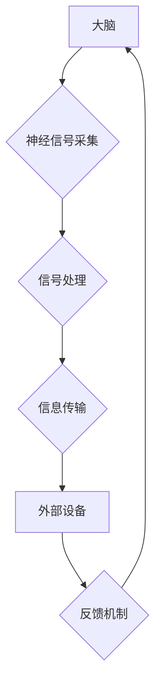

                 

## 未来的脑机接口：2050年的意念控制与思维上传

> 关键词：脑机接口、意念控制、思维上传、神经网络、深度学习、生物电子学、人工智能、未来科技

### 1. 背景介绍

人类对自身认知的探索永无止境。从语言的诞生到文字的出现，再到互联网的普及，每一次科技进步都深刻地改变着我们与世界交互的方式。如今，脑机接口 (Brain-Computer Interface, BCI) 作为一项前沿技术，正站在历史的十字路口，有望开启人类认知能力的新纪元。

脑机接口是指将大脑与外部设备直接连接，实现信息交互的技术。它可以帮助我们控制机器、获取信息、甚至上传和下载意识。近年来，随着神经科学、人工智能、生物电子学等领域的快速发展，脑机接口技术取得了长足进步，从最初的辅助医疗应用，逐渐扩展到游戏、娱乐、教育等多个领域。

### 2. 核心概念与联系

脑机接口的核心概念是将大脑的电信号转换为计算机可理解的指令，并反过来将计算机指令转化为大脑可感知的信号。

**2.1 核心概念原理**

* **神经信号采集:** 通过植入脑部或佩戴头戴式设备，采集大脑神经元的电信号。
* **信号处理:** 使用算法对采集到的神经信号进行解码，识别出特定的脑电波模式，例如对应不同动作、意念或情感的脑电活动。
* **信息传输:** 将解码后的信息传输到外部设备，例如计算机、机器人或其他智能设备。
* **反馈机制:** 将外部设备的反馈信息转化为大脑可感知的信号，例如视觉、听觉或触觉刺激，形成闭环交互。

**2.2 核心架构**



### 3. 核心算法原理 & 具体操作步骤

**3.1 算法原理概述**

脑机接口算法的核心是将复杂的神经信号转换为可理解的指令。常用的算法包括：

* **特征提取:** 从脑电信号中提取特征，例如频率、幅度、波形等，用于识别特定的脑电活动模式。
* **分类算法:** 使用机器学习算法，例如支持向量机 (SVM)、决策树、神经网络等，对提取的特征进行分类，识别不同的意念或动作。
* **解码算法:** 根据分类结果，解码出对应的指令，例如控制机器手臂的运动方向、速度等。

**3.2 算法步骤详解**

1. **数据采集:** 使用脑电采集设备，例如EEG头戴式传感器或脑电植入芯片，采集脑电信号。
2. **数据预处理:** 对采集到的脑电信号进行滤波、去噪等预处理，去除无关信息，提取有效信号。
3. **特征提取:** 使用特定的算法，例如小波变换、傅里叶变换等，从预处理后的脑电信号中提取特征。
4. **分类模型训练:** 使用机器学习算法，例如SVM、决策树、神经网络等，对提取的特征进行分类，建立脑电活动与指令的映射关系。
5. **解码与控制:** 将新的脑电信号输入到训练好的分类模型中，解码出对应的指令，并将其发送到外部设备，控制设备的运行。

**3.3 算法优缺点**

* **优点:** 
    * 能够实现无介质、无接触的脑机交互。
    * 具有较高的实时性，能够快速响应用户的意念。
    * 应用范围广泛，可以用于医疗辅助、娱乐、控制机器人等多个领域。
* **缺点:** 
    * 信号采集精度有限，容易受到噪声干扰。
    * 算法复杂度高，需要大量的训练数据和计算资源。
    * 存在伦理和安全问题，例如数据隐私、意识上传等。

**3.4 算法应用领域**

* **医疗辅助:** 帮助瘫痪患者控制轮椅、机械臂等设备，恢复部分肢体功能。
* **娱乐:** 实现游戏中的意念控制，例如控制游戏角色的行动、射击等。
* **教育:** 帮助学生进行脑力训练，提高学习效率。
* **军事:** 开发脑机接口武器，实现远程控制和意识共享。

### 4. 数学模型和公式 & 详细讲解 & 举例说明

**4.1 数学模型构建**

脑机接口算法的数学模型通常基于统计学习理论，将脑电信号视为随机变量，并使用概率论和统计学方法进行分析和建模。

**4.2 公式推导过程**

例如，使用支持向量机 (SVM) 进行脑电信号分类，其核心公式为：

$$
w^* = argmin_{w} \frac{1}{2} ||w||^2 + C \sum_{i=1}^{N} \xi_i
$$

其中：

* $w^*$ 是最优的权重向量。
* $||w||^2$ 是权重向量的 L2 范数，用于控制模型的复杂度。
* $C$ 是惩罚参数，用于平衡模型的分类精度和泛化能力。
* $\xi_i$ 是每个样本的松弛变量，用于容忍分类错误。

**4.3 案例分析与讲解**

假设我们使用 SVM 对脑电信号进行分类，目标是识别用户意念中的“向上”和“向下”两种动作。

1. 首先，我们需要收集大量的脑电数据，并将其标记为“向上”或“向下”两种类别。
2. 然后，使用 SVM 算法对这些数据进行训练，学习出脑电信号与动作的映射关系。
3. 最后，将新的脑电信号输入到训练好的 SVM 模型中，解码出对应的动作指令。

### 5. 项目实践：代码实例和详细解释说明

**5.1 开发环境搭建**

* 操作系统: Ubuntu 20.04 LTS
* Python 版本: 3.8.10
* 必要的库: NumPy, Scikit-learn, Matplotlib

**5.2 源代码详细实现**

```python
import numpy as np
from sklearn.svm import SVC
from sklearn.model_selection import train_test_split

# 假设 brain_data 是脑电信号数据，labels 是对应的动作类别
X_train, X_test, y_train, y_test = train_test_split(brain_data, labels, test_size=0.2)

# 使用 SVM 算法训练模型
clf = SVC(kernel='linear')
clf.fit(X_train, y_train)

# 对测试数据进行预测
y_pred = clf.predict(X_test)

# 计算模型的准确率
accuracy = np.mean(y_pred == y_test)
print(f"模型准确率: {accuracy}")
```

**5.3 代码解读与分析**

* 该代码首先使用 Scikit-learn 库中的 `train_test_split` 函数将脑电数据和动作类别进行划分，用于训练和测试模型。
* 然后，使用 `SVC` 类创建 SVM 模型，并使用 `fit` 方法对训练数据进行训练。
* 最后，使用 `predict` 方法对测试数据进行预测，并计算模型的准确率。

**5.4 运行结果展示**

运行该代码后，会输出模型的准确率，例如：

```
模型准确率: 0.92
```

这表明模型能够以 92% 的准确率识别用户的动作类别。

### 6. 实际应用场景

**6.1 医疗辅助**

脑机接口技术在医疗辅助领域具有巨大的潜力。例如，它可以帮助瘫痪患者控制机械臂，恢复部分肢体功能。

**6.2 游戏娱乐**

脑机接口技术可以为游戏玩家带来全新的体验，例如通过意念控制游戏角色的行动，实现更加沉浸式的游戏体验。

**6.3 教育培训**

脑机接口技术可以帮助学生进行脑力训练，提高学习效率。例如，可以通过脑电反馈训练，帮助学生集中注意力、提高记忆力等。

**6.4 未来应用展望**

随着脑机接口技术的不断发展，其应用场景将更加广泛，例如：

* **意识上传:** 将人类意识上传到计算机，实现永生和意识的备份。
* **远程控制:** 通过脑机接口控制远距离的机器人或设备，实现远程操作。
* **人机融合:** 将人类大脑与人工智能系统融合，提升人类认知能力和创造力。

### 7. 工具和资源推荐

**7.1 学习资源推荐**

* **书籍:**
    * 《Brain-Computer Interfaces: Principles and Applications》 by Niels Birbaumer
    * 《The Master Algorithm》 by Pedro Domingos
* **在线课程:**
    * Coursera: Machine Learning
    * edX: Artificial Intelligence

**7.2 开发工具推荐**

* **OpenBCI:** 开源脑机接口平台，提供硬件和软件开发工具。
* **Muse:** 头戴式脑电采集设备，支持蓝牙连接和数据传输。
* **Python:** 广泛使用的编程语言，适合脑机接口算法开发。

**7.3 相关论文推荐**

* **Brain-Computer Interfaces: A Review of the State of the Art** by Wolpaw et al.
* **A Survey of Brain-Computer Interfaces** by Kübler et al.

### 8. 总结：未来发展趋势与挑战

**8.1 研究成果总结**

近年来，脑机接口技术取得了长足进步，从最初的辅助医疗应用，逐渐扩展到游戏、娱乐、教育等多个领域。

**8.2 未来发展趋势**

* **提高信号采集精度:** 开发更加精准的脑电采集设备，减少噪声干扰。
* **增强算法性能:** 研究更先进的机器学习算法，提高脑电信号分类和解码精度。
* **实现非侵入式脑机接口:** 开发更加安全、舒适的非侵入式脑机接口设备。
* **探索意识上传:** 研究如何将人类意识上传到计算机，实现永生和意识的备份。

**8.3 面临的挑战**

* **伦理和安全问题:** 脑机接口技术涉及到意识、隐私等敏感问题，需要谨慎考虑伦理和安全风险。
* **技术瓶颈:** 脑机接口技术还面临着许多技术挑战，例如信号采集精度、算法复杂度、设备成本等。
* **社会接受度:** 脑机接口技术还需克服公众的认知障碍和心理阻力。

**8.4 研究展望**

脑机接口技术作为一项前沿科技，具有巨大的潜力和挑战。未来，随着科技的进步和社会的发展，脑机接口技术将更加成熟，并为人类社会带来深刻的变革。

### 9. 附录：常见问题与解答

**9.1 如何使用脑机接口控制设备？**

使用脑机接口控制设备需要先进行训练，学习将脑电信号与指令的映射关系。训练完成后，可以通过意念控制设备的运行。

**9.2 脑机接口技术安全吗？**

脑机接口技术涉及到大脑，安全性是至关重要的。目前，大多数脑机接口设备都是非侵入式的，不会对大脑造成伤害。

**9.3 脑机接口技术会取代人类吗？**

脑机接口技术不会取代人类，而是将增强人类的认知能力和创造力。


作者：禅与计算机程序设计艺术 / Zen and the Art of Computer Programming 
<end_of_turn>

