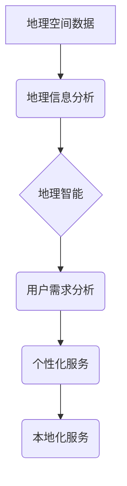

                 

## 本地化服务：AI的地理智能

> 关键词：本地化服务、地理智能、AI、机器学习、自然语言处理、数据分析、云计算、边缘计算

## 1. 背景介绍

随着人工智能 (AI) 技术的飞速发展，AI 已经渗透到我们生活的方方面面。从智能语音助手到自动驾驶汽车，AI 正在改变着我们的世界。而地理智能，作为 AI 的重要分支，则专注于利用地理空间数据和分析技术，为我们提供更精准、更智能的地理信息服务。

本地化服务作为地理智能的重要应用场景，是指根据用户地理位置、语言、文化等信息，提供个性化、定制化的服务。例如，电商平台根据用户位置推荐附近的商品，旅游平台根据用户兴趣推荐附近的景点，地图应用根据用户实时位置提供导航服务等。

传统的本地化服务主要依赖于静态数据和规则引擎，难以适应用户需求的多样性和动态变化。而随着 AI 技术的进步，本地化服务迎来了新的发展机遇。

## 2. 核心概念与联系

### 2.1  地理智能

地理智能是指利用地理空间数据和分析技术，为用户提供地理信息服务的能力。它融合了地理信息科学、人工智能、数据挖掘等多学科知识，能够对地理空间数据进行分析、挖掘和推理，从而提供更智能、更精准的地理信息服务。

### 2.2  本地化服务

本地化服务是指根据用户地理位置、语言、文化等信息，提供个性化、定制化的服务。它旨在根据用户的具体需求和环境，提供更贴近用户体验的服务。

### 2.3  AI 与本地化服务

AI 技术为本地化服务提供了强大的支持，使其能够更加智能化、个性化和高效化。

**核心概念架构**



## 3. 核心算法原理 & 具体操作步骤

### 3.1  算法原理概述

本地化服务的核心算法原理主要包括：

* **位置识别:** 利用 GPS、Wi-Fi、基站定位等技术，识别用户的地理位置。
* **语言识别:** 利用自然语言处理 (NLP) 技术，识别用户的语言类型。
* **文化识别:** 利用用户行为、偏好等数据，识别用户的文化背景。
* **数据分析:** 利用机器学习 (ML) 和数据挖掘技术，分析用户地理位置、语言、文化等信息，并根据分析结果提供个性化服务。

### 3.2  算法步骤详解

1. **用户定位:** 首先，需要识别用户的地理位置。可以使用 GPS、Wi-Fi、基站定位等技术进行定位。
2. **用户特征识别:** 识别用户的语言类型、文化背景等特征。可以使用 NLP 技术识别语言类型，可以使用用户行为、偏好等数据识别文化背景。
3. **数据分析:** 将用户定位信息、语言类型、文化背景等特征数据输入到机器学习模型中，进行分析和预测。
4. **个性化服务推荐:** 根据机器学习模型的分析结果，推荐个性化的服务。例如，根据用户的地理位置推荐附近的餐厅、根据用户的语言类型提供相应的语言服务等。

### 3.3  算法优缺点

**优点:**

* **个性化:** 可以根据用户的具体需求和环境提供个性化的服务。
* **智能化:** 可以利用 AI 技术，自动分析用户数据，提供更精准的服务。
* **高效化:** 可以自动化处理大量数据，提高服务效率。

**缺点:**

* **数据依赖:** 需要大量的用户数据进行训练和分析，否则难以提供准确的个性化服务。
* **隐私问题:** 需要收集和处理用户的个人信息，需要妥善处理用户隐私问题。
* **算法复杂度:** 算法的训练和部署需要一定的技术难度。

### 3.4  算法应用领域

本地化服务算法广泛应用于以下领域:

* **电商:** 根据用户位置推荐附近的商品，提供个性化商品推荐。
* **旅游:** 根据用户兴趣推荐附近的景点，提供个性化旅游路线规划。
* **地图:** 根据用户实时位置提供导航服务，提供个性化交通信息。
* **教育:** 根据用户地理位置和学习需求推荐附近的教育资源，提供个性化学习服务。
* **医疗:** 根据用户地理位置推荐附近的医院和医生，提供个性化医疗服务。

## 4. 数学模型和公式 & 详细讲解 & 举例说明

### 4.1  数学模型构建

本地化服务算法通常使用机器学习模型进行构建，例如：

* **推荐系统:** 使用协同过滤、内容过滤、混合推荐等算法，根据用户的历史行为和偏好，推荐个性化的商品、服务或内容。
* **分类模型:** 使用逻辑回归、支持向量机 (SVM)、决策树等算法，根据用户的特征数据，将用户分类到不同的群体，例如兴趣爱好、消费习惯等。
* **聚类模型:** 使用k-means、层次聚类等算法，将用户根据相似度进行聚类，例如将用户根据地理位置、年龄、性别等特征进行聚类。

### 4.2  公式推导过程

推荐系统中的协同过滤算法是一个典型的例子。其核心思想是：

* 如果用户A和用户B都喜欢商品X，那么用户A也可能喜欢商品Y，而用户B也可能喜欢商品Z。

协同过滤算法通常使用以下公式计算用户对商品的评分预测:

$$
\hat{r}_{ui} = \bar{r}_u + \frac{\sum_{j \in N(i)} (r_{uj} - \bar{r}_u) \cdot s_{ij}}{\sum_{j \in N(i)} s_{ij}}
$$

其中:

* $\hat{r}_{ui}$ 是用户u对商品i的评分预测
* $\bar{r}_u$ 是用户u的平均评分
* $r_{uj}$ 是用户u对商品j的真实评分
* $N(i)$ 是与商品i相关的商品集合
* $s_{ij}$ 是用户u对商品i和商品j的相似度

### 4.3  案例分析与讲解

例如，假设有一个电商平台，用户A和用户B都购买了商品X，并且对商品X的评分都较高。根据协同过滤算法，我们可以预测用户A也可能喜欢商品Y，而用户B也可能喜欢商品Z。

## 5. 项目实践：代码实例和详细解释说明

### 5.1  开发环境搭建

本地化服务项目开发环境搭建需要以下软件和工具:

* **操作系统:** Linux、Windows 或 macOS
* **编程语言:** Python、Java 或 Node.js
* **机器学习框架:** TensorFlow、PyTorch 或 scikit-learn
* **数据库:** MySQL、PostgreSQL 或 MongoDB
* **云平台:** AWS、Azure 或 Google Cloud

### 5.2  源代码详细实现

以下是一个简单的 Python 代码实例，演示如何使用 scikit-learn 库实现协同过滤推荐算法:

```python
from sklearn.metrics.pairwise import cosine_similarity
import numpy as np

# 假设用户评分数据
ratings = np.array([
    [5, 4, 3, 2, 1],
    [4, 5, 2, 1, 3],
    [3, 2, 5, 4, 1],
    [2, 1, 4, 5, 3],
    [1, 3, 1, 3, 5]
])

# 计算用户之间的相似度
user_similarity = cosine_similarity(ratings)

# 获取用户1对商品4的评分预测
user1_predicted_rating = np.dot(user_similarity[0], ratings[:, 3]) / np.sum(user_similarity[0])

# 打印预测评分
print(f"用户1对商品4的预测评分: {user1_predicted_rating}")
```

### 5.3  代码解读与分析

这段代码首先定义了一个用户评分数据矩阵，然后使用 cosine_similarity 函数计算用户之间的相似度。最后，使用用户相似度和评分数据计算用户1对商品4的评分预测。

### 5.4  运行结果展示

运行这段代码后，会输出用户1对商品4的预测评分。

## 6. 实际应用场景

### 6.1  电商平台

电商平台可以利用本地化服务，根据用户的地理位置推荐附近的商品，提供个性化商品推荐，提高用户购物体验。

### 6.2  旅游平台

旅游平台可以利用本地化服务，根据用户的兴趣推荐附近的景点，提供个性化旅游路线规划，帮助用户更好地规划旅行。

### 6.3  地图应用

地图应用可以利用本地化服务，根据用户的实时位置提供导航服务，提供个性化交通信息，帮助用户更便捷地出行。

### 6.4  未来应用展望

随着 AI 技术的不断发展，本地化服务将有更广泛的应用场景，例如：

* **智能城市:** 利用本地化服务，为城市居民提供个性化公共服务，例如交通规划、医疗服务、教育服务等。
* **个性化教育:** 利用本地化服务，为学生提供个性化学习资源和学习路径，提高学习效率。
* **精准营销:** 利用本地化服务，为商家提供精准的营销服务，提高营销效果。

## 7. 工具和资源推荐

### 7.1  学习资源推荐

* **书籍:**
    * 《深度学习》
    * 《机器学习实战》
    * 《自然语言处理入门》
* **在线课程:**
    * Coursera
    * edX
    * Udacity

### 7.2  开发工具推荐

* **Python:**
    * TensorFlow
    * PyTorch
    * scikit-learn
* **Java:**
    * Weka
    * Deeplearning4j
* **Node.js:**
    * TensorFlow.js
    * Brain.js

### 7.3  相关论文推荐

* **地理智能:**
    * Spatial Intelligence: A Review
* **本地化服务:**
    * Location-Based Services: A Survey
* **机器学习:**
    * Machine Learning: A Probabilistic Perspective

## 8. 总结：未来发展趋势与挑战

### 8.1  研究成果总结

本地化服务作为 AI 的重要应用场景，已经取得了显著的成果。AI 技术为本地化服务提供了强大的支持，使其能够更加智能化、个性化和高效化。

### 8.2  未来发展趋势

未来，本地化服务将朝着以下方向发展:

* **更精准的个性化:** 利用更先进的 AI 技术，例如深度学习、强化学习等，提供更精准的个性化服务。
* **更丰富的服务类型:** 除了推荐服务，本地化服务还将扩展到其他服务类型，例如智能客服、个性化内容推荐等。
* **更广泛的应用场景:** 本地化服务将应用于更多领域，例如智能城市、个性化教育、精准营销等。

### 8.3  面临的挑战

本地化服务的发展也面临着一些挑战:

* **数据隐私:** 本地化服务需要收集和处理用户的个人信息，需要妥善处理用户隐私问题。
* **算法公平性:** 本地化服务算法需要保证公平性，避免出现歧视或偏见。
* **技术复杂度:** 本地化服务算法的开发和部署需要一定的技术难度。

### 8.4  研究展望

未来，我们需要继续研究以下问题:

* 如何提高本地化服务算法的精准度和个性化程度?
* 如何保证本地化服务算法的公平性和安全性?
* 如何将本地化服务应用于更多领域，为用户提供更丰富的服务体验?


## 9. 附录：常见问题与解答

### 9.1  常见问题

* **本地化服务和个性化服务有什么区别?**

本地化服务是一种更具体的个性化服务，它根据用户的地理位置、语言、文化等信息，提供更精准的个性化服务。

* **如何评估本地化服务的质量?**

可以根据用户满意度、服务精准度、服务效率等指标评估本地化服务的质量。

* **本地化服务有哪些应用场景?**

本地化服务广泛应用于电商、旅游、地图、教育、医疗等领域。

### 9.2  解答

* **本地化服务和个性化服务有什么区别?**

本地化服务是一种更具体的个性化服务，它根据用户的地理位置、语言、文化等信息，提供更精准的个性化服务。

* **如何评估本地化服务的质量?**

可以根据用户满意度、服务精准度、服务效率等指标评估本地化服务的质量。

* **本地化服务有哪些应用场景?**

本地化服务广泛应用于电商、旅游、地图、教育、医疗等领域。


作者：禅与计算机程序设计艺术 / Zen and the Art of Computer Programming 
<end_of_turn>

