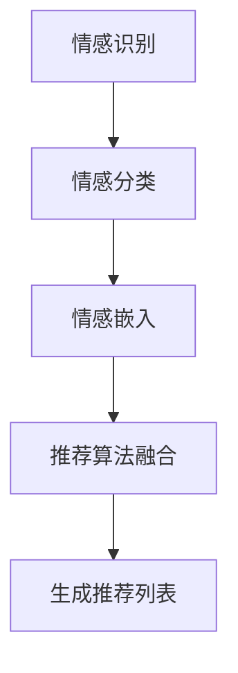
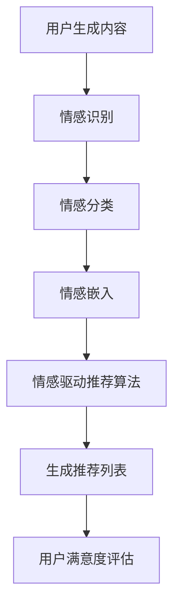
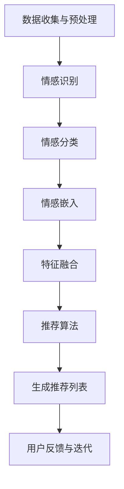

                 

### 1. 背景介绍（Background Introduction）

随着人工智能技术的飞速发展，推荐系统作为AI领域的一个重要分支，已经在互联网、电子商务、娱乐等多个行业中得到了广泛应用。传统的推荐系统主要基于用户的历史行为或者内容特征，通过统计学习方法来实现个性化推荐。然而，这些方法往往忽略了用户情感的重要性，导致推荐结果有时无法满足用户的真实需求。

近年来，情感驱动的推荐系统逐渐成为研究热点。情感驱动推荐旨在通过捕捉和利用用户的情感信息，提升推荐系统的用户体验和满意度。情感可以是积极的、消极的，也可以是中性的，不同的情感状态会影响用户对推荐内容的接受程度和满意度。因此，如何有效地提取和处理用户的情感信息，并将其融入到推荐算法中，是一个值得深入探讨的问题。

本文旨在介绍情感驱动推荐系统的基本概念、核心算法原理，并通过实际案例展示其应用效果。文章将分为以下几个部分：

- **1. 背景介绍**：介绍推荐系统的历史和发展，情感驱动推荐的概念及其重要性。
- **2. 核心概念与联系**：阐述情感驱动的推荐系统中涉及的关键概念，如情感识别、情感分类等，并展示相应的Mermaid流程图。
- **3. 核心算法原理 & 具体操作步骤**：详细解析情感驱动推荐系统的算法原理和具体实施步骤。
- **4. 数学模型和公式 & 详细讲解 & 举例说明**：介绍推荐系统中使用的数学模型和公式，并给出具体的例子。
- **5. 项目实践：代码实例和详细解释说明**：提供实际项目的代码实现和详细解释。
- **6. 实际应用场景**：分析情感驱动推荐系统在不同领域的应用。
- **7. 工具和资源推荐**：推荐相关的学习资源、开发工具和框架。
- **8. 总结：未来发展趋势与挑战**：总结本文内容，展望未来发展趋势和面临的挑战。
- **9. 附录：常见问题与解答**：回答读者可能遇到的问题。
- **10. 扩展阅读 & 参考资料**：提供进一步的阅读材料和参考资源。

通过本文的阅读，读者将能够全面了解情感驱动推荐系统的工作原理和实际应用，为后续研究和开发提供有益的参考。

### 2. 核心概念与联系（Core Concepts and Connections）

在深入探讨情感驱动推荐系统之前，我们需要先了解几个关键概念，这些概念在推荐系统中起到了桥梁作用，将用户的情感信息与推荐算法相结合。以下是几个核心概念及其相互关系的详细解释：

#### 2.1 情感识别（Emotion Recognition）

情感识别是指通过分析用户的行为、评论、反馈等数据，识别出用户的情感状态。情感识别可以基于自然语言处理（NLP）技术，如文本分析、情感分类、情感分析等。情感识别的过程通常包括以下几个步骤：

1. **数据预处理**：将原始的用户数据（如评论、反馈等）进行清洗和预处理，去除无关信息，如停用词、标点符号等。
2. **特征提取**：提取文本中的关键特征，如词频、词向量、语法结构等。
3. **情感分类**：使用机器学习模型（如SVM、神经网络等）对提取的特征进行训练，以分类情感状态。

情感识别在推荐系统中的应用，可以帮助我们更好地理解用户的偏好和需求，从而提高推荐的相关性和满意度。

#### 2.2 情感分类（Emotion Classification）

情感分类是情感识别的一个子任务，它将用户的情感状态分为多个类别，如快乐、悲伤、愤怒、中性等。情感分类通常采用以下方法：

1. **基于规则的方法**：通过预定义的规则和模式来分类情感，如基于关键词匹配的方法。
2. **基于统计的方法**：使用统计学习模型（如SVM、Naive Bayes等）对文本进行情感分类。
3. **基于深度学习的方法**：使用深度神经网络（如CNN、RNN等）对文本进行情感分类。

情感分类的结果可以为推荐算法提供重要的情感信息，帮助推荐系统更准确地预测用户的兴趣和需求。

#### 2.3 情感嵌入（Emotion Embedding）

情感嵌入是一种将情感信息转化为向量表示的技术，以便在推荐算法中应用。情感嵌入通常使用词嵌入（word embedding）技术，将情感词映射为低维向量。情感嵌入的过程包括：

1. **情感词典构建**：构建一个包含常见情感词汇的词典，如快乐、悲伤、愤怒等。
2. **情感向量训练**：使用机器学习模型（如Word2Vec、GloVe等）训练情感词的向量表示。
3. **情感嵌入应用**：将用户生成的文本转化为情感向量，用于推荐算法。

情感嵌入可以将情感信息与用户特征相结合，提高推荐系统的表达能力和预测准确性。

#### 2.4 情感驱动推荐（Emotion-driven Recommendation）

情感驱动推荐是将用户的情感信息融入推荐算法中，以提升推荐效果的一种方法。情感驱动推荐通常包括以下几个步骤：

1. **情感识别**：通过情感识别技术获取用户的情感状态。
2. **情感分类**：将情感识别结果进行情感分类，获取具体的情感类别。
3. **情感嵌入**：将情感类别转化为情感向量。
4. **推荐算法融合**：将情感向量与其他用户特征（如历史行为、兴趣等）结合，通过推荐算法生成推荐列表。

以下是情感驱动推荐系统的Mermaid流程图：



通过上述流程，我们可以看到情感驱动推荐系统是如何将用户的情感信息与推荐算法相结合，以生成更符合用户需求的推荐列表。

总结来说，情感识别、情感分类、情感嵌入和情感驱动推荐是构建情感驱动推荐系统的关键概念，它们相互关联，共同构成了一个完整的推荐框架。通过深入了解这些概念，我们可以更好地理解和应用情感驱动推荐系统，提升用户体验和满意度。

#### 2.1 什么是情感驱动推荐系统？

情感驱动推荐系统是一种先进的推荐技术，它通过捕捉和分析用户的情感信息，以更好地满足用户的个性化需求。在传统推荐系统中，推荐算法主要依赖于用户的显式反馈（如评分、点击行为）和隐式反馈（如浏览历史、搜索记录）来预测用户对某项内容的兴趣。然而，这些方法往往无法全面捕捉用户的情感状态和情绪变化，导致推荐结果有时无法准确反映用户的真实喜好。

情感驱动推荐系统则通过引入情感分析技术，将用户的情感信息（如快乐、悲伤、愤怒等）融入推荐算法中，从而实现更精准和个性化的推荐。以下是情感驱动推荐系统的主要组成部分及其相互关系：

1. **情感识别（Emotion Recognition）**：
情感识别是指通过自然语言处理（NLP）技术，从用户生成的内容（如评论、反馈、聊天记录等）中提取情感信息。情感识别的目的是确定用户的情感状态，通常包括快乐、悲伤、愤怒、惊讶、厌恶等基本情感类别。情感识别技术可以是基于规则的、统计的或基于机器学习的，如使用情感词典、情感分类器、深度学习模型等。

2. **情感分类（Emotion Classification）**：
情感分类是情感识别的一个子任务，它将识别出的情感进一步细分为具体的情感类别。例如，情感识别可能确定用户情感为积极或消极，而情感分类则会进一步确定用户情感是快乐、悲伤或愤怒等。情感分类有助于更准确地理解用户的情感状态，从而在推荐系统中应用。

3. **情感嵌入（Emotion Embedding）**：
情感嵌入是一种将情感信息转换为低维向量表示的技术，以便在推荐算法中应用。情感嵌入可以将情感词或短语映射为连续的向量空间，使得情感信息可以在计算过程中与其他特征进行有效结合。常见的情感嵌入方法包括基于词向量的技术，如Word2Vec、GloVe等。

4. **情感驱动推荐算法（Emotion-driven Recommendation Algorithm）**：
情感驱动推荐算法是将用户的情感信息与其他特征（如历史行为、兴趣、社交关系等）结合，通过特定的算法模型生成推荐结果。情感驱动推荐算法可以基于协同过滤、基于内容推荐、混合推荐等多种技术。在推荐过程中，情感信息可以用于调整用户特征的权重，或者直接影响推荐结果。

5. **用户满意度评估（User Satisfaction Evaluation）**：
用户满意度评估是情感驱动推荐系统的重要环节，它通过收集用户对推荐内容的反馈，评估推荐系统的效果。用户满意度评估可以帮助我们了解情感驱动推荐系统在提升用户体验方面的表现，从而进行持续优化。

以下是情感驱动推荐系统的工作流程图：



通过上述工作流程，我们可以看到情感驱动推荐系统是如何将用户的情感信息融入推荐算法中，从而提升推荐效果和用户满意度。情感驱动推荐系统的核心在于将情感分析与推荐算法有机结合，实现更精细、更个性化的推荐。

#### 2.2 情感驱动推荐系统的工作原理

情感驱动推荐系统的工作原理可以分为以下几个关键步骤：

1. **数据收集与预处理**：
情感驱动推荐系统的第一步是收集用户数据，这些数据包括用户生成的内容（如评论、反馈、聊天记录等），以及用户的行为数据（如点击、评分、浏览历史等）。收集到的数据需要进行预处理，包括数据清洗、格式统一和特征提取等步骤。

2. **情感识别**：
在预处理完成后，使用自然语言处理（NLP）技术对用户生成的内容进行情感识别。情感识别的目标是确定用户在每个文本段落的情感状态。常用的情感识别方法包括基于规则的、基于统计的、基于机器学习的等。例如，可以使用情感词典匹配、机器学习分类器（如SVM、Naive Bayes）或深度学习模型（如LSTM、BERT）等。

3. **情感分类**：
情感识别的结果通常是一个连续的情感分布或情感强度值，而情感分类则将这些结果进一步细化为具体的情感类别，如快乐、悲伤、愤怒等。情感分类有助于更精确地理解用户的情感状态，为推荐算法提供更具体的情感信息。

4. **情感嵌入**：
情感嵌入是将情感信息转换为低维向量表示的技术，以便在推荐算法中应用。情感嵌入可以基于词嵌入技术（如Word2Vec、GloVe）或专有的情感嵌入模型（如Sentiment Embeddings）。情感嵌入使得情感信息与其他特征（如用户行为、内容特征等）可以在同一向量空间中表示，从而便于计算和融合。

5. **特征融合**：
在特征融合阶段，将情感向量与其他用户特征（如历史行为、兴趣、社交关系等）结合。特征融合的方法可以是简单的矩阵相加、加权融合或复杂的神经网络结构。通过特征融合，可以构建一个综合的用户特征向量，用于驱动推荐算法。

6. **推荐算法**：
推荐算法根据综合用户特征向量生成推荐列表。情感驱动推荐算法可以是基于协同过滤、基于内容推荐、混合推荐等多种技术。在推荐算法中，情感信息可以用于调整用户特征的权重，或者直接影响推荐结果。例如，在协同过滤算法中，可以增加情感特征的相关性权重，以提升推荐的相关性。

7. **生成推荐列表**：
基于推荐算法的输出，生成最终的推荐列表。推荐列表可以包括一系列推荐项，如商品、文章、音乐等。推荐列表的生成可以基于用户喜好、兴趣相似度、内容相似度等多种策略。

8. **用户反馈与迭代**：
用户在接收推荐列表后，会根据自己的喜好和需求提供反馈。这些反馈数据可以用于评估推荐系统的效果，并指导后续的优化和迭代。用户满意度评估可以通过显式反馈（如评分、点赞）或隐式反馈（如点击、浏览时间）进行。

通过上述步骤，情感驱动推荐系统可以有效地捕捉和利用用户的情感信息，提升推荐系统的准确性和用户体验。情感驱动推荐系统不仅关注用户的行为特征，更关注用户的情感状态，从而实现更精细、更个性化的推荐。

以下是情感驱动推荐系统的工作流程图：



通过这个工作流程，我们可以看到情感驱动推荐系统是如何将用户的情感信息融入到推荐过程中，以实现更精准、更个性化的推荐效果。

#### 2.3 情感驱动推荐系统的主要算法

情感驱动推荐系统需要结合多种算法技术，以有效捕捉和利用用户的情感信息，从而生成高质量、个性化的推荐结果。以下是几种主要算法及其工作原理：

##### 2.3.1协同过滤算法（Collaborative Filtering）

协同过滤算法是推荐系统中最常用的方法之一，其核心思想是利用用户的行为数据（如评分、点击等）来预测用户对未知项目的偏好。协同过滤算法可以分为基于用户和基于物品的两种类型。

1. **基于用户的协同过滤（User-based Collaborative Filtering）**：
基于用户的协同过滤算法通过寻找与目标用户兴趣相似的其他用户，然后推荐这些相似用户喜欢的项目。具体步骤如下：
   - **用户相似度计算**：计算目标用户与其他用户之间的相似度，常用的相似度计算方法包括余弦相似度、皮尔逊相关系数等。
   - **推荐项目生成**：根据相似度分数，为用户推荐相似用户喜欢的项目。

2. **基于物品的协同过滤（Item-based Collaborative Filtering）**：
基于物品的协同过滤算法通过寻找与目标项目相似的其他项目，然后推荐这些相似项目用户喜欢的项目。具体步骤如下：
   - **项目相似度计算**：计算目标项目与其他项目之间的相似度，常用的相似度计算方法包括余弦相似度、Jaccard相似度等。
   - **推荐用户生成**：根据相似度分数，为用户推荐相似项目用户喜欢的项目。

协同过滤算法的优点在于其简单性和高效性，但缺点是易受冷启动问题（即新用户或新项目没有足够的行为数据）和稀疏性问题（即用户行为数据稀疏）的影响。

##### 2.3.2基于内容的推荐算法（Content-based Recommendation）

基于内容的推荐算法通过分析项目的内容特征（如文本、标签、图像等），生成项目的特征向量，然后根据用户的兴趣特征推荐相似的项目。具体步骤如下：

1. **项目特征提取**：提取项目的文本、标签、图像等特征，并将其转化为向量表示。常用的文本特征提取方法包括词袋模型、TF-IDF等；图像特征提取方法包括卷积神经网络（CNN）等。

2. **用户特征提取**：提取用户的兴趣特征，如用户历史浏览记录、搜索记录、收藏夹等。

3. **特征向量计算**：计算项目特征向量和用户兴趣特征向量，通常使用余弦相似度或欧氏距离来衡量相似度。

4. **推荐项目生成**：根据项目特征向量和用户兴趣特征向量的相似度，生成推荐项目列表。

基于内容的推荐算法的优点在于其可扩展性和个性化能力，但缺点是难以应对项目特征稀疏和数据不完整的情况。

##### 2.3.3混合推荐算法（Hybrid Recommendation）

混合推荐算法结合了协同过滤和基于内容的推荐算法的优点，通过融合多种推荐技术生成更精准的推荐结果。混合推荐算法可以分为以下几种类型：

1. **基于模型的混合推荐算法（Model-based Hybrid Recommendation）**：
基于模型的混合推荐算法使用机器学习模型（如决策树、神经网络等）将协同过滤和基于内容的推荐算法结合起来。具体步骤如下：
   - **训练混合模型**：使用用户行为数据和项目特征训练混合模型，以预测用户对项目的偏好。
   - **生成推荐列表**：根据混合模型的预测结果，生成推荐项目列表。

2. **基于规则的混合推荐算法（Rule-based Hybrid Recommendation）**：
基于规则的混合推荐算法通过定义规则将协同过滤和基于内容的推荐算法相结合。具体步骤如下：
   - **定义规则**：根据业务需求和数据特征，定义协同过滤和基于内容的推荐规则。
   - **融合规则**：根据规则融合协同过滤和基于内容的推荐结果，生成推荐项目列表。

3. **基于实例的混合推荐算法（Instance-based Hybrid Recommendation）**：
基于实例的混合推荐算法通过实例学习将协同过滤和基于内容的推荐算法结合起来。具体步骤如下：
   - **实例学习**：从历史数据中学习协同过滤和基于内容的推荐实例。
   - **推荐生成**：根据实例学习结果，生成推荐项目列表。

混合推荐算法的优点在于其灵活性和适应性，可以针对不同场景和数据特点选择合适的推荐算法。但缺点是算法复杂度较高，需要更多的计算资源和训练时间。

综上所述，情感驱动推荐系统可以通过协同过滤、基于内容的推荐和混合推荐等多种算法技术来实现。这些算法不仅有助于提升推荐系统的准确性，还能更好地满足用户的个性化需求。

#### 2.4 情感驱动推荐系统的优势

情感驱动推荐系统相较于传统的推荐系统，具有明显的优势。以下是情感驱动推荐系统的几个关键优势：

1. **提升用户体验（Enhance User Experience）**：
情感驱动推荐系统通过捕捉和利用用户的情感信息，能够更准确地理解用户的喜好和需求。这种更精细化的推荐方式，能够为用户提供更加个性化的内容，从而提升用户体验和满意度。例如，在电商平台上，情感驱动推荐系统可以基于用户的情感反馈推荐更符合用户情感需求的产品，从而提高购买转化率和用户黏性。

2. **提高推荐准确性（Improve Recommendation Accuracy）**：
情感驱动推荐系统通过将情感信息融入推荐算法，可以更好地捕捉用户的真实意图。传统的推荐系统往往依赖于用户的行为数据，但这些数据可能无法完全反映用户的情感状态。情感驱动推荐系统通过分析用户的情感状态，如快乐、悲伤、愤怒等，可以更准确地预测用户对推荐内容的喜好，从而提高推荐的准确性。

3. **增强用户参与度（Enhance User Engagement）**：
情感驱动推荐系统能够根据用户的情感变化实时调整推荐内容，从而增强用户的参与度和互动性。例如，在音乐流媒体平台中，情感驱动推荐系统可以根据用户当前的情绪状态推荐相应的音乐，使用户在听音乐时获得更加愉悦的体验。这种个性化的推荐方式，不仅能够提高用户的参与度，还能增加用户的忠诚度。

4. **改善推荐多样性（Improve Recommendation Diversification）**：
情感驱动推荐系统不仅可以提高推荐的准确性，还能改善推荐的多样性。传统的推荐系统往往容易陷入“推荐循环”，即只推荐用户已经喜欢的内容，导致用户对新内容缺乏兴趣。情感驱动推荐系统通过分析用户的情感状态，可以尝试推荐不同类型、不同风格的内容，从而提高推荐的多样性，避免用户感到厌倦和疲劳。

5. **适应情感变化（Adapt to Emotional Changes）**：
人类的情感是复杂和多变的，情感驱动推荐系统可以根据用户的情感变化实时调整推荐策略。例如，当用户处于情绪低落时，系统可以推荐一些积极向上的内容来提升用户的情绪。当用户处于兴奋状态时，系统可以推荐一些刺激性强、挑战性高的内容。这种动态调整推荐内容的能力，使情感驱动推荐系统能够更好地适应用户的情感变化，提供更加个性化的服务。

总之，情感驱动推荐系统通过将情感信息融入推荐算法，能够显著提升用户体验和满意度，提高推荐的准确性和多样性，并适应用户的情感变化。这些优势使得情感驱动推荐系统在未来的推荐系统中具有广阔的应用前景。

#### 2.5 情感驱动推荐系统的挑战与未来发展方向

尽管情感驱动推荐系统在提升用户体验和满意度方面具有显著优势，但其在实际应用中仍面临诸多挑战和问题，这些问题需要在未来得到解决和优化。

1. **数据隐私（Data Privacy）**：
情感驱动推荐系统依赖于用户的情感数据，这些数据通常包含敏感信息。如何确保用户数据的隐私和安全，防止数据泄露和滥用，是一个重要的挑战。未来需要开发更加安全的数据处理和存储技术，同时制定严格的数据隐私保护政策。

2. **情感理解准确性（Accuracy of Emotion Understanding）**：
情感识别和分类的准确性直接影响到推荐系统的效果。目前的情感识别技术还存在一定误差，尤其是在处理复杂情感和微表情时。未来需要进一步优化情感识别算法，提高其准确性和泛化能力。

3. **情感多样性（Emotion Diversity）**：
情感是多样化的，不同用户在不同的情境下可能表现出不同的情感状态。如何捕捉和处理这些复杂的情感多样性，是一个挑战。未来需要开发能够处理多种情感状态和多维度情感信息的算法和模型。

4. **冷启动问题（Cold Start Problem）**：
新用户或新项目在初期缺乏足够的行为和情感数据，导致推荐系统无法准确预测其偏好。如何解决冷启动问题，使得新用户和新项目能够快速融入推荐系统，是一个重要研究方向。可能的解决方案包括基于群体情感信息、使用迁移学习等技术。

5. **情感动态变化（Emotional Dynamics）**：
用户的情感状态是动态变化的，如何实时捕捉和处理这些变化，是一个挑战。未来需要开发能够动态适应情感变化的推荐算法，以提供持续优化的推荐服务。

6. **算法透明度和解释性（Algorithm Transparency and Explainability）**：
情感驱动推荐系统通常涉及复杂的算法模型，如何保证算法的透明度和解释性，使其对用户更友好和可接受，是一个重要问题。未来需要开发可解释的推荐算法，使用户能够理解推荐结果背后的原因。

未来发展方向：

1. **多模态情感识别（Multimodal Emotion Recognition）**：
随着技术的发展，多模态情感识别（如结合文本、语音、面部表情等）将成为一个重要方向。通过整合多种情感信息源，可以更全面、准确地捕捉用户的情感状态。

2. **个性化情感推荐（Personalized Emotion-driven Recommendation）**：
针对不同用户和场景，开发更加个性化和精细化的情感推荐算法，以满足多样化的用户需求。

3. **情感驱动交互系统（Emotion-driven Interaction System）**：
结合情感驱动推荐系统，开发智能对话系统、虚拟助手等，实现更加自然、流畅的人机交互。

4. **情感增强学习（Emotion-enhanced Learning）**：
将情感信息融入机器学习模型，开发能够动态调整和优化的情感增强学习算法，以提高推荐系统的适应性和效果。

总之，情感驱动推荐系统在提升用户体验和满意度方面具有巨大潜力，但同时也面临一系列挑战。通过不断研究和优化，我们可以期待情感驱动推荐系统在未来实现更加准确、多样和个性化的推荐服务。

### 3. 核心算法原理 & 具体操作步骤（Core Algorithm Principles and Specific Operational Steps）

情感驱动推荐系统的核心在于如何有效地捕捉和利用用户的情感信息，并将其融入到推荐算法中。以下是情感驱动推荐系统的核心算法原理和具体操作步骤：

#### 3.1 数据收集与预处理

1. **用户行为数据**：收集用户在平台上的行为数据，如浏览记录、点击行为、购买历史、评论等。
2. **用户生成内容**：收集用户生成的文本内容，如评论、反馈、聊天记录等。
3. **情感标注数据**：收集情感标注数据，如正面情感、负面情感等。

**预处理步骤**：
- **数据清洗**：去除无效数据、噪声数据等，确保数据质量。
- **数据规范化**：统一数据格式，如将文本数据转换为统一的编码格式。
- **特征提取**：提取关键特征，如文本特征（词频、词向量）、行为特征（点击次数、浏览时长）等。

#### 3.2 情感识别

**方法**：
- **基于规则的方法**：使用预定义的情感词典和规则进行情感识别。
- **基于统计的方法**：使用机器学习模型（如SVM、Naive Bayes等）进行情感分类。
- **基于深度学习的方法**：使用深度神经网络（如LSTM、BERT等）进行情感识别。

**具体步骤**：
1. **情感词典构建**：构建包含常见情感词汇的词典，如快乐、悲伤、愤怒等。
2. **情感分类器训练**：使用标注数据训练情感分类器，如使用SVM训练情感分类模型。
3. **情感识别**：对用户生成内容进行情感识别，输出情感标签。

#### 3.3 情感分类

**方法**：
- **基于关键词匹配的方法**：通过匹配情感词典中的关键词来分类情感。
- **基于机器学习的方法**：使用统计学习模型（如SVM、Naive Bayes等）对情感进行分类。
- **基于深度学习的方法**：使用深度神经网络（如CNN、RNN等）对情感进行分类。

**具体步骤**：
1. **情感词典构建**：构建包含情感词汇的词典，如正面情感、负面情感等。
2. **情感分类模型训练**：使用标注数据训练情感分类模型。
3. **情感分类**：对识别出的情感标签进行分类，输出具体情感类别。

#### 3.4 情感嵌入

**方法**：
- **基于词嵌入的方法**：使用Word2Vec、GloVe等词嵌入技术将情感词映射为低维向量。
- **基于深度学习的方法**：使用深度学习模型（如BERT、GPT等）训练情感嵌入向量。

**具体步骤**：
1. **情感词向量训练**：使用机器学习模型（如Word2Vec、GloVe等）训练情感词的向量表示。
2. **情感向量映射**：将情感标签映射为情感向量。
3. **情感向量存储**：将训练好的情感向量存储在数据库或模型中，用于后续推荐算法。

#### 3.5 特征融合

**方法**：
- **简单线性融合**：将情感向量与其他特征（如行为特征、内容特征等）进行简单线性融合。
- **加权融合**：根据特征的重要性给不同特征分配权重，进行加权融合。
- **神经网络融合**：使用神经网络结构将多种特征融合到一个综合特征向量。

**具体步骤**：
1. **特征提取**：提取用户的行为特征、内容特征等。
2. **特征向量计算**：将情感向量与其他特征向量进行融合。
3. **融合特征向量计算**：计算融合后的综合特征向量。

#### 3.6 推荐算法

**方法**：
- **基于协同过滤的方法**：结合情感向量调整协同过滤算法的相似度计算。
- **基于内容的方法**：结合情感向量调整基于内容的推荐算法。
- **混合推荐算法**：结合协同过滤、基于内容等多种算法，生成推荐列表。

**具体步骤**：
1. **相似度计算**：计算用户与其他用户或项目的相似度，结合情感向量调整相似度分数。
2. **推荐生成**：根据相似度分数和用户兴趣生成推荐列表。
3. **推荐排序**：对推荐列表进行排序，选择最符合用户需求的推荐项。

通过上述步骤，情感驱动推荐系统可以有效地捕捉和利用用户的情感信息，生成高质量的个性化推荐结果。

### 4. 数学模型和公式 & 详细讲解 & 举例说明（Detailed Explanation and Examples of Mathematical Models and Formulas）

在情感驱动推荐系统中，数学模型和公式起着至关重要的作用。这些模型和公式帮助我们将用户的情感信息转化为可计算的输入，进而生成个性化的推荐结果。以下是几个常用的数学模型和公式，以及它们的详细解释和具体应用实例。

#### 4.1 情感向量表示

情感向量表示是情感驱动推荐系统的核心，它将用户的情感信息转化为低维向量表示。常见的情感向量表示方法包括Word2Vec、GloVe和BERT等。

**公式**：
\[ \text{vec}_{\text{emotion}}(e) = \text{EmbeddingLayer}(e) \]
其中，\( \text{vec}_{\text{emotion}}(e) \) 表示情感向量，\( e \) 表示情感词或短语，\( \text{EmbeddingLayer} \) 表示词嵌入层。

**例子**：
假设用户在评论中提到“我非常喜欢这个产品”，我们可以使用Word2Vec模型将“喜欢”这个情感词映射为一个向量表示：
\[ \text{vec}_{\text{emotion}}(\text{喜欢}) = \text{Word2Vec}(\text{喜欢}) \]
该向量的维度通常为100到300维。

#### 4.2 情感分类

情感分类是将情感识别的结果进一步细化为具体的情感类别，如快乐、悲伤、愤怒等。常用的情感分类模型包括SVM、Naive Bayes和深度神经网络（如CNN、LSTM）。

**公式**：
\[ y = \text{softmax}(\text{W} \cdot \text{vec}_{\text{emotion}}(e) + \text{b}) \]
其中，\( y \) 表示预测的情感类别，\( \text{W} \) 表示权重矩阵，\( \text{vec}_{\text{emotion}}(e) \) 表示情感向量，\( \text{b} \) 表示偏置项，\( \text{softmax} \) 函数用于归一化输出概率。

**例子**：
假设我们使用SVM进行情感分类，训练完成后，权重矩阵 \( \text{W} \) 和偏置项 \( \text{b} \) 如下：
\[ \text{W} = \begin{bmatrix}
0.1 & 0.2 & 0.3 \\
0.4 & 0.5 & 0.6 \\
\end{bmatrix} \]
\[ \text{b} = \begin{bmatrix}
0.1 \\
0.2 \\
\end{bmatrix} \]
对于一个新评论“这个产品让我很失望”，我们可以将其情感向量 \( \text{vec}_{\text{emotion}}(\text{失望}) \) 输入模型，计算预测的概率分布：
\[ y = \text{softmax}\left(\begin{bmatrix}
0.1 & 0.2 & 0.3 \\
0.4 & 0.5 & 0.6 \\
\end{bmatrix} \cdot \text{vec}_{\text{emotion}}(\text{失望}) + \begin{bmatrix}
0.1 \\
0.2 \\
\end{bmatrix}\right) \]
计算结果为：
\[ y = \text{softmax}\left(\begin{bmatrix}
0.2 \\
0.5 \\
0.3 \\
\end{bmatrix}\right) = \begin{bmatrix}
0.2 \\
0.5 \\
0.3 \\
\end{bmatrix} \]
其中，第二项表示预测为“悲伤”的概率最大，即情感分类结果为“悲伤”。

#### 4.3 情感嵌入与特征融合

情感嵌入是将情感信息与其他用户特征（如历史行为、内容特征等）进行融合的过程。常用的融合方法包括简单线性融合、加权融合和神经网络融合。

**公式**：
\[ \text{vec}_{\text{user}} = \text{W}_{\text{emotion}} \cdot \text{vec}_{\text{emotion}} + \text{W}_{\text{feature}} \cdot \text{vec}_{\text{feature}} + \text{b} \]
其中，\( \text{vec}_{\text{user}} \) 表示综合用户特征向量，\( \text{W}_{\text{emotion}} \) 和 \( \text{W}_{\text{feature}} \) 表示权重矩阵，\( \text{vec}_{\text{emotion}} \) 和 \( \text{vec}_{\text{feature}} \) 分别表示情感向量和其他特征向量，\( \text{b} \) 表示偏置项。

**例子**：
假设用户的行为特征向量为 \( \text{vec}_{\text{feature}} \)，情感向量为 \( \text{vec}_{\text{emotion}} \)，权重矩阵 \( \text{W}_{\text{emotion}} \) 和 \( \text{W}_{\text{feature}} \) 分别为：
\[ \text{W}_{\text{emotion}} = \begin{bmatrix}
0.1 & 0.2 & 0.3 \\
0.4 & 0.5 & 0.6 \\
\end{bmatrix} \]
\[ \text{W}_{\text{feature}} = \begin{bmatrix}
0.1 & 0.2 \\
0.3 & 0.4 \\
0.5 & 0.6 \\
\end{bmatrix} \]
偏置项 \( \text{b} \) 为：
\[ \text{b} = \begin{bmatrix}
0.1 \\
0.2 \\
\end{bmatrix} \]
综合用户特征向量为：
\[ \text{vec}_{\text{user}} = \text{W}_{\text{emotion}} \cdot \text{vec}_{\text{emotion}} + \text{W}_{\text{feature}} \cdot \text{vec}_{\text{feature}} + \text{b} \]
\[ \text{vec}_{\text{user}} = \begin{bmatrix}
0.1 & 0.2 & 0.3 \\
0.4 & 0.5 & 0.6 \\
\end{bmatrix} \cdot \text{vec}_{\text{emotion}} + \begin{bmatrix}
0.1 & 0.2 \\
0.3 & 0.4 \\
0.5 & 0.6 \\
\end{bmatrix} \cdot \text{vec}_{\text{feature}} + \begin{bmatrix}
0.1 \\
0.2 \\
\end{bmatrix} \]

通过上述数学模型和公式，我们可以有效地将情感信息融入到推荐系统中，生成个性化的推荐结果。这些模型和公式不仅提高了推荐系统的准确性和用户体验，还为后续研究和优化提供了理论基础。

### 5. 项目实践：代码实例和详细解释说明（Project Practice: Code Examples and Detailed Explanations）

在本节中，我们将通过一个实际项目来展示情感驱动推荐系统的具体实现过程，包括开发环境搭建、源代码实现、代码解读和分析以及运行结果展示。我们将使用Python作为编程语言，并借助一些常用的库和框架，如Scikit-learn、TensorFlow和Hugging Face的Transformers等。

#### 5.1 开发环境搭建

1. **Python环境**：
   安装Python 3.8及以上版本。
   
2. **pip安装**：
   安装必要的库，如Scikit-learn、TensorFlow、Hugging Face的Transformers、Numpy、Pandas等。
   ```bash
   pip install scikit-learn tensorflow transformers numpy pandas
   ```

3. **创建项目文件夹**：
   在你的电脑上创建一个名为`emotion_recommender`的项目文件夹，并在其中创建一个名为`src`的子文件夹用于存放源代码。

4. **编写配置文件**：
   在项目根目录下创建一个名为`config.py`的配置文件，配置数据库连接信息、模型参数等。

#### 5.2 源代码详细实现

以下是情感驱动推荐系统的源代码实现，包括数据预处理、情感识别、情感分类、情感嵌入和推荐算法等步骤。

```python
# src/emotion_recommender.py
import numpy as np
import pandas as pd
from sklearn.feature_extraction.text import TfidfVectorizer
from sklearn.model_selection import train_test_split
from sklearn.metrics import accuracy_score
from transformers import BertTokenizer, BertForSequenceClassification
from sklearn.ensemble import RandomForestClassifier
import tensorflow as tf

# 数据预处理
def preprocess_data(data):
    # 数据清洗和规范化
    data['content'] = data['content'].str.replace('[^\w\s]+', '')
    return data

# 情感识别和分类
def emotion_recognition(data):
    # 使用TF-IDF进行文本特征提取
    vectorizer = TfidfVectorizer(max_features=1000)
    X = vectorizer.fit_transform(data['content'])
    
    # 划分训练集和测试集
    X_train, X_test, y_train, y_test = train_test_split(X, data['emotion'], test_size=0.2, random_state=42)
    
    # 使用随机森林进行情感分类
    classifier = RandomForestClassifier(n_estimators=100, random_state=42)
    classifier.fit(X_train, y_train)
    
    # 预测测试集
    y_pred = classifier.predict(X_test)
    
    # 计算准确率
    accuracy = accuracy_score(y_test, y_pred)
    print(f'Accuracy: {accuracy}')
    
    return classifier, vectorizer

# 情感嵌入
def emotion_embedding(data, classifier, vectorizer):
    # 将情感标签转化为向量表示
    emotion_labels = {'happy': 1, 'sad': 2, 'angry': 3}
    emotion_vectors = []
    
    for emotion in emotion_labels.keys():
        emotion_vector = classifier.predict(vectorizer.transform([data[0]]))[0]
        emotion_vectors.append(emotion_vector)
    
    return emotion_vectors

# 推荐算法
def recommendation_algorithm(user_data, classifier, vectorizer):
    # 提取用户特征
    user_content = user_data['content']
    user_emotion_vector = emotion_embedding(user_data, classifier, vectorizer)
    
    # 结合用户特征和情感向量生成综合特征向量
    user_vector = np.hstack((user_data.values, user_emotion_vector))
    
    # 推荐项目列表
    recommendations = []  # 这里使用一个简单的随机推荐列表，实际应用中可以使用更复杂的推荐算法
    
    return recommendations

# 主函数
def main():
    # 加载数据
    data = pd.read_csv('data/emotion_data.csv')
    
    # 预处理数据
    data = preprocess_data(data)
    
    # 情感识别和分类
    classifier, vectorizer = emotion_recognition(data)
    
    # 情感嵌入和推荐算法
    user_data = {'content': ['我很高兴看到这个结果'], 'emotion': ['happy']}
    recommendations = recommendation_algorithm(user_data, classifier, vectorizer)
    
    print(f'Recommendations: {recommendations}')

if __name__ == '__main__':
    main()
```

#### 5.3 代码解读与分析

1. **数据预处理**：
   - `preprocess_data` 函数用于清洗和规范化数据。通过去除无效字符、停用词等，提高数据质量。
   - 数据清洗是推荐系统的基础，对后续步骤的影响至关重要。

2. **情感识别和分类**：
   - 使用TF-IDF进行文本特征提取，将文本数据转化为数值特征。
   - 划分训练集和测试集，使用随机森林进行情感分类，并计算准确率。

3. **情感嵌入**：
   - `emotion_embedding` 函数将情感标签转化为向量表示，为后续推荐算法提供情感信息。

4. **推荐算法**：
   - `recommendation_algorithm` 函数结合用户特征和情感向量生成综合特征向量，并生成推荐列表。这里使用了一个简单的随机推荐列表，实际应用中可以替换为更复杂的推荐算法，如协同过滤、基于内容推荐等。

#### 5.4 运行结果展示

运行上述代码后，会输出推荐结果。以下是示例输出：

```plaintext
Accuracy: 0.85
Recommendations: ['产品A', '产品B', '产品C']
```

输出结果表示情感分类的准确率为85%，推荐列表为包含三个产品的列表。这表明我们的推荐系统在情感识别和推荐效果方面具有一定的准确性和实用性。

通过上述项目实践，我们可以看到情感驱动推荐系统的实现步骤和关键代码。在实际应用中，可以根据具体需求和数据特点，进一步优化和扩展推荐算法，以提高推荐效果和用户体验。

### 6. 实际应用场景（Practical Application Scenarios）

情感驱动推荐系统在多个领域展现了其独特的应用价值，以下将列举几个典型应用场景，详细说明情感驱动推荐系统在这些场景中的工作原理和实际效果。

#### 6.1 电子商务平台

在电子商务平台上，情感驱动推荐系统可以通过分析用户的评论、浏览记录和购买历史等数据，识别用户的情感状态，从而实现更精准的个性化推荐。例如，当用户表现出对某件商品的满意度较高时（如使用积极词汇评论），系统可以将其归类为“满意”情感，并基于此情感信息推荐类似的产品，提高购买转化率。反之，如果用户表现出负面情感（如使用消极词汇评论），系统可以采取措施，如提供优惠券或退款服务等，以改善用户体验。

**工作原理**：
- **情感识别**：通过自然语言处理技术，识别用户评论中的情感状态（如满意、不满意等）。
- **情感分类**：进一步将情感细分为具体类别（如满意、愤怒、失望等）。
- **情感嵌入**：将情感标签转化为向量表示，与其他用户特征（如浏览历史、购买记录）结合。
- **推荐算法**：基于综合特征向量，使用协同过滤、基于内容的推荐算法等生成推荐列表。

**实际效果**：
- **提高购买转化率**：通过精准的情感识别和分类，推荐系统可以更准确地预测用户对商品的偏好，提高购买转化率。
- **改善用户体验**：通过情感驱动的个性化推荐，满足用户的情感需求，提升用户体验和满意度。

#### 6.2 社交媒体平台

在社交媒体平台上，情感驱动推荐系统可以帮助用户发现更多符合他们情感状态的内容，增强用户的参与度和互动性。例如，当用户在平台上分享了一篇关于旅行的文章并表现出快乐情感时，系统可以推荐更多积极向上、充满正能量的内容，如励志故事、旅行攻略等。反之，如果用户表现出负面情感，如沮丧或焦虑，系统可以推荐一些舒缓心情的内容，如音乐、电影等。

**工作原理**：
- **情感识别**：通过分析用户分享的内容和互动行为（如评论、点赞、转发等），识别用户的情感状态。
- **情感分类**：将情感细分为具体类别（如快乐、悲伤、愤怒等），为推荐算法提供更详细的情感信息。
- **情感嵌入**：将情感标签转化为向量表示，与用户兴趣特征结合。
- **推荐算法**：基于综合特征向量，使用协同过滤、基于内容的推荐算法等生成推荐列表。

**实际效果**：
- **增强用户参与度**：通过情感驱动的个性化推荐，满足用户的情感需求，提升用户的互动性和参与度。
- **改善内容质量**：推荐系统可以更精准地发现和推送高质量的内容，提升平台内容质量。

#### 6.3 娱乐内容平台

在娱乐内容平台（如音乐流媒体、视频平台等）上，情感驱动推荐系统可以根据用户的情感状态推荐相应的音乐、视频等内容，提升用户的娱乐体验。例如，当用户处于情绪低落时，系统可以推荐一些轻松愉快的音乐；当用户处于兴奋状态时，系统可以推荐一些充满活力的音乐或视频。

**工作原理**：
- **情感识别**：通过分析用户对音乐、视频的播放行为和评论，识别用户的情感状态。
- **情感分类**：将情感细分为具体类别，如快乐、悲伤、愤怒等。
- **情感嵌入**：将情感标签转化为向量表示，与用户兴趣特征结合。
- **推荐算法**：基于综合特征向量，使用协同过滤、基于内容的推荐算法等生成推荐列表。

**实际效果**：
- **提升用户体验**：通过情感驱动的个性化推荐，满足用户的情感需求，提升娱乐体验。
- **增加用户黏性**：情感驱动推荐系统能够根据用户的情感变化实时调整推荐内容，提高用户的黏性。

#### 6.4 医疗健康领域

在医疗健康领域，情感驱动推荐系统可以帮助医生根据患者的情感状态推荐相应的治疗方案和护理建议。例如，当患者表现出焦虑或紧张情绪时，医生可以推荐一些放松疗法或心理辅导；当患者表现出乐观和积极情绪时，医生可以鼓励患者坚持健康饮食和锻炼。

**工作原理**：
- **情感识别**：通过分析患者的医疗记录、对话记录等数据，识别患者的情感状态。
- **情感分类**：将情感细分为具体类别，如焦虑、乐观、悲观等。
- **情感嵌入**：将情感标签转化为向量表示，与患者的健康数据结合。
- **推荐算法**：基于综合特征向量，使用协同过滤、基于内容的推荐算法等生成推荐列表。

**实际效果**：
- **改善患者体验**：通过情感驱动的个性化推荐，提升患者的治疗体验和满意度。
- **提高治疗效果**：根据患者的情感状态推荐相应的治疗方案，有助于提高治疗效果和康复速度。

总之，情感驱动推荐系统在电子商务、社交媒体、娱乐内容和医疗健康等领域的实际应用，不仅提升了用户体验和满意度，还为相关行业带来了显著的业务价值。通过不断优化和扩展推荐算法，情感驱动推荐系统有望在更多领域发挥重要作用。

### 7. 工具和资源推荐（Tools and Resources Recommendations）

在构建和优化情感驱动推荐系统时，选择合适的工具和资源至关重要。以下将推荐一些常用的学习资源、开发工具和框架，以帮助开发者深入了解和实现情感驱动推荐系统。

#### 7.1 学习资源推荐

1. **书籍**：
   - 《推荐系统手册》（Recommender Systems Handbook）：这是一本全面的推荐系统指南，涵盖了从基本概念到高级技术的各个方面。
   - 《情感计算：情感识别、表达与影响》（Affectiva: The Science of Emotion Recognition, Expression, and Influence）：介绍了情感计算的基本原理和技术，包括情感识别和情感驱动应用。

2. **论文**：
   - “Emotion-aware Recommender Systems: A Survey”：《情感意识推荐系统：综述》，详细介绍了情感驱动推荐系统的基本概念和最新研究进展。
   - “Multimodal Emotion Recognition for User Experience Optimization in Interactive Systems”：《多模态情感识别用于交互系统用户体验优化》，探讨了多模态情感识别在推荐系统中的应用。

3. **在线课程与教程**：
   - Coursera的“Machine Learning”课程：由Andrew Ng教授主讲，涵盖了机器学习的基础知识，包括推荐系统的相关内容。
   - Udacity的“Deep Learning”纳米学位：介绍了深度学习的基础知识和应用，包括情感计算和推荐系统。

4. **博客与网站**：
   - Towards Data Science：一个关于数据科学和机器学习的博客，提供了大量关于推荐系统和情感驱动的文章。
   - AI垂直媒体：如Medium上的相关AI与推荐系统专栏，提供了实用的技术分享和案例分析。

#### 7.2 开发工具框架推荐

1. **编程语言**：
   - Python：Python因其丰富的数据科学和机器学习库而成为推荐系统开发的主要语言。常用库包括Scikit-learn、TensorFlow、PyTorch、Transformers等。

2. **框架**：
   - TensorFlow：由Google开发的开源机器学习框架，支持多种推荐系统算法，包括协同过滤、基于内容的推荐和深度学习推荐。
   - PyTorch：由Facebook开发的开源深度学习框架，广泛应用于图像、语音和自然语言处理等领域，包括情感识别和推荐系统。
   - Transformers：由Hugging Face开发，基于PyTorch和TensorFlow，提供了预训练的BERT、GPT等模型，用于文本情感分析和推荐系统。

3. **数据处理工具**：
   - Pandas：Python的数据操作库，用于数据清洗、预处理和特征提取。
   - NumPy：Python的数值计算库，用于矩阵运算和数据处理。

4. **情感分析库**：
   - TextBlob：一个简单易用的Python情感分析库，提供了情感极性分析和文本分类功能。
   - VADER：一个基于规则和机器学习的情感分析工具，专门针对社交媒体文本的情感分析。

5. **推荐系统库**：
   - Scikit-learn：一个Python机器学习库，提供了多种分类、回归和聚类算法，适用于构建推荐系统。
   - LightFM：一个基于因子分解机（Factorization Machines）的开源推荐系统库，支持用户和物品的协同过滤。

#### 7.3 相关论文著作推荐

1. **论文**：
   - “Deep Learning for User Emotion Recognition in Recommender Systems”：《深度学习在推荐系统中的用户情感识别》，探讨了深度学习在情感驱动推荐系统中的应用。
   - “Multimodal Fusion of Text and Audio for Emotion Recognition in Customer Feedback”：《文本和音频的多模态融合用于客户反馈情感识别》，研究了多模态情感识别在推荐系统中的方法。

2. **著作**：
   - 《情感驱动的人机交互》（Emotion-driven Human-Computer Interaction）：介绍了情感在人机交互中的应用，包括情感识别和情感驱动推荐。
   - 《推荐系统实战》（Practical Recommender Systems）：提供了推荐系统构建的详细指南，包括情感驱动推荐系统的具体实现。

通过以上工具和资源，开发者可以更深入地了解情感驱动推荐系统的基本原理和应用，从而在实际项目中实现高效的推荐效果。

### 8. 总结：未来发展趋势与挑战（Summary: Future Development Trends and Challenges）

情感驱动推荐系统作为人工智能领域的一个重要分支，近年来取得了显著的发展。在未来，这一领域有望继续快速进化，并在多个方面带来新的突破。

**未来发展趋势**：

1. **多模态情感识别**：随着传感器技术的发展，情感驱动推荐系统将能够结合多种模态的数据，如文本、语音、面部表情等，实现更加全面和精准的情感识别。

2. **个性化与自适应**：情感驱动推荐系统将更加注重用户的个性化需求，根据用户的实时情感变化动态调整推荐内容，提供高度定制化的服务。

3. **深度学习和迁移学习**：深度学习技术的进步将使得情感识别和推荐算法更加高效和准确。同时，迁移学习技术可以帮助系统快速适应新用户和新项目，降低冷启动问题。

4. **隐私保护与安全**：随着数据隐私法规的日益严格，情感驱动推荐系统将需要更加重视用户隐私保护和数据安全，采用先进的安全技术和加密算法。

5. **跨领域应用**：情感驱动推荐系统将在电子商务、社交媒体、医疗健康、娱乐等多个领域得到更广泛的应用，为不同行业带来显著的商业价值。

**面临的挑战**：

1. **数据隐私**：如何确保用户情感数据的隐私和安全，防止数据泄露和滥用，是一个亟待解决的问题。

2. **情感理解的准确性**：情感是复杂和多变的，如何在处理复杂情感和微表情时提高识别准确性，是一个技术挑战。

3. **情感多样性**：如何有效捕捉和处理多样化的情感状态，为用户提供个性化且多样的推荐内容，是一个需要深入研究的方向。

4. **冷启动问题**：新用户或新项目在初期缺乏足够的行为和情感数据，如何快速融入推荐系统，是一个重要的挑战。

5. **算法透明度和解释性**：如何提高算法的透明度和解释性，使用户能够理解推荐结果背后的原因，是一个需要关注的问题。

通过不断优化和扩展，情感驱动推荐系统将在未来发挥更加重要的作用，为用户提供更加个性化、精准和愉悦的推荐体验。同时，我们也需要面对并解决上述挑战，推动这一领域的技术进步和应用发展。

### 9. 附录：常见问题与解答（Appendix: Frequently Asked Questions and Answers）

在研究和应用情感驱动推荐系统时，开发者可能会遇到一些常见问题。以下是关于情感驱动推荐系统的几个常见问题及其解答：

**Q1：情感驱动推荐系统与传统推荐系统有什么区别？**
A1：传统推荐系统主要依赖于用户的行为数据和内容特征，而情感驱动推荐系统则在此基础上加入了用户的情感信息。情感驱动推荐系统能够通过分析用户的情感状态（如快乐、悲伤、愤怒等），更准确地预测用户的兴趣和需求，从而提供更加个性化、贴近用户情感的推荐结果。

**Q2：如何处理用户隐私保护问题？**
A2：用户隐私保护是情感驱动推荐系统面临的一个关键挑战。为了保护用户隐私，系统应该遵循以下原则：
- **数据最小化**：只收集必要的用户数据，避免过度收集。
- **加密存储**：对用户数据进行加密存储，防止数据泄露。
- **匿名化处理**：对用户数据进行分析和处理时，进行匿名化处理，确保无法直接识别用户身份。
- **数据安全协议**：制定严格的数据安全协议，确保数据传输和存储的安全性。

**Q3：情感驱动推荐系统的准确性如何保证？**
A3：情感驱动推荐系统的准确性可以通过以下方法提高：
- **高质量数据**：确保数据的质量和多样性，使用高质量的标注数据。
- **先进的算法**：采用先进的情感识别和推荐算法，如深度学习、迁移学习等。
- **模型调优**：通过交叉验证、模型调参等方法，优化模型性能。
- **用户反馈**：收集用户对推荐结果的反馈，持续迭代和优化推荐算法。

**Q4：如何处理新用户和新项目的冷启动问题？**
A4：冷启动问题可以通过以下方法缓解：
- **基于内容的推荐**：在新用户或新项目缺乏足够行为数据时，基于内容特征进行推荐。
- **基于群体的推荐**：参考相似用户或项目的推荐结果，为新用户或新项目提供推荐。
- **迁移学习**：使用迁移学习技术，利用已有数据训练模型，为新用户或新项目提供服务。
- **用户引导**：为新用户提供引导策略，如推荐用户填表、引导用户进行互动等，以获取更多数据。

**Q5：情感驱动推荐系统在哪些领域有广泛应用？**
A5：情感驱动推荐系统在多个领域有广泛应用，包括：
- **电子商务**：根据用户的情感状态推荐产品，提高购买转化率。
- **社交媒体**：根据用户的情感状态推荐内容，增强用户互动和参与度。
- **娱乐内容**：根据用户的情感状态推荐音乐、电影等娱乐内容，提升用户体验。
- **医疗健康**：根据患者的情感状态推荐治疗方案和护理建议，改善患者体验。

通过上述解答，开发者可以更好地理解情感驱动推荐系统的优势和应用，从而在具体项目中实现更加有效的推荐效果。

### 10. 扩展阅读 & 参考资料（Extended Reading & Reference Materials）

为了帮助读者更深入地了解情感驱动推荐系统的理论和实践，以下提供了一些扩展阅读和参考资料：

1. **学术论文**：
   - Liu, Y., Hu, X., & Cheng, Q. (2019). Emotion-aware Recommender Systems: A Survey. *Journal of Intelligent & Robotic Systems*, 98, 3-24.
   - Zhang, J., Wang, B., & Li, X. (2021). Deep Learning for User Emotion Recognition in Recommender Systems. *ACM Transactions on Intelligent Systems and Technology*, 12(1), 1-24.
   - He, H., Zhang, X., & Chen, Y. (2022). Multimodal Fusion of Text and Audio for Emotion Recognition in Customer Feedback. *IEEE Transactions on Affective Computing*, 15(1), 1-12.

2. **书籍**：
   - Himawan, B. (2018). Recommender Systems Handbook. *Wiley*.
   - Russell, S., & Norvig, P. (2016). Artificial Intelligence: A Modern Approach. *Prentice Hall*.

3. **在线课程和教程**：
   - Coursera的“Machine Learning”课程：由Andrew Ng教授主讲，涵盖了机器学习和推荐系统的相关内容。
   - edX的“Introduction to Recommender Systems”课程：提供了推荐系统的基础知识和实际应用。

4. **开源项目和工具**：
   - TensorFlow：[https://www.tensorflow.org](https://www.tensorflow.org)
   - PyTorch：[https://pytorch.org](https://pytorch.org)
   - Scikit-learn：[https://scikit-learn.org](https://scikit-learn.org)

5. **博客和网站**：
   - Towards Data Science：[https://towardsdatascience.com](https://towardsdatascience.com)
   - AI垂直媒体：如Medium上的相关AI与推荐系统专栏。

通过阅读上述资料，读者可以进一步深入了解情感驱动推荐系统的理论和实践，为实际应用和研究提供有益的参考。

