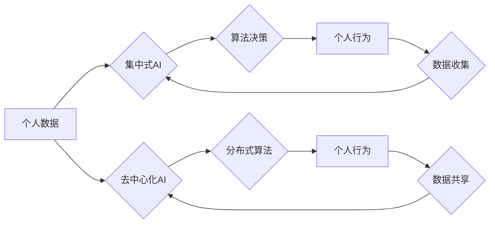

                 

## 欲望的去中心化：AI与个人自主权

> 关键词：人工智能、个人自主权、去中心化、伦理、算法、隐私

### 1. 背景介绍

人工智能（AI）的飞速发展，正在深刻地改变着我们的生活。从智能手机的语音助手到自动驾驶汽车，AI技术无处不在，为我们带来了便利和效率。然而，随着AI技术的进步，也引发了人们对个人自主权的担忧。

传统意义上，个人自主权是指个体在不受外部控制的情况下，能够自由地做出自己的选择和决定。但在AI时代，算法和数据正在逐渐影响着我们的决策，甚至潜移默化地塑造我们的欲望。

例如，社交媒体平台利用算法推荐个性化内容，可能会让我们沉迷其中，难以抽离。电商平台通过数据分析预测我们的消费需求，可能会让我们产生不必要的购买欲望。这些现象表明，AI技术正在挑战传统的个人自主权概念，我们需要认真思考AI与个人自主权之间的关系。

### 2. 核心概念与联系

**2.1 个人自主权**

个人自主权是个人在不受外部控制的情况下，能够自由地做出自己的选择和决定。它包括以下几个方面：

* **自主选择权:**  个体能够根据自己的意愿和价值观，选择自己的生活方式、职业道路和个人关系。
* **自由意志:**  个体能够独立思考，不受外部因素的强制影响，做出自己的判断和决定。
* **隐私权:**  个体能够控制自己的个人信息，不被他人无意或恶意地获取和利用。

**2.2 去中心化**

去中心化是指权力和控制分散在多个主体之间，而不是集中在单一实体手中。

在AI领域，去中心化意味着将AI算法和数据分散在多个节点上，而不是集中在大型公司或机构手中。

**2.3 AI与个人自主权的联系**

AI技术的发展可能会对个人自主权产生双重影响：

* **正面影响:** AI可以帮助人们解放生产力，获得更多自由时间和空间，从而更好地实现自我价值。
* **负面影响:** AI算法可能会被用于操控和控制人们的行为，侵犯人们的隐私和自由意志。

**2.4 去中心化AI与个人自主权**

去中心化AI可以帮助缓解AI对个人自主权的潜在威胁。

通过分散AI算法和数据，可以防止任何单一实体拥有过大的控制权，从而保护个人的隐私和自由意志。

**Mermaid 流程图**



### 3. 核心算法原理 & 具体操作步骤

**3.1 算法原理概述**

去中心化AI的核心算法原理是将传统的集中式AI模型分散到多个节点上，每个节点都运行着相同的算法，并通过网络进行数据交换和协作。

这种分布式架构可以提高AI系统的鲁棒性和安全性，同时也能更好地保护个人数据隐私。

**3.2 算法步骤详解**

1. **数据分片:** 将原始数据分成多个片段，分别存储在不同的节点上。
2. **模型分片:** 将AI模型分成多个子模型，每个子模型负责处理一部分数据片段。
3. **分布式训练:** 各个节点分别训练自己的子模型，并通过网络进行参数更新和模型融合。
4. **预测推理:** 当需要进行预测时，各个节点根据自己的子模型进行计算，并将结果汇总在一起得到最终的预测结果。

**3.3 算法优缺点**

**优点:**

* **提高安全性:** 数据分散存储，即使某个节点被攻击，也不会导致整个系统的崩溃。
* **增强隐私保护:** 个人数据分散存储，不易被恶意获取和利用。
* **提高效率:** 多个节点并行计算，可以加速AI模型的训练和预测速度。

**缺点:**

* **网络依赖:** 需要稳定的网络连接才能保证各个节点之间的通信和协作。
* **协调复杂:** 需要复杂的协调机制来保证各个节点的数据同步和模型融合。
* **资源消耗:** 分布式训练需要更多的计算资源和存储空间。

**3.4 算法应用领域**

* **医疗保健:** 分布式训练可以用于分析患者的医疗数据，提高疾病诊断和治疗的准确性。
* **金融科技:** 分布式AI可以用于检测金融欺诈，评估风险，并提供个性化的金融服务。
* **物联网:** 分布式AI可以用于分析物联网设备的数据，提高设备的智能化和可靠性。

### 4. 数学模型和公式 & 详细讲解 & 举例说明

**4.1 数学模型构建**

去中心化AI的数学模型通常基于图论和概率论。

图论用于表示各个节点之间的连接关系，概率论用于描述数据分布和模型参数的更新规则。

**4.2 公式推导过程**

例如，在分布式训练过程中，每个节点都会根据自己的数据片段和邻居节点的参数更新规则，来更新自己的模型参数。

这个更新规则通常是一个迭代过程，可以表示为以下公式：

$$
\theta_i^{t+1} = \theta_i^t + \alpha \cdot \nabla L_i(\theta_i^t) + \beta \cdot \sum_{j \in N(i)} \nabla L_j(\theta_j^t)
$$

其中：

* $\theta_i^t$ 表示节点 $i$ 在时间 $t$ 的模型参数。
* $\alpha$ 和 $\beta$ 是学习率参数，控制着参数更新的步长。
* $L_i(\theta_i^t)$ 表示节点 $i$ 的损失函数，衡量模型预测结果与真实值的差距。
* $N(i)$ 表示节点 $i$ 的邻居节点集合。

**4.3 案例分析与讲解**

例如，在训练一个图像识别模型时，可以将图像数据分成多个片段，分别存储在不同的节点上。

每个节点都训练一个子模型，负责识别图像片段中的特定物体。

通过网络通信，各个节点可以共享模型参数和训练结果，从而提高模型的整体性能。

### 5. 项目实践：代码实例和详细解释说明

**5.1 开发环境搭建**

* **操作系统:** Linux (Ubuntu 或 CentOS)
* **编程语言:** Python
* **深度学习框架:** TensorFlow 或 PyTorch
* **网络库:** Socket 或 ZeroMQ

**5.2 源代码详细实现**

```python
# 节点类
class Node:
    def __init__(self, id, data):
        self.id = id
        self.data = data
        self.model = ... # 模型初始化

    def train(self, data):
        # 使用数据训练模型
        pass

    def update_params(self, params):
        # 更新模型参数
        pass

    def predict(self, data):
        # 使用模型进行预测
        pass

# 网络类
class Network:
    def __init__(self, nodes):
        self.nodes = nodes

    def communicate(self):
        # 节点间通信，共享模型参数和训练结果
        pass

    def train(self, data):
        # 分布式训练
        pass

# 主程序
if __name__ == "__main__":
    # 创建节点
    nodes = [Node(i, data) for i, data in enumerate(data_list)]
    # 创建网络
    network = Network(nodes)
    # 分布式训练
    network.train(data)
```

**5.3 代码解读与分析**

* 节点类负责处理单个节点的数据和模型训练。
* 网络类负责管理多个节点之间的通信和协作。
* 主程序创建节点和网络，并启动分布式训练过程。

**5.4 运行结果展示**

运行结果可以包括训练过程中的损失函数变化曲线、模型预测的准确率等指标。

### 6. 实际应用场景

**6.1 医疗保健**

* **疾病诊断:** 分布式AI可以分析患者的医疗影像数据，提高疾病诊断的准确性。
* **个性化治疗:** 分布式AI可以分析患者的基因信息和生活习惯，制定个性化的治疗方案。

**6.2 金融科技**

* **欺诈检测:** 分布式AI可以分析金融交易数据，识别潜在的欺诈行为。
* **风险评估:** 分布式AI可以分析客户的信用记录和财务状况，评估贷款风险。

**6.3 物联网**

* **设备故障预测:** 分布式AI可以分析物联网设备的运行数据，预测设备故障，并及时进行维护。
* **智能家居:** 分布式AI可以控制智能家居设备，提供更加智能化的家居体验。

**6.4 未来应用展望**

随着AI技术的不断发展，去中心化AI将在更多领域得到应用，例如：

* **教育:** 个性化学习、智能辅导
* **交通:** 自动驾驶、智能交通管理
* **能源:** 智能电网、可再生能源管理

### 7. 工具和资源推荐

**7.1 学习资源推荐**

* **书籍:**
    * 《深度学习》
    * 《人工智能：一种现代方法》
* **在线课程:**
    * Coursera: 深度学习
    * edX: 人工智能

**7.2 开发工具推荐**

* **深度学习框架:** TensorFlow, PyTorch
* **网络库:** Socket, ZeroMQ

**7.3 相关论文推荐**

* **Federated Learning: Collaborative Machine Learning Without Centralized Training Data**
* **Deep Learning with Differential Privacy**

### 8. 总结：未来发展趋势与挑战

**8.1 研究成果总结**

去中心化AI技术在保护个人隐私、提高系统安全性、增强模型鲁棒性等方面取得了显著进展。

**8.2 未来发展趋势**

* **更有效的分布式训练算法:** 提高训练效率，降低资源消耗。
* **更强大的隐私保护机制:** 确保个人数据安全，防止信息泄露。
* **更广泛的应用场景:** 将去中心化AI技术应用于更多领域，解决更多实际问题。

**8.3 面临的挑战**

* **网络安全:** 保证网络通信的安全性和可靠性。
* **数据一致性:** 确保各个节点的数据一致性，避免模型训练偏差。
* **算法公平性:** 避免算法歧视，确保公平公正的决策结果。

**8.4 研究展望**

未来，去中心化AI技术将继续发展，并与其他新兴技术融合，例如区块链、量子计算等，为我们创造更加安全、公平、透明的数字世界。

### 9. 附录：常见问题与解答

**9.1 如何保证去中心化AI系统的安全性？**

可以通过采用加密技术、身份验证机制、数据分片等技术来保证去中心化AI系统的安全性。

**9.2 如何解决去中心化AI系统中的数据一致性问题？**

可以通过采用共识机制、数据同步算法等技术来解决去中心化AI系统中的数据一致性问题。

**9.3 如何确保去中心化AI算法的公平性？**

可以通过采用公平性算法、数据预处理、模型评估等方法来确保去中心化AI算法的公平性。


作者：禅与计算机程序设计艺术 / Zen and the Art of Computer Programming 
<end_of_turn>

