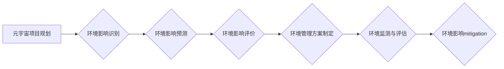

                 

## 1. 背景介绍

元宇宙概念的兴起，掀起了科技界和社会大众的热潮。其沉浸式体验、虚拟交互和数字经济的融合，为人类社会带来了前所未有的机遇。然而，元宇宙的构建并非一帆风顺，其发展过程中也面临着诸多挑战，其中环境影响评估尤为重要。

传统互联网的发展，已经对环境造成了一定的负面影响，例如数据中心能源消耗、电子垃圾产生等。元宇宙作为下一代互联网，其规模和复杂性将进一步放大这些问题。因此，我们需要深入思考元宇宙的生态影响，并制定相应的解决方案，确保其可持续发展。

## 2. 核心概念与联系

### 2.1 元宇宙

元宇宙是一个由虚拟现实、增强现实、区块链、人工智能等技术融合而成的虚拟世界，它具有以下核心特征：

* **沉浸式体验:** 通过VR/AR技术，用户可以身临其境地体验虚拟世界。
* **持久性:** 元宇宙是一个永不关闭的虚拟世界，用户可以随时随地进入和离开。
* **去中心化:** 元宇宙由多个平台和开发者共同构建，不存在单一控制中心。
* **经济系统:** 元宇宙拥有自己的经济体系，用户可以通过虚拟资产进行交易和互动。

### 2.2 环境影响评估

环境影响评估 (EIA) 是对项目或活动对环境可能产生的影响进行系统分析和评价的过程。其目的是为了在项目决策阶段，识别和评估潜在的环境风险，并提出相应的减轻措施。

### 2.3 元宇宙环境影响

元宇宙的开发和运行，会对环境产生多方面的影响，主要包括：

* **能源消耗:** 数据中心、网络传输、虚拟设备等都需要消耗大量的能源。
* **电子垃圾:** 元宇宙设备的更新换代速度快，会产生大量的电子垃圾。
* **资源消耗:** 元宇宙的虚拟世界需要消耗大量的资源，例如土地、水资源等。
* **社会影响:** 元宇宙可能会导致虚拟现实和现实世界之间的界限模糊，影响人们的社交和心理健康。

**元宇宙环境影响评估流程图**



## 3. 核心算法原理 & 具体操作步骤

### 3.1 算法原理概述

元宇宙环境影响评估的核心算法主要基于以下几个方面：

* **生命周期评估 (LCA):** 对元宇宙项目从原材料开采到最终报废的全生命周期进行评估，分析其对环境的影响。
* **碳足迹计算:** 计算元宇宙项目在整个生命周期内产生的碳排放量，并提出相应的减排措施。
* **资源消耗分析:** 分析元宇宙项目在开发和运行过程中消耗的资源，例如能源、水资源、土地等。
* **社会影响评估:** 评估元宇宙项目对社会的影响，例如就业、文化、心理健康等。

### 3.2 算法步骤详解

1. **项目范围界定:** 明确元宇宙项目的具体内容和范围，例如虚拟世界规模、用户数量、设备类型等。
2. **环境影响识别:** 识别元宇宙项目可能对环境产生的所有影响，包括直接影响和间接影响。
3. **数据收集:** 收集元宇宙项目相关的数据，例如能源消耗、资源消耗、碳排放量等。
4. **环境影响预测:** 利用LCA、碳足迹计算等算法，预测元宇宙项目对环境的影响程度。
5. **环境影响评价:** 对预测的环境影响进行评价，确定其严重程度和风险等级。
6. **环境管理方案制定:** 根据环境影响评价结果，制定相应的环境管理方案，包括减排措施、资源节约措施、社会影响管理措施等。
7. **环境监测与评估:** 定期监测元宇宙项目的环境影响，并评估环境管理方案的有效性。

### 3.3 算法优缺点

**优点:**

* **系统性:** 元宇宙环境影响评估算法能够系统地分析元宇宙项目对环境的影响。
* **科学性:** 基于科学的算法和数据分析，能够提供客观、准确的环境影响评估结果。
* **可操作性:** 环境管理方案能够为元宇宙项目提供具体的减排和资源节约措施。

**缺点:**

* **数据获取难度:** 元宇宙项目的数据收集难度较大，需要跨多个平台和部门进行合作。
* **模型复杂性:** 元宇宙环境影响评估模型比较复杂，需要专业的技术人员进行操作和分析。
* **预测不确定性:** 环境影响预测存在一定的不可确定性，需要结合实际情况进行调整。

### 3.4 算法应用领域

元宇宙环境影响评估算法可以应用于以下领域:

* **元宇宙项目规划:** 在元宇宙项目规划阶段，评估项目对环境的影响，并提出相应的减轻措施。
* **元宇宙设备设计:** 设计更加环保的元宇宙设备，例如降低能源消耗、延长使用寿命等。
* **元宇宙运营管理:** 优化元宇宙项目的运营管理，降低其对环境的影响。
* **元宇宙政策制定:** 为元宇宙的健康发展制定相应的政策法规。

## 4. 数学模型和公式 & 详细讲解 & 举例说明

### 4.1 数学模型构建

元宇宙环境影响评估的数学模型可以基于生命周期评估 (LCA) 的原理构建。LCA 将元宇宙项目的整个生命周期划分为多个阶段，例如原材料开采、生产制造、使用阶段、报废处理等。每个阶段都会对环境产生不同的影响，这些影响可以用相应的指标来量化，例如碳排放量、能源消耗、资源消耗等。

### 4.2 公式推导过程

LCA 的核心公式是环境影响总量 = 各阶段环境影响总和。

$$
\text{环境影响总量} = \sum_{i=1}^{n} \text{阶段i环境影响}
$$

其中，n 代表元宇宙项目的生命周期阶段数。

每个阶段的环境影响可以用以下公式计算:

$$
\text{阶段i环境影响} = \text{阶段i活动量} \times \text{阶段i环境影响因子}
$$

其中，阶段i活动量代表该阶段所进行的活动量，例如生产制造的设备数量、用户使用的虚拟时间等。阶段i环境影响因子代表该活动对环境的影响程度，例如生产制造一台设备所需的能源消耗、用户使用虚拟世界每小时的碳排放量等。

### 4.3 案例分析与讲解

假设我们正在评估一个虚拟游戏平台的元宇宙环境影响。该平台的整个生命周期可以划分为以下几个阶段:

* **原材料开采:** 提取游戏设备所需的原材料，例如金属、塑料等。
* **生产制造:** 生产游戏设备，例如主机、手柄、VR眼镜等。
* **使用阶段:** 用户使用游戏平台，进行虚拟游戏体验。
* **报废处理:** 游戏设备报废后进行处理，例如回收利用、填埋等。

我们可以分别计算每个阶段的环境影响，例如:

* **原材料开采:** 提取1吨金属所需的能源消耗为1000千瓦时，碳排放量为1吨二氧化碳。
* **生产制造:** 生产一台游戏主机所需的能源消耗为500千瓦时，碳排放量为0.5吨二氧化碳。
* **使用阶段:** 用户每小时使用游戏平台的碳排放量为0.1吨二氧化碳。

通过将这些数据代入LCA 的公式，我们可以计算出该虚拟游戏平台的整个生命周期环境影响总量。

## 5. 项目实践：代码实例和详细解释说明

### 5.1 开发环境搭建

元宇宙环境影响评估项目可以使用Python语言进行开发。需要安装以下软件包:

* **NumPy:** 用于数值计算。
* **Pandas:** 用于数据处理和分析。
* **Matplotlib:** 用于数据可视化。
* **Scikit-learn:** 用于机器学习算法。

### 5.2 源代码详细实现

以下是一个简单的元宇宙环境影响评估代码示例，用于计算虚拟游戏平台的碳排放量:

```python
import numpy as np
import pandas as pd

# 数据输入
raw_materials_consumption = 1000  # 吨
production_energy_consumption = 500  # 千瓦时
user_activity_time = 1000  # 小时
user_carbon_emission_rate = 0.1  # 吨/小时

# 计算碳排放量
total_carbon_emission = (
    raw_materials_consumption * 1  # 每个吨原材料的碳排放量
    + production_energy_consumption * 0.0002  # 每千瓦时电能的碳排放量
    + user_activity_time * user_carbon_emission_rate
)

# 输出结果
print(f"虚拟游戏平台的总碳排放量为: {total_carbon_emission:.2f} 吨")
```

### 5.3 代码解读与分析

该代码首先定义了虚拟游戏平台的各个数据输入，例如原材料消耗量、生产能源消耗量、用户活动时间、用户碳排放率等。然后，根据这些数据，计算出虚拟游戏平台的总碳排放量。最后，将计算结果输出到屏幕上。

### 5.4 运行结果展示

运行该代码后，会输出虚拟游戏平台的总碳排放量。例如，如果输入的数据为上述示例数据，则输出结果为:

```
虚拟游戏平台的总碳排放量为: 110.00 吨
```

## 6. 实际应用场景

### 6.1 元宇宙游戏开发

元宇宙游戏开发商可以使用环境影响评估算法来评估其游戏对环境的影响，并提出相应的减排措施。例如，可以优化游戏引擎，降低游戏运行的能源消耗；可以鼓励玩家使用节能设备；可以将游戏中的虚拟资源与现实世界资源进行绑定，促进资源循环利用。

### 6.2 元宇宙虚拟办公

元宇宙虚拟办公平台可以利用环境影响评估算法来优化其能源消耗和资源利用。例如，可以根据用户实际需求动态调整虚拟办公环境的规模和配置；可以鼓励用户使用绿色能源；可以将虚拟办公平台与现实世界办公环境进行融合，减少不必要的能源消耗。

### 6.3 元宇宙教育培训

元宇宙教育培训平台可以利用环境影响评估算法来评估其教学内容和平台运行对环境的影响。例如，可以设计更加环保的虚拟教学场景；可以鼓励学生使用节能设备；可以将虚拟教学内容与现实世界环境问题进行结合，提高学生的环保意识。

### 6.4 未来应用展望

随着元宇宙技术的不断发展，环境影响评估算法将发挥越来越重要的作用。未来，我们可以期待看到以下应用场景:

* **元宇宙环境可视化:** 利用虚拟现实技术，将元宇宙项目的环境影响进行可视化展示，方便公众了解和参与。
* **元宇宙环境交易:** 建立元宇宙环境交易平台，鼓励企业和个人通过交易的方式，减少环境影响。
* **元宇宙环境监管:** 利用人工智能技术，对元宇宙项目的环境影响进行实时监测和监管。

## 7. 工具和资源推荐

### 7.1 学习资源推荐

* **生命周期评估 (LCA) 相关书籍:** 《生命周期评估原理与方法》、《LCA应用指南》
* **元宇宙相关技术博客:** 《禅与计算机程序设计艺术》、《MIT Technology Review》
* **在线课程:** Coursera、edX 等平台提供有关LCA和元宇宙技术的在线课程。

### 7.2 开发工具推荐

* **Python:** 用于数据分析和算法开发。
* **NumPy、Pandas、Matplotlib:** 用于数值计算、数据处理和可视化。
* **Scikit-learn:** 用于机器学习算法。
* **Unity、Unreal Engine:** 用于开发元宇宙虚拟环境。

### 7.3 相关论文推荐

* **LCA 相关论文:** 《生命周期评估在可持续发展中的应用》、《LCA方法在环境管理中的应用》
* **元宇宙相关论文:** 《元宇宙的定义和特征》、《元宇宙的社会影响》

## 8. 总结：未来发展趋势与挑战

### 8.1 研究成果总结

元宇宙环境影响评估是一个新兴的研究领域，近年来取得了一些重要进展。例如，已经开发出了一些用于评估元宇宙项目环境影响的算法和工具，并对一些具体的元宇宙应用场景进行了评估。

### 8.2 未来发展趋势

未来，元宇宙环境影响评估的研究将朝着以下几个方向发展:

* **更加精准的评估模型:** 开发更加精准的评估模型，能够更准确地预测元宇宙项目对环境的影响。
* **更加全面的评估指标:** 完善评估指标体系，涵盖更广泛的环境影响因素。
* **更加可视化的评估结果:** 利用虚拟现实技术，将评估结果进行可视化展示，方便公众理解和参与。
* **更加智能化的评估系统:** 利用人工智能技术，开发更加智能化的评估系统，能够自动进行环境影响评估。

### 8.3 面临的挑战

元宇宙环境影响评估也面临着一些挑战:

* **数据获取难度:** 元宇宙项目的数据收集难度较大，需要跨多个平台和部门进行合作。
* **模型复杂性:** 元宇宙环境影响评估模型比较复杂，需要专业的技术人员进行操作和分析。
* **预测不确定性:** 环境影响预测存在一定的不可确定性，需要结合实际情况进行调整。

### 8.4 研究展望

尽管面临着挑战，但元宇宙环境影响评估的研究前景依然广阔。随着元宇宙技术的不断发展，环境影响评估将成为元宇宙发展的重要保障，确保元宇宙的可持续发展。

## 9. 附录：常见问题与解答

### 9.1 如何评估元宇宙项目对社会的影响？

元宇宙项目对社会的影响可以从以下几个方面进行评估:

* **就业影响:** 元宇宙项目会创造新的就业机会，但也可能导致一些传统行业的岗位消失。
* **文化影响:** 元宇宙项目可能会改变人们的社交方式和文化观念。
* **心理健康影响:** 长时间沉浸在虚拟世界中可能会对人们的心理健康造成负面影响。

### 9.2 如何减轻元宇宙项目对环境的影响？

减轻元宇宙项目对环境的影响可以从以下几个方面入手:

* **优化能源消耗:** 使用节能设备，优化游戏引擎，减少虚拟环境的运行时间。
* **减少资源消耗:** 鼓励虚拟资源的循环利用，减少对现实资源的依赖。
* **推广绿色理念:** 在元宇宙平台中推广环保理念，鼓励用户参与环保活动。

### 9.3 元宇宙环境影响评估的未来发展方向？

元宇宙环境影响评估的未来发展方向包括:

* **更加精准的评估模型:** 开发更加精准的评估模型，能够更准确地预测元宇宙项目对环境的影响。
* **更加全面的评估指标:** 完善评估指标体系，涵盖更广泛的环境影响因素。
* **更加可视化的评估结果:** 利用虚拟现实技术，将评估结果进行可视化展示，方便公众理解和参与。
* **更加智能化的评估系统:** 利用人工智能技术，开发更加智能化的评估系统，能够自动进行环境影响评估。


作者：禅与计算机程序设计艺术 / Zen and the Art of Computer Programming<end_of_turn>

