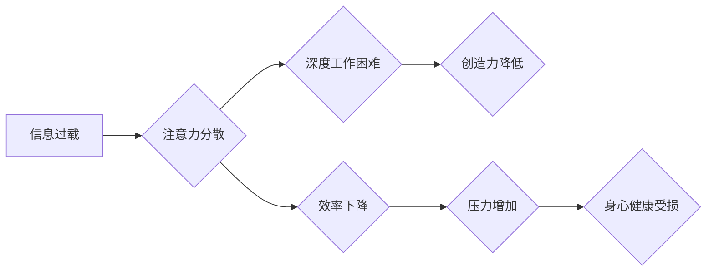

                 

##  注意力经济与个人时间分配方式的转变

> 关键词：注意力经济、时间分配、深度工作、信息过载、数字产品、认知行为、算法设计、用户体验

### 1. 背景介绍

在当今信息爆炸的时代，我们每个人都被无休止的信息流所包围。从智能手机的推送通知到社交媒体的动态更新，从电子邮件的轰炸到网络新闻的滚动，信息无处不在，时刻都在争夺我们的注意力。这种状态被称为“注意力经济”，它深刻地改变了我们对时间和信息的认知，也对个人时间分配方式提出了新的挑战。

传统的经济学认为，时间是有限的资源，而注意力则是用来获取和处理信息的工具。然而，在注意力经济中，注意力本身成为了最宝贵的资源。因为注意力是稀缺的，而信息却充斥着我们的生活，所以如何有效地分配和管理注意力成为了至关重要的生存技能。

### 2. 核心概念与联系

#### 2.1 注意力经济

注意力经济是指在信息时代，注意力成为一种稀缺资源，并被商业化和交易的经济模式。在这个模式中，数字产品和服务通过各种手段争夺用户的注意力，并以此获取利润。

#### 2.2 信息过载

信息过载是指在短时间内接收和处理过多的信息，导致认知能力超负荷，难以有效地获取和理解信息。信息过载是注意力经济的重要特征，它使得人们更容易被分散注意力，难以专注于重要的事情。

#### 2.3 深度工作

深度工作是指专注于一项任务，排除干扰，并投入大量时间和精力进行思考和创造。深度工作是提高效率和创造力的关键，但它在注意力经济中变得越来越困难。

**Mermaid 流程图**



### 3. 核心算法原理 & 具体操作步骤

#### 3.1 算法原理概述

注意力经济的核心算法原理是通过算法设计和数据分析，预测和引导用户的注意力。这些算法通常基于以下几个方面：

* **用户行为分析:** 通过分析用户的浏览记录、点击行为、停留时间等数据，了解用户的兴趣和偏好。
* **内容推荐:** 根据用户的行为数据，推荐与用户兴趣相关的文章、视频、产品等内容。
* **个性化推送:** 根据用户的行为数据和时间安排，个性化推送通知和提醒。
* **注意力机制:** 利用深度学习等技术，设计注意力机制，引导用户关注重要的信息，并过滤掉无关的信息。

#### 3.2 算法步骤详解

1. **数据收集:** 收集用户的行为数据，包括浏览记录、点击行为、停留时间、评论点赞等。
2. **数据预处理:** 对收集到的数据进行清洗、转换和格式化，以便于算法训练和分析。
3. **特征提取:** 从用户行为数据中提取特征，例如用户兴趣、偏好、阅读习惯、时间安排等。
4. **模型训练:** 利用机器学习算法，训练模型，预测用户的注意力模式和兴趣偏好。
5. **内容推荐:** 根据训练好的模型，推荐与用户兴趣相关的文章、视频、产品等内容。
6. **个性化推送:** 根据用户的行为数据和时间安排，个性化推送通知和提醒。
7. **注意力机制:** 利用深度学习等技术，设计注意力机制，引导用户关注重要的信息，并过滤掉无关的信息。

#### 3.3 算法优缺点

**优点:**

* **精准推荐:** 算法可以根据用户的行为数据，精准推荐与用户兴趣相关的內容。
* **个性化体验:** 算法可以根据用户的行为数据和时间安排，提供个性化的体验。
* **提高效率:** 算法可以帮助用户过滤掉无关的信息，提高效率。

**缺点:**

* **信息茧房:** 算法可能会导致用户陷入信息茧房，只接触到与自己观点相符的信息。
* **隐私问题:** 算法需要收集用户的行为数据，可能会引发隐私问题。
* **算法偏差:** 算法可能会存在偏差，导致不公平的结果。

#### 3.4 算法应用领域

注意力经济的算法应用领域非常广泛，包括：

* **社交媒体:** 推送推荐、个性化内容、广告投放。
* **搜索引擎:** 搜索结果排序、个性化推荐、内容推荐。
* **电商平台:** 商品推荐、个性化营销、广告投放。
* **新闻媒体:** 内容推荐、个性化推送、广告投放。
* **教育平台:** 学习资源推荐、个性化学习路径、知识图谱构建。

### 4. 数学模型和公式 & 详细讲解 & 举例说明

#### 4.1 数学模型构建

注意力经济中的核心数学模型是基于概率论和统计学的。例如，用户点击某个链接的概率可以被建模为一个logistic回归模型，其中输入特征包括用户的行为数据、内容特征等。

#### 4.2 公式推导过程

假设用户点击某个链接的概率为P(click)，则logistic回归模型可以表示为：

$$P(click) = \frac{1}{1 + e^{-(w_0 + w_1 * x_1 + w_2 * x_2 + ... + w_n * x_n)}}$$

其中：

* $w_0, w_1, w_2, ..., w_n$ 是模型参数，通过训练数据学习得到。
* $x_1, x_2, ..., x_n$ 是用户行为数据和内容特征的向量表示。

#### 4.3 案例分析与讲解

例如，假设我们想要预测用户点击某个新闻链接的概率。我们可以将用户的行为数据，例如浏览历史、阅读时间、点赞数等，以及新闻内容的特征，例如标题、关键词、作者等，作为输入特征。通过训练logistic回归模型，我们可以得到模型参数，并利用这些参数预测用户点击该新闻链接的概率。

### 5. 项目实践：代码实例和详细解释说明

#### 5.1 开发环境搭建

为了实现注意力经济的算法，我们可以使用Python语言和相关的机器学习库，例如Scikit-learn、TensorFlow、PyTorch等。

#### 5.2 源代码详细实现

```python
from sklearn.linear_model import LogisticRegression

# 准备数据
X = [[user_behavior_feature_1, user_behavior_feature_2, ..., user_behavior_feature_n],
     [user_behavior_feature_1, user_behavior_feature_2, ..., user_behavior_feature_n],
     ...,
     [user_behavior_feature_1, user_behavior_feature_2, ..., user_behavior_feature_n]]
y = [click_label_1, click_label_2, ..., click_label_n]

# 训练模型
model = LogisticRegression()
model.fit(X, y)

# 预测点击概率
new_user_data = [[new_user_behavior_feature_1, new_user_behavior_feature_2, ..., new_user_behavior_feature_n]]
click_probability = model.predict_proba(new_user_data)[0][1]

print(f"点击概率: {click_probability}")
```

#### 5.3 代码解读与分析

这段代码展示了如何使用Scikit-learn库中的LogisticRegression模型训练一个简单的注意力经济算法。

* 首先，我们需要准备训练数据，包括用户的行为数据和点击标签。
* 然后，我们创建一个LogisticRegression模型实例，并使用训练数据训练模型。
* 最后，我们可以使用训练好的模型预测新用户的点击概率。

#### 5.4 运行结果展示

运行结果会输出新用户的点击概率，例如0.75，表示该用户点击该链接的概率为75%。

### 6. 实际应用场景

#### 6.1 社交媒体平台

社交媒体平台利用注意力经济算法推荐个性化内容，引导用户持续使用平台，并通过广告投放获取利润。例如，Facebook和Instagram会根据用户的兴趣和行为数据，推荐相关的文章、视频和广告。

#### 6.2 搜索引擎

搜索引擎利用注意力经济算法优化搜索结果排序，引导用户点击更相关的链接，并提高用户体验。例如，Google会根据用户的搜索历史、地理位置和设备信息，推荐更相关的搜索结果。

#### 6.3 电商平台

电商平台利用注意力经济算法推荐个性化商品，引导用户购买商品，并提高转化率。例如，Amazon会根据用户的浏览历史、购买记录和评价信息，推荐相关的商品。

#### 6.4 新闻媒体

新闻媒体利用注意力经济算法推荐个性化新闻，引导用户阅读新闻，并提高用户粘性。例如，新闻网站会根据用户的阅读历史和兴趣偏好，推荐相关的新闻文章。

#### 6.5 教育平台

教育平台利用注意力经济算法推荐个性化学习资源，引导用户学习，并提高学习效率。例如，在线学习平台会根据用户的学习进度、知识点掌握情况和学习风格，推荐相关的学习资源。

#### 6.6 未来应用展望

注意力经济的应用场景还在不断扩展，未来可能会应用于更多领域，例如医疗保健、金融服务、政府服务等。

### 7. 工具和资源推荐

#### 7.1 学习资源推荐

* **书籍:**

    * 《注意力经济》 by Michael Harris
    * 《深度工作》 by Cal Newport
    * 《信息焦虑症》 by  Nicholas Carr

* **在线课程:**

    * Coursera: Machine Learning
    * edX: Artificial Intelligence

#### 7.2 开发工具推荐

* **Python:** 

    * Scikit-learn
    * TensorFlow
    * PyTorch

* **数据分析工具:**

    * Jupyter Notebook
    * Pandas
    * Matplotlib

#### 7.3 相关论文推荐

* **Attention Is All You Need** by Vaswani et al.
* **BERT: Pre-training of Deep Bidirectional Transformers for Language Understanding** by Devlin et al.

### 8. 总结：未来发展趋势与挑战

#### 8.1 研究成果总结

注意力经济的研究成果表明，算法可以有效地预测和引导用户的注意力，并应用于各种领域。

#### 8.2 未来发展趋势

未来注意力经济的研究将更加注重以下几个方面:

* **个性化定制:** 更加精准地预测用户的注意力模式，并提供更加个性化的体验。
* **伦理问题:** 关注算法的伦理问题，例如信息茧房、隐私问题、算法偏差等。
* **可解释性:** 提高算法的可解释性，让用户更好地理解算法是如何运作的。

#### 8.3 面临的挑战

注意力经济的发展也面临着一些挑战:

* **数据隐私:** 如何保护用户的隐私数据，避免被滥用。
* **算法公平性:** 如何避免算法产生偏差，导致不公平的结果。
* **用户控制权:** 如何让用户更好地控制自己的注意力，避免被算法操控。

#### 8.4 研究展望

未来，注意力经济的研究需要更加注重伦理和社会影响，并探索更加公平、透明、可控的算法设计方法。


### 9. 附录：常见问题与解答

#### 9.1 如何避免信息过载？

* **设定时间限制:** 为每个任务设定时间限制，避免过度沉浸在信息中。
* **关闭不必要的通知:** 关闭社交媒体和电子邮件的通知，减少信息干扰。
* **使用专注工具:** 使用专注工具，例如番茄工作法，帮助集中注意力。

#### 9.2 如何提高深度工作效率？

* **创造安静的工作环境:** 远离噪音和干扰，创造一个安静的工作环境。
* **制定计划:** 制定每天的工作计划，并专注于完成最重要的任务。
* **避免多任务处理:** 避免同时进行多个任务，专注于完成一个任务。


作者：禅与计算机程序设计艺术 / Zen and the Art of Computer Programming 
<end_of_turn>

