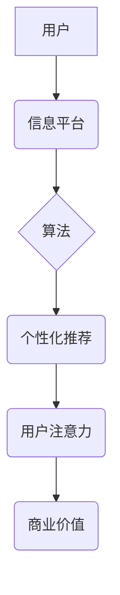

                 

##  注意力经济与个人隐私保护的平衡

> 关键词：注意力经济、隐私保护、深度学习、联邦学习、数据安全、伦理困境、可解释性、隐私计算

## 1. 背景介绍

在数字时代，信息爆炸和网络技术的飞速发展，使得“注意力”成为一种稀缺的资源，被誉为“新石油”。人们每天被海量信息淹没，如何有效地获取和利用注意力，成为了企业和个人都面临的挑战。与此同时，个人隐私也日益受到重视，数据泄露、滥用等问题频发，引发了社会广泛的关注和担忧。

注意力经济的本质是通过算法、数据分析和个性化推荐等手段，精准地捕捉用户的注意力，并将其转化为商业价值。社交媒体平台、搜索引擎、电商网站等，都通过各种方式，试图获取用户的注意力，并以此盈利。然而，这种获取注意力的方式，往往伴随着用户的隐私泄露和数据滥用的风险。

## 2. 核心概念与联系

### 2.1 注意力经济

注意力经济是指在信息爆炸的时代，人们对信息的筛选和获取能力有限，而注意力成为了稀缺的资源，可以通过商业模式获取和利用。

**核心要素：**

* **注意力：** 指的是人们对特定信息或内容的集中和投入。
* **信息过载：** 指的是人们在海量信息中难以有效地筛选和获取所需信息。
* **算法：** 通过数据分析和机器学习，精准地捕捉用户的注意力。
* **个性化推荐：** 根据用户的兴趣和行为，推荐相关内容，提高用户粘性和参与度。
* **商业模式：** 通过广告、会员订阅、数据交易等方式，将注意力转化为商业价值。

**架构图：**



### 2.2 个人隐私保护

个人隐私保护是指保护个人信息不被非法获取、使用、披露或损害的权利。

**核心要素：**

* **个人信息：** 指的是能够识别特定个体的任何信息，包括姓名、地址、电话号码、电子邮箱地址、生物特征等。
* **数据安全：** 指的是通过技术手段和管理制度，保障个人信息不被泄露、篡改或破坏。
* **隐私权：** 指的是个人对自身信息的控制权和自主权。
* **法律法规：** 指的是国家和地区制定的保护个人隐私的法律法规。

## 3. 核心算法原理 & 具体操作步骤

### 3.1 算法原理概述

注意力机制是一种模仿人类注意力机制的机器学习算法，它能够学习到输入数据中哪些部分更重要，并对这些重要部分给予更多的关注。

**核心思想：**

* **权重分配：** 对输入数据中的每个元素分配一个权重，表示其重要程度。
* **注意力得分：** 计算每个元素的注意力得分，得分越高，表示该元素越重要。
* **加权求和：** 根据注意力得分对输入数据进行加权求和，得到最终的输出。

### 3.2 算法步骤详解

1. **输入数据：** 将输入数据作为算法的输入。
2. **计算注意力得分：** 使用注意力机制计算每个元素的注意力得分。
3. **权重分配：** 根据注意力得分对输入数据进行权重分配。
4. **加权求和：** 根据权重对输入数据进行加权求和，得到最终的输出。

### 3.3 算法优缺点

**优点：**

* **提高模型性能：** 通过关注重要信息，可以提高模型的准确性和效率。
* **增强模型可解释性：** 可以通过注意力得分来理解模型的决策过程。
* **适用于多种任务：** 可以应用于文本处理、图像识别、语音识别等多种任务。

**缺点：**

* **计算复杂度高：** 计算注意力得分需要大量的计算资源。
* **参数量大：** 注意力机制通常需要大量的参数，需要大量的训练数据才能训练好。

### 3.4 算法应用领域

* **自然语言处理：** 机器翻译、文本摘要、问答系统等。
* **计算机视觉：** 图像识别、目标检测、图像分割等。
* **语音识别：** 语音转文本、语音合成等。
* **推荐系统：** 商品推荐、内容推荐等。

## 4. 数学模型和公式 & 详细讲解 & 举例说明

### 4.1 数学模型构建

注意力机制的数学模型通常基于以下公式：

**注意力得分：**

$$
\text{Attention}(Q, K, V) = \text{softmax}\left(\frac{Q K^T}{\sqrt{d_k}}\right) V
$$

其中：

* $Q$：查询矩阵
* $K$：键矩阵
* $V$：值矩阵
* $d_k$：键向量的维度
* $\text{softmax}$：softmax函数，用于将注意力得分归一化

**解释：**

* 查询矩阵 $Q$ 表示需要关注的信息。
* 键矩阵 $K$ 表示所有候选信息的特征。
* 值矩阵 $V$ 表示所有候选信息的具体内容。
* 注意力得分计算公式通过计算查询矩阵 $Q$ 和键矩阵 $K$ 的点积，并使用 softmax 函数归一化，得到每个候选信息的注意力得分。
* 最后，根据注意力得分对值矩阵 $V$ 进行加权求和，得到最终的输出。

### 4.2 公式推导过程

注意力机制的公式推导过程可以参考相关文献，例如：

* Vaswani et al. (2017). Attention Is All You Need.

### 4.3 案例分析与讲解

**举例：**

假设我们有一个句子 "我爱吃苹果"，想要使用注意力机制来识别其中的关键信息。

* $Q$：查询向量，表示我们想要关注的信息。
* $K$：键向量，表示每个单词的特征。
* $V$：值向量，表示每个单词的具体含义。

通过计算注意力得分，我们可以发现 "爱" 和 "苹果" 的注意力得分最高，说明这两个词语是句子中的关键信息。

## 5. 项目实践：代码实例和详细解释说明

### 5.1 开发环境搭建

* Python 3.x
* TensorFlow 或 PyTorch

### 5.2 源代码详细实现

```python
import tensorflow as tf

# 定义注意力机制
def attention_mechanism(query, keys, values, mask=None):
    # 计算注意力得分
    scores = tf.matmul(query, keys, transpose_b=True) / tf.math.sqrt(tf.cast(keys.shape[-1], tf.float32))
    if mask is not None:
        scores += (1 - mask) * -1e9
    # 使用 softmax 函数归一化注意力得分
    attention_weights = tf.nn.softmax(scores, axis=-1)
    # 对值矩阵进行加权求和
    context_vector = tf.matmul(attention_weights, values)
    return context_vector, attention_weights

# 示例代码
query = tf.constant([[1, 2, 3]])
keys = tf.constant([[4, 5, 6], [7, 8, 9]])
values = tf.constant([[10, 11, 12], [13, 14, 15]])

# 计算注意力得分和上下文向量
context_vector, attention_weights = attention_mechanism(query, keys, values)

# 打印结果
print("上下文向量:", context_vector.numpy())
print("注意力权重:", attention_weights.numpy())
```

### 5.3 代码解读与分析

* `attention_mechanism` 函数实现了注意力机制的核心逻辑，包括计算注意力得分、归一化注意力得分和加权求和。
* `query`、`keys` 和 `values` 分别表示查询向量、键向量和值向量。
* `mask` 用于屏蔽某些候选信息，例如在机器翻译中，可以屏蔽已经翻译过的单词。
* 示例代码演示了如何使用 `attention_mechanism` 函数计算注意力得分和上下文向量。

### 5.4 运行结果展示

运行代码后，会输出上下文向量和注意力权重。上下文向量表示对输入信息的加权求和，注意力权重表示每个候选信息的关注程度。

## 6. 实际应用场景

### 6.1  搜索引擎

注意力机制可以帮助搜索引擎更好地理解用户搜索意图，并返回更相关的搜索结果。

### 6.2  推荐系统

注意力机制可以帮助推荐系统个性化推荐商品或内容，提高用户体验。

### 6.3  机器翻译

注意力机制可以帮助机器翻译更好地捕捉句子中的关键信息，提高翻译质量。

### 6.4  未来应用展望

注意力机制在未来将有更广泛的应用，例如：

* **医疗诊断：** 帮助医生更好地理解患者的病症，提高诊断准确率。
* **金融风险管理：** 帮助金融机构识别潜在的风险，降低风险损失。
* **自动驾驶：** 帮助自动驾驶汽车更好地感知周围环境，提高安全性。

## 7. 工具和资源推荐

### 7.1 学习资源推荐

* **论文：** Attention Is All You Need (Vaswani et al., 2017)
* **博客文章：**

* **在线课程：**

### 7.2 开发工具推荐

* **TensorFlow：** https://www.tensorflow.org/
* **PyTorch：** https://pytorch.org/

### 7.3 相关论文推荐

* **Transformer：** https://arxiv.org/abs/1706.03762
* **BERT：** https://arxiv.org/abs/1810.04805
* **GPT-3：** https://openai.com/blog/gpt-3/

## 8. 总结：未来发展趋势与挑战

### 8.1 研究成果总结

注意力机制在近年来取得了显著的进展，在自然语言处理、计算机视觉等领域取得了突破性的成果。

### 8.2 未来发展趋势

* **更强大的注意力机制：** 研究更有效的注意力机制，提高模型性能和效率。
* **可解释性增强：** 研究更可解释的注意力机制，帮助人们更好地理解模型的决策过程。
* **隐私保护：** 研究隐私保护的注意力机制，保障用户隐私安全。

### 8.3 面临的挑战

* **计算复杂度：** 注意力机制的计算复杂度较高，需要更高效的算法和硬件支持。
* **数据依赖性：** 注意力机制需要大量的训练数据才能训练好，数据获取和标注成本较高。
* **伦理问题：** 注意力机制可能被用于操纵用户行为，需要关注其伦理问题。

### 8.4 研究展望

未来，注意力机制将继续发展，并在更多领域得到应用。研究者将致力于解决注意力机制的挑战，使其更加强大、可解释和安全。

## 9. 附录：常见问题与解答

* **什么是注意力机制？**

注意力机制是一种模仿人类注意力机制的机器学习算法，它能够学习到输入数据中哪些部分更重要，并对这些重要部分给予更多的关注。

* **注意力机制的应用场景有哪些？**

注意力机制的应用场景非常广泛，例如：搜索引擎、推荐系统、机器翻译、医疗诊断、金融风险管理等。

* **注意力机制的优势和劣势是什么？**

注意力机制的优势在于可以提高模型性能、增强模型可解释性和适用于多种任务。劣势在于计算复杂度高、参数量大。


作者：禅与计算机程序设计艺术 / Zen and the Art of Computer Programming 
<end_of_turn>

