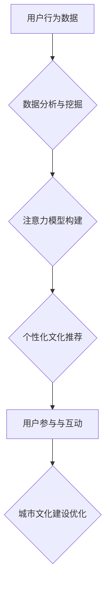

                 

## 注意力经济与城市文化建设

> 关键词：注意力经济、城市文化建设、人工智能、数据分析、用户行为、个性化推荐、城市规划、智能城市

## 1. 背景介绍

在当今信息爆炸的时代，人们面临着前所未有的信息过载。如何有效地获取、筛选和利用信息成为了一个至关重要的挑战。注意力经济应运而生，它强调了注意力作为一种稀缺资源的价值，并探讨了如何更好地管理和利用注意力。

城市文化建设是城市发展的重要组成部分，它涵盖了城市居民的精神生活、文化娱乐、公共服务等多个方面。随着城市化进程的加速，城市文化建设面临着新的机遇和挑战。如何利用科技手段提升城市文化建设的效率和质量，打造更加宜居、活力、文化丰富的城市，成为了一个亟待解决的问题。

## 2. 核心概念与联系

### 2.1 注意力经济

注意力经济是指在信息时代，注意力作为一种稀缺资源，被商业化和市场化运作的经济模式。它认为，人们的注意力是有限的，而信息竞争日益激烈，因此，获取和控制用户注意力成为了企业和组织的核心竞争力。

### 2.2 城市文化建设

城市文化建设是指通过规划、建设和管理城市公共文化设施，丰富城市文化生活，提升城市文化软实力的过程。它旨在打造具有独特文化特色的城市，提升城市居民的幸福感和生活质量。

### 2.3 连接

注意力经济与城市文化建设之间存在着密切的联系。一方面，城市文化建设需要吸引和留住居民的注意力，才能有效地提升居民的参与度和满意度。另一方面，注意力经济的商业模式可以为城市文化建设提供新的资金来源和运营模式。

**Mermaid 流程图**



## 3. 核心算法原理 & 具体操作步骤

### 3.1 算法原理概述

注意力机制是一种模仿人类注意力机制的机器学习算法，它能够学习到输入数据中最重要的部分，并对这些部分给予更多的关注。在城市文化建设领域，注意力机制可以用于分析用户行为数据，构建用户注意力模型，并根据用户的兴趣和偏好进行个性化文化推荐。

### 3.2 算法步骤详解

1. **数据收集与预处理:** 收集用户在城市文化设施、活动、服务等方面的行为数据，例如访问记录、评价、参与度等。对数据进行清洗、转换和特征提取，以便于模型训练。

2. **注意力模型构建:** 利用深度学习技术构建注意力模型，例如Transformer、BERT等。模型需要学习到用户行为数据中哪些特征与用户的文化兴趣相关，并赋予这些特征不同的权重。

3. **个性化文化推荐:** 根据用户的注意力模型，对城市文化资源进行排序和推荐。推荐结果可以包括文化活动、展览、博物馆、图书馆等，并根据用户的兴趣和偏好进行个性化定制。

4. **用户反馈与模型更新:** 收集用户对推荐结果的反馈，例如点击、评价、参与等。将用户反馈数据反馈到模型训练中，不断优化模型的推荐效果。

### 3.3 算法优缺点

**优点:**

* **个性化推荐:** 可以根据用户的兴趣和偏好进行个性化推荐，提升用户体验。
* **数据驱动:** 基于用户行为数据进行分析和决策，更加科学和精准。
* **持续优化:** 通过用户反馈不断优化模型，提升推荐效果。

**缺点:**

* **数据依赖:** 需要大量的用户行为数据进行训练，否则模型效果会受到影响。
* **算法复杂:** 注意力机制算法相对复杂，需要专业的技术人员进行开发和维护。
* **隐私安全:** 用户行为数据涉及个人隐私，需要采取相应的安全措施进行保护。

### 3.4 算法应用领域

注意力机制在城市文化建设领域具有广泛的应用前景，例如:

* **文化活动推荐:** 根据用户的兴趣和偏好推荐相关的文化活动，例如音乐会、戏剧演出、展览等。
* **博物馆和图书馆资源推荐:** 根据用户的阅读习惯和兴趣推荐相关的博物馆展品和图书馆书籍。
* **城市旅游路线规划:** 根据用户的兴趣和时间安排推荐个性化的城市旅游路线。
* **文化设施运营管理:** 分析用户行为数据，优化文化设施的运营管理，提升服务质量。

## 4. 数学模型和公式 & 详细讲解 & 举例说明

### 4.1 数学模型构建

注意力机制的核心是注意力权重，它表示模型对不同输入元素的关注程度。常用的注意力机制模型包括自注意力机制和多头注意力机制。

**自注意力机制:**

自注意力机制用于计算序列中每个元素与其他所有元素之间的注意力权重。其计算公式如下:

$$
\text{Attention}(Q, K, V) = \text{softmax}\left(\frac{Q K^T}{\sqrt{d_k}}\right) V
$$

其中:

* $Q$：查询矩阵
* $K$：键矩阵
* $V$：值矩阵
* $d_k$：键向量的维度
* $\text{softmax}$：softmax函数，用于将注意力权重归一化

**多头注意力机制:**

多头注意力机制通过使用多个自注意力头，并对它们的输出进行融合，来学习到更丰富的注意力信息。其计算公式如下:

$$
\text{MultiHeadAttention}(Q, K, V) = \text{Concat}(head_1, head_2, ..., head_h) W^O
$$

其中:

* $head_i$：第 $i$ 个自注意力头的输出
* $h$：注意力头的数量
* $W^O$：最终输出层的权重矩阵

### 4.2 公式推导过程

注意力机制的公式推导过程主要基于线性代数和概率论的知识。

* **线性代数:** 用于计算矩阵乘法、转置等操作，以及注意力权重的计算。
* **概率论:** 用于计算softmax函数，将注意力权重归一化到0到1之间。

### 4.3 案例分析与讲解

例如，在推荐文化活动时，我们可以使用注意力机制来分析用户的历史参与记录、评价和浏览行为，并根据这些信息计算出用户对不同活动类型的注意力权重。然后，根据用户的注意力权重，对城市内的文化活动进行排序和推荐。

## 5. 项目实践：代码实例和详细解释说明

### 5.1 开发环境搭建

* Python 3.x
* TensorFlow 或 PyTorch 深度学习框架
* Jupyter Notebook 或 VS Code 代码编辑器

### 5.2 源代码详细实现

```python
import tensorflow as tf

# 定义自注意力机制层
class SelfAttention(tf.keras.layers.Layer):
    def __init__(self, embed_dim, num_heads):
        super(SelfAttention, self).__init__()
        self.embed_dim = embed_dim
        self.num_heads = num_heads
        self.head_dim = embed_dim // num_heads

        # 权重矩阵
        self.query_dense = tf.keras.layers.Dense(embed_dim)
        self.key_dense = tf.keras.layers.Dense(embed_dim)
        self.value_dense = tf.keras.layers.Dense(embed_dim)
        self.output_dense = tf.keras.layers.Dense(embed_dim)

    def call(self, inputs):
        # 分割输入序列
        batch_size = tf.shape(inputs)[0]
        query = self.query_dense(inputs)
        key = self.key_dense(inputs)
        value = self.value_dense(inputs)

        # 将查询、键、值矩阵 reshape 为多头注意力
        query = tf.reshape(query, (batch_size, -1, self.num_heads, self.head_dim))
        key = tf.reshape(key, (batch_size, -1, self.num_heads, self.head_dim))
        value = tf.reshape(value, (batch_size, -1, self.num_heads, self.head_dim))

        # 计算注意力权重
        attention_scores = tf.matmul(query, key, transpose_b=True) / tf.math.sqrt(tf.cast(self.head_dim, tf.float32))
        attention_weights = tf.nn.softmax(attention_scores, axis=-1)

        # 计算加权和
        context_vector = tf.matmul(attention_weights, value)

        # 将多头注意力结果拼接并线性变换
        context_vector = tf.reshape(context_vector, (batch_size, -1, self.embed_dim))
        output = self.output_dense(context_vector)

        return output

# 实例化自注意力机制层
attention_layer = SelfAttention(embed_dim=128, num_heads=8)

# 输入数据
inputs = tf.random.normal(shape=(32, 10, 128))

# 通过自注意力机制层进行处理
output = attention_layer(inputs)

# 打印输出结果
print(output.shape)
```

### 5.3 代码解读与分析

* **定义自注意力机制层:** 首先定义了一个 `SelfAttention` 类，继承自 `tf.keras.layers.Layer`，实现自注意力机制的计算过程。
* **初始化参数:** 在 `__init__` 方法中，初始化了嵌入维度、注意力头数量、每个注意力头的维度等参数。
* **计算注意力权重:** `call` 方法中，首先将输入数据通过三个全连接层分别转换为查询、键、值矩阵。然后，将这些矩阵 reshape 为多头注意力格式，并计算注意力权重。
* **计算加权和:** 使用注意力权重对值矩阵进行加权和，得到上下文向量。
* **拼接和线性变换:** 将多头注意力结果拼接起来，并通过一个全连接层进行线性变换，得到最终输出。

### 5.4 运行结果展示

运行上述代码，会输出一个形状为 `(32, 10, 128)` 的张量，表示经过自注意力机制处理后的输出数据。

## 6. 实际应用场景

### 6.1 城市文化资源推荐系统

利用注意力机制，可以构建一个城市文化资源推荐系统，根据用户的兴趣和偏好推荐相关的博物馆、展览、图书馆、剧院等文化资源。

### 6.2 个性化文化活动策划

根据用户的参与记录、评价和社交行为，利用注意力机制分析用户的文化兴趣，并为其策划个性化的文化活动，例如音乐会、戏剧演出、艺术展览等。

### 6.3 城市文化旅游路线规划

根据用户的兴趣爱好、时间安排和预算，利用注意力机制分析城市文化旅游资源，并为其规划个性化的城市文化旅游路线。

### 6.4 文化设施运营管理

分析用户在文化设施的访问记录、评价和反馈，利用注意力机制了解用户需求和痛点，并优化文化设施的运营管理，提升服务质量。

### 6.5 未来应用展望

随着人工智能技术的不断发展，注意力机制在城市文化建设领域的应用前景更加广阔。未来，我们可以期待看到更多基于注意力机制的创新应用，例如：

* **虚拟现实文化体验:** 利用注意力机制，为用户提供更加沉浸式的虚拟现实文化体验。
* **智能文化导游:** 开发基于注意力机制的智能文化导游，为用户提供个性化的文化讲解和导览服务。
* **城市文化数据分析:** 利用注意力机制分析城市文化数据，挖掘城市文化发展趋势和用户需求。

## 7. 工具和资源推荐

### 7.1 学习资源推荐

* **书籍:**
    * 《深度学习》 by Ian Goodfellow, Yoshua Bengio, and Aaron Courville
    * 《Attention Is All You Need》 by Vaswani et al.
* **在线课程:**
    * Coursera: Deep Learning Specialization
    * Udacity: Deep Learning Nanodegree

### 7.2 开发工具推荐

* **Python:** 
    * TensorFlow
    * PyTorch
* **Jupyter Notebook:** 用于代码编写和可视化
* **VS Code:** 代码编辑器

### 7.3 相关论文推荐

* **Attention Is All You Need:** https://arxiv.org/abs/1706.03762
* **BERT: Pre-training of Deep Bidirectional Transformers for Language Understanding:** https://arxiv.org/abs/1810.04805

## 8. 总结：未来发展趋势与挑战

### 8.1 研究成果总结

注意力机制在城市文化建设领域取得了显著的成果，例如个性化文化资源推荐、智能文化活动策划、城市文化旅游路线规划等。这些应用案例证明了注意力机制在提升城市文化建设效率和质量方面的潜力。

### 8.2 未来发展趋势

未来，注意力机制在城市文化建设领域的应用将更加深入和广泛，例如：

* **多模态注意力机制:** 将文本、图像、音频等多模态数据融合到注意力机制中，实现更加全面的用户理解和服务。
* **联邦学习注意力机制:** 利用联邦学习技术，在保护用户隐私的前提下，构建更加精准的注意力模型。
* **可解释性注意力机制:** 研究注意力机制的解释性，帮助用户理解模型的决策过程，提升用户信任度。

### 8.3 面临的挑战

尽管注意力机制在城市文化建设领域展现了巨大的潜力，但也面临着一些挑战：

* **数据质量:** 注意力机制依赖于高质量的用户行为数据，而城市文化领域的真实数据往往存在噪声、不完整等问题。
* **模型复杂度:** 注意力机制模型相对复杂，需要专业的技术人员进行开发和维护。
* **伦理问题:** 注意力机制可能会被用于操控用户行为，因此需要关注其伦理问题，确保其应用安全和可控。

### 8.4 研究展望

未来，我们需要继续深入研究注意力机制在城市文化建设领域的应用，解决上述挑战，并探索新的应用场景，推动城市文化建设的智能化发展。

## 9. 附录：常见问题与解答

**Q1: 注意力机制与传统推荐算法相比有什么优势？**

**A1:** 注意力机制能够学习到用户行为数据中最重要的部分，并对这些部分给予更多的关注，从而更加精准地推荐用户感兴趣的内容。传统推荐算法往往依赖于用户的历史行为数据，难以捕捉到用户的动态变化和个性化需求。

**Q2: 如何评估注意力机制的性能？**

**A2:** 可以使用准确率、召回率、F1-score等指标来评估注意力机制的性能。此外，还可以使用用户点击率、停留时间、转化率等指标来评估注意力机制在实际应用中的效果。

**Q3: 注意力机制的应用场景有哪些？**

**A3:** 注意力机制的应用场景非常广泛，例如：

* **自然语言处理:** 机器翻译、文本摘要、问答系统等
* **计算机视觉:** 图像分类、目标检测、图像 Captioning 等
* **语音识别:** 语音转文本、语音合成等
* **推荐系统:** 商品推荐、内容推荐、个性化服务等

**Q4: 注意力机制的未来发展趋势是什么？**

**A4:** 未来，注意力机制将更加深入地融入到各种人工智能应用中，例如：

* **多模态注意力机制:** 将文本、图像、音频等多模态数据融合到注意力机制中，实现更加全面的信息理解。
* **联邦学习注意力机制:** 利用联邦学习技术，在保护用户隐私的前提下，构建更加精准的注意力模型。
* **可解释性注意力机制:** 研究注意力机制的解释性，帮助用户理解模型的决策过程，提升用户信任度。


作者：禅与计算机程序设计艺术 / Zen and the Art of Computer Programming<end_of_turn>

