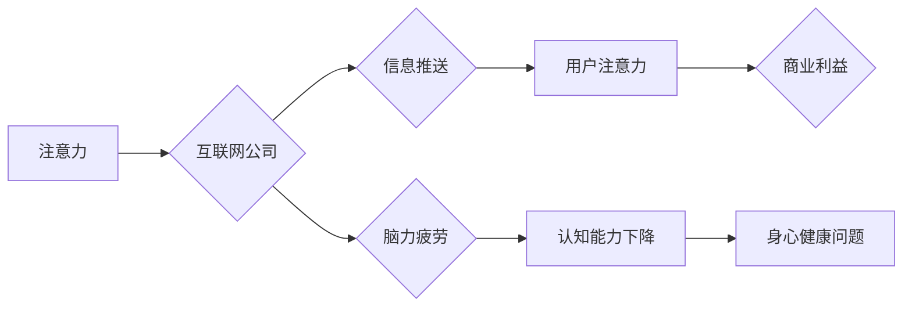

                 

##  注意力经济与脑力疲劳：如何在持续刺激中保持头脑健康

> 关键词：注意力经济、脑力疲劳、认知能力、深度工作、数字减负、专注力训练、心理健康

### 1. 背景介绍

在当今信息爆炸的时代，我们被来自各个方向的数字刺激所包围。手机、社交媒体、电子邮件、新闻推送，无时无刻不在争夺我们的注意力。这种持续的刺激和干扰，导致我们难以集中精力，思考深度问题，最终引发了“脑力疲劳”的现象。

脑力疲劳是指长时间进行高强度认知活动后，大脑资源耗尽，导致注意力下降、思维迟缓、情绪波动等一系列症状。它不仅影响我们的工作效率和学习效果，更会损害我们的身心健康。

注意力经济的概念，则试图解释这种现象背后的经济学原理。它认为，注意力是稀缺的资源，而互联网公司通过各种手段，争夺用户的注意力，从而获取商业利益。

### 2. 核心概念与联系

**2.1 注意力经济**

注意力经济的核心概念是，注意力是人类最宝贵的资源之一，而互联网公司通过各种手段，争夺用户的注意力，从而获取商业利益。

**2.2 脑力疲劳**

脑力疲劳是指长时间进行高强度认知活动后，大脑资源耗尽，导致注意力下降、思维迟缓、情绪波动等一系列症状。

**2.3 联系**

注意力经济的本质是利用人类对刺激的渴望，通过不断地推送信息，吸引用户的注意力，从而实现商业目标。然而，这种持续的刺激和干扰，会导致用户的脑力疲劳，最终损害用户的认知能力和身心健康。

**Mermaid 流程图**



### 3. 核心算法原理 & 具体操作步骤

**3.1 算法原理概述**

注意力机制是一种模仿人类注意力机制的算法，它能够帮助模型专注于输入数据中最重要的部分，从而提高模型的性能。

**3.2 算法步骤详解**

1. **输入数据:** 将输入数据传递给注意力机制。
2. **计算权重:** 计算每个输入数据元素的权重，权重代表了该元素对模型输出的影响程度。
3. **加权求和:** 根据计算出的权重，对输入数据进行加权求和，得到模型的输出。

**3.3 算法优缺点**

**优点:**

* 能够提高模型的性能，尤其是在处理长序列数据时。
* 可以帮助模型理解输入数据的语义关系。

**缺点:**

* 计算复杂度较高。
* 需要大量的训练数据。

**3.4 算法应用领域**

注意力机制在自然语言处理、计算机视觉、机器翻译等领域都有广泛的应用。

### 4. 数学模型和公式 & 详细讲解 & 举例说明

**4.1 数学模型构建**

注意力机制的数学模型可以表示为：

$$
\text{Attention}(Q, K, V) = \text{softmax}\left(\frac{Q K^T}{\sqrt{d_k}}\right) V
$$

其中：

* $Q$：查询矩阵
* $K$：键矩阵
* $V$：值矩阵
* $d_k$：键向量的维度
* $\text{softmax}$：softmax函数

**4.2 公式推导过程**

公式推导过程可以参考相关文献，这里不再赘述。

**4.3 案例分析与讲解**

例如，在机器翻译任务中，注意力机制可以帮助模型关注源语言中与目标语言单词相关的词语，从而提高翻译的准确性。

### 5. 项目实践：代码实例和详细解释说明

**5.1 开发环境搭建**

使用Python语言和TensorFlow框架进行开发。

**5.2 源代码详细实现**

```python
import tensorflow as tf

def scaled_dot_product_attention(query, key, value, mask=None):
    """
    计算注意力权重和输出值
    """
    scores = tf.matmul(query, key, transpose_b=True) / tf.math.sqrt(tf.cast(key.shape[-1], tf.float32))
    if mask is not None:
        scores += (mask * -1e9)
    attention_weights = tf.nn.softmax(scores, axis=-1)
    context_vector = tf.matmul(attention_weights, value)
    return context_vector, attention_weights

# ... 其他代码 ...
```

**5.3 代码解读与分析**

该代码实现了缩放点积注意力机制的计算过程。

**5.4 运行结果展示**

运行结果展示可以参考相关文献或实验报告。

### 6. 实际应用场景

**6.1 搜索引擎**

注意力机制可以帮助搜索引擎更好地理解用户搜索意图，并返回更相关的搜索结果。

**6.2 机器翻译**

注意力机制可以帮助机器翻译模型关注源语言中与目标语言单词相关的词语，从而提高翻译的准确性。

**6.3 图像识别**

注意力机制可以帮助图像识别模型关注图像中与目标物体相关的区域，从而提高识别准确率。

**6.4 未来应用展望**

注意力机制在未来将有更广泛的应用，例如：

* 个性化推荐
* 自动驾驶
* 医疗诊断

### 7. 工具和资源推荐

**7.1 学习资源推荐**

* 《深度学习》
* 《Attention Is All You Need》论文
* TensorFlow官方文档

**7.2 开发工具推荐**

* TensorFlow
* PyTorch

**7.3 相关论文推荐**

* 《Attention Is All You Need》
* 《BERT: Pre-training of Deep Bidirectional Transformers for Language Understanding》

### 8. 总结：未来发展趋势与挑战

**8.1 研究成果总结**

注意力机制是一种重要的深度学习技术，它在自然语言处理、计算机视觉等领域取得了显著的成果。

**8.2 未来发展趋势**

未来注意力机制的研究将朝着以下方向发展：

* 更高效的注意力机制
* 更广泛的应用场景
* 更深入的理论理解

**8.3 面临的挑战**

注意力机制也面临一些挑战，例如：

* 计算复杂度较高
* 训练数据需求量大
* 理论解释不够完善

**8.4 研究展望**

未来研究将致力于解决这些挑战，并推动注意力机制的进一步发展。

### 9. 附录：常见问题与解答

**9.1 什么是注意力机制？**

注意力机制是一种模仿人类注意力机制的算法，它能够帮助模型专注于输入数据中最重要的部分。

**9.2 注意力机制的应用场景有哪些？**

注意力机制在自然语言处理、计算机视觉、机器翻译等领域都有广泛的应用。

**9.3 如何实现注意力机制？**

可以使用TensorFlow或PyTorch等深度学习框架实现注意力机制。


作者：禅与计算机程序设计艺术 / Zen and the Art of Computer Programming 
<end_of_turn>

