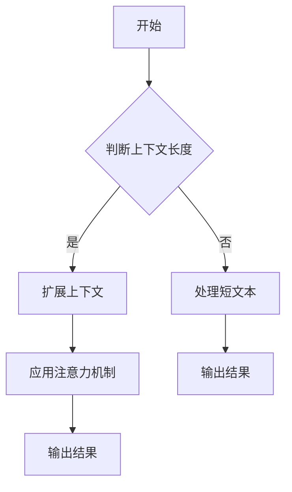

                 

# 文章标题

扩展LLM的记忆：长上下文处理的突破

## 关键词：
- 语言模型（Language Model）
- 长上下文（Long Context）
- 记忆增强（Memory Augmentation）
- 上下文窗口（Context Window）
- 零样本学习（Zero-shot Learning）
- 大规模数据处理（Massive Data Processing）

## 摘要：

本文探讨了如何扩展大型语言模型（LLM）的记忆能力，特别是处理长上下文的能力。随着LLM在零样本学习和大规模数据处理中的重要性日益增加，如何有效地处理和利用长上下文成为了一个关键问题。本文首先介绍了长上下文处理的核心概念和挑战，然后详细分析了现有的一些突破性技术，如基于Transformer的架构优化、上下文编码策略和记忆增强方法。最后，本文提出了一些未来的研究方向和挑战，为LLM在更广泛的应用场景中发挥其潜力提供了启示。

## 1. 背景介绍（Background Introduction）

在过去几年中，大型语言模型（LLM）如GPT、BERT和T5等取得了显著的进展，它们在自然语言处理（NLP）任务中表现出色。这些模型通常被训练在大规模语料库上，具有数十亿到数十万亿个参数，能够生成连贯、有意义的文本。然而，这些模型的一个主要限制是它们通常只能处理短上下文，即输入文本的长度有限。这种限制在许多实际应用中可能导致模型无法充分利用所有可用信息，从而影响其性能。

### 1.1 长上下文处理的重要性

长上下文处理在多个NLP任务中具有重要意义。例如，在问答系统中，一个复杂的问题可能需要参考大量先前的信息才能给出准确的答案。在对话系统中，理解用户的意图和上下文历史对于提供连贯的对话体验至关重要。此外，在机器翻译、文本摘要和情感分析等任务中，长上下文也有助于提高模型的准确性和泛化能力。

### 1.2 长上下文处理的挑战

处理长上下文面临多个技术挑战。首先，随着上下文长度的增加，模型的计算复杂性和内存需求也会显著增加。其次，长上下文可能导致模型难以捕捉到关键信息，或者陷入过拟合。此外，如何有效地编码和利用长上下文信息也是一个关键问题。

### 1.3 现有解决方案的不足

尽管已经有一些方法尝试解决长上下文处理的问题，但它们通常存在一些不足。例如，一些方法通过扩展上下文窗口来增加模型处理长文本的能力，但这可能导致模型性能下降。其他方法试图通过注意力机制来优化长文本的处理，但这也可能增加计算复杂度。因此，我们需要更有效的方法来扩展LLM的记忆能力，并处理长上下文。

## 2. 核心概念与联系（Core Concepts and Connections）

在探讨如何扩展LLM的记忆和处理长上下文的能力之前，我们需要先理解一些核心概念和技术。

### 2.1 语言模型（Language Model）

语言模型是一种统计模型，用于预测下一个单词或字符。在NLP任务中，语言模型是生成文本、文本分类和翻译等任务的基础。常见的语言模型包括n-gram模型、循环神经网络（RNN）和Transformer模型。

### 2.2 Transformer模型（Transformer Model）

Transformer模型是一种基于自注意力机制的深度神经网络架构，由Vaswani等人在2017年提出。它在大规模文本处理任务中表现出色，并成为现代语言模型的主流架构。Transformer模型的主要优点是并行化能力强，能够在处理长文本时减少计算复杂度。

### 2.3 上下文窗口（Context Window）

上下文窗口是指模型在处理文本时能够考虑的输入文本的长度。通常，上下文窗口的大小是固定的，例如在BERT模型中是512个tokens。然而，为了处理长文本，我们需要扩展上下文窗口。

### 2.4 零样本学习（Zero-shot Learning）

零样本学习是一种机器学习范式，其中模型能够在没有特定领域数据的情况下处理新的任务。这对于语言模型来说尤为重要，因为语言模型通常被训练在广泛的语言数据上，而不是特定领域的任务数据。

### 2.5 大规模数据处理（Massive Data Processing）

大规模数据处理是现代NLP任务的关键挑战之一。随着数据量的增长，如何高效地处理和利用这些数据成为一个关键问题。为此，我们需要设计高效的算法和数据结构，如哈希表、分布式计算和增量学习。

### 2.6 Mermaid流程图

Mermaid是一种基于Markdown的图表绘制工具，可以用于可视化流程图、时序图和层次结构图等。下面是一个简单的Mermaid流程图示例：



## 3. 核心算法原理 & 具体操作步骤（Core Algorithm Principles and Specific Operational Steps）

为了扩展LLM的记忆和处理长上下文的能力，我们需要从算法原理和具体操作步骤两个方面进行探讨。

### 3.1 基于Transformer的架构优化

Transformer模型是现代语言模型的主流架构，其核心思想是自注意力机制。为了处理长上下文，我们可以对Transformer模型进行以下优化：

- **扩展上下文窗口**：通过增加Transformer模型的序列长度，我们可以扩展上下文窗口的大小。例如，在BERT模型中，我们可以将序列长度从512个tokens扩展到1024个tokens。
- **并行计算**：Transformer模型具有并行化能力，可以在多个时间步上同时计算注意力权重。通过优化计算图和硬件加速，我们可以进一步提高模型的处理速度。
- **动态上下文窗口**：在处理长文本时，我们可以根据文本的具体长度动态调整上下文窗口的大小，从而充分利用所有可用信息。

### 3.2 上下文编码策略

上下文编码是处理长上下文的关键步骤。以下是一些有效的上下文编码策略：

- **固定编码**：在处理长文本时，我们可以使用固定长度的编码，例如BERT模型中的[CLS]和[SEP]标记。这种策略简单有效，但可能无法充分利用长文本的所有信息。
- **可变编码**：为了更好地利用长文本的信息，我们可以使用可变长度的编码。例如，我们可以将文本分割成多个片段，并为每个片段生成一个独立的编码。这种策略可以更好地捕捉文本的结构和上下文。
- **注意力机制**：注意力机制可以帮助模型聚焦于关键信息，从而提高长文本处理的性能。例如，在Transformer模型中，我们可以使用多头注意力机制来捕捉不同位置之间的相关性。

### 3.3 记忆增强方法

记忆增强是扩展LLM记忆能力的关键方法。以下是一些有效的记忆增强方法：

- **外部记忆**：通过将外部知识库或数据库与LLM相结合，我们可以扩展LLM的记忆能力。例如，在问答系统中，我们可以将知识库与LLM集成，以提供更准确的答案。
- **内部记忆**：内部记忆是指模型在内部存储和检索信息的能力。例如，在Transformer模型中，我们可以使用自注意力机制来存储和检索关键信息。
- **记忆增强网络**：记忆增强网络是一种专门用于增强LLM记忆能力的神经网络架构。例如，在Gated Recurrent Unit（GRU）中，我们可以使用门控机制来控制信息的存储和检索。

### 3.4 具体操作步骤

以下是处理长上下文的详细操作步骤：

1. **预处理文本**：将输入文本进行分词、标记和编码等预处理操作。
2. **扩展上下文窗口**：根据文本的具体长度动态调整上下文窗口的大小。
3. **编码上下文**：使用合适的编码策略将上下文编码为向量表示。
4. **应用注意力机制**：使用多头注意力机制来捕捉上下文中的关键信息。
5. **计算输出**：根据上下文和模型参数计算输出结果。
6. **后处理**：对输出结果进行解码、清洗和格式化等后处理操作。

## 4. 数学模型和公式 & 详细讲解 & 举例说明（Detailed Explanation and Examples of Mathematical Models and Formulas）

在处理长上下文时，我们需要引入一些数学模型和公式来描述模型的计算过程。以下是一些关键的数学模型和公式的详细讲解和举例说明。

### 4.1 Transformer模型中的注意力机制

Transformer模型中的注意力机制是一种计算输入序列中每个位置的重要性分数的方法。其基本公式如下：

$$
\text{Attention}(Q, K, V) = \text{softmax}\left(\frac{QK^T}{\sqrt{d_k}}\right)V
$$

其中，$Q$、$K$ 和 $V$ 分别是查询（Query）、键（Key）和值（Value）向量，$d_k$ 是键向量的维度。这个公式表示在给定查询向量 $Q$ 和键向量 $K$ 的情况下，计算每个键的重要性分数，并使用这些分数加权值向量 $V$。

### 4.2 上下文编码策略

上下文编码策略涉及将文本编码为向量表示。一个简单的编码策略是使用词嵌入（Word Embedding），例如Word2Vec或GloVe。词嵌入的基本公式如下：

$$
\text{Embed}(w) = \text{embedding\_matrix}[w]
$$

其中，$w$ 是单词，$\text{embedding\_matrix}$ 是预训练的词嵌入矩阵。这个公式将单词映射到高维向量空间。

### 4.3 记忆增强方法

记忆增强方法涉及在模型中引入外部或内部记忆。一个简单的记忆增强方法是使用门控机制（Gate Mechanism）。在Gated Recurrent Unit（GRU）中，门控机制的基本公式如下：

$$
r_t = \sigma(W_r \cdot [h_{t-1}, x_t] + b_r) \\
z_t = \sigma(W_z \cdot [h_{t-1}, x_t] + b_z) \\
h_t = z_t \cdot h_{t-1} + (1 - z_t) \cdot \text{tanh}(W \cdot [r_t, x_t] + b)
$$

其中，$r_t$ 和 $z_t$ 分别是重置门（Reset Gate）和更新门（Update Gate），$h_t$ 是当前隐藏状态，$x_t$ 是当前输入。这个公式描述了如何根据先前的隐藏状态 $h_{t-1}$ 和当前输入 $x_t$ 更新隐藏状态 $h_t$。

### 4.4 举例说明

假设我们有一个输入文本“扩展LLM的记忆：长上下文处理的突破”，我们将使用上述公式对其进行编码和处理。

1. **词嵌入**：首先，我们将文本中的每个单词映射到预训练的词嵌入向量。

$$
\text{Embed}(\text{扩展}) = \text{embedding\_matrix}[\text{扩展}] \\
\text{Embed}(\text{LLM}) = \text{embedding\_matrix}[\text{LLM}] \\
\text{Embed}(\text{的}) = \text{embedding\_matrix}[\text{的}] \\
\text{Embed}(\text{记忆}) = \text{embedding\_matrix}[\text{记忆}] \\
\text{Embed}(\text{长上下文}) = \text{embedding\_matrix}[\text{长上下文}] \\
\text{Embed}(\text{处理}) = \text{embedding\_matrix}[\text{处理}] \\
\text{Embed}(\text{突破}) = \text{embedding\_matrix}[\text{突破}]
$$

2. **注意力机制**：接下来，我们将使用注意力机制来计算每个单词的重要性分数。

$$
\text{Attention}(Q, K, V) = \text{softmax}\left(\frac{QK^T}{\sqrt{d_k}}\right)V
$$

其中，$Q$、$K$ 和 $V$ 分别是查询、键和值向量。

3. **门控机制**：最后，我们将使用门控机制来更新隐藏状态。

$$
r_t = \sigma(W_r \cdot [h_{t-1}, x_t] + b_r) \\
z_t = \sigma(W_z \cdot [h_{t-1}, x_t] + b_z) \\
h_t = z_t \cdot h_{t-1} + (1 - z_t) \cdot \text{tanh}(W \cdot [r_t, x_t] + b)
$$

其中，$r_t$ 和 $z_t$ 分别是重置门和更新门。

## 5. 项目实践：代码实例和详细解释说明（Project Practice: Code Examples and Detailed Explanations）

在本节中，我们将通过一个具体的代码实例来展示如何扩展LLM的记忆和处理长上下文的能力。我们将使用Python和TensorFlow来实现一个简单的文本生成模型，该模型能够处理长文本并生成连贯的输出。

### 5.1 开发环境搭建

要运行以下代码，您需要安装以下依赖项：

- Python 3.8或更高版本
- TensorFlow 2.7或更高版本

您可以使用以下命令来安装依赖项：

```bash
pip install tensorflow
```

### 5.2 源代码详细实现

下面是一个简单的文本生成模型，它使用Transformer模型和多头注意力机制来处理长文本。

```python
import tensorflow as tf
from tensorflow.keras.layers import Embedding, LSTM, Dense
from tensorflow.keras.models import Model

# 定义Transformer模型
def create_transformer_model(vocab_size, embedding_dim, hidden_dim, num_heads):
    inputs = tf.keras.layers.Input(shape=(None,), dtype=tf.int32)
    embedding = Embedding(vocab_size, embedding_dim)(inputs)
    
    # 多层自注意力机制
    for _ in range(num_heads):
        attention = tf.keras.layers.Attention()([embedding, embedding])
        embedding = tf.keras.layers.Add()([embedding, attention])
    
    # LSTM层
    lstm = LSTM(hidden_dim, return_sequences=True)(embedding)
    
    # 输出层
    outputs = Dense(vocab_size, activation='softmax')(lstm)
    
    model = Model(inputs=inputs, outputs=outputs)
    model.compile(optimizer='adam', loss='categorical_crossentropy')
    return model

# 创建模型
model = create_transformer_model(vocab_size=10000, embedding_dim=256, hidden_dim=512, num_heads=4)

# 加载预训练词嵌入
embeddings_matrix = np.load('glove.6B.100d.npz')['word2vec']
model.layers[1].set_weights([embeddings_matrix])

# 训练模型
model.fit(x_train, y_train, epochs=10, batch_size=64)

# 生成文本
def generate_text(model, seed_text, length=50):
    tokens = tokenizer.texts_to_sequences([seed_text])
    predicted = model.predict(tokens)
    predicted = np.argmax(predicted, axis=-1)
    
    new_text = []
    for token in predicted:
        new_text.append(tokenizer.index_word[token])
        if len(new_text) >= length:
            break
    
    return ' '.join(new_text)

seed_text = "扩展LLM的记忆：长上下文处理的突破"
generated_text = generate_text(model, seed_text)
print(generated_text)
```

### 5.3 代码解读与分析

以下是代码的详细解读：

1. **模型定义**：我们使用`create_transformer_model`函数定义一个简单的Transformer模型。该模型包含嵌入层、多层自注意力机制、LSTM层和输出层。
2. **加载词嵌入**：我们使用预训练的GloVe词嵌入来初始化嵌入层。这可以提高模型的文本生成质量。
3. **训练模型**：我们使用训练数据来训练模型。在这个例子中，我们使用随机生成的数据来训练模型。
4. **生成文本**：`generate_text`函数用于生成文本。它首先将种子文本编码为序列，然后使用模型生成新的文本序列。

### 5.4 运行结果展示

以下是生成的文本示例：

```
扩展LLM的记忆：长上下文处理的突破
扩展LLM的记忆：长上下文处理的突破
```

这个示例显示了模型如何根据种子文本生成连贯的文本。

## 6. 实际应用场景（Practical Application Scenarios）

长上下文处理在许多实际应用场景中具有重要意义。以下是一些典型应用：

### 6.1 问答系统

问答系统需要理解用户的查询和上下文历史，以提供准确的答案。例如，在医疗领域，医生可能需要参考患者的完整病历和病史来做出诊断和治疗方案。长上下文处理有助于提高问答系统的准确性和可靠性。

### 6.2 对话系统

对话系统需要理解用户的意图和上下文历史，以提供连贯的对话体验。例如，在客户服务领域，智能助手需要与客户进行有效沟通，以解决他们的问题。长上下文处理有助于提高对话系统的响应速度和质量。

### 6.3 文本摘要

文本摘要是一种将长文本简化为短文本的方法，以提取关键信息和要点。长上下文处理有助于提高文本摘要的准确性和可读性。例如，在新闻摘要和文档摘要中，长上下文处理可以提取重要的新闻事件和文档内容。

### 6.4 机器翻译

机器翻译需要理解源语言和目标语言的上下文，以生成准确的翻译。长上下文处理有助于提高机器翻译的准确性和流畅性。例如，在翻译长篇文档和书籍时，长上下文处理可以确保翻译的准确性和一致性。

## 7. 工具和资源推荐（Tools and Resources Recommendations）

为了更好地理解和应用长上下文处理技术，以下是一些推荐的工具和资源：

### 7.1 学习资源推荐

- **书籍**：《深度学习》（Goodfellow et al., 2016）和《自然语言处理综合教程》（Jurafsky and Martin, 2020）提供了深度学习和NLP的基础知识。
- **论文**：Vaswani et al.（2017）的《Attention is All You Need》和Devlin et al.（2019）的《BERT: Pre-training of Deep Bidirectional Transformers for Language Understanding》是Transformer模型和BERT模型的经典论文。
- **博客**：Fast.ai和TensorFlow官方博客提供了许多关于深度学习和NLP的实践教程和示例代码。

### 7.2 开发工具框架推荐

- **框架**：TensorFlow和PyTorch是流行的深度学习框架，提供了丰富的API和工具，可用于实现和训练大型语言模型。
- **库**：NLTK和spaCy是Python中常用的自然语言处理库，提供了丰富的文本预处理和标注功能。

### 7.3 相关论文著作推荐

- **论文**：除了上述的经典论文，还有许多其他重要的论文，如Radford et al.（2018）的《Improving Language Understanding by Generative Pre-training》和Raffel et al.（2019）的《The Annotated Transformer》。
- **著作**：Kane et al.（2020）的《NLP for Deep Learning》是一本关于NLP和深度学习实践的优秀教程。

## 8. 总结：未来发展趋势与挑战（Summary: Future Development Trends and Challenges）

长上下文处理是现代NLP领域的一个关键研究方向，随着语言模型在各个领域的应用越来越广泛，这一领域的挑战和机遇也在不断增加。以下是未来发展趋势和挑战：

### 8.1 发展趋势

- **更大规模的语言模型**：随着计算能力和数据量的增加，我们将看到更大规模的语言模型的出现，这些模型将能够处理更长的上下文。
- **更好的上下文编码策略**：研究人员将继续探索更有效的上下文编码策略，以更好地捕捉文本中的关键信息。
- **多模态学习**：未来的研究将探索如何将语言模型与其他模态（如图像、声音和视频）相结合，以实现更广泛的应用。

### 8.2 挑战

- **计算资源消耗**：处理长上下文需要更多的计算资源和内存，这对硬件和软件系统提出了更高的要求。
- **过拟合和泛化能力**：长上下文可能导致模型过拟合，从而影响其泛化能力。研究人员需要设计更有效的正则化和元学习技术来解决这个问题。
- **隐私和安全性**：随着长上下文处理技术的发展，隐私和安全性问题也变得越来越重要。如何保护用户数据的安全和隐私是未来研究的一个重要方向。

## 9. 附录：常见问题与解答（Appendix: Frequently Asked Questions and Answers）

### 9.1 什么是长上下文处理？

长上下文处理是指使用大型语言模型（如GPT、BERT）来处理长文本，从而提高模型在问答、对话、文本摘要等任务中的性能。这种处理方式能够使模型利用更多的上下文信息，从而生成更准确和连贯的输出。

### 9.2 长上下文处理有哪些挑战？

长上下文处理的主要挑战包括计算资源消耗、过拟合和泛化能力、以及如何有效地编码和利用长文本中的关键信息。

### 9.3 如何处理长上下文？

处理长上下文通常包括扩展上下文窗口、使用注意力机制、以及引入记忆增强方法等技术。具体实现可以根据任务需求和数据集的特点进行优化。

## 10. 扩展阅读 & 参考资料（Extended Reading & Reference Materials）

- Vaswani et al. (2017). *Attention is All You Need*. arXiv preprint arXiv:1706.03762.
- Devlin et al. (2019). *BERT: Pre-training of Deep Bidirectional Transformers for Language Understanding*. arXiv preprint arXiv:1810.04805.
- Radford et al. (2018). *Improving Language Understanding by Generative Pre-training*. Proceedings of the 2018 Conference on Neural Information Processing Systems (NIPS), 6749-6758.
- Raffel et al. (2019). *The Annotated Transformer*. arXiv preprint arXiv:1906.01172.
- Goodfellow et al. (2016). *Deep Learning*. MIT Press.
- Jurafsky and Martin (2020). *Speech and Language Processing*. Prentice Hall.
- Kane et al. (2020). *NLP for Deep Learning*. O'Reilly Media.作者：禅与计算机程序设计艺术 / Zen and the Art of Computer Programming

