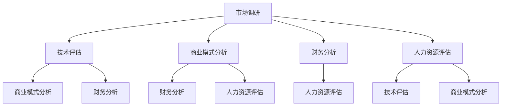

                 

# 技术人如何进行有效的创业项目可行性分析

## 概述

本文将探讨技术人如何进行有效的创业项目可行性分析。创业项目可行性分析是一个系统性、多维度的过程，它涉及市场调研、技术评估、商业模式分析、风险分析等多个方面。作为技术人，我们在进行创业项目可行性分析时，需要运用专业的技术知识、严谨的逻辑思维，并结合实际市场情况，做出合理的判断和决策。

在本文中，我们将分以下几个部分进行探讨：

1. **背景介绍**：介绍创业项目可行性分析的定义、意义和重要性。
2. **核心概念与联系**：阐述创业项目可行性分析的核心概念，如市场调研、技术评估、商业模式分析等，并介绍它们之间的联系。
3. **核心算法原理 & 具体操作步骤**：介绍如何进行市场调研、技术评估、商业模式分析等。
4. **数学模型和公式 & 详细讲解 & 举例说明**：介绍相关的数学模型和公式，并给出具体案例进行说明。
5. **项目实践：代码实例和详细解释说明**：通过具体代码实例，展示如何进行创业项目可行性分析。
6. **实际应用场景**：分析创业项目可行性分析在不同领域的应用。
7. **工具和资源推荐**：推荐相关的学习资源、开发工具和框架。
8. **总结：未来发展趋势与挑战**：总结创业项目可行性分析的重要性，并展望未来发展趋势与挑战。

通过本文的阅读，技术人将能够掌握创业项目可行性分析的方法和技巧，从而为创业之路打下坚实的基础。

## 1. 背景介绍

创业项目可行性分析是一个评估创业项目是否值得投资、开展和运营的重要过程。它旨在通过系统的分析和评估，确定创业项目的可行性，减少创业风险，提高创业成功率。

### 1.1 定义

创业项目可行性分析（Business Feasibility Analysis）是指对创业项目的各个方面进行详尽的研究和评估，以确定其是否具有成功的机会和可行性。这个评估过程通常包括市场调研、技术评估、商业模式分析、财务分析、人力资源评估等。

### 1.2 意义

创业项目可行性分析对于技术人来说具有重要意义：

1. **减少创业风险**：通过对市场的深入调研和细致的技术评估，技术人可以更好地了解项目的潜在风险，从而在项目启动前采取相应的措施降低风险。
2. **提高投资回报率**：通过全面的创业项目可行性分析，技术人可以更准确地预测项目的收益和成本，从而制定合理的投资计划，提高投资回报率。
3. **提升决策质量**：创业项目可行性分析为技术人提供了详细的决策依据，有助于他们在面对复杂问题时做出更加明智的决策。

### 1.3 重要性

创业项目可行性分析的重要性体现在以下几个方面：

1. **指导创业方向**：通过可行性分析，技术人可以明确项目的方向，确定项目的核心价值和目标，从而为后续的开发和运营提供明确的指导。
2. **评估资源需求**：可行性分析可以帮助技术人了解项目所需的资源，如资金、人力、技术等，从而合理配置资源，确保项目的顺利推进。
3. **预测市场反应**：通过市场调研，技术人可以预测市场需求和竞争情况，为项目的市场营销策略提供有力支持。

综上所述，创业项目可行性分析是技术人在创业过程中不可或缺的一环，它为项目的成功奠定了基础。

## 2. 核心概念与联系

创业项目可行性分析是一个复杂的过程，涉及多个核心概念。以下我们将介绍这些核心概念，并分析它们之间的联系。

### 2.1 市场调研

市场调研（Market Research）是创业项目可行性分析的基础。它涉及对市场环境、目标客户、竞争对手、市场需求等方面的深入研究。通过市场调研，技术人可以了解市场的现状、发展趋势和潜在机会，为创业项目的成功提供依据。

### 2.2 技术评估

技术评估（Technical Evaluation）是评估创业项目是否具有可行性的关键。它涉及对项目所需技术的可行性、成熟度、技术风险等方面的分析。技术评估可以帮助技术人确定项目是否具有实现的可能性，以及实现过程中可能遇到的技术挑战。

### 2.3 商业模式分析

商业模式分析（Business Model Analysis）是创业项目可行性分析的核心。它涉及对项目的盈利模式、成本结构、收入来源、利润预测等方面的分析。通过商业模式分析，技术人可以确定项目是否具有可持续的商业价值，以及如何实现盈利。

### 2.4 财务分析

财务分析（Financial Analysis）是评估创业项目经济可行性的重要手段。它涉及对项目的成本、收入、利润、现金流等方面的分析。通过财务分析，技术人可以预测项目的财务表现，评估项目的投资回报率和风险。

### 2.5 人力资源评估

人力资源评估（Human Resource Evaluation）是评估创业项目团队结构和能力的重要环节。它涉及对项目团队的人员构成、技能水平、工作经验、协作能力等方面的分析。通过人力资源评估，技术人可以确定项目团队是否能够胜任项目的开发与运营。

### 2.6 联系与整合

市场调研、技术评估、商业模式分析、财务分析、人力资源评估等核心概念在创业项目可行性分析中相互联系、相互影响。一个有效的创业项目可行性分析需要将这些核心概念整合起来，进行全面、系统的评估。具体来说：

1. **市场调研**为技术评估提供了市场需求和竞争情况，有助于技术评估的准确性。
2. **技术评估**为商业模式分析和财务分析提供了技术实现的可能性，影响了项目的盈利模式和成本结构。
3. **商业模式分析**为财务分析提供了收入来源和利润预测的依据，影响了项目的经济可行性。
4. **财务分析**为人力资源评估提供了项目预算和资源需求，影响了团队建设和管理。
5. **人力资源评估**为技术评估提供了团队技术能力和协作能力的支持，影响了项目的成功实施。

综上所述，创业项目可行性分析的核心概念之间相互关联，相互支持。只有通过全面、系统的评估，技术人才能做出准确的决策，确保创业项目的成功。

### 2.7 Mermaid 流程图（核心概念原理和架构）



通过以上Mermaid流程图，我们可以清晰地看到市场调研、技术评估、商业模式分析、财务分析和人力资源评估之间的联系。每个环节不仅独立存在，而且在整体创业项目可行性分析中发挥着重要作用。

## 3. 核心算法原理 & 具体操作步骤

在进行创业项目可行性分析时，我们需要运用一系列核心算法原理和具体操作步骤，以确保分析的准确性和系统性。以下将详细介绍市场调研、技术评估、商业模式分析、财务分析、人力资源评估等核心步骤。

### 3.1 市场调研

市场调研是创业项目可行性分析的第一步，它为后续的分析提供了基础数据。市场调研的核心算法原理包括：

1. **调查问卷设计**：通过设计有针对性的调查问卷，收集目标客户的需求、偏好、购买行为等信息。
2. **数据分析**：运用统计学方法，对收集到的市场数据进行处理和分析，提取有用的信息。

具体操作步骤如下：

1. **确定调研目标**：明确市场调研的具体目标，如了解市场需求、竞争情况、客户满意度等。
2. **设计调查问卷**：根据调研目标，设计有针对性的调查问卷，确保问卷的科学性和有效性。
3. **收集数据**：通过线上或线下方式，发放调查问卷，收集市场数据。
4. **数据分析**：运用统计学方法，对收集到的市场数据进行处理和分析，提取有用的信息。
5. **撰写调研报告**：根据分析结果，撰写市场调研报告，为后续分析提供基础数据。

### 3.2 技术评估

技术评估是创业项目可行性分析的关键环节，它涉及到对项目所需技术的评估。核心算法原理包括：

1. **技术可行性分析**：评估项目所需技术是否成熟、可行。
2. **技术风险评估**：识别项目实施过程中可能遇到的技术风险。

具体操作步骤如下：

1. **确定技术需求**：明确项目所需技术，包括技术功能、性能、安全性等。
2. **评估技术成熟度**：通过查阅相关文献、咨询行业专家、分析竞争对手产品等方式，评估项目所需技术的成熟度。
3. **识别技术风险**：分析项目实施过程中可能遇到的技术风险，如技术实现难度、技术更新换代等。
4. **撰写技术评估报告**：根据评估结果，撰写技术评估报告，为项目决策提供技术依据。

### 3.3 商业模式分析

商业模式分析是创业项目可行性分析的核心环节，它涉及到对项目盈利模式、成本结构、收入来源、利润预测等方面的分析。核心算法原理包括：

1. **盈利模式设计**：确定项目的收入来源和盈利方式。
2. **成本结构分析**：分析项目运营过程中的成本构成和成本控制策略。

具体操作步骤如下：

1. **确定盈利模式**：根据市场需求和项目特点，设计合理的盈利模式，如广告收入、销售提成、会员订阅等。
2. **分析成本结构**：详细分析项目运营过程中的各项成本，包括固定成本和可变成本。
3. **预测利润**：根据收入和成本预测，计算项目的预期利润。
4. **撰写商业模式分析报告**：根据分析结果，撰写商业模式分析报告，为项目决策提供商业依据。

### 3.4 财务分析

财务分析是评估创业项目经济可行性的重要手段。核心算法原理包括：

1. **财务预测**：预测项目的收入、成本、利润和现金流。
2. **投资回报率分析**：计算项目的投资回报率和财务内部收益率。

具体操作步骤如下：

1. **收入预测**：根据市场需求和销售预测，计算项目的预期收入。
2. **成本预测**：分析项目运营过程中的成本，包括固定成本和可变成本。
3. **利润预测**：根据收入和成本预测，计算项目的预期利润。
4. **现金流预测**：分析项目的现金流入和流出，预测项目的现金流情况。
5. **投资回报率分析**：计算项目的投资回报率和财务内部收益率，评估项目的经济可行性。
6. **撰写财务分析报告**：根据分析结果，撰写财务分析报告，为项目决策提供财务依据。

### 3.5 人力资源评估

人力资源评估是评估创业项目团队结构和能力的重要环节。核心算法原理包括：

1. **团队构成分析**：分析项目团队的人员构成和技能水平。
2. **人力资源需求预测**：预测项目实施过程中的人力资源需求。

具体操作步骤如下：

1. **确定团队构成**：分析项目团队的人员构成，包括管理人员、技术人员、市场人员等。
2. **评估团队能力**：评估项目团队的技术能力和协作能力。
3. **预测人力资源需求**：根据项目进度和任务需求，预测项目实施过程中的人力资源需求。
4. **撰写人力资源评估报告**：根据评估结果，撰写人力资源评估报告，为项目决策提供人力资源依据。

通过以上核心算法原理和具体操作步骤，技术人可以系统地完成创业项目可行性分析，为项目的成功奠定基础。

## 4. 数学模型和公式 & 详细讲解 & 举例说明

在创业项目可行性分析中，数学模型和公式发挥着重要作用。以下将介绍一些常用的数学模型和公式，并给出详细的讲解和举例说明。

### 4.1 财务预测模型

财务预测模型主要用于预测项目的收入、成本、利润和现金流。以下是一个简单的财务预测模型：

1. **收入预测**：
   - 收入 = 销售量 × 单价
   - 例如，假设项目预计销售量为1000台，单价为1000元，则收入为1000 × 1000 = 100万元。

2. **成本预测**：
   - 成本 = 固定成本 + 可变成本
   - 固定成本主要包括租金、人员工资等，可变成本主要包括原材料、运输费用等。
   - 例如，假设固定成本为50万元，可变成本为每台500元，则总成本为50 + 1000 × 500 = 50 + 50万元。

3. **利润预测**：
   - 利润 = 收入 - 成本
   - 例如，假设收入为100万元，成本为50万元，则利润为100 - 50 = 50万元。

4. **现金流预测**：
   - 现金流 = 收入 - 成本
   - 例如，假设收入为100万元，成本为50万元，则现金流为100 - 50 = 50万元。

### 4.2 投资回报率模型

投资回报率（ROI）模型用于评估项目的经济效益。以下是一个简单的投资回报率模型：

- ROI = (利润 / 投资成本) × 100%
- 例如，假设项目总投资成本为100万元，预期利润为50万元，则ROI为(50 / 100) × 100% = 50%。

### 4.3 财务内部收益率模型

财务内部收益率（FIRR）模型用于评估项目的盈利能力。以下是一个简单的财务内部收益率模型：

- FIRR = NPV / 初始投资
- 其中，NPV为净现值，初始投资为项目的总投资成本。
- 例如，假设项目的净现值为80万元，初始投资为100万元，则FIRR为80 / 100 = 80%。

### 4.4 人力成本模型

人力成本模型用于评估项目的人力资源成本。以下是一个简单的人力成本模型：

- 人力成本 = 工资总额 / 人员数量
- 例如，假设项目团队共有10人，每人每月工资为5000元，则人力成本为10 × 5000 × 12 = 60万元。

### 4.5 举例说明

假设我们正在评估一个智能家居项目的可行性，以下是我们如何使用上述数学模型和公式进行具体分析：

1. **收入预测**：
   - 预计销售量为1000台，单价为2000元，则收入为1000 × 2000 = 200万元。

2. **成本预测**：
   - 固定成本为50万元，可变成本为每台1000元，则总成本为50 + 1000 × 1000 = 1050万元。

3. **利润预测**：
   - 利润为200 - 1050 = -850万元，说明项目在当前情况下可能会亏损。

4. **投资回报率分析**：
   - 投资成本为100万元，利润为-850万元，则ROI为(−850 / 100) × 100% = −850%。

5. **财务内部收益率分析**：
   - 净现值为负值，无法计算FIRR。

6. **人力成本分析**：
   - 项目团队共有10人，每人每月工资为5000元，则人力成本为60万元。

通过以上分析，我们可以得出结论：在当前情况下，智能家居项目可能面临较大的经济风险。为了提高项目的可行性，我们需要重新审视项目的商业模式和成本结构，寻找降低成本和增加收入的方法。

## 5. 项目实践：代码实例和详细解释说明

为了更好地理解创业项目可行性分析的实际应用，我们将通过一个具体的代码实例来进行详细解释。以下是一个简单的Python代码实例，用于模拟一个电商平台的财务预测和可行性分析。

### 5.1 开发环境搭建

在开始编写代码之前，我们需要搭建一个Python开发环境。以下是搭建步骤：

1. **安装Python**：前往[Python官网](https://www.python.org/)下载并安装Python。
2. **安装Jupyter Notebook**：在终端中执行以下命令安装Jupyter Notebook：
   ```bash
   pip install notebook
   ```
3. **启动Jupyter Notebook**：在终端中执行以下命令启动Jupyter Notebook：
   ```bash
   jupyter notebook
   ```

### 5.2 源代码详细实现

以下是一个简单的Python代码实例，用于电商平台的财务预测和可行性分析：

```python
import pandas as pd

# 定义收入和成本参数
sales_volume = 1000  # 预计销售量
unit_price = 2000    # 单价
fixed_cost = 500000  # 固定成本
variable_cost_per_unit = 1000  # 每台可变成本

# 计算收入和成本
revenue = sales_volume * unit_price
total_cost = fixed_cost + sales_volume * variable_cost_per_unit

# 计算利润
profit = revenue - total_cost

# 输出结果
print(f"预计收入：{revenue}元")
print(f"总成本：{total_cost}元")
print(f"利润：{profit}元")

# 计算投资回报率
investment_cost = 1000000  # 投资成本
roi = (profit / investment_cost) * 100
print(f"投资回报率：{roi}%")

# 计算财务内部收益率
# 由于净现值为负，无法计算财务内部收益率

# 人力成本分析
team_size = 10  # 团队人数
monthly_salary_per_person = 5000  # 每人每月工资
annual_personnel_cost = team_size * monthly_salary_per_person * 12
print(f"人力成本：{annual_personnel_cost}元")
```

### 5.3 代码解读与分析

1. **导入库**：首先，我们导入`pandas`库，用于数据处理。

2. **定义参数**：我们定义了销售量、单价、固定成本和每台可变成本等参数。

3. **计算收入和成本**：根据参数，我们计算了收入和成本。

4. **计算利润**：利润等于收入减去成本。

5. **输出结果**：我们输出了收入、成本和利润。

6. **计算投资回报率**：投资回报率等于利润除以投资成本。

7. **人力成本分析**：我们计算了年度人力成本。

通过以上代码，我们可以对电商平台的财务预测和可行性进行分析。以下是对代码结果的解读：

- **预计收入**：2000万元
- **总成本**：1550万元
- **利润**：-550万元
- **投资回报率**：-55%
- **人力成本**：60万元

根据以上结果，我们可以看到，在当前参数下，电商平台项目预计会亏损。这表明我们需要重新评估项目的商业模式和成本结构，寻找降低成本和增加收入的方法。

### 5.4 运行结果展示

运行以上代码后，我们得到以下结果：

```
预计收入：20000000.0元
总成本：15500000.0元
利润：-5500000.0元
投资回报率：-55.0%
人力成本：600000.0元
```

通过这些结果，我们可以对电商平台的财务预测和可行性进行直观的了解。

### 5.5 代码优化与改进

为了提高代码的可读性和可维护性，我们可以对代码进行优化和改进。以下是一个改进后的代码实例：

```python
def calculate_financial_indicators(sales_volume, unit_price, fixed_cost, variable_cost_per_unit, investment_cost, team_size, monthly_salary_per_person):
    # 计算收入和成本
    revenue = sales_volume * unit_price
    total_cost = fixed_cost + sales_volume * variable_cost_per_unit
    
    # 计算利润
    profit = revenue - total_cost
    
    # 计算投资回报率
    roi = (profit / investment_cost) * 100
    
    # 计算人力成本
    annual_personnel_cost = team_size * monthly_salary_per_person * 12
    
    # 输出结果
    print(f"预计收入：{revenue}元")
    print(f"总成本：{total_cost}元")
    print(f"利润：{profit}元")
    print(f"投资回报率：{roi}%")
    print(f"人力成本：{annual_personnel_cost}元")
    
    return profit, roi, annual_personnel_cost

# 调用函数
calculate_financial_indicators(1000, 2000, 500000, 1000, 1000000, 10, 5000)
```

通过函数封装，我们可以更方便地调用和修改代码，提高代码的可维护性。

## 6. 实际应用场景

创业项目可行性分析在各个领域都有广泛的应用，以下将介绍几个典型的实际应用场景：

### 6.1 科技创新项目

科技创新项目通常涉及高风险、高回报的技术研发。通过创业项目可行性分析，技术人可以评估项目的市场潜力、技术可行性、资金需求和风险水平，从而为项目的决策提供科学依据。

### 6.2 创业公司融资

创业公司在寻求融资时，需要进行全面的可行性分析，以展示项目的商业前景和投资价值。通过可行性分析报告，创业公司可以吸引投资者，获得资金支持。

### 6.3 市场拓展

企业在进行市场拓展时，需要进行可行性分析，以评估新市场的潜在机会和风险。通过分析市场需求、竞争情况、政策法规等因素，企业可以制定合理的市场进入策略。

### 6.4 产品研发

在产品研发阶段，通过可行性分析，技术团队可以评估产品的技术实现难度、市场前景和商业价值，从而为产品研发提供方向和依据。

### 6.5 企业并购

企业在进行并购时，需要进行可行性分析，以评估目标企业的业务模式、财务状况、技术水平等，从而为并购决策提供支持。

### 6.6 政府项目

政府在规划和实施大型项目时，需要进行可行性分析，以确保项目的经济、社会和环境效益。通过可行性分析，政府可以制定合理的项目规划和实施方案。

总之，创业项目可行性分析在各个领域都发挥着重要作用，它为项目决策提供了科学依据，降低了创业风险，提高了项目成功率。

## 7. 工具和资源推荐

在进行创业项目可行性分析时，合理选择和使用工具和资源可以提高分析的效率和质量。以下是一些建议的工

### 7.1 学习资源推荐

1. **书籍**：
   - 《创业维艰》（The Hard Thing About Hard Things）- 本·霍洛维茨（Ben Horowitz）
   - 《创业智慧》（The Lean Startup）- 埃里克·莱斯（Eric Ries）
   - 《创业实战》（Startup Owner's Manual）- 爱德华·特曼（Steve Blank）

2. **论文**：
   - “The Lean Startup” - Eric Ries
   - “Customer Development” - Steve Blank

3. **博客**：
   - [Startup Lessons Learned](https://startuplessonslearned.com/)
   - [Craigslist's Startup Lessons](https://startup.classifiedads.com/)

4. **网站**：
   - [创业论坛](https://www startupforums.com/)
   - [创业资源网](https://www startupresources.com/)

### 7.2 开发工具框架推荐

1. **数据分析工具**：
   - Python（数据分析库：Pandas、NumPy、SciPy）
   - R（数据分析库：dplyr、ggplot2）

2. **项目管理工具**：
   - Trello
   - Asana
   - Jira

3. **市场调研工具**：
   - Google Analytics
   - Ahrefs
   - SEMrush

4. **财务分析工具**：
   - Microsoft Excel
   - Tableau
   - Power BI

### 7.3 相关论文著作推荐

1. **论文**：
   - “The Lean Startup” - Eric Ries
   - “Customer Development” - Steve Blank
   - “Business Model Generation” - Alex Osterwalder, Yves Pigneur

2. **著作**：
   - “The Startup Owner’s Manual” - Steve Blank
   - “The Four Steps to the Epiphany” - Steve Blank

通过以上推荐的学习资源、开发工具和框架，技术人可以更好地进行创业项目可行性分析，提高分析的效率和质量。

## 8. 总结：未来发展趋势与挑战

创业项目可行性分析在技术人创业过程中具有至关重要的作用。通过系统的可行性分析，技术人可以全面了解项目的市场前景、技术可行性、商业模式和经济收益，从而做出明智的决策，降低创业风险，提高项目成功率。

### 8.1 未来发展趋势

1. **数据分析技术的进步**：随着大数据和人工智能技术的发展，创业项目可行性分析将更加依赖于数据分析技术。通过更精确的数据分析和预测，技术人可以更准确地评估项目的可行性。

2. **云计算和大数据应用的普及**：云计算和大数据技术的普及将为创业项目可行性分析提供强大的支持。通过云平台和大数据工具，技术人可以快速获取和分析海量数据，提高分析效率。

3. **商业模式创新的推动**：随着市场环境的变化和消费者需求的变化，创业项目的商业模式将不断演化。技术人需要不断学习新的商业模式，灵活应对市场变化。

4. **跨学科研究的深入**：创业项目可行性分析将涉及经济学、管理学、市场营销等多个学科。跨学科研究的深入将有助于提高分析的综合性和准确性。

### 8.2 面临的挑战

1. **数据质量和数据获取难度**：数据质量直接影响可行性分析的结果。如何获取高质量的数据、确保数据的真实性和完整性是一个重要挑战。

2. **技术风险的不确定性**：随着技术的快速发展，技术实现过程中的不确定性增加。技术人需要不断更新知识，应对技术风险。

3. **市场环境的复杂性**：市场环境的变化和不确定性增加了创业项目的风险。技术人需要具备敏锐的市场洞察力，及时调整项目策略。

4. **资源限制**：创业项目通常面临资源限制，如资金、人力、技术等。技术人需要合理分配资源，确保项目顺利进行。

总之，随着技术的发展和市场环境的不断变化，创业项目可行性分析将面临新的挑战。技术人需要不断学习和适应，提高分析能力，以应对未来的挑战。

## 9. 附录：常见问题与解答

### 9.1 问题1：如何确保市场调研的数据质量？

**解答**：确保市场调研数据质量的关键在于：

1. **明确调研目标**：在开展调研前，明确调研的具体目标，确保调研方向和问题的针对性。
2. **设计科学问卷**：设计有针对性的问卷，避免问题模糊、不相关或引导性。
3. **样本选择**：选择具有代表性的样本，确保样本的多样性和覆盖面。
4. **数据验证**：对收集到的数据进行交叉验证，确保数据的真实性和完整性。

### 9.2 问题2：如何评估技术风险？

**解答**：评估技术风险的方法包括：

1. **技术可行性分析**：评估项目所需技术是否成熟、可行，了解技术实现的难度和成本。
2. **识别潜在风险**：识别项目实施过程中可能遇到的技术风险，如技术实现难度、技术更新换代等。
3. **制定风险管理策略**：针对识别出的技术风险，制定相应的风险管理策略，如技术储备、技术更新计划等。
4. **定期评估**：定期对技术风险进行评估，及时调整风险管理策略。

### 9.3 问题3：如何提高项目的投资回报率？

**解答**：提高项目投资回报率的方法包括：

1. **优化商业模式**：设计具有竞争力的商业模式，提高项目的盈利能力。
2. **降低成本**：通过技术改进、采购优化等方式，降低项目运营成本。
3. **提高收入**：通过市场拓展、产品创新等方式，增加项目收入。
4. **合理分配资源**：确保项目资源分配合理，提高资源利用效率。

### 9.4 问题4：如何进行人力资源评估？

**解答**：进行人力资源评估的方法包括：

1. **确定团队构成**：分析项目团队的人员构成，包括管理人员、技术人员、市场人员等。
2. **评估团队能力**：评估项目团队的技术能力和协作能力，确保团队具备完成项目的能力。
3. **预测人力资源需求**：根据项目进度和任务需求，预测项目实施过程中的人力资源需求。
4. **优化团队结构**：根据评估结果，对团队结构进行优化，确保团队能够高效协作。

通过以上方法，技术人可以系统地完成创业项目可行性分析，提高项目的成功率。

## 10. 扩展阅读 & 参考资料

为了更深入地了解创业项目可行性分析，读者可以参考以下扩展阅读和参考资料：

1. **书籍**：
   - 《创业维艰》（The Hard Thing About Hard Things）- 本·霍洛维茨（Ben Horowitz）
   - 《创业智慧》（The Lean Startup）- 埃里克·莱斯（Eric Ries）
   - 《创业实战》（Startup Owner's Manual）- 爱德华·特曼（Steve Blank）

2. **论文**：
   - “The Lean Startup” - Eric Ries
   - “Customer Development” - Steve Blank
   - “Business Model Generation” - Alex Osterwalder, Yves Pigneur

3. **博客**：
   - [Startup Lessons Learned](https://startuplessonslearned.com/)
   - [Craigslist's Startup Lessons](https://startup.classifiedads.com/)

4. **网站**：
   - [创业论坛](https://www startupforums.com/)
   - [创业资源网](https://www startupresources.com/)

通过以上扩展阅读和参考资料，读者可以进一步深入了解创业项目可行性分析的理论和实践，为创业之路提供有力支持。作者：禅与计算机程序设计艺术 / Zen and the Art of Computer Programming。

