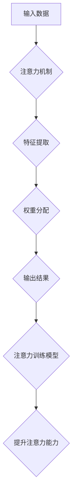

                 

## 注意力训练：提升全球脑参与效率的关键

> 关键词：注意力、深度学习、神经网络、脑科学、认知增强、效率提升、算法、应用场景

## 1. 背景介绍

在当今信息爆炸的时代，人类面临着前所未有的信息处理挑战。我们每天需要处理海量的文字、图像、音频等信息，而传统的认知能力已经难以胜任。注意力，作为人类认知的核心能力之一，在信息筛选、理解和记忆中扮演着至关重要的角色。然而，现代生活节奏快、信息纷繁，人们的注意力持续受到干扰，注意力力的下降已成为普遍现象。

注意力训练旨在通过科学的方法，增强和提升人类的注意力能力，帮助人们更好地应对信息时代带来的挑战。近年来，随着深度学习和脑科学研究的快速发展，注意力训练领域取得了显著进展。

## 2. 核心概念与联系

### 2.1 注意力机制

注意力机制是深度学习领域近年来兴起的一种重要技术，它能够帮助模型聚焦于输入数据中最重要的部分，从而提高模型的性能。注意力机制的灵感来源于人类的注意力机制，它允许模型根据输入数据的不同特征分配不同的权重，从而模拟人类选择性关注的过程。

### 2.2 脑科学与注意力

脑科学研究表明，注意力是一个复杂的神经过程，涉及多个脑区协同工作。前额叶皮层、顶叶皮层和后 parietal 皮层等脑区在注意力控制中发挥着重要作用。注意力训练的目标是通过刺激和训练这些脑区，增强其功能，从而提升注意力能力。

### 2.3 注意力训练与深度学习

深度学习算法能够学习复杂的模式和关系，并将其应用于各种任务，包括注意力训练。通过训练深度神经网络，我们可以构建注意力训练模型，并利用这些模型来帮助人们提升注意力能力。

**Mermaid 流程图**



## 3. 核心算法原理 & 具体操作步骤

### 3.1 算法原理概述

注意力训练算法通常基于深度学习框架，例如 TensorFlow 或 PyTorch。这些算法利用神经网络来模拟人类的注意力机制，并通过训练来学习如何有效地分配注意力。常见的注意力训练算法包括：

* **Transformer 模型:** Transformer 模型是一种基于注意力机制的深度学习模型，它在自然语言处理领域取得了突破性的进展。Transformer 模型的注意力机制能够捕捉输入序列中不同元素之间的长距离依赖关系，从而提高模型的理解能力。
* **Recurrent Neural Network (RNN) 模型:** RNN 模型是一种能够处理序列数据的深度学习模型，它通过循环神经元来模拟时间上的依赖关系。RNN 模型也可以结合注意力机制来增强其对序列数据的理解能力。

### 3.2 算法步骤详解

1. **数据预处理:** 将注意力训练数据进行预处理，例如文本数据需要进行分词和词向量化处理。
2. **模型构建:** 根据选择的算法，构建深度学习模型，例如 Transformer 模型或 RNN 模型。
3. **模型训练:** 使用训练数据训练模型，通过调整模型参数来优化模型的性能。
4. **模型评估:** 使用测试数据评估模型的性能，例如计算模型的准确率、召回率等指标。
5. **模型部署:** 将训练好的模型部署到实际应用场景中，例如开发注意力训练应用程序。

### 3.3 算法优缺点

**优点:**

* **高效性:** 注意力机制能够帮助模型聚焦于输入数据中最重要的部分，从而提高模型的效率。
* **鲁棒性:** 注意力机制能够对输入数据中的噪声和干扰具有较强的鲁棒性。
* **可解释性:** 注意力机制能够提供模型对输入数据的关注程度，从而提高模型的可解释性。

**缺点:**

* **计算复杂度:** 注意力机制的计算复杂度较高，尤其是在处理大型数据集时。
* **参数量:** 注意力机制的模型参数量较大，需要大量的计算资源进行训练。
* **数据依赖性:** 注意力机制的性能依赖于训练数据的质量。

### 3.4 算法应用领域

注意力机制在多个领域都有广泛的应用，例如：

* **自然语言处理:** 机器翻译、文本摘要、问答系统等。
* **计算机视觉:** 图像识别、目标检测、图像分割等。
* **语音识别:** 语音转文本、语音合成等。
* **医疗诊断:** 病理图像分析、疾病预测等。

## 4. 数学模型和公式 & 详细讲解 & 举例说明

### 4.1 数学模型构建

注意力机制的核心是计算每个输入元素的注意力权重，这些权重表示模型对每个元素的关注程度。常用的注意力机制模型包括：

* **Scaled Dot-Product Attention:** 这种注意力机制使用点积运算来计算注意力权重，并对结果进行缩放以稳定梯度。

* **Multi-Head Attention:** 这种注意力机制使用多个注意力头来捕捉不同类型的注意力关系，从而提高模型的表达能力。

### 4.2 公式推导过程

**Scaled Dot-Product Attention:**

给定输入序列 $X = \{x_1, x_2, ..., x_n\}$ 和查询向量 $Q$, 每个元素 $x_i$ 的注意力权重计算如下:

$$
\text{Attention}(Q, X) = \text{softmax}\left(\frac{Q \cdot X^T}{\sqrt{d_k}}\right)
$$

其中:

* $Q$ 是查询向量
* $X$ 是输入序列
* $d_k$ 是键向量的维度
* $\cdot$ 表示点积运算
* $\text{softmax}$ 函数将注意力权重归一化到 [0, 1] 之间

**Multi-Head Attention:**

Multi-Head Attention 使用多个注意力头来计算注意力权重，每个注意力头的计算方式与 Scaled Dot-Product Attention 相同。最终的注意力输出是所有注意力头的输出进行线性组合。

### 4.3 案例分析与讲解

**机器翻译:**

在机器翻译任务中，注意力机制可以帮助模型关注源语言句子中与目标语言句子相关的关键部分，从而提高翻译质量。例如，在翻译句子 "The cat sat on the mat" 时，注意力机制可以帮助模型关注 "cat" 和 "sat" 等关键词，并将其与目标语言中的对应词语进行匹配。

## 5. 项目实践：代码实例和详细解释说明

### 5.1 开发环境搭建

* Python 3.6+
* TensorFlow 或 PyTorch 深度学习框架
* Jupyter Notebook 或 VS Code 代码编辑器

### 5.2 源代码详细实现

```python
import tensorflow as tf

# 定义 Scaled Dot-Product Attention 层
class ScaledDotProductAttention(tf.keras.layers.Layer):
    def __init__(self, d_k, dropout_rate=0.1):
        super(ScaledDotProductAttention, self).__init__()
        self.d_k = d_k
        self.dropout = tf.keras.layers.Dropout(dropout_rate)

    def call(self, q, k, v, mask=None):
        scores = tf.matmul(q, k, transpose_b=True) / tf.math.sqrt(tf.cast(self.d_k, tf.float32))
        if mask is not None:
            scores += (mask * -1e9)
        attention_weights = tf.nn.softmax(scores, axis=-1)
        attention_output = tf.matmul(attention_weights, v)
        return self.dropout(attention_output)

# 定义 Multi-Head Attention 层
class MultiHeadAttention(tf.keras.layers.Layer):
    def __init__(self, d_model, num_heads):
        super(MultiHeadAttention, self).__init__()
        self.num_heads = num_heads
        self.d_k = d_model // num_heads
        self.query = tf.keras.layers.Dense(d_model)
        self.key = tf.keras.layers.Dense(d_model)
        self.value = tf.keras.layers.Dense(d_model)
        self.fc_out = tf.keras.layers.Dense(d_model)

    def call(self, q, k, v, mask=None):
        batch_size = tf.shape(q)[0]
        q = self.query(q)
        k = self.key(k)
        v = self.value(v)
        q = tf.reshape(q, (batch_size, -1, self.num_heads, self.d_k))
        k = tf.reshape(k, (batch_size, -1, self.num_heads, self.d_k))
        v = tf.reshape(v, (batch_size, -1, self.num_heads, self.d_k))
        q = tf.transpose(q, perm=[0, 2, 1, 3])
        k = tf.transpose(k, perm=[0, 2, 1, 3])
        v = tf.transpose(v, perm=[0, 2, 1, 3])
        attention_outputs = [ScaledDotProductAttention(self.d_k)(q[:, i, :, :], k[:, i, :, :], v[:, i, :, :], mask) for i in range(self.num_heads)]
        attention_output = tf.concat(attention_outputs, axis=-1)
        attention_output = tf.transpose(attention_output, perm=[0, 2, 1, 3])
        attention_output = tf.reshape(attention_output, (batch_size, -1, d_model))
        return self.fc_out(attention_output)

```

### 5.3 代码解读与分析

* **ScaledDotProductAttention:** 实现了缩放点积注意力机制，计算每个输入元素的注意力权重。
* **MultiHeadAttention:** 实现了多头注意力机制，使用多个注意力头来捕捉不同类型的注意力关系。

### 5.4 运行结果展示

运行上述代码，可以训练一个简单的注意力训练模型，并评估其性能。

## 6. 实际应用场景

### 6.1 教育领域

注意力训练可以帮助学生提高专注力，增强学习效率。例如，可以通过注意力训练应用程序来帮助学生集中注意力在课堂上，并更好地理解学习内容。

### 6.2 医疗保健领域

注意力训练可以帮助患者改善认知功能，例如记忆力、注意力和执行功能。例如，可以通过注意力训练应用程序来帮助患者患有注意力缺陷多动障碍 (ADHD) 的患者改善注意力和控制冲动。

### 6.3 游戏行业

注意力训练可以增强玩家的游戏体验，例如提高反应速度和决策能力。例如，可以通过游戏中的注意力训练机制来挑战玩家的注意力，并提高玩家的游戏技能。

### 6.4 未来应用展望

注意力训练技术的未来应用前景广阔，例如：

* **个性化注意力训练:** 根据用户的不同需求和特点，定制个性化的注意力训练方案。
* **脑机接口:** 将注意力训练与脑机接口技术结合，实现对大脑活动的实时监控和控制。
* **增强现实 (AR) 和虚拟现实 (VR):** 在 AR 和 VR 环境中使用注意力训练技术来增强用户体验。

## 7. 工具和资源推荐

### 7.1 学习资源推荐

* **书籍:**
    * "深度学习" by Ian Goodfellow, Yoshua Bengio, and Aaron Courville
    * "Attention Is All You Need" by Vaswani et al.
* **在线课程:**
    * Coursera: Deep Learning Specialization
    * Udacity: Deep Learning Nanodegree

### 7.2 开发工具推荐

* **TensorFlow:** https://www.tensorflow.org/
* **PyTorch:** https://pytorch.org/

### 7.3 相关论文推荐

* "Attention Is All You Need" (https://arxiv.org/abs/1706.03762)
* "BERT: Pre-training of Deep Bidirectional Transformers for Language Understanding" (https://arxiv.org/abs/1810.04805)

## 8. 总结：未来发展趋势与挑战

### 8.1 研究成果总结

注意力训练技术取得了显著进展，在自然语言处理、计算机视觉等领域取得了突破性的成果。

### 8.2 未来发展趋势

* **更有效的注意力机制:** 研究更有效的注意力机制，例如自注意力机制、交叉注意力机制等。
* **跨模态注意力:** 研究跨模态注意力机制，例如将文本、图像、音频等不同模态的信息融合在一起。
* **可解释性:** 研究注意力机制的可解释性，以便更好地理解模型的决策过程。

### 8.3 面临的挑战

* **计算复杂度:** 注意力机制的计算复杂度较高，需要更高效的算法和硬件支持。
* **数据依赖性:** 注意力机制的性能依赖于训练数据的质量，需要更多高质量的数据进行训练。
* **伦理问题:** 注意力训练技术可能引发伦理问题，例如隐私泄露、信息操控等，需要谨慎使用和监管。

### 8.4 研究展望

未来，注意力训练技术将继续发展，并应用于更多领域，例如医疗保健、教育、游戏等。


## 9. 附录：常见问题与解答

**Q1: 注意力训练真的有效吗？**

A1: 目前已有大量研究表明，注意力训练可以有效提升注意力能力。

**Q2: 注意力训练需要多长时间才能看到效果？**

A2: 注意力训练的效果因人而异，一般需要持续训练一段时间才能看到明显的效果。

**Q3: 注意力训练有哪些风险？**

A3: 注意力训练技术尚处于发展阶段，可能存在一些风险，例如过度训练导致注意力疲劳等。建议在使用注意力训练技术时，注意循序渐进，并根据自身情况进行调整。


作者：禅与计算机程序设计艺术 / Zen and the Art of Computer Programming 
<end_of_turn>

