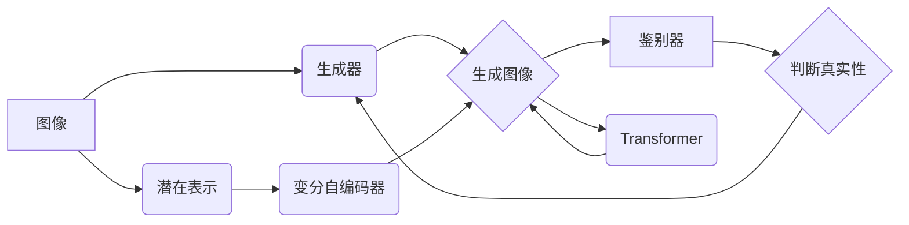

                 

## 深度学习在图像生成与编辑中的应用

> 关键词：深度学习、图像生成、图像编辑、生成对抗网络（GAN）、变分自编码器（VAE）、Transformer、图像超分辨率、图像修复、风格迁移

## 1. 背景介绍

图像在现代社会扮演着越来越重要的角色，从新闻报道到艺术创作，从医疗诊断到产品设计，图像无处不在。随着深度学习技术的快速发展，图像生成与编辑领域也迎来了前所未有的突破。深度学习算法能够学习图像的复杂特征，并生成逼真的新图像或编辑现有图像，为我们提供了强大的工具来创造、修改和理解图像数据。

传统的图像处理方法通常依赖于手工设计的特征和规则，而深度学习方法则能够自动学习图像的特征表示，从而实现更灵活、更强大的图像处理能力。近年来，深度学习在图像生成与编辑领域取得了显著的进展，例如：

* **生成逼真图像：** 生成对抗网络（GAN）能够生成逼真的图像，包括人脸、风景、物体等，甚至可以生成不存在的图像。
* **编辑图像内容：** 深度学习算法可以用来编辑图像内容，例如修复图像缺陷、改变图像风格、添加或删除图像元素等。
* **图像超分辨率：** 深度学习算法可以用来将低分辨率图像提升到高分辨率，提高图像质量。

这些应用已经开始改变我们与图像交互的方式，并为各个领域带来了新的可能性。

## 2. 核心概念与联系

### 2.1  生成对抗网络（GAN）

GAN 是一种由两个神经网络组成的框架，分别是生成器（Generator）和鉴别器（Discriminator）。生成器试图生成逼真的图像，而鉴别器试图区分真实图像和生成图像。这两个网络在对抗游戏中相互竞争，生成器不断改进生成图像的质量，而鉴别器不断提高识别真实图像的能力。最终，生成器能够生成与真实图像几乎 indistinguishable 的图像。

### 2.2  变分自编码器（VAE）

VAE 是一种用于图像生成和编辑的另一种深度学习模型。VAE 通过学习图像的潜在表示来生成图像。潜在表示是一个低维空间，可以捕捉图像的本质特征。VAE 可以用来生成新的图像，也可以用来编辑现有图像。

### 2.3  Transformer

Transformer 是一种基于注意力机制的神经网络架构，最初用于自然语言处理，但近年来也开始应用于图像生成和编辑领域。Transformer 可以学习图像的全局上下文信息，从而生成更具细节和一致性的图像。

**核心概念与联系流程图**



## 3. 核心算法原理 & 具体操作步骤

### 3.1  算法原理概述

GAN 和 VAE 都是基于深度学习的生成模型，它们通过学习图像的特征分布来生成新的图像。GAN 通过对抗训练来学习生成逼真图像，而 VAE 通过最小化重建误差来学习图像的潜在表示。Transformer 可以用于增强图像生成模型的性能，使其能够学习图像的全局上下文信息。

### 3.2  算法步骤详解

**生成对抗网络（GAN）**

1. **初始化生成器和鉴别器网络：** 生成器和鉴别器都是深度神经网络，初始权重随机初始化。
2. **训练鉴别器：** 使用真实图像和生成器生成的图像作为输入，训练鉴别器网络，使其能够区分真实图像和生成图像。
3. **训练生成器：** 使用鉴别器网络的输出作为反馈，训练生成器网络，使其能够生成能够欺骗鉴别器的图像。
4. **重复步骤 2 和 3：** 持续训练生成器和鉴别器网络，直到生成器能够生成逼真的图像。

**变分自编码器（VAE）**

1. **编码器：** 将输入图像编码到一个低维潜在空间中。
2. **解码器：** 将潜在空间中的表示解码回图像空间。
3. **训练目标：** 训练 VAE 的目标是最小化重建误差，即解码后的图像与输入图像之间的差异。

**Transformer**

1. **注意力机制：** Transformer 使用注意力机制来学习图像的全局上下文信息。
2. **多头注意力：** Transformer 使用多头注意力机制来捕捉图像的不同层次的特征。
3. **位置编码：** Transformer 使用位置编码来表示图像中每个像素的位置信息。

### 3.3  算法优缺点

**GAN**

* **优点：** 可以生成逼真的图像，能够学习复杂的图像分布。
* **缺点：** 训练过程不稳定，容易出现模式崩溃问题，生成图像的质量难以控制。

**VAE**

* **优点：** 训练过程相对稳定，能够生成多样化的图像，可以用于图像编辑。
* **缺点：** 生成的图像质量可能不如 GAN，难以生成非常复杂的图像。

**Transformer**

* **优点：** 可以学习图像的全局上下文信息，生成更具细节和一致性的图像。
* **缺点：** 计算量较大，训练成本高。

### 3.4  算法应用领域

* **图像生成：** 生成人脸、风景、物体等各种图像。
* **图像编辑：** 修复图像缺陷、改变图像风格、添加或删除图像元素等。
* **图像超分辨率：** 将低分辨率图像提升到高分辨率。
* **图像风格迁移：** 将一张图像的风格迁移到另一张图像。
* **医学图像分析：** 生成合成医学图像用于训练和测试算法。

## 4. 数学模型和公式 & 详细讲解 & 举例说明

### 4.1  数学模型构建

**生成对抗网络（GAN）**

* **生成器网络 G(z)：** 将一个随机噪声向量 $z$ 映射到一个图像 $G(z)$。
* **鉴别器网络 D(x)：** 将一个图像 $x$ 映射到一个概率 $D(x)$，表示该图像是真实图像的概率。

**变分自编码器（VAE）**

* **编码器网络 $q_\phi(z|x)$：** 将一个图像 $x$ 编码到一个潜在空间 $z$ 中。
* **解码器网络 $p_\theta(x|z)$：** 将一个潜在空间 $z$ 解码回图像 $x$。

**Transformer**

* **注意力机制：** 计算每个像素与其他像素之间的相关性，并根据相关性调整每个像素的权重。

### 4.2  公式推导过程

**生成对抗网络（GAN）**

* **生成器损失函数：** $L_G = E_{z \sim p_z(z)}[ -log(D(G(z)))]$
* **鉴别器损失函数：** $L_D = E_{x \sim p_{data}(x)}[ -log(D(x))] + E_{z \sim p_z(z)}[ -log(1 - D(G(z)))]$

**变分自编码器（VAE）**

* **重建误差：** $L_{recon} = E_{x \sim p_{data}(x)}[ -log(p_\theta(x|z))]$
* **KL 散度：** $L_{KL} = KL(q_\phi(z|x) || p(z))$
* **VAE 损失函数：** $L_{VAE} = L_{recon} + \lambda L_{KL}$

### 4.3  案例分析与讲解

**生成对抗网络（GAN）**

* **DeepFake：** 使用 GAN 生成逼真的视频，可以用来制作虚假视频，例如将一个人替换成另一个人的脸。

**变分自编码器（VAE）**

* **图像修复：** 使用 VAE 将损坏的图像修复，例如修复图像中的噪点或缺失部分。

**Transformer**

* **图像超分辨率：** 使用 Transformer 提升图像分辨率，例如将低分辨率图像转换为高分辨率图像。

## 5. 项目实践：代码实例和详细解释说明

### 5.1  开发环境搭建

* **操作系统：** Linux 或 macOS
* **编程语言：** Python
* **深度学习框架：** TensorFlow 或 PyTorch
* **其他依赖库：** NumPy、PIL、Matplotlib 等

### 5.2  源代码详细实现

以下是一个使用 TensorFlow 实现的简单 GAN 代码示例：

```python
import tensorflow as tf

# 定义生成器网络
def generator(z):
  # ...

# 定义鉴别器网络
def discriminator(x):
  # ...

# 定义损失函数和优化器
optimizer_G = tf.keras.optimizers.Adam(learning_rate=0.0002)
optimizer_D = tf.keras.optimizers.Adam(learning_rate=0.0002)
loss_fn = tf.keras.losses.BinaryCrossentropy()

# 训练循环
for epoch in range(num_epochs):
  for batch in dataset:
    # 训练鉴别器
    with tf.GradientTape() as tape_D:
      real_output = discriminator(real_images)
      fake_output = discriminator(generated_images)
      d_loss_real = loss_fn(tf.ones_like(real_output), real_output)
      d_loss_fake = loss_fn(tf.zeros_like(fake_output), fake_output)
      d_loss = d_loss_real + d_loss_fake
    gradients_D = tape_D.gradient(d_loss, discriminator.trainable_variables)
    optimizer_D.apply_gradients(zip(gradients_D, discriminator.trainable_variables))

    # 训练生成器
    with tf.GradientTape() as tape_G:
      fake_output = discriminator(generated_images)
      g_loss = loss_fn(tf.ones_like(fake_output), fake_output)
    gradients_G = tape_G.gradient(g_loss, generator.trainable_variables)
    optimizer_G.apply_gradients(zip(gradients_G, generator.trainable_variables))

```

### 5.3  代码解读与分析

* **生成器网络：** 生成器网络是一个多层神经网络，其输入是一个随机噪声向量，输出是一个图像。
* **鉴别器网络：** 鉴别器网络也是一个多层神经网络，其输入是一个图像，输出一个概率，表示该图像是真实图像的概率。
* **损失函数：** GAN 使用两个损失函数来训练生成器和鉴别器网络。生成器网络的目标是最大化鉴别器网络的错误率，而鉴别器网络的目标是最大化正确率。
* **优化器：** 使用 Adam 优化器来更新生成器和鉴别器网络的权重。

### 5.4  运行结果展示

训练完成后，可以生成新的图像，并与真实图像进行比较。

## 6. 实际应用场景

### 6.1  图像生成

* **艺术创作：** 使用 GAN 生成新的艺术作品，例如绘画、雕塑、音乐等。
* **游戏开发：** 使用 GAN 生成游戏中的场景、角色、道具等。
* **电影制作：** 使用 GAN 生成电影中的特效、场景、人物等。

### 6.2  图像编辑

* **图像修复：** 使用 VAE 修复图像中的损坏部分，例如修复图像中的噪点、缺失部分、模糊部分等。
* **图像风格迁移：** 使用 Transformer 将一张图像的风格迁移到另一张图像，例如将一张照片的风格迁移到油画风格。
* **人像编辑：** 使用 GAN 或 VAE 编辑人像，例如改变人像的年龄、性别、表情等。

### 6.3  其他应用场景

* **医学图像分析：** 使用 GAN 生成合成医学图像用于训练和测试算法。
* **遥感图像分析：** 使用 GAN 生成合成遥感图像用于训练和测试算法。
* **数据增强：** 使用 GAN 生成新的数据样本，用于训练机器学习模型。

### 6.4  未来应用展望

随着深度学习技术的不断发展，图像生成与编辑领域将会有更加广泛的应用。例如：

* **虚拟现实和增强现实：** 使用 GAN 生成逼真的虚拟场景和虚拟物体，为用户提供更加沉浸式的体验。
* **个性化内容生成：** 使用 GAN 生成个性化的内容，例如个性化的广告、个性化的新闻、个性化的娱乐内容等。
* **自动驾驶：** 使用 GAN 生成合成驾驶场景，用于训练自动驾驶算法。

## 7. 工具和资源推荐

### 7.1  学习资源推荐

* **书籍：**
    * Deep Learning by Ian Goodfellow, Yoshua Bengio, and Aaron Courville
    * Generative Deep Learning by David Foster
* **在线课程：**
    * Deep Learning Specialization by Andrew Ng (Coursera)
    * Generative Adversarial Networks (GANs) by David Foster (Udemy)
* **博客和网站：**
    * Distill.pub
    * Towards Data Science
    * OpenAI Blog

### 7.2  开发工具推荐

* **深度学习框架：** TensorFlow, PyTorch, Keras
* **图像处理库：** OpenCV, Pillow
* **可视化工具：** Matplotlib, Seaborn

### 7.3  相关论文推荐

* **Generative Adversarial Networks** by Ian Goodfellow et al. (2014)
* **Auto-Encoding Variational Bayes** by Diederik P. Kingma and Max Welling (2013)
* **Attention Is All You Need** by Ashish Vaswani et al. (2017)

## 8. 总结：未来发展趋势与挑战

### 8.1  研究成果总结

近年来，深度学习在图像生成与编辑领域取得了显著的进展，例如：

* **生成逼真图像：** GAN 能够生成逼真的图像，包括人脸、风景、物体等。
* **编辑图像内容：** VAE 和 Transformer 可以用来编辑图像内容，例如修复图像缺陷、改变图像风格、添加或删除图像元素等。
* **图像超分辨率：** 深度学习算法可以用来将低分辨率图像提升到高分辨率。

### 8.2  未来发展趋势

* **更高质量的图像生成：** 研究者们正在探索新的 GAN 架构和训练方法，以生成更高质量、更逼真的图像。
* **更灵活的图像编辑：** 研究者们正在开发新的 VAE 和 Transformer 模型，以实现更灵活、更精细的图像编辑。
* **更广泛的应用场景：** 深度学习在图像生成与编辑领域的应用将更加广泛，例如虚拟现实、增强现实、个性化内容生成等。

### 8.3  面临的挑战

* **训练效率：** 训练深度学习模型需要大量的计算资源和时间。
* **模式崩溃：** GAN 训练过程容易出现模式崩溃问题，导致生成的图像缺乏多样性。
* **伦理问题：** 深度学习在图像生成与编辑领域的应用可能带来伦理问题，例如虚假信息传播、隐私泄露等。

### 8.4  研究展望

未来，深度学习在图像生成与编辑领域的研究将更加深入，我们将看到更加逼真、更加灵活、更加安全的图像生成与编辑技术。


## 9. 附录：常见问题与解答

**Q1：GAN 和 VAE 的区别是什么？**

**A1：** GAN 和 VAE 都是深度学习生成模型，但它们的工作原理不同。GAN 使用对抗训练来学习生成逼真图像，而 VAE 使用变分推断来学习图像的潜在表示。

**Q2：如何解决 GAN 的模式崩溃问题？**

**A2：** 

* 使用更复杂的 GAN 架构，例如 WGAN、Progressive Growing of GANs 等。
* 使用更好的训练策略，例如梯度惩罚、标签平滑等。
* 使用更大的数据集和更强的计算资源。

**Q3：深度学习在图像生成与编辑领域有哪些伦理问题？**

**A3：** 

* **虚假信息传播：** 深度学习可以生成逼真的虚假图像，可能被用于传播虚假信息。
* **隐私泄露：** 深度学习模型可能泄露训练数据中的隐私信息。
* **深度伪造：** 深度学习可以用于生成深度伪造视频，可能被用于欺诈、诽谤等犯罪活动。


作者：禅与计算机程序设计艺术 / Zen and the Art of Computer Programming<end_of_turn>


