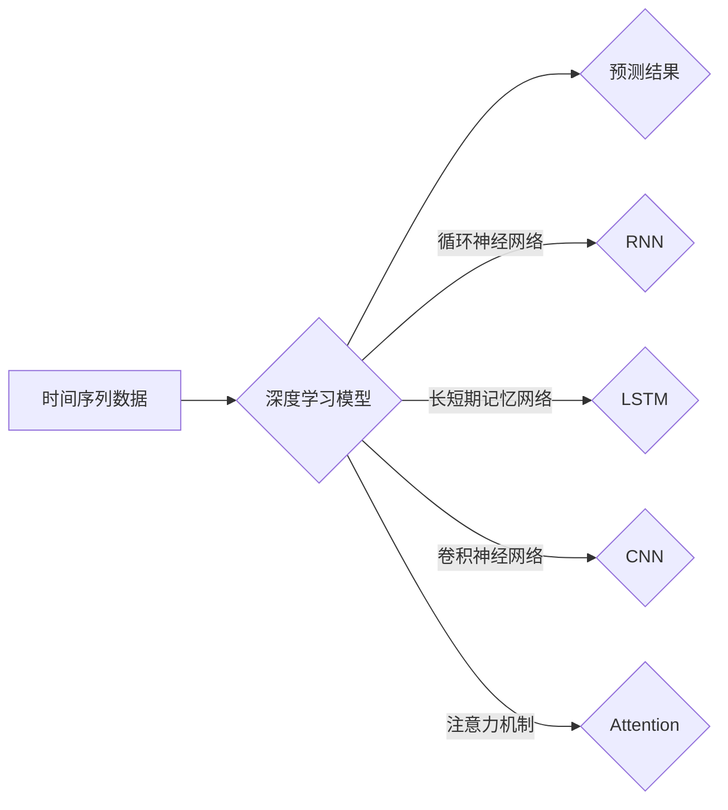

                 

## 深度学习在时间序列预测中的应用

> 关键词：深度学习、时间序列预测、循环神经网络、长短期记忆网络、卷积神经网络、注意力机制、预测模型、数据预处理

## 1. 背景介绍

时间序列预测是机器学习领域的重要应用之一，它涉及到预测未来一段时间内的数值趋势。从股票市场预测到天气预报，从用户行为分析到设备故障诊断，时间序列预测在各个领域都扮演着至关重要的角色。传统的时间序列预测方法，如ARIMA模型和SARIMA模型，虽然在某些情况下表现良好，但它们往往难以捕捉复杂的时间依赖关系，并且对非线性趋势和季节性变化的建模能力有限。

近年来，深度学习技术的快速发展为时间序列预测带来了新的机遇。深度学习模型能够自动学习复杂的特征表示，并有效地捕捉时间序列中的非线性模式和长程依赖关系。这使得深度学习在时间序列预测领域展现出强大的潜力，并取得了显著的成果。

## 2. 核心概念与联系

### 2.1 时间序列

时间序列是指随着时间推移而变化的数值数据序列。它通常具有以下特征：

* **顺序性:** 时间序列中的数据点按照时间顺序排列。
* **依赖性:** 时间序列中的数据点之间存在着一定的依赖关系，即当前数据点往往受到过去数据点的影响。
* **趋势:** 时间序列可能呈现出长期上升、下降或稳定的趋势。
* **季节性:** 时间序列可能存在周期性的波动，例如每天、每周或每年。

### 2.2 深度学习

深度学习是一种机器学习的子领域，它利用多层神经网络来学习数据的复杂特征表示。深度学习模型能够自动从数据中提取特征，无需人工特征工程。

### 2.3 深度学习在时间序列预测中的应用

深度学习模型能够有效地捕捉时间序列中的复杂模式和依赖关系，因此在时间序列预测领域取得了显著的成果。常见的深度学习模型用于时间序列预测包括：

* **循环神经网络 (RNN):** RNN 是一种专门设计用于处理序列数据的网络结构，它能够学习时间序列中的长期依赖关系。
* **长短期记忆网络 (LSTM):** LSTM 是 RNN 的一种改进型，它能够更好地处理长序列数据，并克服 RNN 的梯度消失问题。
* **卷积神经网络 (CNN):** CNN 通常用于图像处理，但也可以应用于时间序列预测。CNN 可以学习时间序列中的局部特征，并捕捉时间序列中的模式和趋势。
* **注意力机制:** 注意力机制可以帮助模型关注时间序列中重要的信息，并忽略不重要的信息，从而提高预测精度。

**核心概念与架构流程图**



## 3. 核心算法原理 & 具体操作步骤

### 3.1 算法原理概述

深度学习模型在时间序列预测中的核心原理是学习时间序列中的复杂模式和依赖关系。通过多层神经网络，模型能够自动提取特征，并构建一个映射关系，将历史数据映射到未来的预测值。

常见的深度学习模型，如 RNN、LSTM 和 CNN，都利用不同的机制来捕捉时间序列中的信息。RNN 通过循环连接来学习时间序列中的长期依赖关系，LSTM 通过门控机制来控制信息的流动，CNN 通过卷积操作来学习时间序列中的局部特征。

### 3.2 算法步骤详解

以下是使用深度学习模型进行时间序列预测的具体步骤：

1. **数据预处理:** 首先需要对时间序列数据进行预处理，包括清洗、归一化、平滑等操作。
2. **模型选择:** 根据时间序列的特点和预测任务，选择合适的深度学习模型。
3. **模型训练:** 使用训练数据训练深度学习模型，并通过优化算法调整模型参数，使模型能够准确地预测未来数据。
4. **模型评估:** 使用测试数据评估模型的预测精度，并根据评估结果进行模型调优。
5. **预测:** 使用训练好的模型对新的时间序列数据进行预测。

### 3.3 算法优缺点

**优点:**

* 能够捕捉复杂的时间依赖关系。
* 自动学习特征，无需人工特征工程。
* 预测精度高，能够超越传统方法。

**缺点:**

* 需要大量的训练数据。
* 训练时间长，计算资源消耗大。
* 模型解释性差，难以理解模型的决策过程。

### 3.4 算法应用领域

深度学习在时间序列预测领域有着广泛的应用，例如：

* **金融市场预测:** 股票价格、汇率、商品价格等。
* **天气预报:** 气温、降雨量、风速等。
* **用户行为预测:** 购买行为、浏览行为、点击行为等。
* **设备故障预测:** 故障发生时间、故障类型等。

## 4. 数学模型和公式 & 详细讲解 & 举例说明

### 4.1 数学模型构建

深度学习模型的数学模型通常基于神经网络的结构和激活函数。

**循环神经网络 (RNN)**

RNN 的核心思想是利用循环连接来学习时间序列中的长期依赖关系。RNN 的隐藏层状态 $h_t$ 在每个时间步 $t$ 都由前一个时间步的隐藏层状态 $h_{t-1}$ 和当前时间步的输入 $x_t$ 计算得到：

$$h_t = f(W_{xh}x_t + W_{hh}h_{t-1} + b_h)$$

其中，$W_{xh}$ 和 $W_{hh}$ 是权重矩阵，$b_h$ 是偏置项，$f$ 是激活函数。

**长短期记忆网络 (LSTM)**

LSTM 是 RNN 的一种改进型，它通过门控机制来控制信息的流动，从而更好地处理长序列数据。LSTM 包含三个门控：输入门、遗忘门和输出门。

**输入门:** 控制哪些信息被添加到隐藏层状态中。

$$i_t = \sigma(W_{xi}x_t + W_{hi}h_{t-1} + b_i)$$

**遗忘门:** 控制哪些信息被从隐藏层状态中遗忘。

$$f_t = \sigma(W_{xf}x_t + W_{hf}h_{t-1} + b_f)$$

**输出门:** 控制哪些信息被输出到下一个时间步。

$$o_t = \sigma(W_{xo}x_t + W_{ho}h_{t-1} + b_o)$$

**候选隐藏状态:** 计算新的候选隐藏状态。

$$\tilde{C}_t = tanh(W_{xc}x_t + W_{hc}h_{t-1} + b_c)$$

**隐藏状态:** 更新隐藏层状态。

$$C_t = f_t * C_{t-1} + i_t * \tilde{C}_t$$

$$h_t = o_t * tanh(C_t)$$

其中，$\sigma$ 是 sigmoid 函数，$tanh$ 是 hyperbolic tangent 函数。

### 4.2 公式推导过程

公式推导过程可以参考相关深度学习教材和论文。

### 4.3 案例分析与讲解

可以结合具体的案例分析 LSTM 模型的应用，例如预测股票价格或天气预报。

## 5. 项目实践：代码实例和详细解释说明

### 5.1 开发环境搭建

使用 Python 语言和深度学习框架 TensorFlow 或 PyTorch 进行开发。

### 5.2 源代码详细实现

使用 LSTM 模型对时间序列数据进行预测的代码示例：

```python
import tensorflow as tf

# 定义 LSTM 模型
model = tf.keras.Sequential([
    tf.keras.layers.LSTM(units=64, return_sequences=True, input_shape=(timesteps, features)),
    tf.keras.layers.LSTM(units=32),
    tf.keras.layers.Dense(units=1)
])

# 编译模型
model.compile(loss='mean_squared_error', optimizer='adam')

# 训练模型
model.fit(X_train, y_train, epochs=10, batch_size=32)

# 预测
predictions = model.predict(X_test)
```

### 5.3 代码解读与分析

代码示例中定义了一个 LSTM 模型，包含两层 LSTM 层和一层全连接层。模型使用均方误差作为损失函数，使用 Adam 优化器进行训练。

### 5.4 运行结果展示

使用测试数据对模型进行预测，并展示预测结果与真实值之间的误差。

## 6. 实际应用场景

### 6.1 金融市场预测

深度学习模型可以用于预测股票价格、汇率、商品价格等金融指标。

### 6.2 天气预报

深度学习模型可以用于预测气温、降雨量、风速等天气要素。

### 6.3 用户行为预测

深度学习模型可以用于预测用户的购买行为、浏览行为、点击行为等。

### 6.4 未来应用展望

随着深度学习技术的不断发展，其在时间序列预测领域的应用将更加广泛和深入。例如，可以利用深度学习模型进行更精准的预测，并结合其他技术，例如强化学习，实现智能决策。

## 7. 工具和资源推荐

### 7.1 学习资源推荐

* **书籍:**
    * 深度学习
    * 循环神经网络
* **在线课程:**
    * Coursera: 深度学习
    * Udacity: 构建深度学习模型
* **博客:**
    * TensorFlow Blog
    * PyTorch Blog

### 7.2 开发工具推荐

* **Python:** 深度学习开发的常用语言。
* **TensorFlow:** 开源深度学习框架。
* **PyTorch:** 开源深度学习框架。
* **Keras:** 高级深度学习 API，可以用于 TensorFlow 和 Theano。

### 7.3 相关论文推荐

* **Sequence to Sequence Learning with Neural Networks**
* **Long Short-Term Memory**
* **Attention Is All You Need**

## 8. 总结：未来发展趋势与挑战

### 8.1 研究成果总结

深度学习在时间序列预测领域取得了显著的成果，能够有效地捕捉复杂的时间依赖关系，并实现高精度预测。

### 8.2 未来发展趋势

* **模型架构创新:** 探索新的深度学习模型架构，例如 Transformer 和 Graph Neural Networks，以更好地处理更复杂的时间序列数据。
* **数据增强:** 开发新的数据增强技术，以提高模型的泛化能力。
* **解释性:** 研究深度学习模型的解释性，使其决策过程更加透明。

### 8.3 面临的挑战

* **数据质量:** 深度学习模型对数据质量要求较高，需要大量的干净、准确的数据进行训练。
* **计算资源:** 训练深度学习模型需要大量的计算资源，这对于一些小型企业或个人开发者来说是一个挑战。
* **模型可解释性:** 深度学习模型的决策过程往往难以理解，这对于一些需要解释模型决策的应用场景来说是一个挑战。

### 8.4 研究展望

未来，深度学习在时间序列预测领域将继续发展，并应用于更多领域。研究者将继续探索新的模型架构、数据增强技术和解释性方法，以提高模型的性能和可解释性。


## 9. 附录：常见问题与解答

### 9.1 如何选择合适的深度学习模型？

选择合适的深度学习模型取决于时间序列的特点和预测任务。

* **短期预测:** 可以使用简单的 RNN 或 LSTM 模型。
* **长期预测:** 可以使用更复杂的 LSTM 模型或 Transformer 模型。
* **非线性趋势:** 可以使用 CNN 或 Transformer 模型。
* **季节性变化:** 可以使用季节性自回归模型 (SARIMA) 或结合深度学习模型进行预测。

### 9.2 如何处理时间序列数据中的缺失值？

可以采用以下方法处理时间序列数据中的缺失值：

* **线性插值:** 使用前后的数据点线性插值缺失值。
* **多项式插值:** 使用多项式函数插值缺失值。
* **平均值填充:** 使用时间序列中相同位置的数据点的平均值填充缺失值。
* **机器学习方法:** 使用机器学习模型预测缺失值。

### 9.3 如何评估深度学习模型的预测精度？

常用的评估指标包括均方误差 (MSE)、平均绝对误差 (MAE) 和 R-squared。

**作者：禅与计算机程序设计艺术 / Zen and the Art of Computer Programming**<end_of_turn>

